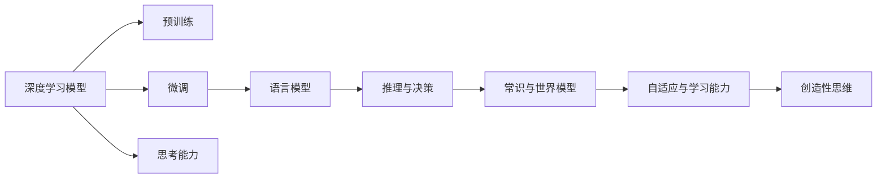

                 

# 计算：第四部分 计算的极限 第 12 章 机器能思考吗 ChatGPT 的原理

## 1. 背景介绍

在计算的极限一章中，我们探讨了计算的边界以及计算机如何通过算法和数据驱动人类社会。而今天，我们将进一步深入，研究一个引发广泛思考的话题：机器是否能思考？尤其是ChatGPT这一类先进的自然语言处理模型，它们表现出了令人惊讶的智能，究竟它们是否具备真正的思考能力？

### 1.1 问题由来
随着人工智能和机器学习技术的发展，ChatGPT及其后继者们（如GPT-3、GPT-4等）在自然语言处理领域取得了巨大的突破。这些模型通过大规模预训练和微调，能够在理解和生成自然语言方面表现出极高的能力。然而，它们是否具备了真正的思考能力，这一问题引起了广泛的热烈讨论。

### 1.2 问题核心关键点
关于机器是否能够思考的问题，主要关注以下几个核心关键点：
1. **语言理解与生成**：ChatGPT是否能真正理解并生成符合上下文逻辑的语句。
2. **推理与决策**：ChatGPT是否具备逻辑推理和决策的能力，能够处理复杂的逻辑任务。
3. **常识与世界模型**：ChatGPT是否具备常识和构建世界模型的能力。
4. **自适应与学习能力**：ChatGPT是否能够自适应新环境，并在新环境中学习。
5. **创造性思维**：ChatGPT是否能进行创造性思维，生成具有创新性的内容。

## 2. 核心概念与联系

### 2.1 核心概念概述

为了深入理解ChatGPT的工作原理，我们将介绍一些核心概念：

- **深度学习模型**：特别是Transformer模型，它们是ChatGPT等先进模型背后的核心技术。
- **预训练**：在大规模无标注数据上进行的深度学习模型训练过程。
- **微调**：基于标注数据对预训练模型进行特定任务优化，以适应实际应用。
- **语言模型**：如GPT-3和ChatGPT，能够预测下一个单词或符号的模型。
- **自适应**：模型在不断接触新数据时，调整自身参数以适应新环境的能力。
- **思考能力**：机器是否能够进行逻辑推理、常识推理、创造性思维等。

这些概念构成了ChatGPT模型的基础，但它们之间如何相互作用，共同驱动ChatGPT的思考和表现，是我们需要深入探讨的。

### 2.2 核心概念原理和架构的 Mermaid 流程图(Mermaid 流程节点中不要有括号、逗号等特殊字符)



## 3. 核心算法原理 & 具体操作步骤

### 3.1 算法原理概述

ChatGPT的工作原理主要基于深度学习和神经网络技术，特别是Transformer模型。通过在大规模无标签数据上进行预训练，模型学习到了语言的通用表示。然后再通过微调，模型能够适应特定任务，如问答、文本生成等。

### 3.2 算法步骤详解

#### 3.2.1 预训练

1. **大规模数据集**：ChatGPT模型通常使用大规模无标签文本数据集进行预训练，如Netflix的字幕、Reddit的评论区等。
2. **语言模型目标**：模型通过最大化预测下一个单词或符号的概率，来优化模型参数。
3. **Transformer架构**：使用自注意力机制和多层次编码器，使得模型能够捕捉长距离依赖关系。

#### 3.2.2 微调

1. **选择任务**：选择特定的下游任务，如问答、文本生成等。
2. **标注数据**：收集任务的标注数据，如Q&A对、文本生成样本等。
3. **模型适配**：在预训练模型基础上，添加或修改特定任务的适配层，如分类器或解码器。
4. **优化器选择**：选择如Adam等优化器，并设置学习率、批大小等超参数。
5. **训练循环**：使用训练集数据进行迭代训练，直到收敛或达到预设轮数。

#### 3.2.3 推理与决策

1. **前向传播**：将输入文本传递给模型，计算输出。
2. **损失函数**：根据模型输出和真实标签计算损失函数。
3. **反向传播**：计算梯度并更新模型参数。
4. **解码**：使用解码器生成输出文本。
5. **评价指标**：如BLEU、ROUGE等指标，用于评估模型性能。

### 3.3 算法优缺点

#### 3.3.1 优点

1. **高精度**：通过大规模预训练和微调，ChatGPT在理解自然语言和生成文本方面表现出色。
2. **泛化能力强**：模型能够适应不同领域和任务，并具备一定程度的泛化能力。
3. **高效学习**：通过微调，ChatGPT能够快速适应新任务，并在新环境中学习。
4. **可解释性强**：相较于黑盒模型，ChatGPT的输出可以被解释和分析。

#### 3.3.2 缺点

1. **依赖数据**：ChatGPT的表现高度依赖于训练数据的数量和质量。
2. **过拟合风险**：在微调过程中，模型容易过拟合，尤其是训练数据较少时。
3. **公平性与偏见**：模型可能继承预训练数据的偏见，导致输出不够公正。
4. **安全与隐私**：模型可能生成有害、误导性内容，威胁用户安全与隐私。
5. **计算资源消耗大**：大规模模型的训练和推理需要大量的计算资源。

### 3.4 算法应用领域

ChatGPT等大语言模型已经被广泛应用于以下几个领域：

- **客户服务**：提供自动回复和聊天机器人。
- **教育**：辅助教学和语言学习。
- **医疗**：辅助诊断和治疗。
- **内容生成**：自动生成文章、报告、摘要等。
- **研究**：辅助科学研究和数据分析。
- **娱乐**：生成故事、游戏对话等。

## 4. 数学模型和公式 & 详细讲解 & 举例说明

### 4.1 数学模型构建

ChatGPT模型通常使用Transformer架构，其数学模型构建如下：

1. **输入表示**：将输入文本编码成向量形式。
2. **编码器**：多层次编码器，通过自注意力机制捕捉长距离依赖关系。
3. **解码器**：通过解码器生成输出文本。
4. **损失函数**：如交叉熵损失，用于训练模型。
5. **优化器**：如AdamW，用于优化模型参数。

### 4.2 公式推导过程

#### 4.2.1 自注意力机制

$$
\text{Attention}(Q,K,V) = \frac{\text{exp}(\frac{QK^T}{\sqrt{d_k}})}{\sum_{i=1}^N \text{exp}(\frac{QK^T}{\sqrt{d_k}})}
$$

其中，$Q$、$K$、$V$分别为查询、键、值向量，$d_k$为嵌入向量的维度。

#### 4.2.2 编码器-解码器模型

$$
\text{Encoder-Decoder} = \text{MLP}(\text{Attention}(Q,K,V))
$$

其中，MLP为多层次感知机。

### 4.3 案例分析与讲解

以文本生成为例，ChatGPT通过预训练模型和微调模型进行文本生成任务。具体步骤如下：

1. **预训练模型**：使用大规模文本数据进行预训练，学习语言的通用表示。
2. **微调模型**：基于特定任务的数据集进行微调，调整模型参数以适应任务。
3. **文本生成**：输入任务描述，通过微调模型生成符合任务要求的文本。

## 5. 项目实践：代码实例和详细解释说明

### 5.1 开发环境搭建

- **Python**：安装Python 3.7及以上版本。
- **PyTorch**：安装PyTorch 1.6及以上版本。
- **HuggingFace Transformers**：安装Transformers 4.0及以上版本。

### 5.2 源代码详细实现

```python
from transformers import AutoTokenizer, AutoModelForCausalLM
import torch

# 加载预训练模型和tokenizer
tokenizer = AutoTokenizer.from_pretrained('gpt3')
model = AutoModelForCausalLM.from_pretrained('gpt3')

# 输入文本
input_text = "Who was the first president of the United States?"

# 将文本转换为token ids
input_ids = tokenizer.encode(input_text)

# 生成文本
with torch.no_grad():
    outputs = model.generate(input_ids, max_length=50, top_k=50, top_p=0.9, num_return_sequences=1)

# 解码输出
generated_text = tokenizer.decode(outputs[0], skip_special_tokens=True)
print(generated_text)
```

### 5.3 代码解读与分析

1. **预训练模型和tokenizer**：使用HuggingFace的预训练模型和tokenizer。
2. **输入文本**：将文本转换为token ids。
3. **生成文本**：使用generate函数生成文本。
4. **解码输出**：将生成文本解码为可读形式。

## 6. 实际应用场景

### 6.1 客户服务

ChatGPT可以用于构建智能客服系统，自动回答客户咨询，提供24/7服务。具体应用场景包括：

- **FAQ自动回复**：针对常见问题自动生成回答。
- **对话机器人**：与客户进行自然对话，提供个性化服务。
- **多语言支持**：支持多语言自动回复，提升用户体验。

### 6.2 教育

在教育领域，ChatGPT可以用于辅助语言学习和教学：

- **个性化教学**：根据学生特点生成个性化练习和辅导。
- **语言练习**：生成练习题和对话，帮助学生提高语言能力。
- **知识库查询**：提供智能查询功能，帮助学生快速查找资料。

### 6.3 医疗

ChatGPT可以用于医疗领域，辅助医生诊断和治疗：

- **病历摘要**：自动生成病历摘要，帮助医生快速了解患者情况。
- **症状诊断**：根据症状自动生成可能的诊断结果。
- **药物推荐**：根据患者情况，生成药物推荐。

### 6.4 未来应用展望

未来的ChatGPT将具备更强的智能和适应性，广泛应用于更多领域：

- **智能家居**：控制家电、提供智能服务。
- **自动驾驶**：生成导航指令，辅助驾驶。
- **科学研究**：生成研究报告、辅助数据分析。
- **创意工作**：生成文章、设计方案等。
- **全球协作**：提供多语言翻译和文化交流服务。

## 7. 工具和资源推荐

### 7.1 学习资源推荐

- **深度学习书籍**：如《深度学习》、《神经网络与深度学习》等。
- **在线课程**：如Coursera上的深度学习课程。
- **论文集**：如《自然语言处理综述》等。

### 7.2 开发工具推荐

- **PyTorch**：开源深度学习框架，支持动态图和静态图。
- **TensorFlow**：Google开发的深度学习框架，支持分布式计算。
- **HuggingFace Transformers**：支持多种NLP模型的库。

### 7.3 相关论文推荐

- **Attention is All You Need**：Transformer原论文。
- **GPT-3: Language Models are Unsupervised Multitask Learners**：OpenAI的GPT-3论文。
- **BART: Denoising Sequence-to-Sequence Pre-training for Natural Language Processing**：Facebook的BART模型论文。

## 8. 总结：未来发展趋势与挑战

### 8.1 研究成果总结

ChatGPT等大语言模型的发展，标志着自然语言处理技术的重大突破。它们在理解自然语言、生成文本等方面表现出色，但思考能力仍需进一步验证。

### 8.2 未来发展趋势

1. **模型规模持续增大**：更大规模的预训练模型将带来更强的语言理解和生成能力。
2. **更强的泛化能力**：模型将在更多领域展现出泛化能力。
3. **更高的智能水平**：未来ChatGPT将具备更强的智能和适应性。
4. **多模态融合**：结合视觉、听觉等多模态数据，提升模型能力。

### 8.3 面临的挑战

1. **计算资源消耗**：大规模模型的训练和推理需要大量计算资源。
2. **数据依赖性**：模型高度依赖于训练数据的数量和质量。
3. **公平性与偏见**：模型可能继承预训练数据的偏见。
4. **安全与隐私**：模型可能生成有害、误导性内容。

### 8.4 研究展望

1. **模型的可解释性**：研究模型的可解释性，确保其决策过程透明。
2. **多模态融合**：结合多模态数据，提升模型能力。
3. **更强的推理能力**：研究如何增强模型的推理和决策能力。
4. **公平性算法**：开发公平性算法，消除偏见。

## 9. 附录：常见问题与解答

**Q1: 如何训练一个基于预训练语言模型的生成模型？**

A: 训练一个基于预训练语言模型的生成模型，需要以下步骤：
1. 选择预训练语言模型作为初始化参数。
2. 准备数据集，包括训练集、验证集和测试集。
3. 添加任务适配层，如分类器或解码器。
4. 设置优化器、学习率、批大小等超参数。
5. 使用训练集进行迭代训练，直到模型收敛。

**Q2: 预训练语言模型是否具有思考能力？**

A: 预训练语言模型不具备真正的思考能力，它们只能通过大量数据学习语言的规律和模式。尽管它们在自然语言理解和生成方面表现出色，但并不具备真正的逻辑推理和决策能力。

**Q3: ChatGPT的思考能力来源于何处？**

A: ChatGPT的思考能力来源于大规模预训练和微调，模型在大规模无标签数据上进行预训练，学习到语言的通用表示。然后再通过微调，模型能够适应特定任务，如问答、文本生成等。

**Q4: 如何评估ChatGPT的智能水平？**

A: 评估ChatGPT的智能水平可以通过以下方式：
1. 评估其在特定任务上的性能，如BLEU、ROUGE等指标。
2. 进行多轮对话测试，评估其逻辑推理和知识应用能力。
3. 研究其生成的文本内容，判断其创造性思维能力。

**Q5: 如何提高ChatGPT的泛化能力？**

A: 提高ChatGPT的泛化能力，可以从以下几个方面入手：
1. 增加数据量，提高模型对多样性的适应能力。
2. 引入多模态数据，提升模型的多模态融合能力。
3. 设计更强的正则化技术，防止模型过拟合。
4. 采用更高效的优化算法，提高模型的训练效率。

---

作者：禅与计算机程序设计艺术 / Zen and the Art of Computer Programming

