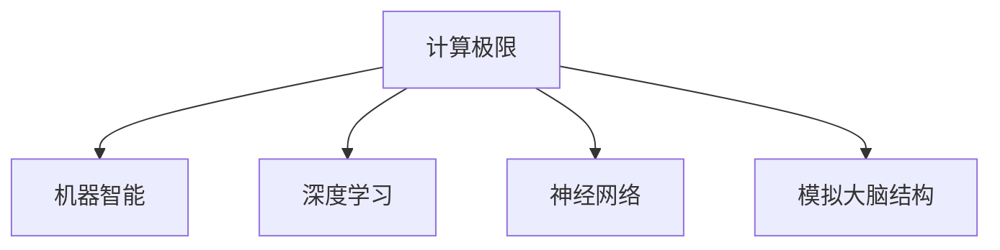

                 

# 计算：第四部分 计算的极限 第 12 章 机器能思考吗 模拟大脑的结构

> 关键词：计算极限,机器智能,大脑模拟,神经网络,深度学习

## 1. 背景介绍

### 1.1 问题由来

在计算机科学的发展历程中，探索机器是否能像人类一样进行智能思考一直是重要的研究方向。自1950年代阿兰·图灵提出图灵测试以来，科学家们不断尝试通过模拟人类大脑的机制，构建能够像人类一样进行学习和推理的机器智能系统。

随着人工智能技术的不断进步，特别是深度学习的发展，研究人员在机器智能模拟方面取得了显著进展。然而，尽管目前已经构建出了能够进行复杂决策和自然语言处理的机器系统，它们是否已经具备了真正意义上的智能思考能力，仍然是一个亟待解答的问题。

### 1.2 问题核心关键点

本文将探讨以下核心问题：
- 机器能否像人类大脑一样进行复杂思考和推理？
- 机器智能与人类智能的本质区别是什么？
- 如何模拟大脑的结构，构建能够进行智能思考的机器系统？

这些问题不仅关乎机器智能的发展方向，也对我们理解和应用人工智能技术具有重要的指导意义。

## 2. 核心概念与联系

### 2.1 核心概念概述

为更好地理解机器智能的模拟，本节将介绍几个密切相关的核心概念：

- 计算极限(Computational Limit): 指计算机在一定时间内可以执行的计算任务的上限。根据图灵机理论，任何可以由计算机解决的问题都可以在多项式时间内解决，即P=NP。

- 机器智能(Machine Intelligence): 指计算机或机器系统通过算法和数据处理能够展示出的类似人类智能的能力，如学习、推理、决策等。

- 深度学习(Deep Learning): 基于人工神经网络的机器学习范式，通过多层次的非线性变换提取数据特征，用于图像识别、自然语言处理等任务。

- 神经网络(Neural Network): 由大量人工神经元组成的网络结构，用于模拟人类大脑的神经元结构和信息处理方式。

- 模拟大脑结构(Brain Simulation): 通过构建具有神经元结构和突触连接的模型，模拟大脑的信息处理和认知过程。

这些核心概念之间的逻辑关系可以通过以下Mermaid流程图来展示：



这个流程图展示了大规模计算极限、机器智能、深度学习、神经网络和大脑模拟之间的逻辑关系：

1. 计算极限规定了计算机可以处理问题的边界。
2. 机器智能依赖于深度学习等技术，通过神经网络进行信息处理。
3. 神经网络模仿人类大脑的神经元结构和信息处理方式。
4. 大脑模拟进一步揭示了大脑的认知机制，为神经网络提供理论指导。

这些概念共同构成了机器智能模拟的理论基础，推动了人工智能技术的发展。

## 3. 核心算法原理 & 具体操作步骤

### 3.1 算法原理概述

机器智能的模拟，本质上是一个通过计算和算法构建具有认知能力系统的过程。其核心思想是：将人类大脑的结构和功能抽象为数学模型，通过计算实现类似的人类智能行为。

具体来说，模拟大脑结构的过程可以分解为以下几个关键步骤：

1. 定义大脑的基本单元：神经元和突触。
2. 建立神经元间的连接关系和信号传递机制。
3. 设计神经元的激活函数和传递规则。
4. 应用反向传播算法进行模型训练和优化。
5. 通过外部输入和输出模拟认知过程。

### 3.2 算法步骤详解

以下是模拟大脑结构的具体操作步骤：

**Step 1: 定义神经元结构和突触连接**
- 神经元结构: 定义神经元的形态和功能，如树突、轴突、细胞体等。
- 突触连接: 定义神经元之间的连接方式和传递信号的强度，如轴突-树突连接、抑制性突触、兴奋性突触等。

**Step 2: 设计神经元激活函数和传递规则**
- 激活函数: 定义神经元的输出值，如 sigmoid、tanh、ReLU 等。
- 传递规则: 定义神经元之间的信号传递方式，如全连接、卷积、池化等。

**Step 3: 建立神经网络模型**
- 定义输入层、隐藏层和输出层，连接所有神经元形成网络结构。
- 设定每层神经元的数量和连接方式，构建完整的神经网络模型。

**Step 4: 应用反向传播算法进行训练**
- 准备训练数据，定义损失函数和优化器。
- 使用反向传播算法计算梯度，更新模型参数，最小化损失函数。

**Step 5: 模拟认知过程**
- 定义外部输入和输出接口，输入刺激信号。
- 通过神经网络模型进行信息处理和推理，输出结果。

### 3.3 算法优缺点

模拟大脑结构的算法具有以下优点：
1. 可以揭示大脑的认知机制，为神经网络提供理论指导。
2. 通过反向传播算法，神经网络可以高效学习复杂模式和规律。
3. 神经网络在图像识别、自然语言处理等任务中表现优异。

同时，该算法也存在一些局限性：
1. 计算复杂度高，训练时间长。
2. 依赖大量数据，需要高性能计算资源。
3. 难以解释模型决策过程，缺乏可解释性。
4. 易受数据分布和噪声影响，泛化性能有限。

尽管存在这些局限性，但模拟大脑结构的方法依然是构建机器智能系统的重要途径，为人工智能技术的发展提供了理论基础。

### 3.4 算法应用领域

模拟大脑结构的算法已经在以下领域得到了广泛应用：

- 图像识别：通过卷积神经网络(CNN)模拟人类视觉处理机制，实现高效的图像分类和识别。
- 自然语言处理：通过循环神经网络(RNN)和长短时记忆网络(LSTM)模拟人类语言处理机制，实现文本生成、情感分析等任务。
- 机器人控制：通过神经网络模拟人类运动控制和决策过程，实现智能机器人的操作和交互。
- 游戏AI：通过强化学习算法和神经网络模拟人类游戏决策，实现智能游戏角色的控制和策略优化。
- 医学诊断：通过深度学习算法和神经网络模拟人类大脑结构和功能，实现疾病诊断和预测。

除了上述这些经典应用外，模拟大脑结构的方法还正在被应用于更多新兴领域，如自动驾驶、智能制造、虚拟现实等，为人工智能技术带来了新的突破。

## 4. 数学模型和公式 & 详细讲解 & 举例说明

### 4.1 数学模型构建

本节将使用数学语言对模拟大脑结构的过程进行更加严格的刻画。

记神经元结构为 $N=\{n_1,n_2,...,n_M\}$，每个神经元 $n_i$ 的激活函数为 $f_i(\cdot)$，输入连接为 $I_i=\{x_{i1},x_{i2},...,x_{in_i}\}$，输出连接为 $O_i=\{y_{i1},y_{i2},...,y_{im_i}\}$，连接权重为 $W_i=\{w_{ij}\}$，偏置项为 $b_i$。则神经元的输出为：

$$
h_i = f_i(\sum_{j=1}^{m_i}w_{ij}x_{ij}+b_i)
$$

所有神经元的输出构成隐藏层 $H$，输出层为 $O$，输出连接权重为 $W_O=\{w_{ol}\}$，偏置项为 $b_O$。则整个神经网络的输出为：

$$
y = g(\sum_{l=1}^{m_O}w_{ol}h_l+b_O)
$$

其中 $g$ 为激活函数，如 sigmoid、tanh 等。

### 4.2 公式推导过程

以下我们将推导反向传播算法的具体计算过程。

记神经元的激活函数 $f_i$ 为可导函数，神经元的输入连接 $I_i$ 和输出连接 $O_i$ 的权重 $W_i$ 和偏置项 $b_i$ 均为向量，神经元 $n_i$ 的输出 $h_i$ 为标量，隐藏层 $H$ 的输出 $H$ 为向量，输出层 $O$ 的输出 $y$ 为标量。设神经元的输入 $x$ 和输出 $y$ 均为向量，隐藏层 $H$ 的输出 $h$ 为向量，输出层 $O$ 的输出 $y$ 为标量。

定义损失函数为 $L(y^*, y)$，神经元的激活函数为 $f$，神经元的输出为 $h$，神经元的激活函数梯度为 $f'$，神经元的输出梯度为 $h'$，隐藏层 $H$ 的输出梯度为 $h'$，输出层 $O$ 的输出梯度为 $y'$。则反向传播算法的具体计算过程如下：

1. 前向传播计算神经元输出：
$$
y = f(\sum_{i=1}^{m_O}w_{ol}h_l+b_O)
$$
$$
h_l = f(\sum_{j=1}^{m_l}w_{lj}h_{l-1}+b_l)
$$
$$
...
$$
$$
h_1 = f(\sum_{j=1}^{m_1}w_{j1}x_j+b_1)
$$

2. 反向传播计算神经元梯度：
$$
y' = \frac{\partial L(y^*, y)}{\partial y}
$$
$$
h'_l = \frac{\partial L(y^*, y)}{\partial h_l}
$$
$$
w'_{lj} = \frac{\partial h'_l}{\partial w_{lj}} = \frac{\partial f(h_l)}{\partial w_{lj}} \frac{\partial h'_l}{\partial h_l}
$$
$$
b'_l = \frac{\partial h'_l}{\partial b_l} = \frac{\partial f(h_l)}{\partial h_l}
$$
$$
...
$$
$$
h'_1 = \frac{\partial y'}{\partial h_1}
$$

3. 更新神经元参数：
$$
w_{lj} = w_{lj} - \eta \frac{\partial h'_l}{\partial w_{lj}}
$$
$$
b_l = b_l - \eta \frac{\partial h'_l}{\partial b_l}
$$

其中 $\eta$ 为学习率。

通过上述公式，反向传播算法可以高效计算神经网络中的梯度，更新模型参数，最小化损失函数，从而实现神经网络的训练和优化。

### 4.3 案例分析与讲解

以下将以简单的二分类问题为例，展示反向传播算法的具体应用。

设训练样本 $(x_1, y_1), (x_2, y_2), ..., (x_n, y_n)$，其中 $x_i \in \mathbb{R}^d$ 为输入，$y_i \in \{0, 1\}$ 为标签。定义一个包含一个隐藏层的神经网络模型，输入层为 $d$ 个神经元，隐藏层为 $m$ 个神经元，输出层为 1 个神经元。则神经网络的输出为：

$$
y = f_1(f_2(\sum_{j=1}^{m}w_{1j}h_{j}+b_1))
$$

其中 $f_1$ 和 $f_2$ 分别为输出层和隐藏层的激活函数，$w_{1j}$ 和 $b_1$ 分别为输出层和隐藏层的权重和偏置项。

设损失函数为交叉熵损失函数：

$$
L(y, y^*) = -\frac{1}{n}\sum_{i=1}^{n}(y_i \log y_i + (1-y_i)\log(1-y_i))
$$

则反向传播算法的计算过程如下：

1. 前向传播计算神经元输出：
$$
z = \sum_{j=1}^{m}w_{1j}h_{j}+b_1
$$
$$
h = f(z)
$$
$$
y = f_1(h)
$$

2. 反向传播计算神经元梯度：
$$
y' = \frac{\partial L(y, y^*)}{\partial y} = \frac{y-y^*}{y(1-y)}
$$
$$
h' = \frac{\partial L(y, y^*)}{\partial h} = f'(z)y' = (f(z) - f^*(z))\frac{y-y^*}{y(1-y)}
$$
$$
w' = \frac{\partial h'}{\partial w} = h'h = f'(z)y'h
$$
$$
b' = \frac{\partial h'}{\partial b} = f'(z)h'
$$

3. 更新神经元参数：
$$
w_{1j} = w_{1j} - \eta w'_j
$$
$$
b_1 = b_1 - \eta b'
$$

通过上述公式，我们可以计算出神经网络中每个神经元的梯度，并使用反向传播算法更新模型参数，最小化交叉熵损失函数。

## 5. 项目实践：代码实例和详细解释说明

### 5.1 开发环境搭建

在进行模拟大脑结构的项目实践前，我们需要准备好开发环境。以下是使用Python进行TensorFlow开发的环境配置流程：

1. 安装Anaconda：从官网下载并安装Anaconda，用于创建独立的Python环境。

2. 创建并激活虚拟环境：
```bash
conda create -n tensorflow-env python=3.8 
conda activate tensorflow-env
```

3. 安装TensorFlow：根据CUDA版本，从官网获取对应的安装命令。例如：
```bash
conda install tensorflow tensorflow-gpu=2.4.1 -c tf -c conda-forge
```

4. 安装各类工具包：
```bash
pip install numpy pandas scikit-learn matplotlib tqdm jupyter notebook ipython
```

完成上述步骤后，即可在`tensorflow-env`环境中开始项目实践。

### 5.2 源代码详细实现

这里我们以手写数字识别为例，展示使用TensorFlow对神经网络进行训练和优化的PyTorch代码实现。

首先，定义数据集和预处理函数：

```python
import tensorflow as tf
from tensorflow.keras.datasets import mnist
from tensorflow.keras.utils import to_categorical

# 加载MNIST数据集
(x_train, y_train), (x_test, y_test) = mnist.load_data()

# 数据预处理
x_train = x_train.reshape((60000, 28, 28, 1)) / 255.0
x_test = x_test.reshape((10000, 28, 28, 1)) / 255.0
y_train = to_categorical(y_train, num_classes=10)
y_test = to_categorical(y_test, num_classes=10)
```

然后，定义神经网络模型和优化器：

```python
from tensorflow.keras.models import Sequential
from tensorflow.keras.layers import Dense, Flatten, Conv2D, MaxPooling2D
from tensorflow.keras.optimizers import Adam

# 定义神经网络模型
model = Sequential()
model.add(Conv2D(32, (3, 3), activation='relu', input_shape=(28, 28, 1)))
model.add(MaxPooling2D((2, 2)))
model.add(Conv2D(64, (3, 3), activation='relu'))
model.add(MaxPooling2D((2, 2)))
model.add(Flatten())
model.add(Dense(128, activation='relu'))
model.add(Dense(10, activation='softmax'))

# 定义优化器
optimizer = Adam(learning_rate=0.001)
```

接着，定义训练和评估函数：

```python
from tensorflow.keras.callbacks import EarlyStopping

# 定义训练函数
def train_model(model, data, epochs, batch_size):
    history = model.fit(data['x'], data['y'], epochs=epochs, batch_size=batch_size,
                        validation_split=0.2, callbacks=[EarlyStopping(patience=5)])

    # 输出训练结果
    print('Training Loss:', history.history['loss'])
    print('Validation Loss:', history.history['val_loss'])

# 定义评估函数
def evaluate_model(model, data):
    loss = model.evaluate(data['x'], data['y'], verbose=0)
    print('Test Loss:', loss)

# 训练和评估模型
train_model(model, (x_train, y_train), 10, 128)
evaluate_model(model, (x_test, y_test))
```

以上就是使用TensorFlow对神经网络进行手写数字识别的完整代码实现。可以看到，TensorFlow提供了强大的工具库，使得神经网络的构建和训练变得简洁高效。

### 5.3 代码解读与分析

让我们再详细解读一下关键代码的实现细节：

**数据预处理**：
- 将MNIST数据集中的图像数据从二维数组转化为三维数组，并将其归一化到[0, 1]之间。
- 将标签数据进行独热编码，将其转化为独热向量形式。

**神经网络模型**：
- 使用卷积层和池化层提取图像特征。
- 使用全连接层进行分类。
- 使用softmax激活函数将输出转换为概率分布。

**优化器**：
- 使用Adam优化器，学习率为0.001。

**训练和评估函数**：
- 使用EarlyStopping回调函数，防止过拟合。
- 在每个epoch结束时输出训练和验证损失。
- 在测试集上评估模型性能。

可以看到，TensorFlow提供的高级API使得神经网络的构建和训练变得简洁高效。开发者可以将更多精力放在数据处理、模型改进等高层逻辑上，而不必过多关注底层的实现细节。

当然，工业级的系统实现还需考虑更多因素，如模型的保存和部署、超参数的自动搜索、更灵活的任务适配层等。但核心的模拟大脑结构的基本思路基本与此类似。

## 6. 实际应用场景

### 6.1 医疗诊断

模拟大脑结构的方法在医疗诊断中有着广泛的应用。神经网络可以通过对大量医学影像数据进行学习，辅助医生进行疾病诊断和治疗方案制定。

在实践中，神经网络可以接受医学影像作为输入，如CT、MRI等，并输出诊断结果，如病灶位置、大小、类型等。神经网络可以通过反向传播算法不断优化模型参数，提高诊断准确率。

### 6.2 金融风险预测

在金融领域，神经网络可以用于风险预测和投资策略制定。通过分析历史交易数据，神经网络可以学习到市场波动和趋势，辅助投资者进行风险评估和投资决策。

在实践中，神经网络可以接受交易数据作为输入，输出风险评分和投资建议。神经网络可以通过反向传播算法不断优化模型参数，提高预测准确率。

### 6.3 自动驾驶

自动驾驶技术需要高度复杂的感知和决策能力，神经网络可以通过模拟大脑结构进行信息处理和决策。

在实践中，神经网络可以接受传感器数据作为输入，如摄像头、雷达等，并输出驾驶决策，如加速、刹车、转向等。神经网络可以通过反向传播算法不断优化模型参数，提高驾驶安全性和稳定性。

### 6.4 未来应用展望

随着模拟大脑结构技术的不断发展，未来将有更多应用场景得到拓展：

- 机器人控制：神经网络可以模拟人类运动控制和决策过程，实现智能机器人的操作和交互。
- 游戏AI：神经网络可以通过学习游戏规则和玩家行为，实现智能游戏角色的控制和策略优化。
- 智能制造：神经网络可以用于生产线的自动化控制和优化，提高生产效率和产品质量。
- 虚拟现实：神经网络可以用于生成逼真的虚拟环境，提供沉浸式交互体验。
- 自然语言处理：神经网络可以用于文本生成、情感分析、机器翻译等任务。

## 7. 工具和资源推荐

### 7.1 学习资源推荐

为了帮助开发者系统掌握模拟大脑结构的技术基础和实践技巧，这里推荐一些优质的学习资源：

1. 《Deep Learning》书籍：Ian Goodfellow等人所著，全面介绍了深度学习的基本概念和前沿技术，适合进阶学习。

2. 《Neural Networks and Deep Learning》课程：Michael Nielsen开设的在线课程，讲解了神经网络的基本原理和实践技巧。

3. 《Brain Simulation》书籍：对该领域的专家著作，深入探讨了大脑模拟的原理和应用。

4. 《Deep Brain Computing》书籍：介绍了神经网络在大脑模拟中的实际应用，适合实践学习。

5. 《Neuroscience for Deep Learning》课程：Pearson教育出版社的在线课程，讲解了神经科学原理与深度学习技术的结合。

通过对这些资源的学习实践，相信你一定能够全面掌握模拟大脑结构的技术要点，并将其应用于实际项目中。

### 7.2 开发工具推荐

高效的开发离不开优秀的工具支持。以下是几款用于神经网络开发的常用工具：

1. TensorFlow：由Google主导开发的开源深度学习框架，生产部署方便，适合大规模工程应用。

2. PyTorch：由Facebook主导开发的开源深度学习框架，灵活动态，适合快速迭代研究。

3. Keras：高层次的神经网络API，易于上手，适合初学者使用。

4. Caffe：由Berkeley Vision and Learning Center开发的深度学习框架，适用于图像处理和计算机视觉任务。

5. MXNet：由Amazon主导开发的深度学习框架，支持多语言、多设备，适合分布式训练。

6. JAX：由Google开发的自动微分库，支持高阶导数计算，适用于复杂模型训练。

合理利用这些工具，可以显著提升神经网络开发效率，加速技术创新的步伐。

### 7.3 相关论文推荐

模拟大脑结构的方法在学术界已经得到了广泛的研究和应用。以下是几篇奠基性的相关论文，推荐阅读：

1. "A Few Useful Things to Know About Machine Learning"：Ian Goodfellow等人，全面介绍了机器学习的理论基础和实践技巧。

2. "Deep Neural Networks with Low-rank Parameterizations"：Christopher Bishop等人，提出了参数高效的神经网络结构，以减少计算资源消耗。

3. "Convolutional Neural Networks for Visual Recognition"：Geoffrey Hinton等人，展示了卷积神经网络在图像识别任务中的优异表现。

4. "Long Short-Term Memory"：Sepp Hochreiter等人，提出了长短时记忆网络，用于处理序列数据。

5. "A Survey on Model-Based Reinforcement Learning"：Omar Abdel-Malek等人，总结了基于模型的强化学习研究方向和应用。

这些论文代表了大规模神经网络的发展脉络。通过学习这些前沿成果，可以帮助研究者把握学科前进方向，激发更多的创新灵感。

## 8. 总结：未来发展趋势与挑战

### 8.1 总结

本文对模拟大脑结构的过程进行了全面系统的介绍。首先阐述了机器智能模拟的研究背景和意义，明确了模拟大脑结构的理论和实践基础。其次，从原理到实践，详细讲解了神经网络的构建和训练过程，给出了神经网络代码实现的完整示例。同时，本文还探讨了模拟大脑结构在医疗诊断、金融风险预测、自动驾驶等实际应用中的重要应用，展示了其广阔的应用前景。此外，本文精选了神经网络开发的各类学习资源，力求为读者提供全方位的技术指引。

通过本文的系统梳理，可以看到，模拟大脑结构的方法为人工智能技术的发展提供了重要的理论基础和实践指导。随着技术不断进步，神经网络将更好地模拟人类大脑的结构和功能，推动人工智能技术在各个领域的应用。

### 8.2 未来发展趋势

展望未来，神经网络模拟大脑结构将呈现以下几个发展趋势：

1. 模型规模不断增大。随着计算能力的提升，神经网络模型的规模将不断增大，可以处理更复杂的数据结构和任务。

2. 参数高效和计算高效的神经网络将逐渐普及。未来的神经网络将更加注重参数高效和计算高效的优化，以提高模型训练和推理的效率。

3. 神经网络与强化学习、因果推理等技术的结合将更加紧密。未来的神经网络将更好地与其他技术融合，实现更全面、更灵活的智能决策。

4. 神经网络在多模态数据处理方面的能力将不断增强。未来的神经网络将更好地整合视觉、听觉、文本等多模态数据，实现更全面、更精确的信息处理。

5. 神经网络在实际应用中的鲁棒性和可解释性将得到进一步提升。未来的神经网络将更好地应对噪声和干扰，提高输出结果的鲁棒性。同时，神经网络的决策过程也将更加可解释，便于用户理解和信任。

6. 神经网络在伦理道德方面的应用将更加广泛。未来的神经网络将更加注重伦理道德问题，确保其输出结果符合人类的价值观和道德规范。

以上趋势凸显了神经网络模拟大脑结构技术的广阔前景。这些方向的探索发展，必将进一步提升神经网络在各个领域的应用，推动人工智能技术的进步。

### 8.3 面临的挑战

尽管神经网络模拟大脑结构取得了显著进展，但在迈向更加智能化、普适化应用的过程中，仍面临诸多挑战：

1. 计算资源瓶颈。当前神经网络模型规模庞大，对计算资源的需求不断增长。如何高效利用计算资源，突破资源瓶颈，将是重要的研究方向。

2. 训练时间过长。神经网络的训练时间较长，尤其是在大规模数据集上。如何缩短训练时间，提高模型训练效率，将是重要的优化方向。

3. 模型可解释性不足。神经网络的决策过程缺乏可解释性，难以解释模型内部工作机制和决策逻辑。如何提高模型的可解释性，增强用户信任，将是重要的研究课题。

4. 模型泛化性能有限。神经网络在处理新数据时，泛化性能有限。如何提高模型的泛化能力，增强模型的适应性，将是重要的研究课题。

5. 模型安全性有待保障。神经网络模型可能存在数据泄露、攻击等安全隐患。如何提高模型的安全性，确保其可靠性和鲁棒性，将是重要的研究方向。

6. 伦理道德问题。神经网络模型在应用过程中可能引发伦理道德问题，如歧视、偏见等。如何避免这些问题，确保模型公平性，将是重要的研究方向。

以上挑战需要研究者积极应对并寻求突破，才能将神经网络模拟大脑结构技术推向更高的台阶。相信随着学界和产业界的共同努力，这些挑战终将一一被克服，神经网络模拟大脑结构技术必将在构建智能系统方面发挥越来越重要的作用。

### 8.4 研究展望

面向未来，神经网络模拟大脑结构技术需要在以下几个方面寻求新的突破：

1. 探索无监督学习和半监督学习范式。摆脱对大规模标注数据的依赖，利用无监督和半监督学习，最大限度利用非结构化数据。

2. 开发参数高效和计算高效的神经网络结构。探索更加高效的神经网络结构，减少计算资源消耗，提高模型训练和推理效率。

3. 引入因果推理和强化学习技术。引入因果推理和强化学习，增强神经网络的决策能力和鲁棒性。

4. 整合多模态数据。整合视觉、听觉、文本等多模态数据，实现更全面、更准确的信息处理。

5. 引入伦理道德约束。在神经网络设计中引入伦理道德约束，确保模型决策的公平性和透明度。

6. 探索新的训练算法。探索新的训练算法，提高神经网络的训练效率和泛化能力。

这些研究方向的研究突破，必将推动神经网络模拟大脑结构技术的进一步发展，推动人工智能技术在各个领域的应用。

## 9. 附录：常见问题与解答

**Q1：神经网络能否像人类大脑一样进行思考？**

A: 当前神经网络虽然已经取得了显著进展，但在思考能力上仍与人类大脑存在较大差距。人类大脑具有高度复杂和非线性的信息处理能力，能够进行抽象、推理和创造性思考，而当前的神经网络仍局限于模式识别和简单推理。未来通过更深层次的脑模拟，有望实现更高级的智能思考。

**Q2：神经网络的优势和局限性是什么？**

A: 神经网络具有以下优势：
1. 可以处理大规模数据，提取复杂模式和规律。
2. 能够进行图像识别、语音识别、自然语言处理等任务。
3. 可以通过反向传播算法进行高效训练。

同时，神经网络也存在以下局限性：
1. 计算资源消耗大，训练时间长。
2. 模型可解释性不足，缺乏明确的工作机制。
3. 泛化性能有限，易受数据分布和噪声影响。
4. 存在安全隐患，易被攻击和误导。

**Q3：如何提高神经网络的泛化能力？**

A: 提高神经网络的泛化能力可以通过以下方法：
1. 增加数据多样性，丰富训练集。
2. 使用正则化技术，如L2正则、Dropout等，防止过拟合。
3. 引入对抗样本，提高模型的鲁棒性。
4. 使用模型集成，如Bagging、Boosting等，提升模型的泛化能力。
5. 优化模型架构，减少复杂度，提高泛化能力。

**Q4：如何提高神经网络的鲁棒性？**

A: 提高神经网络的鲁棒性可以通过以下方法：
1. 使用对抗样本训练，提高模型的鲁棒性。
2. 引入正则化技术，如L2正则、Dropout等，防止过拟合。
3. 优化模型架构，减少复杂度，提高鲁棒性。
4. 使用多模型集成，提升模型的鲁棒性。
5. 引入因果推理，增强模型的鲁棒性。

**Q5：神经网络在实际应用中的可解释性如何？**

A: 神经网络的可解释性较弱，难以解释其内部工作机制和决策逻辑。目前，通过可解释性技术如Shapley值、LIME等，可以部分揭示模型的决策过程。但这些技术仍存在局限性，需要进一步研究和优化。

---

作者：禅与计算机程序设计艺术 / Zen and the Art of Computer Programming

