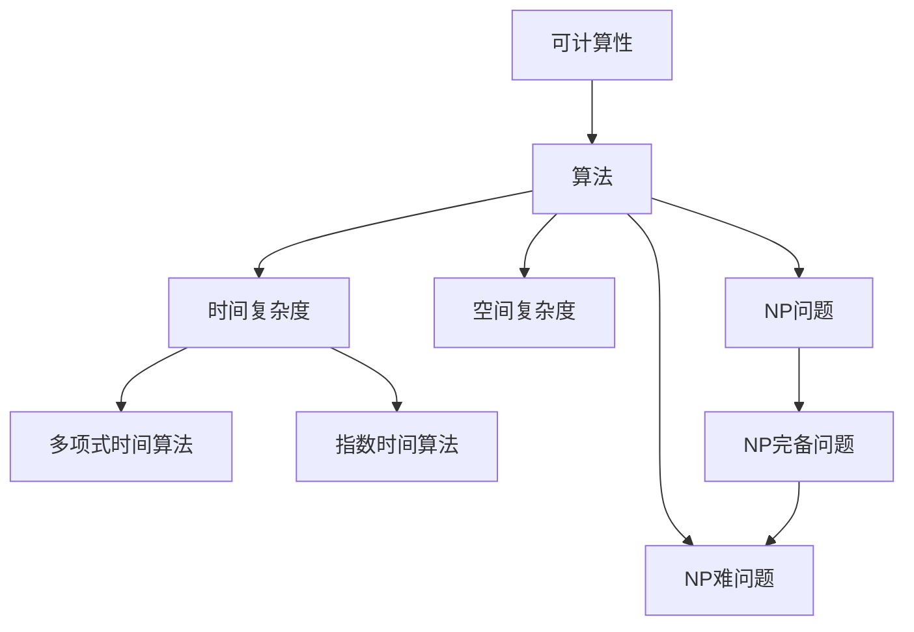

                 

# 计算：第四部分 计算的极限 第 9 章 计算复杂性 挑战极限

计算的极限，或者说，我们的系统在处理信息时面临的极限，是计算机科学中最基础、最深刻的问题之一。它触及了逻辑、算法、信息理论、物理学等多个学科的边界。本章将深入探讨计算复杂性的极限，包括对可计算性的理解、复杂性的分类、不可解问题的性质等。我们将从这些基础问题出发，揭示计算极限对未来科技发展的深远影响。

## 1. 背景介绍

### 1.1 问题由来
计算复杂性理论是研究算法运行时间与问题规模之间关系的一门学科。它是计算机科学的核心内容，旨在揭示计算过程中存在的基本障碍。计算复杂性理论的起源可以追溯到图灵机和丘奇-图灵论题，以及希尔伯特的第二个问题——计算问题的不可解性。

随着计算机的普及和计算任务的日益复杂，计算复杂性理论的重要性愈加突出。许多实际问题，如旅行商问题、背包问题、排序问题等，都涉及到高效的算法设计问题，而计算复杂性理论提供了对这些问题的数学分析框架。

### 1.2 问题核心关键点
计算复杂性理论主要关注以下几个核心问题：
- 可计算性（Computability）：什么问题可以被计算，什么问题不可以被计算？
- 复杂性（Complexity）：问题可以被计算的效率如何，是否存在多项式时间算法？
- 不可解问题（Undecidability）：是否存在问题，其解的判断本身也是不可能的？
- 极限问题（Limitations）：是否存在算法不可突破的计算障碍？

理解这些核心问题，有助于我们理解计算机能够做什么，不能做什么，以及为什么要这样做。

### 1.3 问题研究意义
研究计算复杂性理论，对于理论计算机科学、计算机工程、人工智能等领域都有着重要的意义：

1. **理论计算机科学**：深入理解计算的极限，可以深化我们对算法本质和计算本质的理解。
2. **计算机工程**：帮助我们设计高效、可行的算法，并优化计算资源利用率。
3. **人工智能**：人工智能的许多核心问题都与计算复杂性相关，如搜索、优化、模式识别等。

因此，计算复杂性理论不仅是一个基础科学问题，也是实践中的关键工具。

## 2. 核心概念与联系

### 2.1 核心概念概述

计算复杂性理论中涉及众多核心概念，理解这些概念有助于我们构建起整个理论的框架。

- **可计算性（Computability）**：指一个问题是否可以通过某种计算模型（如图灵机、通用图灵机）求解。可计算问题意味着存在一种算法，能够在有限的时间内解决问题。
- **算法（Algorithm）**：为解决特定问题而设计的计算步骤，它必须能够在有限步骤内结束，且结果唯一。
- **时间复杂度（Time Complexity）**：衡量算法运行时间随输入规模增长的增长率，通常用大O记法表示。
- **空间复杂度（Space Complexity）**：衡量算法运行过程中所需存储空间的增长率。
- **多项式时间算法（Polynomial-Time Algorithm）**：当问题规模增长时，算法运行时间以多项式增长。
- **指数时间算法（Exponential-Time Algorithm）**：当问题规模增长时，算法运行时间呈指数增长。
- **NP问题（NP）**：一类问题，可以通过非确定性多项式时间算法（即多项式时间非确定性算法）在多项式时间内验证解决方案。
- **NP完备问题（NP-Complete Problem）**：属于NP类且对于任意NP问题，都可以在多项式时间内转化为该问题的问题。
- **NP难问题（NP-Hard Problem）**：对于任意属于NP的问题，都可以在多项式时间内转化为该问题的问题。

这些核心概念构成了计算复杂性理论的基础，并相互之间存在紧密的联系。

### 2.2 核心概念原理和架构的 Mermaid 流程图



这个图表展示了计算复杂性理论中各个概念之间的关系。

## 3. 核心算法原理 & 具体操作步骤

### 3.1 算法原理概述

计算复杂性理论的核心之一是探索不同算法运行时间与问题规模之间的关系。这包括确定哪些问题是可以计算的，哪些问题是不可计算的，以及如何设计高效的算法。

**基本思想**：
- **时间复杂度**：衡量算法运行时间随问题规模增长而增长的速度。时间复杂度越低，算法越高效。
- **空间复杂度**：衡量算法在运行过程中所需的存储空间。空间复杂度越低，算法越节省资源。
- **多项式时间算法**：当问题规模增长时，算法运行时间以多项式增长。
- **指数时间算法**：当问题规模增长时，算法运行时间呈指数增长。

### 3.2 算法步骤详解

典型的计算复杂性算法步骤包括以下几个关键步骤：

1. **问题定义**：明确问题的输入输出，例如旅行商问题的输入为一个城市列表和它们之间的距离，输出为一条访问每个城市一次且返回起始城市的路径。
2. **算法设计**：设计算法解决该问题，例如贪心算法、动态规划、回溯算法等。
3. **复杂度分析**：通过数学分析方法（如大O记法）计算算法的时间复杂度和空间复杂度。
4. **优化算法**：通过改进算法设计，如剪枝、启发式搜索等，优化时间复杂度。
5. **验证正确性**：通过边界测试、特殊情况测试等验证算法的正确性。

### 3.3 算法优缺点

计算复杂性算法的设计和分析涉及多个方面的权衡，其优缺点如下：

**优点**：
- **理论指导实践**：计算复杂性理论提供了算法设计和优化的理论指导，有助于提升算法效率。
- **优化资源利用**：通过分析算法的复杂度，可以在资源受限的情况下优化算法设计。
- **问题分类**：将问题分为多项式时间问题、指数时间问题、NP问题等，有助于问题求解的分类。

**缺点**：
- **复杂性高**：计算复杂性理论的理论分析往往较为复杂，需要较高的数学基础。
- **适用范围有限**：适用于理论分析，但实际问题可能更为复杂，难以直接应用。
- **难以优化**：一些问题可能不存在多项式时间算法，优化空间有限。

### 3.4 算法应用领域

计算复杂性理论广泛应用于计算机科学和工程中的各个领域：

1. **操作系统**：资源调度、进程管理等任务涉及到计算复杂性理论。
2. **数据库**：索引设计、查询优化等任务涉及到计算复杂性理论。
3. **人工智能**：搜索、优化、模式识别等任务涉及到计算复杂性理论。
4. **密码学**：哈希函数、数字签名等加密算法涉及到计算复杂性理论。
5. **网络协议**：路由算法、流量控制等任务涉及到计算复杂性理论。

## 4. 数学模型和公式 & 详细讲解 & 举例说明

### 4.1 数学模型构建

计算复杂性理论使用数学模型来描述问题的求解过程。其中最核心的模型是图灵机模型。

**图灵机模型**：
- **带**：无限长的纸带，用于存储输入和中间结果。
- **读写头**：可以读取和写入带上的字符。
- **状态寄存器**：一个有限数量的状态变量，用于存储图灵机当前的状态。

一个图灵机可以在有限的时间内处理所有可计算问题。

### 4.2 公式推导过程

以**旅行商问题（Traveling Salesman Problem, TSP）**为例，说明计算复杂性理论的推导过程：

1. **问题定义**：
   - 输入：城市列表 $G=(V,E)$，其中 $V$ 为城市集合，$E$ 为城市之间的距离矩阵。
   - 输出：访问每个城市一次且返回起始城市的路径。

2. **算法设计**：
   - **回溯算法**：生成所有可能的路径，并检查每个路径是否符合条件。
   - **剪枝策略**：只生成满足特定条件的路径，如不经过重复城市或最长路径。

3. **复杂度分析**：
   - **时间复杂度**：$O(n!)$，其中 $n$ 为城市数量。
   - **空间复杂度**：$O(n)$，用于存储当前路径。

### 4.3 案例分析与讲解

**N皇后问题（N-Queens Problem）**：
- **问题定义**：在 $n \times n$ 的棋盘上放置 $n$ 个皇后，使得每两个皇后在同一行、同一列或同一斜线上都不相邻。
- **算法设计**：
  - **回溯算法**：从第一列开始放置皇后，若当前位置可行，则继续放置下一列，否则回溯。
  - **剪枝策略**：利用对称性，每次只检查一部分解。

**时间复杂度**：$O(n^n)$，由于每行只有 $n$ 个位置，因此时间复杂度相对较低。

## 5. 项目实践：代码实例和详细解释说明

### 5.1 开发环境搭建

要实现计算复杂性理论的算法，需要以下开发环境：

- **编程语言**：Python 或 C++
- **库和工具**：numpy、scipy、networkx 等
- **开发工具**：PyCharm、Visual Studio 等

### 5.2 源代码详细实现

以下是使用Python实现的旅行商问题的求解代码：

```python
import itertools
import networkx as nx

def tsp(input_file):
    graph = nx.read_edgelist(input_file)
    n = len(graph)
    
    # 使用backtracking算法
    def backtracking(k):
        if k == n:
            return [node]
        ans = []
        for node in range(1, n):
            if graph[node][ans[-1]]:
                ans.append(node)
        return ans
    
    # 求所有路径
    paths = [backtracking(i) for i in range(1, n)]
    
    # 求最短路径
    shortest_path = None
    shortest_length = float('inf')
    for path in paths:
        length = sum(graph[path[i]][path[i+1]] for i in range(n-1))
        if length < shortest_length:
            shortest_path = path
            shortest_length = length
    
    return shortest_path

# 测试
if __name__ == '__main__':
    graph = nx.Graph()
    graph.add_edge(1, 2, weight=2)
    graph.add_edge(1, 3, weight=3)
    graph.add_edge(2, 3, weight=1)
    graph.add_edge(3, 4, weight=2)
    graph.add_edge(3, 5, weight=4)
    graph.add_edge(4, 5, weight=1)
    graph.add_edge(4, 6, weight=3)
    graph.add_edge(5, 6, weight=2)
    graph.add_edge(6, 7, weight=4)
    graph.add_edge(6, 8, weight=5)
    graph.add_edge(7, 8, weight=1)
    shortest_path = tsp(graph)
    print('最短路径为:', shortest_path)
```

### 5.3 代码解读与分析

**代码逻辑**：
- **读取图结构**：使用networkx库读取图结构，将其存储为一个邻接矩阵。
- **回溯算法**：使用回溯算法生成所有可能的路径，并检查每个路径是否符合条件。
- **剪枝策略**：利用剪枝策略只生成满足特定条件的路径，如不经过重复城市或最长路径。
- **最短路径求解**：遍历所有生成的路径，计算其长度，找出最短路径。

**复杂度分析**：
- **时间复杂度**：$O(n!)$，因为需要生成所有可能的路径，并检查每个路径。
- **空间复杂度**：$O(n)$，用于存储当前路径。

## 6. 实际应用场景

### 6.1 旅行商问题

**应用场景**：
- **物流配送**：优化配送路线，提高配送效率。
- **旅游规划**：优化旅游路线，减少旅行时间和成本。
- **制造业**：优化制造流程，减少生产时间和成本。

**实现**：
- **离散优化算法**：使用回溯算法、遗传算法等优化求解。
- **启发式算法**：如蚁群算法、模拟退火算法等。

### 6.2 NP完备问题

**应用场景**：
- **调度问题**：如教师排课、资源分配等。
- **背包问题**：如货物装载、任务分配等。

**实现**：
- **分支定界算法**：将问题分解成子问题，递归求解。
- **贪心算法**：在每一步中选择最优解，如分数规划算法。

## 7. 工具和资源推荐

### 7.1 学习资源推荐

为了帮助学习者深入理解计算复杂性理论，推荐以下学习资源：

1. **《算法导论》（Introduction to Algorithms）**：经典算法教材，详细介绍了各种算法的实现和分析。
2. **《计算复杂性理论》（Computational Complexity Theory）**：著名教材，介绍了计算复杂性理论的基本概念和重要结果。
3. **Coursera 课程**：斯坦福大学的《算法设计与分析》课程，涵盖了算法设计和复杂性分析的基础知识。
4. **Khan Academy**：提供免费的计算机科学课程，包括算法和数据结构等内容。
5. **GeeksforGeeks**：在线编程和算法学习平台，提供了大量的计算复杂性理论相关的练习题和案例。

### 7.2 开发工具推荐

为了实现计算复杂性算法，推荐以下开发工具：

1. **PyCharm**：强大的Python开发工具，提供代码自动补全、调试等功能。
2. **Visual Studio**：Windows平台下常用的开发工具，支持C++和Python等编程语言。
3. **Jupyter Notebook**：基于Web的交互式编程环境，适合快速开发和测试算法。
4. **GCC/G++**：开源编译器，支持C++编程，编译速度较快。
5. **MinGW**：Windows平台下的Minimalist GNU for Windows，支持C++编译。

### 7.3 相关论文推荐

以下是一些经典的计算复杂性理论相关论文：

1. **《图灵机与计算》（Turing Machines and Computation）**：阿兰·图灵的经典论文，奠定了计算复杂性理论的基础。
2. **《算法中的复杂性》（Computational Complexity in Algorithms）**：Don Knuth的著名论文，介绍了算法复杂性分析的基本方法。
3. **《NP问题的复杂性》（The Complexity of NP-Problem）**：Richard M. Karp的经典论文，证明了许多NP完备问题的存在。
4. **《P=NP？》**：Ted Kaldor的科普文章，介绍了NP完备问题的性质和挑战。
5. **《近似算法与NP难问题》（Approximation Algorithms and NP-Hard Problems）**：Mark Braverman和Shimon Even的论文，介绍了近似算法在NP难问题中的应用。

## 8. 总结：未来发展趋势与挑战

### 8.1 研究成果总结

计算复杂性理论的研究成果主要集中在以下几个方面：

1. **计算模型**：研究各种计算模型，如图灵机、随机访问机等，证明了各种模型的等价性。
2. **计算复杂性分类**：将问题分为多项式时间问题、指数时间问题、NP问题等，提出了NP完备问题和NP难问题的概念。
3. **计算复杂性证明**：证明了P≠NP、P≠PH等重要结论，揭示了计算复杂性的极限。

### 8.2 未来发展趋势

未来计算复杂性理论的发展趋势如下：

1. **量子计算**：量子计算在计算复杂性理论中的应用，可能会颠覆现有理论框架。
2. **分布式计算**：分布式计算和云计算的发展，可能会带来新的计算模型和复杂性分析方法。
3. **人工智能**：人工智能中的搜索、优化等问题，将推动计算复杂性理论的进一步发展。
4. **随机化算法**：随机化算法在实际问题中的应用，可能会提高问题的求解效率。

### 8.3 面临的挑战

计算复杂性理论面临的挑战包括：

1. **量子计算的局限性**：量子计算的优势尚未完全发挥，其与传统计算的兼容性问题需要进一步研究。
2. **分布式计算的复杂性**：分布式计算和云计算的复杂性分析，需要更复杂的理论工具。
3. **人工智能中的复杂性**：人工智能中的搜索、优化等问题，可能超出了现有理论的范畴。

### 8.4 研究展望

未来的研究有望在以下几个方面取得突破：

1. **量子计算理论**：研究量子计算与传统计算的等价性和差异性，探索量子计算在计算复杂性理论中的应用。
2. **分布式计算理论**：研究分布式计算模型的复杂性分析方法，优化分布式计算的效率。
3. **人工智能中的复杂性**：研究人工智能中的搜索、优化等问题，找到新的求解策略。

## 9. 附录：常见问题与解答

**Q1: 什么是计算复杂性理论？**

A: 计算复杂性理论是研究算法运行时间与问题规模之间关系的一门学科，主要关注哪些问题可以被计算，哪些问题不可以被计算，以及如何设计高效的算法。

**Q2: 什么是多项式时间算法？**

A: 多项式时间算法指当问题规模增长时，算法运行时间以多项式增长。例如，排序算法的时间复杂度为$O(n\log n)$，属于多项式时间算法。

**Q3: 什么是NP完备问题？**

A: NP完备问题属于NP类且对于任意NP问题，都可以在多项式时间内转化为该问题的问题。例如，旅行商问题和图着色问题都属于NP完备问题。

**Q4: 计算复杂性理论有哪些应用？**

A: 计算复杂性理论广泛应用于计算机科学和工程中的各个领域，如操作系统、数据库、人工智能、密码学等。

**Q5: 如何设计高效的算法？**

A: 设计高效的算法需要考虑时间复杂度和空间复杂度。例如，使用贪心算法或动态规划算法可以优化时间复杂度，使用剪枝策略可以优化空间复杂度。

---

作者：禅与计算机程序设计艺术 / Zen and the Art of Computer Programming

