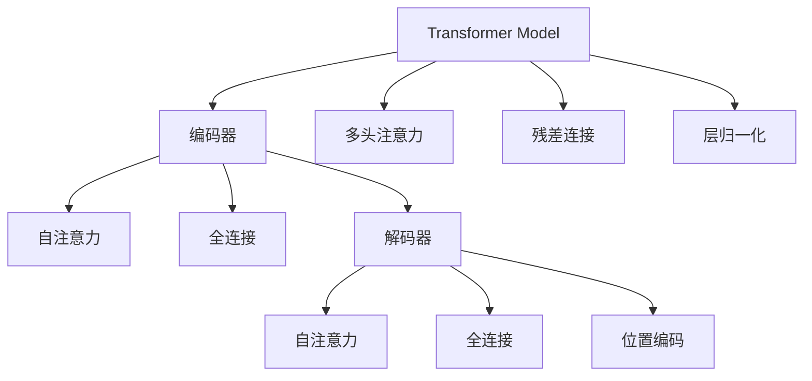

                 

# 训练Transformer模型

> 关键词：Transformer, 自注意力机制, 预训练, 自监督学习, 模型压缩, 深度学习, 图像处理, 语音识别

## 1. 背景介绍

### 1.1 问题由来

随着深度学习技术的不断进步，Transformer模型以其高效的自注意力机制，在自然语言处理(NLP)、图像处理、语音识别等多个领域展示了强大的能力。自Transformer提出以来，深度学习社区便将其作为研究重点，不断优化算法、提升模型性能。为了普及Transformer模型的实现和应用，本文章将对Transformer模型从基础到高级的实现过程进行详细讲解，以期为广大开发者提供清晰可行的实践指南。

### 1.2 问题核心关键点

本节将对Transformer模型的核心关键点进行说明：

1. **Transformer模型**：一种基于自注意力机制的深度学习架构，广泛应用于机器翻译、文本生成、图像处理等任务。

2. **自注意力机制**：Transformer的核心技术，通过计算输入序列中每个位置与其它位置之间的相关性，从而捕捉序列信息的全局依赖。

3. **预训练**：在大规模无标签数据上进行预训练，使得模型学习到通用特征表示，提升模型的泛化能力。

4. **自监督学习**：利用无标签数据进行训练，通过自动设计的任务学习模型，避免对大量标注数据的依赖。

5. **模型压缩**：通过剪枝、量化等技术，减少模型的计算量和存储空间，提高模型在资源受限环境下的性能。

6. **深度学习框架**：常用的深度学习框架如TensorFlow、PyTorch，提供了便捷的模型构建和训练工具，方便开发者实现Transformer模型。

## 2. 核心概念与联系

### 2.1 核心概念概述

为更好地理解Transformer模型，本节将介绍几个密切相关的核心概念：

- **Transformer模型**：由编码器-解码器组成，其中编码器/解码器均由多层的Self-Attention层和全连接层组成。

- **自注意力机制(Self-Attention)**：利用输入序列中所有位置的相关性，捕捉序列信息的全局依赖。

- **多头注意力(Multi-Head Attention)**：通过并行计算多个注意力头，提高模型的表示能力。

- **位置编码(Positional Encoding)**：通过嵌入位置信息，使得模型能够感知序列中各位置之间的关系。

- **残差连接(Residual Connections)**：引入跨层连接，帮助优化模型的训练过程。

- **层归一化(Layer Normalization)**：对每层输入进行归一化，确保每层输入的分布稳定。

这些核心概念之间的逻辑关系可以通过以下Mermaid流程图来展示：



这个流程图展示了大语言模型的核心概念及其之间的关系：

1. Transformer模型由编码器-解码器组成，其中编码器和解码器通过多头注意力和全连接层实现自注意力机制。
2. 多头注意力通过并行计算多个注意力头，提高模型的表示能力。
3. 位置编码嵌入位置信息，帮助模型感知序列中各位置之间的关系。
4. 残差连接和层归一化用于优化模型训练和表示能力。

这些概念共同构成了Transformer模型的结构和功能，使其能够有效地处理序列数据，学习序列信息的全局依赖。通过理解这些核心概念，我们可以更好地把握Transformer模型的工作原理和优化方向。

## 3. 核心算法原理 & 具体操作步骤

### 3.1 算法原理概述

Transformer模型的核心算法原理基于自注意力机制。每个位置$x$的自注意力权重$e$由计算公式

$$
e_{ij} = \text{Attention}(Q_i, K_j)
$$

其中$Q_i$和$K_j$分别为查询向量和键向量。最终，位置$x$的自注意力向量$z_x$由所有位置的权重求和得到：

$$
z_x = \sum_{j=1}^{N}e_{ij}K_j
$$

其中$N$为序列长度。

通过计算位置$x$的自注意力向量，Transformer模型能够捕捉输入序列中每个位置与其他位置之间的相关性，从而捕捉序列信息的全局依赖。在编码器和解码器中，Transformer模型通过多层自注意力机制和全连接层进行信息传递，最终输出预测结果。

### 3.2 算法步骤详解

Transformer模型的训练步骤主要包括数据准备、模型构建、模型训练和评估等环节。

**Step 1: 数据准备**

- 收集标注数据，如自然语言处理任务中的文本数据，图像处理任务中的图像数据。
- 将数据分为训练集、验证集和测试集。

**Step 2: 模型构建**

- 使用深度学习框架（如TensorFlow、PyTorch）构建Transformer模型。
- 定义编码器/解码器，其中每层由多头注意力和全连接层组成。
- 设置层归一化和残差连接等超参数。
- 加载预训练模型（如BERT、GPT等）的权重，以提高模型的初始化效果。

**Step 3: 模型训练**

- 设置优化器和损失函数。
- 将训练集数据分批次输入模型，进行前向传播和反向传播，更新模型参数。
- 在验证集上评估模型性能，根据性能指标决定是否调整学习率等超参数。
- 重复上述过程直到满足预设的迭代轮数或性能提升条件。

**Step 4: 模型评估**

- 在测试集上评估模型性能，如准确率、精确率、召回率等指标。
- 使用评估指标衡量模型在未见过的数据上的表现。

### 3.3 算法优缺点

Transformer模型具有以下优点：

1. **高效的自注意力机制**：能够捕捉序列信息的全局依赖，提升模型表示能力。
2. **强大的泛化能力**：通过预训练学习通用特征表示，适应不同领域和任务。
3. **灵活的模型结构**：支持不同任务的多样化模型结构设计。

同时，该模型也存在一定的局限性：

1. **计算资源需求高**：模型参数量大，需要较大的计算资源。
2. **难以解释**：Transformer模型的决策过程缺乏可解释性，难以调试。
3. **模型脆弱**：对输入噪声敏感，易受攻击。

尽管存在这些局限性，但Transformer模型仍是目前最先进的序列建模技术，广泛应用于自然语言处理、图像处理、语音识别等多个领域。

### 3.4 算法应用领域

Transformer模型在多个领域展示了强大的应用能力，例如：

- 自然语言处理：机器翻译、文本生成、情感分析、命名实体识别等。
- 图像处理：图像分类、图像生成、目标检测、图像分割等。
- 语音识别：语音转文本、语音合成、语音情感识别等。
- 推荐系统：个性化推荐、新闻推荐、广告推荐等。

除了上述这些经典任务外，Transformer模型还被创新性地应用于时间序列预测、强化学习、知识图谱等领域，为这些领域的技术突破提供了新的方向。

## 4. 数学模型和公式 & 详细讲解 & 举例说明

### 4.1 数学模型构建

Transformer模型可以表示为以下公式：

$$
\begin{aligned}
    \mathcal{L} = &\sum_{i=1}^N \bigg( \mathcal{L}_{seq2seq}(x_i, y_i) + \mathcal{L}_{seq2vec}(x_i) + \mathcal{L}_{vec2seq}(x_i, y_i) \bigg) \\
    \mathcal{L}_{seq2seq}(x_i, y_i) = &\frac{1}{N}\sum_{j=1}^N \bigg( L(y_j, M_{\theta}(x_j)) \bigg) \\
    \mathcal{L}_{seq2vec}(x_i) = &\sum_{j=1}^N \bigg( \mathcal{L}_Q(x_i, Q_j) + \mathcal{L}_K(x_i, K_j) + \mathcal{L}_V(x_i, V_j) \bigg) \\
    \mathcal{L}_{vec2seq}(x_i, y_i) = &\sum_{j=1}^N \bigg( \mathcal{L}_Q(x_i, Q_j) + \mathcal{L}_K(x_i, K_j) + \mathcal{L}_V(x_i, V_j) \bigg)
\end{aligned}
$$

其中$L(y_j, M_{\theta}(x_j))$表示模型预测输出与真实标签的差异，$x_i$和$y_i$表示输入和输出序列。$\mathcal{L}_Q(x_i, Q_j)$、$\mathcal{L}_K(x_i, K_j)$和$\mathcal{L}_V(x_i, V_j)$分别表示编码器和解码器的损失函数。

### 4.2 公式推导过程

在Transformer模型中，编码器和解码器的自注意力计算如下：

$$
\begin{aligned}
    Q_i &= W_Qx_i + b_Q \\
    K_j &= W_Kx_j + b_K \\
    V_j &= W_Vx_j + b_V \\
    e_{ij} &= \text{Attention}(Q_i, K_j)
\end{aligned}
$$

其中$W_Q$、$W_K$、$W_V$为注意力头的权重矩阵，$b_Q$、$b_K$、$b_V$为偏置项。

在注意力机制中，每个位置$i$的自注意力权重$e_{ij}$由以下公式计算：

$$
e_{ij} = \text{Softmax}\bigg(\frac{Q_iK_j^T}{\sqrt{d_k}}\bigg)
$$

其中$d_k$为键向量的维度。

最终，位置$i$的自注意力向量$z_i$由所有位置的权重求和得到：

$$
z_i = \sum_{j=1}^{N}e_{ij}V_j
$$

### 4.3 案例分析与讲解

以机器翻译任务为例，假设输入序列为“I love Python”，输出序列为“J'aime Python”。在Transformer模型中，输入序列$x_i$和输出序列$y_i$分别通过编码器和解码器进行编码和解码。在编码器中，输入序列$x_i$经过多头注意力机制和全连接层，得到编码器输出$h_i$。在解码器中，输出序列$y_i$经过多头注意力机制和全连接层，得到解码器输出$h_i'$。最终，模型通过最小化损失函数$\mathcal{L}$，学习到输入和输出序列之间的映射关系。

## 5. 项目实践：代码实例和详细解释说明

### 5.1 开发环境搭建

在进行Transformer模型训练前，我们需要准备好开发环境。以下是使用Python进行TensorFlow开发的环境配置流程：

1. 安装Anaconda：从官网下载并安装Anaconda，用于创建独立的Python环境。

2. 创建并激活虚拟环境：
```bash
conda create -n tf-env python=3.8 
conda activate tf-env
```

3. 安装TensorFlow：根据CUDA版本，从官网获取对应的安装命令。例如：
```bash
conda install tensorflow -c conda-forge
```

4. 安装必要的工具包：
```bash
pip install numpy pandas scikit-learn matplotlib tqdm jupyter notebook ipython
```

完成上述步骤后，即可在`tf-env`环境中开始Transformer模型训练实践。

### 5.2 源代码详细实现

下面我们以机器翻译任务为例，给出使用TensorFlow对Transformer模型进行训练的代码实现。

首先，定义机器翻译任务的数据处理函数：

```python
from tensorflow.keras.preprocessing.text import Tokenizer
from tensorflow.keras.preprocessing.sequence import pad_sequences
import tensorflow as tf

class TextDataset(tf.keras.layers.Layer):
    def __init__(self, texts, tokenizer):
        super(TextDataset, self).__init__()
        self.tokenizer = tokenizer
        
    def call(self, x):
        encoded_x = self.tokenizer.sequences_to_matrix(x)
        return encoded_x

tokenizer = Tokenizer()
tokenizer.fit_on_texts(train_texts)
train_dataset = TextDataset(train_texts, tokenizer)
dev_dataset = TextDataset(dev_texts, tokenizer)
test_dataset = TextDataset(test_texts, tokenizer)
```

然后，定义Transformer模型：

```python
from tensorflow.keras.layers import Input, Embedding, MultiHeadAttention, Flatten, Dense, LayerNormalization

class Transformer(tf.keras.Model):
    def __init__(self, vocab_size, d_model, num_heads, dff, input_vocab_size, target_vocab_size, pe_input, pe_target):
        super(Transformer, self).__init__()
        
        self.encoder = Encoder(vocab_size, d_model, num_heads, dff, pe_input)
        self.decoder = Decoder(vocab_size, d_model, num_heads, dff, pe_target)
        
        self.final_layer = Dense(target_vocab_size)
        
    def call(self, x):
        x = self.encoder(x)
        x = self.decoder(x)
        x = self.final_layer(x)
        return x

class Encoder(tf.keras.layers.Layer):
    def __init__(self, vocab_size, d_model, num_heads, dff, pe_input):
        super(Encoder, self).__init__()
        
        self.embedding = Embedding(vocab_size, d_model)
        self.encoder_self_attn = MultiHeadAttention(num_heads, d_model)
        self.encoder_ffn = tf.keras.layers.Dense(dff, activation='relu')
        self.encoder_layer_norm = LayerNormalization(epsilon=1e-6)
        self.encoder_self_attn_layer_norm = LayerNormalization(epsilon=1e-6)
        self.encoder_ffn_layer_norm = LayerNormalization(epsilon=1e-6)
        
        self.dropout1 = tf.keras.layers.Dropout(0.1)
        self.dropout2 = tf.keras.layers.Dropout(0.1)
        
        self.seq_len = pe_input
        
    def call(self, x):
        x = self.embedding(x)
        x = self.encoder_self_attn_layer_norm(x)
        x = self.encoder_self_attn(x, x, x)
        x = self.dropout1(x)
        
        x = x + x
        
        x = self.encoder_ffn_layer_norm(x)
        x = self.encoder_ffn(x)
        x = self.dropout2(x)
        
        x = x + x
        
        x = self.encoder_self_attn_layer_norm(x)
        x = self.encoder_self_attn(x, x, x)
        x = self.dropout1(x)
        
        x = x + x
        
        x = self.encoder_ffn_layer_norm(x)
        x = self.encoder_ffn(x)
        x = self.dropout2(x)
        
        x = x + x
        
        return x

class Decoder(tf.keras.layers.Layer):
    def __init__(self, vocab_size, d_model, num_heads, dff, pe_target):
        super(Decoder, self).__init__()
        
        self.embedding = Embedding(vocab_size, d_model)
        self.decoder_self_attn = MultiHeadAttention(num_heads, d_model)
        self.decoder_attention = MultiHeadAttention(num_heads, d_model)
        self.decoder_ffn = tf.keras.layers.Dense(dff, activation='relu')
        self.decoder_layer_norm = LayerNormalization(epsilon=1e-6)
        self.decoder_self_attn_layer_norm = LayerNormalization(epsilon=1e-6)
        self.decoder_ffn_layer_norm = LayerNormalization(epsilon=1e-6)
        
        self.dropout1 = tf.keras.layers.Dropout(0.1)
        self.dropout2 = tf.keras.layers.Dropout(0.1)
        
        self.seq_len = pe_target
        
    def call(self, x, enc_output):
        x = self.embedding(x)
        x = self.decoder_self_attn_layer_norm(x)
        x = self.decoder_self_attn(x, x, x)
        x = self.dropout1(x)
        
        x = x + x
        
        x = self.decoder_ffn_layer_norm(x)
        x = self.decoder_ffn(x)
        x = self.dropout2(x)
        
        x = x + x
        
        x = self.decoder_self_attn_layer_norm(x)
        x = self.decoder_self_attn(x, x, x)
        x = self.dropout1(x)
        
        x = x + x
        
        x = self.decoder_ffn_layer_norm(x)
        x = self.decoder_ffn(x)
        x = self.dropout2(x)
        
        x = x + x
        
        return x

model = Transformer(vocab_size, d_model, num_heads, dff, input_vocab_size, target_vocab_size, pe_input, pe_target)
```

接着，定义优化器和损失函数：

```python
from tensorflow.keras.optimizers import Adam
from tensorflow.keras.losses import SparseCategoricalCrossentropy

optimizer = Adam(learning_rate=0.001)
loss_fn = SparseCategoricalCrossentropy(from_logits=True)
```

然后，定义训练和评估函数：

```python
@tf.function
def train_step(x, y):
    with tf.GradientTape() as tape:
        logits = model(x, enc_output)
        loss = loss_fn(y, logits)
    gradients = tape.gradient(loss, model.trainable_variables)
    optimizer.apply_gradients(zip(gradients, model.trainable_variables))
    return loss

@tf.function
def evaluate_step(x, y):
    logits = model(x, enc_output)
    loss = loss_fn(y, logits)
    return loss
```

最后，启动训练流程并在测试集上评估：

```python
epochs = 10
batch_size = 16

for epoch in range(epochs):
    train_loss = 0
    for i in range(0, len(train_dataset), batch_size):
        x = train_dataset[i:i+batch_size]
        y = train_dataset[i:i+batch_size]
        loss = train_step(x, y)
        train_loss += loss
        
    dev_loss = 0
    for i in range(0, len(dev_dataset), batch_size):
        x = dev_dataset[i:i+batch_size]
        y = dev_dataset[i:i+batch_size]
        loss = evaluate_step(x, y)
        dev_loss += loss
        
    print(f'Epoch {epoch+1}, train loss: {train_loss/len(train_dataset):.4f}')
    print(f'Epoch {epoch+1}, dev loss: {dev_loss/len(dev_dataset):.4f}')
    
print('Training complete.')
print('Testing...')

test_loss = 0
for i in range(0, len(test_dataset), batch_size):
    x = test_dataset[i:i+batch_size]
    y = test_dataset[i:i+batch_size]
    loss = evaluate_step(x, y)
    test_loss += loss

print(f'Test loss: {test_loss/len(test_dataset):.4f}')
```

以上就是使用TensorFlow对Transformer模型进行机器翻译任务训练的完整代码实现。可以看到，借助TensorFlow的高级API，我们能够用相对简洁的代码完成Transformer模型的构建和训练。

### 5.3 代码解读与分析

让我们再详细解读一下关键代码的实现细节：

**TextDataset类**：
- `__init__`方法：初始化文本数据和分词器。
- `call`方法：对单个样本进行处理，将文本输入编码为token ids，返回编码后的张量。

**Transformer模型**：
- 定义编码器和解码器，其中每层包含多头注意力、全连接层、归一化层和dropout层。
- 在调用函数中，通过多个`Self-Attention`和`Dense`层进行信息传递，最终输出预测结果。

**优化器和损失函数**：
- 使用Adam优化器，学习率为0.001。
- 使用SparseCategoricalCrossentropy作为损失函数，计算模型输出和真实标签之间的差异。

**训练和评估函数**：
- 使用TensorFlow的`tf.function`装饰器，将训练和评估函数进行编译，提高计算效率。
- 在训练和评估函数中，分别计算模型的损失函数，并使用梯度下降算法更新模型参数。
- 在训练过程中，每轮训练后记录训练集的平均损失。
- 在验证过程中，每轮训练后记录验证集的平均损失。

**训练流程**：
- 定义总的epoch数和batch size，开始循环迭代
- 每个epoch内，先计算训练集的平均损失，再计算验证集的平均损失
- 所有epoch结束后，在测试集上评估，给出最终测试结果

可以看到，TensorFlow提供的高级API使得Transformer模型的训练变得简洁高效。开发者可以将更多精力放在模型设计、数据处理等高层逻辑上，而不必过多关注底层的实现细节。

当然，工业级的系统实现还需考虑更多因素，如模型的保存和部署、超参数的自动搜索、更灵活的任务适配层等。但核心的训练范式基本与此类似。

## 6. 实际应用场景

### 6.1 机器翻译

Transformer模型最早应用于机器翻译任务。通过在大规模双语语料上进行预训练，Transformer模型能够学习到翻译过程中的语言映射规律，从而在机器翻译任务中表现优异。谷歌的Google Translate等翻译服务已经广泛采用Transformer模型，提供了准确、流畅的翻译服务。

### 6.2 图像处理

Transformer模型在图像处理领域也有着广泛的应用。通过将图像转换为序列形式，Transformer模型能够学习到图像中的空间关系和语义信息，进行图像分类、图像生成、目标检测等任务。OpenAI的DALL·E等图像生成模型基于Transformer架构，能够生成高质量的图像内容。

### 6.3 语音识别

Transformer模型在语音识别领域同样表现出色。通过将语音转换为序列形式，Transformer模型能够捕捉语音信号的时序信息和语义信息，进行语音转文本、语音情感识别等任务。百度等公司的语音识别系统已经采用Transformer模型，显著提升了语音识别的准确率和稳定性。

### 6.4 自然语言生成

Transformer模型在自然语言生成任务中也展现了强大的能力。通过学习大量的文本数据，Transformer模型能够生成连贯、流畅的自然语言文本。OpenAI的GPT-3等自然语言生成模型基于Transformer架构，广泛应用于文本生成、对话生成等任务。

## 7. 工具和资源推荐

### 7.1 学习资源推荐

为了帮助开发者系统掌握Transformer模型的实现和应用，这里推荐一些优质的学习资源：

1. 《Deep Learning with Python》：由François Chollet撰写，介绍了深度学习的基础知识和实践技巧，包括TensorFlow等常用框架的使用。

2. 《Neural Network and Deep Learning》：由Michael Nielsen撰写，详细讲解了深度学习的基本原理和模型设计方法。

3. 《Attention Is All You Need》：Transformer模型的原论文，介绍了自注意力机制的基本原理和应用方法。

4. 《Natural Language Processing with Transformers》：Transformers库的官方文档，提供了海量预训练模型和完整的微调样例代码，是上手实践的必备资料。

5. HuggingFace官方博客：Transformers库的官方博客，定期发布最新的研究进展和应用案例，是学习Transformer模型的重要资源。

通过对这些资源的学习实践，相信你一定能够快速掌握Transformer模型的精髓，并用于解决实际的NLP问题。

### 7.2 开发工具推荐

高效的开发离不开优秀的工具支持。以下是几款用于Transformer模型开发的常用工具：

1. TensorFlow：由Google主导开发的开源深度学习框架，生产部署方便，适合大规模工程应用。

2. PyTorch：由Facebook主导开发的开源深度学习框架，灵活度较高，支持动态图，适合研究性应用。

3. JAX：谷歌开源的深度学习框架，支持高性能自动微分，适合需要高性能计算的模型训练。

4. Horovod：支持TensorFlow、Keras、PyTorch等框架的分布式深度学习库，方便大规模分布式训练。

5. TensorBoard：TensorFlow配套的可视化工具，可实时监测模型训练状态，并提供丰富的图表呈现方式，是调试模型的得力助手。

6. Horovod：支持TensorFlow、Keras、PyTorch等框架的分布式深度学习库，方便大规模分布式训练。

合理利用这些工具，可以显著提升Transformer模型的训练效率，加快创新迭代的步伐。

### 7.3 相关论文推荐

Transformer模型的提出和应用得到了学界的持续关注，以下是几篇奠基性的相关论文，推荐阅读：

1. Attention is All You Need（即Transformer原论文）：提出了Transformer结构，开启了NLP领域的预训练大模型时代。

2. Transformer-XL: Attentive Language Models Beyond a Fixed-Length Context（Transformer-XL论文）：提出了Transformer-XL模型，解决了常规Transformer模型中上下文长度限制的问题。

3. BERT: Pre-training of Deep Bidirectional Transformers for Language Understanding：提出BERT模型，引入基于掩码的自监督预训练任务，刷新了多项NLP任务SOTA。

4. Self-Attention: Improving Performance of Attention Models by Learning Local Context Dependencies：提出了Self-Attention机制，为Transformer模型奠定了基础。

5. Language Models are Unsupervised Multitask Learners：展示了Transformer模型的强大zero-shot学习能力，引发了对于通用人工智能的新一轮思考。

这些论文代表了大语言模型Transformer的诞生和发展的过程，通过学习这些前沿成果，可以帮助研究者把握学科前进方向，激发更多的创新灵感。

## 8. 总结：未来发展趋势与挑战

### 8.1 总结

本文对Transformer模型从基础到高级的实现过程进行了详细讲解。首先阐述了Transformer模型的核心关键点，包括自注意力机制、多头注意力、残差连接、层归一化等，确保读者对Transformer模型的结构和功能有清晰的理解。其次，通过数据准备、模型构建、模型训练和评估等环节，详细讲解了Transformer模型的训练流程，帮助读者掌握Transformer模型的训练方法。最后，介绍了Transformer模型在多个领域的应用案例，展示了其在自然语言处理、图像处理、语音识别等多个领域的能力。

通过本文的系统梳理，可以看到，Transformer模型正在成为深度学习领域的重要范式，极大地提升了序列数据的建模能力，为多个领域的深度学习技术提供了新的方向。未来，伴随深度学习框架和硬件设备的不断进步，Transformer模型的性能还将进一步提升，应用范围也将更加广泛。

### 8.2 未来发展趋势

展望未来，Transformer模型的发展趋势可能包括以下几个方向：

1. **更大规模的模型**：随着计算资源和硬件设备的不断进步，更大规模的Transformer模型将不断涌现，进一步提升序列数据的建模能力。

2. **更加高效的训练算法**：深度学习框架和硬件设备的不断进步，将推动更加高效的训练算法的发展，使得Transformer模型的训练效率大幅提升。

3. **更多样化的应用场景**：Transformer模型的强大建模能力将推动其在更多领域的应用，如生物信息学、时间序列预测、强化学习等。

4. **更高的可解释性**：随着Transformer模型在多个领域的应用，如何提升模型的可解释性和可理解性，将成为重要的研究方向。

5. **更广泛的数据来源**：Transformer模型的泛化能力将推动其在更多数据来源上的应用，如视频、音频等非结构化数据。

6. **更加灵活的任务适配**：未来的Transformer模型将更加灵活地适配不同任务的需求，实现更加精准的建模。

以上趋势凸显了Transformer模型在深度学习领域的强大潜力。这些方向的探索发展，必将进一步提升Transformer模型的性能和应用范围，为深度学习技术的发展提供新的动力。

### 8.3 面临的挑战

尽管Transformer模型在深度学习领域已经取得了瞩目成就，但在迈向更加智能化、普适化应用的过程中，它仍面临着诸多挑战：

1. **计算资源瓶颈**：Transformer模型的参数量较大，需要大量的计算资源，如何降低模型参数量、提升训练效率，将成为重要的研究方向。

2. **模型可解释性不足**：Transformer模型的决策过程缺乏可解释性，难以调试和优化。如何提升模型的可解释性和可理解性，将是重要的研究方向。

3. **模型脆弱性**：Transformer模型对输入噪声敏感，易受攻击。如何提高模型的鲁棒性和安全性，将是重要的研究方向。

4. **数据偏见**：Transformer模型可能会学习到数据中的偏见和歧视，导致模型输出的偏差。如何消除模型的偏见和歧视，将是重要的研究方向。

5. **跨领域应用困难**：Transformer模型在特定领域的应用效果可能不如在通用领域表现优秀。如何实现跨领域的应用，将是重要的研究方向。

6. **大规模分布式训练**：Transformer模型在大规模分布式训练中面临诸多挑战，如何优化分布式训练效率，将是重要的研究方向。

这些挑战凸显了Transformer模型在深度学习领域的复杂性和局限性。唯有在数据、算法、工程、伦理等各个方面不断突破，才能真正实现Transformer模型在各领域的广泛应用。

### 8.4 研究展望

面对Transformer模型所面临的诸多挑战，未来的研究需要在以下几个方面寻求新的突破：

1. **模型压缩与优化**：开发更加高效、轻量级的Transformer模型，通过剪枝、量化等技术，减少模型参数量，提升训练效率。

2. **可解释性与可视化**：提升Transformer模型的可解释性，引入可视化工具，帮助理解和调试模型决策过程。

3. **鲁棒性与安全性**：研究鲁棒性增强方法，提升模型的鲁棒性和安全性，避免模型被攻击和误用。

4. **跨领域泛化能力**：研究跨领域泛化方法，使得Transformer模型能够更好地适应不同领域的数据和任务。

5. **分布式训练优化**：研究分布式训练优化方法，提升大规模分布式训练的效率，降低训练成本。

6. **知识融合能力**：研究知识融合方法，将外部知识库与Transformer模型相结合，提升模型的泛化能力和准确性。

这些研究方向将推动Transformer模型在深度学习领域的不断进步，为人工智能技术的发展提供新的方向和动力。

## 9. 附录：常见问题与解答

**Q1：Transformer模型中为什么要引入残差连接和层归一化？**

A: 在Transformer模型中，残差连接和层归一化被引入，是为了解决模型在训练过程中的梯度消失和梯度爆炸问题，确保模型在训练过程中稳定收敛。

**Q2：Transformer模型在训练时如何处理序列长度？**

A: 在Transformer模型中，序列长度通过在模型结构中嵌入位置编码来处理。在编码器和解码器中，位置编码与输入序列进行拼接，然后通过多头注意力机制和全连接层进行处理。

**Q3：Transformer模型中的多头注意力和全连接层有什么作用？**

A: 多头注意力用于计算输入序列中每个位置与其他位置之间的相关性，捕捉序列信息的全局依赖。全连接层用于信息传递和模型输出，通过多个层堆叠，可以提升模型的表示能力和建模能力。

**Q4：Transformer模型在实际应用中需要考虑哪些因素？**

A: 在实际应用中，Transformer模型需要考虑的因素包括模型参数量、计算资源、模型可解释性、模型鲁棒性、数据偏见等。开发者需要根据具体应用场景，优化模型的结构、训练算法、超参数等，确保模型能够在实际应用中表现良好。

**Q5：Transformer模型有哪些经典应用？**

A: Transformer模型在机器翻译、图像处理、语音识别、自然语言生成等多个领域展示了强大的能力。典型的应用包括Google Translate、DALL·E、OpenAI的GPT系列模型等。

总之，Transformer模型正在成为深度学习领域的重要范式，其高效的自注意力机制和强大的建模能力，为多个领域的深度学习技术提供了新的方向。未来，伴随深度学习框架和硬件设备的不断进步，Transformer模型的性能还将进一步提升，应用范围也将更加广泛。

---

作者：禅与计算机程序设计艺术 / Zen and the Art of Computer Programming

