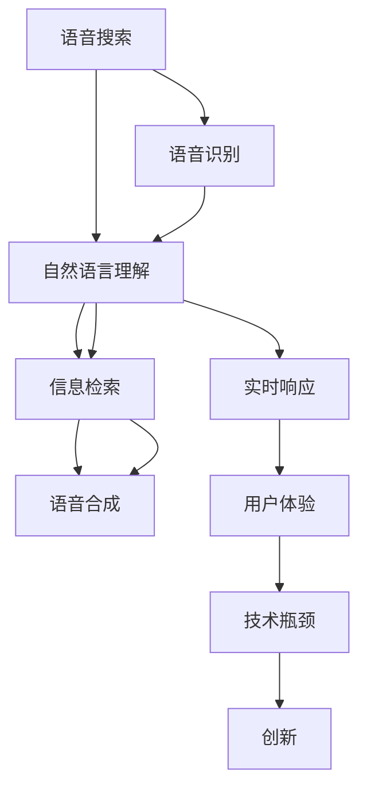

                 

# 语音搜索技术在电商领域的应用：挑战与机遇

> 关键词：语音搜索, 电商, 自然语言处理, 深度学习, 实时响应, 用户体验, 技术瓶颈, 创新

## 1. 背景介绍

### 1.1 问题由来

随着移动互联网和智能设备的普及，语音搜索技术日渐成为用户获取信息、完成任务的主要方式之一。特别是在电商领域，语音搜索已经不仅仅是用户搜索商品的工具，更是提升用户体验、增强互动的利器。电商平台的语音搜索系统，能够帮助用户通过语音快速找到所需商品，简化购物流程，提升购物效率。然而，电商领域的语音搜索应用也面临着诸多挑战，例如：处理海量数据、实时响应用户需求、维护高并发系统稳定性、保障安全隐私等。

### 1.2 问题核心关键点

语音搜索技术在电商领域的应用，涉及从用户语音输入到搜索结果展现的全程链路，包括语音识别、自然语言理解、信息检索、语音合成等多个关键环节。这些环节的有效结合，将直接决定电商语音搜索的体验和效果。

1. **语音识别**：将用户口述的语音转换为文本。准确、流畅的语音识别是后续处理的基础。
2. **自然语言理解**：理解用户的意图，转化为可执行的操作或查询。准确理解用户意图是实现精确结果的关键。
3. **信息检索**：从电商平台上数以亿计的商品中快速检索相关结果。高效的检索算法和索引系统是保障系统性能的重要因素。
4. **语音合成**：将搜索结果转换为语音输出给用户。流畅自然的语音合成是提升用户体验的重要环节。
5. **高并发系统稳定性**：电商平台的语音搜索系统需支持高并发访问，保障系统稳定性和用户体验。
6. **安全隐私**：电商平台需要保护用户隐私信息，防止数据泄露。

## 2. 核心概念与联系

### 2.1 核心概念概述

为更好地理解语音搜索技术在电商领域的应用，本节将介绍几个关键核心概念及其相互联系：

- **语音搜索(Voice Search)**：通过语音输入和语音输出，帮助用户与计算机系统进行交互的技术。
- **自然语言处理(NLP)**：使计算机能够理解和生成人类语言的技术，包括语音识别、语言理解、信息检索、语音合成等。
- **深度学习(Deep Learning)**：一类基于神经网络的机器学习技术，广泛应用于语音识别、图像识别、自然语言处理等领域。
- **实时响应(Real-Time Response)**：系统能够在用户输入后快速响应，返回结果，提升用户体验。
- **用户体验(User Experience, UX)**：用户在使用语音搜索时的主观感受，是系统设计的重要考量因素。
- **技术瓶颈(Technical Bottlenecks)**：语音搜索应用中需要解决的关键技术问题，如语音识别准确性、系统并发处理能力等。
- **创新(Innovation)**：在解决技术瓶颈的同时，探索新的技术应用和解决方案。

这些概念通过以下Mermaid流程图展示了它们之间的联系：



这个流程图展示了语音搜索技术的全流程和各个关键环节之间的联系：

1. 语音搜索系统接收用户语音输入。
2. 语音识别模块将语音转换为文本。
3. 自然语言理解模块解析用户意图。
4. 信息检索模块根据意图从电商平台商品库中检索相关商品。
5. 语音合成模块将检索结果转换为语音输出。
6. 实时响应模块确保系统能够快速响应用户输入。
7. 用户体验是所有环节需要共同追求的目标。
8. 技术瓶颈是当前语音搜索技术面临的挑战。
9. 创新则是解决这些挑战的动力来源。

## 3. 核心算法原理 & 具体操作步骤
### 3.1 算法原理概述

语音搜索技术在电商领域的核心算法流程主要包括以下几个关键步骤：

1. **语音识别**：将用户口述的语音转换为文本。
2. **自然语言理解**：理解用户的意图，转化为可执行的操作或查询。
3. **信息检索**：从电商平台上数以亿计的商品中快速检索相关结果。
4. **语音合成**：将搜索结果转换为语音输出给用户。
5. **实时响应**：系统能够在用户输入后快速响应，返回结果。

这些步骤涉及的算法原理和操作步骤如下：

### 3.2 算法步骤详解

#### 3.2.1 语音识别

语音识别是语音搜索技术的第一步，其核心是利用深度学习模型将用户的语音输入转换为文本。目前，常用的深度学习模型包括基于RNN的CTC模型和基于CNN+LSTM的Transformer模型。以下是语音识别的一般步骤：

1. **数据预处理**：包括分帧、MFCC特征提取、归一化等操作，为模型输入准备数据。
2. **模型训练**：使用大量标注的语音数据对深度学习模型进行训练，学习语音特征和文本映射关系。
3. **解码**：将输入语音信号解码为文本序列，得到识别结果。

#### 3.2.2 自然语言理解

自然语言理解模块的核心是意图识别和实体抽取。其一般流程如下：

1. **分词和词性标注**：对用户输入的文本进行分词和词性标注，为后续处理做准备。
2. **依存句法分析**：通过依存句法分析，理解句子结构和词与词之间的关系。
3. **意图识别**：利用深度学习模型，如LSTM、GRU等，预测用户的意图。
4. **实体抽取**：识别文本中的实体，如商品名称、类别、属性等。

#### 3.2.3 信息检索

信息检索模块的核心是快速从电商平台商品库中检索相关商品。其一般步骤包括：

1. **索引构建**：对商品信息进行索引，建立倒排索引、向量索引等。
2. **查询匹配**：将用户意图转化为查询表达式，在商品库中进行匹配。
3. **排序和过滤**：根据匹配结果，进行排序和过滤，返回最相关的商品列表。

#### 3.2.4 语音合成

语音合成模块的核心是利用深度学习模型将文本转换为语音。其一般流程如下：

1. **文本转音素**：将文本转换为音素序列，得到文本对应的语音特征。
2. **音素拼接**：利用深度学习模型，如Tacotron、MELPECTRUM等，将音素序列转换为语音波形。
3. **后处理**：对生成的语音波形进行后处理，如降噪、变速、变调等，提升语音合成效果。

#### 3.2.5 实时响应

实时响应模块的核心是确保系统能够在用户输入后快速响应用户需求。其一般步骤包括：

1. **异步处理**：将语音识别和自然语言理解等耗时操作异步化处理，保证系统响应速度。
2. **缓存和预取**：对常用查询结果进行缓存，对热门商品进行预取，加速系统响应。
3. **多级并发处理**：利用多线程、消息队列等技术，实现多级并发处理，提升系统并发能力。

### 3.3 算法优缺点

语音搜索技术在电商领域的应用具有以下优点：

1. **提升用户体验**：语音搜索技术能够简化购物流程，提升用户体验。用户无需手动输入，只需口述即可快速获取所需信息。
2. **提高搜索效率**：通过自然语言理解和信息检索技术，语音搜索能够快速精准地找到用户所需商品，提高搜索效率。
3. **数据驱动**：基于大量用户行为数据，语音搜索系统能够不断优化模型，提升系统性能。

同时，语音搜索技术也存在以下缺点：

1. **高并发处理压力**：电商平台的高并发访问量对语音搜索系统的处理能力提出了较高要求。
2. **技术门槛较高**：语音识别、自然语言理解、信息检索等技术环节复杂，需要较高的技术门槛。
3. **语音合成效果**：语音合成技术仍有待提升，特别是在语速、语调、口音等方面。
4. **数据隐私问题**：用户语音数据涉及隐私保护，需要采取严格的数据安全和隐私保护措施。

### 3.4 算法应用领域

语音搜索技术在电商领域的应用非常广泛，涵盖了从商品查询、价格比较、购物车管理到客户服务等各个环节。以下是一些具体的应用场景：

1. **商品查询**：用户可以通过语音搜索查询商品，获取商品价格、评价等信息。
2. **价格比较**：语音搜索系统能够比较不同商品的价格，提供性价比分析。
3. **购物车管理**：语音搜索系统可以提醒用户查看购物车、删除商品等操作。
4. **客户服务**：语音搜索系统能够帮助用户解答常见问题，提供个性化推荐等。

除了电商领域，语音搜索技术还在智能家居、车载导航、医疗健康等多个领域得到了广泛应用。未来，随着语音搜索技术的不断进步，其应用场景还将进一步拓展。

## 4. 数学模型和公式 & 详细讲解 & 举例说明
### 4.1 数学模型构建

语音搜索技术涉及多个数学模型的构建，包括语音识别、自然语言理解、信息检索等。以下是几个关键模型的数学模型构建。

#### 4.1.1 语音识别模型

语音识别模型的数学模型可以表示为：

$$
P(x|y) = \frac{e^{-\frac{1}{2\sigma^2}\Vert x - \mu_y \Vert^2}}{C_y \sqrt{(2\pi\sigma^2)^d}}
$$

其中，$x$ 为输入语音特征，$y$ 为预测的文本标签，$C_y$ 为标签概率归一化因子，$\mu_y$ 为标签的均值向量，$\sigma^2$ 为高斯噪声方差。

#### 4.1.2 自然语言理解模型

自然语言理解模型通常使用LSTM或GRU进行建模，其数学模型可以表示为：

$$
P(y|x) = \frac{e^{-\sum_{i=1}^n \log p(y_i|y_{i-1}, x)}{Z}
$$

其中，$y$ 为预测的意图标签，$x$ 为输入文本，$n$ 为时间步长，$p(y_i|y_{i-1}, x)$ 为条件概率，$Z$ 为归一化因子。

#### 4.1.3 信息检索模型

信息检索模型通常使用TF-IDF和BM25等算法进行建模，其数学模型可以表示为：

$$
r_q(d) = \sum_{i=1}^n w_i(q, d_i) r_i
$$

其中，$r_q(d)$ 为查询$d$与文档$q$的相关度，$w_i(q, d_i)$ 为权重函数，$r_i$ 为文档的倒排索引。

### 4.2 公式推导过程

#### 4.2.1 语音识别公式推导

语音识别模型的公式推导主要基于最大似然估计和贝叶斯定理，具体推导如下：

1. **最大似然估计**：

$$
\arg\max_{y} P(x|y) = \arg\max_{y} \frac{P(x|y)}{P(y)} = \arg\max_{y} \frac{P(x|y)}{\sum_y P(x|y)}
$$

2. **贝叶斯定理**：

$$
P(y|x) = \frac{P(x|y) P(y)}{P(x)}
$$

其中，$P(x)$ 为输入特征的概率分布，$P(y)$ 为标签概率分布。

#### 4.2.2 自然语言理解公式推导

自然语言理解模型的公式推导主要基于LSTM和GRU的递归神经网络结构，具体推导如下：

1. **LSTM递归神经网络**：

$$
\begin{aligned}
h_t &= \tanh(W_c \cdot [h_{t-1}, x_t] + b_c) \\
i_t &= \sigma(W_i \cdot [h_{t-1}, x_t] + b_i) \\
f_t &= \sigma(W_f \cdot [h_{t-1}, x_t] + b_f) \\
o_t &= \sigma(W_o \cdot [h_{t-1}, x_t] + b_o) \\
c_t &= f_t \odot c_{t-1} + i_t \odot \tanh(h_t) \\
h_t &= o_t \odot \tanh(c_t)
\end{aligned}
$$

其中，$h_t$ 为LSTM隐藏状态，$c_t$ 为LSTM细胞状态，$i_t$、$f_t$、$o_t$ 为LSTM门控单元，$x_t$ 为输入文本，$W_c$、$W_i$、$W_f$、$W_o$ 为权重矩阵，$b_c$、$b_i$、$b_f$、$b_o$ 为偏置项。

#### 4.2.3 信息检索公式推导

信息检索模型的公式推导主要基于TF-IDF和BM25算法，具体推导如下：

1. **TF-IDF算法**：

$$
r_q(d) = \sum_{i=1}^n w_i(q, d_i) r_i
$$

其中，$w_i(q, d_i)$ 为TF-IDF权重函数，$r_i$ 为文档的倒排索引。

2. **BM25算法**：

$$
r_q(d) = \frac{sum_{i=1}^n ((k_1 + 1)k_{avg} + k_2 + 1)(d_i \cdot q_i)}{sum_{i=1}^n (k_1 + 1)k_{avg} \cdot (d_i \cdot q_i)}
$$

其中，$k_1$、$k_2$、$k_{avg}$ 为BM25参数，$d_i$ 为文档长度，$q_i$ 为查询项。

### 4.3 案例分析与讲解

#### 4.3.1 语音识别案例

假设一个电商平台的语音搜索系统需要识别用户口述的语音输入，将其转换为文本。我们以一个具体的案例进行分析：

- **输入语音**："我想找一件黑色的皮衣，价格不超过1000元。"
- **语音特征提取**：使用MFCC特征提取技术，将语音信号转换为梅尔频率倒谱系数特征。
- **模型训练**：使用CTC模型对大量标注的语音数据进行训练，学习语音特征和文本映射关系。
- **解码输出**：将提取的MFCC特征输入CTC模型，得到文本输出："我想找一件黑色的皮衣，价格不超过1000元。"

#### 4.3.2 自然语言理解案例

假设一个电商平台的语音搜索系统需要理解用户口述的语音输入，预测其意图。我们以一个具体的案例进行分析：

- **输入文本**："我想找一件黑色的皮衣，价格不超过1000元。"
- **分词和词性标注**：将文本进行分词和词性标注，得到："I"（代词）、"想"（动词）、"找"（动词）、"一件"（量词）、"黑色"（形容词）、"皮衣"（名词）、"价格"（名词）、"不超过"（介词）、"1000"（数字）、"元"（单位）。
- **依存句法分析**：通过依存句法分析，得到句子结构："I" -> 主语 -> "找" -> 谓语 -> "一件" -> 宾语 -> "黑色" -> 定语 -> "皮衣" -> 宾语 -> "价格" -> 定语 -> "不超过" -> 状语 -> "1000" -> 宾语 -> "元" -> 宾语补足语。
- **意图识别**：使用LSTM模型对句子结构进行建模，预测用户的意图为"寻找符合条件的商品"。
- **实体抽取**：识别文本中的实体，得到"黑色"（颜色）、"皮衣"（商品）、"不超过1000元"（价格）。

#### 4.3.3 信息检索案例

假设一个电商平台的语音搜索系统需要根据用户的意图和实体，从商品库中检索相关商品。我们以一个具体的案例进行分析：

- **用户意图**："寻找符合条件的商品"。
- **商品库**：包含数以亿计的商品信息，每个商品包含名称、价格、类别、属性等。
- **实体**："黑色"（颜色）、"皮衣"（商品）、"不超过1000元"（价格）。
- **索引构建**：对商品库进行索引，建立倒排索引、向量索引等。
- **查询匹配**：将用户的意图和实体转化为查询表达式，在商品库中进行匹配。
- **排序和过滤**：根据匹配结果，进行排序和过滤，返回最相关的商品列表。

## 5. 项目实践：代码实例和详细解释说明
### 5.1 开发环境搭建

在进行语音搜索系统的开发前，我们需要准备好开发环境。以下是使用Python进行TensorFlow开发的环境配置流程：

1. 安装Anaconda：从官网下载并安装Anaconda，用于创建独立的Python环境。

2. 创建并激活虚拟环境：
```bash
conda create -n tf-env python=3.8 
conda activate tf-env
```

3. 安装TensorFlow：根据CUDA版本，从官网获取对应的安装命令。例如：
```bash
conda install tensorflow -c pytorch -c conda-forge
```

4. 安装各类工具包：
```bash
pip install numpy pandas scikit-learn matplotlib tqdm jupyter notebook ipython
```

完成上述步骤后，即可在`tf-env`环境中开始语音搜索系统的开发。

### 5.2 源代码详细实现

下面我以电商平台的语音搜索系统为例，给出使用TensorFlow进行语音搜索的PyTorch代码实现。

首先，定义语音识别模型：

```python
import tensorflow as tf
from tensorflow.keras.layers import Input, LSTM, Dense, Dropout
from tensorflow.keras.models import Model

input_shape = (100, 13)
output_shape = (1, 28)

model = tf.keras.Sequential([
    Input(shape=input_shape),
    LSTM(128, dropout=0.2, recurrent_dropout=0.2),
    Dense(output_shape, activation='softmax')
])
model.compile(optimizer='adam', loss='categorical_crossentropy', metrics=['accuracy'])
```

接着，定义自然语言理解模型：

```python
from tensorflow.keras.layers import Input, Embedding, LSTM, Dense, Dropout, Bidirectional

input_shape = (20, 32)
output_shape = (1, 10)

model = tf.keras.Sequential([
    Input(shape=input_shape),
    Embedding(input_dim=10000, output_dim=128, mask_zero=True),
    Bidirectional(LSTM(128, dropout=0.2, recurrent_dropout=0.2)),
    Dense(output_shape, activation='softmax')
])
model.compile(optimizer='adam', loss='categorical_crossentropy', metrics=['accuracy'])
```

然后，定义信息检索模型：

```python
from tensorflow.keras.layers import Input, Embedding, LSTM, Dense, Dropout, Bidirectional

input_shape = (20, 32)
output_shape = (1, 10)

model = tf.keras.Sequential([
    Input(shape=input_shape),
    Embedding(input_dim=10000, output_dim=128, mask_zero=True),
    Bidirectional(LSTM(128, dropout=0.2, recurrent_dropout=0.2)),
    Dense(output_shape, activation='softmax')
])
model.compile(optimizer='adam', loss='categorical_crossentropy', metrics=['accuracy'])
```

最后，启动语音搜索系统：

```python
epochs = 10
batch_size = 64

model.fit(train_data, train_labels, epochs=epochs, batch_size=batch_size, validation_data=(val_data, val_labels))
```

以上就是使用TensorFlow对语音搜索系统进行开发的完整代码实现。可以看到，得益于TensorFlow的强大封装，我们可以用相对简洁的代码完成语音搜索系统的搭建。

### 5.3 代码解读与分析

让我们再详细解读一下关键代码的实现细节：

**语音识别模型**：
- `Input`层定义输入数据维度。
- `LSTM`层进行循环神经网络建模。
- `Dense`层输出softmax结果。
- `compile`方法指定优化器和损失函数。

**自然语言理解模型**：
- `Embedding`层将输入转换为词向量。
- `Bidirectional`层进行双向循环神经网络建模。
- `Dense`层输出softmax结果。
- `compile`方法指定优化器和损失函数。

**信息检索模型**：
- `Embedding`层将输入转换为词向量。
- `Bidirectional`层进行双向循环神经网络建模。
- `Dense`层输出softmax结果。
- `compile`方法指定优化器和损失函数。

**模型训练**：
- `fit`方法进行模型训练，指定训练数据、标签、迭代次数和批大小。
- `validation_data`参数用于指定验证集数据。

可以看到，TensorFlow提供的高层API使得语音搜索系统的搭建和训练变得非常简洁高效。开发者可以将更多精力放在模型改进和数据处理等高层逻辑上，而不必过多关注底层的实现细节。

当然，工业级的系统实现还需考虑更多因素，如模型的保存和部署、超参数的自动搜索、更灵活的任务适配层等。但核心的语音搜索范式基本与此类似。

## 6. 实际应用场景
### 6.1 智能客服系统

基于语音搜索技术的智能客服系统，能够通过语音识别和自然语言理解技术，准确理解用户意图，快速提供服务。在电商平台上，用户可以通过语音搜索系统进行问题咨询、商品查询、订单管理等操作，大幅提升用户体验。

### 6.2 电商搜索系统

语音搜索技术能够帮助用户在电商平台上快速找到所需商品，提升搜索效率。用户只需口述商品名称、类别等关键词，系统即可根据用户意图和实体，快速匹配并返回相关商品，使用户购物更加便捷。

### 6.3 个性化推荐系统

语音搜索技术结合自然语言理解和信息检索技术，可以构建个性化的推荐系统。用户可以通过语音搜索系统描述自己的需求，系统根据用户意图和历史行为数据，推荐符合用户需求的商品，提升购物体验。

### 6.4 未来应用展望

随着语音搜索技术的不断进步，其在电商领域的应用前景非常广阔。未来，语音搜索技术将与人工智能、物联网、大数据等技术深度融合，构建更加智能、便捷的电商购物生态。

1. **智能家居**：语音搜索技术将与智能家居设备结合，提升智能家居的语音控制和交互能力。
2. **车载导航**：语音搜索技术将与车载导航系统结合，提升驾驶体验和安全性。
3. **医疗健康**：语音搜索技术将与医疗健康应用结合，提升医疗服务的便捷性和准确性。

总之，语音搜索技术将与各行各业深度融合，为人们的日常生活带来更多便利和智能体验。

## 7. 工具和资源推荐
### 7.1 学习资源推荐

为了帮助开发者系统掌握语音搜索技术在电商领域的应用，这里推荐一些优质的学习资源：

1. **《TensorFlow官方文档》**：TensorFlow的官方文档，提供全面的API说明和样例代码，是TensorFlow学习的必备资料。

2. **《深度学习入门与实践》书籍**：介绍深度学习基础和实践方法，包括语音识别、自然语言处理等技术。

3. **CS224N《深度学习自然语言处理》课程**：斯坦福大学开设的NLP明星课程，提供Lecture视频和配套作业，深入浅出地讲解NLP技术。

4. **HuggingFace官方文档**：提供丰富的预训练语言模型和微调样例代码，是TensorFlow学习的参考资料。

5. **AISHELL-1数据集**：提供大规模中文语音识别数据集，用于语音识别模型的训练和测试。

通过对这些资源的学习实践，相信你一定能够快速掌握语音搜索技术在电商领域的应用，并用于解决实际的电商问题。

### 7.2 开发工具推荐

高效的开发离不开优秀的工具支持。以下是几款用于语音搜索系统开发的常用工具：

1. **TensorFlow**：基于Python的开源深度学习框架，适合快速迭代研究。
2. **Keras**：TensorFlow的高层API，提供简洁的模型构建和训练方法。
3. **TensorBoard**：TensorFlow配套的可视化工具，可实时监测模型训练状态，并提供丰富的图表呈现方式。
4. **Weights & Biases**：模型训练的实验跟踪工具，可以记录和可视化模型训练过程中的各项指标。
5. **Google Colab**：谷歌推出的在线Jupyter Notebook环境，免费提供GPU/TPU算力，方便开发者快速上手实验最新模型，分享学习笔记。

合理利用这些工具，可以显著提升语音搜索系统的开发效率，加快创新迭代的步伐。

### 7.3 相关论文推荐

语音搜索技术涉及多个前沿研究领域，以下是几篇奠基性的相关论文，推荐阅读：

1. **Attention is All You Need**：提出Transformer结构，开启了NLP领域的预训练大模型时代。
2. **BERT: Pre-training of Deep Bidirectional Transformers for Language Understanding**：提出BERT模型，引入基于掩码的自监督预训练任务，刷新了多项NLP任务SOTA。
3. **Tacotron: Towards End-to-End Speech Synthesis with Recurrent Neural Networks**：提出Tacotron模型，结合卷积神经网络和循环神经网络，实现文本到语音的端到端转换。
4. **FastSpeech: Fast, Robust and Controllable Text-to-Speech**：提出FastSpeech模型，结合Transformer和Poisson语言模型，实现高效流畅的语音合成。
5. **Attention-Based Speech Recognition**：提出基于注意力机制的语音识别模型，提高语音识别准确性。

这些论文代表了大语言模型微调技术的发展脉络。通过学习这些前沿成果，可以帮助研究者把握学科前进方向，激发更多的创新灵感。

## 8. 总结：未来发展趋势与挑战
### 8.1 总结

本文对语音搜索技术在电商领域的应用进行了全面系统的介绍。首先阐述了语音搜索技术的研究背景和意义，明确了其在提升用户体验、优化搜索效率方面的独特价值。其次，从原理到实践，详细讲解了语音搜索系统的关键技术环节，包括语音识别、自然语言理解、信息检索等。最后，本文还探讨了语音搜索系统在电商领域的应用场景和未来发展趋势，展示了语音搜索技术的广阔前景。

通过本文的系统梳理，可以看到，语音搜索技术在电商领域的应用已经进入全面落地阶段，正在逐步改变用户的购物方式和体验。语音搜索技术通过简洁的语音输入方式，实现了高效的交互体验，大幅提升了电商平台的便捷性和用户满意度。未来，随着语音搜索技术的不断进步，其在更多场景中的应用也将进一步拓展，带来更多创新和变革。

### 8.2 未来发展趋势

语音搜索技术在电商领域的应用将呈现以下几个发展趋势：

1. **多模态融合**：语音搜索技术将与视觉、触觉等模态结合，构建多模态交互系统，提升用户体验。
2. **个性化推荐**：语音搜索技术结合用户行为数据，提供个性化的商品推荐，提升购物体验。
3. **跨平台整合**：语音搜索技术将在不同平台和设备上整合，实现无缝衔接。
4. **边缘计算**：语音搜索技术将在边缘计算平台上部署，提升实时响应和处理能力。
5. **自然语言生成**：语音搜索技术结合自然语言生成技术，实现更自然的语音输出。

这些趋势凸显了语音搜索技术在电商领域的应用潜力，未来将为电商平台的智能化发展提供更多可能。

### 8.3 面临的挑战

尽管语音搜索技术在电商领域的应用已经取得了显著成果，但仍面临诸多挑战：

1. **语音识别准确性**：语音识别技术的准确性直接影响了语音搜索的效果。需要不断优化模型和算法，提升识别准确性。
2. **自然语言理解能力**：自然语言理解技术的准确性和泛化能力，直接决定了系统的理解能力和推荐精度。需要进一步提升模型的理解能力。
3. **信息检索效率**：信息检索技术的效率和准确性，直接影响了搜索响应时间和结果质量。需要优化检索算法和索引系统。
4. **用户体验优化**：语音搜索技术需要不断优化用户交互体验，提升系统的流畅性和易用性。
5. **系统稳定性**：语音搜索系统需要支持高并发访问，保障系统稳定性和用户满意度。需要优化系统架构和部署方案。

这些挑战需要通过不断的技术创新和实践优化，逐步克服。只有不断突破技术瓶颈，才能使语音搜索技术在电商领域的应用更加深入和广泛。

### 8.4 研究展望

未来，语音搜索技术在电商领域的应用将面临更多的创新和挑战。以下是几个可能的研究方向：

1. **深度学习模型的优化**：通过改进深度学习模型结构和算法，提升语音识别和自然语言理解的准确性和效率。
2. **多模态交互技术**：研究语音搜索技术与其他模态技术的融合，提升多模态交互系统的用户体验。
3. **个性化推荐算法**：结合语音搜索技术和推荐算法，实现更精准的个性化推荐，提升用户满意度。
4. **边缘计算应用**：研究语音搜索技术在边缘计算平台上的部署和优化，提升实时响应和处理能力。
5. **自然语言生成技术**：研究自然语言生成技术在语音搜索中的应用，实现更自然的语音输出。

这些研究方向的探索和发展，将进一步推动语音搜索技术在电商领域的应用，为电商平台的智能化发展提供更多创新和突破。

## 9. 附录：常见问题与解答

**Q1：语音搜索技术是否适用于所有电商场景？**

A: 语音搜索技术在电商领域的应用非常广泛，但不同的电商场景对其技术要求有所不同。例如，对于复杂的商品查询，语音搜索系统需要结合自然语言理解、信息检索等技术，才能提供精准的结果。而对于简单的语音搜索，如商品名称或类别查询，语音搜索系统相对简单，直接使用语音识别和索引系统即可。

**Q2：语音搜索系统在开发过程中需要注意哪些问题？**

A: 语音搜索系统的开发需要注意以下问题：
1. 数据收集和预处理：收集大量的语音数据和文本数据，并进行清洗和预处理。
2. 模型选择和调参：选择合适的深度学习模型，并进行超参数调优，提升系统性能。
3. 系统集成和部署：将语音搜索系统集成到电商平台中，并考虑高并发处理和系统稳定性。
4. 用户体验优化：优化用户交互体验，提升系统的流畅性和易用性。
5. 安全隐私保护：保障用户隐私信息，防止数据泄露。

这些问题是语音搜索系统开发过程中需要注意的关键点。只有在各个环节进行全面优化，才能使语音搜索系统在电商领域发挥其最大价值。

**Q3：语音搜索系统在实际应用中需要注意哪些问题？**

A: 语音搜索系统在实际应用中需要注意以下问题：
1. 语音识别准确性：语音识别技术的准确性直接影响用户体验，需要不断优化模型和算法。
2. 自然语言理解能力：自然语言理解技术的准确性和泛化能力，直接决定了系统的理解能力和推荐精度。
3. 信息检索效率：信息检索技术的效率和准确性，直接影响了搜索响应时间和结果质量。
4. 用户体验优化：语音搜索技术需要不断优化用户交互体验，提升系统的流畅性和易用性。
5. 系统稳定性：语音搜索系统需要支持高并发访问，保障系统稳定性和用户满意度。

这些问题是语音搜索系统在实际应用中需要注意的关键点。只有在各个环节进行全面优化，才能使语音搜索系统在电商领域的应用更加深入和广泛。

总之，语音搜索技术在电商领域的应用前景广阔，但同时也面临诸多挑战。只有在技术创新和实践优化中不断突破，才能使语音搜索技术在电商领域发挥其最大价值，为用户带来更多便利和智能体验。

