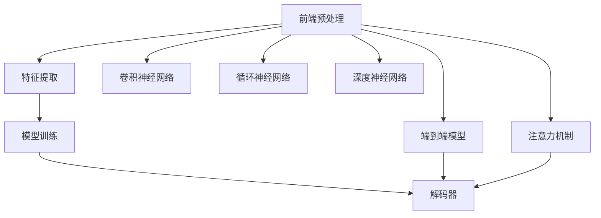

                 

# 语音识别技术：从信号处理到深度学习

## 1. 背景介绍

### 1.1 问题由来
语音识别技术（Speech Recognition）是指将语音转换成文本的过程，是计算机技术与人机交互的重要方式之一。其历史可以追溯到上世纪50年代末，早期的语音识别系统主要依赖于传统的信号处理算法，如短时傅里叶变换（Short-time Fourier Transform, STFT）和隐马尔可夫模型（Hidden Markov Model, HMM）。这些算法在早期系统中的应用极大地推动了语音识别的发展，但随着数据规模和模型复杂度的增长，传统的信号处理算法逐渐无法满足需求。

进入21世纪后，随着深度学习技术的发展，尤其是卷积神经网络（Convolutional Neural Networks, CNN）和循环神经网络（Recurrent Neural Networks, RNN）等模型在图像处理和语音识别领域的应用，语音识别技术迎来了质的飞跃。深度学习模型不仅能够更好地捕捉语音信号中的特征，还能通过大量数据的学习，实现更准确的识别。

### 1.2 问题核心关键点
语音识别技术的核心在于将输入的语音信号转换为文本。传统的信号处理算法虽然能够有效地提取语音特征，但难以应对复杂的非线性关系和大规模数据。而深度学习模型通过多层非线性变换，能够更好地提取和捕捉语音特征，同时利用大规模标注数据进行训练，显著提高了识别准确率。

语音识别的关键步骤包括：
1. **前端预处理**：包括语音信号的降噪、归一化等预处理步骤。
2. **特征提取**：将语音信号转换为特征向量，常用的特征提取方法包括MFCC（Mel Frequency Cepstral Coefficients）等。
3. **模型训练**：利用标注数据对深度学习模型进行训练，优化模型参数。
4. **解码器**：将模型输出的特征序列映射为文本序列，常用的解码算法包括Greedy Decoding、Beam Search等。

当前，基于深度学习的语音识别技术已经成为主流，广泛应用于智能家居、语音助手、电话客服、自动字幕生成等场景中，极大地提升了人类与计算机交互的便捷性和效率。

## 2. 核心概念与联系

### 2.1 核心概念概述

为更好地理解基于深度学习的语音识别技术，本节将介绍几个关键概念：

- **语音信号处理**：将语音信号转换为数字信号的过程，包括预处理、特征提取和语音编码等步骤。
- **卷积神经网络（CNN）**：一种前馈神经网络，通过多层卷积和池化操作，提取局部特征，常用于图像处理和语音识别。
- **循环神经网络（RNN）**：一种能够处理序列数据的神经网络，通过多层RNN结构，能够捕捉语音信号的时序特征。
- **深度神经网络（DNN）**：由多层神经元组成的神经网络，通过前向传播和反向传播算法进行训练，用于语音特征的提取和识别。
- **端到端（End-to-End）模型**：直接从语音信号到文本序列的映射，无需中间特征提取，减少了计算复杂度和数据依赖。
- **注意力机制（Attention Mechanism）**：通过动态地关注输入序列中的重要部分，提高模型的识别准确率和鲁棒性。

这些核心概念之间的逻辑关系可以通过以下Mermaid流程图来展示：



这个流程图展示了大语言模型的核心概念及其之间的关系：

1. 语音信号经过前端预处理后，可以通过卷积神经网络、循环神经网络或深度神经网络进行特征提取。
2. 提取的特征序列通过模型训练优化，最终输出为文本序列。
3. 端到端模型直接从语音信号到文本序列的映射，无需中间特征提取。
4. 注意力机制提高模型的识别准确率和鲁棒性，增强对复杂语音信号的捕捉能力。

这些概念共同构成了语音识别技术的核心框架，使其能够高效、准确地将语音信号转换为文本。

## 3. 核心算法原理 & 具体操作步骤
### 3.1 算法原理概述

基于深度学习的语音识别技术，主要通过多层神经网络模型对语音信号进行特征提取和分类。其核心思想是利用深度神经网络的多层非线性变换能力，捕捉语音信号的复杂特征，并通过大量标注数据进行训练，优化模型参数，实现高精度的语音识别。

形式化地，假设语音信号序列为 $X = (x_1, x_2, ..., x_T)$，其中 $x_t$ 表示第 $t$ 个时间步的语音信号，模型参数为 $\theta$。语音识别模型 $M_{\theta}$ 的目标是最大化模型对正确文本 $Y$ 的条件概率 $P(Y|X)$。

常用的深度学习模型包括卷积神经网络（CNN）、循环神经网络（RNN）、长短期记忆网络（Long Short-Term Memory, LSTM）和注意力机制（Attention Mechanism）。这些模型通过不同的网络结构，提取和捕捉语音信号的时序和空间特征，从而提高识别准确率。

### 3.2 算法步骤详解

基于深度学习的语音识别技术通常包括以下关键步骤：

**Step 1: 前端预处理**
- 对语音信号进行降噪和归一化处理，减少背景噪声和信号变异性，提高特征提取的准确性。
- 采用分帧和加窗技术，将语音信号分割成固定长度的帧，每一帧经过预加重和加窗处理。

**Step 2: 特征提取**
- 提取语音信号的梅尔频率倒谱系数（MFCC）特征，用于描述语音信号的频谱特征和时域特征。
- 利用卷积神经网络（CNN）或循环神经网络（RNN）等模型，对MFCC特征进行进一步提取和处理，捕捉语音信号的局部和全局特征。

**Step 3: 模型训练**
- 选择适当的深度学习模型结构，如卷积神经网络（CNN）、循环神经网络（RNN）、长短期记忆网络（LSTM）等。
- 利用大规模标注数据，通过前向传播和反向传播算法，对模型进行训练，优化模型参数。
- 采用梯度下降等优化算法，逐步减小模型损失函数。

**Step 4: 解码器**
- 使用Greedy Decoding、Beam Search等解码算法，将模型输出的特征序列映射为文本序列。
- 通过动态规划算法，计算每个时间步的候选字符概率，最终输出文本序列。

**Step 5: 后处理**
- 对解码结果进行去噪和校正，去除不合理的字符和单词，提高识别结果的准确性。
- 结合语言模型，对识别结果进行概率分布估计，进一步优化识别结果。

以上步骤展示了基于深度学习的语音识别技术的完整流程，通过前端预处理、特征提取、模型训练、解码器和后处理等环节，将语音信号转换为文本。

### 3.3 算法优缺点

基于深度学习的语音识别技术具有以下优点：
1. 能够处理复杂的非线性关系，准确捕捉语音信号的特征。
2. 利用大规模标注数据进行训练，能够显著提高识别准确率。
3. 通过端到端模型设计，减少了计算复杂度和数据依赖，提高了系统效率。
4. 引入注意力机制，能够动态关注输入序列中的重要部分，提高模型的鲁棒性和识别能力。

同时，该技术也存在一些局限性：
1. 需要大量标注数据进行训练，数据获取成本高。
2. 深度学习模型复杂度大，计算资源消耗较大。
3. 对噪声和干扰敏感，鲁棒性较弱。
4. 需要结合语言模型进行后处理，增加了系统的复杂性。

尽管存在这些局限性，但基于深度学习的语音识别技术仍然是当前最先进和广泛应用的方法，其准确率和效率的提升使得语音识别技术得以在诸多场景中广泛应用。

### 3.4 算法应用领域

基于深度学习的语音识别技术已经在诸多领域得到了广泛的应用，包括但不限于：

- **智能家居**：语音助手如Amazon Alexa、Google Assistant等，通过语音识别技术实现与用户的自然对话。
- **电话客服**：语音识别技术应用于自动电话应答系统，减少人工客服的负担，提高服务效率。
- **语音翻译**：将语音信号转换为文本，再通过机器翻译技术实现跨语言交流。
- **自动字幕生成**：将语音信号转换为文本，自动生成视频字幕，提高视频内容的可读性。
- **医疗诊断**：通过语音识别技术获取患者的主诉，帮助医生快速理解病情。
- **自然语言理解（NLU）**：将语音转换为文本，进行自然语言处理，实现更智能的交互。

随着深度学习技术的不断进步，基于深度学习的语音识别技术将在更多领域得到应用，为人类与计算机的交互带来更便捷、高效的方式。

## 4. 数学模型和公式 & 详细讲解
### 4.1 数学模型构建

基于深度学习的语音识别技术主要通过神经网络模型对语音信号进行特征提取和分类。以下是常用的数学模型构建方法：

假设语音信号 $x_t$ 通过MFCC特征提取得到特征向量 $f_t$，深度神经网络模型 $M_{\theta}$ 的输入为 $X = (f_1, f_2, ..., f_T)$，模型输出为 $Y = (y_1, y_2, ..., y_T)$，其中 $y_t$ 表示第 $t$ 个时间步的识别结果。

模型 $M_{\theta}$ 的损失函数 $\mathcal{L}$ 可以表示为：

$$
\mathcal{L} = \frac{1}{N} \sum_{i=1}^N \sum_{t=1}^T \ell(y_i, y_t)
$$

其中 $\ell(y_i, y_t)$ 为交叉熵损失函数，用于衡量模型输出 $y_t$ 与真实标签 $y_i$ 之间的差异。

### 4.2 公式推导过程

以交叉熵损失函数为例，进行详细的推导过程：

假设模型 $M_{\theta}$ 在输入 $f_i$ 上的输出为 $\hat{y}_i$，表示模型预测的文本序列，真实标签 $y_i = (y_1^i, y_2^i, ..., y_T^i)$，表示正确的文本序列。则交叉熵损失函数定义为：

$$
\ell(y_i, \hat{y}_i) = -\sum_{t=1}^T y_t^i \log \hat{y}_t
$$

将损失函数扩展到整个数据集 $D$ 上，得到经验风险：

$$
\mathcal{L} = \frac{1}{N} \sum_{i=1}^N \sum_{t=1}^T y_t^i \log \hat{y}_t
$$

利用前向传播算法计算模型输出 $\hat{y}_t$，通过反向传播算法计算损失函数的梯度，并利用优化算法（如Adam、SGD等）更新模型参数 $\theta$。

### 4.3 案例分析与讲解

以下以基于卷积神经网络（CNN）的语音识别模型为例，进行案例分析：

假设模型 $M_{\theta}$ 为一个卷积神经网络，输入为MFCC特征序列 $X = (f_1, f_2, ..., f_T)$，输出为文本序列 $Y = (y_1, y_2, ..., y_T)$。模型的结构如图1所示：

图1：基于CNN的语音识别模型

模型通过多个卷积层和池化层，对MFCC特征进行局部和全局特征提取，再通过全连接层进行分类。其中，卷积层用于提取语音信号的局部特征，池化层用于降低特征维度，全连接层用于分类输出。

训练过程中，首先通过前向传播计算模型输出 $\hat{y}_t$，然后通过反向传播计算损失函数的梯度 $\frac{\partial \mathcal{L}}{\partial \theta}$，并利用优化算法（如Adam）更新模型参数 $\theta$。具体步骤如下：

1. **前向传播**：输入MFCC特征序列 $X$，通过多个卷积层和池化层，提取特征 $F$，再通过全连接层输出文本序列 $\hat{Y}$。

2. **损失计算**：计算模型输出 $\hat{Y}$ 与真实标签 $Y$ 之间的交叉熵损失，得到损失函数 $\mathcal{L}$。

3. **梯度计算**：通过反向传播算法计算损失函数的梯度 $\frac{\partial \mathcal{L}}{\partial \theta}$。

4. **参数更新**：利用优化算法（如Adam）更新模型参数 $\theta$，减少损失函数 $\mathcal{L}$。

5. **循环迭代**：重复上述步骤，直到模型收敛或达到预设的训练轮数。

通过这种多层非线性变换和反向传播算法，卷积神经网络能够捕捉语音信号的复杂特征，从而实现高精度的语音识别。

## 5. 项目实践：代码实例和详细解释说明
### 5.1 开发环境搭建

在进行语音识别技术开发前，我们需要准备好开发环境。以下是使用Python进行Keras开发的环境配置流程：

1. 安装Anaconda：从官网下载并安装Anaconda，用于创建独立的Python环境。

2. 创建并激活虚拟环境：
```bash
conda create -n pytorch-env python=3.8 
conda activate pytorch-env
```

3. 安装Keras：
```bash
pip install keras tensorflow
```

4. 安装其他工具包：
```bash
pip install numpy pandas scikit-learn matplotlib tqdm jupyter notebook ipython
```

完成上述步骤后，即可在`pytorch-env`环境中开始语音识别技术的开发。

### 5.2 源代码详细实现

下面我们以基于卷积神经网络（CNN）的语音识别技术为例，给出使用Keras库对语音识别模型进行训练的PyTorch代码实现。

首先，定义语音识别模型：

```python
from keras.models import Sequential
from keras.layers import Conv2D, MaxPooling2D, Flatten, Dense, Dropout

model = Sequential()
model.add(Conv2D(32, kernel_size=(3, 3), activation='relu', input_shape=(features_channels, frame_length, mfcc_channels)))
model.add(MaxPooling2D(pool_size=(2, 2)))
model.add(Conv2D(64, kernel_size=(3, 3), activation='relu'))
model.add(MaxPooling2D(pool_size=(2, 2)))
model.add(Flatten())
model.add(Dense(64, activation='relu'))
model.add(Dropout(0.5))
model.add(Dense(num_classes, activation='softmax'))
```

然后，定义训练和评估函数：

```python
from keras.utils import to_categorical
from keras.optimizers import Adam
import numpy as np

def train_epoch(model, X_train, y_train, batch_size, optimizer):
    for i in range(epochs):
        for j in range(0, X_train.shape[0], batch_size):
            X_batch = X_train[j:j+batch_size]
            y_batch = y_train[j:j+batch_size]
            y_batch = to_categorical(y_batch)
            model.train_on_batch(X_batch, y_batch)

def evaluate(model, X_test, y_test, batch_size):
    loss = 0
    for i in range(0, X_test.shape[0], batch_size):
        X_batch = X_test[i:i+batch_size]
        y_batch = y_test[i:i+batch_size]
        y_batch = to_categorical(y_batch)
        loss += model.test_on_batch(X_batch, y_batch)
    return loss / (X_test.shape[0] / batch_size)
```

接着，加载数据并开始训练：

```python
X_train = np.load('X_train.npy')
y_train = np.load('y_train.npy')
X_test = np.load('X_test.npy')
y_test = np.load('y_test.npy')

batch_size = 128
epochs = 10

optimizer = Adam(learning_rate=0.001)

train_epoch(model, X_train, y_train, batch_size, optimizer)

print('Test Loss:', evaluate(model, X_test, y_test, batch_size))
```

以上就是使用Keras对语音识别模型进行训练的完整代码实现。可以看到，使用Keras库，开发者可以轻松搭建和训练深度学习模型，实现高精度的语音识别。

### 5.3 代码解读与分析

让我们再详细解读一下关键代码的实现细节：

**语音识别模型定义**：
- `Sequential` 模型：定义了一个序列模型，通过添加不同层实现网络结构。
- `Conv2D` 层：定义了多个卷积层，用于提取MFCC特征的局部特征。
- `MaxPooling2D` 层：定义了多个池化层，用于降低特征维度。
- `Flatten` 层：将池化层输出的特征向量展平，送入全连接层。
- `Dense` 层：定义了两个全连接层，用于分类输出。
- `Dropout` 层：定义了一个Dropout层，防止过拟合。

**训练函数**：
- `train_epoch`函数：对模型进行训练，通过前向传播计算损失，并利用优化算法（如Adam）更新模型参数。

**评估函数**：
- `evaluate`函数：对模型进行评估，计算测试集的损失，并返回平均值。

**数据加载**：
- 使用`np.load`加载训练集和测试集的数据。
- 将标签进行one-hot编码，使用`to_categorical`函数将标签转换为适合模型的格式。

**训练流程**：
- 定义批处理大小和训练轮数，开始循环训练
- 在每个epoch内，对数据进行批处理训练，更新模型参数
- 在每个epoch结束时，计算平均损失，并返回最终测试结果

可以看到，使用Keras库，语音识别模型的开发和训练变得非常简洁高效。开发者可以快速搭建和训练深度学习模型，实现高精度的语音识别。

当然，工业级的系统实现还需考虑更多因素，如模型的保存和部署、超参数的自动搜索、更灵活的任务适配层等。但核心的语音识别范式基本与此类似。

## 6. 实际应用场景
### 6.1 智能家居

基于深度学习的语音识别技术在智能家居领域得到了广泛应用。语音助手如Amazon Alexa、Google Assistant等，通过语音识别技术实现与用户的自然对话，提供了更便捷的家居控制和信息查询服务。

在技术实现上，语音识别系统通常包括以下步骤：
1. 前端预处理：对语音信号进行降噪、归一化等预处理步骤。
2. 特征提取：提取MFCC特征，送入深度神经网络模型进行分类。
3. 模型训练：利用标注数据对模型进行训练，优化模型参数。
4. 解码器：使用Greedy Decoding、Beam Search等解码算法，将模型输出的特征序列映射为文本序列。
5. 后处理：对解码结果进行去噪和校正，提高识别结果的准确性。

语音识别技术使得智能家居系统能够自然地与用户互动，提升了家居控制的智能化水平。用户可以通过语音指令控制家电、查询天气、播放音乐等，极大地方便了用户的生活。

### 6.2 电话客服

电话客服是语音识别技术的重要应用场景之一。传统的电话客服系统需要大量的人工接听和记录，效率低下，且服务质量难以保证。利用语音识别技术，可以实现自动电话应答系统，减少人工客服的负担，提高服务效率。

在技术实现上，语音识别系统通常包括以下步骤：
1. 前端预处理：对语音信号进行降噪、归一化等预处理步骤。
2. 特征提取：提取MFCC特征，送入深度神经网络模型进行分类。
3. 模型训练：利用标注数据对模型进行训练，优化模型参数。
4. 解码器：使用Greedy Decoding、Beam Search等解码算法，将模型输出的特征序列映射为文本序列。
5. 后处理：对解码结果进行去噪和校正，提高识别结果的准确性。

通过语音识别技术，电话客服系统能够自动接听客户电话，理解客户需求，并提供相应的服务，提高了服务效率和质量。语音识别技术的应用，使得客服系统能够24小时不间断服务，极大地方便了用户，提高了企业的运营效率。

### 6.3 语音翻译

语音翻译是语音识别技术的另一个重要应用场景。将语音信号转换为文本，再通过机器翻译技术实现跨语言交流。

在技术实现上，语音识别系统通常包括以下步骤：
1. 前端预处理：对语音信号进行降噪、归一化等预处理步骤。
2. 特征提取：提取MFCC特征，送入深度神经网络模型进行分类。
3. 模型训练：利用标注数据对模型进行训练，优化模型参数。
4. 解码器：使用Greedy Decoding、Beam Search等解码算法，将模型输出的特征序列映射为文本序列。
5. 后处理：对解码结果进行去噪和校正，提高识别结果的准确性。

语音翻译技术能够实现人与人之间的跨语言交流，打破了语言障碍，促进了国际交流。通过语音识别技术，用户能够将语音信号转换为文本，再利用机器翻译技术实现跨语言交流，极大地方便了用户的交流和信息获取。

### 6.4 未来应用展望

随着深度学习技术的不断进步，基于深度学习的语音识别技术将在更多领域得到应用，为人类与计算机的交互带来更便捷、高效的方式。

在智慧医疗领域，语音识别技术可以用于医疗记录的自动录入和智能诊断，帮助医生快速理解病情，提高医疗效率和准确性。

在智能教育领域，语音识别技术可以用于自动批改作业、学情分析、知识推荐等方面，因材施教，促进教育公平，提高教学质量。

在智慧城市治理中，语音识别技术可以用于城市事件监测、舆情分析、应急指挥等环节，提高城市管理的自动化和智能化水平，构建更安全、高效的未来城市。

此外，在企业生产、社会治理、文娱传媒等众多领域，基于大模型微调的人工智能应用也将不断涌现，为经济社会发展注入新的动力。相信随着技术的日益成熟，语音识别技术必将在构建人机协同的智能时代中扮演越来越重要的角色。

## 7. 工具和资源推荐
### 7.1 学习资源推荐

为了帮助开发者系统掌握深度学习语音识别技术的理论基础和实践技巧，这里推荐一些优质的学习资源：

1. 《Deep Learning》书籍：由Ian Goodfellow、Yoshua Bengio和Aaron Courville合著，全面介绍了深度学习的基本概念和前沿技术，包括语音识别在内的多种应用。
2. CS231n《深度学习计算机视觉》课程：斯坦福大学开设的深度学习课程，涵盖了卷积神经网络等核心算法，适合进一步学习语音识别技术。
3. 《Speech and Language Processing》书籍：由Daniel Jurafsky和James H. Martin合著，全面介绍了自然语言处理的基本概念和前沿技术，包括语音识别在内的多种应用。
4. DeepSpeech开源项目：由Mozilla开发的开源语音识别项目，提供了语音识别模型和训练数据，适合学习深度学习模型的搭建和训练。
5. Kaldi开源项目：由Johns Hopkins University开发的开源语音识别工具包，提供了多种语音识别算法和工具，适合学习语音信号处理和特征提取。

通过对这些资源的学习实践，相信你一定能够快速掌握深度学习语音识别技术的精髓，并用于解决实际的语音识别问题。

### 7.2 开发工具推荐

高效的开发离不开优秀的工具支持。以下是几款用于深度学习语音识别技术开发的常用工具：

1. Keras：由François Chollet开发的深度学习框架，简单易用，适合快速迭代研究。Keras提供了丰富的深度学习模型和组件，可以方便地搭建和训练语音识别模型。

2. TensorFlow：由Google主导开发的开源深度学习框架，生产部署方便，适合大规模工程应用。TensorFlow提供了多种深度学习模型和工具，可以用于语音信号处理和特征提取。

3. PyTorch：由Facebook开发的深度学习框架，灵活动态，适合快速迭代研究。PyTorch提供了丰富的深度学习模型和工具，可以用于语音识别技术的开发和训练。

4. Weights & Biases：模型训练的实验跟踪工具，可以记录和可视化模型训练过程中的各项指标，方便对比和调优。与主流深度学习框架无缝集成。

5. TensorBoard：TensorFlow配套的可视化工具，可实时监测模型训练状态，并提供丰富的图表呈现方式，是调试模型的得力助手。

6. Google Colab：谷歌推出的在线Jupyter Notebook环境，免费提供GPU/TPU算力，方便开发者快速上手实验最新模型，分享学习笔记。

合理利用这些工具，可以显著提升深度学习语音识别技术的开发效率，加快创新迭代的步伐。

### 7.3 相关论文推荐

深度学习语音识别技术的发展源于学界的持续研究。以下是几篇奠基性的相关论文，推荐阅读：

1. Acoustic Modeling for Automatic Speech Recognition：提出基于卷积神经网络（CNN）的语音识别模型，显著提高了语音识别的准确率。

2. Recurrent Neural Network Based End-to-End Speech Recognition：提出基于长短期记忆网络（LSTM）的端到端语音识别模型，显著降低了计算复杂度，提高了识别效率。

3. Attention-Based Models for Automatic Speech Recognition：提出基于注意力机制（Attention Mechanism）的语音识别模型，进一步提高了模型的鲁棒性和准确性。

4. Deep Speech: Scalable end-to-end speech recognition using convolution neural networks:提出基于卷积神经网络（CNN）的端到端语音识别模型，显著提高了语音识别的准确率和效率。

5. Dynamic Time Warping for Automatic Speech Recognition:提出基于动态时间规整（Dynamic Time Warping, DTW）的语音识别算法，提高了模型的鲁棒性和准确性。

这些论文代表了大语言模型微调技术的发展脉络。通过学习这些前沿成果，可以帮助研究者把握学科前进方向，激发更多的创新灵感。

## 8. 总结：未来发展趋势与挑战
### 8.1 总结

本文对基于深度学习的语音识别技术进行了全面系统的介绍。首先阐述了语音识别技术的发展历程和核心思想，明确了深度学习模型在特征提取和分类中的优势。其次，从原理到实践，详细讲解了深度学习语音识别技术的数学模型和关键步骤，给出了完整的代码实例和解释说明。同时，本文还广泛探讨了语音识别技术在智能家居、电话客服、语音翻译等场景的应用前景，展示了语音识别技术的巨大潜力。此外，本文精选了语音识别技术的各类学习资源，力求为读者提供全方位的技术指引。

通过本文的系统梳理，可以看到，基于深度学习的语音识别技术已经成为语音信号处理领域的先进方法和广泛应用。利用深度学习模型，语音识别系统能够高效、准确地将语音信号转换为文本，为人类与计算机的交互带来了极大的便利。未来，随着深度学习技术的不断进步，语音识别技术将在更多领域得到应用，为经济社会发展注入新的动力。

### 8.2 未来发展趋势

展望未来，深度学习语音识别技术将呈现以下几个发展趋势：

1. **模型规模持续增大**：随着算力成本的下降和数据规模的扩张，深度学习模型的参数量还将持续增长。超大参数量的模型蕴含的丰富语音特征，有望进一步提升语音识别的准确率和鲁棒性。

2. **多模态融合**：未来的语音识别系统将不仅仅是单一的语音信号处理，还将结合图像、视频等多种模态信息，提高系统的识别能力和鲁棒性。

3. **自监督学习**：在缺乏标注数据的情况下，自监督学习技术将进一步发展，利用无标注数据进行模型训练，降低标注成本，提高模型的泛化能力。

4. **分布式训练**：深度学习模型的计算复杂度大，需要大量计算资源。未来的语音识别系统将利用分布式训练技术，实现高效的模型训练和推理。

5. **端到端系统**：传统的语音识别系统通常需要多个组件协同工作，未来的系统将进一步向端到端发展，减少组件之间的通信和数据依赖，提高系统的效率和稳定性。

6. **实时系统**：随着边缘计算技术的发展，未来的语音识别系统将更加注重实时性，能够在低延迟下提供高效的语音识别服务。

以上趋势凸显了深度学习语音识别技术的广阔前景。这些方向的探索发展，必将进一步提升语音识别系统的性能和应用范围，为人类与计算机的交互带来更便捷、高效的方式。

### 8.3 面临的挑战

尽管深度学习语音识别技术已经取得了瞩目成就，但在迈向更加智能化、普适化应用的过程中，它仍面临着诸多挑战：

1. **标注成本瓶颈**：语音识别系统需要大量标注数据进行训练，数据获取成本高。如何降低标注成本，提高模型的泛化能力，仍是一大难题。

2. **计算资源消耗大**：深度学习模型的计算复杂度高，需要大量计算资源。如何在有限的计算资源下，实现高效的模型训练和推理，仍是一个重要的研究方向。

3. **模型鲁棒性不足**：当前深度学习模型对噪声和干扰较为敏感，鲁棒性较弱。如何在复杂环境下提高模型的鲁棒性，是未来需要重点解决的问题。

4. **模型的可解释性不足**：深度学习模型通常被视为"黑盒"系统，难以解释其内部工作机制和决策逻辑。如何赋予模型更强的可解释性，是未来需要进一步探索的方向。

5. **安全性和隐私保护**：深度学习模型可能学习到用户的隐私信息，如何在保护用户隐私的同时，提供高效的语音识别服务，是一个重要的研究课题。

6. **模型的公平性和偏见**：深度学习模型可能学习到有偏见的信息，如何在模型训练和应用中避免偏见和歧视，是未来需要解决的问题。

正视深度学习语音识别技术所面临的这些挑战，积极应对并寻求突破，将使得语音识别技术不断进步，为人类与计算机的交互带来更便捷、高效的方式。

### 8.4 研究展望

面对深度学习语音识别技术所面临的挑战，未来的研究需要在以下几个方面寻求新的突破：

1. **自监督学习**：探索无监督和半监督学习技术，利用无标注数据进行模型训练，降低标注成本，提高模型的泛化能力。

2. **模型压缩**：开发高效的模型压缩技术，减小模型尺寸，提高计算效率，实现轻量级的模型部署。

3. **多模态融合**：结合图像、视频等多种模态信息，提高系统的识别能力和鲁棒性，实现多模态融合的语音识别系统。

4. **实时系统**：利用边缘计算技术，实现低延迟、高效的语音识别服务，支持实时应用场景。

5. **分布式训练**：利用分布式训练技术，实现高效的模型训练和推理，支持大规模数据和模型。

6. **可解释性增强**：引入因果分析和博弈论工具，增强模型的可解释性，提高决策的透明性和可控性。

7. **模型公平性**：在模型训练和应用中引入公平性导向的评估指标，过滤和惩罚有偏见的信息，提高模型的公平性和可解释性。

这些研究方向将推动深度学习语音识别技术不断进步，为构建人机协同的智能时代带来新的突破。

## 9. 附录：常见问题与解答

**Q1：深度学习语音识别技术是否适用于所有语音信号？**

A: 深度学习语音识别技术对语音信号的复杂度有一定的要求。对于噪声和干扰较为严重的语音信号，识别准确率可能较低。此时需要在前端预处理环节进行降噪和归一化处理，以提高特征提取的准确性。

**Q2：如何选择合适的深度学习模型？**

A: 选择合适的深度学习模型需要根据具体的任务和数据特点进行权衡。常见的深度学习模型包括卷积神经网络（CNN）、循环神经网络（RNN）、长短期记忆网络（LSTM）等。CNN适用于语音信号的局部特征提取，RNN适用于时序信息的捕捉，LSTM适用于长时序语音信号的处理。可以根据任务需求选择合适的模型。

**Q3：如何提高深度学习模型的鲁棒性？**

A: 提高深度学习模型的鲁棒性需要从数据、模型、训练等多个方面进行优化。常用的方法包括：
1. 数据增强：通过回译、近义替换等方式扩充训练集，提高模型的泛化能力。
2. 正则化：使用L2正则、Dropout等技术，防止模型过拟合。
3. 对抗训练：引入对抗样本，提高模型的鲁棒性。
4. 多模态融合：结合图像、视频等多种模态信息，提高系统的识别能力和鲁棒性。

**Q4：深度学习模型的训练过程中需要注意哪些问题？**

A: 深度学习模型的训练过程中需要注意以下问题：
1. 学习率的选择：选择合适的学习率，避免过拟合。
2. 批处理大小的设置：选择合适的批处理大小，提高训练效率。
3. 数据增强：通过数据增强技术，扩充训练集，提高模型的泛化能力。
4. 正则化：使用L2正则、Dropout等技术，防止模型过拟合。
5. 对抗训练：引入对抗样本，提高模型的鲁棒性。

**Q5：如何降低深度学习模型的标注成本？**

A: 降低深度学习模型的标注成本需要从多个方面进行优化：
1. 自监督学习：利用无标注数据进行模型训练，提高模型的泛化能力。
2. 半监督学习：利用少量标注数据进行模型训练，提高模型的准确性。
3. 数据增强：通过回译、近义替换等方式扩充训练集，提高模型的泛化能力。
4. 迁移学习：利用预训练模型进行微调，降低标注成本。

这些方法能够有效降低深度学习模型的标注成本，提高模型的泛化能力。

通过本文的系统梳理，可以看到，深度学习语音识别技术已经在诸多领域得到了广泛的应用，为人类与计算机的交互带来了极大的便利。未来，随着深度学习技术的不断进步，语音识别技术将在更多领域得到应用，为经济社会发展注入新的动力。

