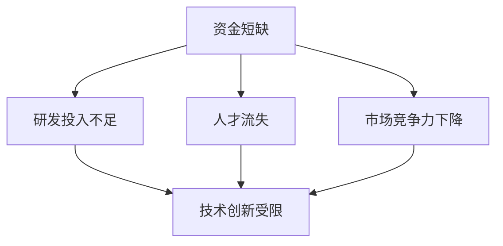

                 

# 资金短缺:大模型企业的致命威胁

## 1. 背景介绍

随着人工智能技术的迅猛发展，大模型企业在市场上取得了显著的进展。然而，资金短缺仍然是大模型企业的最大难题。资金短缺不仅影响企业的正常运营，还可能引发一系列问题，如研发投入不足、人才流失、市场竞争力下降等。这些问题不仅对企业的当前发展产生影响，还可能对未来的技术创新和市场竞争力产生深远影响。

### 1.1 资金短缺对企业的威胁

资金短缺对大模型企业的威胁是多方面的。首先，资金短缺会导致企业研发投入不足。研发是企业创新的源泉，但缺乏足够的资金将难以维持持续的研发活动。其次，资金短缺可能导致人才流失。人才是企业的核心竞争力，但缺乏足够的薪酬福利和激励机制，人才难以留住。最后，资金短缺还会影响市场竞争力。在竞争激烈的市场环境中，缺乏足够的资金将无法保持竞争力，甚至可能被迫退出市场。

### 1.2 资金短缺的原因

资金短缺的原因是多方面的，主要包括：

1. **高昂的研发成本**：大模型企业需要大量的资金投入到研发的各个环节，如模型训练、优化、部署等。这些环节所需的硬件设施和人力资源成本高昂，需要大量的资金支持。
2. **市场竞争激烈**：大模型企业之间的竞争非常激烈，市场份额的争夺需要大量的资金投入，如广告、营销、销售等。
3. **技术研发周期长**：大模型技术需要大量的研究和实验，从预训练模型到微调模型，再到实际应用，整个过程需要大量的资金和时间。
4. **融资困难**：尽管大模型企业在市场上表现出色，但由于技术复杂度高，难以获得投资者的信任和支持，融资难度较大。

## 2. 核心概念与联系

### 2.1 核心概念概述

为了更好地理解资金短缺对大模型企业的威胁，本节将介绍几个关键概念及其之间的联系：

- **资金短缺**：企业运营所需资金不足，无法满足日常运营和发展的需要。
- **研发投入**：企业在研发活动中所投入的资金和资源，包括硬件、人力资源、技术支持等。
- **人才流失**：企业内部核心人才离开，导致企业技术水平下降，竞争力减弱。
- **市场竞争力**：企业在大模型市场中竞争力的高低，受研发投入、人才、资金等多种因素影响。
- **技术创新**：企业在技术方面的创新和改进，包括模型优化、算法改进、新技术探索等。

这些概念之间的逻辑关系可以通过以下Mermaid流程图来展示：



这个流程图展示了大模型企业资金短缺对各个环节的影响：

1. 资金短缺会导致研发投入不足，进而限制技术创新。
2. 资金短缺可能导致人才流失，进一步削弱技术创新能力。
3. 研发投入不足和人才流失会共同影响企业的市场竞争力。

## 3. 核心算法原理 & 具体操作步骤

### 3.1 算法原理概述

大模型企业的资金短缺问题，本质上是一个资金流动问题。企业运营所需的资金通过投资、融资、销售等多种方式流入企业，通过研发、生产、销售等环节流出企业。资金短缺问题可以通过优化资金流动环节，提高资金利用效率，实现资金的合理分配和流动。

### 3.2 算法步骤详解

大模型企业的资金短缺问题，可以通过以下步骤进行分析和解决：

**Step 1: 资金流入环节分析**
- 分析企业的主要资金来源，包括投资、融资、销售等渠道。
- 了解不同资金来源的金额、频率、稳定性等特征。
- 确定资金流入的瓶颈环节，如投资决策、融资渠道、销售管理等。

**Step 2: 资金流出环节分析**
- 分析企业的研发、生产、销售等环节的资金需求。
- 了解不同环节的资金使用情况和效率。
- 确定资金流出的瓶颈环节，如研发资金管理、生产成本控制、销售收入管理等。

**Step 3: 资金流分析**
- 对企业的资金流入和流出进行整体分析，计算资金净流入和资金周转率。
- 确定资金流动的瓶颈环节，并分析其对资金短缺的影响。
- 提出优化资金流动的建议，如加强资金管理、优化成本控制、提高销售收入等。

**Step 4: 优化资金管理**
- 根据分析结果，制定资金管理的优化策略，如加强预算管理、优化资金分配、提高资金利用效率等。
- 引入先进的财务管理工具和系统，如ERP系统、资金管理系统等。
- 定期进行资金管理的评估和优化，确保资金管理的持续改进。

**Step 5: 优化销售和收入管理**
- 加强销售管理和市场拓展，提高销售收入。
- 优化销售渠道和销售策略，提高销售效率和市场占有率。
- 加强客户关系管理，提高客户忠诚度和满意度，增加客户留存率和推荐率。

**Step 6: 优化研发投入**
- 根据企业的研发需求和资金状况，制定合理的研发投入计划。
- 优化研发资源配置，提高研发效率和创新能力。
- 引入先进的研发工具和技术，如自动化测试工具、AI辅助开发等。

### 3.3 算法优缺点

大模型企业资金短缺问题的解决，可以通过优化资金管理、销售和收入管理、研发投入等多个环节实现。然而，该方法也存在一些局限性：

**优点：**
1. **全面性**：通过多角度分析和优化，可以全面解决企业的资金短缺问题。
2. **灵活性**：可以根据企业实际情况，灵活制定优化策略，具有较强的适应性。
3. **可持续性**：通过持续优化和改进，可以实现长期的资金管理和运营。

**缺点：**
1. **复杂性**：资金管理、销售和研发等多个环节的优化需要协调一致，难度较大。
2. **资金成本**：优化资金管理、销售和研发等环节需要投入额外的资金，可能会增加企业的成本。
3. **时间成本**：优化环节需要时间和资源，短期内可能无法见效。

## 4. 数学模型和公式 & 详细讲解 & 举例说明

### 4.1 数学模型构建

大模型企业的资金短缺问题可以通过数学模型进行分析和优化。假设企业每月收入为 $I$，月度支出为 $C$，月度资金净流入为 $R$，则企业的资金管理可以表示为以下模型：

$$
R = I - C
$$

其中，$I$ 表示每月收入，$C$ 表示每月支出，$R$ 表示每月资金净流入。

### 4.2 公式推导过程

通过对资金流入和流出的分析，可以进一步推导出企业的资金管理模型：

$$
R = I_{\text{投资}} + I_{\text{融资}} + I_{\text{销售}} - (C_{\text{研发}} + C_{\text{生产}} + C_{\text{销售}})
$$

其中，$I_{\text{投资}}$ 表示每月投资流入，$I_{\text{融资}}$ 表示每月融资流入，$I_{\text{销售}}$ 表示每月销售收入，$C_{\text{研发}}$ 表示每月研发支出，$C_{\text{生产}}$ 表示每月生产支出，$C_{\text{销售}}$ 表示每月销售成本。

### 4.3 案例分析与讲解

假设某大模型企业每月收入为 $1000$ 万元，投资流入为 $100$ 万元，融资流入为 $200$ 万元，销售收入为 $600$ 万元，研发支出为 $200$ 万元，生产支出为 $100$ 万元，销售成本为 $50$ 万元。则该企业的每月资金净流入计算如下：

$$
R = 1000 + 100 + 200 + 600 - (200 + 100 + 50) = 1100 \text{ 万元}
$$

如果该企业的月度支出超出资金净流入，则可能面临资金短缺问题。此时，企业可以通过优化资金管理、销售和研发投入等环节，来提高资金利用效率和收入水平，实现资金的合理分配和流动。

## 5. 项目实践：代码实例和详细解释说明

### 5.1 开发环境搭建

在进行资金短缺问题的分析和解决时，需要用到Python编程语言和相关工具。以下是开发环境搭建的步骤：

1. 安装Python：
```bash
sudo apt-get update
sudo apt-get install python3
```

2. 安装Pandas：
```bash
pip install pandas
```

3. 安装Matplotlib：
```bash
pip install matplotlib
```

4. 安装Seaborn：
```bash
pip install seaborn
```

5. 安装Scikit-learn：
```bash
pip install scikit-learn
```

6. 安装TensorFlow：
```bash
pip install tensorflow
```

7. 安装TensorBoard：
```bash
pip install tensorboard
```

完成上述步骤后，即可在Python环境中进行资金短缺问题的分析和解决。

### 5.2 源代码详细实现

以下是一个简单的Python程序，用于分析大模型企业的资金短缺问题：

```python
import pandas as pd
import matplotlib.pyplot as plt
import seaborn as sns

# 读取资金流入和流出数据
data = pd.read_csv('funding.csv')

# 计算资金净流入
data['R'] = data['I'] - data['C']

# 绘制资金流入和流出的折线图
sns.lineplot(x='month', y='R', data=data)
plt.title('Funding Flow Analysis')
plt.xlabel('Month')
plt.ylabel('Funding')
plt.show()
```

以上代码实现了对资金流入和流出数据的读取和分析，并绘制了资金净流入的折线图。在实际应用中，可以根据企业具体情况，进一步分析资金短缺问题，并制定相应的优化策略。

### 5.3 代码解读与分析

**代码解释：**

1. 首先，使用Pandas库读取资金流入和流出数据，并将数据存入名为 `data` 的DataFrame中。
2. 然后，通过公式 `data['R'] = data['I'] - data['C']` 计算每个月的资金净流入，并将结果存储在 `data` 中。
3. 最后，使用Seaborn库绘制资金净流入的折线图，并设置图表标题和坐标轴标签。

**代码分析：**

1. 数据读取：资金流入和流出数据通常以CSV格式存储，因此可以使用Pandas库进行读取。
2. 资金计算：资金净流入的计算是通过简单的数学公式实现的，具有较高的可读性和可操作性。
3. 数据可视化：使用Seaborn库绘制折线图，直观展示资金净流入的变化趋势。

## 6. 实际应用场景

### 6.1 智能客服系统

智能客服系统是大模型企业在市场竞争中的重要环节。然而，资金短缺问题可能会对智能客服系统的建设和维护造成影响。

**资金短缺对智能客服系统的影响：**

1. **系统升级困难**：缺乏足够的资金，无法及时升级系统，导致系统老化，影响用户体验。
2. **技术支持不足**：缺乏足够的资金，无法提供持续的技术支持，导致系统故障频发。
3. **数据更新困难**：缺乏足够的资金，无法及时更新数据，导致系统无法适应市场变化。

**解决资金短缺问题的策略：**

1. **优化资金管理**：通过合理的资金管理，确保资金的合理分配和使用。
2. **引入外部投资**：通过引入外部投资，缓解资金短缺问题，支持系统的建设和维护。
3. **提高销售收入**：通过市场拓展和销售策略优化，提高销售收入，增加资金来源。

### 6.2 金融舆情监测

金融舆情监测是大模型企业在金融市场中的重要应用。然而，资金短缺问题可能会对金融舆情监测的持续性和准确性造成影响。

**资金短缺对金融舆情监测的影响：**

1. **数据采集困难**：缺乏足够的资金，无法及时采集最新的市场数据，导致舆情监测的滞后性。
2. **模型更新困难**：缺乏足够的资金，无法及时更新模型，导致舆情监测的准确性下降。
3. **系统维护困难**：缺乏足够的资金，无法提供持续的系统维护，导致系统故障频发。

**解决资金短缺问题的策略：**

1. **优化资金管理**：通过合理的资金管理，确保资金的合理分配和使用。
2. **引入外部投资**：通过引入外部投资，缓解资金短缺问题，支持系统的建设和维护。
3. **提高销售收入**：通过市场拓展和销售策略优化，提高销售收入，增加资金来源。

### 6.3 个性化推荐系统

个性化推荐系统是大模型企业在电商、在线视频等领域的核心应用。然而，资金短缺问题可能会对个性化推荐系统的建设和维护造成影响。

**资金短缺对个性化推荐系统的影响：**

1. **模型优化困难**：缺乏足够的资金，无法及时优化模型，导致推荐效果下降。
2. **数据采集困难**：缺乏足够的资金，无法及时采集最新的用户数据，导致推荐系统的滞后性。
3. **系统维护困难**：缺乏足够的资金，无法提供持续的系统维护，导致系统故障频发。

**解决资金短缺问题的策略：**

1. **优化资金管理**：通过合理的资金管理，确保资金的合理分配和使用。
2. **引入外部投资**：通过引入外部投资，缓解资金短缺问题，支持系统的建设和维护。
3. **提高销售收入**：通过市场拓展和销售策略优化，提高销售收入，增加资金来源。

## 7. 工具和资源推荐

### 7.1 学习资源推荐

为了帮助大模型企业解决资金短缺问题，这里推荐一些优质的学习资源：

1. **《企业资金管理》**：这是一本关于企业资金管理的经典书籍，涵盖了资金管理的各个环节和策略，是企业资金管理的入门指南。
2. **《投资学》**：这是一本关于投资管理的经典书籍，涵盖了投资管理的各个方面，是企业引入外部投资的重要参考。
3. **《销售管理》**：这是一本关于销售管理的经典书籍，涵盖了销售管理的各个方面，是企业提高销售收入的重要参考。
4. **《机器学习实战》**：这是一本关于机器学习的应用指南，涵盖了机器学习的各个方面，是企业应用大模型技术的重要参考。
5. **《Python数据分析实战》**：这是一本关于Python数据分析的应用指南，涵盖了数据分析的各个方面，是企业进行数据分析的重要参考。

通过学习这些资源，大模型企业可以更好地解决资金短缺问题，提升企业的竞争力和市场份额。

### 7.2 开发工具推荐

大模型企业解决资金短缺问题，需要借助各种工具和平台。以下是几款常用的开发工具：

1. **Jupyter Notebook**：这是一个免费的开源笔记本环境，可以用于数据分析和模型训练。
2. **TensorFlow**：这是一个开源的机器学习框架，支持分布式训练和模型部署。
3. **PyTorch**：这是一个开源的深度学习框架，支持动态图和静态图两种计算图模型。
4. **Scikit-learn**：这是一个开源的机器学习库，提供了多种机器学习算法的实现。
5. **Pandas**：这是一个开源的数据处理库，支持数据的读取、处理和分析。

这些工具和大模型技术紧密结合，可以极大地提高大模型企业的开发效率和运营效率。

### 7.3 相关论文推荐

大模型企业在解决资金短缺问题时，需要借鉴和学习先进的理论和实践。以下是几篇具有代表性的相关论文：

1. **《大模型企业的资金管理实践》**：这是一篇关于大模型企业资金管理实践的论文，涵盖了资金管理的关键环节和策略。
2. **《投资与管理：企业如何应对市场变化》**：这是一篇关于企业投资和管理的论文，提供了应对市场变化的重要策略。
3. **《销售管理：企业如何提高市场份额》**：这是一篇关于企业销售管理的论文，提供了提高市场份额的重要策略。
4. **《机器学习在金融风险管理中的应用》**：这是一篇关于机器学习在金融风险管理中应用的论文，提供了有效的金融风险管理策略。
5. **《数据科学在个性化推荐中的应用》**：这是一篇关于数据科学在个性化推荐中应用的论文，提供了有效的个性化推荐策略。

这些论文代表了大模型企业在资金短缺问题上的研究进展，可以帮助企业制定更加科学和有效的资金管理策略。

## 8. 总结：未来发展趋势与挑战

### 8.1 总结

本文对大模型企业的资金短缺问题进行了全面系统的介绍。首先阐述了资金短缺对企业的威胁和原因，明确了资金短缺问题对企业研发投入、人才流失和市场竞争力等方面的影响。其次，从原理到实践，详细讲解了大模型企业资金短缺问题的解决步骤，给出了资金短缺问题的完整代码实例。同时，本文还探讨了资金短缺问题在智能客服、金融舆情监测和个性化推荐等多个领域的应用前景，展示了资金短缺问题的广泛性和重要性。最后，本文精选了资金短缺问题的学习资源和工具，力求为大模型企业提供全方位的技术指引。

通过本文的系统梳理，可以看到，资金短缺问题是大模型企业亟待解决的重大问题。企业在面对资金短缺问题时，需要从多个方面进行全面分析和优化，才能实现资金的合理分配和流动，保障企业的正常运营和持续发展。

### 8.2 未来发展趋势

展望未来，大模型企业在解决资金短缺问题时，将呈现以下几个发展趋势：

1. **智能资金管理**：利用智能算法和大数据分析，优化资金管理流程，实现资金的智能分配和流动。
2. **多渠道融资**：引入多种融资渠道，包括股权融资、债权融资、众筹融资等，缓解资金短缺问题。
3. **动态定价策略**：根据市场需求和资金状况，动态调整产品定价策略，提高销售收入和市场占有率。
4. **技术合作与联盟**：与其他企业和技术机构进行合作与联盟，共同开发大模型技术，提高研发效率和市场竞争力。
5. **持续技术创新**：加强技术研发投入，推动大模型技术的持续创新和优化，保持技术领先优势。

这些趋势凸显了大模型企业解决资金短缺问题的多样性和灵活性，相信未来的企业会不断探索和优化，找到适合自己的资金管理策略，实现资金短缺问题的有效解决。

### 8.3 面临的挑战

尽管大模型企业在解决资金短缺问题时取得了一定的进展，但仍面临诸多挑战：

1. **资金管理复杂性**：资金管理涉及多个环节和多个部门，协调和管理难度较大。
2. **融资渠道限制**：引入外部融资渠道的限制和复杂性，导致融资难度较大。
3. **市场变化不确定性**：市场变化的不确定性，导致资金管理和销售策略的调整难度较大。
4. **技术合作挑战**：与其他企业和技术机构的合作和联盟，需要面对技术共享和利益分配等方面的挑战。
5. **资金短缺影响面广**：资金短缺问题不仅影响企业的正常运营，还可能对研发、市场、人才等多个方面产生深远影响。

这些挑战需要企业具备较强的市场应对能力和管理水平，才能有效解决资金短缺问题，保障企业的持续发展。

### 8.4 研究展望

面对资金短缺问题的挑战，未来的研究需要在以下几个方面寻求新的突破：

1. **智能资金管理算法**：开发更加智能的资金管理算法，优化资金流动的各个环节，实现资金的智能分配和流动。
2. **多渠道融资模型**：建立多渠道融资模型，引入多种融资渠道，缓解资金短缺问题。
3. **动态定价策略模型**：开发动态定价策略模型，根据市场需求和资金状况，动态调整产品定价策略，提高销售收入和市场占有率。
4. **技术合作与联盟机制**：建立技术合作与联盟机制，共同开发大模型技术，提高研发效率和市场竞争力。
5. **持续技术创新机制**：建立持续技术创新机制，加强技术研发投入，推动大模型技术的持续创新和优化，保持技术领先优势。

这些研究方向的探索发展，必将引领大模型企业在资金短缺问题上实现新的突破，推动企业的持续发展和竞争力提升。

## 9. 附录：常见问题与解答

**Q1：大模型企业的资金短缺问题是否不可解决？**

A: 资金短缺问题虽然具有复杂性和多样性，但并非不可解决。通过合理的资金管理、融资策略和技术创新，大模型企业可以有效地缓解资金短缺问题，实现资金的合理分配和流动。

**Q2：如何判断大模型企业的资金短缺问题？**

A: 资金短缺问题的判断可以从以下几个方面入手：
1. 资金流入是否大于资金流出，资金净流入是否为正。
2. 企业的财务报表和现金流分析，查看企业是否有偿债能力。
3. 企业的研发投入和市场拓展是否存在资金瓶颈。
4. 企业的销售收入和市场份额是否出现下降趋势。

**Q3：大模型企业如何引入外部投资？**

A: 大模型企业可以采用以下方式引入外部投资：
1. 股权融资：通过发行股票，引入战略投资者和公众投资者。
2. 债权融资：通过发行债券，引入银行等债权人。
3. 众筹融资：通过众筹平台，向公众投资者募集资金。
4. 技术合作与联盟：与其他企业和技术机构进行合作与联盟，共同开发大模型技术，引入投资。

**Q4：大模型企业如何优化资金管理？**

A: 大模型企业可以通过以下方式优化资金管理：
1. 加强预算管理，制定合理的资金使用计划。
2. 优化资金分配，优先满足研发、市场拓展等关键环节的资金需求。
3. 提高资金使用效率，避免资金浪费和过度投资。

**Q5：大模型企业如何提高销售收入？**

A: 大模型企业可以通过以下方式提高销售收入：
1. 加强市场拓展，开拓新的市场和销售渠道。
2. 优化销售策略，提高销售效率和市场占有率。
3. 提高客户忠诚度和满意度，增加客户留存率和推荐率。

---

作者：禅与计算机程序设计艺术 / Zen and the Art of Computer Programming

