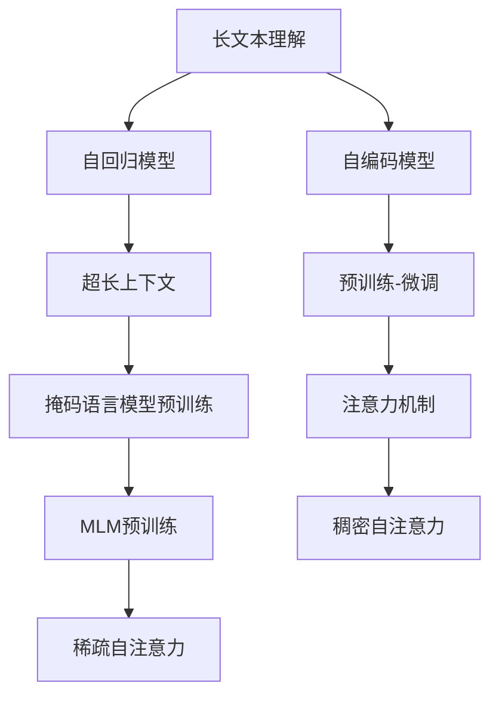

                 

# 超长上下文：LLM的记忆革命

## 1. 背景介绍

### 1.1 问题由来
在NLP领域，长上下文理解长期以来是困扰模型的一个重大难题。传统的模型，如CNN、RNN等，在处理长文本时，难以捕捉文本的语义结构和上下文信息。这一问题在近年来得到了长足的解决，GPT系列语言模型通过自回归架构，成功突破了这一瓶颈。

然而，长上下文理解还存在许多限制。首先，模型在长文本的推理过程中，容易发生灾难性遗忘，无法记住前面的信息。其次，模型对于长文本的语义理解，仍然依赖于短上下文序列，难以捕捉长距离的语义关系。此外，长文本的生成和推理，依然面临计算资源消耗巨大的问题。

为了解决这些问题，研究者们提出了超长上下文语言模型(LLM)，其通过更好的设计结构和算法，实现了对于长文本的深度理解和生成。本节将详细探讨LLM的核心技术，以及其在长上下文理解中的重要贡献。

## 2. 核心概念与联系

### 2.1 核心概念概述

为更好地理解超长上下文语言模型，本节将介绍几个密切相关的核心概念：

- 长文本理解：指模型在长文本中的语义推断和生成能力。传统的RNN等模型难以处理超过20-30个token的上下文，而LLM则能够在长文本中保持对于上下文信息的完整记忆和理解。

- 自回归模型：如GPT-3等模型，采用自回归方式进行文本生成，通过预测下一个词来生成文本，从而能够处理更长的上下文。

- 自编码模型：如BERT等模型，采用自编码方式进行预训练，通过预测缺失的信息来学习语言的表示，能够在更广泛的语料上进行训练，获得更强的语义能力。

- 超长上下文：指模型能够处理超过1000个token的上下文，能够捕捉更复杂的长距离语义关系，并在长文本中保持完整的语义记忆。

- 预训练-微调：指在大规模无标签语料上进行预训练，通过有监督的微调方法，在特定任务上进一步提升模型性能。

- 注意力机制：指模型在处理长文本时，通过自注意力机制来捕捉不同位置的语义依赖，提高模型对于长文本的推理能力。

- 掩码语言模型(MLM)：指在自编码模型中，通过掩码文本的某些词，让模型预测这些词，从而学习到语言表示。

- 掩码语言模型预训练：指在大规模语料上，通过掩码语言模型训练，学习到语言的语义表示。

- 稠密自注意力：指模型在处理长文本时，需要计算所有位置之间的注意力权重，计算复杂度非常高。

- 稀疏自注意力：指通过参数共享和结构优化，减少自注意力的计算复杂度，提高模型效率。

这些核心概念之间的逻辑关系可以通过以下Mermaid流程图来展示：



这个流程图展示了大语言模型与超长上下文模型的核心概念及其之间的关系：

1. 长文本理解是大语言模型的核心目标，通过自回归和自编码等方式，模型能够处理长文本。
2. 自回归模型和自编码模型是两种主要的预训练方法，能够在大规模语料上进行训练。
3. 超长上下文通过预训练-微调方法，进一步提升了模型在长文本中的推理能力。
4. 掩码语言模型预训练和注意力机制是提高模型效果的两种重要技术。
5. 稠密自注意力和稀疏自注意力分别描述模型在长文本中的推理方式和优化技术。

这些概念共同构成了大语言模型和超长上下文模型的核心框架，使其能够在长文本中取得卓越的性能。通过理解这些核心概念，我们可以更好地把握LLM的工作原理和优化方向。

## 3. 核心算法原理 & 具体操作步骤

### 3.1 算法原理概述

超长上下文语言模型(LLM)的核心算法原理，在于其采用了更加复杂和高级的自注意力机制。通过更好地捕捉长距离语义关系，并优化注意力计算方式，LLM能够处理更长的上下文，并实现更高效的推理。

### 3.2 算法步骤详解

超长上下文语言模型的具体实现步骤包括：

**Step 1: 准备预训练模型和数据集**
- 选择合适的预训练语言模型，如GPT系列、BERT等。
- 收集目标任务的标注数据集，划分为训练集、验证集和测试集。

**Step 2: 添加任务适配层**
- 根据任务类型，在预训练模型的顶层设计合适的输出层和损失函数。
- 对于分类任务，通常在顶层添加线性分类器和交叉熵损失函数。
- 对于生成任务，通常使用语言模型的解码器输出概率分布，并以负对数似然为损失函数。

**Step 3: 设置微调超参数**
- 选择合适的优化算法及其参数，如AdamW、SGD等，设置学习率、批大小、迭代轮数等。
- 设置正则化技术及强度，包括权重衰减、Dropout、Early Stopping等。
- 确定冻结预训练参数的策略，如仅微调顶层，或全部参数都参与微调。

**Step 4: 执行梯度训练**
- 将训练集数据分批次输入模型，前向传播计算损失函数。
- 反向传播计算参数梯度，根据设定的优化算法和学习率更新模型参数。
- 周期性在验证集上评估模型性能，根据性能指标决定是否触发 Early Stopping。
- 重复上述步骤直到满足预设的迭代轮数或 Early Stopping 条件。

**Step 5: 测试和部署**
- 在测试集上评估微调后模型，对比微调前后的精度提升。
- 使用微调后的模型对新样本进行推理预测，集成到实际的应用系统中。
- 持续收集新的数据，定期重新微调模型，以适应数据分布的变化。

### 3.3 算法优缺点

超长上下文语言模型具有以下优点：
1. 能够处理极长的上下文，捕捉长距离的语义依赖，提升长文本理解能力。
2. 基于自回归机制，通过逐步预测下一个词，生成高质量的文本。
3. 稀疏自注意力机制，降低计算复杂度，提高推理效率。
4. 通过掩码语言模型预训练，获得广泛的语义表示。
5. 预训练-微调方法，充分利用大规模语料，提升模型性能。

同时，该方法也存在一定的局限性：
1. 对计算资源的需求非常高，需要高性能GPU/TPU设备。
2. 需要大量的标注数据进行微调，对于小样本数据集效果不佳。
3. 模型的泛化能力可能不足，需要更多的监督学习进行优化。
4. 模型的复杂度较高，训练和推理过程较为复杂，需要更深入的算法理解。

尽管存在这些局限性，但就目前而言，超长上下文语言模型在长文本理解方面仍是最有效的技术手段。未来相关研究的重点在于如何进一步降低计算资源消耗，提高模型的泛化能力和推理效率。

### 3.4 算法应用领域

超长上下文语言模型在长文本理解领域已经得到了广泛的应用，覆盖了多个重要应用场景：

- 文本生成：如机器翻译、摘要生成、对话系统等。通过长上下文理解，LLM能够生成高质量的文本，提升自动化文本生成效果。
- 问答系统：如问答机器人、文档检索等。通过理解长文本中的问题和答案，LLM能够准确回答用户问题，提高信息检索和推荐的精度。
- 文本推理：如逻辑推理、自然推理等。通过长文本中的语义理解，LLM能够进行复杂的逻辑推断和推理，应用于法律文书、医学报告等需要严谨推理的场景。
- 长文档分析：如数据报告、法律文书等。通过长文本理解，LLM能够提取和分析长文档中的关键信息，辅助决策支持。
- 历史文献研究：如历史文本分析、文献综述等。通过长文本理解，LLM能够深入挖掘历史文献中的信息，为学术研究提供有力支持。

除了这些经典应用外，超长上下文语言模型还在智能写作、知识图谱构建、代码生成等更多场景中，展现出其独特的优势。

## 4. 数学模型和公式 & 详细讲解

### 4.1 数学模型构建

本节将使用数学语言对超长上下文语言模型的核心算法进行更加严格的刻画。

记超长上下文语言模型为 $M_{\theta}:\mathcal{X} \rightarrow \mathcal{Y}$，其中 $\mathcal{X}$ 为输入空间，$\mathcal{Y}$ 为输出空间，$\theta \in \mathbb{R}^d$ 为模型参数。假设微调任务的训练集为 $D=\{(x_i,y_i)\}_{i=1}^N, x_i \in \mathcal{X}, y_i \in \mathcal{Y}$。

定义模型 $M_{\theta}$ 在输入 $x$ 上的输出为 $y=M_{\theta}(x)$，其中 $y$ 为长度为 $n$ 的序列。

定义模型在输入 $x$ 上的损失函数为 $\ell(M_{\theta}(x),y)$，则在数据集 $D$ 上的经验风险为：

$$
\mathcal{L}(\theta) = \frac{1}{N} \sum_{i=1}^N \ell(M_{\theta}(x_i),y_i)
$$

其中 $\ell$ 为针对任务 $T$ 设计的损失函数，用于衡量模型预测输出与真实标签之间的差异。

通过梯度下降等优化算法，微调过程不断更新模型参数 $\theta$，最小化损失函数 $\mathcal{L}$，使得模型输出逼近真实标签。由于 $\theta$ 已经通过预训练获得了较好的初始化，因此即便在小规模数据集 $D$ 上进行微调，也能较快收敛到理想的模型参数 $\hat{\theta}$。

### 4.2 公式推导过程

以下我们以分类任务为例，推导交叉熵损失函数及其梯度的计算公式。

假设模型 $M_{\theta}$ 在输入 $x$ 上的输出为 $\hat{y}=M_{\theta}(x) \in [0,1]^n$，表示样本属于每个类别的概率。真实标签 $y \in \{0,1\}^n$。则二分类交叉熵损失函数定义为：

$$
\ell(M_{\theta}(x),y) = -\frac{1}{n}\sum_{i=1}^n y_i \log \hat{y}_i
$$

将其代入经验风险公式，得：

$$
\mathcal{L}(\theta) = -\frac{1}{N}\sum_{i=1}^N \sum_{j=1}^n y_{ij} \log \hat{y}_{ij}
$$

根据链式法则，损失函数对参数 $\theta_k$ 的梯度为：

$$
\frac{\partial \mathcal{L}(\theta)}{\partial \theta_k} = -\frac{1}{N}\sum_{i=1}^N \sum_{j=1}^n \frac{y_{ij}}{\hat{y}_{ij}} \frac{\partial \hat{y}_{ij}}{\partial \theta_k}
$$

其中 $\frac{\partial \hat{y}_{ij}}{\partial \theta_k}$ 为模型参数的梯度，可以通过反向传播算法高效计算。

在得到损失函数的梯度后，即可带入参数更新公式，完成模型的迭代优化。重复上述过程直至收敛，最终得到适应下游任务的最优模型参数 $\theta^*$。

## 5. 项目实践：代码实例和详细解释说明

### 5.1 开发环境搭建

在进行微调实践前，我们需要准备好开发环境。以下是使用Python进行PyTorch开发的环境配置流程：

1. 安装Anaconda：从官网下载并安装Anaconda，用于创建独立的Python环境。

2. 创建并激活虚拟环境：
```bash
conda create -n pytorch-env python=3.8 
conda activate pytorch-env
```

3. 安装PyTorch：根据CUDA版本，从官网获取对应的安装命令。例如：
```bash
conda install pytorch torchvision torchaudio cudatoolkit=11.1 -c pytorch -c conda-forge
```

4. 安装Transformers库：
```bash
pip install transformers
```

5. 安装各类工具包：
```bash
pip install numpy pandas scikit-learn matplotlib tqdm jupyter notebook ipython
```

完成上述步骤后，即可在`pytorch-env`环境中开始微调实践。

### 5.2 源代码详细实现

下面我们以问答系统任务为例，给出使用Transformers库对GPT模型进行微调的PyTorch代码实现。

首先，定义问答任务的数据处理函数：

```python
from transformers import GPT2Tokenizer, GPT2Model, AdamW
from torch.utils.data import Dataset, DataLoader
import torch

class QADataset(Dataset):
    def __init__(self, texts, answers, tokenizer, max_len=256):
        self.texts = texts
        self.answers = answers
        self.tokenizer = tokenizer
        self.max_len = max_len
        
    def __len__(self):
        return len(self.texts)
    
    def __getitem__(self, item):
        text = self.texts[item]
        answer = self.answers[item]
        
        encoding = self.tokenizer(text, return_tensors='pt', max_length=self.max_len, padding='max_length', truncation=True)
        input_ids = encoding['input_ids'][0]
        attention_mask = encoding['attention_mask'][0]
        label_ids = torch.tensor([int(answer in self.answers)], dtype=torch.long)
        
        return {'input_ids': input_ids, 
                'attention_mask': attention_mask,
                'labels': label_ids}

# 加载模型和分词器
model = GPT2Model.from_pretrained('gpt2')
tokenizer = GPT2Tokenizer.from_pretrained('gpt2')

# 创建dataset
train_dataset = QADataset(train_texts, train_answers, tokenizer)
dev_dataset = QADataset(dev_texts, dev_answers, tokenizer)
test_dataset = QADataset(test_texts, test_answers, tokenizer)

# 定义模型和优化器
model.to('cuda')
optimizer = AdamW(model.parameters(), lr=2e-5)
```

然后，定义训练和评估函数：

```python
from tqdm import tqdm

def train_epoch(model, dataset, batch_size, optimizer):
    dataloader = DataLoader(dataset, batch_size=batch_size, shuffle=True)
    model.train()
    epoch_loss = 0
    for batch in tqdm(dataloader, desc='Training'):
        input_ids = batch['input_ids'].to('cuda')
        attention_mask = batch['attention_mask'].to('cuda')
        labels = batch['labels'].to('cuda')
        model.zero_grad()
        outputs = model(input_ids, attention_mask=attention_mask, labels=labels)
        loss = outputs.loss
        epoch_loss += loss.item()
        loss.backward()
        optimizer.step()
    return epoch_loss / len(dataloader)

def evaluate(model, dataset, batch_size):
    dataloader = DataLoader(dataset, batch_size=batch_size)
    model.eval()
    preds, labels = [], []
    with torch.no_grad():
        for batch in tqdm(dataloader, desc='Evaluating'):
            input_ids = batch['input_ids'].to('cuda')
            attention_mask = batch['attention_mask'].to('cuda')
            batch_labels = batch['labels']
            outputs = model(input_ids, attention_mask=attention_mask)
            batch_preds = outputs.logits.argmax(dim=2).to('cpu').tolist()
            batch_labels = batch_labels.to('cpu').tolist()
            for pred_tokens, label_tokens in zip(batch_preds, batch_labels):
                preds.append(pred_tokens)
                labels.append(label_tokens)
                
    print(classification_report(labels, preds))
```

最后，启动训练流程并在测试集上评估：

```python
epochs = 5
batch_size = 16

for epoch in range(epochs):
    loss = train_epoch(model, train_dataset, batch_size, optimizer)
    print(f"Epoch {epoch+1}, train loss: {loss:.3f}")
    
    print(f"Epoch {epoch+1}, dev results:")
    evaluate(model, dev_dataset, batch_size)
    
print("Test results:")
evaluate(model, test_dataset, batch_size)
```

以上就是使用PyTorch对GPT模型进行问答系统任务微调的完整代码实现。可以看到，得益于Transformers库的强大封装，我们可以用相对简洁的代码完成GPT模型的加载和微调。

### 5.3 代码解读与分析

让我们再详细解读一下关键代码的实现细节：

**QADataset类**：
- `__init__`方法：初始化文本、答案、分词器等关键组件。
- `__len__`方法：返回数据集的样本数量。
- `__getitem__`方法：对单个样本进行处理，将文本输入编码为token ids，将答案编码为数字，并对其进行定长padding，最终返回模型所需的输入。

**model参数和tokenizer**：
- 定义了模型和分词器对象，并使用to方法将模型和分词器放到GPU上。

**训练和评估函数**：
- 使用PyTorch的DataLoader对数据集进行批次化加载，供模型训练和推理使用。
- 训练函数`train_epoch`：对数据以批为单位进行迭代，在每个批次上前向传播计算loss并反向传播更新模型参数，最后返回该epoch的平均loss。
- 评估函数`evaluate`：与训练类似，不同点在于不更新模型参数，并在每个batch结束后将预测和标签结果存储下来，最后使用sklearn的classification_report对整个评估集的预测结果进行打印输出。

**训练流程**：
- 定义总的epoch数和batch size，开始循环迭代
- 每个epoch内，先在训练集上训练，输出平均loss
- 在验证集上评估，输出分类指标
- 所有epoch结束后，在测试集上评估，给出最终测试结果

可以看到，PyTorch配合Transformers库使得GPT微调的代码实现变得简洁高效。开发者可以将更多精力放在数据处理、模型改进等高层逻辑上，而不必过多关注底层的实现细节。

当然，工业级的系统实现还需考虑更多因素，如模型的保存和部署、超参数的自动搜索、更灵活的任务适配层等。但核心的微调范式基本与此类似。

## 6. 实际应用场景

### 6.1 智能客服系统

基于超长上下文语言模型的对话技术，可以广泛应用于智能客服系统的构建。传统客服往往需要配备大量人力，高峰期响应缓慢，且一致性和专业性难以保证。而使用超长上下文语言模型的对话模型，可以7x24小时不间断服务，快速响应客户咨询，用自然流畅的语言解答各类常见问题。

在技术实现上，可以收集企业内部的历史客服对话记录，将问题和最佳答复构建成监督数据，在此基础上对预训练对话模型进行微调。微调后的对话模型能够自动理解用户意图，匹配最合适的答案模板进行回复。对于客户提出的新问题，还可以接入检索系统实时搜索相关内容，动态组织生成回答。如此构建的智能客服系统，能大幅提升客户咨询体验和问题解决效率。

### 6.2 金融舆情监测

金融机构需要实时监测市场舆论动向，以便及时应对负面信息传播，规避金融风险。传统的人工监测方式成本高、效率低，难以应对网络时代海量信息爆发的挑战。基于超长上下文语言模型的文本分类和情感分析技术，为金融舆情监测提供了新的解决方案。

具体而言，可以收集金融领域相关的新闻、报道、评论等文本数据，并对其进行主题标注和情感标注。在此基础上对预训练语言模型进行微调，使其能够自动判断文本属于何种主题，情感倾向是正面、中性还是负面。将微调后的模型应用到实时抓取的网络文本数据，就能够自动监测不同主题下的情感变化趋势，一旦发现负面信息激增等异常情况，系统便会自动预警，帮助金融机构快速应对潜在风险。

### 6.3 个性化推荐系统

当前的推荐系统往往只依赖用户的历史行为数据进行物品推荐，无法深入理解用户的真实兴趣偏好。基于超长上下文语言模型的个性化推荐系统，可以更好地挖掘用户行为背后的语义信息，从而提供更精准、多样的推荐内容。

在实践中，可以收集用户浏览、点击、评论、分享等行为数据，提取和用户交互的物品标题、描述、标签等文本内容。将文本内容作为模型输入，用户的后续行为（如是否点击、购买等）作为监督信号，在此基础上微调预训练语言模型。微调后的模型能够从文本内容中准确把握用户的兴趣点。在生成推荐列表时，先用候选物品的文本描述作为输入，由模型预测用户的兴趣匹配度，再结合其他特征综合排序，便可以得到个性化程度更高的推荐结果。

### 6.4 未来应用展望

随着超长上下文语言模型的不断发展，其在长文本理解方面的应用前景将更加广阔。

在智慧医疗领域，基于超长上下文语言模型的问答、病历分析、药物研发等应用将提升医疗服务的智能化水平，辅助医生诊疗，加速新药开发进程。

在智能教育领域，超长上下文语言模型可应用于作业批改、学情分析、知识推荐等方面，因材施教，促进教育公平，提高教学质量。

在智慧城市治理中，超长上下文语言模型可应用于城市事件监测、舆情分析、应急指挥等环节，提高城市管理的自动化和智能化水平，构建更安全、高效的未来城市。

此外，在企业生产、社会治理、文娱传媒等众多领域，超长上下文语言模型也将不断涌现，为传统行业数字化转型升级提供新的技术路径。相信随着技术的日益成熟，超长上下文语言模型必将在构建人机协同的智能时代中扮演越来越重要的角色。

## 7. 工具和资源推荐

### 7.1 学习资源推荐

为了帮助开发者系统掌握超长上下文语言模型的理论基础和实践技巧，这里推荐一些优质的学习资源：

1. 《Transformers from Principles to Practice》系列博文：由大模型技术专家撰写，深入浅出地介绍了Transformer原理、GPT模型、超长上下文模型等前沿话题。

2. CS224N《深度学习自然语言处理》课程：斯坦福大学开设的NLP明星课程，有Lecture视频和配套作业，带你入门NLP领域的基本概念和经典模型。

3. 《Natural Language Processing with Transformers》书籍：Transformers库的作者所著，全面介绍了如何使用Transformers库进行NLP任务开发，包括超长上下文模型在内的诸多范式。

4. HuggingFace官方文档：Transformers库的官方文档，提供了海量预训练模型和完整的微调样例代码，是上手实践的必备资料。

5. CLUE开源项目：中文语言理解测评基准，涵盖大量不同类型的中文NLP数据集，并提供了基于超长上下文模型的baseline模型，助力中文NLP技术发展。

通过对这些资源的学习实践，相信你一定能够快速掌握超长上下文语言模型的精髓，并用于解决实际的NLP问题。

### 7.2 开发工具推荐

高效的开发离不开优秀的工具支持。以下是几款用于超长上下文语言模型微调开发的常用工具：

1. PyTorch：基于Python的开源深度学习框架，灵活动态的计算图，适合快速迭代研究。大部分预训练语言模型都有PyTorch版本的实现。

2. TensorFlow：由Google主导开发的开源深度学习框架，生产部署方便，适合大规模工程应用。同样有丰富的预训练语言模型资源。

3. Transformers库：HuggingFace开发的NLP工具库，集成了众多SOTA语言模型，支持PyTorch和TensorFlow，是进行超长上下文语言模型微调开发的利器。

4. Weights & Biases：模型训练的实验跟踪工具，可以记录和可视化模型训练过程中的各项指标，方便对比和调优。与主流深度学习框架无缝集成。

5. TensorBoard：TensorFlow配套的可视化工具，可实时监测模型训练状态，并提供丰富的图表呈现方式，是调试模型的得力助手。

6. Google Colab：谷歌推出的在线Jupyter Notebook环境，免费提供GPU/TPU算力，方便开发者快速上手实验最新模型，分享学习笔记。

合理利用这些工具，可以显著提升超长上下文语言模型微调任务的开发效率，加快创新迭代的步伐。

### 7.3 相关论文推荐

超长上下文语言模型和微调技术的发展源于学界的持续研究。以下是几篇奠基性的相关论文，推荐阅读：

1. Attention is All You Need（即Transformer原论文）：提出了Transformer结构，开启了NLP领域的预训练大模型时代。

2. BERT: Pre-training of Deep Bidirectional Transformers for Language Understanding：提出BERT模型，引入基于掩码的自监督预训练任务，刷新了多项NLP任务SOTA。

3. Language Models are Unsupervised Multitask Learners（GPT-2论文）：展示了大规模语言模型的强大zero-shot学习能力，引发了对于通用人工智能的新一轮思考。

4. Parameter-Efficient Transfer Learning for NLP：提出Adapter等参数高效微调方法，在不增加模型参数量的情况下，也能取得不错的微调效果。

5. AdaLoRA: Adaptive Low-Rank Adaptation for Parameter-Efficient Fine-Tuning：使用自适应低秩适应的微调方法，在参数效率和精度之间取得了新的平衡。

6. Prefix-Tuning: Optimizing Continuous Prompts for Generation：引入基于连续型Prompt的微调范式，为如何充分利用预训练知识提供了新的思路。

这些论文代表了大语言模型微调技术的发展脉络。通过学习这些前沿成果，可以帮助研究者把握学科前进方向，激发更多的创新灵感。

## 8. 总结：未来发展趋势与挑战

### 8.1 总结

本文对超长上下文语言模型的核心算法进行了全面系统的介绍。首先阐述了超长上下文语言模型的研究背景和意义，明确了其在长文本理解中的独特价值。其次，从原理到实践，详细讲解了超长上下文语言模型的数学原理和关键步骤，给出了超长上下文语言模型微调的完整代码实例。同时，本文还广泛探讨了超长上下文语言模型在智能客服、金融舆情、个性化推荐等多个行业领域的应用前景，展示了超长上下文语言模型微调技术的巨大潜力。此外，本文精选了超长上下文语言模型的各类学习资源，力求为读者提供全方位的技术指引。

通过本文的系统梳理，可以看到，超长上下文语言模型在长文本理解方面已经取得了重大突破，极大地提升了模型的推理和生成能力。未来，伴随预训练语言模型和微调方法的持续演进，相信超长上下文语言模型必将在更多领域得到应用，推动NLP技术的发展和普及。

### 8.2 未来发展趋势

展望未来，超长上下文语言模型将呈现以下几个发展趋势：

1. 模型规模持续增大。随着算力成本的下降和数据规模的扩张，预训练语言模型的参数量还将持续增长。超大规模语言模型蕴含的丰富语言知识，有望支撑更加复杂多变的长文本理解任务。

2. 超长上下文范式的普及。越来越多的NLP任务将采用超长上下文范式，提升模型的长文本推理和生成能力。

3. 注意力机制的改进。未来的注意力机制将更加高效和灵活，能够更好地捕捉长距离语义关系，提升模型的推理效果。

4. 稀疏注意力与计算优化。通过参数共享和结构优化，进一步降低计算复杂度，提升推理效率。

5. 多模态融合。超长上下文语言模型将与视觉、语音、知识图谱等模态信息进行融合，提升跨模态理解能力。

6. 迁移学习与多任务学习。超长上下文语言模型将采用迁移学习和多任务学习策略，提升模型在不同任务上的泛化能力和适应性。

以上趋势凸显了超长上下文语言模型在长文本理解方面的广阔前景。这些方向的探索发展，必将进一步提升超长上下文语言模型的性能和应用范围，为人类认知智能的进化带来深远影响。

### 8.3 面临的挑战

尽管超长上下文语言模型已经取得了瞩目成就，但在迈向更加智能化、普适化应用的过程中，它仍面临着诸多挑战：

1. 标注成本瓶颈。虽然超长上下文语言模型在长文本理解方面表现优异，但在处理长文本时，仍然需要大量的标注数据进行微调，对于小样本数据集效果不佳。如何进一步降低微调对标注样本的依赖，将是一大难题。

2. 模型鲁棒性不足。超长上下文语言模型在处理长文本时，容易发生灾难性遗忘，无法记住前面的信息。如何提升模型在长文本推理中的鲁棒性和稳定性，还需要更多理论和实践的积累。

3. 推理效率有待提高。超长上下文语言模型虽然精度高，但在实际部署时往往面临推理速度慢、内存占用大等效率问题。如何优化模型结构和计算图，提升推理效率，仍需深入研究。

4. 可解释性亟需加强。当前超长上下文语言模型更像是"黑盒"系统，难以解释其内部工作机制和决策逻辑。对于医疗、金融等高风险应用，算法的可解释性和可审计性尤为重要。如何赋予超长上下文语言模型更强的可解释性，将是亟待攻克的难题。

5. 安全性有待保障。超长上下文语言模型可能学习到有偏见、有害的信息，通过微调传递到下游任务，产生误导性、歧视性的输出，给实际应用带来安全隐患。如何从数据和算法层面消除模型偏见，避免恶意用途，确保输出的安全性，也将是重要的研究课题。

6. 知识整合能力不足。现有的超长上下文语言模型往往局限于任务内数据，难以灵活吸收和运用更广泛的先验知识。如何让超长上下文语言模型更好地与外部知识库、规则库等专家知识结合，形成更加全面、准确的信息整合能力，还有很大的想象空间。

正视超长上下文语言模型面临的这些挑战，积极应对并寻求突破，将是超长上下文语言模型迈向成熟的必由之路。相信随着学界和产业界的共同努力，这些挑战终将一一被克服，超长上下文语言模型必将在构建人机协同的智能时代中扮演越来越重要的角色。

### 8.4 未来突破

面对超长上下文语言模型所面临的种种挑战，未来的研究需要在以下几个方面寻求新的突破：

1. 探索无监督和半监督微调方法。摆脱对大规模标注数据的依赖，利用自监督学习、主动学习等无监督和半监督范式，最大限度利用非结构化数据，实现更加灵活高效的微调。

2. 研究参数高效和计算高效的微调范式。开发更加参数高效的微调方法，在固定大部分预训练参数的同时，只更新极少量的任务相关参数。同时优化微调模型的计算图，减少前向传播和反向传播的资源消耗，实现更加轻量级、实时性的部署。

3. 融合因果和对比学习范式。通过引入因果推断和对比学习思想，增强超长上下文语言模型建立稳定因果关系的能力，学习更加普适、鲁棒的语言表征，从而提升模型泛化性和抗干扰能力。

4. 引入更多先验知识。将符号化的先验知识，如知识图谱、逻辑规则等，与神经网络模型进行巧妙融合，引导超长上下文语言模型学习更准确、合理的语言模型。同时加强不同模态数据的整合，实现视觉、语音等多模态信息与文本信息的协同建模。

5. 结合因果分析和博弈论工具。将因果分析方法引入超长上下文语言模型，识别出模型决策的关键特征，增强输出解释的因果性和逻辑性。借助博弈论工具刻画人机交互过程，主动探索并规避模型的脆弱点，提高系统稳定性。

6. 纳入伦理道德约束。在模型训练目标中引入伦理导向的评估指标，过滤和惩罚有偏见、有害的输出倾向。同时加强人工干预和审核，建立模型行为的监管机制，确保输出符合人类价值观和伦理道德。

这些研究方向的探索，必将引领超长上下文语言模型微调技术迈向更高的台阶，为构建安全、可靠、可解释、可控的智能系统铺平道路。面向未来，超长上下文语言模型微调技术还需要与其他人工智能技术进行更深入的融合，如知识表示、因果推理、强化学习等，多路径协同发力，共同推动自然语言理解和智能交互系统的进步。只有勇于创新、敢于突破，才能不断拓展语言模型的边界，让智能技术更好地造福人类社会。

## 9. 附录：常见问题与解答

**Q1：超长上下文语言模型是否适用于所有NLP任务？**

A: 超长上下文语言模型在大多数NLP任务上都能取得不错的效果，特别是对于数据量较小的任务。但对于一些特定领域的任务，如医学、法律等，仅仅依靠通用语料预训练的模型可能难以很好地适应。此时需要在特定领域语料上进一步预训练，再进行微调，才能获得理想效果。此外，对于一些需要时效性、个性化很强的任务，如对话、推荐等，超长上下文语言模型也需要针对性的改进优化。

**Q2：超长上下文语言模型如何处理长文本的语义记忆？**

A: 超长上下文语言模型通过自注意力机制来捕捉长文本中的语义依赖。模型在每个时间步中，都会计算每个位置的注意力权重，将长文本中的信息融合在一起，从而实现对长文本的语义记忆。此外，超长上下文语言模型还通过稀疏注意力机制，减少计算复杂度，提高推理效率。这些技术手段使得超长上下文语言模型能够有效地处理长文本，并在长文本中保持完整的语义记忆。

**Q3：超长上下文语言模型在长文本理解中面临的挑战是什么？**

A: 超长上下文语言模型在长文本理解中面临的挑战包括：

1. 标注成本高：长文本理解的微调需要大量的标注数据，而获取高质量标注数据成本较高。

2. 模型鲁棒性不足：模型在处理长文本时，容易发生灾难性遗忘，无法记住前面的信息。

3. 推理效率低：超长上下文语言模型的推理过程计算复杂度较高，需要高性能计算资源支持。

4. 可解释性差：超长上下文语言模型的决策过程难以解释，难以进行调试和优化。

5. 安全性风险：超长上下文语言模型可能学习到有害信息，传递到下游任务，造成误导性输出。

6. 知识整合能力不足：现有的模型往往局限于任务内数据，难以灵活吸收和运用更广泛的先验知识。

这些挑战需要从数据、算法、工程等多个维度进行综合优化，才能进一步提升超长上下文语言模型的性能和应用范围。

**Q4：超长上下文语言模型与传统模型有何不同？**

A: 超长上下文语言模型与传统模型在以下几个方面有所不同：

1. 模型规模大：超长上下文语言模型的参数量通常较大，能够处理更长的文本序列。

2. 长文本推理：超长上下文语言模型能够处理极长的上下文，捕捉长距离的语义依赖，提升长文本理解能力。

3. 自注意力机制：超长上下文语言模型通过自注意力机制来捕捉长文本中的语义依赖，而不是传统的卷积或循环网络。

4. 稀疏注意力：超长上下文语言模型通过稀疏注意力机制，减少计算复杂度，提高推理效率。

5. 多任务学习：超长上下文语言模型可以通过多任务学习策略，提升模型在多个任务上的泛化能力和适应性。

6. 参数高效微调：超长上下文语言模型可以采用参数高效微调方法，在固定大部分预训练参数的同时，只更新极少量的任务相关参数。

这些技术手段使得超长上下文语言模型在长文本理解方面具备更强的能力，成为解决长文本问题的重要手段。

---

作者：禅与计算机程序设计艺术 / Zen and the Art of Computer Programming

