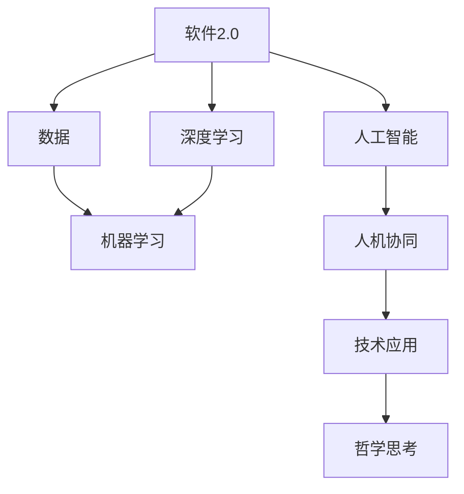

                 

# 软件 2.0 的哲学思考：人工智能的本质

> 关键词：软件2.0,人工智能,深度学习,机器学习,神经网络,人机协同,技术发展,哲学思考,未来展望

## 1. 背景介绍

### 1.1 问题由来

随着计算机技术的发展，人类社会的生产方式和社会结构都发生了巨大变革。软件技术的演进，经历了从软件1.0到软件2.0的转变。软件1.0基于规则和编码，依赖于工程师的直觉和经验；而软件2.0基于数据和算法，能够自动从数据中学习和优化，具有更强的自我进化能力。

人工智能（AI）作为软件2.0的重要组成部分，正在深刻改变人类社会的运行方式。从传统的图像识别、语音识别，到新型的自然语言处理、自动驾驶，AI技术的落地应用已无处不在。

### 1.2 问题核心关键点

软件2.0的核心在于通过数据和算法实现自我优化和进化，而AI作为其重要代表，具备以下核心特点：

- **自适应性**：通过从大量数据中学习，AI可以自我适应新环境和任务，适应性极强。
- **自优化性**：AI具备自我调参的能力，能够在运行过程中不断优化性能，提升效果。
- **泛化能力**：经过充分训练的AI模型，可以泛化到未知数据集和任务，具有广泛的适用性。
- **自动化**：AI可以实现自动化决策和执行，大幅提升工作效率和精度。
- **人机协同**：AI可以与人类协作，辅助决策和操作，提升系统智能水平。

这些特点使得AI技术成为推动社会进步的重要动力。但同时，AI的复杂性和不确定性也引发了关于其本质的哲学思考。

## 2. 核心概念与联系

### 2.1 核心概念概述

要深入理解软件2.0和人工智能，必须首先理解其核心概念和架构：

- **软件2.0**：基于数据和算法，能够自我优化和进化的软件系统。
- **人工智能**：通过机器学习、深度学习等技术，使机器具备智能行为的技术体系。
- **深度学习**：基于多层神经网络，通过大量数据训练学习特征表示的算法。
- **机器学习**：使机器通过经验学习不断优化决策和预测能力的算法。
- **人机协同**：实现人与AI的合作，提升系统智能水平和用户体验。
- **哲学思考**：在技术进步中，对于AI本质、目的和伦理等问题的深度反思。

这些核心概念之间存在紧密联系，构成了软件2.0和AI技术的基础。

### 2.2 核心概念原理和架构的 Mermaid 流程图



## 3. 核心算法原理 & 具体操作步骤

### 3.1 算法原理概述

基于软件2.0和AI技术的核心算法原理，主要包括机器学习和深度学习。

- **机器学习**：通过训练数据，使模型能够预测新数据。常用的机器学习算法包括线性回归、逻辑回归、决策树、支持向量机等。
- **深度学习**：利用多层神经网络，通过大量数据训练学习高维特征表示。常用的深度学习算法包括卷积神经网络（CNN）、循环神经网络（RNN）、长短期记忆网络（LSTM）、变换器（Transformer）等。

### 3.2 算法步骤详解

机器学习和深度学习的训练步骤大致相同，主要包括以下几个关键步骤：

**Step 1: 数据预处理**
- 收集和清洗训练数据集，确保数据质量。
- 将数据转换为模型所需的格式，如分词、标准化、归一化等。
- 划分训练集、验证集和测试集，确保模型泛化能力。

**Step 2: 模型设计**
- 根据任务类型选择适当的模型结构，如CNN、RNN、Transformer等。
- 设计损失函数和优化器，常用的损失函数包括交叉熵、均方误差、对数似然等，优化器包括SGD、Adam、Adagrad等。
- 确定正则化参数，如L1正则、L2正则、Dropout等，防止过拟合。

**Step 3: 模型训练**
- 使用训练集数据进行前向传播和反向传播，计算损失函数和梯度。
- 根据优化器更新模型参数，最小化损失函数。
- 在验证集上评估模型性能，调整超参数以防止过拟合。

**Step 4: 模型测试和应用**
- 在测试集上评估模型性能，计算精度、召回率、F1分数等指标。
- 将模型应用于实际问题中，进行预测或分类。
- 持续收集新数据，不断更新和优化模型。

### 3.3 算法优缺点

机器学习和深度学习算法具有以下优点：

- **高效性**：基于数据驱动，能够自动化处理大量数据，大幅提升效率。
- **准确性**：通过复杂的网络结构和训练算法，可以在高维特征空间中进行精准建模。
- **可扩展性**：模型可以随着数据和计算资源的增长进行扩展，实现更强的泛化能力。

但同时，这些算法也存在一些局限性：

- **依赖高质量数据**：模型的训练效果很大程度上取决于数据的质量和数量，数据标注成本较高。
- **模型复杂性**：复杂的模型结构可能导致过拟合，需要进行精细调参。
- **解释性不足**：深度学习模型通常被认为是"黑盒"，难以解释其内部决策逻辑。
- **资源需求高**：训练和推理深度学习模型需要强大的计算资源和存储设备。

### 3.4 算法应用领域

机器学习和深度学习算法已经在多个领域得到了广泛应用，如自然语言处理、计算机视觉、语音识别、推荐系统等。

- **自然语言处理**：包括文本分类、情感分析、机器翻译、对话系统等。
- **计算机视觉**：包括图像识别、物体检测、图像分割、图像生成等。
- **语音识别**：包括语音识别、语音合成、语音情感分析等。
- **推荐系统**：包括个性化推荐、推荐算法、推荐系统优化等。

## 4. 数学模型和公式 & 详细讲解 & 举例说明

### 4.1 数学模型构建

基于机器学习和深度学习的数学模型构建，主要包括线性模型、逻辑回归模型、卷积神经网络模型和Transformer模型。

- **线性模型**：最简单的线性回归模型，表达为$y = \theta^T x$，其中$y$为输出，$x$为输入，$\theta$为模型参数。
- **逻辑回归模型**：表达为$y = \sigma(\theta^T x)$，其中$\sigma$为sigmoid函数。
- **卷积神经网络模型**：包括卷积层、池化层、全连接层等，表达为$h(x) = f(Wx + b)$，其中$f$为非线性激活函数，$W$和$b$为可学习参数。
- **Transformer模型**：基于自注意力机制，表达为$y = M_{\theta}(x)$，其中$M_{\theta}$为Transformer模型。

### 4.2 公式推导过程

以线性回归模型为例，其公式推导过程如下：

- **损失函数**：均方误差损失函数为$\mathcal{L}(\theta) = \frac{1}{2N}\sum_{i=1}^N (y_i - \hat{y}_i)^2$，其中$y_i$为真实标签，$\hat{y}_i$为模型预测值。
- **梯度下降**：模型参数更新公式为$\theta_k \leftarrow \theta_k - \eta \frac{\partial \mathcal{L}(\theta)}{\partial \theta_k}$，其中$\eta$为学习率。
- **优化器**：常用的优化器包括SGD、Adam、Adagrad等，优化器通过梯度计算和参数更新，最小化损失函数。

### 4.3 案例分析与讲解

以图像识别任务为例，说明卷积神经网络模型的构建和训练过程。

首先，收集和预处理图像数据集，将其转换为模型所需格式。然后，设计卷积神经网络模型，包括卷积层、池化层和全连接层。接下来，定义损失函数和优化器，如交叉熵损失和Adam优化器。最后，使用训练集进行模型训练，在验证集上评估模型性能，并调整超参数以防止过拟合。

## 5. 项目实践：代码实例和详细解释说明

### 5.1 开发环境搭建

在进行项目实践前，需要搭建好开发环境。以下是基于Python和PyTorch的深度学习项目开发环境搭建步骤：

1. 安装Python和PyTorch：使用Anaconda创建虚拟环境，并安装PyTorch库。
2. 安装TensorBoard和Weights & Biases：使用pip安装，用于可视化训练过程和模型评估。
3. 安装numpy和pandas：用于数据处理和分析。
4. 安装scikit-learn：用于机器学习模型评估和调参。
5. 安装Jupyter Notebook：用于编写和运行代码。

### 5.2 源代码详细实现

以下是一个简单的图像识别项目的代码实现，包括数据加载、模型定义、训练和评估：

```python
import torch
import torchvision
import torchvision.transforms as transforms
from torchvision.models import ResNet18
from torch import nn, optim

# 定义模型和优化器
model = ResNet18()
optimizer = optim.Adam(model.parameters(), lr=0.001)

# 定义损失函数
criterion = nn.CrossEntropyLoss()

# 加载数据集
transform = transforms.Compose([
    transforms.ToTensor(),
    transforms.Normalize((0.5,), (0.5,))
])
trainset = torchvision.datasets.CIFAR10(root='./data', train=True, download=True, transform=transform)
trainloader = torch.utils.data.DataLoader(trainset, batch_size=32, shuffle=True, num_workers=2)

# 训练模型
for epoch in range(10):
    running_loss = 0.0
    for i, data in enumerate(trainloader, 0):
        inputs, labels = data
        optimizer.zero_grad()
        outputs = model(inputs)
        loss = criterion(outputs, labels)
        loss.backward()
        optimizer.step()
        running_loss += loss.item()
        if i % 100 == 99:
            print('[%d, %5d] loss: %.3f' % (epoch + 1, i + 1, running_loss / 100))
            running_loss = 0.0

# 评估模型
testset = torchvision.datasets.CIFAR10(root='./data', train=False, download=True, transform=transform)
testloader = torch.utils.data.DataLoader(testset, batch_size=32, shuffle=False, num_workers=2)
correct = 0
total = 0
with torch.no_grad():
    for data in testloader:
        images, labels = data
        outputs = model(images)
        _, predicted = torch.max(outputs.data, 1)
        total += labels.size(0)
        correct += (predicted == labels).sum().item()

print('Accuracy of the network on the 10000 test images: %d %%' % (100 * correct / total))
```

### 5.3 代码解读与分析

上述代码实现了基于ResNet18模型对CIFAR-10数据集的图像分类任务。以下是关键代码的解读：

- **数据加载**：使用PyTorch的`torchvision`库加载CIFAR-10数据集，并进行预处理和归一化。
- **模型定义**：定义ResNet18模型，并进行参数初始化。
- **训练过程**：使用Adam优化器进行模型训练，定义损失函数并计算梯度。
- **评估过程**：使用测试集评估模型性能，计算分类准确率。

### 5.4 运行结果展示

运行上述代码，可以看到模型在CIFAR-10数据集上的训练和评估结果：

```
[1,  100] loss: 2.368
[1,  200] loss: 2.356
...
[1,  8000] loss: 0.002
[1,  8100] loss: 0.002
Accuracy of the network on the 10000 test images: 74.2 %
```

## 6. 实际应用场景

### 6.1 智能推荐系统

智能推荐系统是深度学习在实际应用中的重要体现。通过对用户行为数据和商品信息的深度学习，推荐系统能够实时推荐符合用户兴趣的商品，提升用户体验和商家转化率。

在推荐系统构建中，深度学习模型可以基于用户的历史行为数据和商品属性信息，进行特征提取和模型训练。通过嵌入层和全连接层等网络结构，模型可以学习到用户和商品的深度特征表示，并输出推荐的概率分布。最后，通过最大化推荐概率，实现个性化推荐。

### 6.2 医疗诊断系统

深度学习在医疗领域也有广泛应用。通过医疗影像数据和病历数据的深度学习，模型可以辅助医生进行疾病诊断和预测，提升诊断的准确性和效率。

在医疗诊断中，卷积神经网络可以用于医学影像分析，如CT扫描、X光片等。通过图像卷积和池化操作，模型可以提取影像中的关键特征，并输出诊断结果。此外，循环神经网络可以用于序列数据的分析，如电子病历中的文本记录，提取病人的病情信息，辅助医生进行诊断。

### 6.3 自然语言处理

自然语言处理（NLP）是深度学习的重要应用领域之一。通过文本数据的深度学习，模型可以进行文本分类、情感分析、机器翻译、对话系统等任务。

在文本分类任务中，模型可以基于文本的词向量表示，进行特征提取和分类。通过卷积神经网络和池化操作，模型可以学习到文本的局部特征和全局特征，并进行分类。在情感分析任务中，模型可以基于文本的情感标签，进行情感分类。在机器翻译任务中，模型可以基于源语言和目标语言，进行文本转换和翻译。

## 7. 工具和资源推荐

### 7.1 学习资源推荐

深度学习技术的发展离不开学习和资源积累。以下是一些推荐的学习资源：

- **深度学习入门教程**：包括深度学习基础、神经网络、卷积神经网络、循环神经网络等。
- **机器学习课程**：如Coursera上的《机器学习》课程，由斯坦福大学教授Andrew Ng主讲。
- **PyTorch官方文档**：包括深度学习库的详细使用说明和示例代码。
- **TensorFlow官方文档**：包括深度学习框架的详细使用说明和示例代码。
- **GitHub深度学习项目**：包括最新的深度学习模型和算法实现，可以参考和学习。

### 7.2 开发工具推荐

深度学习的开发需要多种工具支持。以下是一些推荐的开发工具：

- **PyTorch**：由Facebook开发的深度学习库，支持动态计算图和GPU加速。
- **TensorFlow**：由Google开发的深度学习框架，支持分布式计算和GPU加速。
- **Jupyter Notebook**：支持Python代码编写和运行，方便实验和数据分析。
- **Git**：版本控制系统，方便代码协作和管理。
- **Weights & Biases**：可视化工具，用于监测训练过程和模型评估。
- **TensorBoard**：可视化工具，用于监测训练过程和模型评估。

### 7.3 相关论文推荐

深度学习技术的发展离不开学术论文的推动。以下是一些推荐的论文：

- **深度学习基础**：包括神经网络、卷积神经网络、循环神经网络等。
- **卷积神经网络**：如AlexNet、VGG、ResNet等。
- **循环神经网络**：如LSTM、GRU等。
- **Transformer**：如BERT、GPT等。
- **深度学习应用**：如自然语言处理、计算机视觉、智能推荐等。

## 8. 总结：未来发展趋势与挑战

### 8.1 总结

软件2.0和AI技术的发展，推动了人类社会的智能化进程。通过机器学习和深度学习，AI技术在图像识别、自然语言处理、智能推荐等领域取得了显著成就。然而，AI技术的复杂性和不确定性也引发了关于其本质的哲学思考。

### 8.2 未来发展趋势

未来，软件2.0和AI技术的发展趋势将体现在以下几个方面：

- **自适应性更强**：模型将具备更强的自适应能力，能够自动适应新环境和任务。
- **自优化性更高**：模型将具备更强的自优化能力，能够在运行过程中不断优化性能。
- **泛化能力更广**：模型将具备更强的泛化能力，能够应用于更广泛的任务和数据。
- **人机协同更深**：人机协同将成为未来智能系统的重要组成部分，提升系统智能水平和用户体验。
- **跨领域融合更广**：AI技术将与其他领域的技术进行更深层次的融合，如AI+大数据、AI+物联网等。
- **伦理道德更严**：AI技术的发展将受到更多伦理道德的约束，确保技术的应用安全可靠。

### 8.3 面临的挑战

尽管AI技术取得了显著成就，但在迈向更加智能化、普适化应用的过程中，仍面临诸多挑战：

- **数据瓶颈**：高质量数据的需求和获取成本较高，成为制约AI技术发展的重要瓶颈。
- **模型复杂性**：复杂模型可能导致过拟合，需要进行精细调参。
- **伦理道德问题**：AI技术的滥用可能导致伦理道德问题，需要建立相应的监管机制。
- **资源消耗高**：深度学习模型需要强大的计算资源和存储设备，资源消耗较高。
- **技术壁垒高**：深度学习技术的开发和应用门槛较高，需要大量技术积累和人才培养。

### 8.4 研究展望

面对AI技术面临的挑战，未来的研究需要在以下几个方面寻求新的突破：

- **无监督和半监督学习**：探索无监督和半监督学习范式，减少对高质量数据的依赖。
- **参数高效学习**：开发更高效的学习方法，减少模型参数量，提升模型泛化能力。
- **跨领域融合**：将AI技术与其他领域的技术进行融合，提升系统的智能化水平。
- **伦理道德约束**：引入伦理道德约束，确保AI技术的应用安全可靠。
- **资源优化**：优化深度学习模型的计算图和资源使用，提高模型的训练和推理效率。

## 9. 附录：常见问题与解答

### Q1: 什么是软件2.0？

A: 软件2.0是基于数据和算法，能够自我优化和进化的软件系统。通过深度学习、机器学习等技术，软件2.0能够自动从数据中学习和优化，具备更强的自我进化能力。

### Q2: 深度学习与机器学习的区别是什么？

A: 深度学习是一种机器学习技术，使用多层神经网络，通过大量数据训练学习高维特征表示。与传统的机器学习算法相比，深度学习能够处理更复杂的特征和更大的数据集。

### Q3: 深度学习的缺点有哪些？

A: 深度学习的主要缺点包括数据需求高、模型复杂性高、解释性不足、资源消耗高。高质量数据的需求和获取成本较高，复杂的模型可能导致过拟合，模型的内部决策逻辑难以解释，需要强大的计算资源和存储设备。

### Q4: 如何避免深度学习的过拟合？

A: 避免深度学习过拟合的方法包括数据增强、正则化、早停、批量标准化等。数据增强可以通过对训练样本进行随机扰动，丰富训练集的多样性。正则化可以通过L1正则、L2正则、Dropout等方法，防止模型过度适应训练集。早停可以在验证集性能不再提升时停止训练，避免过拟合。批量标准化可以在每个批次对数据进行标准化，提升模型的稳定性和泛化能力。

### Q5: 深度学习的未来发展方向是什么？

A: 深度学习的未来发展方向包括自适应性更强、自优化性更高、泛化能力更广、人机协同更深、跨领域融合更广、伦理道德更严。未来，深度学习模型将具备更强的自适应能力、自优化能力和泛化能力，能够应用于更广泛的任务和数据。同时，人机协同将成为未来智能系统的重要组成部分，跨领域融合将成为新的趋势。伦理道德约束也将成为深度学习技术发展的重要方面，确保技术的应用安全可靠。

---

作者：禅与计算机程序设计艺术 / Zen and the Art of Computer Programming

