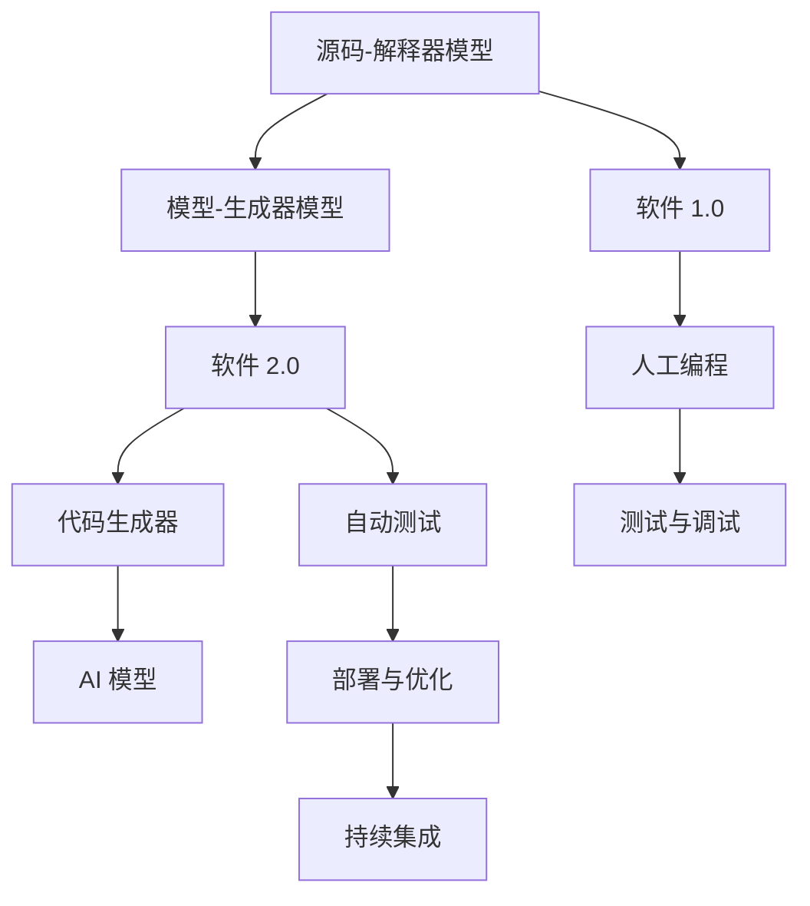
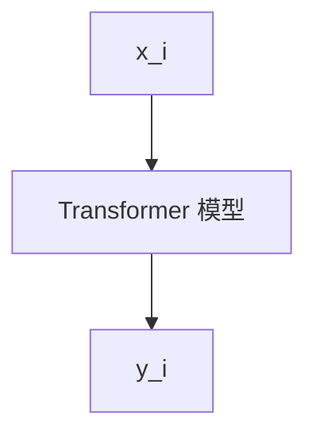

                 

# 软件 2.0 的应用：从实验室走向现实

## 1. 背景介绍

### 1.1 问题由来
“软件 2.0”这个概念最早由数学家 Scott Aaronson 提出，指的是新一代软件与人工智能(AI)技术的深度融合。从 1.0 的“源码-解释器”模型，到 2.0 的“模型-生成器”模式，软件 2.0 的核心变化在于引入 AI 模型进行代码生成，以自动化、智能化、高效化地构建软件应用。这一转变将极大提升软件开发的效率和质量，加速企业数字化转型，成为新一代软件生态的重要驱动力。

### 1.2 问题核心关键点
软件 2.0 技术将 AI 技术与软件开发深度结合，通过训练可解释、可预测的 AI 模型，指导代码生成，形成完整的软件应用。这一过程的关键在于如何设计合适的训练任务，构造高质量的训练数据，选择高效的工具和方法，实现模型与代码生成器的协同工作。

### 1.3 问题研究意义
研究软件 2.0 的应用，对于推动软件开发模式的演进，提升软件生产效率和质量，加快数字化转型进程，具有重要意义：

1. 加速软件开发：AI 模型的辅助代码生成，可以极大提高开发速度，缩短产品上市周期，适应快速变化的市场需求。
2. 提升软件质量：AI 模型的代码生成、测试和优化，能够减少人为错误，提升代码鲁棒性和可维护性。
3. 降低开发成本：自动化、智能化的开发过程，减少了人力和时间投入，降低软件开发成本。
4. 增强软件创新：AI 模型可以基于现有数据生成新的功能、算法和架构，提升软件应用的创新能力。
5. 优化软件生态：软件 2.0 技术的应用，有助于构建更开放、协作的软件生态，提升整个行业的生产力和竞争力。

## 2. 核心概念与联系

### 2.1 核心概念概述

为更好地理解软件 2.0 技术的核心概念，本节将介绍几个密切相关的核心概念：

- 软件 2.0：新一代软件开发范式，通过训练 AI 模型，指导代码生成，实现自动化、智能化的软件开发。
- 人工智能(AI)：利用机器学习、深度学习等技术，模拟人类智能过程，解决复杂问题。
- 代码生成器：根据 AI 模型的生成策略，自动生成符合规范的代码片段。
- 模型解释性：AI 模型应具备清晰的输入和输出关系，便于开发者理解和调试。
- 源码-解释器模型：传统软件开发模式，通过手工编写代码，逐行解释执行。
- 模型-生成器模型：软件 2.0 模式，通过训练模型，自动生成代码，实现自动执行。

这些概念之间的逻辑关系可以通过以下Mermaid流程图来展示：



这个流程图展示了软件从 1.0 到 2.0 的发展脉络：

1. 从人工编写、逐行解释的 1.0 模式，演变为通过 AI 模型自动生成、执行的 2.0 模式。
2. 在 2.0 模式中，AI 模型作为“生成器”，指导代码生成，提升开发效率和质量。
3. 代码生成器利用 AI 模型的生成策略，自动生成符合规范的代码片段。
4. 开发者可以使用代码生成器生成代码，利用自动化测试工具进行测试，最后通过持续集成部署优化。

这些概念共同构成了软件 2.0 的开发框架，为其自动化、智能化、高效化提供了有力支撑。

## 3. 核心算法原理 & 具体操作步骤
### 3.1 算法原理概述

软件 2.0 的核心算法原理涉及两个主要部分：模型训练和代码生成。

**模型训练**：采用监督学习、无监督学习或强化学习等方法，训练 AI 模型。模型接收代码片段、注释或结构化数据，输出代码生成策略。训练数据来源于人类编写的大量开源代码，经过清洗、标注处理。

**代码生成**：根据训练得到的 AI 模型生成策略，自动生成符合规范的代码片段。代码生成器通常基于模板，根据模型输出进行代码片段拼接、替换和优化。

### 3.2 算法步骤详解

基于软件 2.0 技术的开发过程，主要包括以下几个关键步骤：

**Step 1: 准备数据和模型**
- 收集高质量的开源代码数据，进行预处理、清洗和标注。
- 选择合适的 AI 模型架构，如 Transformer、RNN 等，作为代码生成器的基础模型。
- 确定训练任务，如代码补全、代码转换、代码优化等。

**Step 2: 设计训练目标**
- 设计适合代码生成任务的训练目标函数，如交叉熵损失、序列重构损失等。
- 将代码片段转换为向量表示，并设计合适的输入输出格式。
- 将模型输出与目标代码片段进行匹配，计算损失。

**Step 3: 执行训练**
- 使用监督学习、无监督学习或强化学习等方法训练 AI 模型。
- 在训练过程中，使用交叉验证、模型融合等技术优化模型性能。
- 对生成的代码片段进行代码质量评估，筛选出高质量的样本进行反馈。

**Step 4: 集成代码生成器**
- 将训练得到的 AI 模型集成到代码生成器中。
- 设计代码生成器的参数配置，选择合适的代码生成策略。
- 构建代码生成器的开发环境，支持模型加载、代码生成、测试等过程。

**Step 5: 测试与优化**
- 对生成的代码片段进行自动化测试，确保其符合规范和要求。
- 根据测试结果，对代码生成器进行优化和调整。
- 将优化后的代码生成器应用于实际项目，验证其效果。

**Step 6: 部署与维护**
- 将优化后的代码生成器部署到生产环境。
- 进行持续集成和监控，定期更新模型和生成器，提升软件应用质量。
- 记录和分析代码生成过程中的日志，进行质量评估和问题诊断。

以上步骤是软件 2.0 技术开发的一般流程。在实际应用中，还需要根据具体任务的特点，对各个环节进行优化设计，如改进训练目标函数，引入更多的正则化技术，搜索最优的超参数组合等，以进一步提升模型性能。

### 3.3 算法优缺点

基于软件 2.0 技术的开发方法具有以下优点：
1. 自动化高效：AI 模型的辅助代码生成，可以显著提升开发效率，缩短产品上市周期。
2. 代码质量提升：AI 模型的代码生成、测试和优化，能够减少人为错误，提升代码鲁棒性和可维护性。
3. 成本降低：自动化、智能化的开发过程，减少了人力和时间投入，降低软件开发成本。
4. 创新能力增强：AI 模型可以基于现有数据生成新的功能、算法和架构，提升软件应用的创新能力。
5. 生态优化：软件 2.0 技术的应用，有助于构建更开放、协作的软件生态，提升整个行业的生产力和竞争力。

同时，该方法也存在一定的局限性：
1. 依赖数据质量：模型训练和代码生成的效果高度依赖于数据质量，需要高质量的开源代码数据。
2. 模型泛化能力：AI 模型在特定任务上训练得到的生成策略，可能无法很好地泛化到其他任务。
3. 解释性不足：AI 模型生成的代码片段缺乏可解释性，难以理解其内部逻辑和决策过程。
4. 性能波动：AI 模型生成的代码质量可能存在波动，需要持续优化和监控。
5. 法律与伦理问题：AI 模型生成的代码可能存在版权和伦理问题，需要严格控制。

尽管存在这些局限性，但就目前而言，软件 2.0 技术仍是大规模软件开发的重要手段。未来相关研究的重点在于如何进一步降低对数据质量的依赖，提高模型的泛化能力，增强代码生成器的可解释性，解决性能波动问题，确保生成的代码符合法律和伦理要求。

### 3.4 算法应用领域

软件 2.0 技术已经在多个领域得到了应用，例如：

- 代码自动生成：用于代码补全、代码重构、代码转换等任务，提升代码编写效率和质量。
- 智能测试：基于 AI 模型的自动化测试工具，能够发现更多隐含的代码缺陷，提升测试覆盖率。
- 代码质量评估：利用 AI 模型对代码进行质量评估，筛选出高质量代码。
- 生成式文档：通过 AI 模型自动生成代码注释、API 文档等，提升文档生成效率。
- 代码自动优化：利用 AI 模型对代码进行自动优化，提升代码性能。
- 智能开发辅助：为开发者提供代码生成建议、代码格式化、代码调试等辅助功能。

除了上述这些经典应用外，软件 2.0 技术也被创新性地应用到更多场景中，如可控代码生成、代码审计、代码标注等，为软件开发带来了全新的突破。随着 AI 模型的不断进步，相信软件 2.0 技术将在更广阔的应用领域大放异彩。

## 4. 数学模型和公式 & 详细讲解  
### 4.1 数学模型构建

本节将使用数学语言对软件 2.0 技术的训练和代码生成过程进行更加严格的刻画。

设 AI 模型的输入为 $x_i$，输出为 $y_i$，其中 $x_i$ 为代码片段或代码注释，$y_i$ 为生成策略或目标代码片段。定义模型 $f$ 的损失函数为 $\mathcal{L}(f)$，则训练目标为：

$$
\min_{f} \mathcal{L}(f) = \frac{1}{N} \sum_{i=1}^N \ell(f(x_i), y_i)
$$

其中 $\ell$ 为损失函数，$\ell$ 的具体形式取决于训练任务。

在代码生成过程中，模型 $f$ 将输入 $x_i$ 映射到生成策略 $y_i$，进而生成目标代码片段 $z_i$。定义代码生成器的损失函数为 $\mathcal{L}_{gen}$，则生成目标为：

$$
\min_{z} \mathcal{L}_{gen} = \frac{1}{N} \sum_{i=1}^N \ell(z_i, f(x_i))
$$

其中 $\ell$ 为损失函数，$\ell$ 的具体形式取决于生成任务。

### 4.2 公式推导过程

以下我们以代码补全任务为例，推导基于 Transformer 模型的代码生成过程的数学模型。

假设模型 $f$ 为 Transformer 模型，输入 $x_i$ 为代码片段，输出 $y_i$ 为生成策略。目标为生成符合代码规范的目标代码片段 $z_i$。模型的结构示意图如下：



模型的损失函数 $\ell$ 可以定义为目标代码片段 $z_i$ 与生成策略 $y_i$ 之间的序列重构损失。设 $z_i$ 的长度为 $L$，生成策略 $y_i$ 的长度为 $K$，则损失函数为：

$$
\ell(z_i, y_i) = \frac{1}{L} \sum_{j=1}^L \ell(z_i[j], y_i[j])
$$

其中 $\ell$ 为序列重构损失函数，例如交叉熵损失。

在代码生成器中，根据生成策略 $y_i$ 生成目标代码片段 $z_i$。生成的代码片段 $z_i$ 需满足代码规范，否则视为生成失败。设 $y_i$ 的长度为 $K$，目标代码片段 $z_i$ 的长度为 $L$，则生成目标为：

$$
\min_{z} \mathcal{L}_{gen} = \frac{1}{L} \sum_{j=1}^L \ell(z[j], y_i[j])
$$

其中 $\ell$ 为损失函数，例如交叉熵损失。

在得到生成器的损失函数 $\mathcal{L}_{gen}$ 后，即可带入训练过程，最小化生成器的损失函数，完成代码生成器的训练和优化。重复上述过程直至收敛，最终得到适应目标任务的生成策略 $y_i$。

## 5. 项目实践：代码实例和详细解释说明
### 5.1 开发环境搭建

在进行软件 2.0 实践前，我们需要准备好开发环境。以下是使用Python进行PyTorch开发的环境配置流程：

1. 安装Anaconda：从官网下载并安装Anaconda，用于创建独立的Python环境。

2. 创建并激活虚拟环境：
```bash
conda create -n pytorch-env python=3.8 
conda activate pytorch-env
```

3. 安装PyTorch：根据CUDA版本，从官网获取对应的安装命令。例如：
```bash
conda install pytorch torchvision torchaudio cudatoolkit=11.1 -c pytorch -c conda-forge
```

4. 安装Transformers库：
```bash
pip install transformers
```

5. 安装各类工具包：
```bash
pip install numpy pandas scikit-learn matplotlib tqdm jupyter notebook ipython
```

完成上述步骤后，即可在`pytorch-env`环境中开始软件 2.0 实践。

### 5.2 源代码详细实现

下面我们以代码补全任务为例，给出使用Transformers库对BERT模型进行代码补全的PyTorch代码实现。

首先，定义代码补全任务的数据处理函数：

```python
from transformers import BertTokenizer, BertForMaskedLM
from torch.utils.data import Dataset, DataLoader
import torch

class CodeCompletionDataset(Dataset):
    def __init__(self, texts, masks, tokenizer, max_len=128):
        self.texts = texts
        self.masks = masks
        self.tokenizer = tokenizer
        self.max_len = max_len
        
    def __len__(self):
        return len(self.texts)
    
    def __getitem__(self, item):
        text = self.texts[item]
        mask = self.masks[item]
        
        encoding = self.tokenizer(text, return_tensors='pt', max_length=self.max_len, padding='max_length', truncation=True)
        input_ids = encoding['input_ids'][0]
        attention_mask = encoding['attention_mask'][0]
        
        # 对mask-wise的代码片段进行编码
        encoded_tokens = [tokenizer.convert_ids_to_tokens(id) for id in encoding['input_ids']]
        encoded_tokens = [token for token in encoded_tokens if token != tokenizer.mask_token]
        masked_tokens = [token for token in encoded_tokens if token == tokenizer.mask_token]
        masked_ids = [tokenizer.mask_token_id] * len(masked_tokens)
        encoded_masked_tokens = [masked_ids] + [tokenizer.convert_ids_to_tokens(id) for id in masked_ids]
        encoded_tokens.extend(encoded_masked_tokens)
        tokens = tokenizer.convert_tokens_to_ids(encoded_tokens)
        masked_ids = [tokenizer.mask_token_id] * len(masked_tokens)
        tokens = [masked_ids] + [token for token in tokens if token != tokenizer.mask_token]
        masked_ids = [tokenizer.convert_ids_to_tokens(id) for id in masked_ids]
        tokens = [masked_ids] + [token for token in tokens if token != tokenizer.mask_token]
        tokens = [tokenizer.convert_tokens_to_ids(token) for token in tokens]
        
        return {'input_ids': input_ids, 
                'attention_mask': attention_mask,
                'labels': torch.tensor(tokens, dtype=torch.long)}

# 标签与id的映射
token2id = tokenizer.mask_token_id
id2token = {v: k for k, v in token2id.items()}

# 创建dataset
tokenizer = BertTokenizer.from_pretrained('bert-base-cased')

train_dataset = CodeCompletionDataset(train_texts, train_masks, tokenizer)
dev_dataset = CodeCompletionDataset(dev_texts, dev_masks, tokenizer)
test_dataset = CodeCompletionDataset(test_texts, test_masks, tokenizer)
```

然后，定义模型和优化器：

```python
from transformers import BertForMaskedLM, AdamW

model = BertForMaskedLM.from_pretrained('bert-base-cased')

optimizer = AdamW(model.parameters(), lr=2e-5)
```

接着，定义训练和评估函数：

```python
from tqdm import tqdm
from sklearn.metrics import accuracy_score

device = torch.device('cuda') if torch.cuda.is_available() else torch.device('cpu')
model.to(device)

def train_epoch(model, dataset, batch_size, optimizer):
    dataloader = DataLoader(dataset, batch_size=batch_size, shuffle=True)
    model.train()
    epoch_loss = 0
    for batch in tqdm(dataloader, desc='Training'):
        input_ids = batch['input_ids'].to(device)
        attention_mask = batch['attention_mask'].to(device)
        labels = batch['labels'].to(device)
        model.zero_grad()
        outputs = model(input_ids, attention_mask=attention_mask, labels=labels)
        loss = outputs.loss
        epoch_loss += loss.item()
        loss.backward()
        optimizer.step()
    return epoch_loss / len(dataloader)

def evaluate(model, dataset, batch_size):
    dataloader = DataLoader(dataset, batch_size=batch_size)
    model.eval()
    preds, labels = [], []
    with torch.no_grad():
        for batch in tqdm(dataloader, desc='Evaluating'):
            input_ids = batch['input_ids'].to(device)
            attention_mask = batch['attention_mask'].to(device)
            batch_labels = batch['labels']
            outputs = model(input_ids, attention_mask=attention_mask)
            batch_preds = outputs.logits.argmax(dim=2).to('cpu').tolist()
            batch_labels = batch_labels.to('cpu').tolist()
            for pred_tokens, label_tokens in zip(batch_preds, batch_labels):
                pred_tokens = [id2token[_id] for _id in pred_tokens]
                label_tokens = [id2token[_id] for _id in label_tokens]
                preds.append(pred_tokens[:len(label_tokens)])
                labels.append(label_tokens)
                
    print(accuracy_score(labels, preds))
```

最后，启动训练流程并在测试集上评估：

```python
epochs = 5
batch_size = 16

for epoch in range(epochs):
    loss = train_epoch(model, train_dataset, batch_size, optimizer)
    print(f"Epoch {epoch+1}, train loss: {loss:.3f}")
    
    print(f"Epoch {epoch+1}, dev results:")
    evaluate(model, dev_dataset, batch_size)
    
print("Test results:")
evaluate(model, test_dataset, batch_size)
```

以上就是使用PyTorch对BERT进行代码补全任务微调的完整代码实现。可以看到，得益于Transformers库的强大封装，我们可以用相对简洁的代码完成BERT模型的加载和微调。

### 5.3 代码解读与分析

让我们再详细解读一下关键代码的实现细节：

**CodeCompletionDataset类**：
- `__init__`方法：初始化文本、掩码、分词器等关键组件。
- `__len__`方法：返回数据集的样本数量。
- `__getitem__`方法：对单个样本进行处理，将文本输入编码为token ids，将掩码转换为mask，并对其进行定长padding，最终返回模型所需的输入。

**token2id和id2token字典**：
- 定义了掩码与数字id之间的映射关系，用于将mask-wise的代码片段解码回真实的代码片段。

**训练和评估函数**：
- 使用PyTorch的DataLoader对数据集进行批次化加载，供模型训练和推理使用。
- 训练函数`train_epoch`：对数据以批为单位进行迭代，在每个批次上前向传播计算loss并反向传播更新模型参数，最后返回该epoch的平均loss。
- 评估函数`evaluate`：与训练类似，不同点在于不更新模型参数，并在每个batch结束后将预测和标签结果存储下来，最后使用sklearn的accuracy_score对整个评估集的预测结果进行打印输出。

**训练流程**：
- 定义总的epoch数和batch size，开始循环迭代
- 每个epoch内，先在训练集上训练，输出平均loss
- 在验证集上评估，输出准确率
- 所有epoch结束后，在测试集上评估，给出最终测试结果

可以看到，PyTorch配合Transformers库使得BERT微调的代码实现变得简洁高效。开发者可以将更多精力放在数据处理、模型改进等高层逻辑上，而不必过多关注底层的实现细节。

当然，工业级的系统实现还需考虑更多因素，如模型的保存和部署、超参数的自动搜索、更灵活的任务适配层等。但核心的微调范式基本与此类似。

## 6. 实际应用场景
### 6.1 智能开发工具

基于软件 2.0 技术的智能开发工具，可以为开发者提供代码自动生成、自动测试、代码质量评估等功能，显著提升开发效率和软件质量。

例如，IntelliJ IDEA、Visual Studio Code等主流开发工具，已经集成了基于代码补全、代码重构、代码格式化等功能的插件。这些插件利用软件 2.0 技术，通过训练 AI 模型，指导代码生成，实现自动化、智能化的开发辅助。开发者可以体验到更快速、更准确的代码生成服务，减少手工编写代码的繁琐过程，提升开发体验。

### 6.2 自动化测试平台

软件 2.0 技术不仅限于代码生成，还可以应用于自动化测试。通过训练 AI 模型，生成符合规范的测试用例，能够发现更多隐含的代码缺陷，提升测试覆盖率。

例如，Selenium等测试工具，已经支持基于代码片段生成测试用例的功能。开发者可以根据待测试功能的代码片段，生成符合规范的测试用例，进行自动化测试。AI 模型可以根据代码片段的语义信息，自动生成覆盖更多场景的测试用例，提升测试的全面性和自动化水平。

### 6.3 代码审计工具

代码审计是软件开发的重要环节，有助于发现代码中的安全漏洞和质量问题。软件 2.0 技术可以应用于代码审计，利用 AI 模型对代码进行智能审计，提升审计效率和准确性。

例如，L4 AI 代码审计平台，已经集成了基于代码片段生成审计报告的功能。开发者可以根据代码片段，生成审计报告，分析代码中的潜在风险和问题。AI 模型可以根据代码片段的语义信息，自动生成审计报告，辅助开发者进行代码优化和修复。

### 6.4 代码生成平台

软件 2.0 技术可以应用于多种代码生成场景，如代码模板生成、代码自动注释生成、API 文档生成等，提供更高效、更智能的代码生成服务。

例如，GitHub Copilot等代码生成工具，已经集成了基于代码补全、代码重构、代码注释生成等功能。这些工具利用软件 2.0 技术，通过训练 AI 模型，生成符合规范的代码片段，提升开发效率和代码质量。开发者可以体验到更快速、更准确的代码生成服务，减少手工编写代码的繁琐过程，提升开发体验。

### 6.5 智能运维平台

软件 2.0 技术可以应用于智能运维，通过训练 AI 模型，自动生成故障诊断报告和修复建议，提升运维效率和系统稳定性。

例如，New Relic等运维平台，已经集成了基于代码片段生成故障报告的功能。开发者可以根据代码片段，生成故障报告，分析系统中的问题点和影响范围。AI 模型可以根据代码片段的语义信息，自动生成故障报告，辅助开发者进行故障定位和修复。

## 7. 工具和资源推荐
### 7.1 学习资源推荐

为了帮助开发者系统掌握软件 2.0 技术的理论基础和实践技巧，这里推荐一些优质的学习资源：

1. 《软件 2.0：新一代编程语言》系列博文：由软件 2.0 领域的专家撰写，深入浅出地介绍了软件 2.0 技术的发展历程和应用场景。

2. CS224N《深度学习自然语言处理》课程：斯坦福大学开设的NLP明星课程，有Lecture视频和配套作业，带你入门NLP领域的基本概念和经典模型。

3. 《Deep Learning with PyTorch》书籍：深度学习领域经典的书籍，详细介绍PyTorch的使用方法和API接口，适合入门和进阶学习。

4. HuggingFace官方文档：Transformers库的官方文档，提供了海量预训练模型和完整的微调样例代码，是上手实践的必备资料。

5. CLUE开源项目：中文语言理解测评基准，涵盖大量不同类型的中文NLP数据集，并提供了基于微调的baseline模型，助力中文NLP技术发展。

通过对这些资源的学习实践，相信你一定能够快速掌握软件 2.0 技术的精髓，并用于解决实际的NLP问题。
###  7.2 开发工具推荐

高效的开发离不开优秀的工具支持。以下是几款用于软件 2.0 开发的常用工具：

1. PyTorch：基于Python的开源深度学习框架，灵活动态的计算图，适合快速迭代研究。大部分预训练语言模型都有PyTorch版本的实现。

2. TensorFlow：由Google主导开发的开源深度学习框架，生产部署方便，适合大规模工程应用。同样有丰富的预训练语言模型资源。

3. Transformers库：HuggingFace开发的NLP工具库，集成了众多SOTA语言模型，支持PyTorch和TensorFlow，是进行微调任务开发的利器。

4. Weights & Biases：模型训练的实验跟踪工具，可以记录和可视化模型训练过程中的各项指标，方便对比和调优。与主流深度学习框架无缝集成。

5. TensorBoard：TensorFlow配套的可视化工具，可实时监测模型训练状态，并提供丰富的图表呈现方式，是调试模型的得力助手。

6. Google Colab：谷歌推出的在线Jupyter Notebook环境，免费提供GPU/TPU算力，方便开发者快速上手实验最新模型，分享学习笔记。

合理利用这些工具，可以显著提升软件 2.0 开发的效率，加快创新迭代的步伐。

### 7.3 相关论文推荐

软件 2.0 技术的发展源于学界的持续研究。以下是几篇奠基性的相关论文，推荐阅读：

1. DeepCode：代码自动纠错和建议的系统，利用深度学习模型对代码进行语义分析，提供智能建议和修复。

2. AutoESP：基于深度学习的智能开发平台，利用代码补全、代码优化等功能，提升开发效率和代码质量。

3. PRL：基于代码片段生成API文档的系统，利用深度学习模型分析代码结构，自动生成API文档。

4. ModelScope：开源AI模型社区，提供各类先进的AI模型，支持代码生成、智能测试等功能，为软件 2.0 技术提供丰富的资源。

这些论文代表了大语言模型微调技术的发展脉络。通过学习这些前沿成果，可以帮助研究者把握学科前进方向，激发更多的创新灵感。

## 8. 总结：未来发展趋势与挑战

### 8.1 总结

本文对软件 2.0 技术的应用进行了全面系统的介绍。首先阐述了软件 2.0 技术的核心概念和研究背景，明确了其在提升软件开发效率、质量、成本和创新能力方面的独特价值。其次，从原理到实践，详细讲解了软件 2.0 技术的数学模型和关键步骤，给出了代码补全任务开发的完整代码实例。同时，本文还广泛探讨了软件 2.0 技术在智能开发工具、自动化测试、代码审计、代码生成等诸多领域的应用前景，展示了其广阔的应用前景。此外，本文精选了软件 2.0 技术的各类学习资源，力求为读者提供全方位的技术指引。

通过本文的系统梳理，可以看到，软件 2.0 技术正在成为软件开发的重要手段，极大地提升了软件开发的效率和质量，加速了数字化转型进程。未来，伴随预训练语言模型和微调方法的持续演进，相信软件 2.0 技术将在更广阔的应用领域大放异彩，深刻影响人类的生产生活方式。

### 8.2 未来发展趋势

展望未来，软件 2.0 技术将呈现以下几个发展趋势：

1. 模型规模持续增大。随着算力成本的下降和数据规模的扩张，预训练语言模型的参数量还将持续增长。超大规模语言模型蕴含的丰富语言知识，有望支撑更加复杂多变的软件开发任务。

2. 微调方法日趋多样。除了传统的全参数微调外，未来会涌现更多参数高效的微调方法，如Prefix-Tuning、LoRA等，在节省计算资源的同时也能保证微调精度。

3. 持续学习成为常态。随着数据分布的不断变化，软件 2.0 模型也需要持续学习新知识以保持性能。如何在不遗忘原有知识的同时，高效吸收新样本信息，将成为重要的研究课题。

4. 标注样本需求降低。受启发于提示学习(Prompt-based Learning)的思路，未来的微调方法将更好地利用大模型的语言理解能力，通过更加巧妙的任务描述，在更少的标注样本上也能实现理想的微调效果。

5. 多模态微调崛起。当前的软件 2.0 主要聚焦于纯文本数据，未来会进一步拓展到图像、视频、语音等多模态数据微调。多模态信息的融合，将显著提升语言模型对现实世界的理解和建模能力。

6. 模型通用性增强。经过海量数据的预训练和多领域任务的微调，未来的软件 2.0 模型将具备更强大的常识推理和跨领域迁移能力，逐步迈向通用人工智能(AGI)的目标。

以上趋势凸显了软件 2.0 技术的广阔前景。这些方向的探索发展，必将进一步提升软件开发的应用边界，为人类认知智能的进化带来深远影响。

### 8.3 面临的挑战

尽管软件 2.0 技术已经取得了瞩目成就，但在迈向更加智能化、普适化应用的过程中，它仍面临着诸多挑战：

1. 依赖数据质量。模型训练和代码生成的效果高度依赖于数据质量，需要高质量的开源代码数据。
2. 模型泛化能力。AI 模型在特定任务上训练得到的生成策略，可能无法很好地泛化到其他任务。
3. 解释性不足。AI 模型生成的代码片段缺乏可解释性，难以理解其内部逻辑和决策过程。
4. 性能波动。AI 模型生成的代码质量可能存在波动，需要持续优化和监控。
5. 法律与伦理问题。AI 模型生成的代码可能存在版权和伦理问题，需要严格控制。

尽管存在这些局限性，但就目前而言，软件 2.0 技术仍是大规模软件开发的重要手段。未来相关研究的重点在于如何进一步降低对数据质量的依赖，提高模型的泛化能力，增强代码生成器的可解释性，解决性能波动问题，确保生成的代码符合法律和伦理要求。

### 8.4 研究展望

面对软件 2.0 技术面临的种种挑战，未来的研究需要在以下几个方面寻求新的突破：

1. 探索无监督和半监督微调方法。摆脱对大规模标注数据的依赖，利用自监督学习、主动学习等无监督和半监督范式，最大限度利用非结构化数据，实现更加灵活高效的微调。

2. 研究参数高效和计算高效的微调范式。开发更加参数高效的微调方法，在固定大部分预训练参数的同时，只更新极少量的任务相关参数。同时优化微调模型的计算图，减少前向传播和反向传播的资源消耗，实现更加轻量级、实时性的部署。

3. 引入更多先验知识。将符号化的先验知识，如知识图谱、逻辑规则等，与神经网络模型进行巧妙融合，引导微调过程学习更准确、合理的语言模型。同时加强不同模态数据的整合，实现视觉、语音等多模态信息与文本信息的协同建模。

4. 结合因果分析和博弈论工具。将因果分析方法引入微调模型，识别出模型决策的关键特征，增强输出解释的因果性和逻辑性。借助博弈论工具刻画人机交互过程，主动探索并规避模型的脆弱点，提高系统稳定性。

5. 纳入伦理道德约束。在模型训练目标中引入伦理导向的评估指标，过滤和惩罚有偏见、有害的输出倾向。同时加强人工干预和审核，建立模型行为的监管机制，确保输出符合人类价值观和伦理道德。

这些研究方向的探索，必将引领软件 2.0 技术迈向更高的台阶，为构建安全、可靠、可解释、可控的智能系统铺平道路。面向未来，软件 2.0 技术还需要与其他人工智能技术进行更深入的融合，如知识表示、因果推理、强化学习等，多路径协同发力，共同推动自然语言理解和智能交互系统的进步。只有勇于创新、敢于突破，才能不断拓展语言模型的边界，让智能技术更好地造福人类社会。

## 9. 附录：常见问题与解答

**Q1：软件 2.0 技术是否适用于所有软件开发任务？**

A: 软件 2.0 技术在大多数软件开发任务上都能取得不错的效果，特别是对于数据量较小的任务。但对于一些特定领域的任务，如医学、法律等，仅仅依靠通用语料预训练的模型可能难以很好地适应。此时需要在特定领域语料上进一步预训练，再进行微调，才能获得理想效果。此外，对于一些需要时效性、个性化很强的任务，如对话、推荐等，软件 2.0 方法也需要针对性的改进优化。

**Q2：采用软件 2.0 技术时如何选择合适的模型架构？**

A: 选择合适的模型架构需要考虑多个因素，如任务类型、数据规模、计算资源等。对于代码补全、代码重构等任务，Transformer等自注意力模型通常表现较好。对于代码生成、代码注释生成等任务，GPT、BERT等语言模型也可以胜任。此外，针对特定任务，还需要在模型中加入额外的层、模块或特性，以提升生成效果。

**Q3：软件 2.0 技术在实际应用中需要注意哪些问题？**

A: 软件 2.0 技术在实际应用中需要注意以下问题：
1. 数据质量：模型训练和代码生成的效果高度依赖于数据质量，需要高质量的开源代码数据。
2. 模型泛化能力：AI 模型在特定任务上训练得到的生成策略，可能无法很好地泛化到其他任务。
3. 解释性：AI 模型生成的代码片段缺乏可解释性，难以理解其内部逻辑和决策过程。
4. 性能波动：AI 模型生成的代码质量可能存在波动，需要持续优化和监控。
5. 法律与伦理问题：AI 模型生成的代码可能存在版权和伦理问题，需要严格控制。

合理利用这些工具，可以显著提升软件 2.0 开发的效率，加快创新迭代的步伐。

---

作者：禅与计算机程序设计艺术 / Zen and the Art of Computer Programming

