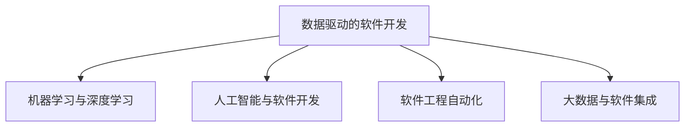

                 

# 软件 2.0 的时代：数据驱动一切

> 关键词：数据驱动, 机器学习, 深度学习, 人工智能, 算法优化, 软件工程, 自动化, 大数据, 软件即服务, 人工智能与软件开发

## 1. 背景介绍

### 1.1 问题由来

随着互联网的普及和信息技术的发展，软件行业经历了从软件 1.0 到软件 2.0 的转变。在软件 1.0 时代，程序员依靠手工编码实现功能需求。而在软件 2.0 时代，随着数据量的大幅增长和机器学习、深度学习等人工智能技术的不断成熟，软件工程师可以利用这些先进技术自动化地处理复杂问题，提升软件开发的效率和质量。

### 1.2 问题核心关键点

软件 2.0 时代，数据驱动成为软件开发的核心驱动力。数据驱动的软件开发方法论，要求软件工程师在设计和开发过程中以数据为导向，利用数据进行功能设计、算法优化、性能评估和用户行为分析，从而实现更加精准的软件解决方案。

数据驱动的软件开发方法论包括以下几个关键点：
1. 数据驱动的设计：在软件开发过程中，首先需要分析数据需求，明确数据的来源、类型、格式和质量要求，确保数据能够有效支撑软件的功能设计。
2. 数据驱动的算法：基于数据的特征和模式，选择合适的算法模型，进行算法训练和优化，提升模型的预测和推理能力。
3. 数据驱动的测试：利用数据分析结果对软件进行测试和评估，确保软件满足业务需求和用户期望。
4. 数据驱动的优化：通过持续的数据收集和分析，不断优化软件功能和性能，提升用户体验和系统效率。

数据驱动的软件开发方法论，使软件工程师能够更加高效、精确地设计和开发软件，提升软件的竞争力和市场价值。

## 2. 核心概念与联系

### 2.1 核心概念概述

为了更好地理解软件 2.0 时代的数据驱动方法论，本节将介绍几个密切相关的核心概念：

- **数据驱动的软件开发**：以数据为核心的软件开发方法论，利用数据分析和机器学习技术，实现软件的功能设计、算法优化和测试评估。
- **机器学习与深度学习**：通过模型训练，利用历史数据预测未来趋势和行为，实现智能决策和自动化处理。
- **人工智能与软件开发**：利用人工智能技术，如自然语言处理、图像识别、语音识别等，提升软件的人机交互能力和自动化水平。
- **软件工程自动化**：使用自动化工具和平台，实现软件开发和部署的自动化，提升开发效率和代码质量。
- **大数据与软件集成**：将大数据技术与软件开发相结合，提升数据的收集、存储、分析和应用能力，实现软件功能的扩展和升级。

这些核心概念之间的逻辑关系可以通过以下Mermaid流程图来展示：



这个流程图展示了大数据时代下，数据驱动的软件开发方法论的主要构成要素及其相互关系。

## 3. 核心算法原理 & 具体操作步骤

### 3.1 算法原理概述

数据驱动的软件开发方法论，核心在于通过机器学习、深度学习和人工智能等技术，利用数据进行算法优化和决策支持。具体而言，包括以下几个关键步骤：

1. **数据收集与清洗**：收集业务相关的数据，并进行数据清洗、去重和预处理，确保数据的质量和可用性。
2. **特征工程**：从原始数据中提取有用的特征，用于算法训练和模型预测。
3. **模型选择与训练**：选择合适的机器学习或深度学习模型，进行模型训练和优化。
4. **模型评估与验证**：使用验证集和测试集评估模型的性能，确保模型的泛化能力。
5. **集成与部署**：将优化后的模型集成到软件开发流程中，实现软件的功能和性能提升。

### 3.2 算法步骤详解

以下我们以一个简单的预测销售量为例，详细讲解数据驱动的软件开发方法论的实现步骤：

**Step 1: 数据收集与清洗**

- 从销售历史数据中收集相关特征，如时间、季节、节假日、促销活动、用户行为等。
- 对数据进行清洗，去除缺失值和异常值，处理重复数据。
- 使用Python的Pandas库进行数据预处理。

**Step 2: 特征工程**

- 使用Scikit-Learn库进行特征提取，如时间特征、季节特征、节假日特征等。
- 对特征进行归一化和标准化处理，确保不同特征具有相同的尺度和分布。
- 使用特征选择算法，选择对预测销售量影响最大的特征。

**Step 3: 模型选择与训练**

- 选择线性回归或随机森林模型，使用训练集进行模型训练。
- 使用交叉验证方法，评估模型性能，避免过拟合。
- 使用Grid Search或Random Search方法，寻找最优的模型超参数。

**Step 4: 模型评估与验证**

- 使用测试集对模型进行评估，计算均方误差等指标。
- 进行混淆矩阵、ROC曲线等可视化分析，理解模型的性能和局限性。
- 根据评估结果，调整模型和特征，提升模型预测能力。

**Step 5: 集成与部署**

- 将优化后的模型集成到销售预测系统中。
- 使用TensorFlow或PyTorch等深度学习框架进行模型部署。
- 使用Prometheus和Grafana等监控工具，实时监测系统性能和稳定性。

通过以上步骤，我们可以构建一个基于数据驱动的销售预测系统，实现对销售数据的自动化分析和预测，提升销售决策的科学性和精准性。

### 3.3 算法优缺点

数据驱动的软件开发方法论具有以下优点：

1. 提升预测准确性：利用历史数据进行模型训练，提高预测的准确性和可靠性。
2. 自动化决策支持：通过模型预测，自动化地提供决策支持，减少人工干预。
3. 提升数据利用率：通过特征工程，充分利用数据中的信息，提升数据利用率。
4. 优化业务流程：基于数据分析结果，优化业务流程和运营策略，提升效率和效果。

同时，该方法也存在一些缺点：

1. 数据依赖性强：模型的性能高度依赖于数据的完整性和质量，数据偏差可能影响模型的预测能力。
2. 模型复杂度高：复杂的模型需要大量的计算资源和数据量，可能导致训练和推理速度慢。
3. 模型解释性差：黑盒模型难以解释其决策过程，难以进行调试和优化。
4. 数据隐私风险：数据驱动的方法需要收集和处理大量敏感数据，可能面临隐私泄露的风险。

尽管存在这些缺点，但就目前而言，数据驱动的软件开发方法论仍是大数据时代软件开发的主要趋势。未来相关研究的重点在于如何进一步降低数据依赖，提高模型的解释性和可解释性，同时兼顾数据隐私保护。

### 3.4 算法应用领域

数据驱动的软件开发方法论，已经在许多领域得到了广泛应用，如金融、电商、医疗、交通等。以下是几个典型应用场景：

- **金融领域**：利用历史交易数据进行风险评估、投资策略优化、欺诈检测等。
- **电商领域**：基于用户行为数据进行个性化推荐、库存管理、销售预测等。
- **医疗领域**：使用医疗数据进行疾病预测、药物研发、患者分流等。
- **交通领域**：通过交通流量数据进行道路拥堵预测、路线规划、事故预警等。
- **智能家居**：利用传感器数据进行用户行为分析、设备自动化控制等。

随着数据量的不断增长和人工智能技术的不断进步，数据驱动的软件开发方法论将在更多领域得到应用，为各行各业带来深远的变革和创新。

## 4. 数学模型和公式 & 详细讲解  
### 4.1 数学模型构建

在数据驱动的软件开发方法论中，常用的数学模型包括线性回归、逻辑回归、随机森林、支持向量机等。以下以线性回归模型为例，介绍其数学模型构建和实现。

假设训练集为 $D=\{(x_i,y_i)\}_{i=1}^N$，其中 $x_i=(x_{i1},x_{i2},...,x_{in})$ 为特征向量，$y_i$ 为标签，$n$ 为特征维度。线性回归模型的数学模型可以表示为：

$$
y = \theta_0 + \theta_1x_1 + \theta_2x_2 + ... + \theta_nx_n
$$

其中，$\theta=(\theta_0,\theta_1,\theta_2,...,\theta_n)^T$ 为模型参数，需要通过训练集来求解。线性回归模型的损失函数为均方误差（Mean Squared Error, MSE）：

$$
\mathcal{L}(\theta) = \frac{1}{N}\sum_{i=1}^N (y_i - (\theta_0 + \theta_1x_{i1} + \theta_2x_{i2} + ... + \theta_nx_{in}))^2
$$

目标是最小化损失函数，求解最优的参数 $\theta$：

$$
\theta = \mathop{\arg\min}_{\theta} \mathcal{L}(\theta)
$$

常见的求解方法包括梯度下降（Gradient Descent）、随机梯度下降（Stochastic Gradient Descent）等。

### 4.2 公式推导过程

以下我们以线性回归为例，推导其公式和求解过程。

假设线性回归模型为 $y = \theta_0 + \theta_1x_1 + \theta_2x_2 + ... + \theta_nx_n$，其中 $n$ 为特征维度。

**Step 1: 计算梯度**

对损失函数 $\mathcal{L}(\theta)$ 对 $\theta$ 求偏导，得：

$$
\frac{\partial \mathcal{L}(\theta)}{\partial \theta} = \frac{-2}{N}\sum_{i=1}^N (y_i - (\theta_0 + \theta_1x_{i1} + \theta_2x_{i2} + ... + \theta_nx_{in}))
$$

**Step 2: 求解参数**

利用梯度下降算法，迭代求解最优参数 $\theta$：

$$
\theta \leftarrow \theta - \eta \nabla_{\theta}\mathcal{L}(\theta)
$$

其中 $\eta$ 为学习率，$\eta$ 过小可能导致收敛速度慢，$\eta$ 过大会导致震荡不收敛。

**Step 3: 损失函数下降趋势**

随着迭代次数的增加，损失函数 $\mathcal{L}(\theta)$ 应呈现下降趋势，最终收敛到最优解。

### 4.3 案例分析与讲解

以销售量预测为例，假设我们已经收集到了2018年1月到2019年12月的月度销售数据，包括销售额、销售时间、季节、节假日、促销活动等特征。以下是数据驱动的销售量预测模型的实现过程：

**Step 1: 数据收集与清洗**

- 从销售系统中收集历史数据。
- 对数据进行清洗，去除缺失值和异常值。
- 使用Pandas库进行数据预处理。

**Step 2: 特征工程**

- 提取时间特征、季节特征、节假日特征等。
- 对特征进行归一化和标准化处理。
- 使用Lasso回归算法进行特征选择，去除无关特征。

**Step 3: 模型选择与训练**

- 选择线性回归模型，使用训练集进行模型训练。
- 使用交叉验证方法，评估模型性能。
- 使用Grid Search方法，寻找最优的超参数。

**Step 4: 模型评估与验证**

- 使用测试集对模型进行评估，计算均方误差等指标。
- 进行混淆矩阵、ROC曲线等可视化分析。
- 根据评估结果，调整模型和特征。

**Step 5: 集成与部署**

- 将优化后的模型集成到销售预测系统中。
- 使用TensorFlow或PyTorch等深度学习框架进行模型部署。
- 使用Prometheus和Grafana等监控工具，实时监测系统性能和稳定性。

通过以上步骤，我们可以构建一个基于数据驱动的销售量预测系统，实现对销售数据的自动化分析和预测，提升销售决策的科学性和精准性。

## 5. 项目实践：代码实例和详细解释说明
### 5.1 开发环境搭建

在进行数据驱动的软件开发项目实践前，我们需要准备好开发环境。以下是使用Python进行项目开发的环境配置流程：

1. 安装Anaconda：从官网下载并安装Anaconda，用于创建独立的Python环境。

2. 创建并激活虚拟环境：
```bash
conda create -n pyenv python=3.8 
conda activate pyenv
```

3. 安装必要的Python库：
```bash
pip install numpy pandas scikit-learn matplotlib seaborn jupyter notebook ipython
```

完成上述步骤后，即可在`pyenv`环境中开始项目实践。

### 5.2 源代码详细实现

这里我们以销售量预测项目为例，给出使用Python和Scikit-Learn库进行数据驱动开发的代码实现。

首先，定义数据处理函数：

```python
import pandas as pd
from sklearn.model_selection import train_test_split
from sklearn.preprocessing import StandardScaler
from sklearn.linear_model import LinearRegression

def load_data(file_path):
    data = pd.read_csv(file_path)
    X = data[['time', 'season', 'holiday', 'promo']]
    y = data['sales']
    return X, y

def preprocess_data(X):
    X['time'] = pd.to_datetime(X['time'], format='%Y-%m-%d')
    X['season'] = X['season'].map({'Spring': 1, 'Summer': 2, 'Autumn': 3, 'Winter': 4})
    X['holiday'] = X['holiday'].map({'Yes': 1, 'No': 0})
    X['promo'] = X['promo'].map({'Yes': 1, 'No': 0})
    scaler = StandardScaler()
    X = scaler.fit_transform(X)
    return X

def train_test_split_data(X, y):
    X_train, X_test, y_train, y_test = train_test_split(X, y, test_size=0.2, random_state=42)
    return X_train, X_test, y_train, y_test

def evaluate_model(X_train, y_train, X_test, y_test):
    model = LinearRegression()
    model.fit(X_train, y_train)
    y_pred = model.predict(X_test)
    rmse = np.sqrt(mean_squared_error(y_test, y_pred))
    print(f'Root Mean Squared Error: {rmse:.2f}')
```

然后，定义模型训练和评估函数：

```python
from sklearn.linear_model import LinearRegression
from sklearn.model_selection import train_test_split
from sklearn.preprocessing import StandardScaler
from sklearn.metrics import mean_squared_error

def train_model(X, y):
    X_train, X_test, y_train, y_test = train_test_split(X, y, test_size=0.2, random_state=42)
    scaler = StandardScaler()
    X_train = scaler.fit_transform(X_train)
    X_test = scaler.transform(X_test)
    model = LinearRegression()
    model.fit(X_train, y_train)
    y_pred = model.predict(X_test)
    rmse = np.sqrt(mean_squared_error(y_test, y_pred))
    print(f'Root Mean Squared Error: {rmse:.2f}')

def evaluate_model(X_train, y_train, X_test, y_test):
    model = LinearRegression()
    model.fit(X_train, y_train)
    y_pred = model.predict(X_test)
    rmse = np.sqrt(mean_squared_error(y_test, y_pred))
    print(f'Root Mean Squared Error: {rmse:.2f}')
```

最后，启动训练流程并在测试集上评估：

```python
X, y = load_data('sales_data.csv')
X = preprocess_data(X)
train_model(X, y)
evaluate_model(X, y)
```

以上就是使用Python和Scikit-Learn库进行数据驱动开发的完整代码实现。可以看到，利用数据驱动的开发方法论，我们可以通过简单的代码实现一个销售量预测系统，实现对销售数据的自动化分析和预测。

### 5.3 代码解读与分析

让我们再详细解读一下关键代码的实现细节：

**load_data函数**：
- 从指定文件中加载数据。
- 将数据划分为特征和标签，返回训练集和测试集。

**preprocess_data函数**：
- 对时间特征进行日期转换。
- 对分类特征进行编码。
- 对数据进行标准化处理。

**train_test_split_data函数**：
- 使用train_test_split方法，将数据划分为训练集和测试集。
- 返回训练集和测试集的特征和标签。

**train_model函数**：
- 定义模型，使用训练集进行模型训练。
- 在测试集上评估模型性能。

**evaluate_model函数**：
- 在测试集上评估模型性能。

**主函数**：
- 加载数据。
- 对数据进行预处理。
- 在训练集上训练模型。
- 在测试集上评估模型性能。

通过以上步骤，我们可以构建一个基于数据驱动的销售量预测系统，实现对销售数据的自动化分析和预测，提升销售决策的科学性和精准性。

## 6. 实际应用场景

### 6.1 智能客服系统

基于数据驱动的软件开发方法论，可以应用于智能客服系统的构建。传统客服往往需要配备大量人力，高峰期响应缓慢，且一致性和专业性难以保证。而使用数据驱动的智能客服系统，可以7x24小时不间断服务，快速响应客户咨询，用自然流畅的语言解答各类常见问题。

在技术实现上，可以收集企业内部的历史客服对话记录，将问题和最佳答复构建成监督数据，在此基础上对模型进行训练和优化。数据驱动的智能客服系统能够自动理解用户意图，匹配最合适的答案模板进行回复。对于客户提出的新问题，还可以接入检索系统实时搜索相关内容，动态组织生成回答。如此构建的智能客服系统，能大幅提升客户咨询体验和问题解决效率。

### 6.2 金融舆情监测

金融机构需要实时监测市场舆论动向，以便及时应对负面信息传播，规避金融风险。传统的人工监测方式成本高、效率低，难以应对网络时代海量信息爆发的挑战。基于数据驱动的文本分类和情感分析技术，为金融舆情监测提供了新的解决方案。

具体而言，可以收集金融领域相关的新闻、报道、评论等文本数据，并对其进行主题标注和情感标注。在此基础上对预训练语言模型进行微调，使其能够自动判断文本属于何种主题，情感倾向是正面、中性还是负面。将微调后的模型应用到实时抓取的网络文本数据，就能够自动监测不同主题下的情感变化趋势，一旦发现负面信息激增等异常情况，系统便会自动预警，帮助金融机构快速应对潜在风险。

### 6.3 个性化推荐系统

当前的推荐系统往往只依赖用户的历史行为数据进行物品推荐，无法深入理解用户的真实兴趣偏好。基于数据驱动的个性化推荐系统，可以更好地挖掘用户行为背后的语义信息，从而提供更精准、多样的推荐内容。

在实践中，可以收集用户浏览、点击、评论、分享等行为数据，提取和用户交互的物品标题、描述、标签等文本内容。将文本内容作为模型输入，用户的后续行为（如是否点击、购买等）作为监督信号，在此基础上训练和优化模型。数据驱动的个性化推荐系统能够从文本内容中准确把握用户的兴趣点。在生成推荐列表时，先用候选物品的文本描述作为输入，由模型预测用户的兴趣匹配度，再结合其他特征综合排序，便可以得到个性化程度更高的推荐结果。

### 6.4 未来应用展望

随着数据量的不断增长和人工智能技术的不断进步，数据驱动的软件开发方法论将在更多领域得到应用，为各行各业带来深远的变革和创新。

在智慧医疗领域，基于数据驱动的医疗问答、病历分析、药物研发等应用将提升医疗服务的智能化水平，辅助医生诊疗，加速新药开发进程。

在智能教育领域，数据驱动的技术可应用于作业批改、学情分析、知识推荐等方面，因材施教，促进教育公平，提高教学质量。

在智慧城市治理中，数据驱动的模型可应用于城市事件监测、舆情分析、应急指挥等环节，提高城市管理的自动化和智能化水平，构建更安全、高效的未来城市。

此外，在企业生产、社会治理、文娱传媒等众多领域，数据驱动的软件开发方法论也将不断拓展其应用范围，为经济社会发展注入新的动力。相信随着技术的日益成熟，数据驱动的软件开发方法论将成为软件开发的主要趋势，推动人工智能技术在各领域的广泛应用。

## 7. 工具和资源推荐
### 7.1 学习资源推荐

为了帮助开发者系统掌握数据驱动的软件开发方法论，这里推荐一些优质的学习资源：

1. 《机器学习实战》（作者：Peter Harrington）：系统讲解了机器学习的基本概念和算法实现，适合初学者入门。
2. 《Python数据科学手册》（作者：Jake VanderPlas）：介绍了Python在数据科学和机器学习中的应用，适合数据科学从业者。
3. 《深度学习入门》（作者：斋藤康毅）：讲解了深度学习的基础知识和应用场景，适合深度学习初学者。
4. 《数据科学入门：从理论到实践》（作者：Gabriel S. Partalenti）：介绍了数据科学的基本概念和实践方法，适合初学者入门。
5. Kaggle：数据科学和机器学习的在线竞赛平台，提供丰富的数据集和竞赛机会，适合数据科学从业者。

通过对这些资源的学习实践，相信你一定能够快速掌握数据驱动的软件开发方法论，并用于解决实际的业务问题。
###  7.2 开发工具推荐

高效的开发离不开优秀的工具支持。以下是几款用于数据驱动软件开发开发的常用工具：

1. Python：Python具有简单易学的语法、丰富的库和框架，是数据科学和机器学习的首选语言。
2. Scikit-Learn：一个强大的Python机器学习库，提供了多种机器学习算法和模型。
3. TensorFlow：由Google开发的深度学习框架，支持分布式计算和GPU加速。
4. PyTorch：Facebook开发的深度学习框架，具有动态计算图和灵活性强的特点。
5. Jupyter Notebook：一个交互式的编程环境，支持代码、文本、图像等多种格式，适合数据科学和机器学习开发。
6. Tableau：一个数据可视化工具，支持交互式数据探索和可视化分析。
7. MATLAB：一个强大的数学计算和仿真工具，支持复杂的数学建模和数据分析。

合理利用这些工具，可以显著提升数据驱动的软件开发效率，加快创新迭代的步伐。

### 7.3 相关论文推荐

数据驱动的软件开发方法论的演进得益于学界的持续研究。以下是几篇奠基性的相关论文，推荐阅读：

1. "Pattern Recognition and Machine Learning"（作者：Christopher M. Bishop）：系统讲解了模式识别和机器学习的基本概念和方法。
2. "Introduction to Statistical Learning"（作者：Gareth James, Daniela Witten, Trevor Hastie, Robert Tibshirani）：介绍了统计学习方法的理论和应用，适合数据科学从业者。
3. "Deep Learning"（作者：Ian Goodfellow, Yoshua Bengio, Aaron Courville）：讲解了深度学习的基本概念和算法实现，适合深度学习初学者。
4. "Practical Recommendation Systems"（作者：Sergey Feldman）：介绍了推荐系统的基本概念和算法实现，适合推荐系统从业者。
5. "Data-Driven Model Selection"（作者：Gareth James）：介绍了数据驱动模型选择的方法和应用，适合数据科学从业者。

这些论文代表了大数据时代数据驱动软件开发的发展脉络。通过学习这些前沿成果，可以帮助研究者把握学科前进方向，激发更多的创新灵感。

## 8. 总结：未来发展趋势与挑战

### 8.1 总结

本文对数据驱动的软件开发方法论进行了全面系统的介绍。首先阐述了数据驱动的软件开发方法论的研究背景和意义，明确了数据驱动方法论在软件开发中的应用价值。其次，从原理到实践，详细讲解了数据驱动软件开发的核心步骤和实现细节，给出了数据驱动开发的代码实例和分析。同时，本文还广泛探讨了数据驱动软件开发在多个领域的应用前景，展示了数据驱动方法论的广泛适用性和巨大潜力。

通过本文的系统梳理，可以看到，数据驱动的软件开发方法论已经成为大数据时代软件开发的主要趋势，极大地提高了软件开发效率和软件性能。未来，随着数据量的不断增长和人工智能技术的不断进步，数据驱动的软件开发方法论将在更多领域得到应用，为各行各业带来深远的变革和创新。

### 8.2 未来发展趋势

展望未来，数据驱动的软件开发方法论将呈现以下几个发展趋势：

1. 数据驱动的自动化开发：数据驱动的自动化工具和平台将不断涌现，帮助开发者实现代码生成、测试和部署的自动化，提升开发效率。
2. 数据驱动的智能优化：基于数据驱动的软件开发方法论，将进一步提升软件性能和优化效果，实现更高质量的开发成果。
3. 数据驱动的协同开发：数据驱动的软件开发方法论将促进跨团队、跨部门协同开发，提升团队合作效率和开发成果。
4. 数据驱动的持续集成：基于数据驱动的持续集成和持续部署工具，将帮助团队实现快速迭代和快速响应，提升开发效率和产品质量。
5. 数据驱动的安全开发：数据驱动的软件开发方法论将促进安全开发和安全运维，提升系统的安全性和稳定性。

以上趋势凸显了数据驱动的软件开发方法论的广泛应用前景，这些方向的探索发展，将进一步提升软件开发的质量和效率，推动软件技术的不断进步。

### 8.3 面临的挑战

尽管数据驱动的软件开发方法论已经取得了显著的进展，但在迈向更加智能化、普适化应用的过程中，它仍面临着诸多挑战：

1. 数据获取和处理难度大：大规模数据集往往难以获取和处理，需要耗费大量时间和资源。
2. 数据质量和偏见问题：数据质量和偏见问题可能导致模型预测不准确，影响软件性能和可靠性。
3. 模型复杂度高：复杂的模型需要大量的计算资源和数据量，可能导致训练和推理速度慢。
4. 模型解释性差：黑盒模型难以解释其决策过程，难以进行调试和优化。
5. 数据隐私风险：数据驱动的方法需要收集和处理大量敏感数据，可能面临隐私泄露的风险。

尽管存在这些挑战，但数据驱动的软件开发方法论仍是大数据时代软件开发的主要趋势。未来相关研究的重点在于如何进一步降低数据依赖，提高模型的解释性和可解释性，同时兼顾数据隐私保护。

### 8.4 研究展望

面向未来，数据驱动的软件开发方法论需要在以下几个方面寻求新的突破：

1. 探索无监督和半监督学习范式：摆脱对大规模标注数据的依赖，利用自监督学习、主动学习等无监督和半监督范式，最大限度利用非结构化数据，实现更加灵活高效的开发。
2. 研究参数高效和计算高效的开发范式：开发更加参数高效的开发方法，在固定大部分预训练参数的情况下，只更新极少量的任务相关参数。同时优化开发工具和平台，减少前向传播和反向传播的资源消耗，实现更加轻量级、实时性的开发。
3. 融合因果学习和强化学习范式：将因果分析方法引入软件开发，识别出软件开发中的关键特征，增强开发过程的稳定性和可控性。借助强化学习技术，优化软件开发过程的决策策略，提升开发效率和质量。
4. 引入更多先验知识：将符号化的先验知识，如知识图谱、逻辑规则等，与神经网络模型进行巧妙融合，引导软件开发过程学习更准确、合理的开发模型。同时加强不同模态数据的整合，实现视觉、语音等多模态信息与文本信息的协同建模。
5. 纳入伦理道德约束：在软件开发目标中引入伦理导向的评估指标，过滤和惩罚有害的开发行为，确保开发过程的道德性和合法性。

这些研究方向的探索，必将引领数据驱动的软件开发方法论迈向更高的台阶，为软件开发带来更强大的动力和支持。

## 9. 附录：常见问题与解答

**Q1：数据驱动的软件开发方法论是否适用于所有软件开发场景？**

A: 数据驱动的软件开发方法论在大多数软件开发场景中都能取得不错的效果，特别是对于数据量较大的场景。但对于一些特定领域的开发，如硬件设计、物理仿真等，数据驱动的方法可能不适用。此时需要结合领域知识和专家经验，进行手工编码和手工测试。

**Q2：数据驱动的软件开发方法论如何处理数据质量问题？**

A: 数据驱动的软件开发方法论对数据质量和数据偏见非常敏感。为了处理数据质量问题，通常需要以下步骤：
1. 数据清洗：去除缺失值、异常值和重复值，保证数据的完整性和一致性。
2. 特征工程：提取和选择高质量的特征，去除无关或噪声特征。
3. 数据增强：通过对数据进行扩充和合成，增加数据的多样性和泛化能力。
4. 模型优化：通过模型选择、参数调整和交叉验证等方法，优化模型性能和泛化能力。

**Q3：数据驱动的软件开发方法论如何提升开发效率？**

A: 数据驱动的软件开发方法论通过自动化工具和平台，实现软件开发和部署的自动化，提升开发效率。具体而言：
1. 自动化代码生成：使用模板引擎和代码生成工具，自动生成代码片段，减少手工编码的工作量。
2. 自动化测试：使用单元测试、集成测试和持续集成工具，自动测试和验证代码，减少手工测试的工作量。
3. 自动化部署：使用自动化部署工具，自动构建、打包和部署软件，减少手工部署的工作量。

**Q4：数据驱动的软件开发方法论如何处理模型解释性问题？**

A: 数据驱动的软件开发方法论通常采用黑盒模型，难以解释其决策过程。为了处理模型解释性问题，通常需要以下步骤：
1. 特征解释：分析模型的特征重要性，理解模型对输入数据的依赖关系。
2. 模型可视化：使用可视化工具，展示模型的输入输出关系和决策路径。
3. 模型可解释性：选择可解释性强的模型，如线性模型、决策树等，降低模型的复杂性和不透明性。

**Q5：数据驱动的软件开发方法论如何处理数据隐私问题？**

A: 数据驱动的软件开发方法论对数据隐私问题非常敏感。为了处理数据隐私问题，通常需要以下步骤：
1. 数据脱敏：对敏感数据进行去标识化处理，保护用户隐私。
2. 数据加密：对数据进行加密处理，防止数据泄露和篡改。
3. 数据匿名化：对数据进行匿名化处理，避免数据关联。
4. 数据安全：使用安全存储和传输手段，保护数据安全。

通过以上步骤，可以有效降低数据隐私风险，保护用户隐私和数据安全。

---

作者：禅与计算机程序设计艺术 / Zen and the Art of Computer Programming

