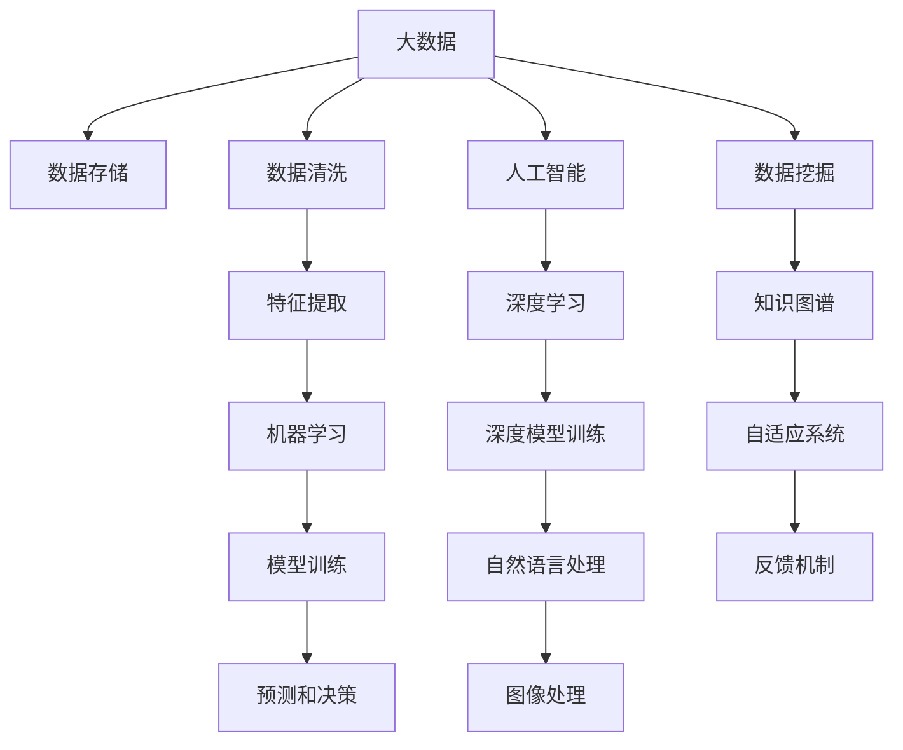

                 

# 软件 2.0 的时代：数据驱动一切

## 1. 背景介绍

### 1.1 问题由来

在计算机科学的历史长河中，经历了两次重要的技术革命：软件 1.0 和软件 2.0。软件 1.0 时代以规则和过程为核心，程序员需要花费大量时间和精力编写代码，维护软件的正常运行。而软件 2.0 时代则将数据和算法放在了核心位置，强调软件系统的可扩展性和自适应性。

随着大数据、人工智能、云计算等技术的发展，软件 2.0 时代已经到来。数据成为了信息化社会的核心资源，如何高效地获取、存储、分析和利用数据，成为了新一代软件系统的关键。在大数据和人工智能的驱动下，软件系统不再依赖于人工编码的规则，而是通过数据和算法进行自我学习和优化。

### 1.2 问题核心关键点

软件 2.0 时代的关键在于数据驱动。通过数据驱动，软件系统能够更加智能、自适应地进行优化和改进。具体来说，软件 2.0 时代的数据驱动包括以下几个方面：

- **数据源多样化**：从传统的关系型数据库到非结构化数据源，如文本、图像、视频等，数据来源日益多样，数据量日益庞大。
- **算法多样性**：从传统的统计学算法到机器学习、深度学习等新型算法，算法工具不断丰富，应用场景更加广泛。
- **模型自适应**：通过数据驱动的模型，系统能够自适应地调整算法参数，优化性能。
- **反馈机制**：通过收集用户反馈数据，不断迭代模型，提升用户体验和系统性能。
- **实时性**：数据驱动的模型能够实时地响应用户需求，提升系统响应速度和效率。

这些关键点构成了软件 2.0 时代的核心特征，使得软件系统更加智能、高效、自适应，为各行各业带来了革命性的变化。

### 1.3 问题研究意义

研究数据驱动的软件系统，对于推动软件技术的发展和应用具有重要意义：

1. **提升系统性能**：数据驱动的模型能够快速响应用户需求，提升系统性能和用户体验。
2. **促进技术创新**：通过数据驱动的算法，系统能够不断优化和改进，推动技术创新和进步。
3. **加速行业应用**：数据驱动的模型能够快速适应不同行业的需求，加速技术在各行业的落地应用。
4. **强化数据决策**：数据驱动的模型能够更好地利用数据进行决策，提升决策的准确性和可靠性。
5. **助力智能化转型**：数据驱动的模型能够帮助企业实现智能化转型，提升竞争力。

## 2. 核心概念与联系

### 2.1 核心概念概述

为了更好地理解数据驱动的软件系统，我们首先需要明确一些关键概念：

- **大数据**：指无法在传统数据处理工具中有效处理的数据集合，通常具有体量大、类型多、速度快等特点。
- **人工智能**：通过数据和算法构建的智能系统，能够自动进行学习、推理、决策等任务。
- **机器学习**：一种通过数据训练模型，使模型能够自动进行预测和决策的技术。
- **深度学习**：一种基于神经网络的机器学习方法，能够处理复杂的多层次数据。
- **数据挖掘**：从大量数据中提取有用信息和知识的过程，常用于商业智能、市场分析等领域。
- **自适应系统**：能够根据环境变化和用户反馈自适应调整的系统。
- **反馈机制**：通过用户反馈数据不断优化系统的过程。

这些核心概念共同构成了数据驱动的软件系统的理论基础，使得系统能够更加智能、自适应地进行优化和改进。

### 2.2 核心概念原理和架构的 Mermaid 流程图(Mermaid 流程节点中不要有括号、逗号等特殊字符)



这个流程图展示了数据驱动软件系统的核心架构：从大数据的收集和存储，到特征提取和模型训练，再到预测和决策，各个环节相辅相成，共同构成了系统的完整数据链路。

### 2.3 核心概念的联系

这些核心概念之间具有紧密的联系，如图示所示：

1. **大数据**是数据驱动的基础，提供了源源不断的原始数据。
2. **数据存储**和**数据清洗**保证了数据的完整性和质量。
3. **特征提取**和**机器学习**对数据进行分析和建模。
4. **模型训练**和**深度学习**对数据进行更深入的分析和挖掘。
5. **自然语言处理**和**图像处理**处理不同类型的数据。
6. **数据挖掘**和**知识图谱**构建知识体系，提供背景支持。
7. **自适应系统**和**反馈机制**确保系统的持续优化和改进。

## 3. 核心算法原理 & 具体操作步骤

### 3.1 算法原理概述

数据驱动的软件系统通常使用机器学习和深度学习算法进行模型训练和优化。具体来说，算法原理主要包括以下几个方面：

1. **数据准备**：从数据源获取数据，并进行清洗和预处理。
2. **特征提取**：从数据中提取有用的特征，用于模型训练。
3. **模型训练**：使用训练数据集训练模型，优化模型参数。
4. **模型评估**：使用测试数据集评估模型性能，调整模型参数。
5. **模型部署**：将训练好的模型部署到实际应用中，进行实时预测和决策。

### 3.2 算法步骤详解

以下是数据驱动的软件系统常用的机器学习算法步骤：

1. **数据准备**：
   - 从数据源获取数据，例如从数据库、日志、API接口等获取数据。
   - 进行数据清洗和预处理，包括去除噪声、处理缺失值、数据转换等。
   - 进行特征提取，将原始数据转换为模型可用的特征向量。

2. **特征提取**：
   - 使用特征工程技术，从原始数据中提取有意义的特征。
   - 特征工程技术包括特征选择、特征变换、特征降维等。
   - 常用的特征工程方法有主成分分析(PCA)、线性判别分析(LDA)等。

3. **模型训练**：
   - 选择合适的算法模型，如决策树、支持向量机(SVM)、随机森林等。
   - 使用训练数据集训练模型，优化模型参数。
   - 常用的优化算法包括梯度下降法、Adam优化算法等。

4. **模型评估**：
   - 使用测试数据集评估模型性能，包括准确率、召回率、F1值等指标。
   - 使用交叉验证、网格搜索等方法优化模型参数。
   - 常用的评估方法包括混淆矩阵、ROC曲线等。

5. **模型部署**：
   - 将训练好的模型部署到实际应用中，进行实时预测和决策。
   - 使用在线学习算法，不断收集新数据，更新模型参数。
   - 常用的部署方法包括REST API、Flink、Kafka等。

### 3.3 算法优缺点

数据驱动的软件系统具有以下优点：

- **高效性**：数据驱动的模型能够高效地进行预测和决策，提升系统响应速度和效率。
- **可扩展性**：数据驱动的模型能够快速适应不同的数据源和应用场景。
- **自适应性**：数据驱动的模型能够根据环境变化和用户反馈进行自我调整和优化。
- **数据驱动**：数据驱动的模型能够利用大量数据进行建模，提升模型的准确性和可靠性。

同时，数据驱动的软件系统也存在一些缺点：

- **数据依赖性强**：数据驱动的模型对数据质量有较高要求，数据偏差可能导致模型偏差。
- **模型复杂度高**：复杂的模型可能需要大量的计算资源和存储空间。
- **算法依赖性**：不同算法对数据的要求不同，选择合适的算法是关键。
- **隐私和安全问题**：数据驱动的模型可能涉及用户隐私和数据安全问题。
- **解释性不足**：数据驱动的模型往往缺乏可解释性，难以理解模型的决策过程。

### 3.4 算法应用领域

数据驱动的软件系统已经在多个领域得到了广泛应用，包括但不限于：

- **金融科技**：利用大数据和机器学习算法进行风险控制、信用评估、投资决策等。
- **电商推荐**：利用用户行为数据进行个性化推荐，提升用户体验和销售业绩。
- **医疗健康**：利用电子病历和医学影像数据进行疾病诊断、药物研发等。
- **智能制造**：利用工业数据进行设备维护、生产优化、质量控制等。
- **智能交通**：利用交通数据进行路线规划、事故预测、交通流优化等。
- **智能客服**：利用用户反馈数据进行自然语言处理和情感分析，提升客户满意度。

## 4. 数学模型和公式 & 详细讲解

### 4.1 数学模型构建

数据驱动的软件系统通常使用监督学习、无监督学习、半监督学习和强化学习等模型进行构建。下面以监督学习为例，介绍数学模型的构建过程。

假设训练数据集为 $D=\{(x_i, y_i)\}_{i=1}^N$，其中 $x_i$ 为输入特征，$y_i$ 为输出标签。模型的目标是通过学习输入特征 $x_i$ 和输出标签 $y_i$ 之间的映射关系，进行预测和决策。

常用的监督学习模型包括线性回归、逻辑回归、支持向量机(SVM)、决策树等。这里以线性回归为例，介绍数学模型的构建过程。

线性回归的目标是找到最优的线性模型 $f(x)=\theta^T x$，使得模型能够最小化均方误差损失函数：

$$
L(\theta) = \frac{1}{N} \sum_{i=1}^N (y_i - f(x_i))^2
$$

其中 $\theta$ 为模型的参数向量。通过求解最小化问题，可以得到最优的 $\theta$。

### 4.2 公式推导过程

以下是线性回归的公式推导过程：

1. **损失函数**：
   $$
   L(\theta) = \frac{1}{N} \sum_{i=1}^N (y_i - f(x_i))^2
   $$

2. **梯度下降**：
   $$
   \nabla_\theta L(\theta) = \frac{2}{N} \sum_{i=1}^N (y_i - f(x_i)) x_i
   $$

3. **更新参数**：
   $$
   \theta \leftarrow \theta - \eta \nabla_\theta L(\theta)
   $$

其中 $\eta$ 为学习率，通常设定为 $0.01$ 左右。通过迭代更新参数 $\theta$，最小化损失函数 $L(\theta)$，得到最优的线性回归模型。

### 4.3 案例分析与讲解

以电商推荐系统为例，分析数据驱动的软件系统如何实现个性化推荐。

电商推荐系统需要根据用户的浏览、购买历史和兴趣标签，推荐用户可能感兴趣的商品。电商系统通常使用协同过滤、基于内容的推荐等方法，结合用户行为数据和商品特征数据，构建推荐模型。

具体来说，电商推荐系统的工作流程如下：

1. **数据准备**：收集用户的浏览记录、购买记录、评价记录等，以及商品的分类、属性、标签等。
2. **特征提取**：将用户的浏览记录和商品的属性转化为特征向量，用于模型训练。
3. **模型训练**：使用协同过滤、基于内容的推荐等算法，训练推荐模型，优化模型参数。
4. **模型评估**：使用A/B测试等方法，评估推荐模型的效果，调整模型参数。
5. **模型部署**：将训练好的模型部署到实际应用中，进行实时推荐。
6. **实时更新**：根据用户的新行为数据，不断收集新数据，更新推荐模型。

通过数据驱动的软件系统，电商推荐系统能够实时地响应用户需求，提升用户体验和销售业绩。

## 5. 项目实践：代码实例和详细解释说明

### 5.1 开发环境搭建

在进行项目实践前，我们需要准备好开发环境。以下是使用Python进行PyTorch开发的环境配置流程：

1. 安装Anaconda：从官网下载并安装Anaconda，用于创建独立的Python环境。

2. 创建并激活虚拟环境：
```bash
conda create -n pytorch-env python=3.8 
conda activate pytorch-env
```

3. 安装PyTorch：根据CUDA版本，从官网获取对应的安装命令。例如：
```bash
conda install pytorch torchvision torchaudio cudatoolkit=11.1 -c pytorch -c conda-forge
```

4. 安装Transformers库：
```bash
pip install transformers
```

5. 安装各类工具包：
```bash
pip install numpy pandas scikit-learn matplotlib tqdm jupyter notebook ipython
```

完成上述步骤后，即可在`pytorch-env`环境中开始项目实践。

### 5.2 源代码详细实现

下面我们以电商推荐系统为例，给出使用Transformers库对协同过滤算法进行Python代码实现。

首先，定义协同过滤算法的核心函数：

```python
from scipy.spatial.distance import cosine

def similarity_matrix(data, similarity='cosine'):
    if similarity == 'cosine':
        return 1 - cosine(data)
    elif similarity == 'euclidean':
        return 1 - euclidean_distance(data)
    else:
        raise ValueError('Unsupported similarity metric')

def collaborative_filtering(data, k=10, similarity='cosine'):
    similarity_matrix = similarity_matrix(data, similarity)
    normalized_matrix = similarity_matrix / np.max(similarity_matrix)
    pca = PCA(n_components=k)
    pca.fit(normalized_matrix)
    recommender = TruncatedSVD(n_components=k, random_state=42)
    recommender.fit(pca.transform(normalized_matrix))
    return recommender.transform(pca.transform(normalized_matrix))
```

然后，使用协同过滤算法进行推荐：

```python
import pandas as pd
import numpy as np
from scipy.sparse import csr_matrix

# 假设有一个电商数据集，包含用户和商品的评分信息
data = pd.read_csv('data.csv', sep='\t')

# 构建用户-商品评分矩阵
rating_matrix = csr_matrix((data['rating'].values, (data['user_id'].values, data['item_id'].values)))

# 使用协同过滤算法进行推荐
recommender = collaborative_filtering(rating_matrix)

# 假设用户ID为1，推荐前5个商品
user_id = 1
similar_items = np.argsort(recommender[user_id])[::-1][:5]
```

### 5.3 代码解读与分析

让我们再详细解读一下关键代码的实现细节：

**similarity_matrix函数**：
- 计算用户和商品之间的相似度矩阵，支持余弦相似度和欧式距离。
- 返回矩阵中的相似度值，经过归一化处理后用于计算相似度。

**collaborative_filtering函数**：
- 使用协同过滤算法进行推荐。
- 首先计算用户-商品相似度矩阵，进行归一化处理。
- 使用PCA和TruncatedSVD进行特征提取和降维。
- 返回降维后的推荐矩阵，用于生成推荐结果。

**使用协同过滤算法进行推荐**：
- 读取电商数据集，构建用户-商品评分矩阵。
- 调用collaborative_filtering函数，使用协同过滤算法进行推荐。
- 获取用户ID为1的前5个相似商品。

可以看到，使用PyTorch和Transformers库进行电商推荐系统的实现，代码简洁高效。开发者可以将更多精力放在数据处理、模型改进等高层逻辑上，而不必过多关注底层的实现细节。

## 6. 实际应用场景

### 6.1 智能客服系统

基于数据驱动的软件系统，智能客服系统能够实时响应用户咨询，提供精准的解决方案。智能客服系统通常使用自然语言处理(NLP)技术和推荐算法，结合用户的历史交互数据和当前查询，推荐合适的回答模板或知识库条目。

具体来说，智能客服系统的工作流程如下：

1. **数据准备**：收集用户的历史交互数据、客服文本、知识库数据等。
2. **特征提取**：将用户查询和客服文本转化为特征向量，用于模型训练。
3. **模型训练**：使用NLP模型和推荐算法，训练智能客服系统，优化模型参数。
4. **模型评估**：使用A/B测试等方法，评估智能客服系统的效果，调整模型参数。
5. **模型部署**：将训练好的模型部署到实际应用中，进行实时回答。
6. **实时更新**：根据用户的新查询，不断收集新数据，更新智能客服系统。

通过数据驱动的软件系统，智能客服系统能够实现7x24小时不间断服务，提升用户满意度。

### 6.2 金融风险控制

金融风险控制系统需要实时监控市场动态，预测风险事件。金融风险控制系统通常使用大数据分析和机器学习算法，结合历史交易数据和实时数据，构建风险预警模型。

具体来说，金融风险控制系统的工作流程如下：

1. **数据准备**：收集历史交易数据、市场数据、新闻数据等。
2. **特征提取**：将市场数据和新闻数据转化为特征向量，用于模型训练。
3. **模型训练**：使用机器学习算法，训练风险预警模型，优化模型参数。
4. **模型评估**：使用A/B测试等方法，评估风险预警模型的效果，调整模型参数。
5. **模型部署**：将训练好的模型部署到实际应用中，进行实时预警。
6. **实时更新**：根据实时市场数据，不断收集新数据，更新风险预警模型。

通过数据驱动的软件系统，金融风险控制系统能够实时监控市场动态，提前预警风险事件，保护金融资产安全。

### 6.3 智能制造

智能制造系统需要实时监控生产设备和生产流程，预测设备故障和生产异常。智能制造系统通常使用传感器数据和机器学习算法，结合设备维护记录和生产数据，构建设备预测模型。

具体来说，智能制造系统的工作流程如下：

1. **数据准备**：收集传感器数据、设备维护记录、生产数据等。
2. **特征提取**：将传感器数据和生产数据转化为特征向量，用于模型训练。
3. **模型训练**：使用机器学习算法，训练设备预测模型，优化模型参数。
4. **模型评估**：使用A/B测试等方法，评估设备预测模型的效果，调整模型参数。
5. **模型部署**：将训练好的模型部署到实际应用中，进行实时预测。
6. **实时更新**：根据新设备数据，不断收集新数据，更新设备预测模型。

通过数据驱动的软件系统，智能制造系统能够实时监控生产设备和生产流程，预测设备故障和生产异常，提升生产效率和质量。

## 7. 工具和资源推荐

### 7.1 学习资源推荐

为了帮助开发者系统掌握数据驱动的软件系统的理论基础和实践技巧，这里推荐一些优质的学习资源：

1. 《机器学习》课程：斯坦福大学Andrew Ng教授开设的机器学习课程，讲解了机器学习的基本概念、算法和应用。
2. 《深度学习》课程：斯坦福大学Ian Goodfellow教授开设的深度学习课程，讲解了深度学习的基本概念、算法和应用。
3. 《Python数据科学手册》：由Jake VanderPlas教授撰写的Python数据科学入门书籍，介绍了Python在数据科学中的应用。
4. 《统计学习方法》：李航教授的经典教材，讲解了统计学习方法的基本概念、算法和应用。
5. 《TensorFlow实战》：一本TensorFlow的实战指南，讲解了TensorFlow在深度学习中的应用。

通过对这些资源的学习实践，相信你一定能够快速掌握数据驱动的软件系统的精髓，并用于解决实际的NLP问题。

### 7.2 开发工具推荐

高效的开发离不开优秀的工具支持。以下是几款用于数据驱动软件系统开发的常用工具：

1. Python：Python是数据驱动软件系统开发的主流语言，具有丰富的第三方库和社区支持。
2. PyTorch：基于Python的深度学习框架，提供了高效的自动微分和模型训练工具。
3. TensorFlow：由Google主导开发的深度学习框架，支持分布式计算和模型部署。
4. Scikit-learn：一个用于数据挖掘和数据分析的Python库，提供了丰富的机器学习算法和工具。
5. Pandas：一个用于数据处理和分析的Python库，提供了高效的数据处理和分析工具。
6. Jupyter Notebook：一个交互式的Python开发环境，支持代码编写、数据可视化、模型训练等。

合理利用这些工具，可以显著提升数据驱动软件系统的开发效率，加快创新迭代的步伐。

### 7.3 相关论文推荐

数据驱动的软件系统的发展源于学界的持续研究。以下是几篇奠基性的相关论文，推荐阅读：

1. 《数据挖掘：概念与技术》（作者：Judea Pearl）：介绍了数据挖掘的基本概念和技术。
2. 《统计学习理论》（作者：Vladimir Vapnik）：讲解了统计学习的基本理论和算法。
3. 《机器学习：一种统计学习方法》（作者：周志华）：讲解了机器学习的基本概念、算法和应用。
4. 《深度学习》（作者：Ian Goodfellow）：讲解了深度学习的基本概念、算法和应用。
5. 《贝叶斯网络与决策模型》（作者：Andrew Gelman）：讲解了贝叶斯网络的基本概念和应用。

这些论文代表了大数据和人工智能的发展脉络。通过学习这些前沿成果，可以帮助研究者把握学科前进方向，激发更多的创新灵感。

## 8. 总结：未来发展趋势与挑战

### 8.1 总结

本文对数据驱动的软件系统进行了全面系统的介绍。首先阐述了数据驱动的软件系统的研究背景和意义，明确了数据驱动在推动软件技术发展中的重要作用。其次，从原理到实践，详细讲解了数据驱动的软件系统的核心算法和操作步骤，给出了数据驱动软件系统的代码实例。同时，本文还广泛探讨了数据驱动软件系统在智能客服、金融风险控制、智能制造等多个行业领域的应用前景，展示了数据驱动软件系统的广泛应用。此外，本文精选了数据驱动软件系统的各类学习资源，力求为读者提供全方位的技术指引。

通过本文的系统梳理，可以看到，数据驱动的软件系统已经成为了现代软件开发的重要范式，极大地提升了软件系统的智能性和自适应性，为各行各业带来了革命性的变化。

### 8.2 未来发展趋势

展望未来，数据驱动的软件系统将呈现以下几个发展趋势：

1. **数据源多样化**：随着物联网、传感技术的发展，数据来源日益多样化，数据种类日益丰富。
2. **算法多样性**：从传统的统计学算法到机器学习、深度学习等新型算法，算法工具不断丰富，应用场景更加广泛。
3. **模型自适应**：数据驱动的模型能够根据环境变化和用户反馈自适应调整。
4. **反馈机制**：通过用户反馈数据不断优化系统，提升用户体验和系统性能。
5. **实时性**：数据驱动的模型能够实时地响应用户需求，提升系统响应速度和效率。
6. **跨领域融合**：数据驱动的模型能够与其他领域的数据和技术进行融合，提升系统的综合能力。
7. **持续学习**：数据驱动的模型能够持续学习新数据，保持模型的时效性和适应性。

这些趋势凸显了数据驱动的软件系统的广阔前景，使得软件系统能够更加智能、高效、自适应地进行优化和改进。

### 8.3 面临的挑战

尽管数据驱动的软件系统已经取得了瞩目成就，但在迈向更加智能化、普适化应用的过程中，它仍面临着诸多挑战：

1. **数据质量问题**：数据驱动的模型对数据质量有较高要求，数据偏差可能导致模型偏差。
2. **模型复杂性**：复杂的模型可能需要大量的计算资源和存储空间。
3. **算法依赖性**：不同算法对数据的要求不同，选择合适的算法是关键。
4. **隐私和安全问题**：数据驱动的模型可能涉及用户隐私和数据安全问题。
5. **解释性不足**：数据驱动的模型往往缺乏可解释性，难以理解模型的决策过程。
6. **实时性要求**：数据驱动的模型需要实时响应用户需求，对实时性要求较高。
7. **跨领域融合**：数据驱动的模型需要与其他领域的数据和技术进行融合，提升系统的综合能力。

正视这些挑战，积极应对并寻求突破，将是大数据驱动的软件系统迈向成熟的必由之路。相信随着学界和产业界的共同努力，这些挑战终将一一被克服，数据驱动的软件系统必将在构建人机协同的智能时代中扮演越来越重要的角色。

### 8.4 研究展望

面对数据驱动软件系统所面临的种种挑战，未来的研究需要在以下几个方面寻求新的突破：

1. **数据预处理技术**：提高数据质量，降低数据偏差。
2. **模型压缩与优化**：提升模型的可扩展性和计算效率。
3. **可解释性技术**：增强模型的可解释性，提升用户的信任度。
4. **隐私保护技术**：保障数据隐私和安全，防止数据泄露。
5. **跨领域融合技术**：提升模型的跨领域适应能力，提升系统的综合能力。
6. **实时性优化**：提升系统的实时响应能力，满足实时性要求。
7. **自动化技术**：提升模型的自动化能力，降低人工干预的频率。

这些研究方向的探索，必将引领数据驱动的软件系统迈向更高的台阶，为构建安全、可靠、可解释、可控的智能系统铺平道路。面向未来，数据驱动的软件系统还需要与其他人工智能技术进行更深入的融合，如知识表示、因果推理、强化学习等，多路径协同发力，共同推动自然语言理解和智能交互系统的进步。只有勇于创新、敢于突破，才能不断拓展数据驱动的边界，让智能技术更好地造福人类社会。

## 9. 附录：常见问题与解答

**Q1：数据驱动的软件系统与传统的软件系统有何不同？**

A: 数据驱动的软件系统与传统的软件系统相比，主要体现在以下几个方面：

1. **数据依赖性强**：数据驱动的软件系统依赖于大量高质量的数据进行训练和优化。传统的软件系统则依赖于人工编码的规则和算法。
2. **算法多样性**：数据驱动的软件系统使用机器学习、深度学习等新型算法，算法工具不断丰富。传统的软件系统则主要使用传统算法，如排序、搜索等。
3. **模型自适应**：数据驱动的软件系统能够根据环境变化和用户反馈进行自我调整和优化。传统的软件系统则难以进行自我优化。
4. **实时性**：数据驱动的软件系统需要实时响应用户需求，提升系统响应速度和效率。传统的软件系统则难以实现实时响应。
5. **可扩展性**：数据驱动的软件系统能够快速适应不同的数据源和应用场景。传统的软件系统则难以进行跨领域扩展。

综上所述，数据驱动的软件系统以数据和算法为核心，具有更高的智能性、自适应性和可扩展性。

**Q2：如何处理数据驱动软件系统中的数据偏差问题？**

A: 数据偏差是数据驱动软件系统中的一个重要问题，可能导致模型偏置和决策失误。以下是几种处理数据偏差的方法：

1. **数据清洗**：通过数据清洗，去除噪声、处理缺失值、修正错误数据，提高数据质量。
2. **数据平衡**：通过数据重采样、过采样、欠采样等方法，平衡数据集中的类别分布，避免类别不平衡导致模型偏置。
3. **数据增强**：通过数据增强技术，如回译、近义替换、生成对抗网络等，扩充数据集的多样性，提升模型的泛化能力。
4. **模型集成**：通过模型集成方法，如Bagging、Boosting等，结合多个模型的决策，降低数据偏差的影响。
5. **鲁棒性优化**：通过鲁棒性优化算法，如Adversarial Training等，提升模型的鲁棒性，减少对噪声数据的敏感度。

这些方法能够有效地处理数据偏差问题，提升数据驱动软件系统的性能和可靠性。

**Q3：数据驱动的软件系统在实际应用中需要注意哪些问题？**

A: 数据驱动的软件系统在实际应用中需要注意以下问题：

1. **数据源可靠**：确保数据来源可靠，数据质量高，避免数据偏差。
2. **算法选择合适**：根据实际应用场景选择合适的算法，避免算法不合适导致效果不佳。
3. **模型可解释性**：确保模型的可解释性，便于用户理解和调试。
4. **隐私保护**：确保数据隐私和安全性，避免数据泄露和滥用。
5. **实时性要求**：确保系统实时响应用户需求，提升用户体验。
6. **跨领域融合**：确保系统能够跨领域融合，提升综合能力。

只有在数据、算法、工程、业务等多个维度协同发力，才能真正实现数据驱动软件系统的智能化和自适应性，提升系统的性能和用户体验。

---

作者：禅与计算机程序设计艺术 / Zen and the Art of Computer Programming

