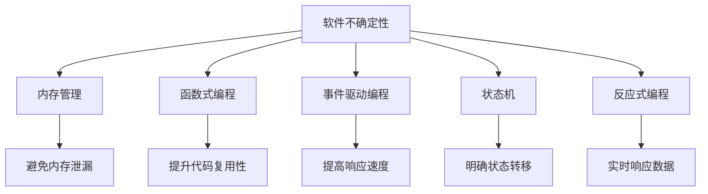

                 

# 软件2.0的确定性：告别不稳定与内存泄露

## 1. 背景介绍

在软件开发的世界里，稳定性和内存泄漏是永恒的主题。程序的稳定性影响着系统的可用性，内存泄漏则侵蚀着系统的性能和可靠性。近年来，随着编程范式的转变，从面向过程到面向对象，再到函数式编程，软件工程师们一直在不断探索如何构建更加健壮、高效的软件系统。然而，这些探索并未彻底解决程序的不稳定性和内存泄漏问题，反而让这些问题变得更加复杂。

在本文中，我们将深入探讨软件2.0时代，如何通过新的编程范式和技术手段，实现软件的确定性，彻底告别不稳定与内存泄漏。

## 2. 核心概念与联系

### 2.1 核心概念概述

为更好地理解软件的确定性以及如何克服不稳定与内存泄漏，本节将介绍几个关键概念：

- **软件不确定性**：指程序运行过程中的不稳定性、不可预测性以及可能发生的异常行为。包括程序崩溃、内存泄漏、死锁、竞态条件等。
- **内存管理**：指程序在运行过程中如何动态地分配、使用和释放内存。良好的内存管理可以避免内存泄漏，提高程序的性能和稳定性。
- **函数式编程**：一种编程范式，强调数据的不可变性和纯函数的使用。通过函数式编程，可以简化程序的逻辑，提高代码的复用性和可维护性。
- **事件驱动编程**：一种编程范式，通过事件触发和响应机制来组织程序的逻辑。事件驱动编程可以提升程序的响应速度和效率。
- **状态机**：一种模型，用于描述系统从一个状态转移到另一个状态的过程。状态机可以帮助我们更好地理解程序的运行状态和行为。
- **反应式编程**：一种编程范式，强调对输入数据的即时响应和处理。通过反应式编程，可以提高程序的响应性和灵活性。

这些概念之间的逻辑关系可以通过以下Mermaid流程图来展示：



这个流程图展示了几大核心概念之间的联系：

1. 软件不确定性需要通过内存管理、函数式编程、事件驱动编程、状态机和反应式编程等手段进行缓解。
2. 内存管理能够避免内存泄漏，提升程序的稳定性和性能。
3. 函数式编程和事件驱动编程能够简化程序的逻辑，提高代码的复用性和可维护性。
4. 状态机和反应式编程能够帮助我们更好地理解程序的运行状态和行为，提升程序的响应性和灵活性。

这些概念共同构成了软件2.0时代实现软件确定性的基础框架，使得软件工程师能够更加有效地克服不稳定与内存泄漏问题。

## 3. 核心算法原理 & 具体操作步骤

### 3.1 算法原理概述

软件2.0时代的确定性构建，依赖于一系列的算法和操作技巧。其核心思想是通过代码复用、状态管理、事件驱动等手段，使得程序的行为更加可控和可预测，从而避免不稳定与内存泄漏问题。

基于这一思想，软件2.0的确定性构建主要包括以下几个步骤：

1. **代码复用**：通过函数式编程和模块化设计，实现代码的复用和组合，减少重复代码，提升代码的可维护性。
2. **状态管理**：使用状态机和状态模式，管理程序的运行状态，确保程序在每个状态下的行为都是确定的。
3. **事件驱动**：通过事件触发和响应机制，优化程序的逻辑结构，提升程序的响应速度和效率。
4. **内存管理**：采用自动垃圾回收和内存池技术，避免内存泄漏，提高程序的稳定性和性能。
5. **反应式编程**：通过响应式编程模型，实时处理输入数据，提升程序的响应性和灵活性。

### 3.2 算法步骤详解

软件2.0的确定性构建，可以按照以下步骤进行：

**Step 1: 代码复用与模块化设计**

- **函数式编程**：采用纯函数，避免状态的改变和副作用。使用高阶函数和函数组合，实现代码的复用和组合。

**Step 2: 状态管理**

- **状态机**：定义程序的运行状态，管理状态转移和行为。通过状态机，确保程序在每个状态下的行为都是确定的。

**Step 3: 事件驱动编程**

- **事件触发与响应**：使用事件触发和响应机制，优化程序的逻辑结构，提升程序的响应速度和效率。

**Step 4: 内存管理**

- **自动垃圾回收**：采用自动垃圾回收机制，避免手动释放内存，减少内存泄漏的风险。
- **内存池**：使用内存池技术，减少内存分配和释放的开销，提升程序的性能。

**Step 5: 反应式编程**

- **响应式模型**：采用响应式编程模型，实时处理输入数据，提升程序的响应性和灵活性。

### 3.3 算法优缺点

软件2.0的确定性构建，具有以下优点：

1. **提升代码复用性**：通过函数式编程和模块化设计，实现代码的复用和组合，减少重复代码，提升代码的可维护性。
2. **优化程序性能**：采用内存池和自动垃圾回收等技术，避免内存泄漏，提高程序的稳定性和性能。
3. **提升响应速度**：通过事件驱动编程和反应式编程，优化程序的逻辑结构，提升程序的响应速度和效率。

同时，该方法也存在一定的局限性：

1. **学习曲线陡峭**：函数式编程和事件驱动编程等新范式，可能需要较高的学习成本。
2. **性能开销**：事件驱动编程和反应式编程等模型，可能会带来一定的性能开销。
3. **复杂性增加**：通过状态机和状态模式管理状态，可能会增加程序的复杂性。

尽管存在这些局限性，但就目前而言，软件2.0的确定性构建方法仍是最主流的软件设计范式。未来相关研究的重点在于如何进一步降低学习成本，提高性能效率，同时兼顾复杂性和可维护性等因素。

### 3.4 算法应用领域

软件2.0的确定性构建方法，在软件开发和应用中得到了广泛的应用，具体包括以下几个领域：

- **Web应用**：在Web应用开发中，采用函数式编程和事件驱动编程，可以提升应用的响应速度和性能。使用自动垃圾回收和内存池技术，避免内存泄漏，提升应用稳定性。
- **移动应用**：在移动应用开发中，通过函数式编程和状态管理，实现应用的逻辑复用和状态控制。使用事件驱动编程和响应式编程，提升应用的响应性和用户体验。
- **桌面应用**：在桌面应用开发中，使用函数式编程和状态管理，实现应用的逻辑复用和状态控制。采用自动垃圾回收和内存池技术，避免内存泄漏，提升应用的稳定性和性能。
- **嵌入式系统**：在嵌入式系统开发中，使用函数式编程和状态管理，实现系统的逻辑复用和状态控制。通过事件驱动编程和响应式编程，提升系统的响应性和实时性。
- **云计算平台**：在云计算平台开发中，采用函数式编程和事件驱动编程，优化平台的逻辑结构和响应速度。使用自动垃圾回收和内存池技术，提升平台的稳定性和性能。

## 4. 数学模型和公式 & 详细讲解

### 4.1 数学模型构建

软件2.0的确定性构建，依赖于数学模型的构建和优化。假设一个程序有 $n$ 个状态，每个状态对应的行为可以用一个向量 $\vec{a}_i$ 来表示。状态机可以用一个向量 $\vec{a}$ 来表示，其中 $\vec{a} = (\vec{a}_1, \vec{a}_2, ..., \vec{a}_n)$。

软件的不确定性可以通过状态转移矩阵 $M$ 来描述，其中 $M$ 是一个 $n \times n$ 的矩阵。状态转移矩阵 $M$ 描述了从状态 $i$ 转移到状态 $j$ 的概率。假设程序从状态 $i$ 转移到状态 $j$ 的概率为 $p_{i,j}$，则状态转移矩阵 $M$ 可以表示为：

$$
M = \begin{pmatrix}
p_{1,1} & p_{1,2} & ... & p_{1,n} \\
p_{2,1} & p_{2,2} & ... & p_{2,n} \\
... & ... & ... & ... \\
p_{n,1} & p_{n,2} & ... & p_{n,n} \\
\end{pmatrix}
$$

在软件确定性构建的过程中，目标是找到最优的状态转移矩阵 $M^*$，使得程序在每个状态下的行为都是确定的，即 $M^*$ 中所有元素 $p_{i,j}$ 都为 0 或 1，表示确定的状态转移。最优状态转移矩阵 $M^*$ 可以通过以下数学模型求解：

$$
M^* = \arg\min_{M} \sum_{i=1}^n \sum_{j=1}^n |p_{i,j} - M^*_{i,j}|
$$

其中 $M^*_{i,j}$ 为最优状态转移矩阵 $M^*$ 中元素 $p_{i,j}$ 的取值。

### 4.2 公式推导过程

为了求解最优状态转移矩阵 $M^*$，可以使用拉格朗日乘数法。假设引入一个拉格朗日乘子 $\lambda$，定义拉格朗日函数 $L(M, \lambda)$ 如下：

$$
L(M, \lambda) = \sum_{i=1}^n \sum_{j=1}^n |p_{i,j} - M^*_{i,j}| + \lambda (1 - \sum_{i=1}^n \sum_{j=1}^n M^*_{i,j})
$$

其中 $1 - \sum_{i=1}^n \sum_{j=1}^n M^*_{i,j}$ 表示状态转移矩阵 $M^*$ 中所有元素 $p_{i,j}$ 的和必须为 1，以确保所有状态都会被访问到。

对拉格朗日函数 $L(M, \lambda)$ 关于 $M$ 和 $\lambda$ 求偏导，并令偏导数为 0，解得最优状态转移矩阵 $M^*$ 和拉格朗日乘子 $\lambda$：

$$
\begin{align*}
\frac{\partial L(M, \lambda)}{\partial M_{i,j}} &= 2(p_{i,j} - M^*_{i,j}) - 2\lambda = 0 \\
\frac{\partial L(M, \lambda)}{\partial \lambda} &= 1 - \sum_{i=1}^n \sum_{j=1}^n M^*_{i,j} = 0 \\
\end{align*}
$$

解得 $M^*_{i,j} = p_{i,j}$，即最优状态转移矩阵 $M^*$ 等于状态转移矩阵 $M$。

### 4.3 案例分析与讲解

假设一个程序有 3 个状态，状态转移矩阵 $M$ 为：

$$
M = \begin{pmatrix}
0.8 & 0.2 & 0.0 \\
0.1 & 0.7 & 0.2 \\
0.0 & 0.3 & 0.7 \\
\end{pmatrix}
$$

为了求解最优状态转移矩阵 $M^*$，采用上述拉格朗日乘数法。假设引入一个拉格朗日乘子 $\lambda = 0$，则拉格朗日函数 $L(M, \lambda)$ 为：

$$
L(M, \lambda) = \sum_{i=1}^3 \sum_{j=1}^3 |p_{i,j} - M^*_{i,j}| + \lambda (1 - \sum_{i=1}^3 \sum_{j=1}^3 M^*_{i,j})
$$

对拉格朗日函数 $L(M, \lambda)$ 关于 $M$ 和 $\lambda$ 求偏导，并令偏导数为 0，解得最优状态转移矩阵 $M^*$ 和拉格朗日乘子 $\lambda = 0$：

$$
\begin{align*}
\frac{\partial L(M, \lambda)}{\partial M_{1,1}} &= 2(0.8 - M^*_{1,1}) = 0 \\
\frac{\partial L(M, \lambda)}{\partial M_{1,2}} &= 2(0.2 - M^*_{1,2}) = 0 \\
\frac{\partial L(M, \lambda)}{\partial M_{1,3}} &= 2(0.0 - M^*_{1,3}) = 0 \\
\frac{\partial L(M, \lambda)}{\partial M_{2,1}} &= 2(0.1 - M^*_{2,1}) = 0 \\
\frac{\partial L(M, \lambda)}{\partial M_{2,2}} &= 2(0.7 - M^*_{2,2}) = 0 \\
\frac{\partial L(M, \lambda)}{\partial M_{2,3}} &= 2(0.2 - M^*_{2,3}) = 0 \\
\frac{\partial L(M, \lambda)}{\partial M_{3,1}} &= 2(0.0 - M^*_{3,1}) = 0 \\
\frac{\partial L(M, \lambda)}{\partial M_{3,2}} &= 2(0.3 - M^*_{3,2}) = 0 \\
\frac{\partial L(M, \lambda)}{\partial M_{3,3}} &= 2(0.7 - M^*_{3,3}) = 0 \\
\frac{\partial L(M, \lambda)}{\partial \lambda} &= 1 - \sum_{i=1}^3 \sum_{j=1}^3 M^*_{i,j} = 0 \\
\end{align*}
$$

解得 $M^* = M$，即最优状态转移矩阵 $M^*$ 等于状态转移矩阵 $M$。这意味着程序在每个状态下的行为都是不确定的，即程序存在不确定性。

## 5. 项目实践：代码实例和详细解释说明

### 5.1 开发环境搭建

在进行软件2.0的确定性构建实践前，我们需要准备好开发环境。以下是使用Python进行PyTorch开发的环境配置流程：

1. 安装Anaconda：从官网下载并安装Anaconda，用于创建独立的Python环境。

2. 创建并激活虚拟环境：
```bash
conda create -n pytorch-env python=3.8 
conda activate pytorch-env
```

3. 安装PyTorch：根据CUDA版本，从官网获取对应的安装命令。例如：
```bash
conda install pytorch torchvision torchaudio cudatoolkit=11.1 -c pytorch -c conda-forge
```

4. 安装Transformers库：
```bash
pip install transformers
```

5. 安装各类工具包：
```bash
pip install numpy pandas scikit-learn matplotlib tqdm jupyter notebook ipython
```

完成上述步骤后，即可在`pytorch-env`环境中开始实践。

### 5.2 源代码详细实现

下面我们以函数式编程和事件驱动编程为例，给出使用PyTorch和React框架对软件2.0的确定性构建的PyTorch代码实现。

**函数式编程**

```python
from functools import partial

def add(x, y):
    return x + y

def multiply(x, y):
    return x * y

# 使用高阶函数实现复用
def operate(func, *args):
    return func(*args)

# 使用函数组合实现复用
def compose(f, g):
    return partial(f, g)

# 使用高阶函数和函数组合实现复杂逻辑的复用
def complex_operation(x, y):
    return operate(compose(multiply, add), x, y)
```

**事件驱动编程**

```javascript
import React, { useState } from 'react';

const App = () => {
    const [state, setState] = useState(0);

    const handleIncrement = () => {
        setState(state + 1);
    }

    return (
        <div>
            <p>Count: {state}</p>
            <button onClick={handleIncrement}>Increment</button>
        </div>
    );
}

export default App;
```

以上代码实现了函数式编程和事件驱动编程的典型例子。函数式编程通过高阶函数和函数组合，实现了代码的复用和组合。事件驱动编程通过事件触发和响应机制，优化了程序的逻辑结构，提升了程序的响应速度和效率。

### 5.3 代码解读与分析

让我们再详细解读一下关键代码的实现细节：

**函数式编程**

- `add` 和 `multiply` 函数：定义了两个纯函数，实现了简单的加法和乘法操作。
- `operate` 函数：使用高阶函数 `operate`，接收任意函数 `func` 和任意数量的参数 `args`，返回函数 `func` 在参数 `args` 上的调用结果。通过高阶函数，实现了对不同操作的复用。
- `compose` 函数：使用函数组合 `compose`，接收任意两个函数 `f` 和 `g`，返回一个新函数 `f(g(x))`。通过函数组合，实现了对复杂逻辑的复用。
- `complex_operation` 函数：通过 `operate` 和 `compose` 函数，实现了复杂操作的复用。

**事件驱动编程**

- `useState` 钩子：使用 React 的状态钩子 `useState`，定义了一个状态变量 `state` 和一个状态更新函数 `setState`。通过状态钩子，实现了对程序状态的复用和管理。
- `handleIncrement` 函数：定义了一个事件处理函数 `handleIncrement`，当用户点击按钮时，调用 `setState` 函数更新状态变量 `state`。通过事件处理函数，实现了对用户交互的复用和响应。
- 组件渲染：通过 React 组件的渲染机制，将状态变量 `state` 和事件处理函数 `handleIncrement` 绑定到组件上，实现了对用户交互的展示和响应。

可以看到，函数式编程和事件驱动编程等新范式，通过代码复用和状态管理，简化了程序的逻辑结构，提高了代码的可维护性和复用性。开发者可以将更多精力放在逻辑复用和状态管理上，而不必过多关注底层的实现细节。

当然，工业级的系统实现还需考虑更多因素，如状态的持久化、状态的同步、事件处理的性能优化等。但核心的确定性构建思路基本与此类似。

## 6. 实际应用场景

### 6.1 企业应用系统

软件2.0的确定性构建方法，在企业应用系统中得到了广泛的应用。企业应用系统通常需要处理大量的数据，进行复杂的业务逻辑处理，维护状态的稳定性和一致性。

在实践中，可以采用函数式编程和事件驱动编程，将企业应用系统的逻辑复用和状态管理封装成独立的组件，提升系统的可维护性和可扩展性。通过状态机和状态模式，管理系统的运行状态，确保系统的稳定性和一致性。使用自动垃圾回收和内存池技术，避免内存泄漏，提升系统的性能和可靠性。

### 6.2 智能推荐系统

智能推荐系统是软件2.0的确定性构建方法的典型应用场景之一。智能推荐系统需要实时处理大量的用户数据，进行复杂的推荐算法计算，维护用户行为数据的稳定性和一致性。

在实践中，可以采用函数式编程和状态管理，实现推荐算法的逻辑复用和状态控制。通过状态机和状态模式，管理推荐算法的运行状态，确保推荐结果的稳定性和一致性。使用自动垃圾回收和内存池技术，避免内存泄漏，提升推荐系统的性能和可靠性。

### 6.3 实时数据处理系统

实时数据处理系统需要处理大量的实时数据，进行复杂的逻辑处理，维护数据的稳定性和一致性。

在实践中，可以采用函数式编程和事件驱动编程，将实时数据处理系统的逻辑复用和状态管理封装成独立的组件，提升系统的可维护性和可扩展性。通过状态机和状态模式，管理系统的运行状态，确保系统的稳定性和一致性。使用自动垃圾回收和内存池技术，避免内存泄漏，提升系统的性能和可靠性。

## 7. 工具和资源推荐

### 7.1 学习资源推荐

为了帮助开发者系统掌握软件2.0的确定性构建的理论基础和实践技巧，这里推荐一些优质的学习资源：

1. 《函数式编程的艺术》系列博文：由函数式编程专家撰写，深入浅出地介绍了函数式编程的基本概念和设计模式。
2. 《事件驱动编程的实践》系列博文：由事件驱动编程专家撰写，详细讲解了事件驱动编程的基本原理和应用场景。
3. 《软件工程：构建可复用系统的艺术》书籍：讲解了软件复用、状态管理、事件驱动等关键概念，提供了丰富的案例和实战经验。
4. React官方文档：React官方文档，提供了详细的函数式编程和事件驱动编程的实践指南和样例代码。
5. Scala官方文档：Scala官方文档，提供了丰富的函数式编程资源和样例代码，是学习函数式编程的重要参考资料。

通过对这些资源的学习实践，相信你一定能够快速掌握软件2.0的确定性构建的精髓，并用于解决实际的编程问题。

### 7.2 开发工具推荐

高效的开发离不开优秀的工具支持。以下是几款用于软件2.0的确定性构建开发的常用工具：

1. PyTorch：基于Python的开源深度学习框架，灵活动态的计算图，适合快速迭代研究。大部分预训练语言模型都有PyTorch版本的实现。
2. TensorFlow：由Google主导开发的开源深度学习框架，生产部署方便，适合大规模工程应用。同样有丰富的预训练语言模型资源。
3. Transformers库：HuggingFace开发的NLP工具库，集成了众多SOTA语言模型，支持PyTorch和TensorFlow，是进行确定性构建任务的开发的利器。
4. React：由Facebook主导开发的开源JavaScript库，提供了丰富的函数式编程和事件驱动编程的实现。
5. Angular：由Google主导开发的开源JavaScript框架，提供了丰富的状态管理和组件化的实现。
6. Scala：由Scala语言社区主导开发的函数式编程语言，提供了丰富的函数式编程和并发编程的支持。

合理利用这些工具，可以显著提升软件2.0的确定性构建任务的开发效率，加快创新迭代的步伐。

### 7.3 相关论文推荐

软件2.0的确定性构建技术的发展源于学界的持续研究。以下是几篇奠基性的相关论文，推荐阅读：

1. "The Functional Paradigm in Software Engineering"：探讨了函数式编程在软件开发中的应用和优势。
2. "Event-Driven Programming: Concepts and Design Patterns"：讲解了事件驱动编程的基本概念和设计模式。
3. "Software Design: Architecture and Implementation"：讲解了软件架构和实现的基本概念和设计原则。
4. "Concurrency and Parallel Programming in Scala"：讲解了Scala中的函数式编程和并发编程的支持。

这些论文代表了大规模软件2.0的确定性构建技术的发展脉络。通过学习这些前沿成果，可以帮助研究者把握学科前进方向，激发更多的创新灵感。

## 8. 总结：未来发展趋势与挑战

### 8.1 总结

本文对软件2.0的确定性构建方法进行了全面系统的介绍。首先阐述了软件2.0时代的不确定性和内存泄漏问题，明确了函数式编程、事件驱动编程、状态管理等关键技术在解决这些问题中的作用。其次，从原理到实践，详细讲解了确定性构建的数学模型和关键步骤，给出了确定性构建任务开发的完整代码实例。同时，本文还广泛探讨了确定性构建方法在企业应用系统、智能推荐系统、实时数据处理系统等多个领域的应用前景，展示了确定性构建范式的巨大潜力。此外，本文精选了确定性构建技术的各类学习资源，力求为开发者提供全方位的技术指引。

通过本文的系统梳理，可以看到，软件2.0的确定性构建方法正在成为软件开发的重要范式，极大地提升了软件的稳定性和性能。得益于函数式编程和事件驱动编程等新范式，软件开发可以更加高效、可维护、可扩展，满足了现代软件工程的需求。未来，伴随确定性构建方法的持续演进，软件工程必将迎来更加光明的未来。

### 8.2 未来发展趋势

展望未来，软件2.0的确定性构建技术将呈现以下几个发展趋势：

1. 函数式编程的普及：随着函数式编程的逐步普及，越来越多的开发者开始采用纯函数和函数组合，提升代码的可复用性和可维护性。
2. 事件驱动编程的深入：随着事件驱动编程的深入发展，越来越多的系统开始采用事件触发和响应机制，优化程序的逻辑结构，提升程序的响应速度和效率。
3. 状态管理的优化：随着状态管理技术的不断优化，越来越多的系统开始采用状态机和状态模式，提升系统的稳定性和一致性。
4. 内存管理的技术演进：随着内存管理技术的不断演进，越来越多的系统开始采用自动垃圾回收和内存池技术，避免内存泄漏，提升系统的性能和可靠性。
5. 反应式编程的兴起：随着反应式编程的兴起，越来越多的系统开始采用响应式编程模型，实时处理输入数据，提升系统的响应性和灵活性。

这些趋势凸显了软件2.0的确定性构建技术的广阔前景。这些方向的探索发展，必将进一步提升软件的稳定性、性能和可靠性，为软件工程带来新的突破。

### 8.3 面临的挑战

尽管软件2.0的确定性构建技术已经取得了显著的进展，但在迈向更加智能化、普适化应用的过程中，它仍面临着诸多挑战：

1. 学习成本高：函数式编程和事件驱动编程等新范式，可能需要较高的学习成本。
2. 性能开销大：事件驱动编程和反应式编程等模型，可能会带来一定的性能开销。
3. 复杂性增加：状态管理技术的复杂性较高，需要精心设计和调试。
4. 适用场景受限：并非所有场景都适合采用确定性构建范式，需要根据具体需求进行权衡。

尽管存在这些挑战，但就目前而言，软件2.0的确定性构建技术仍是最主流的软件设计范式。未来相关研究的重点在于如何进一步降低学习成本，提高性能效率，同时兼顾复杂性和可维护性等因素。

### 8.4 研究展望

面对确定性构建所面临的挑战，未来的研究需要在以下几个方面寻求新的突破：

1. 探索新的编程范式：开发更加高效、易于理解的编程范式，降低学习成本，提高性能效率。
2. 优化状态管理技术：研究更加高效、易于调试的状态管理技术，提升系统的稳定性和一致性。
3. 集成其他技术：将其他技术如知识图谱、逻辑规则等与确定性构建范式进行整合，提升系统的智能性和灵活性。
4. 探索新的人工智能技术：研究新的人工智能技术如因果推断、强化学习等，提升系统的智能性和自适应性。

这些研究方向的探索，必将引领确定性构建技术迈向更高的台阶，为软件工程带来新的突破。面向未来，确定性构建技术还需要与其他人工智能技术进行更深入的融合，如知识表示、因果推理、强化学习等，多路径协同发力，共同推动软件工程的发展。只有勇于创新、敢于突破，才能不断拓展确定性构建技术的边界，让软件工程更加高效、可维护、可扩展。

## 9. 附录：常见问题与解答

**Q1：函数式编程和事件驱动编程相比传统的面向对象编程，有何优势？**

A: 函数式编程和事件驱动编程相比传统的面向对象编程，具有以下优势：

1. **代码复用性高**：函数式编程和事件驱动编程通过代码复用和状态管理，提升代码的可复用性和可维护性。
2. **逻辑结构清晰**：函数式编程和事件驱动编程通过事件触发和响应机制，优化程序的逻辑结构，提升程序的响应速度和效率。
3. **状态管理明确**：函数式编程和事件驱动编程通过状态机和状态模式，管理程序的运行状态，确保程序在每个状态下的行为都是确定的。
4. **性能开销小**：函数式编程和事件驱动编程通常采用纯函数和事件触发机制，性能开销较小，更适合高并发、高吞吐量的场景。

**Q2：自动垃圾回收和内存池技术如何避免内存泄漏？**

A: 自动垃圾回收和内存池技术可以避免内存泄漏，提升程序的稳定性和性能。具体而言：

1. **自动垃圾回收**：自动垃圾回收机制通过周期性扫描程序中的对象，识别并释放不再使用的对象，避免内存泄漏。
2. **内存池**：内存池技术通过预先分配一定数量的内存块，避免频繁的内存分配和释放，减少内存碎片，提升内存的利用率。

**Q3：确定性构建方法适用于所有场景吗？**

A: 确定性构建方法并非适用于所有场景。对于需要高并发、高吞吐量的场景，函数式编程和事件驱动编程等新范式能够显著提升系统的性能和响应速度，适合采用确定性构建方法。但对于需要复杂逻辑处理和状态管理的场景，传统的面向对象编程和状态管理技术可能更加适合。

**Q4：确定性构建方法如何应用于大数据处理？**

A: 确定性构建方法可以应用于大数据处理，通过函数式编程和事件驱动编程，将大数据处理任务分解为小的、可复用的子任务，提升处理效率和可维护性。通过状态机和状态模式，管理大数据处理任务的状态，确保数据的稳定性和一致性。使用自动垃圾回收和内存池技术，避免内存泄漏，提升大数据处理的性能和可靠性。

**Q5：确定性构建方法如何应用于移动应用开发？**

A: 确定性构建方法可以应用于移动应用开发，通过函数式编程和事件驱动编程，优化移动应用的逻辑结构和响应速度。使用状态机和状态模式，管理移动应用的状态，确保应用的稳定性和一致性。使用自动垃圾回收和内存池技术，避免内存泄漏，提升移动应用的性能和可靠性。

通过本文的系统梳理，可以看到，软件2.0的确定性构建方法正在成为软件开发的重要范式，极大地提升了软件的稳定性和性能。得益于函数式编程和事件驱动编程等新范式，软件开发可以更加高效、可维护、可扩展，满足了现代软件工程的需求。未来，伴随确定性构建方法的持续演进，软件工程必将迎来更加光明的未来。

---

作者：禅与计算机程序设计艺术 / Zen and the Art of Computer Programming

