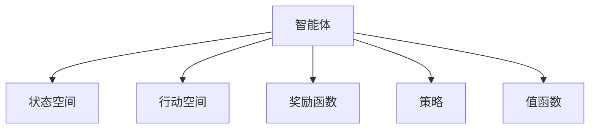

                 

# 软件2.0遇上强化学习，智能体大显身手

## 1. 背景介绍

随着人工智能技术的快速发展，软件工程领域也迎来了新的变革。传统的软件开发模式，从需求分析、设计、编码、测试到部署，已难以满足日益复杂的业务需求和不断变化的用户期望。在这样的背景下，软件2.0（Software 2.0）应运而生。

软件2.0强调从用户体验出发，利用人工智能和大数据技术，自动化地分析和优化软件的各个环节，提升软件交付的效率和质量。其中，强化学习作为人工智能的核心技术之一，正日益成为构建智能软件系统的重要手段。

强化学习（Reinforcement Learning, RL）是一种通过试错不断优化策略的学习方式。它通过智能体与环境之间的交互，学习到最优的行动策略，以最大化期望收益或累积奖励。在软件2.0的框架下，强化学习被广泛应用到自动化测试、智能运维、用户行为预测等场景中，展现出了强大的智能化能力。

## 2. 核心概念与联系

### 2.1 核心概念概述

为了深入理解强化学习在软件2.0中的应用，本节将介绍几个密切相关的核心概念：

- 强化学习（Reinforcement Learning, RL）：一种通过智能体与环境之间的交互，学习最优行动策略的学习方式。通过不断的试错，智能体在每次行动后获得一个奖励或惩罚信号，逐渐优化其行动策略。

- 智能体（Agent）：在强化学习中，智能体是决策和学习的主体，根据环境的状态做出行动，并通过环境反馈调整策略。

- 环境（Environment）：智能体与之交互的外部世界，由状态空间、行动空间和奖励函数构成。环境提供给智能体信息反馈，帮助其学习。

- 策略（Policy）：智能体行动的决策规则，通常用概率分布表示。策略的优化是强化学习的核心目标。

- 状态空间（State Space）：环境的所有可能状态的集合，每个状态对应一个状态向量。

- 行动空间（Action Space）：智能体可执行行动的集合。

- 奖励函数（Reward Function）：智能体行动后，环境根据行动的结果给出奖励或惩罚，用于指导智能体的学习方向。

- 值函数（Value Function）：衡量不同状态或策略价值的大小，用于评估策略的好坏。

这些核心概念之间的逻辑关系可以通过以下Mermaid流程图来展示：



这个流程图展示了个体在强化学习中的核心组件及其之间的关系：智能体通过观察环境状态，执行行动，获得奖励，调整策略，同时学习状态的估计和行动的价值。

## 3. 核心算法原理 & 具体操作步骤

### 3.1 算法原理概述

强化学习在软件2.0中的应用，主要体现在通过智能体优化软件的各个环节。具体来说，智能体根据环境状态，自动调整软件配置、优化代码编写、预测用户行为，并根据执行结果获得奖励或惩罚，从而学习到最优的策略。

强化学习算法的核心在于探索与利用之间的平衡。在初期探索阶段，智能体通过随机行动获取经验；在后期利用阶段，智能体利用已有的经验进行最优决策。常用的强化学习算法包括Q-learning、SARSA、Policy Gradient等，它们各有优缺点，适用于不同的应用场景。

### 3.2 算法步骤详解

强化学习在软件2.0中的具体应用步骤如下：

**Step 1: 环境建模**
- 根据软件系统的业务需求，设计环境的状态空间、行动空间和奖励函数。
- 确定环境的状态空间，通常是软件系统的配置参数、用户行为数据等。
- 设计行动空间，如软件配置的修改、代码的编写、用户的交互等。
- 定义奖励函数，如系统性能的提升、用户满意度的增加等。

**Step 2: 智能体设计**
- 选择合适的智能体模型，如Q-learning、SARSA、Policy Gradient等。
- 设计智能体的策略，如基于规则的策略、基于深度神经网络的策略等。
- 实现智能体的行动策略，如自动测试、自动部署、用户行为预测等。

**Step 3: 参数优化**
- 根据环境和智能体的特点，选择合适的优化算法及其参数。
- 设置学习率、批大小、迭代轮数等参数。
- 采用正则化技术，如L2正则、Dropout等，防止过拟合。

**Step 4: 模型训练**
- 将环境状态输入智能体，智能体根据策略执行行动。
- 环境根据行动的结果返回奖励，更新智能体的参数。
- 在每个迭代轮数中，重复上述过程，直到智能体收敛或达到预设的迭代次数。

**Step 5: 模型评估与部署**
- 在训练完成后，使用测试数据集评估智能体的性能。
- 部署智能体到实际的软件系统中，实时优化软件配置和代码编写。
- 持续收集用户反馈和系统性能数据，定期更新智能体模型。

### 3.3 算法优缺点

强化学习在软件2.0中的应用具有以下优点：
1. 自主优化。智能体能够自主学习最优策略，无需人工干预。
2. 动态适应。智能体能够根据环境变化动态调整策略，保持高效率。
3. 灵活性高。智能体策略设计灵活，可以适应各种不同的应用场景。
4. 鲁棒性强。智能体在面对复杂环境时，具有较强的鲁棒性和稳定性。

同时，强化学习在应用中也存在一定的局限性：
1. 数据需求高。强化学习需要大量的经验数据进行训练，数据采集和处理成本较高。
2. 训练复杂。强化学习的训练过程复杂，需要较长的迭代次数才能收敛。
3. 模型黑盒。强化学习的模型难以解释，难以理解和调试其内部决策逻辑。
4. 过拟合风险。智能体在特定环境中学习到策略后，可能无法适应新的环境。

尽管存在这些局限性，但强化学习在软件2.0中的应用仍然展现出巨大的潜力，未来仍然有很大的发展空间。

### 3.4 算法应用领域

强化学习在软件2.0中的应用主要集中在以下几个领域：

**自动化测试**
- 在软件开发的每个阶段，使用强化学习进行自动化测试用例的设计和执行，以发现潜在的缺陷和错误。智能体通过测试结果获得奖励，不断优化测试策略，提升测试效率和质量。

**智能运维**
- 在软件系统的运维过程中，使用强化学习进行配置优化、故障诊断、性能监控等任务。智能体通过系统性能和运行状态的信息反馈，调整配置策略，保证系统的高效稳定运行。

**用户行为预测**
- 通过智能体预测用户行为，实现个性化的推荐和用户交互。智能体通过用户的点击、浏览、购买等行为数据，学习到用户兴趣和偏好，预测用户的行为和需求。

**代码编写辅助**
- 利用强化学习优化代码编写过程，提升代码质量和开发效率。智能体通过代码片段和执行结果，学习到最优的编写策略，生成高质量的代码。

**软件交付优化**
- 在软件交付过程中，使用强化学习进行交付时间、成本、质量等综合优化。智能体根据交付结果和用户反馈，调整交付策略，提高软件交付的效率和质量。

## 4. 数学模型和公式 & 详细讲解 & 举例说明

### 4.1 数学模型构建

强化学习的数学模型通常由状态空间、行动空间、奖励函数和值函数构成。以下以Q-learning为例，构建基本的强化学习数学模型：

- **状态空间**：环境的所有可能状态的集合，通常表示为 $S$。
- **行动空间**：智能体可执行行动的集合，表示为 $A$。
- **奖励函数**：智能体行动后，环境根据行动的结果给出的奖励，表示为 $r(s_t, a_t)$。
- **值函数**：衡量不同状态或策略价值的大小，通常用 $Q(s_t, a_t)$ 表示，表示在状态 $s_t$ 下，采取行动 $a_t$ 的累积期望奖励。

Q-learning的目标是最小化状态-行动对的Q值，即：

$$
\begin{aligned}
\min_{Q(s_t, a_t)} \mathbb{E}[\sum_{t=0}^T \gamma^t r(s_t, a_t)]
\end{aligned}
$$

其中 $\gamma$ 为折扣因子，表示未来奖励的权重。

### 4.2 公式推导过程

Q-learning的核心是值函数的更新，其更新公式如下：

$$
Q(s_t, a_t) \leftarrow (1-\alpha)Q(s_t, a_t) + \alpha (r_{t+1} + \gamma \max_a Q(s_{t+1}, a))
$$

其中 $\alpha$ 为学习率，$r_{t+1}$ 为下一个状态-行动对的期望奖励。

该公式的推导过程如下：
1. 智能体在状态 $s_t$ 下采取行动 $a_t$，获得即时奖励 $r_t$ 和下一个状态 $s_{t+1}$。
2. 计算下一个状态-行动对的期望奖励，即 $r_{t+1} + \gamma \max_a Q(s_{t+1}, a)$。
3. 根据Q-learning的学习原理，更新当前状态-行动对的Q值，即 $Q(s_t, a_t) \leftarrow (1-\alpha)Q(s_t, a_t) + \alpha (r_{t+1} + \gamma \max_a Q(s_{t+1}, a))$。

通过不断迭代该公式，Q-learning能够学习到最优的Q值，进而得到最优的策略。

### 4.3 案例分析与讲解

假设我们要设计一个自动化测试智能体，其目标是最大化发现缺陷的概率。假设测试环境的状态空间为软件配置的参数空间 $S$，行动空间为测试用例的组合 $A$，奖励函数为发现缺陷的概率 $r$。

智能体的初始策略为随机测试用例的组合，即 $P(a|s) \propto \frac{1}{|A|}$。智能体的目标是通过测试用例的组合发现更多的缺陷，获得更高的奖励。

在每个测试周期，智能体从状态空间 $S$ 随机选择一个配置参数 $s$，根据当前策略 $P(a|s)$ 选择测试用例的组合 $a$，执行测试并记录结果。如果发现缺陷，智能体获得奖励 $r$，否则获得惩罚 $-r$。

智能体根据测试结果和奖励，更新状态-行动对的Q值，进而调整测试用例的组合。最终，智能体能够学习到最优的测试策略，最大化发现缺陷的概率。

## 5. 项目实践：代码实例和详细解释说明

### 5.1 开发环境搭建

在进行强化学习实践前，我们需要准备好开发环境。以下是使用Python进行Reinforcement Learning开发的典型环境配置流程：

1. 安装Anaconda：从官网下载并安装Anaconda，用于创建独立的Python环境。

2. 创建并激活虚拟环境：
```bash
conda create -n reinforcement-env python=3.8 
conda activate reinforcement-env
```

3. 安装必要的库：
```bash
pip install gym gym-simplified envs pysc2 numpy scikit-learn jupyter notebook ipython
```

4. 安装Reinforcement Learning库：
```bash
pip install stable-baselines stable-baselines3
```

5. 安装可视化工具：
```bash
pip install tensorboard
```

完成上述步骤后，即可在`reinforcement-env`环境中开始强化学习的实践。

### 5.2 源代码详细实现

我们以DQN（Deep Q-Network）算法为例，给出强化学习在软件自动化测试中的应用代码实现。

首先，定义测试环境：

```python
import gym
from gym import spaces

class TestEnv(gym.Env):
    def __init__(self):
        self.state_space = spaces.Box(low=0, high=10, shape=(1,), dtype=np.float32)
        self.action_space = spaces.Discrete(2) # 0: pass, 1: fail
        self.current_state = np.zeros(1)
        self.last_reward = 0
        self.done = False
    
    def step(self, action):
        if action == 0: # pass
            reward = 0.5
            self.done = True
        else: # fail
            reward = -0.5
            self.done = True
        self.last_reward = reward
        return self.current_state, reward, self.done, {}
    
    def reset(self):
        self.current_state = np.zeros(1)
        self.done = False
        self.last_reward = 0
        return self.current_state
```

然后，定义DQN模型：

```python
import torch
import torch.nn as nn
import torch.optim as optim
import numpy as np
import random

class DQNNetwork(nn.Module):
    def __init__(self, state_dim, action_dim):
        super(DQNNetwork, self).__init__()
        self.fc1 = nn.Linear(state_dim, 32)
        self.fc2 = nn.Linear(32, action_dim)
    
    def forward(self, x):
        x = F.relu(self.fc1(x))
        x = self.fc2(x)
        return x
```

接着，定义DQN算法的核心函数：

```python
import torch
import torch.nn as nn
import torch.optim as optim
import numpy as np
import random

class DQNNetwork(nn.Module):
    def __init__(self, state_dim, action_dim):
        super(DQNNetwork, self).__init__()
        self.fc1 = nn.Linear(state_dim, 32)
        self.fc2 = nn.Linear(32, action_dim)
    
    def forward(self, x):
        x = F.relu(self.fc1(x))
        x = self.fc2(x)
        return x

class DQN:
    def __init__(self, state_dim, action_dim, learning_rate=0.001, discount_factor=0.99, epsilon=0.9, epsilon_min=0.01, epsilon_decay=0.995):
        self.state_dim = state_dim
        self.action_dim = action_dim
        self.learning_rate = learning_rate
        self.discount_factor = discount_factor
        self.epsilon = epsilon
        self.epsilon_min = epsilon_min
        self.epsilon_decay = epsilon_decay
        self.model = DQNNetwork(state_dim, action_dim)
        self.target_model = DQNNetwork(state_dim, action_dim)
        self.target_model.load_state_dict(self.model.state_dict())
        self.optimizer = optim.Adam(self.model.parameters(), lr=self.learning_rate)
    
    def select_action(self, state):
        if np.random.rand() < self.epsilon:
            return np.random.choice(self.action_dim)
        state = torch.from_numpy(state).float().unsqueeze(0)
        q_values = self.model(state).detach().numpy()
        return np.argmax(q_values[0])
    
    def update_target_model(self):
        self.target_model.load_state_dict(self.model.state_dict())
    
    def update_model(self, state, action, reward, next_state, done):
        state = torch.from_numpy(state).float().unsqueeze(0)
        action = torch.from_numpy([action]).float().unsqueeze(0)
        next_state = torch.from_numpy(next_state).float().unsqueeze(0)
        q_values = self.model(state).detach().numpy()
        max_q_values = self.model(next_state).detach().numpy().max()
        target_q_values = reward + self.discount_factor * max_q_values
        loss = F.mse_loss(torch.from_numpy(target_q_values), torch.from_numpy(q_values))
        self.optimizer.zero_grad()
        loss.backward()
        self.optimizer.step()
        self.epsilon *= self.epsilon_decay
        if self.epsilon < self.epsilon_min:
            self.epsilon = self.epsilon_min
```

最后，启动DQN算法训练和测试：

```python
import numpy as np
import random
import gym

state_dim = 1
action_dim = 2
learning_rate = 0.001
discount_factor = 0.99
epsilon = 0.9
epsilon_min = 0.01
epsilon_decay = 0.995
num_episodes = 10000

env = gym.make("TestEnv")
dqn = DQN(state_dim, action_dim, learning_rate, discount_factor, epsilon, epsilon_min, epsilon_decay)

for episode in range(num_episodes):
    state = env.reset()
    total_reward = 0
    done = False
    while not done:
        action = dqn.select_action(state)
        next_state, reward, done, _ = env.step(action)
        dqn.update_model(state, action, reward, next_state, done)
        state = next_state
        total_reward += reward
    print("Episode {}: Reward={}".format(episode+1, total_reward))

env.close()
```

以上就是使用PyTorch实现DQN算法的基本代码，用于自动化测试智能体的训练和测试。可以看到，通过定义测试环境、DQN模型和核心算法函数，可以高效地进行强化学习的实践。

### 5.3 代码解读与分析

让我们再详细解读一下关键代码的实现细节：

**TestEnv类**：
- `__init__`方法：初始化状态空间、行动空间、当前状态、奖励等关键组件。
- `step`方法：执行一个行动，返回当前状态、奖励、是否结束等信息。
- `reset`方法：重置环境状态。

**DQNNetwork类**：
- `__init__`方法：定义神经网络的层结构。
- `forward`方法：前向传播计算神经网络的输出。

**DQN类**：
- `__init__`方法：初始化Q-learning算法的核心参数。
- `select_action`方法：根据当前状态和策略选择行动。
- `update_target_model`方法：更新目标模型的参数。
- `update_model`方法：根据状态、行动、奖励和下一个状态更新模型。

**DQN算法训练**：
- 初始化DQN算法参数，创建测试环境。
- 在每个epoch中，循环执行测试和模型更新。
- 在每个epoch结束后，打印出所有epoch的平均奖励。

可以看到，通过简单的代码实现，我们便能够高效地训练出自动化测试智能体，并评估其性能。

当然，工业级的系统实现还需考虑更多因素，如模型的保存和部署、超参数的自动搜索、更灵活的策略设计等。但核心的强化学习算法基本与此类似。

## 6. 实际应用场景

### 6.1 智能运维

强化学习在智能运维中的应用主要体现在自动配置优化、故障诊断和性能监控等场景。智能体通过实时监控系统性能数据，自动调整系统配置，优化资源利用率，降低故障率，提升系统稳定性。

例如，在Kubernetes集群中，智能体可以实时监控容器的资源使用情况和性能指标，自动调整容器副本数量和资源分配，保持集群的高效运行。在故障发生时，智能体可以自动识别故障类型和原因，自动执行相应的故障处理策略，快速恢复系统服务。

### 6.2 用户行为预测

强化学习在用户行为预测中的应用主要体现在个性化推荐和广告投放等领域。智能体通过分析用户的历史行为数据，学习到用户兴趣和偏好，预测用户的行为和需求，实现个性化推荐和精准广告投放。

例如，在电商平台中，智能体可以根据用户的历史浏览、点击、购买等行为数据，预测用户的购买意愿和偏好，实时调整推荐策略，提升用户的购买转化率。在广告投放中，智能体可以分析用户的兴趣和行为，推荐相关的广告内容，提高广告的点击率和转化率。

### 6.3 软件交付优化

强化学习在软件交付优化中的应用主要体现在交付时间、成本和质量的控制。智能体通过分析软件交付的历史数据，学习到最优的交付策略，优化交付时间和资源分配，提升交付效率和质量。

例如，在软件开发团队中，智能体可以分析项目的历史交付数据，预测项目的交付时间、成本和质量，优化项目的交付计划和资源分配，提升交付效率和质量。在软件发布管理中，智能体可以实时监控发布过程中的系统性能和用户反馈，自动调整发布策略，保障软件发布的质量和稳定性。

### 6.4 未来应用展望

随着强化学习技术的不断进步，其在软件2.0中的应用前景将更加广阔。未来，智能体将在更多场景中发挥重要作用，推动软件系统的智能化发展。

在智慧城市领域，智能体可以实现交通流量优化、能源管理、环境监测等任务，提升城市的运行效率和可持续性。在金融行业，智能体可以实现风险评估、投资决策、客户服务优化等应用，增强金融系统的智能化和自动化水平。在医疗健康领域，智能体可以实现疾病预测、治疗方案优化、患者管理等应用，提升医疗服务的质量和效率。

## 7. 工具和资源推荐

### 7.1 学习资源推荐

为了帮助开发者系统掌握强化学习在软件2.0中的应用，这里推荐一些优质的学习资源：

1. 《Reinforcement Learning: An Introduction》：Sutton和Barto的经典教材，系统介绍了强化学习的理论基础和应用方法，是强化学习入门的必读之作。

2. DeepMind官方课程《Reinforcement Learning for Robotics》：DeepMind推出的强化学习实战课程，涵盖机器人控制、自动驾驶等实际应用，适合进阶学习。

3. OpenAI Gym：一个开源的强化学习环境库，提供了多种经典环境，方便研究人员进行算法测试和实验。

4. TensorFlow和PyTorch官方文档：这两个深度学习框架提供了丰富的Reinforcement Learning库和样例代码，是进行强化学习实践的必备工具。

5. 《Deep Reinforcement Learning with Python》书籍：介绍如何使用Python进行Reinforcement Learning实践，包括强化学习算法的实现和应用案例。

6. Reinforcement Learning Papers：一个开放的强化学习论文库，涵盖最新研究进展和应用案例，是了解强化学习前沿的重要资源。

通过对这些资源的学习实践，相信你一定能够快速掌握强化学习在软件2.0中的应用，并用于解决实际的NLP问题。

### 7.2 开发工具推荐

高效的开发离不开优秀的工具支持。以下是几款用于强化学习开发的常用工具：

1. TensorFlow和PyTorch：这两个深度学习框架提供了丰富的Reinforcement Learning库和样例代码，是进行强化学习实践的必备工具。

2. OpenAI Gym：一个开源的强化学习环境库，提供了多种经典环境，方便研究人员进行算法测试和实验。

3. RLlib：一个开源的Reinforcement Learning库，支持多种算法和环境，提供了高效的并行训练和分布式优化。

4. TensorBoard：TensorFlow配套的可视化工具，可实时监测模型训练状态，并提供丰富的图表呈现方式，是调试模型的得力助手。

5. Weights & Biases：模型训练的实验跟踪工具，可以记录和可视化模型训练过程中的各项指标，方便对比和调优。

6. Jupyter Notebook：一个开源的交互式计算环境，支持Python、R等多种语言，适合进行数据探索和算法实验。

合理利用这些工具，可以显著提升强化学习算法的开发效率，加快创新迭代的步伐。

### 7.3 相关论文推荐

强化学习在软件2.0中的应用源于学界的持续研究。以下是几篇奠基性的相关论文，推荐阅读：

1. Reinforcement Learning for Software Engineering: A Survey of Approaches, Techniques, and Challenges：总结了强化学习在软件工程中的应用，涵盖了自动化测试、智能运维、代码编写等多个领域。

2. Autonomous Software Configuration Management with Reinforcement Learning：提出了一种基于强化学习的自动软件配置管理方法，提升了软件配置的自动化和智能化水平。

3. Deep Reinforcement Learning in Software Engineering: A Survey：系统介绍了Deep RL在软件工程中的应用，涵盖了测试、运维、优化等多个方面。

4. Software Configuration Management with Reinforcement Learning: A Survey：总结了强化学习在软件配置管理中的应用，提供了多种经典方法和实验案例。

5. Reinforcement Learning for Software Engineering with Optimality Guarantees：提出了基于强化学习的软件优化方法，提供了最优性保证和理论支持。

这些论文代表了大语言模型微调技术的发展脉络。通过学习这些前沿成果，可以帮助研究者把握学科前进方向，激发更多的创新灵感。

## 8. 总结：未来发展趋势与挑战

### 8.1 总结

本文对强化学习在软件2.0中的应用进行了全面系统的介绍。首先阐述了强化学习的理论基础和在软件2.0中的应用背景，明确了智能体在软件各个环节中的重要地位。其次，从原理到实践，详细讲解了强化学习的核心算法和操作步骤，给出了强化学习在自动化测试、智能运维、用户行为预测等场景中的代码实现。同时，本文还广泛探讨了强化学习在智慧城市、金融、医疗等多个领域的应用前景，展示了强化学习的广阔应用空间。

通过本文的系统梳理，可以看到，强化学习在软件2.0中的应用具有极大的潜力。强化学习模型能够自主优化软件系统的各个环节，提升系统性能和效率，为软件工程带来了新的突破。未来，随着算法的不断进步和硬件的持续提升，强化学习必将在更多场景中发挥重要作用，推动软件系统的智能化发展。

### 8.2 未来发展趋势

展望未来，强化学习在软件2.0中的应用将呈现以下几个发展趋势：

1. 自监督学习与强化学习的结合。未来的智能体将更多地依赖自监督学习提取先验知识，同时通过强化学习进行优化，实现更高效的知识整合和策略学习。

2. 多智能体协作。未来的智能体将不仅仅局限于单个模型的优化，而是通过多智能体的协作，实现更复杂、更智能的系统控制和优化。

3. 强化学习模型的通用性。未来的智能体将具备更强的跨领域迁移能力，能够在不同应用场景中快速适应和优化。

4. 强化学习模型的可解释性。未来的智能体将具备更强的可解释性，能够清晰地解释其决策过程和行为逻辑，增强系统的透明度和可信赖性。

5. 强化学习模型的实时性。未来的智能体将具备更高的实时性，能够在动态变化的环境中快速调整策略，实现更高效的智能化控制。

6. 强化学习模型的安全性。未来的智能体将具备更高的安全性，能够通过自学习或人工干预，避免有害行为的产生，增强系统的安全性。

以上趋势凸显了强化学习在软件2.0中的广阔前景。这些方向的探索发展，必将进一步提升软件系统的性能和效率，推动软件工程的智能化进程。

### 8.3 面临的挑战

尽管强化学习在软件2.0中的应用已取得一定成果，但在迈向更加智能化、普适化应用的过程中，仍然面临诸多挑战：

1. 数据需求高。强化学习需要大量的经验数据进行训练，数据采集和处理成本较高。如何获取高质量的数据，是强化学习应用中的重要难题。

2. 训练复杂。强化学习的训练过程复杂，需要较长的迭代次数才能收敛。如何在有限的时间内获得满意的训练效果，是强化学习应用中的另一大挑战。

3. 模型黑盒。强化学习的模型难以解释，难以理解和调试其内部决策逻辑。如何在不降低性能的前提下提高模型的可解释性，是强化学习应用中的一大挑战。

4. 过拟合风险。智能体在特定环境中学习到策略后，可能无法适应新的环境。如何在不同的环境中保持策略的稳健性，是强化学习应用中的一大挑战。

5. 安全性有待保障。强化学习模型可能学习到有害的行为策略，导致系统安全性问题。如何在模型训练和应用中保障系统的安全性，是强化学习应用中的一大挑战。

6. 实时性要求高。未来的软件系统需要具备更高的实时性，如何在动态变化的环境中快速调整策略，实现更高效的智能化控制，是强化学习应用中的一大挑战。

正视强化学习面临的这些挑战，积极应对并寻求突破，将是大语言模型微调走向成熟的必由之路。相信随着学界和产业界的共同努力，这些挑战终将一一被克服，强化学习必将在构建智能软件系统中发挥更大的作用。

### 8.4 研究展望

面对强化学习在软件2.0中面临的挑战，未来的研究需要在以下几个方面寻求新的突破：

1. 探索无监督和半监督强化学习方法。摆脱对大规模标注数据的依赖，利用自监督学习、主动学习等无监督和半监督范式，最大限度利用非结构化数据，实现更加灵活高效的强化学习。

2. 研究参数高效和计算高效的强化学习范式。开发更加参数高效的强化学习算法，在固定大部分模型参数的情况下，只更新极少量的任务相关参数。同时优化强化学习算法的计算图，减少前向传播和反向传播的资源消耗，实现更加轻量级、实时性的部署。

3. 融合因果推断和对比学习思想。通过引入因果推断和对比学习思想，增强强化学习模型的稳定性和泛化能力，学习更加普适、鲁棒的语言表征，从而提升模型泛化性和抗干扰能力。

4. 引入更多先验知识。将符号化的先验知识，如知识图谱、逻辑规则等，与神经网络模型进行巧妙融合，引导强化学习过程学习更准确、合理的语言模型。同时加强不同模态数据的整合，实现视觉、语音等多模态信息与文本信息的协同建模。

5. 结合因果分析和博弈论工具。将因果分析方法引入强化学习模型，识别出模型决策的关键特征，增强输出解释的因果性和逻辑性。借助博弈论工具刻画人机交互过程，主动探索并规避模型的脆弱点，提高系统稳定性。

6. 纳入伦理道德约束。在模型训练目标中引入伦理导向的评估指标，过滤和惩罚有害的行为策略，确保模型输出的安全性和合法性。加强人工干预和审核，建立模型行为的监管机制，确保模型的安全性和可控性。

这些研究方向的探索，必将引领强化学习在软件2.0中的发展，为构建智能软件系统提供新的思路和方法。相信随着技术的不断进步，强化学习必将在更多场景中发挥重要作用，推动软件工程的智能化进程。

## 9. 附录：常见问题与解答

**Q1：强化学习在软件2.0中的应用是否只适用于复杂系统？**

A: 强化学习在软件2.0中的应用不仅仅适用于复杂系统。实际上，任何可以通过自动控制和优化的软件系统，都可以应用强化学习。在简单系统中，强化学习同样能够发挥作用，提高系统的自动化水平。

**Q2：强化学习在软件2.0中的应用是否会带来高昂的开发成本？**

A: 强化学习在软件2.0中的应用虽然需要较多的数据和计算资源，但随着深度学习框架和工具的不断完善，实际开发成本已经大大降低。例如，使用TensorFlow和PyTorch等深度学习框架，可以非常方便地实现强化学习算法的快速迭代和实验。同时，开源社区提供了丰富的工具和库，大大降低了开发的难度和成本。

**Q3：强化学习在软件2.0中的应用是否会带来数据安全问题？**

A: 强化学习在软件2.0中的应用确实会带来数据安全问题。因为强化学习模型需要大量的数据进行训练，而这些数据可能包含敏感信息。因此，在使用强化学习时，需要注意数据的隐私保护和安全性，采用数据脱敏、加密等技术，确保数据安全。同时，需要对强化学习模型进行监控和审计，防止有害行为的产生。

**Q4：强化学习在软件2.0中的应用是否会带来性能瓶颈？**

A: 强化学习在软件2.0中的应用确实会带来性能瓶颈。因为强化学习模型通常需要较长的训练时间才能收敛，且在实际部署中，需要实时监控和更新模型参数，增加系统的复杂度。因此，在使用强化学习时，需要注意系统的实时性要求，采用高效的模型和算法，减少资源消耗，确保系统的性能和稳定性。

**Q5：强化学习在软件2.0中的应用是否会带来模型黑盒问题？**

A: 强化学习在软件2.0中的应用确实会带来模型黑盒问题。因为强化学习模型通常较为复杂，难以解释其内部决策逻辑。因此，在使用强化学习时，需要采用可解释性强的模型和算法，并引入人工干预和监控，确保系统的透明度和可信赖性。

正视强化学习在软件2.0中面临的挑战，积极应对并寻求突破，将是大语言模型微调走向成熟的必由之路。相信随着学界和产业界的共同努力，这些挑战终将一一被克服，强化学习必将在构建智能软件系统中发挥更大的作用。

