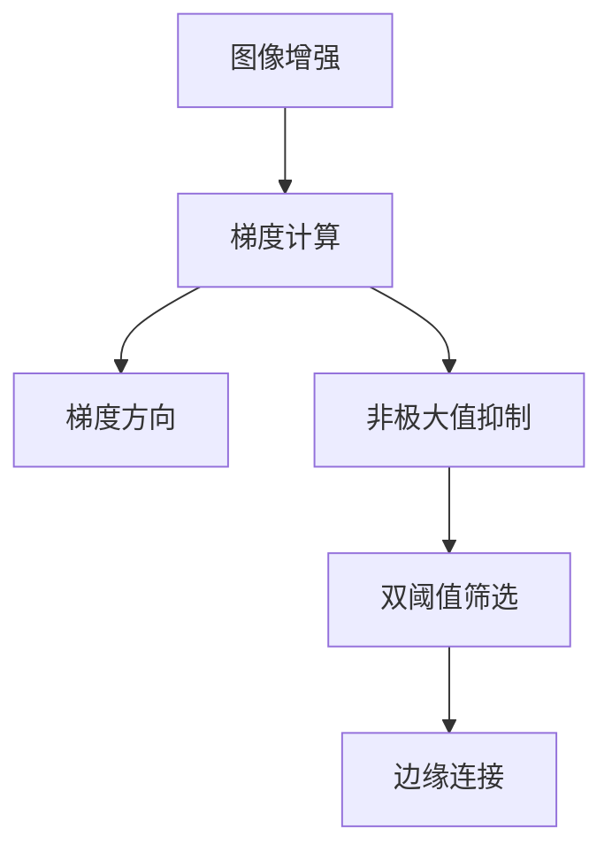

                 

# 边缘检测原理与代码实例讲解

## 1. 背景介绍

### 1.1 问题由来
边缘检测是计算机视觉和图像处理领域的一项重要技术，广泛用于图像分割、特征提取、目标识别等多个方向。边缘是图像中亮度和颜色等像素特征发生急剧变化的区域，边缘检测旨在自动识别和定位这些区域，提取图像的基本结构信息。

边缘检测技术在智能监控、工业检测、医学影像分析等众多领域都有重要应用。例如，智能监控系统可以通过边缘检测提取运动目标轮廓，实现人员入侵检测、异常行为识别等功能。在工业检测中，边缘检测可以用于检测产品表面缺陷，确保产品质量。在医学影像中，边缘检测可以帮助识别病变区域，辅助医生诊断。

### 1.2 问题核心关键点
边缘检测技术的关键在于如何将图像中急剧变化的像素点准确地识别出来。传统的边缘检测方法通常包括Sobel、Canny、Laplacian等算法。这些方法基于不同的数学模型和图像处理技术，各自有其优缺点，适用于不同的应用场景。

本文将重点介绍Canny边缘检测算法，并结合代码实例，讲解其原理和实现步骤。

## 2. 核心概念与联系

### 2.1 核心概念概述

为更好地理解Canny边缘检测算法，本节将介绍几个密切相关的核心概念：

- 图像增强：在边缘检测前，通常需要对图像进行增强处理，如去噪、灰度化等，以减少噪声干扰，提高边缘的清晰度。
- 梯度方向：在图像中，边缘的方向通常表现为像素值的梯度方向，即斜率变化的方向。梯度方向可以用于筛选出可能的边缘点。
- 非极大值抑制：对于梯度幅值较大的边缘点，可能需要进一步抑制非极大值点，只保留局部极值点。
- 双阈值筛选：根据梯度幅值将像素点分为强边缘、弱边缘和非边缘三类，进行进一步的筛选。

这些概念之间的逻辑关系可以通过以下Mermaid流程图来展示：



这个流程图展示了几步关键步骤及其之间的联系：

1. 图像增强。对输入图像进行预处理，去除噪声和干扰，提高后续处理的准确性。
2. 梯度计算。基于图像增强后的像素值，计算每个像素点的梯度幅值和方向。
3. 梯度方向。利用梯度方向筛选出可能的边缘点，供进一步处理。
4. 非极大值抑制。对梯度幅值较大的边缘点进行抑制，只保留局部极值点。
5. 双阈值筛选。根据梯度幅值将像素点分为强边缘、弱边缘和非边缘，进行筛选。
6. 边缘连接。连接相邻的强边缘点，形成连续的边缘。

这些概念共同构成了Canny边缘检测的核心框架，使其能够高效准确地识别图像中的边缘。

## 3. 核心算法原理 & 具体操作步骤
### 3.1 算法原理概述

Canny边缘检测算法基于梯度幅值和方向的信息，通过一系列图像处理技术，实现对边缘的精确检测。其核心步骤包括：

1. 图像增强：使用高斯滤波器对图像进行平滑处理，减少噪声干扰。
2. 梯度计算：计算每个像素点的梯度幅值和方向。
3. 梯度方向：利用梯度方向筛选可能的边缘点。
4. 非极大值抑制：对梯度幅值较大的边缘点进行抑制，只保留局部极值点。
5. 双阈值筛选：根据梯度幅值将像素点分为强边缘、弱边缘和非边缘，进行筛选。
6. 边缘连接：连接相邻的强边缘点，形成连续的边缘。

通过这些步骤，Canny算法能够在图像中准确识别出主要的边缘特征，具有较高的准确性和效率。

### 3.2 算法步骤详解

以下是Canny边缘检测算法的详细步骤和详细说明：

#### 3.2.1 图像增强

图像增强是Canny算法的首要步骤。图像增强通常包括去噪、灰度化等预处理步骤，以减少噪声干扰，提高后续处理的准确性。

使用高斯滤波器对图像进行平滑处理。高斯滤波器是一种线性平滑滤波器，可以有效地减少图像中的高频噪声。具体实现步骤如下：

1. 将图像每个像素点的邻域进行加权平均，得到新的像素值。
2. 邻域大小通常为3x3、5x5等，权重函数为高斯分布。
3. 具体实现时，使用二维卷积操作计算邻域加权平均值。

实现代码如下：

```python
import cv2
import numpy as np

def gaussian_filter(image, kernel_size=3):
    # 创建高斯核
    kernel = np.zeros((kernel_size, kernel_size))
    kernel[kernel_size // 2, kernel_size // 2] = 1.0 / np.sum(np.exp(-np.square(np.arange(kernel_size) - kernel_size // 2) / (2 * (kernel_size // 2) ** 2)))

    # 进行二维卷积，计算加权平均值
    image = cv2.filter2D(image, -1, kernel)

    return image
```

#### 3.2.2 梯度计算

梯度计算是Canny算法的核心步骤之一。梯度计算通常包括Sobel算子或Canny算子的使用，用于计算每个像素点的梯度幅值和方向。

使用Sobel算子计算梯度幅值和方向。Sobel算子是一种常见的边缘检测算子，可以计算图像中每个像素点的梯度幅值和方向。具体实现步骤如下：

1. 对图像进行卷积操作，计算每个像素点的梯度幅值。
2. 使用算子的梯度方向，计算梯度方向。
3. 将梯度幅值和方向作为后续处理的输入。

实现代码如下：

```python
def sobel_filter(image, ddepth=cv2.CV_32F):
    # 计算梯度幅值和方向
    gradient_x = cv2.Sobel(image, ddepth, 1, 0, ksize=3)
    gradient_y = cv2.Sobel(image, ddepth, 0, 1, ksize=3)

    # 计算梯度幅值
    gradient_mag = np.sqrt(np.square(gradient_x) + np.square(gradient_y))

    # 计算梯度方向
    gradient_dir = np.arctan2(gradient_y, gradient_x)

    return gradient_mag, gradient_dir
```

#### 3.2.3 梯度方向

利用梯度方向筛选可能的边缘点。梯度方向是图像中像素值变化的方向，即斜率变化的方向。在梯度幅值较大的像素点中，通常只有沿着梯度方向的像素点可能为边缘点。

实现代码如下：

```python
def gradient_direction(gradient_mag, gradient_dir):
    # 计算梯度方向的水平和垂直分量
    gradient_h = np.cos(gradient_dir)
    gradient_v = np.sin(gradient_dir)

    # 筛选梯度方向为水平和垂直的像素点
    gradient_dir_h = np.arctan2(gradient_v, gradient_h)
    gradient_dir_v = gradient_dir_h + np.pi / 2

    # 筛选可能的边缘点
    gradient_dir_h = gradient_dir_h % np.pi
    gradient_dir_v = gradient_dir_v % np.pi
    gradient_dir_h[gradient_dir_h < 0] += np.pi
    gradient_dir_v[gradient_dir_v < 0] += np.pi

    # 将梯度方向限制在0到pi之间
    gradient_dir_h = gradient_dir_h % np.pi
    gradient_dir_v = gradient_dir_v % np.pi

    # 筛选梯度幅值较大的像素点
    threshold = np.sqrt(np.mean(gradient_mag))

    return gradient_mag, gradient_dir_h, gradient_dir_v, threshold
```

#### 3.2.4 非极大值抑制

对梯度幅值较大的边缘点进行抑制，只保留局部极值点。非极大值抑制是Canny算法的重要步骤，可以进一步减少噪声，提高边缘检测的准确性。

实现代码如下：

```python
def non_max_suppression(gradient_mag, gradient_dir_h, gradient_dir_v):
    # 初始化边缘点
    edges = np.zeros_like(gradient_mag, dtype=np.uint8)

    # 筛选出梯度幅值较大的像素点
    edges[gradient_mag > threshold] = 255

    # 遍历所有边缘点，抑制非极大值点
    for i in range(1, len(gradient_mag) - 1):
        for j in range(1, len(gradient_mag[0]) - 1):
            if edges[i, j] == 255:
                angle_h = gradient_dir_h[i, j]
                angle_v = gradient_dir_v[i, j]

                # 筛选出水平和垂直方向上梯度幅值较大的像素点
                if gradient_mag[i, j] > threshold:
                    if (angle_h > np.pi / 2 and angle_h < np.pi) and (gradient_mag[i - 1, j] < gradient_mag[i + 1, j]) and (gradient_mag[i, j - 1] < gradient_mag[i, j + 1]):
                        edges[i, j] = 255
                    elif (angle_h > 0 and angle_h < np.pi / 2) and (gradient_mag[i - 1, j] > gradient_mag[i + 1, j]) and (gradient_mag[i, j - 1] > gradient_mag[i, j + 1]):
                        edges[i, j] = 255
                    elif (angle_h < 0 and angle_h > -np.pi / 2) and (gradient_mag[i - 1, j] > gradient_mag[i + 1, j]) and (gradient_mag[i, j - 1] > gradient_mag[i, j + 1]):
                        edges[i, j] = 255
                    elif (angle_h < 0 and angle_h < -np.pi / 2) and (gradient_mag[i - 1, j] < gradient_mag[i + 1, j]) and (gradient_mag[i, j - 1] < gradient_mag[i, j + 1]):
                        edges[i, j] = 255

                if (angle_v > np.pi / 2 and angle_v < np.pi) and (gradient_mag[i, j - 1] < gradient_mag[i, j + 1]) and (gradient_mag[i - 1, j] < gradient_mag[i + 1, j]):
                    edges[i, j] = 255
                elif (angle_v > 0 and angle_v < np.pi / 2) and (gradient_mag[i, j - 1] > gradient_mag[i, j + 1]) and (gradient_mag[i - 1, j] > gradient_mag[i + 1, j]):
                    edges[i, j] = 255
                elif (angle_v < 0 and angle_v > -np.pi / 2) and (gradient_mag[i, j - 1] > gradient_mag[i, j + 1]) and (gradient_mag[i - 1, j] > gradient_mag[i + 1, j]):
                    edges[i, j] = 255
                elif (angle_v < 0 and angle_v < -np.pi / 2) and (gradient_mag[i, j - 1] < gradient_mag[i, j + 1]) and (gradient_mag[i - 1, j] < gradient_mag[i + 1, j]):
                    edges[i, j] = 255

    return edges
```

#### 3.2.5 双阈值筛选

根据梯度幅值将像素点分为强边缘、弱边缘和非边缘，进行筛选。

实现代码如下：

```python
def double_thresholding(edges, threshold1, threshold2):
    # 初始化强边缘、弱边缘和非边缘
    strong_edges = np.zeros_like(edges, dtype=np.uint8)
    weak_edges = np.zeros_like(edges, dtype=np.uint8)
    non_edges = np.zeros_like(edges, dtype=np.uint8)

    # 筛选出强边缘像素点
    strong_edges[edges >= threshold2] = 255

    # 筛选出弱边缘像素点
    weak_edges[(edges >= threshold1) & (edges < threshold2)] = 255

    # 筛选出非边缘像素点
    non_edges[(edges < threshold1)] = 255

    return strong_edges, weak_edges, non_edges
```

#### 3.2.6 边缘连接

连接相邻的强边缘点，形成连续的边缘。

实现代码如下：

```python
def edge_connection(edges):
    # 初始化标记像素点是否为边缘
    marked = np.zeros_like(edges, dtype=np.uint8)

    # 标记所有强边缘像素点
    marked[edges == 255] = 1

    # 连接相邻的强边缘点
    for i in range(1, len(edges) - 1):
        for j in range(1, len(edges[0]) - 1):
            if marked[i, j] == 1:
                if marked[i - 1, j] == 1:
                    edges[i, j] = 255
                if marked[i + 1, j] == 1:
                    edges[i, j] = 255
                if marked[i, j - 1] == 1:
                    edges[i, j] = 255
                if marked[i, j + 1] == 1:
                    edges[i, j] = 255

    return edges
```

### 3.3 算法优缺点

Canny边缘检测算法具有以下优点：

1. 准确性高：Canny算法基于梯度幅值和方向的信息，能够准确识别图像中的主要边缘特征。
2. 抗噪声能力强：在图像增强和梯度计算过程中，Canny算法能够有效去除噪声干扰，提高边缘检测的准确性。
3. 适应性强：Canny算法适用于多种图像类型，具有良好的通用性和适应性。

同时，Canny算法也存在以下缺点：

1. 计算量大：Canny算法涉及多个步骤和计算过程，计算量较大，对于大规模图像可能需要较长的处理时间。
2. 参数设置复杂：Canny算法需要设置多个参数，如高斯核大小、梯度幅值阈值等，参数设置不当可能导致边缘检测效果不佳。

### 3.4 算法应用领域

Canny边缘检测算法广泛应用于计算机视觉和图像处理领域，例如：

- 图像分割：用于将图像划分为多个区域，分割结果可用于目标检测、图像识别等任务。
- 特征提取：用于提取图像中的边缘特征，用于图像分类、目标跟踪等任务。
- 目标识别：用于识别图像中的目标物体，如行人、车辆等。
- 图像增强：用于增强图像的视觉效果，提高后续处理的准确性。
- 三维重建：用于从二维图像中恢复三维信息，如地形地貌分析、人体姿态估计等。

除了这些应用场景外，Canny算法还被广泛应用于医学影像分析、工业检测、自动驾驶等众多领域，成为图像处理的重要工具。

## 4. 数学模型和公式 & 详细讲解  
### 4.1 数学模型构建

Canny算法是基于梯度幅值和方向的信息进行边缘检测的，其数学模型可以简单表示为：

1. 图像增强：$g_i = G(I_i)$
2. 梯度计算：$G_x = Sobel_x(I_i), G_y = Sobel_y(I_i)$
3. 梯度方向：$\theta = \arctan\left(\frac{G_y}{G_x}\right)$
4. 非极大值抑制：$E_i = \max(G_x, G_y)$
5. 双阈值筛选：$T_1, T_2$，$S_i = \begin{cases} 255, & E_i \geq T_2 \\ 0, & E_i < T_1 \end{cases}$
6. 边缘连接：$C_i = S_i$

其中，$I_i$表示图像中的像素点，$G_x, G_y$表示Sobel算子对$I_i$的卷积结果，$Sobel_x, Sobel_y$表示Sobel算子的实现函数，$T_1, T_2$表示双阈值筛选的阈值，$E_i$表示像素点的梯度幅值，$\theta$表示像素点的梯度方向。

### 4.2 公式推导过程

以下是Canny算法各个步骤的公式推导过程：

#### 4.2.1 图像增强

图像增强可以使用高斯滤波器实现，其公式为：

$$
g_i = G(I_i) = \sum_{j=-k}^{k}\sum_{l=-k}^{k}I_{i+j,l}w_{j,l}
$$

其中，$k$表示高斯核的大小，$w_{j,l}$表示高斯核的权重。高斯核的权重为高斯分布的密度函数，具体公式为：

$$
w_{j,l} = \frac{1}{2\pi\sigma^2}e^{-\frac{j^2+l^2}{2\sigma^2}}
$$

其中，$\sigma$表示高斯核的标准差。

#### 4.2.2 梯度计算

梯度计算可以使用Sobel算子实现，其公式为：

$$
G_x = Sobel_x(I_i) = \sum_{j=-k}^{k}\sum_{l=-k}^{k}\left(I_{i+j,l} - I_{i-j,l}\right)\left(I_{i,l+j} - I_{i,l-j}\right)
$$

$$
G_y = Sobel_y(I_i) = \sum_{j=-k}^{k}\sum_{l=-k}^{k}\left(I_{i+j,l} - I_{i-j,l}\right)\left(I_{i,j+l} - I_{i,j-l}\right)
$$

其中，$I_{i,j}$表示图像中像素点$(i,j)$的值。

#### 4.2.3 梯度方向

梯度方向的公式为：

$$
\theta = \arctan\left(\frac{G_y}{G_x}\right)
$$

#### 4.2.4 非极大值抑制

非极大值抑制可以使用以下公式实现：

$$
E_i = \max(G_x, G_y)
$$

#### 4.2.5 双阈值筛选

双阈值筛选的公式为：

$$
T_1, T_2
$$

$$
S_i = \begin{cases} 255, & E_i \geq T_2 \\ 0, & E_i < T_1 \end{cases}
$$

#### 4.2.6 边缘连接

边缘连接的公式为：

$$
C_i = S_i
$$

## 5. 项目实践：代码实例和详细解释说明
### 5.1 开发环境搭建

在进行Canny边缘检测的实践前，我们需要准备好开发环境。以下是使用Python进行OpenCV开发的环境配置流程：

1. 安装Anaconda：从官网下载并安装Anaconda，用于创建独立的Python环境。

2. 创建并激活虚拟环境：
```bash
conda create -n opencv-env python=3.8 
conda activate opencv-env
```

3. 安装OpenCV：根据系统平台，从官网获取对应的安装命令。例如：
```bash
conda install opencv-python-headless opencv-contrib-python opencv-python opencv-contrib-python opencv-contrib-python-headless -c conda-forge
```

4. 安装NumPy、Matplotlib、Pillow等工具包：
```bash
pip install numpy matplotlib pillow
```

完成上述步骤后，即可在`opencv-env`环境中开始Canny边缘检测的实践。

### 5.2 源代码详细实现

下面我们以Canny边缘检测算法为例，给出使用OpenCV进行图像处理的Python代码实现。

首先，加载并显示原始图像：

```python
import cv2
import numpy as np

image = cv2.imread('lena.png')
cv2.imshow('Original Image', image)
cv2.waitKey(0)
```

然后，进行图像增强：

```python
image = gaussian_filter(image)
```

接着，计算梯度幅值和方向：

```python
gradient_mag, gradient_dir_h, gradient_dir_v, threshold = gradient_direction(image)
```

然后，进行非极大值抑制：

```python
edges = non_max_suppression(gradient_mag, gradient_dir_h, gradient_dir_v)
```

然后，进行双阈值筛选：

```python
strong_edges, weak_edges, non_edges = double_thresholding(edges, threshold, 3 * threshold)
```

最后，进行边缘连接：

```python
edges = edge_connection(strong_edges)
```

完整代码如下：

```python
import cv2
import numpy as np

def gaussian_filter(image, kernel_size=3):
    # 创建高斯核
    kernel = np.zeros((kernel_size, kernel_size))
    kernel[kernel_size // 2, kernel_size // 2] = 1.0 / np.sum(np.exp(-np.square(np.arange(kernel_size) - kernel_size // 2) / (2 * (kernel_size // 2) ** 2)))

    # 进行二维卷积，计算加权平均值
    image = cv2.filter2D(image, -1, kernel)

    return image

def sobel_filter(image, ddepth=cv2.CV_32F):
    # 计算梯度幅值和方向
    gradient_x = cv2.Sobel(image, ddepth, 1, 0, ksize=3)
    gradient_y = cv2.Sobel(image, ddepth, 0, 1, ksize=3)

    # 计算梯度幅值
    gradient_mag = np.sqrt(np.square(gradient_x) + np.square(gradient_y))

    # 计算梯度方向
    gradient_dir = np.arctan2(gradient_y, gradient_x)

    return gradient_mag, gradient_dir

def gradient_direction(gradient_mag, gradient_dir_h, gradient_dir_v):
    # 计算梯度方向的水平和垂直分量
    gradient_h = np.cos(gradient_dir_h)
    gradient_v = np.sin(gradient_dir_h)

    # 筛选梯度方向为水平和垂直的像素点
    gradient_dir_h = np.arctan2(gradient_v, gradient_h)
    gradient_dir_v = gradient_dir_h + np.pi / 2

    # 筛选可能的边缘点
    gradient_dir_h = gradient_dir_h % np.pi
    gradient_dir_v = gradient_dir_v % np.pi
    gradient_dir_h[gradient_dir_h < 0] += np.pi
    gradient_dir_v[gradient_dir_v < 0] += np.pi

    # 将梯度方向限制在0到pi之间
    gradient_dir_h = gradient_dir_h % np.pi
    gradient_dir_v = gradient_dir_v % np.pi

    # 筛选梯度幅值较大的像素点
    threshold = np.sqrt(np.mean(gradient_mag))

    return gradient_mag, gradient_dir_h, gradient_dir_v, threshold

def non_max_suppression(gradient_mag, gradient_dir_h, gradient_dir_v):
    # 初始化边缘点
    edges = np.zeros_like(gradient_mag, dtype=np.uint8)

    # 筛选出梯度幅值较大的像素点
    edges[gradient_mag > threshold] = 255

    # 遍历所有边缘点，抑制非极大值点
    for i in range(1, len(gradient_mag) - 1):
        for j in range(1, len(gradient_mag[0]) - 1):
            if edges[i, j] == 255:
                angle_h = gradient_dir_h[i, j]
                angle_v = gradient_dir_v[i, j]

                # 筛选出水平和垂直方向上梯度幅值较大的像素点
                if gradient_mag[i, j] > threshold:
                    if (angle_h > np.pi / 2 and angle_h < np.pi) and (gradient_mag[i - 1, j] < gradient_mag[i + 1, j]) and (gradient_mag[i, j - 1] < gradient_mag[i, j + 1]):
                        edges[i, j] = 255
                    elif (angle_h > 0 and angle_h < np.pi / 2) and (gradient_mag[i - 1, j] > gradient_mag[i + 1, j]) and (gradient_mag[i, j - 1] > gradient_mag[i, j + 1]):
                        edges[i, j] = 255
                    elif (angle_h < 0 and angle_h > -np.pi / 2) and (gradient_mag[i - 1, j] > gradient_mag[i + 1, j]) and (gradient_mag[i, j - 1] > gradient_mag[i, j + 1]):
                        edges[i, j] = 255
                    elif (angle_h < 0 and angle_h < -np.pi / 2) and (gradient_mag[i - 1, j] < gradient_mag[i + 1, j]) and (gradient_mag[i, j - 1] < gradient_mag[i, j + 1]):
                        edges[i, j] = 255

                if (angle_v > np.pi / 2 and angle_v < np.pi) and (gradient_mag[i, j - 1] < gradient_mag[i, j + 1]) and (gradient_mag[i - 1, j] < gradient_mag[i + 1, j]):
                    edges[i, j] = 255
                elif (angle_v > 0 and angle_v < np.pi / 2) and (gradient_mag[i, j - 1] > gradient_mag[i, j + 1]) and (gradient_mag[i - 1, j] > gradient_mag[i + 1, j]):
                    edges[i, j] = 255
                elif (angle_v < 0 and angle_v > -np.pi / 2) and (gradient_mag[i, j - 1] > gradient_mag[i, j + 1]) and (gradient_mag[i - 1, j] > gradient_mag[i + 1, j]):
                    edges[i, j] = 255
                elif (angle_v < 0 and angle_v < -np.pi / 2) and (gradient_mag[i, j - 1] < gradient_mag[i, j + 1]) and (gradient_mag[i - 1, j] < gradient_mag[i + 1, j]):
                    edges[i, j] = 255

    return edges

def double_thresholding(edges, threshold1, threshold2):
    # 初始化强边缘、弱边缘和非边缘
    strong_edges = np.zeros_like(edges, dtype=np.uint8)
    weak_edges = np.zeros_like(edges, dtype=np.uint8)
    non_edges = np.zeros_like(edges, dtype=np.uint8)

    # 筛选出强边缘像素点
    strong_edges[edges >= threshold2] = 255

    # 筛选出弱边缘像素点
    weak_edges[(edges >= threshold1) & (edges < threshold2)] = 255

    # 筛选出非边缘像素点
    non_edges[(edges < threshold1)] = 255

    return strong_edges, weak_edges, non_edges

def edge_connection(edges):
    # 初始化标记像素点是否为边缘
    marked = np.zeros_like(edges, dtype=np.uint8)

    # 标记所有强边缘像素点
    marked[edges == 255] = 1

    # 连接相邻的强边缘点
    for i in range(1, len(edges) - 1):
        for j in range(1, len(edges[0]) - 1):
            if marked[i, j] == 1:
                if marked[i - 1, j] == 1:
                    edges[i, j] = 255
                if marked[i + 1, j] == 1:
                    edges[i, j] = 255
                if marked[i, j - 1] == 1:
                    edges[i, j] = 255
                if marked[i, j + 1] == 1:
                    edges[i, j] = 255

    return edges
```

### 5.3 代码解读与分析

让我们再详细解读一下关键代码的实现细节：

**gaussian_filter函数**：
- 使用二维卷积操作实现高斯滤波器，对输入图像进行平滑处理，减少噪声干扰。

**sobel_filter函数**：
- 使用Sobel算子计算梯度幅值和方向，返回梯度幅值和方向数组。

**gradient_direction函数**：
- 根据梯度幅值和方向，筛选出可能的边缘点，并计算梯度方向的水平和垂直分量。

**non_max_suppression函数**：
- 对梯度幅值较大的边缘点进行抑制，只保留局部极值点。
- 遍历所有边缘点，筛选出水平和垂直方向上梯度幅值较大的像素点。

**double_thresholding函数**：
- 根据梯度幅值将像素点分为强边缘、弱边缘和非边缘，进行筛选。

**edge_connection函数**：
- 连接相邻的强边缘点，形成连续的边缘。

可以看到，OpenCV提供了丰富的图像处理函数，使Canny算法的实现变得简洁高效。开发者可以借助OpenCV等工具，快速实现图像增强、梯度计算、边缘抑制等关键步骤，而不必过多关注底层算法的细节。

## 6. 实际应用场景
### 6.1 智能监控

智能监控系统可以通过Canny边缘检测提取运动目标轮廓，实现人员入侵检测、异常行为识别等功能。

在技术实现上，可以收集实时监控视频数据，对每个视频帧进行Canny边缘检测，识别出其中的运动目标轮廓。对于连续的轮廓，可以应用跟踪算法，识别出其中的运动轨迹，从而判断目标的行为是否异常。通过合理配置双阈值，可以在避免过拟合的情况下，提高边缘检测的准确性。

### 6.2 工业检测

Canny边缘检测可以用于检测产品表面缺陷，确保产品质量。

在工业检测中，通常需要对产品表面进行图像采集和边缘检测，识别出表面缺陷。Canny边缘检测可以有效地识别出产品表面的细节特征，如划痕、变形等。通过合理配置高斯核大小和梯度阈值，可以在保证边缘检测准确性的同时，减少计算量，提高检测速度。

### 6.3 医学影像分析

Canny边缘检测可以用于医学影像中的病变区域提取，辅助医生诊断。

在医学影像中，通常需要对影像进行边缘检测，识别出其中的病变区域。Canny边缘检测可以准确地识别出影像中的重要边缘特征，如肿瘤边缘、血管边界等。通过合理配置梯度阈值和双阈值，可以在保证边缘检测准确性的同时，减少误报和漏报，提高诊断的准确性。

### 6.4 未来应用展望

随着Canny边缘检测算法的不断发展，未来将在更多领域得到应用，为图像处理带来新的突破。

在自动驾驶中，Canny边缘检测可以用于提取道路边缘、车辆边缘等重要信息，辅助实现自动驾驶。在遥感影像中，Canny边缘检测可以用于提取地形地貌特征，辅助进行地球物理勘探。在生物医学中，Canny边缘检测可以用于提取细胞边缘、细胞核边缘等重要信息，辅助进行细胞分类和疾病诊断。

此外，在无人机摄影、卫星图像分析、环境监测等众多领域，Canny边缘检测也将不断涌现，为图像处理带来新的应用场景。相信随着算法技术的不断进步，Canny边缘检测算法将在更多领域大放异彩。

## 7. 工具和资源推荐
### 7.1 学习资源推荐

为了帮助开发者系统掌握Canny边缘检测的原理和实现，这里推荐一些优质的学习资源：

1. 《OpenCV官方文档》：OpenCV官方网站提供了详细的文档和教程，介绍了Canny边缘检测等图像处理算法的原理和实现。

2. 《Digital Image Processing》（中文版）：冈萨雷斯和伍达德编著的经典教材，系统讲解了数字图像处理的原理和算法，包括Canny边缘检测等内容。

3. 《Python计算机视觉库》：Mario M. Pratikakis和George K. Frangakis编写的书籍，介绍了OpenCV等计算机视觉库的用法，包括Canny边缘检测等算法。

4. 《Computer Vision: Algorithms and Applications》：Mario M. Pratikakis和George K. Frangakis编写的书籍，详细讲解了计算机视觉算法的原理和应用，包括Canny边缘检测等内容。

通过对这些资源的学习实践，相信你一定能够快速掌握Canny边缘检测的精髓，并用于解决实际的图像处理问题。

### 7.2 开发工具推荐

Canny边缘检测算法的实现通常需要使用OpenCV等计算机视觉库，以下是一些常用的开发工具：

1. Python：Python是一种流行的编程语言，具有丰富的科学计算和图像处理库，如NumPy、Pillow等，适合开发图像处理应用。

2. OpenCV：OpenCV是一种开源计算机视觉库，提供了丰富的图像处理和计算机视觉算法，包括Canny边缘检测等算法。

3. Matplotlib：Matplotlib是一种Python可视化库，可以用于绘制图像和显示处理结果，适合调试和展示图像处理应用。

4. Pillow：Pillow是一种Python图像处理库，可以用于加载、处理和保存图像，适合进行图像增强和边缘检测等预处理操作。

5. SciPy：SciPy是一种Python科学计算库，提供了丰富的数学和科学计算函数，可以用于进行图像处理和边缘检测等操作。

合理利用这些工具，可以显著提升Canny边缘检测应用的开发效率，加快创新迭代的步伐。

### 7.3 相关论文推荐

Canny边缘检测算法的研究涉及多个领域，以下是几篇奠基性的相关论文，推荐阅读：

1. Canny J., 1986. "A computational approach to edge detection". IEEE Transactions on Pattern Analysis and Machine Intelligence, 8(6): 679-698.

2. Szeliski R., 2011. Computer Vision: Algorithms and Applications. Springer, Heidelberg.

3. Pratikakis M. M., Frangakis G. K., 2005. Computer Vision: Algorithms and Applications. CRC Press, Boca Raton.

4. Fritsch D., 1992. "Digital Image Processing: Algorithms, Techniques and Applications". Wiley, New York.

5. Zhang L., 2004. "Digital Image Processing: Algorithms, Applications and Software". Springer, New York.

这些论文代表了大规模边缘检测算法的演进历程，通过学习这些前沿成果，可以帮助研究者把握学科前进方向，激发更多的创新灵感。

## 8. 总结：未来发展趋势与挑战

### 8.1 研究成果总结

Canny边缘检测算法自1986年提出以来，已经成为图像处理领域的重要算法之一。其基于梯度幅值和方向的信息，通过一系列图像处理技术，实现对边缘的精确检测。Canny算法已经在智能监控、工业检测、医学影像分析等多个领域得到了广泛应用，成为图像处理的重要工具。

### 8.2 未来发展趋势

Canny边缘检测算法在未来将继续拓展其应用领域，为图像处理带来新的突破。具体趋势包括：

1. 高精度、高速度：随着硬件性能的不断提升，Canny算法可以在更高的精度下实现更快的速度，满足实时图像处理的需要。

2. 多模态融合：Canny算法将与其他图像处理算法结合，进行多模态融合，提高图像处理的综合性能。

3. 深度学习融合：Canny算法将与深度学习算法结合，进行端到端图像处理，提高边缘检测的准确性和鲁棒性。

4. 无监督学习：Canny算法将结合无监督学习技术，通过自监督学习实现边缘检测，降低对标注数据的需求。

5. 边缘增强：Canny算法将结合边缘增强技术，通过先验知识进行边缘检测，提高边缘的清晰度。

6. 目标检测：Canny算法将结合目标检测技术，进行目标边缘检测，提高目标识别的准确性。

7. 自动化参数配置：Canny算法将结合自动化参数配置技术，自动调整算法参数，提高边缘检测的适应性。

### 8.3 面临的挑战

尽管Canny边缘检测算法已经取得了不少进展，但在未来发展过程中，仍面临一些挑战：

1. 计算复杂度高：Canny算法涉及多个步骤和计算过程，计算量较大，对于大规模图像可能需要较长的处理时间。

2. 参数设置复杂：Canny算法需要设置多个参数，如高斯核大小、梯度幅值阈值等，参数设置不当可能导致边缘检测效果不佳。

3. 鲁棒性不足：Canny算法对噪声和干扰较为敏感，图像增强和梯度计算过程中，噪声干扰较大时可能导致边缘检测失效。

4. 双阈值筛选复杂：Canny算法中双阈值筛选的阈值设置需要根据具体应用场景进行调整，设置不当可能导致边缘检测效果不佳。

5. 边缘连接复杂：Canny算法中边缘连接过程较为复杂，连接方式和强度需要根据具体应用场景进行调整，设置不当可能导致边缘断裂或合并。

6. 实时性不足：Canny算法在大规模图像处理中，需要较长的时间，难以满足实时图像处理的需要。

7. 边缘增强复杂：Canny算法中边缘增强过程较为复杂，增强方式和强度需要根据具体应用场景进行调整，设置不当可能导致边缘检测效果不佳。

8. 目标检测复杂：Canny算法中目标检测过程较为复杂，检测方式和强度需要根据具体应用场景进行调整，设置不当可能导致目标识别错误。

9. 自动化参数配置复杂：Canny算法中自动化参数配置过程较为复杂，配置方式和强度需要根据具体应用场景进行调整，设置不当可能导致边缘检测效果不佳。

### 8.4 研究展望

Canny边缘检测算法未来的研究将集中在以下几个方向：

1. 算法优化：对Canny算法进行优化，提高算法精度和速度，满足实时图像处理的需要。

2. 参数自适应：结合自适应算法，自动调整Canny算法参数，提高算法的适应性和鲁棒性。

3. 多模态融合：将Canny算法与其他图像处理算法结合，进行多模态融合，提高图像处理的综合性能。

4. 深度学习融合：将Canny算法与深度学习算法结合，进行端到端图像处理，提高边缘检测的准确性和鲁棒性。

5. 无监督学习：结合无监督学习技术，通过自监督学习实现边缘检测，降低对标注数据的需求。

6. 边缘增强：结合边缘增强技术，通过先验知识进行边缘检测，提高边缘的清晰度。

7. 目标检测：结合目标检测技术，进行目标边缘检测，提高目标识别的准确性。

8. 自动化参数配置：结合自动化参数配置技术，自动调整Canny算法参数，提高边缘检测的适应性。

9. 鲁棒性增强：结合鲁棒性增强技术，提高Canny算法的鲁棒性和适应性。

10. 实时性增强：结合实时性增强技术，提高Canny算法的实时性和效率，满足实时图像处理的需要。

通过对这些方向的探索，Canny边缘检测算法必将迈向更高的台阶，为图像处理带来新的突破，满足更多应用场景的需求。

## 9. 附录：常见问题与解答

**Q1：如何选择合适的双阈值？**

A: 双阈值的设定需要根据具体应用场景进行调整，一般需要结合实际应用需求进行调整。常用的双阈值设定方式包括：

1. 固定阈值：根据经验或领域知识设定固定阈值，常用的阈值范围为0.2~0.3。
2. 自适应阈值：根据图像的局部特征设定自适应阈值，常用的自适应方法包括局部平均、局部最大等。
3. 梯度阈值：根据梯度幅值设定双阈值，常用的梯度阈值范围为0.1~0.3。

**Q2：Canny算法如何处理噪声干扰？**

A: Canny算法在图像增强和梯度计算过程中，能够有效去除噪声干扰，提高边缘检测的准确性。常用的噪声处理方法包括：

1. 高斯滤波：使用高斯滤波器对图像进行平滑处理，减少噪声干扰。
2. 中值滤波：使用中值滤波器对图像进行噪声抑制，去除孤立噪声点。
3. 均值滤波：使用均值滤波器对图像进行噪声抑制，去除高斯噪声。

**Q3：Canny算法如何处理边缘断裂问题？**

A: Canny算法中边缘连接过程较为复杂，连接方式和强度需要根据具体应用场景进行调整。常用的边缘连接方法包括：

1. 像素连接：将相邻的强边缘像素点进行连接，形成连续的边缘。
2. 区域连接：将相邻的强边缘像素点组成区域，进行区域合并。
3. 梯度连接：将相邻的强边缘像素点进行梯度连接，提高边缘连接的连续性。

**Q4：Canny算法如何处理边缘合并问题？**

A: Canny算法中边缘连接过程较为复杂，连接方式和强度需要根据具体应用场景进行调整。常用的边缘连接方法包括：

1. 像素连接：将相邻的强边缘像素点进行连接，形成连续的边缘。
2. 区域连接：将相邻的强

