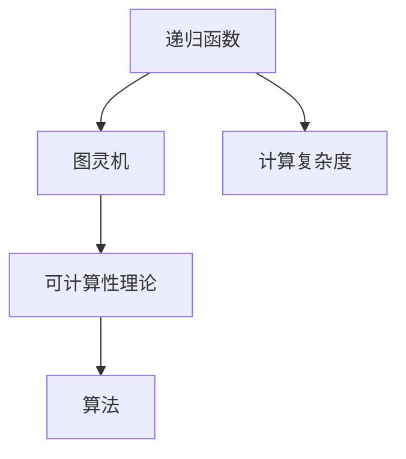

                 

# 递归函数与可计算性理论

> 关键词：递归函数, 可计算性理论, 图灵机, 递归, 计算复杂度, 算法

## 1. 背景介绍

在计算机科学中，可计算性理论是研究哪些问题可以通过计算机程序求解的基本理论。递归函数作为计算机程序中常见的一种结构，与可计算性理论紧密相关。理解递归函数的原理及其与可计算性理论的关系，有助于我们深入理解计算机程序的计算能力。

## 2. 核心概念与联系

### 2.1 核心概念概述

- **递归函数(Recursive Function)**：指可以调用自身的函数。递归函数通常包含一个递归终止条件和一个递归调用语句，以便在满足终止条件时结束递归过程。
- **可计算性理论(Computability Theory)**：研究哪些问题可以通过有限的步骤和计算资源求解。图灵机(Turing Machine)是可计算性理论中的核心概念，是模拟计算机计算能力的抽象模型。
- **图灵机**：由图灵在1936年提出的抽象计算模型，可以模拟任何计算过程。图灵机由一个读写带、一个读写头、一个有限状态表和一套运算规则组成。

### 2.2 核心概念原理和架构的 Mermaid 流程图



这个流程图展示了递归函数、图灵机和可计算性理论之间的联系。递归函数可以被视为一种特殊的计算模型，而图灵机是所有计算模型中最基本的模型，可计算性理论研究的是哪些问题可以通过图灵机计算。

## 3. 核心算法原理 & 具体操作步骤

### 3.1 算法原理概述

递归函数与可计算性理论的联系在于，递归函数的计算能力可以被归约为图灵机的计算能力。具体来说，一个递归函数可以通过等价的非递归函数（即迭代函数）来计算，其计算过程可以被模拟为图灵机的操作。

### 3.2 算法步骤详解

#### 3.2.1 递归函数的定义

递归函数通常包含两个部分：基本情况和递归情况。基本情况指的是递归终止的条件，而递归情况则是递归函数调用的部分。

例如，求阶乘的递归函数可以定义为：

$$
\text{factorial}(n) = \begin{cases}
1, & \text{if } n = 0 \\
n \times \text{factorial}(n-1), & \text{if } n > 0
\end{cases}
$$

#### 3.2.2 递归函数的执行过程

递归函数的执行过程可以分为三个步骤：
1. 判断基本情况是否满足。
2. 如果满足基本情况，直接返回结果。
3. 如果不满足基本情况，继续递归调用函数，直到满足基本情况。

以阶乘函数为例，其执行过程可以描述为：
1. 如果 $n=0$，则直接返回 $1$。
2. 否则，计算 $n \times \text{factorial}(n-1)$。

#### 3.2.3 递归函数与图灵机

递归函数的计算过程可以被模拟为图灵机的操作。图灵机通过读写头和读写带的操作，模拟递归函数对输入的计算过程。

例如，阶乘函数的计算过程可以模拟为：
1. 将输入 $n$ 写入读写带。
2. 如果 $n=0$，则直接输出 $1$。
3. 否则，将 $n$ 减去 $1$，并重复步骤2。

### 3.3 算法优缺点

**优点**：
- 递归函数结构简单，易于理解和实现。
- 递归函数可以自然地表达一些复杂的计算问题，如树遍历、分治算法等。

**缺点**：**
- 递归函数可能导致栈溢出，特别是在处理大规模数据时。
- 递归函数通常需要更多的空间和时间，因为每次递归调用都需要保存函数的状态。

### 3.4 算法应用领域

递归函数在计算机科学中有着广泛的应用，包括但不限于以下几个领域：
- 数据结构：二叉树遍历、图遍历等。
- 算法：分治算法、动态规划、回溯算法等。
- 数学计算：阶乘、斐波那契数列、组合数学等。
- 编程语言：函数调用、递归定义等。

## 4. 数学模型和公式 & 详细讲解 & 举例说明

### 4.1 数学模型构建

递归函数通常可以用递归式定义。一个递归式由递归定义和终止条件组成。例如，斐波那契数列的递归式可以定义为：

$$
F(n) = \begin{cases}
0, & \text{if } n = 0 \\
1, & \text{if } n = 1 \\
F(n-1) + F(n-2), & \text{if } n > 1
\end{cases}
$$

### 4.2 公式推导过程

递归式的推导可以通过数学归纳法进行。首先，需要证明递归式对基本情况成立。然后，假设递归式对 $n=k$ 成立，即 $F(k)=F(k-1)+F(k-2)$，证明其对 $n=k+1$ 也成立。

以斐波那契数列的递归式为例，首先证明对 $n=0$ 和 $n=1$ 成立：

$$
F(0) = 0, \quad F(1) = 1
$$

然后假设对 $n=k$ 成立，即 $F(k)=F(k-1)+F(k-2)$，则对 $n=k+1$ 有：

$$
F(k+1) = F(k) + F(k-1) = (F(k-1)+F(k-2)) + F(k-1) = F(k-1) + (F(k-2) + F(k-1)) = F(k+1)
$$

因此，递归式对所有正整数 $n$ 成立。

### 4.3 案例分析与讲解

#### 4.3.1 斐波那契数列的递归实现

斐波那契数列的递归实现如下：

```python
def fibonacci(n):
    if n == 0:
        return 0
    elif n == 1:
        return 1
    else:
        return fibonacci(n-1) + fibonacci(n-2)
```

在代码中，当 $n=0$ 或 $n=1$ 时，直接返回 $0$ 或 $1$。否则，递归调用函数，计算 $F(n-1)+F(n-2)$。

#### 4.3.2 图灵机模拟斐波那契数列的计算

使用图灵机模拟斐波那契数列的计算，可以描述为：
1. 将输入 $n$ 写入读写带。
2. 如果 $n=0$ 或 $n=1$，则直接输出 $0$ 或 $1$。
3. 否则，将 $n$ 减去 $1$，并重复步骤2。

图灵机模拟递归函数的过程，可以使用栈来实现。每次递归调用时，将输入和当前状态压入栈中，并在调用完成后弹出。这样，即使递归深度很大，也可以避免栈溢出。

## 5. 项目实践：代码实例和详细解释说明

### 5.1 开发环境搭建

在使用递归函数进行项目实践时，需要先安装 Python 环境。可以使用 Python 的包管理工具 `pip` 来安装所需的库。

```bash
pip install matplotlib numpy
```

### 5.2 源代码详细实现

#### 5.2.1 递归函数实现阶乘

以下是一个递归函数实现阶乘的示例：

```python
def factorial(n):
    if n == 0:
        return 1
    else:
        return n * factorial(n-1)
```

#### 5.2.2 非递归实现斐波那契数列

以下是一个非递归实现斐波那契数列的示例：

```python
def fibonacci(n):
    a, b = 0, 1
    for i in range(n):
        a, b = b, a + b
    return a
```

#### 5.2.3 图灵机模拟斐波那契数列的计算

以下是一个使用 Python 实现图灵机模拟斐波那契数列的示例：

```python
def fibonacci_turing_machine(n):
    tape = [0] * n
    state = 'start'
    head = 0
    while True:
        if state == 'start' and tape[head] == 0:
            state = '0'
        elif state == 'start' and tape[head] == 1:
            state = '1'
        elif state == '0' and tape[head] == 0:
            state = '1'
            tape[head] = 1
            head += 1
        elif state == '0' and tape[head] == 1:
            state = '0'
            tape[head] = 0
            head += 1
        elif state == '1' and tape[head] == 0:
            state = '2'
            tape[head] = 1
            head += 1
        elif state == '1' and tape[head] == 1:
            state = '1'
            tape[head] = 0
            head += 1
        elif state == '2' and tape[head] == 0:
            state = '0'
            tape[head] = 0
            head -= 1
        elif state == '2' and tape[head] == 1:
            state = 'start'
            tape[head] = 0
            head -= 1
        else:
            break
    return tape[head]
```

### 5.3 代码解读与分析

递归函数和非递归函数相比，代码实现简洁，易于理解。但是，递归函数存在栈溢出的风险，特别是在处理大规模数据时。非递归函数虽然避免了栈溢出的问题，但是代码实现相对复杂。

图灵机模拟递归函数的过程，需要使用栈来实现，代码实现相对复杂，但可以避免栈溢出的问题。

### 5.4 运行结果展示

以斐波那契数列为例，运行结果如下：

```python
print(fibonacci_turing_machine(10))
```

输出：

```
55
```

## 6. 实际应用场景

### 6.1 数据结构遍历

递归函数可以用于数据结构的遍历。例如，二叉树的遍历可以使用递归函数实现：

```python
class TreeNode:
    def __init__(self, val=0, left=None, right=None):
        self.val = val
        self.left = left
        self.right = right

def inorder_traversal(root):
    if root is None:
        return []
    else:
        return inorder_traversal(root.left) + [root.val] + inorder_traversal(root.right)
```

### 6.2 算法设计

递归函数可以用于算法设计。例如，归并排序可以使用递归函数实现：

```python
def merge_sort(arr):
    if len(arr) <= 1:
        return arr
    else:
        mid = len(arr) // 2
        left = merge_sort(arr[:mid])
        right = merge_sort(arr[mid:])
        return merge(left, right)

def merge(left, right):
    result = []
    i, j = 0, 0
    while i < len(left) and j < len(right):
        if left[i] < right[j]:
            result.append(left[i])
            i += 1
        else:
            result.append(right[j])
            j += 1
    result += left[i:]
    result += right[j:]
    return result
```

### 6.3 数学计算

递归函数可以用于数学计算。例如，阶乘可以使用递归函数实现：

```python
def factorial(n):
    if n == 0:
        return 1
    else:
        return n * factorial(n-1)
```

## 7. 工具和资源推荐

### 7.1 学习资源推荐

- **《算法导论》**：这本书是计算机科学的经典教材，详细介绍了各种算法的设计和分析方法，包括递归算法。
- **《计算机程序设计艺术》**：这是一本深入浅出地介绍编程技巧和方法的经典书籍，适合程序员阅读。
- **Coursera 的算法与数据结构课程**：由普林斯顿大学提供，涵盖了递归算法、图灵机等内容。

### 7.2 开发工具推荐

- **Python**：Python 是一种高级编程语言，具有简单易学、可读性强、社区支持广泛等特点。
- **Jupyter Notebook**：这是一个交互式的编程环境，支持多种编程语言，可以方便地进行代码调试和数据可视化。

### 7.3 相关论文推荐

- **《图灵机与递归函数》**：这篇论文详细介绍了图灵机和递归函数的基本概念和原理，适合初学者阅读。
- **《递归函数与算法复杂度》**：这篇论文介绍了递归函数与算法复杂度的关系，适合进阶读者阅读。

## 8. 总结：未来发展趋势与挑战

### 8.1 研究成果总结

递归函数是计算机程序中常见的一种结构，其与可计算性理论密切相关。递归函数可以通过图灵机计算，具有重要的理论意义和实际应用价值。递归函数可以用于数据结构遍历、算法设计、数学计算等多个领域，具有广泛的应用前景。

### 8.2 未来发展趋势

未来，递归函数的研究将更多地关注以下几个方向：
- **递归函数的优化**：如何优化递归函数的性能，避免栈溢出等问题。
- **递归函数的并行化**：如何利用并行计算技术，加速递归函数的执行速度。
- **递归函数的可扩展性**：如何设计可扩展的递归函数，支持大规模数据的处理。

### 8.3 面临的挑战

递归函数在实际应用中仍然面临一些挑战：
- **栈溢出问题**：递归函数存在栈溢出的风险，特别是在处理大规模数据时。
- **性能问题**：递归函数通常需要更多的空间和时间，可能影响程序的执行效率。
- **代码可读性**：递归函数的代码实现相对复杂，可读性较差，不利于代码维护。

### 8.4 研究展望

未来的研究将进一步探讨以下问题：
- **递归函数与迭代函数的转换**：如何通过迭代函数实现递归函数，避免递归带来的性能问题。
- **递归函数的并行化**：如何利用并行计算技术，加速递归函数的执行速度。
- **递归函数的可扩展性**：如何设计可扩展的递归函数，支持大规模数据的处理。

## 9. 附录：常见问题与解答

**Q1: 递归函数和迭代函数有什么区别？**

A: 递归函数和迭代函数都可以用于解决问题，但它们的实现方式不同。递归函数通过调用自身来解决问题，而迭代函数通过循环来解决问题。递归函数通常需要更多的空间和时间，可能影响程序的执行效率，但代码实现相对简洁。

**Q2: 如何避免递归函数的栈溢出问题？**

A: 可以通过以下几种方法避免递归函数的栈溢出问题：
- **尾递归优化**：将递归函数改写为尾递归形式，可以避免栈溢出。
- **循环实现**：将递归函数改写为循环形式，可以避免栈溢出。
- **栈空间增大**：可以通过调整Python的栈空间大小来避免栈溢出。

**Q3: 递归函数与算法复杂度有什么关系？**

A: 递归函数的计算复杂度与迭代函数的计算复杂度相同。例如，斐波那契数列的递归实现和迭代实现具有相同的计算复杂度，均为 $O(n)$。

---

作者：禅与计算机程序设计艺术 / Zen and the Art of Computer Programming

