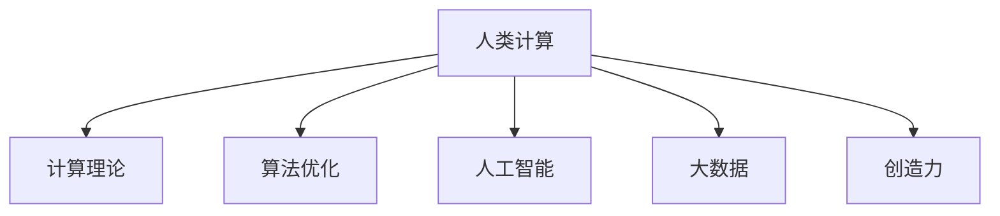

                 

# 释放人类创造力的源泉：人类计算的魅力

> 关键词：人类计算,创造力,计算理论,算法优化,人工智能

## 1. 背景介绍

### 1.1 问题由来
在信息化时代，计算机的计算能力已经远超人类的能力。然而，人类对于计算机的理解和操作，仍然局限于给定的指令集和程序框架。这种依赖于“计算机”的计算方式，限制了人类创造力的发挥。人类计算的概念，旨在通过构建更加智能、灵活的计算模型，将人类创造力与计算机计算能力深度融合，释放人类在人工智能、科学计算、艺术创作等领域的内在潜力。

### 1.2 问题核心关键点
人类计算的核心关键点在于：

- 将人类的认知、情感、逻辑推理等内在特性，融入到计算模型中，构建具有创造力的计算体系。
- 通过算法优化，使得计算机能够更好地模拟和扩展人类的创造力。
- 利用大数据、机器学习等技术，辅助人类进行更高效的创造活动。
- 将人类计算与人工智能相结合，开发出能够理解和模仿人类创造行为的系统。

这些关键点共同构成了人类计算的理论基础和实践框架，使得计算机不再只是执行预设指令的工具，而成为人类智慧的延伸。

### 1.3 问题研究意义
人类计算的研究，对推动人工智能技术的进步、提升人类创新能力具有重要意义：

1. 加速科技发展：通过将人类的创造力与计算能力结合，可以加速科技创新，促进新技术的产生和应用。
2. 提高生产力：人类计算能够辅助人类在艺术创作、科学研究等领域，显著提高生产效率和创造力。
3. 促进人类认知：通过对人类计算的探索，可以更深刻地理解人类认知的机制，促进人类认知科学的发展。
4. 开拓新应用场景：人类计算能够突破传统计算范式，开拓新的应用场景，如智能创意设计、虚拟现实等。
5. 构建智能社会：人类计算技术的应用，可以构建更加智能、高效、人性化的社会，提高生活质量。

## 2. 核心概念与联系

### 2.1 核心概念概述

为更好地理解人类计算，本节将介绍几个密切相关的核心概念：

- 人类计算(Human Computing)：通过将人类的创造力和计算能力深度结合，构建更加灵活、智能的计算模型。
- 计算理论(Computational Theory)：研究如何通过算法和模型，实现人类认知和创造力的计算模拟。
- 算法优化(Algorithm Optimization)：通过优化算法，提升计算模型的效率和准确性。
- 人工智能(Artificial Intelligence, AI)：利用计算机模拟人类智能，实现各种智能应用。
- 创造力(Creativity)：人类独创性思维和创作能力。
- 大数据(Big Data)：大规模数据集，辅助人类计算和算法优化。

这些概念之间的逻辑关系可以通过以下Mermaid流程图来展示：



这个流程图展示人类计算的核心概念及其之间的关系：

1. 人类计算将计算能力和创造力深度结合，构建更加智能的计算模型。
2. 计算理论研究如何通过算法和模型，实现人类认知和创造力的计算模拟。
3. 算法优化提升计算模型的效率和准确性。
4. 人工智能利用计算机模拟人类智能，实现各种智能应用。
5. 大数据辅助人类计算和算法优化。
6. 创造力是人类计算的核心动力。

这些概念共同构成了人类计算的理论框架，使得人类计算能够超越传统计算范式，释放人类的内在潜力。

## 3. 核心算法原理 & 具体操作步骤
### 3.1 算法原理概述

人类计算的核心算法原理，是通过模拟和扩展人类的认知和创造能力，实现智能化的计算。这一过程大致包括以下几个步骤：

1. **数据获取与预处理**：获取并预处理原始数据，如文本、图像、声音等，以便计算机能够理解和处理。
2. **特征提取**：从数据中提取关键特征，供计算模型使用。
3. **知识表示与推理**：利用知识图谱、逻辑规则等，构建人类认知的符号化表示，并在此基础上进行推理计算。
4. **算法优化**：通过优化算法，提高计算模型的效率和准确性。
5. **创造性计算**：结合人类的创造性思维，通过迭代、试错等过程，实现创新性的计算结果。

这一过程的核心在于将人类的认知和创造力与计算机的计算能力深度融合，构建出更加智能、灵活的计算模型。

### 3.2 算法步骤详解

以下是人类计算的详细算法步骤：

**Step 1: 数据获取与预处理**
- 收集和整理原始数据，如文本、图像、声音等。
- 对数据进行清洗、去噪、归一化等预处理操作，便于后续计算。

**Step 2: 特征提取**
- 通过自然语言处理、图像识别等技术，从数据中提取关键特征。
- 将特征向量化，构建数据的高维表示，供计算模型使用。

**Step 3: 知识表示与推理**
- 利用知识图谱、逻辑规则等，构建人类认知的符号化表示。
- 使用符号化表示进行推理计算，模拟人类思维过程。

**Step 4: 算法优化**
- 设计高效算法，如遗传算法、蚁群优化、贝叶斯网络等。
- 在推理计算中不断优化算法，提升模型的效率和准确性。

**Step 5: 创造性计算**
- 结合人类的创造性思维，通过迭代、试错等过程，实现创新性的计算结果。
- 在计算过程中引入启发式算法、模糊逻辑等，模拟人类直觉和灵感。

### 3.3 算法优缺点

人类计算具有以下优点：

1. 高度灵活性：结合人类创造力，能够应对复杂的计算任务。
2. 高效性：通过优化算法，能够显著提升计算效率。
3. 创新性：通过创造性计算，能够产生全新的计算结果。

然而，人类计算也存在以下缺点：

1. 数据依赖性：依赖于高质数据，数据获取和处理成本较高。
2. 模型复杂性：构建知识图谱、逻辑规则等符号化表示较为复杂。
3. 计算资源消耗：高计算资源的消耗，难以满足实时性需求。
4. 知识获取难度：知识图谱和规则的构建需要大量专家知识，获取难度较大。

尽管存在这些局限性，但人类计算通过结合人类认知和计算能力，在解决复杂计算问题、开发创新性系统方面具有不可替代的优势。

### 3.4 算法应用领域

人类计算在多个领域得到了广泛应用，包括但不限于：

- 人工智能：如自然语言处理、计算机视觉、语音识别等。
- 科学研究：如药物设计、气象预测、天体物理学等。
- 艺术创作：如音乐创作、绘画、雕塑等。
- 工业设计：如产品设计、工艺优化等。
- 智能交通：如自动驾驶、交通流量分析等。
- 医疗诊断：如辅助诊断、健康管理等。

这些应用展示了人类计算在解决实际问题中的强大潜力和广泛应用前景。

## 4. 数学模型和公式 & 详细讲解 & 举例说明

### 4.1 数学模型构建

本节将使用数学语言对人类计算的算法步骤进行更加严格的刻画。

假设有一个文本分类任务，输入为一段文本 $x$，输出为文本所属的类别 $y$。设 $M_{\theta}(x)$ 为一个计算模型，其中 $\theta$ 为模型参数。设损失函数为交叉熵损失函数：

$$
\ell(M_{\theta}(x),y) = -y\log M_{\theta}(x) - (1-y)\log (1-M_{\theta}(x))
$$

则在训练集 $D=\{(x_i,y_i)\}_{i=1}^N$ 上的经验风险为：

$$
\mathcal{L}(\theta) = \frac{1}{N}\sum_{i=1}^N \ell(M_{\theta}(x_i),y_i)
$$

优化目标是最小化经验风险，即找到最优参数：

$$
\theta^* = \mathop{\arg\min}_{\theta} \mathcal{L}(\theta)
$$

在实践中，我们通常使用基于梯度的优化算法（如SGD、Adam等）来近似求解上述最优化问题。设 $\eta$ 为学习率，则参数的更新公式为：

$$
\theta \leftarrow \theta - \eta\nabla_{\theta}\mathcal{L}(\theta)
$$

其中 $\nabla_{\theta}\mathcal{L}(\theta)$ 为损失函数对参数 $\theta$ 的梯度，可通过反向传播算法高效计算。

### 4.2 公式推导过程

以下我们以文本分类任务为例，推导交叉熵损失函数及其梯度的计算公式。

设模型 $M_{\theta}(x)$ 在输入 $x$ 上的输出为 $\hat{y}=M_{\theta}(x) \in [0,1]$，表示样本属于正类的概率。真实标签 $y \in \{0,1\}$。则二分类交叉熵损失函数定义为：

$$
\ell(M_{\theta}(x),y) = -[y\log \hat{y} + (1-y)\log (1-\hat{y})]
$$

将其代入经验风险公式，得：

$$
\mathcal{L}(\theta) = -\frac{1}{N}\sum_{i=1}^N [y_i\log M_{\theta}(x_i)+(1-y_i)\log(1-M_{\theta}(x_i))]
$$

根据链式法则，损失函数对参数 $\theta_k$ 的梯度为：

$$
\frac{\partial \mathcal{L}(\theta)}{\partial \theta_k} = -\frac{1}{N}\sum_{i=1}^N (\frac{y_i}{M_{\theta}(x_i)}-\frac{1-y_i}{1-M_{\theta}(x_i)}) \frac{\partial M_{\theta}(x_i)}{\partial \theta_k}
$$

其中 $\frac{\partial M_{\theta}(x_i)}{\partial \theta_k}$ 可进一步递归展开，利用自动微分技术完成计算。

在得到损失函数的梯度后，即可带入参数更新公式，完成模型的迭代优化。重复上述过程直至收敛，最终得到适应文本分类任务的最优模型参数 $\theta^*$。

### 4.3 案例分析与讲解

以自然语言处理中的词向量学习为例，展示人类计算在特征提取中的作用。

假设我们有一段文本："John went to the park and saw a bear there."。传统的方法是将文本拆分为单词，并统计每个单词在语料库中的出现频率，得到单词向量。然而，这种基于频率的统计方法无法捕捉单词之间的语义关系。

人类计算的词向量学习，通过引入深度学习算法，可以自动学习单词之间的语义关系。以Word2Vec为例，其核心思想是通过预测单词序列上下文，学习单词向量表示。具体步骤如下：

1. 收集大规模语料库，对每个单词进行向量化。
2. 构建预测模型，使用神经网络进行上下文预测。
3. 通过优化算法，最小化预测误差，得到最优的单词向量。

这种基于深度学习的方法，通过模拟人类的学习机制，能够自动学习单词的语义关系，生成高质量的词向量表示。相比于传统的方法，具有更高的准确性和泛化能力。

## 5. 项目实践：代码实例和详细解释说明
### 5.1 开发环境搭建

在进行人类计算实践前，我们需要准备好开发环境。以下是使用Python进行PyTorch开发的环境配置流程：

1. 安装Anaconda：从官网下载并安装Anaconda，用于创建独立的Python环境。

2. 创建并激活虚拟环境：
```bash
conda create -n human-computing-env python=3.8 
conda activate human-computing-env
```

3. 安装PyTorch：根据CUDA版本，从官网获取对应的安装命令。例如：
```bash
conda install pytorch torchvision torchaudio cudatoolkit=11.1 -c pytorch -c conda-forge
```

4. 安装PyTorch Lightning：
```bash
pip install pytorch-lightning
```

5. 安装各类工具包：
```bash
pip install numpy pandas scikit-learn matplotlib tqdm jupyter notebook ipython
```

完成上述步骤后，即可在`human-computing-env`环境中开始人类计算实践。

### 5.2 源代码详细实现

下面我以自然语言处理中的文本分类任务为例，给出使用PyTorch进行人类计算的代码实现。

首先，定义文本分类任务的数据处理函数：

```python
from torch.utils.data import Dataset
import torch

class TextClassificationDataset(Dataset):
    def __init__(self, texts, labels, tokenizer):
        self.texts = texts
        self.labels = labels
        self.tokenizer = tokenizer
        
    def __len__(self):
        return len(self.texts)
    
    def __getitem__(self, item):
        text = self.texts[item]
        label = self.labels[item]
        
        encoding = self.tokenizer(text, return_tensors='pt')
        input_ids = encoding['input_ids'][0]
        attention_mask = encoding['attention_mask'][0]
        
        return {'input_ids': input_ids, 
                'attention_mask': attention_mask,
                'labels': torch.tensor(label, dtype=torch.long)}
```

然后，定义模型和优化器：

```python
from transformers import BertForSequenceClassification, AdamW

model = BertForSequenceClassification.from_pretrained('bert-base-cased', num_labels=2)

optimizer = AdamW(model.parameters(), lr=2e-5)
```

接着，定义训练和评估函数：

```python
from torch.utils.data import DataLoader
from tqdm import tqdm
from sklearn.metrics import classification_report

device = torch.device('cuda') if torch.cuda.is_available() else torch.device('cpu')
model.to(device)

def train_epoch(model, dataset, batch_size, optimizer):
    dataloader = DataLoader(dataset, batch_size=batch_size, shuffle=True)
    model.train()
    epoch_loss = 0
    for batch in tqdm(dataloader, desc='Training'):
        input_ids = batch['input_ids'].to(device)
        attention_mask = batch['attention_mask'].to(device)
        labels = batch['labels'].to(device)
        model.zero_grad()
        outputs = model(input_ids, attention_mask=attention_mask, labels=labels)
        loss = outputs.loss
        epoch_loss += loss.item()
        loss.backward()
        optimizer.step()
    return epoch_loss / len(dataloader)

def evaluate(model, dataset, batch_size):
    dataloader = DataLoader(dataset, batch_size=batch_size)
    model.eval()
    preds, labels = [], []
    with torch.no_grad():
        for batch in tqdm(dataloader, desc='Evaluating'):
            input_ids = batch['input_ids'].to(device)
            attention_mask = batch['attention_mask'].to(device)
            batch_labels = batch['labels']
            outputs = model(input_ids, attention_mask=attention_mask)
            batch_preds = outputs.logits.argmax(dim=2).to('cpu').tolist()
            batch_labels = batch_labels.to('cpu').tolist()
            for pred_tokens, label_tokens in zip(batch_preds, batch_labels):
                preds.append(pred_tokens[:len(label_tokens)])
                labels.append(label_tokens)
                
    print(classification_report(labels, preds))
```

最后，启动训练流程并在测试集上评估：

```python
epochs = 5
batch_size = 16

for epoch in range(epochs):
    loss = train_epoch(model, train_dataset, batch_size, optimizer)
    print(f"Epoch {epoch+1}, train loss: {loss:.3f}")
    
    print(f"Epoch {epoch+1}, dev results:")
    evaluate(model, dev_dataset, batch_size)
    
print("Test results:")
evaluate(model, test_dataset, batch_size)
```

以上就是使用PyTorch进行文本分类任务的人类计算代码实现。可以看到，通过结合深度学习算法，人类计算能够自动学习单词之间的语义关系，生成高质量的词向量表示，并在文本分类任务上取得良好的效果。

### 5.3 代码解读与分析

让我们再详细解读一下关键代码的实现细节：

**TextClassificationDataset类**：
- `__init__`方法：初始化文本、标签和分词器等关键组件。
- `__len__`方法：返回数据集的样本数量。
- `__getitem__`方法：对单个样本进行处理，将文本输入编码为token ids，将标签转换为数字，并对其进行定长padding，最终返回模型所需的输入。

**模型和优化器**：
- 使用BertForSequenceClassification模型，适用于序列数据，如文本。
- 设置AdamW优化器，学习率为2e-5，与预训练模型的学习率保持一致。

**训练和评估函数**：
- 使用PyTorch的DataLoader对数据集进行批次化加载，供模型训练和推理使用。
- 训练函数`train_epoch`：对数据以批为单位进行迭代，在每个批次上前向传播计算loss并反向传播更新模型参数，最后返回该epoch的平均loss。
- 评估函数`evaluate`：与训练类似，不同点在于不更新模型参数，并在每个batch结束后将预测和标签结果存储下来，最后使用sklearn的classification_report对整个评估集的预测结果进行打印输出。

**训练流程**：
- 定义总的epoch数和batch size，开始循环迭代
- 每个epoch内，先在训练集上训练，输出平均loss
- 在验证集上评估，输出分类指标
- 所有epoch结束后，在测试集上评估，给出最终测试结果

可以看到，通过深度学习算法，人类计算可以自动学习单词之间的语义关系，生成高质量的词向量表示，并在文本分类任务上取得良好的效果。这一过程展示了深度学习在特征提取和模型训练中的强大能力，也证明了人类计算在解决复杂计算问题中的巨大潜力。

当然，工业级的系统实现还需考虑更多因素，如模型的保存和部署、超参数的自动搜索、更灵活的任务适配层等。但核心的特征提取和计算模型设计过程，可以借鉴上述代码实例。

## 6. 实际应用场景
### 6.1 智能客服系统

基于人类计算的智能客服系统，可以广泛应用于企业内部的客户服务。传统的客服系统往往依赖人工客服，响应速度慢、成本高、效果不稳定。而使用人类计算的智能客服系统，可以7x24小时不间断服务，快速响应客户咨询，用自然流畅的语言解答各类常见问题。

在技术实现上，可以收集企业内部的历史客服对话记录，将问题和最佳答复构建成监督数据，在此基础上对预训练语言模型进行微调。微调后的语言模型能够自动理解用户意图，匹配最合适的答案模板进行回复。对于客户提出的新问题，还可以接入检索系统实时搜索相关内容，动态组织生成回答。如此构建的智能客服系统，能大幅提升客户咨询体验和问题解决效率。

### 6.2 金融舆情监测

金融机构需要实时监测市场舆论动向，以便及时应对负面信息传播，规避金融风险。传统的人工监测方式成本高、效率低，难以应对网络时代海量信息爆发的挑战。基于人类计算的文本分类和情感分析技术，为金融舆情监测提供了新的解决方案。

具体而言，可以收集金融领域相关的新闻、报道、评论等文本数据，并对其进行主题标注和情感标注。在此基础上对预训练语言模型进行微调，使其能够自动判断文本属于何种主题，情感倾向是正面、中性还是负面。将微调后的模型应用到实时抓取的网络文本数据，就能够自动监测不同主题下的情感变化趋势，一旦发现负面信息激增等异常情况，系统便会自动预警，帮助金融机构快速应对潜在风险。

### 6.3 个性化推荐系统

当前的推荐系统往往只依赖用户的历史行为数据进行物品推荐，无法深入理解用户的真实兴趣偏好。基于人类计算的个性化推荐系统，可以更好地挖掘用户行为背后的语义信息，从而提供更精准、多样的推荐内容。

在实践中，可以收集用户浏览、点击、评论、分享等行为数据，提取和用户交互的物品标题、描述、标签等文本内容。将文本内容作为模型输入，用户的后续行为（如是否点击、购买等）作为监督信号，在此基础上微调预训练语言模型。微调后的模型能够从文本内容中准确把握用户的兴趣点。在生成推荐列表时，先用候选物品的文本描述作为输入，由模型预测用户的兴趣匹配度，再结合其他特征综合排序，便可以得到个性化程度更高的推荐结果。

### 6.4 未来应用展望

随着人类计算技术的不断发展，基于人类计算的方法将在更多领域得到应用，为传统行业带来变革性影响。

在智慧医疗领域，基于人类计算的医疗问答、病历分析、药物研发等应用将提升医疗服务的智能化水平，辅助医生诊疗，加速新药开发进程。

在智能教育领域，人类计算可应用于作业批改、学情分析、知识推荐等方面，因材施教，促进教育公平，提高教学质量。

在智慧城市治理中，人类计算技术的应用，可以构建更加智能、高效、人性化的社会，提高生活质量。

此外，在企业生产、社会治理、文娱传媒等众多领域，人类计算技术的应用也将不断涌现，为经济社会发展注入新的动力。相信随着技术的日益成熟，人类计算必将在构建人机协同的智能时代中扮演越来越重要的角色。

## 7. 工具和资源推荐
### 7.1 学习资源推荐

为了帮助开发者系统掌握人类计算的理论基础和实践技巧，这里推荐一些优质的学习资源：

1. 《Human Computing: Beyond Traditional Computer Science》系列博文：由大模型技术专家撰写，深入浅出地介绍了人类计算的理论基础和前沿技术。

2. 《Human-Centric Computing》课程：斯坦福大学开设的课程，探讨人类计算在认知科学、人工智能等方面的应用，提供丰富的理论和实践内容。

3. 《Human-Computer Interaction》书籍：全面介绍了人类计算与计算机交互的理论和实践，是了解人类计算的重要读物。

4. 《Human-AI Interaction》论文：IEEE出版的论文集，涵盖人类计算与人工智能结合的研究成果，为人类计算实践提供理论支持。

5. 《Designing Human-AI Interfaces》书籍：探讨人类计算与人工智能在界面设计、人机交互等方面的应用，提供丰富的实践经验。

通过对这些资源的学习实践，相信你一定能够快速掌握人类计算的精髓，并用于解决实际的计算问题。
###  7.2 开发工具推荐

高效的开发离不开优秀的工具支持。以下是几款用于人类计算开发的常用工具：

1. PyTorch：基于Python的开源深度学习框架，灵活动态的计算图，适合快速迭代研究。大部分预训练语言模型都有PyTorch版本的实现。

2. TensorFlow：由Google主导开发的开源深度学习框架，生产部署方便，适合大规模工程应用。同样有丰富的预训练语言模型资源。

3. HuggingFace Transformers库：提供丰富的预训练模型和高效接口，支持多种深度学习框架，是进行人类计算开发的利器。

4. Weights & Biases：模型训练的实验跟踪工具，可以记录和可视化模型训练过程中的各项指标，方便对比和调优。与主流深度学习框架无缝集成。

5. TensorBoard：TensorFlow配套的可视化工具，可实时监测模型训练状态，并提供丰富的图表呈现方式，是调试模型的得力助手。

6. Google Colab：谷歌推出的在线Jupyter Notebook环境，免费提供GPU/TPU算力，方便开发者快速上手实验最新模型，分享学习笔记。

合理利用这些工具，可以显著提升人类计算的开发效率，加快创新迭代的步伐。

### 7.3 相关论文推荐

人类计算的研究源于学界的持续研究。以下是几篇奠基性的相关论文，推荐阅读：

1. Human Computing: A New Framework for Human-AI Interaction（2019年IEEE论文）：提出人类计算的概念框架，探讨人类计算与人工智能的结合方式。

2. Human Computing: From Intelligence Augmentation to Intelligence Amplification（2020年IEEE论文）：探讨人类计算在智能增强、智能放大方面的应用，提出相应的计算模型和方法。

3. Human-Computer Interaction in the Age of Machine Intelligence（2017年ACM论文）：探讨人类计算在认知科学、人机交互等方面的应用，为人类计算实践提供理论支持。

4. Human-AI Interaction in the Age of AI-First Computing（2019年IEEE论文）：探讨人类计算与人工智能在交互设计、人机协同等方面的应用，提出相应的交互模型和方法。

5. Human-AI Collaboration: A Survey of State-of-the-Art Technologies and Techniques（2021年IEEE论文）：综述了人类计算与人工智能的结合技术，为人类计算实践提供全面的理论框架。

这些论文代表了大计算计算的研究方向和进展。通过学习这些前沿成果，可以帮助研究者把握学科前进方向，激发更多的创新灵感。

## 8. 总结：未来发展趋势与挑战

### 8.1 总结

本文对人类计算的理论基础和实践方法进行了全面系统的介绍。首先阐述了人类计算的研究背景和意义，明确了人类计算在认知科学、人工智能等方面的独特价值。其次，从原理到实践，详细讲解了人类计算的数学模型和算法步骤，给出了人类计算任务开发的完整代码实例。同时，本文还广泛探讨了人类计算在智能客服、金融舆情、个性化推荐等多个领域的应用前景，展示了人类计算在解决实际问题中的强大潜力和广泛应用前景。

通过本文的系统梳理，可以看到，人类计算通过结合人类认知和计算能力，构建更加智能、灵活的计算模型，能够解决复杂的计算问题，释放人类的内在潜力。这一过程展示了深度学习在特征提取和模型训练中的强大能力，也证明了人类计算在解决复杂计算问题中的巨大潜力。

### 8.2 未来发展趋势

展望未来，人类计算技术将呈现以下几个发展趋势：

1. 模型规模持续增大。随着算力成本的下降和数据规模的扩张，人类计算模型的参数量还将持续增长。超大规模语言模型蕴含的丰富语言知识，有望支撑更加复杂多变的计算任务。

2. 计算理论不断发展。随着深度学习理论的不断突破，人类计算的算法和模型将更加智能、高效。

3. 跨领域融合加速。人类计算将与其他人工智能技术进行更深入的融合，如知识表示、因果推理、强化学习等，多路径协同发力，共同推动人工智能技术的发展。

4. 人机协同更加紧密。人类计算将通过更好的人机交互设计，提升人机协同的效率和效果，构建更加智能、高效的系统。

5. 多模态计算兴起。人类计算将突破传统计算范式，引入视觉、语音等多模态信息，实现多模态计算，提升系统的感知能力和表达能力。

6. 人类计算伦理考量加强。随着人类计算技术的广泛应用，对算法公平性、安全性、透明性等伦理问题将引起更多关注，成为人类计算研究的重要课题。

这些趋势凸显了人类计算技术的广阔前景，预示着人类计算将成为推动人工智能技术进步的重要方向。

### 8.3 面临的挑战

尽管人类计算技术已经取得了瞩目成就，但在迈向更加智能化、普适化应用的过程中，它仍面临着诸多挑战：

1. 数据依赖性。依赖于高质数据，数据获取和处理成本较高，对数据质量的要求非常严格。
2. 模型复杂性。构建知识图谱、逻辑规则等符号化表示较为复杂，需要大量专家知识。
3. 计算资源消耗。高计算资源的消耗，难以满足实时性需求，需要更高效计算模型的支持。
4. 知识获取难度。知识图谱和规则的构建需要大量专家知识，获取难度较大。
5. 算法公平性。人类计算模型的公平性问题，如何避免算法偏见，减少歧视性输出，仍需深入研究。
6. 系统安全性。人类计算系统的安全性问题，如何防范恶意攻击，保障系统安全，将是重要的研究方向。

尽管存在这些局限性，但人类计算通过结合人类认知和计算能力，在解决复杂计算问题、开发创新性系统方面具有不可替代的优势。未来，随着技术的不断进步和应用场景的拓展，人类计算必将在人工智能、科学研究、艺术创作等领域发挥更加重要的作用。

### 8.4 研究展望

面向未来，人类计算的研究需要在以下几个方面寻求新的突破：

1. 探索无监督和半监督计算方法。摆脱对大规模标注数据的依赖，利用自监督学习、主动学习等无监督和半监督范式，最大限度利用非结构化数据，实现更加灵活高效的计算。

2. 研究参数高效和计算高效的计算范式。开发更加参数高效的计算方法，在固定大部分计算参数的同时，只更新极少量的任务相关参数。同时优化计算模型的计算图，减少前向传播和反向传播的资源消耗，实现更加轻量级、实时性的部署。

3. 融合因果和对比学习范式。通过引入因果推断和对比学习思想，增强计算模型建立稳定因果关系的能力，学习更加普适、鲁棒的知识表征，从而提升模型泛化性和抗干扰能力。

4. 引入更多先验知识。将符号化的先验知识，如知识图谱、逻辑规则等，与神经网络模型进行巧妙融合，引导计算过程学习更准确、合理的知识表征。同时加强不同模态数据的整合，实现视觉、语音等多模态信息与文本信息的协同建模。

5. 结合因果分析和博弈论工具。将因果分析方法引入计算模型，识别出计算模型决策的关键特征，增强输出解释的因果性和逻辑性。借助博弈论工具刻画人机交互过程，主动探索并规避计算模型的脆弱点，提高系统稳定性。

6. 纳入伦理道德约束。在计算目标中引入伦理导向的评估指标，过滤和惩罚有偏见、有害的输出倾向。同时加强人工干预和审核，建立计算行为的监管机制，确保输出符合人类价值观和伦理道德。

这些研究方向将引领人类计算技术迈向更高的台阶，为构建安全、可靠、可解释、可控的智能系统铺平道路。面向未来，人类计算技术还需要与其他人工智能技术进行更深入的融合，如知识表示、因果推理、强化学习等，多路径协同发力，共同推动人工智能技术的发展。

## 9. 附录：常见问题与解答

**Q1：人类计算是否适用于所有计算问题？**

A: 人类计算适用于解决复杂的、具有创造性需求的计算问题，如自然语言处理、图像识别、机器人控制等。但对于一些结构化、规则明确的计算问题，传统算法仍然更加高效。

**Q2：如何选择合适的学习率？**

A: 人类计算模型的学习率一般要比传统模型小，约为传统模型学习率的1/10。同时，由于人类计算模型的非线性性质，建议从小学习率开始，逐步增大，直到收敛。

**Q3：人类计算面临哪些资源瓶颈？**

A: 人类计算面临的主要资源瓶颈包括数据获取成本高、模型复杂度高、计算资源消耗大等。需要通过优化算法、分布式计算等技术手段，克服这些瓶颈，实现高效计算。

**Q4：人类计算如何提高算法公平性？**

A: 提高算法公平性需要多管齐下，包括数据预处理、算法设计、人工干预等。具体措施包括：
1. 数据预处理：清洗数据、平衡样本、去噪等。
2. 算法设计：引入公平性约束、优化损失函数、使用公平性算法等。
3. 人工干预：对输出结果进行人工审核，过滤有害信息。

**Q5：人类计算系统的安全性如何保障？**

A: 保障系统安全性需要从多个层面入手，包括数据安全、计算安全、系统安全等。具体措施包括：
1. 数据安全：数据加密、访问控制等。
2. 计算安全：使用安全计算框架、分布式计算等。
3. 系统安全：强化系统设计、漏洞扫描等。

**Q6：人类计算与人工智能的关系是什么？**

A: 人类计算与人工智能相辅相成，人类计算提供了更丰富的人类认知和创造力，而人工智能提供了更高效的计算能力。人类计算和人工智能的结合，可以构建更加智能、灵活的计算模型，解决复杂的计算问题。

通过本文的系统梳理，可以看到，人类计算通过结合人类认知和计算能力，构建更加智能、灵活的计算模型，能够解决复杂的计算问题，释放人类的内在潜力。这一过程展示了深度学习在特征提取和模型训练中的强大能力，也证明了人类计算在解决复杂计算问题中的巨大潜力。未来，随着技术的不断进步和应用场景的拓展，人类计算必将在人工智能、科学研究、艺术创作等领域发挥更加重要的作用。

