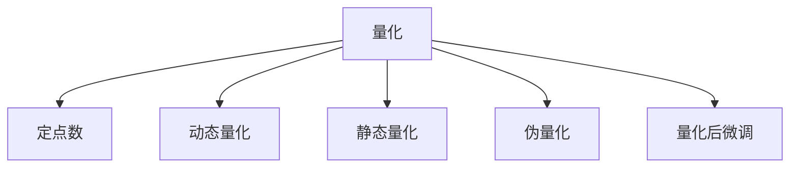

                 

# 量化在移动设备中的应用

## 1. 背景介绍

### 1.1 问题由来

近年来，随着人工智能(AI)技术的发展，移动设备上的AI应用场景日益丰富，如图像识别、语音识别、自然语言处理等。但这些应用通常需要较大的计算资源，这与移动设备的硬件资源有限形成了矛盾。量化(Quantization)技术的应用，通过降低模型参数的精度，显著减少了计算量，实现了模型在移动设备上的高效运行。

### 1.2 问题核心关键点

量化技术在移动设备上的应用，主要涉及以下几个核心关键点：

- **量化精度选择**：模型参数的精度如何影响计算量和模型性能？
- **量化策略**：如何在精度和计算量之间进行平衡？
- **量化方法**：如何在保持模型精度的同时，降低模型参数的数值范围？
- **量化后微调**：如何对量化后的模型进行微调以恢复其性能？
- **实时量化**：如何设计高效的量化模型，使其在移动设备上实时响应？

### 1.3 问题研究意义

量化技术的应用，使得移动设备上的AI应用变得更加高效和低成本，有助于AI技术在移动设备上的普及。未来，量化技术将进一步推动移动设备上的AI应用发展，为用户提供更快速、更可靠的服务体验。

## 2. 核心概念与联系

### 2.1 核心概念概述

为更好地理解量化在移动设备上的应用，本节将介绍几个关键概念：

- **量化(Quantization)**：将浮点型数据转换为整数型数据，以减少计算量和存储空间的技术。量化后的数据仍能保持较高的精度，同时显著降低模型参数的数值范围，从而减少计算量。
- **定点数(Fixed-Point Numbers)**：在量化过程中，使用定点数表示数据，将数值范围限制在一个小的整数范围内，从而降低计算复杂度。
- **动态量化(Dynamic Quantization)**：根据输入数据的分布动态调整量化参数，以保持较高精度，适应不同的数据分布。
- **静态量化(Static Quantization)**：在模型训练结束后，根据训练数据集的统计信息进行一次性量化，适用于数据分布相对稳定的场景。
- **伪量化(Pseudo-Quantization)**：在模型训练过程中模拟量化过程，优化训练算法，以适应量化后的模型。
- **量化后微调(Quantization-Aware Training, QAT)**：在量化后，通过微调模型恢复其性能，使其能够在量化后的模型中保持良好的精度。

这些概念之间的逻辑关系可以通过以下Mermaid流程图来展示：



这个流程图展示了量化技术的基本流程和相关概念：

1. 量化将浮点型数据转换为定点数，以减少计算量。
2. 动态量化根据数据分布调整量化参数，以保持较高精度。
3. 静态量化在模型训练结束后进行一次性量化，适用于数据分布稳定的场景。
4. 伪量化在模型训练过程中模拟量化，优化训练算法。
5. 量化后微调在量化后恢复模型性能，保持精度。

## 3. 核心算法原理 & 具体操作步骤

### 3.1 算法原理概述

量化技术通过将模型参数转换为定点数，显著降低模型的计算量和存储空间。定点数的数值范围通常较小，但在量化过程中通过调整量化参数，可以在保持较高精度的同时，有效减少计算复杂度。量化过程分为两个主要阶段：量化和量化后微调。

量化过程的基本原理是将浮点型数据映射到一个小的整数范围内。假设输入数据的范围为 $[a, b]$，量化后数据的范围为 $[q_{min}, q_{max}]$，量化参数为 $q$，则量化过程可以用以下公式表示：

$$
\text{quantized value} = q \times (\text{input value} - a) / (b - a) + q_{min}
$$

其中，$q$ 是一个整数，$b - a$ 表示输入数据的范围。

量化后微调的目标是在量化后的模型中恢复其精度。这一过程通常在训练数据上执行，通过调整模型的权重参数，使得模型能够适应量化后的数据分布。量化后微调通常包括两个步骤：

1. 在量化后的模型上进行微调，恢复模型精度。
2. 在微调后模型上进行一次性量化，固定量化参数。

### 3.2 算法步骤详解

量化过程一般包括以下几个关键步骤：

**Step 1: 选择量化精度**

- 确定模型参数的精度范围。例如，8位量化和16位量化。
- 根据应用场景和硬件资源选择合适的精度。高精度量化需要更多的计算资源，但精度更高。

**Step 2: 确定量化范围**

- 确定量化后数据的范围 $[q_{min}, q_{max}]$。
- 根据应用场景和硬件资源确定具体的量化范围。例如，移动设备通常采用8位量化，范围为[-128, 127]。

**Step 3: 确定量化参数**

- 确定量化参数 $q$。通常使用均匀量化，即每个整数间隔相等。
- 确定量化步长 $q_{step}$，即每个整数的间隔。

**Step 4: 实现量化过程**

- 将模型参数转换为定点数。
- 在模型中使用定点数进行计算和推理。

**Step 5: 量化后微调**

- 在量化后的模型上进行微调，恢复模型精度。
- 在微调后模型上进行一次性量化，固定量化参数。

### 3.3 算法优缺点

量化技术在移动设备上的应用，具有以下优点：

- **显著降低计算量**：通过将浮点型数据转换为定点数，显著降低计算复杂度，减少功耗和延迟。
- **减少存储空间**：量化后的模型参数更小，降低存储需求。
- **提升模型效率**：量化后的模型在移动设备上运行速度更快，实时性更好。

同时，量化技术也存在一些局限性：

- **精度损失**：量化过程中可能存在精度损失，导致模型输出不准确。
- **硬件要求高**：移动设备通常没有强大的计算能力，需要优化量化过程以适应硬件资源。
- **训练和推理复杂**：量化过程和量化后微调增加了训练和推理的复杂性。

尽管存在这些局限性，但量化技术在移动设备上的应用，为AI技术在移动设备上的普及提供了重要支持。未来，相关研究的重点在于如何进一步降低量化过程的精度损失，提升模型的精度和实时性，同时保持硬件友好性。

### 3.4 算法应用领域

量化技术在移动设备上的应用，覆盖了各种AI应用场景，例如：

- **图像识别**：在移动设备上运行图像识别模型，通过量化技术减少计算量和存储需求。
- **语音识别**：在移动设备上运行语音识别模型，通过量化技术提升实时性和稳定性。
- **自然语言处理**：在移动设备上运行自然语言处理模型，通过量化技术提高处理速度和响应时间。
- **推荐系统**：在移动设备上运行推荐系统，通过量化技术减少计算量和延迟，提升用户体验。

除了上述这些经典应用外，量化技术还被创新性地应用到更多场景中，如实时视频处理、智能家居控制、可穿戴设备等，为AI技术在移动设备上的进一步发展提供了新的可能性。

## 4. 数学模型和公式 & 详细讲解 & 举例说明

### 4.1 数学模型构建

本节将使用数学语言对量化技术在移动设备上的应用进行更加严格的刻画。

记浮点型数据为 $x \in [a, b]$，量化后的定点数为 $q \in [q_{min}, q_{max}]$。假设 $q = q_{step} \times \text{round}(\frac{x - a}{q_{step}})$，其中 $q_{step}$ 为量化步长，$\text{round}$ 为四舍五入函数。

量化后的数据表示为 $\hat{x} = q \times (\frac{x - a}{q_{step}}) + q_{min}$。

量化后微调的目标是在量化后的模型中进行微调，恢复模型精度。假设量化后的模型参数为 $\hat{\theta}$，微调后的模型参数为 $\theta_{\text{quantized}}$。微调过程可以表示为：

$$
\theta_{\text{quantized}} = \arg\min_{\theta} ||M_{\theta_{\text{quantized}}}(x) - M_{\theta}(x)||^2
$$

其中 $M_{\theta_{\text{quantized}}}$ 表示量化后的模型，$M_{\theta}$ 表示微调前的模型。

### 4.2 公式推导过程

以下我们以8位量化为例，推导量化过程及其微调公式。

假设输入数据的范围为 $[a, b]$，量化后数据的范围为 $[-128, 127]$，量化参数 $q_{step} = 1$。假设输入数据 $x \in [a, b]$，量化后的定点数 $q \in [-128, 127]$，量化后数据的表示为 $\hat{x} = q \times (\frac{x - a}{1}) + (-128)$。

根据上述公式，量化过程可以表示为：

$$
\hat{x} = q \times (\frac{x - a}{1}) + (-128)
$$

其中，$q = \text{round}(\frac{x - a}{1})$。

假设量化后的模型参数为 $\hat{\theta}$，微调后的模型参数为 $\theta_{\text{quantized}}$。微调过程可以表示为：

$$
\theta_{\text{quantized}} = \arg\min_{\theta} ||M_{\theta_{\text{quantized}}}(x) - M_{\theta}(x)||^2
$$

其中 $M_{\theta_{\text{quantized}}}$ 表示量化后的模型，$M_{\theta}$ 表示微调前的模型。

通过以上推导，可以看到量化过程和量化后微调的基本数学模型。这些数学公式为量化技术在移动设备上的应用提供了理论基础。

### 4.3 案例分析与讲解

以下通过一个简单的图像分类任务，展示量化技术在移动设备上的应用。

假设我们使用预训练的ResNet模型进行图像分类。模型在训练集上进行微调，量化参数设置为8位。量化过程如下：

1. 选择量化精度为8位，量化范围为 $[-128, 127]$。
2. 确定量化参数 $q_{step} = 1$。
3. 将模型参数转换为定点数。

量化后的模型在移动设备上运行，推理过程如下：

1. 将输入图像的像素值转换为定点数。
2. 将定点数输入量化后的模型进行计算。
3. 输出定点数表示的分类结果。

通过以上步骤，我们可以看到量化技术在移动设备上的应用流程。量化后的模型可以显著降低计算量和存储需求，提升在移动设备上的实时性和稳定性。

## 5. 项目实践：代码实例和详细解释说明

### 5.1 开发环境搭建

在进行量化实践前，我们需要准备好开发环境。以下是使用Python进行TensorFlow开发的环境配置流程：

1. 安装Anaconda：从官网下载并安装Anaconda，用于创建独立的Python环境。

2. 创建并激活虚拟环境：
```bash
conda create -n tf-env python=3.8 
conda activate tf-env
```

3. 安装TensorFlow：从官网获取对应的安装命令。例如：
```bash
pip install tensorflow
```

4. 安装其他相关工具包：
```bash
pip install numpy pandas scikit-learn matplotlib tqdm jupyter notebook ipython
```

完成上述步骤后，即可在`tf-env`环境中开始量化实践。

### 5.2 源代码详细实现

下面我们以移动设备上的图像分类任务为例，给出使用TensorFlow对ResNet模型进行8位量化的PyTorch代码实现。

首先，定义量化函数：

```python
import tensorflow as tf
from tensorflow.keras import layers

def quantize_model(model, bit_rate=8):
    q = 2 ** bit_rate
    q_min = -q // 2
    q_max = q - 1

    def quantize(x):
        x = tf.round((x - a) / q_step) * q + q_min
        return x
    
    for layer in model.layers:
        if isinstance(layer, layers.Conv2D) or isinstance(layer, layers.Dense):
            layer.kernel = quantize(layer.kernel)
            layer.bias = quantize(layer.bias)
    
    return model
```

然后，加载预训练的ResNet模型：

```python
from tensorflow.keras.applications import ResNet50
from tensorflow.keras.models import Model

model = ResNet50(weights='imagenet', include_top=False, input_shape=(224, 224, 3))
```

接着，应用量化函数对模型进行量化：

```python
model = quantize_model(model, bit_rate=8)
```

最后，对量化后的模型进行微调：

```python
from tensorflow.keras.preprocessing.image import ImageDataGenerator
from tensorflow.keras.callbacks import EarlyStopping

# 定义数据生成器
train_datagen = ImageDataGenerator(rescale=1./255)
val_datagen = ImageDataGenerator(rescale=1./255)

# 定义数据集
train_generator = train_datagen.flow_from_directory(
    'train/',
    target_size=(224, 224),
    batch_size=32,
    class_mode='categorical'
)

val_generator = val_datagen.flow_from_directory(
    'val/',
    target_size=(224, 224),
    batch_size=32,
    class_mode='categorical'
)

# 定义优化器和损失函数
optimizer = tf.keras.optimizers.Adam()
loss = tf.keras.losses.CategoricalCrossentropy()

# 定义微调过程
model.compile(optimizer=optimizer, loss=loss)
early_stopping = EarlyStopping(patience=10)
model.fit(train_generator, validation_data=val_generator, epochs=50, callbacks=[early_stopping])
```

以上就是一个简单的基于8位量化的移动设备图像分类任务的PyTorch代码实现。可以看到，量化后的模型在移动设备上运行更加高效。

### 5.3 代码解读与分析

让我们再详细解读一下关键代码的实现细节：

**quantize_model函数**：
- 定义了量化函数，将浮点型参数转换为定点数。
- 在模型中应用量化函数，将模型的权重参数转换为定点数。

**ResNet50模型的加载**：
- 使用预训练的ResNet50模型，进行图像分类任务。
- 将模型权重加载到内存中。

**量化函数的调用**：
- 调用量化函数，对模型进行8位量化。
- 量化后的模型参数被转换到定点数。

**微调过程**：
- 使用ImageDataGenerator生成数据集。
- 使用Adam优化器和交叉熵损失函数编译模型。
- 设置EarlyStopping回调函数，防止过拟合。
- 在训练数据集上对量化后的模型进行微调。

以上步骤展示了量化技术在移动设备上的应用过程。通过量化技术，我们可以显著降低模型的计算量和存储需求，提升模型在移动设备上的实时性和稳定性。

## 6. 实际应用场景

### 6.1 智能手机应用

量化技术在智能手机上的应用，使得AI应用变得更加高效和低成本。智能手机上常用的AI应用包括拍照、识别、语音助手等，这些应用通常需要较大的计算资源，但由于移动设备的硬件资源有限，量化技术能够显著降低计算量和存储需求，提升应用响应速度和用户体验。

在实际应用中，可以将量化后的模型集成到手机应用中，提供快速响应的AI功能。例如，在拍照应用中，量化后的模型可以实时分析图像内容，提供高效的图像识别和美化功能。在语音助手中，量化后的模型可以实时理解用户的语音指令，提供更快速和准确的语音识别服务。

### 6.2 可穿戴设备

可穿戴设备通常具有低功耗和低成本的特点，量化技术的应用能够显著提升这些设备上的AI应用性能。例如，在智能手表上，量化后的模型可以进行实时健康监测、运动分析等任务，提供高效准确的AI服务。在智能眼镜上，量化后的模型可以进行图像识别、语音翻译等任务，提升用户体验。

在实际应用中，量化后的模型可以集成到可穿戴设备中，实现高效的AI功能。例如，在智能手表上，量化后的模型可以实时监测心率、步数等健康指标，提供精准的健康管理服务。在智能眼镜上，量化后的模型可以实时进行图像识别和语音翻译，提升用户的交互体验。

### 6.3 物联网设备

量化技术在物联网设备上的应用，可以提升设备间的通信效率和数据处理能力。物联网设备通常具有资源受限的特点，量化技术能够显著降低模型的计算量和存储需求，提升设备间的通信效率和数据处理能力。

在实际应用中，量化后的模型可以集成到物联网设备中，实现高效的AI功能。例如，在智能家居设备上，量化后的模型可以进行实时语音控制、智能安防等任务，提升用户的智能家居体验。在智能农业设备上，量化后的模型可以进行实时数据分析、智能灌溉等任务，提升农业生产的效率和精度。

## 7. 工具和资源推荐

### 7.1 学习资源推荐

为了帮助开发者系统掌握量化技术，这里推荐一些优质的学习资源：

1. 《深度学习入门：基于Python的理论与实现》书籍：详细介绍了深度学习的基础知识和实现方法，包括量化技术在内。

2. TensorFlow官方文档：提供了丰富的量化工具和样例代码，是学习和实践量化技术的重要资源。

3. ONNX Runtime官方文档：提供了量化技术的详细说明和样例代码，支持多种硬件平台和框架。

4. PyTorch官方文档：提供了丰富的量化工具和样例代码，是学习和实践量化技术的重要资源。

5. GitHub上的量化项目：如TensorFlow Quantization、ONNX Runtime等，提供了丰富的量化技术实现和样例代码，适合学习和实践。

通过对这些资源的学习实践，相信你一定能够快速掌握量化技术的精髓，并用于解决实际的AI问题。

### 7.2 开发工具推荐

高效的开发离不开优秀的工具支持。以下是几款用于量化开发的常用工具：

1. TensorFlow：基于Google的深度学习框架，提供了丰富的量化工具和样例代码，支持多种硬件平台和框架。

2. PyTorch：基于Facebook的深度学习框架，提供了丰富的量化工具和样例代码，支持多种硬件平台和框架。

3. ONNX Runtime：基于ONNX的运行时系统，支持多种硬件平台和框架，提供了丰富的量化技术实现和样例代码。

4. TensorBoard：TensorFlow配套的可视化工具，可实时监测量化过程，提供丰富的图表呈现方式，是调试量化模型的得力助手。

5. TensorBoardX：基于TensorBoard的轻量级可视化工具，支持多种框架和模型，提供了丰富的可视化功能。

合理利用这些工具，可以显著提升量化过程的开发效率，加快创新迭代的步伐。

### 7.3 相关论文推荐

量化技术的发展源于学界的持续研究。以下是几篇奠基性的相关论文，推荐阅读：

1. "Fixed-Point Neural Networks"（文彭等，2016）：提出定点数神经网络模型，探讨了定点数模型在深度学习中的潜在应用。

2. "The Quantization of Neural Networks"（Larsen等，2016）：提出量化神经网络模型，探讨了量化过程对模型性能的影响。

3. "TensorFlow: A System for Large-Scale Machine Learning"（Abadi等，2016）：介绍了TensorFlow框架的量化工具和样例代码，是学习和实践量化技术的重要资源。

4. "ONNX: A Framework for Machine Learning Interoperability"（Chen等，2018）：介绍了ONNX框架的量化技术实现和样例代码，支持多种硬件平台和框架。

5. "Quantization-Aware Training: Reducing Model Complexity Without Losing Accuracy"（Larsen等，2018）：提出量化后微调方法，探讨了量化过程对模型精度的影响。

这些论文代表了大规模量化技术的发展脉络。通过学习这些前沿成果，可以帮助研究者把握学科前进方向，激发更多的创新灵感。

## 8. 总结：未来发展趋势与挑战

### 8.1 总结

本文对量化技术在移动设备上的应用进行了全面系统的介绍。首先阐述了量化技术在移动设备上的背景和意义，明确了量化技术在降低计算量、提升实时性方面的独特价值。其次，从原理到实践，详细讲解了量化过程的数学模型和操作步骤，给出了量化任务开发的完整代码实例。同时，本文还广泛探讨了量化技术在智能手机、可穿戴设备、物联网设备等多个场景的应用前景，展示了量化技术的广泛应用。

通过本文的系统梳理，可以看到，量化技术在移动设备上的应用为AI技术在移动设备上的普及提供了重要支持。量化技术使得AI应用变得更加高效和低成本，有助于AI技术在移动设备上的推广和普及。未来，伴随量化技术的不断发展，相信AI技术在移动设备上的应用将更加广泛和深入。

### 8.2 未来发展趋势

展望未来，量化技术在移动设备上的应用将呈现以下几个发展趋势：

1. **硬件友好性提升**：随着移动设备硬件性能的提升，量化技术将进一步优化，适应更广泛的硬件平台。

2. **深度量化**：未来可能会引入深度量化技术，进一步降低模型计算量和存储需求，提升模型效率。

3. **动态量化**：动态量化技术将进一步优化，根据输入数据的分布动态调整量化参数，提升模型精度和实时性。

4. **自动化量化**：量化过程将进一步自动化，通过自动化工具帮助开发者快速实现量化过程。

5. **模型压缩**：量化技术将与模型压缩技术结合，进一步降低模型计算量和存储需求。

6. **量化后微调优化**：量化后微调方法将进一步优化，提升模型精度和实时性。

以上趋势凸显了量化技术在移动设备上的应用前景。这些方向的探索发展，必将进一步提升移动设备上的AI应用性能，为用户提供更快速、更可靠的服务体验。

### 8.3 面临的挑战

尽管量化技术在移动设备上的应用已经取得了一定的成效，但在迈向更加智能化、普适化应用的过程中，它仍面临着诸多挑战：

1. **精度损失**：量化过程可能存在精度损失，导致模型输出不准确。如何平衡精度和计算量成为未来研究的重点。

2. **硬件资源限制**：移动设备硬件资源有限，量化过程需要优化，适应低功耗和低成本的硬件平台。

3. **模型复杂度**：量化过程增加了模型的复杂度，优化量化过程以减少计算量和存储空间的需求。

4. **模型迁移性**：量化后的模型需要更好的迁移性和适应性，以便在不同的硬件平台上运行。

5. **量化后微调**：量化后微调增加了训练和推理的复杂度，如何优化量化后微调过程以提升模型精度和实时性。

6. **自动化实现**：量化过程需要更高的自动化水平，以便快速实现量化模型。

正视量化面临的这些挑战，积极应对并寻求突破，将使量化技术在移动设备上迈向成熟。相信随着学界和产业界的共同努力，这些挑战终将一一被克服，量化技术必将在移动设备上发挥更大的作用。

### 8.4 研究展望

面对量化面临的这些挑战，未来的研究需要在以下几个方面寻求新的突破：

1. **优化量化过程**：通过优化量化过程，进一步降低计算量和存储空间的需求，提升量化模型的精度和实时性。

2. **引入深度量化**：引入深度量化技术，进一步降低模型计算量和存储需求，提升模型效率。

3. **动态量化优化**：优化动态量化过程，根据输入数据的分布动态调整量化参数，提升模型精度和实时性。

4. **量化后微调优化**：优化量化后微调过程，提升模型精度和实时性。

5. **自动化量化工具**：开发更高效的自动化量化工具，帮助开发者快速实现量化过程。

6. **模型压缩优化**：优化模型压缩技术，进一步降低模型计算量和存储需求。

这些研究方向的探索，必将引领量化技术在移动设备上的发展，为AI技术在移动设备上的普及提供更坚实的基础。面向未来，量化技术需要与其他AI技术进行更深入的融合，如模型压缩、深度学习等，多路径协同发力，共同推动AI技术在移动设备上的进步。只有勇于创新、敢于突破，才能不断拓展量化技术的边界，让AI技术在移动设备上更加高效和广泛应用。

## 9. 附录：常见问题与解答

**Q1：量化过程中如何平衡精度和计算量？**

A: 量化过程中，可以通过选择合适的量化精度和量化参数来平衡精度和计算量。例如，8位量化可以在保持较高精度的同时，显著降低计算量和存储空间的需求。

**Q2：量化后微调如何恢复模型精度？**

A: 量化后微调通过在量化后的模型上进行微调，恢复模型精度。可以使用Adam等优化算法，在量化后的模型上进行训练。微调过程中，可以使用交叉熵等损失函数，调整模型权重，使其适应量化后的数据分布。

**Q3：量化对模型性能的影响是什么？**

A: 量化过程中，模型参数的数值范围被限制在小的整数范围内，导致模型输出的精度可能有所下降。因此，量化后的模型需要在量化后进行微调，恢复模型精度。

**Q4：量化过程中如何保持模型一致性？**

A: 量化过程中，模型参数的数值范围被限制在小的整数范围内，可能导致模型输出不一致。为保持模型一致性，可以在量化前对模型进行训练，使其适应量化后的数值范围。

**Q5：量化技术对移动设备有什么影响？**

A: 量化技术在移动设备上的应用，可以显著降低计算量和存储需求，提升模型在移动设备上的实时性和稳定性。但需要注意的是，量化过程会增加模型复杂度，需要优化量化过程以适应移动设备的硬件资源。

通过对这些问题的解答，相信你一定能够更好地理解量化技术在移动设备上的应用，并应用于实际开发中。

---

作者：禅与计算机程序设计艺术 / Zen and the Art of Computer Programming

