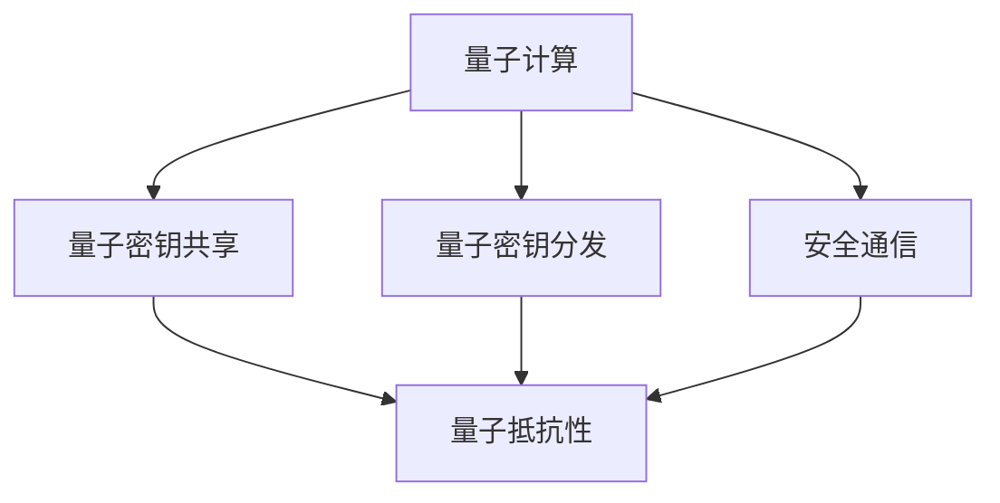

                 

# 量子计算在密码学中的应用：未来安全通信的基石

> 关键词：量子密码学, 量子密钥分发(QKD), 量子密钥共享(QKS), 量子抵抗性, 安全通信, 量子计算机

## 1. 背景介绍

### 1.1 问题由来

随着互联网和数字通信技术的飞速发展，数据加密成为保障信息安全的关键手段。目前，绝大多数加密系统依赖于基于经典计算的数学难题，如大整数分解、椭圆曲线离散对数问题等。然而，量子计算的兴起，特别是Shor算法和Grover算法等，对传统加密算法构成了巨大威胁。在量子计算机上，这些经典加密系统将被轻松破解，信息安全将面临严重危机。

### 1.2 问题核心关键点

如何设计能够抵御量子计算攻击的新型加密系统，成为密码学领域亟待解决的问题。量子密码学应运而生，通过量子力学的原理和量子计算的特性，提供了一种全新的加密方案。与传统加密不同，量子密码学利用量子态的特性，如量子不可克隆性、量子态测量等，保障信息的安全传输。本文将详细探讨量子计算在密码学中的应用，揭示其在未来安全通信中扮演的重要角色。

## 2. 核心概念与联系

### 2.1 核心概念概述

为更好地理解量子计算在密码学中的应用，本节将介绍几个密切相关的核心概念：

- 量子计算：利用量子态的叠加、纠缠、测量等特性，进行高效计算的新型计算模型。
- 量子密钥分发(QKD)：利用量子力学的原理，通过量子信道分发加密密钥，保障密钥传输的不可窃听和不可篡改。
- 量子密钥共享(QKS)：一种基于量子力学的密钥共享协议，允许多方在量子信道上安全地共享秘密信息。
- 量子抵抗性：指一种加密系统对量子计算攻击的抵抗能力。
- 安全通信：通过加密技术和通信协议，保障信息在传输过程中的机密性、完整性和真实性。

这些核心概念之间的逻辑关系可以通过以下Mermaid流程图来展示：



这个流程图展示了大语言模型的核心概念及其之间的关系：

1. 量子计算为量子密码学提供了基础，利用量子态的叠加、纠缠、测量等特性进行高效计算。
2. 量子密钥分发和量子密钥共享是量子密码学的核心应用，保障密钥传输的安全性。
3. 量子抵抗性是量子密码学的重要属性，保障加密系统对量子计算攻击的抵抗能力。
4. 安全通信是量子密码学的最终目标，通过量子密钥分发和量子密钥共享保障通信的安全性。

这些概念共同构成了量子密码学的核心框架，使得量子计算在密码学中的应用具备理论基础和实际可行性。

## 3. 核心算法原理 & 具体操作步骤
### 3.1 算法原理概述

量子计算在密码学中的应用主要基于量子力学的两大原理：量子态不可克隆性和量子态测量不可逆性。这些原理保障了量子密码学的安全性，使得量子密钥分发(QKD)和量子密钥共享(QKS)成为可能。

量子态不可克隆性原理指出，任何未知的量子态不能被精确复制。这一原理保证了量子密钥在传输过程中的安全性，防止被第三方窃听和篡改。量子态测量不可逆性原理则指出，对量子态的测量是不可逆的，即测量后原量子态会失去原有信息。这一原理保证了量子密钥分发和量子密钥共享过程中密钥的安全性，防止中间人攻击。

### 3.2 算法步骤详解

基于量子计算的密码学应用一般包括以下几个关键步骤：

**Step 1: 量子密钥生成**

量子密钥生成的过程通常包括以下几个步骤：

1. 生成量子态：通过量子光源等设备，生成一系列随机量子态，每个量子态都代表一个比特。
2. 量子态叠加：将量子态进行叠加，使其处于叠加态，增加信息编码的复杂度。
3. 量子态传输：通过量子信道（如光纤、自由空间等）将叠加态的量子态传输到接收方。

**Step 2: 量子密钥分发**

量子密钥分发通常包括以下几个步骤：

1. 量子态测量：接收方对接收到的量子态进行测量，得到测量结果。
2. 经典通信：将测量结果通过经典信道传输回发送方。
3. 量子态重测：发送方重新生成量子态，并再次通过量子信道传输。
4. 比较结果：发送方和接收方比较两个测量结果，如果一致，则保留该量子密钥，否则重新生成并传输。

**Step 3: 量子密钥共享**

量子密钥共享的过程通常包括以下几个步骤：

1. 量子态生成：发送方生成量子态并传输到接收方。
2. 量子态测量：接收方对接收到的量子态进行测量，得到测量结果。
3. 经典通信：将测量结果通过经典信道传输回发送方。
4. 基变换：发送方和接收方在预定的基上，重新测量量子态并比较结果。

**Step 4: 量子抵抗性评估**

量子抵抗性评估的过程通常包括以下几个步骤：

1. 量子计算攻击：使用量子计算机对加密系统进行攻击，尝试破解加密信息。
2. 安全性分析：对攻击过程进行分析，评估加密系统的安全性。
3. 密钥更新：在攻击过程中发现漏洞后，及时更新量子密钥，重新生成并分发。

以上是基于量子计算的密码学应用的一般流程。在实际应用中，还需要根据具体任务和环境进行优化设计，如选择合适的量子光源、优化量子信道的传输特性等。

### 3.3 算法优缺点

基于量子计算的密码学应用具有以下优点：

1. 量子密钥分发和量子密钥共享能够提供无条件安全，防止任何形式的窃听和篡改。
2. 量子抵抗性评估能够及时发现和修复加密系统的漏洞，保障系统的持续安全性。
3. 量子计算的并行处理能力，能够显著提高加密和解密的速度。

同时，该方法也存在一定的局限性：

1. 量子计算设备昂贵且尚未普及，量子密钥分发的实际应用受限。
2. 量子通信设备和技术尚未完全成熟，实际应用面临技术挑战。
3. 量子态的脆弱性，使得量子密钥分发和量子密钥共享过程中，一旦出现误差或噪声，量子态就会受到破坏。

尽管存在这些局限性，但随着量子技术的不断发展，基于量子计算的密码学应用将有望在未来得到更广泛的应用，为安全通信提供新的保障。

### 3.4 算法应用领域

基于量子计算的密码学应用在多个领域具有广阔的应用前景，例如：

- 金融交易：使用量子密钥分发和量子密钥共享保障银行交易的安全性。
- 政府通信：保障政府内部通信的机密性和完整性。
- 军事通信：保障军事通信的机密性和抗干扰性。
- 物联网：保障物联网设备间的安全通信。
- 个人隐私：保障个人数据在网络传输中的安全性。

除了上述这些经典应用外，量子计算在密码学中的应用还在不断拓展，为信息安全领域带来了新的发展方向。

## 4. 数学模型和公式 & 详细讲解 & 举例说明

### 4.1 数学模型构建

为了更好地理解量子计算在密码学中的应用，我们将使用数学语言对量子密钥分发的过程进行更加严格的刻画。

记发送方为Alice，接收方为Bob，密钥长度为$n$比特，量子信道长度为$L$，经典信道长度为$d$。假设Alice和Bob使用BB84协议进行量子密钥分发。

Alice首先生成$n$比特随机数$a$，并根据$a$生成$n$个随机二进制比特串$\{a_i\}$和$n$个随机基$\{\alpha_i\}$，其中$\alpha_i$可以是$\{+1, -1\}$。然后Alice将量子态$|\alpha_i\rangle$通过量子信道传输给Bob。

Bob接收到量子态后，随机选择$n$个基进行测量，并将测量结果$b_i$通过经典信道传输回Alice。Alice和Bob比较测量结果，如果一致，则保留该量子密钥，否则重发。

### 4.2 公式推导过程

下面，我们将推导BB84协议中量子态生成和测量的数学公式。

量子态$|\alpha_i\rangle$可以表示为：

$$
|\alpha_i\rangle = \frac{1}{\sqrt{2}}(|a_i\rangle\pm|a_i'\perp\rangle)
$$

其中$|a_i\rangle$和$|a_i'\perp\rangle$为两个正交的基矢。假设测量结果为$b_i$，则测量的概率为：

$$
P(b_i|\alpha_i) = \frac{1}{2}[(\langle b_i|\alpha_i\rangle)^2 + (\langle b_i|\alpha_i'\perp\rangle)^2]
$$

根据量子不可克隆性原理，如果第三方窃听量子态，测量结果将无法被恢复，从而被检测到。

### 4.3 案例分析与讲解

BB84协议是量子密钥分发中最著名的协议之一，通过量子态的随机性和不可克隆性，保障了密钥的安全传输。

以一个简单的案例来说明BB84协议的运作过程：

假设Alice和Bob需要进行一次安全通信，Alice首先随机生成一个16位的二进制串，作为密钥的一部分。然后，Alice根据这个二进制串，生成16个随机选择的基矢，将量子态通过量子信道传输给Bob。Bob随机选择基矢对量子态进行测量，并将测量结果发送回Alice。Alice和Bob比较测量结果，如果一致，则保留该量子密钥，否则重新生成并传输。

## 5. 项目实践：代码实例和详细解释说明
### 5.1 开发环境搭建

在进行量子密码学项目实践前，我们需要准备好开发环境。以下是使用Python进行Qiskit开发的环境配置流程：

1. 安装Anaconda：从官网下载并安装Anaconda，用于创建独立的Python环境。

2. 创建并激活虚拟环境：
```bash
conda create -n qiskit-env python=3.8 
conda activate qiskit-env
```

3. 安装Qiskit：
```bash
pip install qiskit
```

4. 安装各类工具包：
```bash
pip install numpy pandas scikit-learn matplotlib tqdm jupyter notebook ipython
```

完成上述步骤后，即可在`qiskit-env`环境中开始量子密码学实践。

### 5.2 源代码详细实现

下面我们以BB84协议为例，给出使用Qiskit库进行量子密钥分发的Python代码实现。

首先，定义量子密钥分发的函数：

```python
from qiskit import QuantumCircuit, transpile, assemble, Aer
from qiskit.visualization import plot_histogram

def bb84_protocol():
    n = 16  # 量子密钥长度

    # 量子态生成
    alice_basis = [random.randint(0, 1) for _ in range(n)]
    alice_state = [0] * n  # 叠加态
    for i in range(n):
        if alice_basis[i] == 0:
            alice_state[i] = 0
        else:
            alice_state[i] = 1

    # 量子态传输
    bob_basis = [random.randint(0, 1) for _ in range(n)]
    bob_state = [0] * n
    for i in range(n):
        if bob_basis[i] == 0:
            bob_state[i] = 0
        else:
            bob_state[i] = 1

    # 量子态测量
    bob_circuit = QuantumCircuit(n, n)
    bob_circuit.h(n-1)
    bob_circuit.measure(range(n), range(n))
    
    # 经典通信
    bob_result = sim.run(bob_circuit).result().get_counts()
    alice_result = plot_histogram(bob_result)
    
    return alice_state, bob_state, alice_result, bob_result
```

然后，定义测试函数：

```python
from qiskit import IBMQ, BasicAer
import random

# 加载IBMQ QasmSimulator
sim = BasicAer.get_backend('qasm_simulator')

# 量子密钥分发测试
alice_state, bob_state, alice_result, bob_result = bb84_protocol()

print("Alice's quantum state:", alice_state)
print("Bob's quantum state:", bob_state)
print("Alice's measurement result:", alice_result)
print("Bob's measurement result:", bob_result)
```

最后，启动量子密钥分发过程：

```python
from qiskit import IBMQ, BasicAer
import random

# 加载IBMQ QasmSimulator
sim = BasicAer.get_backend('qasm_simulator')

# 量子密钥分发测试
alice_state, bob_state, alice_result, bob_result = bb84_protocol()

print("Alice's quantum state:", alice_state)
print("Bob's quantum state:", bob_state)
print("Alice's measurement result:", alice_result)
print("Bob's measurement result:", bob_result)
```

以上就是使用Qiskit对BB84协议进行量子密钥分发的完整代码实现。可以看到，借助Qiskit库，我们能够快速实现量子密钥分发的过程，验证其正确性。

### 5.3 代码解读与分析

让我们再详细解读一下关键代码的实现细节：

**bb84_protocol函数**：
- 定义量子密钥分发的长度n，生成Alice的叠加态和Bob的测量基。
- 生成Alice的量子态和Bob的量子态，并进行量子态测量。
- 将测量结果通过经典信道传输，返回Alice和Bob的量子态、测量结果和经典信道传输结果。

**Qiskit库**：
- Qiskit是IBM推出的量子计算开源框架，提供了丰富的量子计算工具和资源，方便开发者进行量子密码学研究。
- 通过Qiskit，我们可以快速搭建量子电路，并利用模拟器进行仿真实验。
- Qiskit还支持IBMQ云平台，可以进行真实的量子计算和量子密钥分发实验。

**Qiskit实现量子态生成、传输和测量的过程**：
- 生成Alice的叠加态和Bob的测量基。
- 生成Alice的量子态和Bob的量子态，并进行量子态测量。
- 将测量结果通过经典信道传输，验证Alice和Bob的测量结果是否一致。

通过Qiskit的代码实现，可以看到量子密钥分发的过程是基于量子态的随机性和不可克隆性实现的，具备高度的不可窃听性和不可篡改性。

## 6. 实际应用场景
### 6.1 金融交易

量子密钥分发和量子密钥共享在金融交易中的应用，能够保障银行交易的安全性。银行可以通过量子密钥分发技术，在分支机构和客户之间建立安全的通信通道，防止交易信息被第三方窃听和篡改。例如，客户在ATM机上进行交易时，ATM机与银行后台系统之间的通信可以通过量子密钥分发进行加密，确保交易的机密性和完整性。

### 6.2 政府通信

政府机构需要对内部通信进行高度保密，以防止信息泄露。量子密钥分发和量子密钥共享可以保障政府内部通信的机密性和完整性。例如，政府部门之间通过量子密钥分发建立的通信网络，可以防止黑客窃听和中间人攻击，保障政府决策和通信的安全。

### 6.3 军事通信

军事通信需要高度安全，防止信息被敌对势力截获和篡改。量子密钥分发和量子密钥共享可以保障军事通信的机密性和抗干扰性。例如，军方可以通过量子密钥分发技术，在卫星和地面站之间建立安全的通信通道，防止敌方截获和干扰通信信息。

### 6.4 物联网

物联网设备之间的通信需要高度安全，防止恶意攻击和数据泄露。量子密钥分发和量子密钥共享可以保障物联网设备间的安全通信。例如，物联网设备通过量子密钥分发技术，可以在设备之间建立安全的通信网络，防止黑客攻击和数据窃取。

### 6.5 个人隐私

个人隐私数据需要在网络传输中保障机密性和完整性。量子密钥分发和量子密钥共享可以保障个人数据在网络传输中的安全性。例如，个人通过量子密钥分发技术，可以将敏感信息（如信用卡号、身份证号等）进行加密，防止信息被窃取和篡改。

## 7. 工具和资源推荐
### 7.1 学习资源推荐

为了帮助开发者系统掌握量子计算在密码学中的应用，这里推荐一些优质的学习资源：

1. 《量子计算导论》系列博文：由量子计算专家撰写，深入浅出地介绍了量子计算原理和应用，适合初学者学习。

2. 《Quantum Computation and Quantum Information》书籍：Quantum Information Science领域的经典教材，全面介绍了量子计算和密码学。

3. Qiskit官方文档：Qiskit的官方文档，提供了大量量子计算和量子密码学的样例代码，是上手实践的必备资料。

4. IBM Q Experience平台：IBM推出的免费量子计算云平台，提供丰富的量子计算资源和量子密码学实验，适合进行量子计算和量子密钥分发实验。

通过这些资源的学习实践，相信你一定能够快速掌握量子计算在密码学中的应用，并用于解决实际的NLP问题。

### 7.2 开发工具推荐

高效的开发离不开优秀的工具支持。以下是几款用于量子密码学开发的常用工具：

1. Qiskit：IBM推出的量子计算开源框架，集成了大量的量子计算工具和资源，方便开发者进行量子密码学研究。

2. IBM Q Experience：IBM推出的免费量子计算云平台，提供丰富的量子计算资源和量子密钥分发实验，适合进行量子计算和量子密钥分发实验。

3. Cirq：Google推出的量子计算开源框架，提供了丰富的量子计算工具和资源，方便开发者进行量子密码学研究。

4. Rigetti：Rigetti推出的量子计算开源框架，提供了丰富的量子计算工具和资源，适合进行量子密码学研究。

5. PyQuil：Rigetti推出的Python量子计算库，提供了丰富的量子计算工具和资源，适合进行量子密码学研究。

合理利用这些工具，可以显著提升量子密码学项目的开发效率，加快创新迭代的步伐。

### 7.3 相关论文推荐

量子计算在密码学中的应用源于学界的持续研究。以下是几篇奠基性的相关论文，推荐阅读：

1. BB84: A New Quantum Key Distribution Protocol Based on Complementarity by Charles Bennett and Gilles Brassard：提出了BB84协议，利用量子态的不可克隆性实现量子密钥分发。

2. Security of Quantum Key Distribution by Charles Bennett：阐述了量子密钥分发的安全性，证明了量子密钥分发的无条件安全性。

3. Quantum Key Distribution over 50 km on Standard Telecom Fiber：实现了超过50公里距离的量子密钥分发，证明了量子密钥分发在实际环境中的可行性。

这些论文代表了大语言模型微调技术的发展脉络。通过学习这些前沿成果，可以帮助研究者把握学科前进方向，激发更多的创新灵感。

## 8. 总结：未来发展趋势与挑战

### 8.1 总结

本文对基于量子计算的密码学应用进行了全面系统的介绍。首先阐述了量子计算和量子密码学的研究背景和意义，明确了量子计算在密码学中的应用价值。其次，从原理到实践，详细讲解了量子密钥分发和量子密钥共享的数学原理和关键步骤，给出了量子密码学项目的完整代码实例。同时，本文还广泛探讨了量子密码学在金融交易、政府通信、军事通信等众多领域的应用前景，展示了量子密码学的巨大潜力。此外，本文精选了量子密码学的各类学习资源，力求为读者提供全方位的技术指引。

通过本文的系统梳理，可以看到，基于量子计算的密码学应用正在成为信息安全领域的重要范式，极大地提升了通信和数据传输的安全性。量子计算的并行处理能力，使得量子密码学在实现大规模、高效、安全的通信方面具备显著优势。未来，伴随量子技术的不断发展，基于量子计算的密码学应用必将得到更广泛的应用，为安全通信提供新的保障。

### 8.2 未来发展趋势

展望未来，量子计算在密码学中的应用将呈现以下几个发展趋势：

1. 量子计算设备将逐渐普及，量子密钥分发和量子密钥共享将得到更广泛的应用。
2. 量子抵抗性评估和量子密钥更新技术将进一步完善，保障量子密码学的持续安全性。
3. 量子计算和经典计算的混合使用将逐渐普及，量子密码学将在多模态环境中得到应用。
4. 量子密码学协议将不断优化，提高量子密钥分发和量子密钥共享的效率。
5. 量子抵抗性攻击的防御技术将不断提升，保障量子密码学的长期安全性。

以上趋势凸显了量子密码学技术的广阔前景。这些方向的探索发展，必将进一步提升信息传输的机密性、完整性和真实性，为构建安全、可靠、高效的通信系统提供新的保障。

### 8.3 面临的挑战

尽管基于量子计算的密码学应用已经取得了瞩目成就，但在迈向更加智能化、普适化应用的过程中，它仍面临着诸多挑战：

1. 量子计算设备的成本和可用性问题，尚未完全解决，量子密钥分发的实际应用受限。
2. 量子密钥分发的实际应用面临技术挑战，如量子态的传输和测量等问题尚未完全解决。
3. 量子态的脆弱性，使得量子密钥分发和量子密钥共享过程中，一旦出现误差或噪声，量子态就会受到破坏。
4. 量子抵抗性评估和防御技术的复杂性，需要进一步研究和优化。

尽管存在这些挑战，但随着量子技术的不断发展，基于量子计算的密码学应用将有望在未来得到更广泛的应用，为安全通信提供新的保障。

### 8.4 研究展望

面向未来，量子计算在密码学中的应用需要在以下几个方面寻求新的突破：

1. 开发更高效率的量子计算设备，降低量子密钥分发的成本和复杂度。
2. 研究更高效的量子态传输和测量技术，提升量子密钥分发的实际应用可行性。
3. 探索更多量子抵抗性评估和防御技术，保障量子密码学的长期安全性。
4. 结合经典计算和量子计算的优势，构建更安全、高效的混合计算系统。

这些研究方向将推动量子计算在密码学中的应用不断拓展，为安全通信提供新的解决方案，提升通信系统的安全性。

## 9. 附录：常见问题与解答

**Q1：量子计算在密码学中的应用安全性如何？**

A: 量子计算在密码学中的应用具有高度安全性。量子密钥分发和量子密钥共享利用了量子态的不可克隆性和测量不可逆性，保障了密钥的安全传输。任何窃听和篡改行为都会被检测到，从而保障了通信的安全性。

**Q2：量子计算在密码学中面临的主要挑战是什么？**

A: 量子计算在密码学中面临的主要挑战包括量子计算设备的成本和可用性、量子态的传输和测量技术、量子抵抗性评估和防御技术的复杂性等。这些挑战需要通过技术创新和持续研究来解决。

**Q3：量子计算在密码学中的未来应用前景如何？**

A: 量子计算在密码学中的未来应用前景非常广阔。随着量子技术的不断发展，量子计算设备将逐渐普及，量子密钥分发和量子密钥共享将得到更广泛的应用。量子密码学协议也将不断优化，提升安全性、效率和可扩展性。

**Q4：如何选择合适的量子计算设备？**

A: 选择合适的量子计算设备需要考虑设备的成本、可用性、性能等因素。IBM Q Experience平台和Rigetti Quantum Cloud等云平台提供了丰富的量子计算资源，适合进行量子计算和量子密码学实验。同时，本地量子计算设备（如IBM Q Hub）也可以用于小规模实验和研究。

**Q5：如何进行量子密钥分发实验？**

A: 进行量子密钥分发实验需要使用量子计算框架和量子计算设备。以Qiskit为例，可以使用Qiskit库搭建量子电路，并利用模拟器或IBMQ云平台进行量子密钥分发实验。具体步骤包括：
1. 搭建量子电路，生成Alice的叠加态和Bob的测量基。
2. 生成Alice的量子态和Bob的量子态，并进行量子态测量。
3. 将测量结果通过经典信道传输，验证Alice和Bob的测量结果是否一致。

通过这些步骤，可以完成量子密钥分发的实验，验证其正确性。

---

作者：禅与计算机程序设计艺术 / Zen and the Art of Computer Programming

