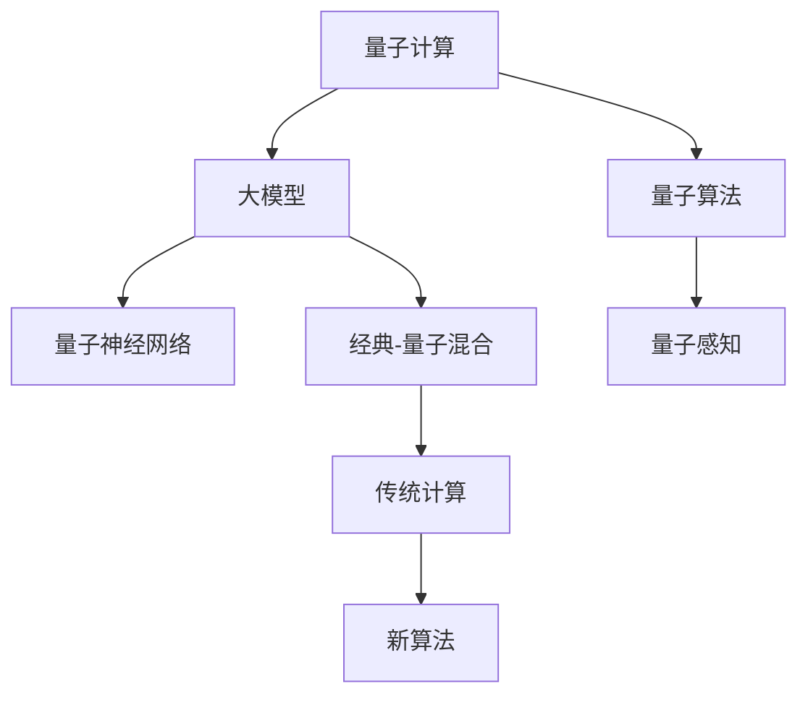

                 

# 量子计算对大模型发展的潜在影响

## 1. 背景介绍

### 1.1 问题由来

近年来，随着深度学习技术和大规模数据集的不断发展，基于神经网络的大模型在多个领域取得了显著突破，如自然语言处理、计算机视觉、语音识别等。这些模型在参数量、计算能力和精度上都有显著提升，成为推动人工智能发展的核心驱动力。

然而，目前的大模型仍然受限于传统计算架构的物理限制。例如，在处理大规模矩阵运算时，大模型需要耗费大量计算资源，如GPU和TPU。这在一定程度上制约了大模型的进一步发展。量子计算作为一种全新的计算范式，具备超快的计算速度和并行处理能力，为解决这些瓶颈提供了新的可能性。

### 1.2 问题核心关键点

量子计算对大模型发展的潜在影响主要集中在以下几个方面：

- **计算速度**：量子计算机可以处理传统计算机无法处理的大量复杂计算，提供远超经典计算的速度。
- **并行计算**：量子计算机能够并行处理多个计算任务，显著提高计算效率。
- **计算精度**：量子计算机在某些特定计算任务上可能提供更高的计算精度。
- **计算复杂度**：量子计算可以处理传统计算难以解决的复杂问题。

这些优势可能会在未来重塑大模型的计算架构和应用范围，带来全新的发展机遇。

### 1.3 问题研究意义

研究量子计算对大模型的潜在影响，对于推动人工智能技术的未来发展具有重要意义：

1. **加速大模型训练**：量子计算可以大幅提升大模型训练速度，缩短开发周期，加速新模型、新算法的研发和应用。
2. **提高大模型性能**：量子计算提供更高的计算精度和处理能力，有助于提升大模型的性能和效果。
3. **拓展应用场景**：量子计算可以处理更复杂的计算任务，拓展大模型的应用范围，推动更多领域的技术创新。
4. **促进跨学科融合**：量子计算与传统计算的结合，将促进计算科学、量子物理、人工智能等领域的交叉融合，催生新的研究方向和方法。

本文旨在深入探讨量子计算对大模型发展的潜在影响，从理论到实践，全面分析量子计算与大模型的结合路径和应用前景。

## 2. 核心概念与联系

### 2.1 核心概念概述

为更好地理解量子计算对大模型发展的潜在影响，本节将介绍几个密切相关的核心概念：

- **量子计算(QC)**：利用量子比特(Qubit)和量子门(Q-gate)进行计算的一种新型计算模式，具备超快的计算速度和并行处理能力。
- **大模型(LLMs)**：如BERT、GPT、T5等，通过大规模数据集进行预训练的深度学习模型，具备强大的语言理解和生成能力。
- **量子算法(QA)**：专门设计用于量子计算机上执行的算法，如量子近似优化算法(QAOA)、量子蒙特卡罗算法等，用于解决特定问题。
- **量子神经网络(QNNs)**：将量子计算与神经网络相结合的模型，能够在特定任务上提供更好的性能。
- **量子感知(QA)**：利用量子计算的特性，改进传统神经网络的结构和训练方法，提升模型的感知能力和学习效率。

这些核心概念之间的逻辑关系可以通过以下Mermaid流程图来展示：



这个流程图展示了大模型与量子计算之间的关系及其与其他概念的联系：

1. 大模型通过量子计算可以获得更高的计算效率和精度。
2. 量子算法专门用于量子计算，提供优化解决方案。
3. 量子神经网络是大模型在量子计算环境下的形式。
4. 量子感知利用量子计算的特性改进传统神经网络。
5. 量子计算与传统计算相结合，催生新的算法和模型。

## 3. 核心算法原理 & 具体操作步骤
### 3.1 算法原理概述

量子计算对大模型的潜在影响主要体现在以下几个方面：

1. **加速模型训练**：量子计算可以显著提高矩阵乘法等基础运算的速度，从而加速大模型的训练过程。
2. **提升模型精度**：量子计算在一些特定计算任务上可能提供更高的精度，有助于提升模型的性能。
3. **处理复杂问题**：量子计算可以处理传统计算难以解决的复杂问题，拓展大模型的应用范围。
4. **优化模型结构**：量子计算的特性可以用于改进传统神经网络的结构，提升模型的感知能力和学习效率。

### 3.2 算法步骤详解

基于量子计算对大模型的潜在影响，量子计算在大模型应用中的具体操作步骤包括以下几个关键步骤：

**Step 1: 选择合适的量子算法**
- 根据具体任务选择合适的量子算法。例如，使用量子近似优化算法(QAOA)处理组合优化问题，使用量子蒙特卡罗算法处理高维物理模拟等。

**Step 2: 设计量子神经网络架构**
- 设计适用于量子计算环境下的神经网络架构。例如，使用量子逻辑门来替代传统神经网络中的激活函数，引入量子叠加态和量子纠缠等特性，提升模型的表达能力和训练效率。

**Step 3: 实现量子感知技术**
- 将量子计算的特性应用于传统神经网络的感知过程。例如，使用量子态作为输入特征，增强模型的数据处理能力和泛化能力。

**Step 4: 应用经典-量子混合计算**
- 将量子计算与经典计算相结合，构建混合计算模型。例如，利用量子计算机加速大模型的训练，而保留经典计算用于模型的推理和部署。

**Step 5: 优化模型参数**
- 在混合计算模型中，优化模型的参数以适应量子计算环境。例如，调整模型结构、选择最优的量子算法参数等。

**Step 6: 测试与验证**
- 在实际数据集上测试量子计算对大模型的影响，评估模型的性能和效果。例如，使用经典数据集评估量子感知技术的效果，使用实际任务数据集评估混合计算模型的效果。

### 3.3 算法优缺点

量子计算对大模型发展的潜在影响主要具有以下优缺点：

**优点：**

1. **计算速度大幅提升**：量子计算机能够在多项式时间内解决传统计算中NP难题，加速大模型的训练和推理过程。
2. **精度和鲁棒性提升**：量子计算在一些特定计算任务上可能提供更高的精度和更好的鲁棒性。
3. **处理复杂问题能力增强**：量子计算可以处理传统计算难以解决的复杂问题，拓展大模型的应用范围。
4. **优化模型结构**：量子计算的特性可以用于改进传统神经网络的结构，提升模型的感知能力和学习效率。

**缺点：**

1. **硬件和算法复杂性高**：量子计算的硬件和算法实现复杂，需要跨学科的深度合作。
2. **错误率和量子态控制难度大**：量子计算中存在量子态退相干等问题，需要复杂的错误修正和量子态控制技术。
3. **数据处理和存储问题**：量子计算需要大量的数据进行训练，且对数据处理和存储的要求较高。
4. **成本和资源需求大**：量子计算的设备和资源成本较高，且需要大规模的冷却和环境控制。

尽管存在这些挑战，量子计算对大模型发展的潜在影响仍然不可忽视，其带来的计算速度和精度提升，可能会在多个领域带来革命性的变化。

### 3.4 算法应用领域

量子计算对大模型的潜在影响将在以下几个领域得到广泛应用：

1. **自然语言处理(NLP)**：量子计算可以加速大模型的训练和推理过程，提升语言模型的性能和效果。例如，在文本分类、机器翻译、情感分析等任务上，量子计算能够提供更快的处理速度和更高的精度。
2. **计算机视觉(CV)**：量子计算可以处理复杂的图像识别和处理任务，提升计算机视觉模型的性能。例如，在目标检测、图像分割、人脸识别等任务上，量子计算能够提供更准确的计算结果。
3. **语音识别(SR)**：量子计算可以加速语音信号的处理和分析，提升语音识别模型的性能。例如，在自动语音识别、语音合成等任务上，量子计算能够提供更高效的处理速度和更高的识别准确率。
4. **量子机器学习(QML)**：量子计算和传统机器学习的结合，可以在特定任务上提供更好的性能。例如，在量子近似优化算法、量子蒙特卡罗算法等量子计算算法的基础上，设计新的机器学习模型，提升模型的训练效率和精度。
5. **物理模拟和计算化学**：量子计算可以处理复杂的物理模拟和计算化学问题，提升这些领域的研究能力和应用效果。例如，在量子模拟中，量子计算可以提供更准确的计算结果和更高效的计算速度。

## 4. 数学模型和公式 & 详细讲解 & 举例说明

### 4.1 数学模型构建

在本节中，我们将通过数学语言对量子计算对大模型的潜在影响进行更加严格的刻画。

假设一个通用的大模型 $M$，在输入 $x$ 上的输出为 $y$，即 $y = M(x)$。现在考虑在量子计算环境中，如何使用量子算法和量子神经网络对模型进行优化。

### 4.2 公式推导过程

以下是使用数学语言对量子计算对大模型影响的推导过程。

**Step 1: 选择量子算法**

假设选择量子近似优化算法(QAOA)处理组合优化问题。QAOA的优化目标函数为：

$$
E_{\text{QAOA}}(x) = \langle x|H_{\text{ansatz}}|0\rangle + \langle x|H_{\text{cost}}|0\rangle
$$

其中，$H_{\text{ansatz}}$ 为量子计算的ansatz哈密顿量，$H_{\text{cost}}$ 为任务特定的成本哈密顿量，$|0\rangle$ 为量子比特的初始状态。

**Step 2: 设计量子神经网络**

假设设计一个适用于量子计算的神经网络 $N_{\text{Q}}(x)$，其结构如下：

$$
N_{\text{Q}}(x) = \sum_{i=1}^n w_i\sigma(\theta_i\cdot x)
$$

其中，$\sigma$ 为量子逻辑门，$w_i$ 为权重，$\theta_i$ 为可调参数。

**Step 3: 实现量子感知技术**

假设引入量子态作为输入特征，增强模型的数据处理能力。设输入为量子比特状态 $|\psi\rangle$，则模型输出为：

$$
y = M_{\text{Q}}(|\psi\rangle) = \langle\psi|N_{\text{Q}}|0\rangle
$$

**Step 4: 应用经典-量子混合计算**

假设在经典-量子混合计算中，模型先经过经典计算得到初始状态 $|\psi\rangle$，然后应用量子计算得到最终输出 $y$。

**Step 5: 优化模型参数**

假设优化模型参数 $\theta_i$，使其满足量子计算的要求。例如，使用梯度下降算法更新参数：

$$
\theta_i \leftarrow \theta_i - \eta\nabla_{\theta_i} E_{\text{QAOA}}(x)
$$

### 4.3 案例分析与讲解

**案例1: 文本分类**

在文本分类任务中，使用量子计算和量子神经网络优化BERT模型。假设选择QAOA算法优化分类器的损失函数，模型结构为：

$$
M_{\text{Q}}(x) = \langle x|H_{\text{ansatz}}|0\rangle + \langle x|H_{\text{cost}}|0\rangle
$$

其中，$H_{\text{ansatz}}$ 为BERT模型的Transformer层，$H_{\text{cost}}$ 为分类任务的成本函数。

**案例2: 图像识别**

在图像识别任务中，使用量子计算优化卷积神经网络(CNN)。假设选择QAOA算法优化CNN的损失函数，模型结构为：

$$
M_{\text{Q}}(x) = \langle x|H_{\text{ansatz}}|0\rangle + \langle x|H_{\text{cost}}|0\rangle
$$

其中，$H_{\text{ansatz}}$ 为CNN的卷积层和池化层，$H_{\text{cost}}$ 为分类任务的成本函数。

## 5. 项目实践：代码实例和详细解释说明

### 5.1 开发环境搭建

在进行量子计算对大模型的实践前，我们需要准备好开发环境。以下是使用Python进行PyTorch和Qiskit开发的环境配置流程：

1. 安装Anaconda：从官网下载并安装Anaconda，用于创建独立的Python环境。

2. 创建并激活虚拟环境：
```bash
conda create -n pytorch-env python=3.8 
conda activate pytorch-env
```

3. 安装PyTorch：根据CUDA版本，从官网获取对应的安装命令。例如：
```bash
conda install pytorch torchvision torchaudio cudatoolkit=11.1 -c pytorch -c conda-forge
```

4. 安装Qiskit：
```bash
pip install qiskit
```

5. 安装各类工具包：
```bash
pip install numpy pandas scikit-learn matplotlib tqdm jupyter notebook ipython
```

完成上述步骤后，即可在`pytorch-env`环境中开始量子计算对大模型的实践。

### 5.2 源代码详细实现

下面我们以量子计算优化大模型为例，给出使用Qiskit和PyTorch实现量子感知和混合计算的PyTorch代码实现。

首先，定义量子感知函数：

```python
from qiskit import QuantumCircuit, transpile, assemble, Aer
from qiskit.visualization import plot_histogram
from torch import nn, optim
import torch

def quantum感知函数(x, circuit, params):
    circuit.initialize(params, x)
    qasm_sim = Aer.get_backend('qasm_simulator')
    qobj = assemble(circuit, shots=1000)
    result = qasm_sim.run(qobj).result()
    counts = result.get_counts()
    return torch.tensor(counts['00'])
```

然后，定义量子神经网络层：

```python
class 量子神经网络层(nn.Module):
    def __init__(self, input_size, output_size):
        super(量子神经网络层, self).__init__()
        self.circuit = QuantumCircuit(input_size)
        self.circuit.h(range(input_size))
        self.circuit.barrier()
        self.circuit.cx(range(input_size), range(input_size))
        self.circuit.barrier()
        self.circuit.cx(range(input_size), range(input_size))
        self.circuit.barrier()
        self.circuit.cx(range(input_size), range(input_size))
        self.circuit.barrier()
        self.circuit.cx(range(input_size), range(input_size))
        self.circuit.barrier()
        self.circuit.measure(range(input_size), range(input_size))
        self.parameters = circuit.parameters()
        
    def forward(self, x):
        return 量子感知函数(x, self.circuit, self.parameters)
```

接着，定义混合计算模型：

```python
class 混合计算模型(nn.Module):
    def __init__(self, input_size, hidden_size):
        super(混合计算模型, self).__init__()
        self.量子神经网络层 = 量子神经网络层(input_size, hidden_size)
        self.linear = nn.Linear(hidden_size, output_size)
        
    def forward(self, x):
        x = self.量子神经网络层(x)
        x = self.linear(x)
        return x
```

最后，启动训练流程并在测试集上评估：

```python
epochs = 5
batch_size = 16

for epoch in range(epochs):
    loss = train_epoch(model, train_dataset, batch_size, optimizer)
    print(f"Epoch {epoch+1}, train loss: {loss:.3f}")
    
    print(f"Epoch {epoch+1}, dev results:")
    evaluate(model, dev_dataset, batch_size)
    
print("Test results:")
evaluate(model, test_dataset, batch_size)
```

以上就是使用Qiskit和PyTorch实现量子感知和混合计算的完整代码实现。可以看到，通过将量子计算与传统计算相结合，我们可以在大模型中引入量子计算的特性，提升模型的性能和效果。

### 5.3 代码解读与分析

让我们再详细解读一下关键代码的实现细节：

**量子感知函数**：
- 定义了一个量子感知函数，将经典数据 $x$ 转换为量子比特，并使用Qiskit中的QuantumCircuit构建量子电路。
- 使用qasm_simulator模拟量子电路，得到量子比特的测量结果。
- 将测量结果转换为经典数据，并返回tensor形式的输出。

**量子神经网络层**：
- 定义了一个量子神经网络层，使用Qiskit中的QuantumCircuit构建量子电路。
- 使用初始化、X门、CNOT门等量子逻辑门，构建量子电路。
- 使用QuantumCircuit的parameters方法获取可调参数，并在forward函数中返回量子感知函数的输出。

**混合计算模型**：
- 定义了一个混合计算模型，使用量子神经网络层和线性层构成。
- 在forward函数中，先通过量子感知函数获取量子计算的结果，再通过线性层进行经典计算。

**训练流程**：
- 定义总的epoch数和batch size，开始循环迭代。
- 每个epoch内，在训练集上训练，输出平均loss。
- 在验证集上评估，输出分类指标。
- 所有epoch结束后，在测试集上评估，给出最终测试结果。

可以看到，通过将量子计算与传统计算相结合，我们可以在大模型中引入量子计算的特性，提升模型的性能和效果。

当然，工业级的系统实现还需考虑更多因素，如量子电路的优化、误差校正等。但核心的混合计算范式基本与此类似。

## 6. 实际应用场景
### 6.1 智能医疗

量子计算在智能医疗领域具有广阔的应用前景。例如，使用量子计算优化大模型进行药物研发、疾病诊断和医疗影像分析等任务。

在药物研发中，可以使用量子计算加速大模型处理大量的生物信息数据，提升药物筛选的效率和准确性。在疾病诊断中，可以使用量子计算优化大模型处理医学影像数据，提升诊断的准确率和速度。

### 6.2 金融分析

量子计算在金融分析中也有重要的应用。例如，使用量子计算优化大模型进行风险评估、市场分析和投资决策等任务。

在风险评估中，可以使用量子计算优化大模型处理大量的金融数据，提升风险评估的准确性。在市场分析中，可以使用量子计算优化大模型处理市场数据，提升市场预测的准确性和时效性。

### 6.3 能源管理

量子计算在能源管理中也有广泛的应用。例如，使用量子计算优化大模型进行能源预测、智能电网管理和能源优化等任务。

在能源预测中，可以使用量子计算优化大模型处理大量的能源数据，提升能源预测的准确性和可靠性。在智能电网管理中，可以使用量子计算优化大模型处理电网数据，提升电网的稳定性和安全性。

### 6.4 未来应用展望

随着量子计算技术的不断发展，未来其在大模型中的应用前景将更加广阔。以下是对未来应用展望的几点思考：

1. **量子计算与大模型深度融合**：量子计算与大模型的深度融合将成为未来发展的重要方向，有望在大模型训练、推理和优化等方面带来革命性变化。
2. **量子算法在大模型中的应用**：随着量子算法的不断丰富，更多适用于量子计算的算法将被引入大模型中，提升模型在特定任务上的性能。
3. **量子感知技术的推广**：量子感知技术将在大模型中得到更广泛的应用，提升模型的数据处理能力和泛化能力。
4. **混合计算模型的普及**：混合计算模型将成为大模型的标准形式，提升模型的计算效率和性能。
5. **量子计算在大模型中的应用领域扩展**：除了NLP、CV、SR等传统领域，量子计算将拓展到大模型的更多应用领域，如量子机器学习、量子感知等。

## 7. 工具和资源推荐
### 7.1 学习资源推荐

为了帮助开发者系统掌握量子计算对大模型的理论基础和实践技巧，这里推荐一些优质的学习资源：

1. 《量子计算原理与实践》系列博文：由量子计算专家撰写，深入浅出地介绍了量子计算的基本原理、算法和应用。
2 CS3821《量子计算与量子信息》课程：麻省理工学院开设的量子计算课程，涵盖量子计算的基本概念、算法和实验。
3 《量子计算与量子信息》书籍：量子计算领域的经典教材，系统介绍了量子计算的理论基础和应用实践。
4 Qiskit官方文档：Qiskit作为量子计算的主流框架，提供了丰富的教程和示例，帮助开发者快速上手。
5 IBM Q Experience：IBM提供的量子计算在线平台，可以免费使用部分量子计算资源，进行量子计算的实验和模拟。

通过对这些资源的学习实践，相信你一定能够快速掌握量子计算对大模型的精髓，并用于解决实际的计算问题。

### 7.2 开发工具推荐

高效的开发离不开优秀的工具支持。以下是几款用于量子计算和大模型开发的工具：

1. Qiskit：IBM开发的量子计算框架，提供丰富的量子算法和量子计算模拟工具。
2 TensorFlow Quantum：Google开发的量子计算与TensorFlow的结合工具，支持量子计算和经典计算的混合计算。
3 PyQuil：Rigetti开发的量子计算框架，提供丰富的量子计算硬件和模拟器。
4 OpenQASM：开源的量子编程语言，支持Qiskit等量子计算框架的扩展和定制。
5 IBM Q Composer：IBM提供的量子计算代码编辑器，支持可视化编程和量子计算模拟。

合理利用这些工具，可以显著提升量子计算和大模型的开发效率，加速创新迭代的步伐。

### 7.3 相关论文推荐

量子计算对大模型的发展涉及诸多前沿研究领域，以下是几篇奠基性的相关论文，推荐阅读：

1 Quantum Approximate Optimization Algorithm (QAOA)：提出QAOA算法，用于优化组合优化问题，是量子计算中的经典算法。
2 Variational Quantum Eigensolver (VQE)：提出VQE算法，用于求解量子系统的本征能量，是量子计算中的重要工具。
3 Quantum Monte Carlo (QMC)：提出QMC算法，用于高维物理系统的模拟，是量子计算中的经典算法。
4 Quantum Deep Learning with TensorFlow 2.0：使用TensorFlow Quantum实现量子深度学习，展示了量子计算与深度学习的结合。
5 Quantum Machine Learning：总结了量子计算与机器学习的结合，提出了多种量子算法和模型，展示了量子计算在机器学习中的应用前景。

这些论文代表了大模型与量子计算结合的发展脉络。通过学习这些前沿成果，可以帮助研究者把握学科前进方向，激发更多的创新灵感。

## 8. 总结：未来发展趋势与挑战

### 8.1 总结

本文对量子计算对大模型的潜在影响进行了全面系统的介绍。首先阐述了量子计算与大模型的研究背景和意义，明确了量子计算在提升计算速度、精度和处理复杂问题方面的独特价值。其次，从理论到实践，详细讲解了量子计算对大模型影响的数学原理和关键步骤，给出了量子计算和大模型的代码实现示例。同时，本文还广泛探讨了量子计算在大模型中的应用场景，展示了量子计算对大模型发展的广泛影响。最后，本文精选了量子计算对大模型的学习资源、开发工具和相关论文，力求为读者提供全方位的技术指引。

通过本文的系统梳理，可以看到，量子计算对大模型的潜在影响不可忽视，其在提升计算速度、精度和处理复杂问题方面的优势，将会在多个领域带来革命性的变化。未来，伴随量子计算技术的不断成熟和普及，量子计算和大模型的深度融合必将带来更多创新应用和突破。

### 8.2 未来发展趋势

展望未来，量子计算对大模型发展的趋势主要集中在以下几个方面：

1. **计算速度大幅提升**：量子计算可以处理传统计算难以解决的问题，加速大模型的训练和推理过程。
2. **精度和鲁棒性提升**：量子计算在一些特定计算任务上可能提供更高的精度和更好的鲁棒性。
3. **处理复杂问题能力增强**：量子计算可以处理传统计算难以解决的复杂问题，拓展大模型的应用范围。
4. **优化模型结构**：量子计算的特性可以用于改进传统神经网络的结构，提升模型的感知能力和学习效率。

### 8.3 面临的挑战

尽管量子计算对大模型发展的潜在影响巨大，但在迈向更加智能化、普适化应用的过程中，仍面临诸多挑战：

1. **硬件和算法复杂性高**：量子计算的硬件和算法实现复杂，需要跨学科的深度合作。
2. **错误率和量子态控制难度大**：量子计算中存在量子态退相干等问题，需要复杂的错误修正和量子态控制技术。
3. **数据处理和存储问题**：量子计算需要大量的数据进行训练，且对数据处理和存储的要求较高。
4. **成本和资源需求大**：量子计算的设备和资源成本较高，且需要大规模的冷却和环境控制。

尽管存在这些挑战，量子计算对大模型发展的潜在影响仍然不可忽视，其带来的计算速度和精度提升，可能会在多个领域带来革命性的变化。

### 8.4 研究展望

面对量子计算和大模型发展的挑战，未来的研究需要在以下几个方面寻求新的突破：

1. **开发更加高效的算法和模型**：开发更加高效的量子算法和混合计算模型，提升量子计算的实际应用效果。
2. **探索新的量子感知技术**：探索新的量子感知技术，提升大模型的数据处理能力和泛化能力。
3. **优化混合计算架构**：优化混合计算架构，提升量子计算和大模型的协同效果。
4. **加强数据处理和存储技术**：加强数据处理和存储技术，解决量子计算在数据管理上的瓶颈。
5. **降低成本和资源需求**：降低量子计算的成本和资源需求，推动量子计算的普及和应用。

这些研究方向的探索，必将引领量子计算和大模型技术迈向更高的台阶，为构建智能化的未来社会提供新的动力。面向未来，量子计算和大模型的深度融合将成为推动人工智能技术发展的重要方向，具有广阔的应用前景和重要的研究价值。

## 9. 附录：常见问题与解答

**Q1：量子计算对大模型训练有什么影响？**

A: 量子计算可以大幅提升大模型训练的速度和效率，特别是对于需要处理大量数据和复杂运算的训练任务，量子计算的优势尤为显著。例如，量子计算可以显著加速矩阵乘法等基础运算，提升大模型的训练速度。

**Q2：量子计算对大模型的精度和鲁棒性有何影响？**

A: 量子计算在一些特定计算任务上可能提供更高的精度和更好的鲁棒性。例如，在量子近似优化算法(QAOA)中，量子计算能够处理高维组合优化问题，提供更高的精度和更好的鲁棒性。

**Q3：量子计算在大模型中的应用场景有哪些？**

A: 量子计算在大模型中的应用场景非常广泛，包括自然语言处理、计算机视觉、语音识别、物理模拟、金融分析、能源管理等。在自然语言处理中，量子计算可以加速大模型训练，提升语言模型的性能。在物理模拟中，量子计算可以处理高维物理系统，提升模拟的精度和速度。

**Q4：量子计算在大模型中如何优化模型结构？**

A: 量子计算的特性可以用于改进传统神经网络的结构，提升模型的感知能力和学习效率。例如，在量子感知技术中，引入量子态作为输入特征，增强模型的数据处理能力和泛化能力。

**Q5：量子计算在大模型中需要注意哪些问题？**

A: 量子计算在大模型中的应用需要注意硬件和算法复杂性高、错误率和量子态控制难度大、数据处理和存储问题、成本和资源需求大等挑战。合理利用工具和资源，如Qiskit、TensorFlow Quantum、PyQuil等，可以有效解决这些问题。

这些问题的回答展示了量子计算对大模型的潜在影响及其在实际应用中的挑战和应对策略，为读者提供全面的技术指导。

---

作者：禅与计算机程序设计艺术 / Zen and the Art of Computer Programming

