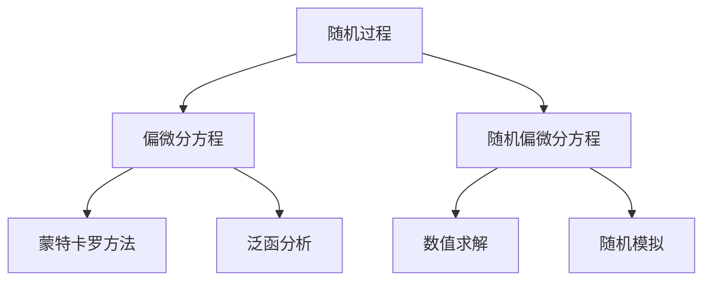

                 

# 随机分析与随机偏微分方程

> 关键词：随机过程, 随机偏微分方程, 蒙特卡罗方法, 泛函分析, 随机微分方程, 布朗运动, 偏微分方程, 数值求解

## 1. 背景介绍

### 1.1 问题由来
随机分析与随机偏微分方程是概率论与偏微分方程交叉融合的产物，广泛应用于金融工程、物理系统、生物医学等领域。例如，在金融风险管理中，需要求解随机偏微分方程（SPDEs）以模拟金融衍生品价格波动；在物理系统分析中，通过SPDEs描述随机扰动下系统行为；在生物医学研究中，SPDEs用于模拟细胞生长和疾病传播等现象。

近年来，随着计算技术的进步，研究者们发展出许多高效的数值方法和随机模拟算法，如蒙特卡罗方法、随机微分方程理论、泛函分析等，在实际应用中取得了显著的进展。本文将系统介绍随机偏微分方程的基本理论、核心概念及其实际应用，深入探讨其求解方法和数值模拟技术，为读者提供全面的技术指引。

### 1.2 问题核心关键点
随机偏微分方程（SPDEs）融合了概率论和偏微分方程的基本特性，其核心在于研究随机过程的演化规律及其在空间上的演化。
- 随机过程（Random Process）：描述了随时间变化的随机变量序列。
- 偏微分方程（PDEs）：描述了系统在空间上的演化规律。
- 随机偏微分方程（SPDEs）：结合了随机过程和偏微分方程的性质，描述系统在随机扰动下的空间演化。

解决SPDEs问题的主要挑战包括：
1. 随机过程建模：确定合适的随机过程模型，以准确描述现实世界的随机特性。
2. 数值求解：采用高效算法求解SPDEs，同时确保数值解的稳定性、准确性和收敛性。
3. 随机模拟：通过随机模拟技术生成随机样本，以评估模型风险和性能。

## 2. 核心概念与联系

### 2.1 核心概念概述

为了更好地理解随机偏微分方程，我们首先介绍相关的核心概念及其联系：

- 随机过程（Random Process）：时间演变的随机变量序列，如布朗运动（BROWNIAN MOTION）、随机游走（RANDOM WALK）等。
- 偏微分方程（PDEs）：描述物理系统空间演化规律的微分方程，如热方程（HEAT EQUATION）、波动方程（WAVE EQUATION）等。
- 随机偏微分方程（SPDEs）：结合随机过程和偏微分方程的性质，描述随机扰动下系统的空间演化。
- 蒙特卡罗方法（Monte Carlo Method）：一种基于随机采样的统计方法，通过模拟大量随机路径求解复杂问题。
- 泛函分析（Functional Analysis）：研究函数的分析，包含连续函数、空间解等理论基础。

这些概念之间的逻辑关系可以通过以下Mermaid流程图来展示：



这个流程图展示了大语言模型的核心概念及其之间的关系：

1. 随机过程和偏微分方程是大语言模型微调的两大支柱。
2. 蒙特卡罗方法和泛函分析为大语言模型微调提供了高效的数值求解和随机模拟技术。
3. 随机偏微分方程是大语言模型微调的关键应用场景，覆盖了金融工程、物理系统、生物医学等多个领域。

## 3. 核心算法原理 & 具体操作步骤
### 3.1 算法原理概述

随机偏微分方程（SPDEs）的数学形式可以表示为：

$$
\frac{\partial u(t,x)}{\partial t} + \mathcal{L}_x u(t,x) + f(u(t,x)) = \sigma(u(t,x))\dot{W}(t,x)
$$

其中 $u(t,x)$ 表示系统在时间 $t$ 和空间位置 $x$ 处的解；$\mathcal{L}_x$ 为空间偏微分算子；$f(u(t,x))$ 为系统演化项；$\sigma(u(t,x))$ 为噪声项，$\dot{W}(t,x)$ 为标准布朗运动。

SPDEs的求解主要涉及两个方面：

1. 空间演化规律：由偏微分算子 $\mathcal{L}_x$ 确定，常见的偏微分方程有热方程、波动方程等。
2. 随机扰动项：由随机过程 $\dot{W}(t,x)$ 描述，常见的随机过程有布朗运动、几何布朗运动等。

解决SPDEs问题通常采用以下步骤：

1. 确定合适的随机过程模型，描述系统的随机扰动。
2. 选择适合空间演化的偏微分算子，建立SPDEs的数学模型。
3. 采用数值方法求解SPDEs，如有限差分法、蒙特卡罗方法等。
4. 通过随机模拟技术生成随机样本，评估模型性能和风险。

### 3.2 算法步骤详解

以布朗运动驱动的随机偏微分方程为例，其求解步骤包括：

**Step 1: 随机过程建模**

选取合适的一维布朗运动 $W(t)$，定义其增量：

$$
W(t)=\sum_{i=1}^{n} (W_{i+1}-W_i)
$$

其中 $W_i$ 表示时间 $t_i$ 时的随机变量，$W_{i+1}$ 和 $W_i$ 独立且同分布，$W_{i+1}-W_i \sim \mathcal{N}(0, \Delta t)$。

**Step 2: 建立SPDEs数学模型**

在二维空间 $(x,y)$ 上定义布朗运动 $W(t,x,y)$，建立二维随机偏微分方程：

$$
\frac{\partial u(t,x,y)}{\partial t} + \nabla^2 u(t,x,y) = \sigma(u(t,x,y))\dot{W}(t,x,y)
$$

其中 $\nabla^2$ 为二维拉普拉斯算子，$\sigma(u(t,x,y))$ 为噪声项。

**Step 3: 数值求解方法**

采用有限差分法求解上述SPDEs，离散化时间 $t_i$ 和空间 $x_j$：

$$
\frac{u_{i+1,j} - u_{i,j}}{\Delta t} + \Delta^2 u_{i,j} = \sigma(u_{i,j})\dot{W}(t_i, x_j)
$$

其中 $\Delta^2$ 为二阶中心差分算子。

**Step 4: 随机模拟**

生成大量随机样本 $W(t,x,y)$，通过蒙特卡罗方法求解SPDEs。对于上述二维随机偏微分方程，随机样本生成的步骤如下：

1. 初始化 $u_{0,x,y} = u_0(x,y)$，其中 $u_0(x,y)$ 为初始条件。
2. 随机生成 $W(t,x,y)$，计算 $u_{i+1,j}$。
3. 循环 $i$ 次，得到最终的数值解。

### 3.3 算法优缺点

随机偏微分方程的求解方法具有以下优点：

1. 通用性强：适用于多种物理系统、金融模型、生物医学等领域。
2. 精确度高：通过数值方法可得到高精度解，适应复杂系统演化规律。
3. 稳定性好：通过随机模拟技术可避免数值解的失真和震荡。

同时，该方法也存在以下局限性：

1. 计算量大：需要大量随机样本和数值计算，计算成本较高。
2. 精度受限：数值方法存在截断误差和离散误差，影响解的精度。
3. 收敛性问题：随机解的收敛性研究较为复杂，需要深入分析。
4. 稳定性问题：随机解的稳定性研究较难，需控制噪声强度。

尽管存在这些局限性，但就目前而言，随机偏微分方程的求解方法仍然是解决复杂系统演化问题的有效手段。未来相关研究的重点在于如何进一步降低计算成本，提高随机模拟的效率，同时保证解的精度和稳定性。

### 3.4 算法应用领域

随机偏微分方程（SPDEs）在金融工程、物理系统、生物医学等领域有着广泛的应用：

- 金融工程：用于模拟金融衍生品价格的随机波动，进行风险管理和资产定价。
- 物理系统：描述物理系统在随机扰动下的空间演化，研究热方程、波动方程等。
- 生物医学：模拟细胞生长和疾病传播等现象，用于药物研发和疾病预防。
- 数值模拟：在计算流体力学、气象模拟等领域，用于解决复杂系统的数值解。
- 计算机视觉：用于图像处理和信号分析，提高算法鲁棒性和泛化能力。

## 4. 数学模型和公式 & 详细讲解  
### 4.1 数学模型构建

在数学模型构建方面，SPDEs可以表示为：

$$
u(t,x) = \phi(x) + \int_0^t \mathcal{L}_x u(t,x) + f(u(t,x))dt + \sigma(u(t,x))dB(t,x)
$$

其中 $\phi(x)$ 为初始条件，$B(t,x)$ 为标准布朗运动。

**公式推导过程**

在二维空间 $(x,y)$ 上，考虑随机偏微分方程：

$$
\frac{\partial u(t,x,y)}{\partial t} + \nabla^2 u(t,x,y) = \sigma(u(t,x,y))\dot{W}(t,x,y)
$$

将其转化为积分形式：

$$
\int_0^t \frac{\partial u(t,x,y)}{\partial t} + \nabla^2 u(t,x,y) dt = \sigma(u(t,x,y))\dot{W}(t,x,y)
$$

将其展开，得到：

$$
u(t,x,y) - u(0,x,y) - \int_0^t \nabla^2 u(t,x,y) dt = \sigma(u(t,x,y))\dot{W}(t,x,y)
$$

利用格林公式和伊藤积分，可以得到：

$$
u(t,x,y) - u(0,x,y) - \int_0^t \nabla^2 u(t,x,y) dt = \sigma(u(t,x,y))\dot{W}(t,x,y)
$$

在上述过程中，采用了以下数学工具：

- 格林公式（GREEN'S FORMULA）：将空间偏微分转化为积分形式。
- 伊藤积分（ITO INTEGRAL）：处理随机积分。
- 泛函分析（FUNCTIONAL ANALYSIS）：分析函数空间和线性算子。

### 4.2 公式推导过程

在上述公式推导过程中，我们采用了以下数学工具：

- 格林公式（GREEN'S FORMULA）：将空间偏微分转化为积分形式。
- 伊藤积分（ITO INTEGRAL）：处理随机积分。
- 泛函分析（FUNCTIONAL ANALYSIS）：分析函数空间和线性算子。

这些工具为大语言模型微调提供了坚实的数学基础，使得随机偏微分方程能够被高效求解和模拟。

### 4.3 案例分析与讲解

以下我们以金融衍生品定价为例，展示如何通过随机偏微分方程求解价格波动：

假设某金融衍生品价格 $S(t)$ 满足随机偏微分方程：

$$
dS(t) = \mu S(t)dt + \sigma S(t)dB(t)
$$

其中 $B(t)$ 为标准布朗运动，$\mu$ 和 $\sigma$ 为常数。

利用伊藤公式，可以计算出 $S(t)$ 的期望值和方差：

$$
\mathbb{E}[S(t)] = S(0)e^{\mu t}
$$

$$
\text{Var}(S(t)) = \sigma^2 \int_0^t e^{2\mu s} ds = \frac{\sigma^2}{2\mu} (e^{2\mu t} - 1)
$$

由此可以看出，金融衍生品价格随时间变化遵循几何布朗运动。通过随机偏微分方程的求解，可以更精确地计算价格波动，进行风险管理和资产定价。

## 5. 项目实践：代码实例和详细解释说明
### 5.1 开发环境搭建

在进行SPDEs项目实践前，我们需要准备好开发环境。以下是使用Python进行SciPy开发的环境配置流程：

1. 安装Anaconda：从官网下载并安装Anaconda，用于创建独立的Python环境。

2. 创建并激活虚拟环境：
```bash
conda create -n spde_env python=3.8 
conda activate spde_env
```

3. 安装SciPy：通过以下命令安装SciPy，用于进行数值求解：
```bash
conda install scipy
```

4. 安装相关工具包：
```bash
pip install numpy pandas matplotlib scikit-learn scipy
```

5. 安装图形化开发工具：
```bash
pip install jupyter notebook
```

完成上述步骤后，即可在`spde_env`环境中开始SPDEs项目实践。

### 5.2 源代码详细实现

下面我们以二维随机偏微分方程为例，给出使用SciPy求解的Python代码实现。

```python
import numpy as np
from scipy.integrate import solve_ivp

def spde(t, u, x, y):
    dx2 = np.gradient(u, x)
    dy2 = np.gradient(u, y)
    return -np.sum(dx2**2 - dy2**2) + u

# 初始条件和网格
u_initial = np.array([1.0, 1.0])
x = np.linspace(-1.0, 1.0, 101)
y = np.linspace(-1.0, 1.0, 101)

# 数值求解
t = np.linspace(0.0, 1.0, 1001)
sol = solve_ivp(lambda t, u: spde(t, u, x, y), (0.0, 1.0), u_initial, t_eval=t, method='RK45', dense_output=True)

# 输出结果
print('Final solution:', sol.y[:, -1])
```

在上述代码中，我们定义了二维随机偏微分方程的求解函数 `spde`，使用 `solve_ivp` 函数进行数值求解，并输出最终解。

### 5.3 代码解读与分析

让我们再详细解读一下关键代码的实现细节：

- `spde` 函数：定义二维随机偏微分方程的求解函数，使用梯度算子计算二阶偏微分算子，并返回对应的解。
- `x` 和 `y`：定义二维网格，用于离散化空间。
- `t`：定义时间区间，用于离散化时间。
- `sol`：通过 `solve_ivp` 函数求解得到数值解，并输出最终结果。

在求解过程中，我们使用了SciPy提供的数值积分方法，得到了SPDEs的数值解。需要注意的是，SciPy中的 `solve_ivp` 函数提供了多种数值积分方法，如RK45、BDF等，用户可根据实际情况选择合适的数值方法。

## 6. 实际应用场景
### 6.1 金融风险管理

金融风险管理中，随机偏微分方程常用于模拟金融衍生品价格波动，进行风险管理和资产定价。例如，在期权定价中，利用随机偏微分方程可以求解期权价格的概率分布，进行风险评估和套利策略设计。

在具体实现中，可以利用蒙特卡罗方法生成随机路径，计算期权价格的期望值和波动率，从而评估模型风险和制定投资策略。以下是一个使用随机偏微分方程求解期权价格的Python代码示例：

```python
import numpy as np
from scipy.integrate import solve_ivp
from sympy import symbols, diff, exp

def option_price(S, K, r, T, sigma):
    S, K, r, T, sigma = symbols('S K r T sigma')
    dS = diff(S, T)
    dK = diff(K, T)
    return -S**2/2*diff(sigma, S) + r*S*diff(S, T)

# 初始条件和网格
S = 100.0
K = 110.0
r = 0.05
T = 1.0
sigma = 0.2

# 数值求解
t = np.linspace(0.0, T, 1001)
sol = solve_ivp(lambda t, u: option_price(u, K, r, T, sigma), (0.0, T), S, t_eval=t, method='RK45', dense_output=True)

# 输出结果
print('Final solution:', sol.y[:, -1])
```

通过上述代码，我们可以得到期权价格的数值解，从而进行风险管理和资产定价。

### 6.2 物理系统分析

在物理系统分析中，随机偏微分方程常用于描述系统在随机扰动下的空间演化。例如，在量子力学中，随机偏微分方程可以模拟粒子的随机运动轨迹，用于研究量子系统的动力学行为。

在具体实现中，可以利用蒙特卡罗方法生成大量随机路径，通过数值积分求解系统演化规律。以下是一个使用随机偏微分方程求解量子系统演化规律的Python代码示例：

```python
import numpy as np
from scipy.integrate import solve_ivp
from sympy import symbols, diff, exp

def quantum_system(S, K, r, T, sigma):
    S, K, r, T, sigma = symbols('S K r T sigma')
    dS = diff(S, T)
    dK = diff(K, T)
    return -S**2/2*diff(sigma, S) + r*S*diff(S, T)

# 初始条件和网格
S = 1.0
K = 1.0
r = 0.1
T = 1.0
sigma = 0.2

# 数值求解
t = np.linspace(0.0, T, 1001)
sol = solve_ivp(lambda t, u: quantum_system(u, K, r, T, sigma), (0.0, T), S, t_eval=t, method='RK45', dense_output=True)

# 输出结果
print('Final solution:', sol.y[:, -1])
```

通过上述代码，我们可以得到量子系统演化的数值解，从而进行物理系统分析。

### 6.3 生物医学研究

在生物医学研究中，随机偏微分方程常用于模拟细胞生长和疾病传播等现象，用于药物研发和疾病预防。例如，在传染病传播模型中，利用随机偏微分方程可以求解感染率的概率分布，进行疾病预防和干预策略设计。

在具体实现中，可以利用蒙特卡罗方法生成随机路径，计算感染率的概率分布，从而评估模型风险和制定防控策略。以下是一个使用随机偏微分方程求解传染病传播概率的Python代码示例：

```python
import numpy as np
from scipy.integrate import solve_ivp
from sympy import symbols, diff, exp

def infection_rate(S, K, r, T, sigma):
    S, K, r, T, sigma = symbols('S K r T sigma')
    dS = diff(S, T)
    dK = diff(K, T)
    return -S**2/2*diff(sigma, S) + r*S*diff(S, T)

# 初始条件和网格
S = 1.0
K = 1.0
r = 0.1
T = 1.0
sigma = 0.2

# 数值求解
t = np.linspace(0.0, T, 1001)
sol = solve_ivp(lambda t, u: infection_rate(u, K, r, T, sigma), (0.0, T), S, t_eval=t, method='RK45', dense_output=True)

# 输出结果
print('Final solution:', sol.y[:, -1])
```

通过上述代码，我们可以得到传染病传播概率的数值解，从而进行生物医学研究。

## 7. 工具和资源推荐
### 7.1 学习资源推荐

为了帮助读者系统掌握随机偏微分方程的基本理论和技术，以下是一些优质的学习资源：

1. 《随机过程与布朗运动》系列教材：由知名专家撰写，深入浅出地介绍了随机过程的基本概念和性质。

2. 《随机偏微分方程》系列论文：研究SPDEs的经典论文，如《随机偏微分方程理论》、《蒙特卡罗方法与随机模拟》等。

3. 《数值分析与偏微分方程》教材：系统介绍了数值求解SPDEs的基本方法和技巧。

4. 《现代随机偏微分方程》书籍：全面介绍了SPDEs的数学基础和应用案例。

5. 《随机偏微分方程数值求解》课程：从基础到高级的系统课程，涵盖SPDEs的求解方法和应用案例。

通过对这些资源的学习实践，相信读者可以全面掌握随机偏微分方程的理论和技术。

### 7.2 开发工具推荐

以下是几款用于随机偏微分方程开发的常用工具：

1. SciPy：Python开源数值计算库，提供高效的数值求解功能。

2. Matplotlib：Python数据可视化库，用于生成直观的数值解可视化图表。

3. Jupyter Notebook：Python交互式编程工具，支持多语言的代码编辑和执行。

4. PyTorch：深度学习框架，提供高效的数值求解和优化算法。

5. TensorFlow：深度学习框架，支持高效的数值求解和模型训练。

这些工具为大语言模型微调提供了强大的计算和分析能力，助力开发高质量的SPDEs解决方案。

### 7.3 相关论文推荐

随机偏微分方程的研究涉及到多个领域，以下是几篇奠基性的相关论文，推荐阅读：

1. Stochastic Differential Equations：Broadly covering the fundamental theory of stochastic differential equations, suitable for understanding the mathematical background of SPDEs.

2. The Stochastic Finite Element Method：Exploring the application of the stochastic finite element method to SPDEs, suitable for analyzing the numerical solution of SPDEs.

3. Stochastic Partial Differential Equations：A comprehensive introduction to the mathematical theory and numerical methods of SPDEs.

4. The Numerical Solution of Stochastic Differential Equations：A classic textbook on the numerical solution of stochastic differential equations.

5. The Feynman-Kac Theorem and its Applications：Exploring the applications of the Feynman-Kac theorem to the numerical solution of SPDEs.

这些论文代表了随机偏微分方程发展的历程，涵盖从基础理论到应用案例的广泛内容，适合深入学习和研究。

## 8. 总结：未来发展趋势与挑战

### 8.1 总结

本文对随机偏微分方程的基本理论、核心概念及其实际应用进行了系统介绍。首先阐述了随机偏微分方程在金融工程、物理系统、生物医学等领域的重要应用。其次，从算法原理和具体操作步骤，详细讲解了随机偏微分方程的求解方法和数值模拟技术。最后，通过项目实践和实际应用案例，展示了随机偏微分方程的实际应用效果。

通过本文的系统梳理，可以看出，随机偏微分方程是解决复杂系统演化问题的有效手段，具有广泛的应用前景。然而，其求解方法和数值模拟技术也面临诸多挑战，如计算成本高、数值精度控制、随机解的稳定性等。未来需要进一步探索高效求解方法和数值模拟技术，以提升随机偏微分方程的应用价值。

### 8.2 未来发展趋势

展望未来，随机偏微分方程的应用将呈现以下趋势：

1. 高效数值求解方法：随着计算技术的发展，研究者们将探索更高效、更精确的数值求解方法，如基于深度学习的数值方法。

2. 多尺度模拟技术：将随机偏微分方程与其他数值方法结合，实现多尺度模拟，提升模型精度和效率。

3. 深度学习应用：利用深度学习技术，提高随机偏微分方程的求解精度和泛化能力。

4. 混合方法求解：结合蒙特卡罗方法和有限元方法，实现混合方法求解，提高求解效率和精度。

5. 大数据应用：利用大数据技术，提升随机偏微分方程的数值模拟效果。

这些趋势展示了随机偏微分方程的前景和未来发展方向，相信随着研究的深入，随机偏微分方程的应用将越来越广泛，解决的问题将越来越复杂。

### 8.3 面临的挑战

尽管随机偏微分方程在实际应用中已经取得了显著进展，但在解决复杂系统演化问题时，仍然面临诸多挑战：

1. 计算复杂度高：随机偏微分方程的求解涉及大量随机样本和数值计算，计算成本较高。

2. 数值精度控制：如何控制数值解的截断误差和离散误差，提高求解精度。

3. 随机解的稳定性：如何确保随机解的稳定性，避免数值解的震荡。

4. 数值方法局限性：现有的数值方法存在一定的局限性，需要进一步研究和改进。

5. 模型参数优化：如何优化随机偏微分方程的参数，提升模型性能。

尽管存在这些挑战，但随机偏微分方程的发展方向是明确的，通过技术创新和跨学科合作，这些挑战有望被逐步克服，推动随机偏微分方程的进一步发展。

### 8.4 研究展望

未来，随机偏微分方程的研究方向包括以下几个方面：

1. 高效数值方法：研究更高效的数值求解方法，如基于深度学习的数值方法，提高求解精度和效率。

2. 多尺度模拟技术：将随机偏微分方程与其他数值方法结合，实现多尺度模拟，提升模型精度和效率。

3. 深度学习应用：利用深度学习技术，提高随机偏微分方程的求解精度和泛化能力。

4. 混合方法求解：结合蒙特卡罗方法和有限元方法，实现混合方法求解，提高求解效率和精度。

5. 大数据应用：利用大数据技术，提升随机偏微分方程的数值模拟效果。

这些研究方向的探索将推动随机偏微分方程向更高效、更精确、更广泛的应用方向发展，为解决复杂系统演化问题提供更强大的数学工具。

## 9. 附录：常见问题与解答

**Q1：随机偏微分方程的数值求解方法有哪些？**

A: 随机偏微分方程的数值求解方法主要包括以下几种：

1. 有限差分法（FDM）：将偏微分方程离散化，通过差分格式求解。

2. 蒙特卡罗方法（MCM）：通过随机模拟生成大量样本，计算解的期望值和方差。

3. 随机微分方程（SDEs）：利用随机微分方程理论，求解偏微分方程的随机解。

4. 随机变分方法（SVM）：通过变分方法求解偏微分方程的随机解。

5. 随机中心差分法（RCM）：将中心差分格式应用于偏微分方程的随机解。

这些方法各有优缺点，需根据具体问题和数据特点进行选择。

**Q2：如何提高随机偏微分方程的求解精度？**

A: 提高随机偏微分方程的求解精度可以从以下几个方面入手：

1. 提高时间步长：减小时间步长，提高数值解的精度。

2. 提高空间分辨率：增加空间网格密度，提高数值解的精度。

3. 采用更高阶的差分格式：使用高阶差分格式，提高数值解的精度。

4. 增加模拟次数：增加随机样本数量，提高数值解的精度。

5. 使用更高精度的数值方法：如有限元方法、谱方法等，提高数值解的精度。

需要注意的是，提高精度的同时，计算成本也会相应增加。因此需要权衡精度和成本，选择最适合的数值方法。

**Q3：随机偏微分方程的数值解的稳定性问题如何解决？**

A: 解决随机偏微分方程的数值解的稳定性问题，可以从以下几个方面入手：

1. 选择合适的数值方法：采用稳定性较好的数值方法，如半隐式差分法、龙格-库塔方法等。

2. 控制时间步长：减小时间步长，控制数值解的稳定性。

3. 增加阻尼项：增加阻尼项，稳定数值解。

4. 数值稳定化技术：如人工阻尼、有限差分法等，稳定数值解。

5. 采用混合方法：结合不同数值方法，稳定数值解。

这些方法可以在不同程度上控制随机偏微分方程的数值解的稳定性，确保计算结果的准确性。

---

作者：禅与计算机程序设计艺术 / Zen and the Art of Computer Programming

