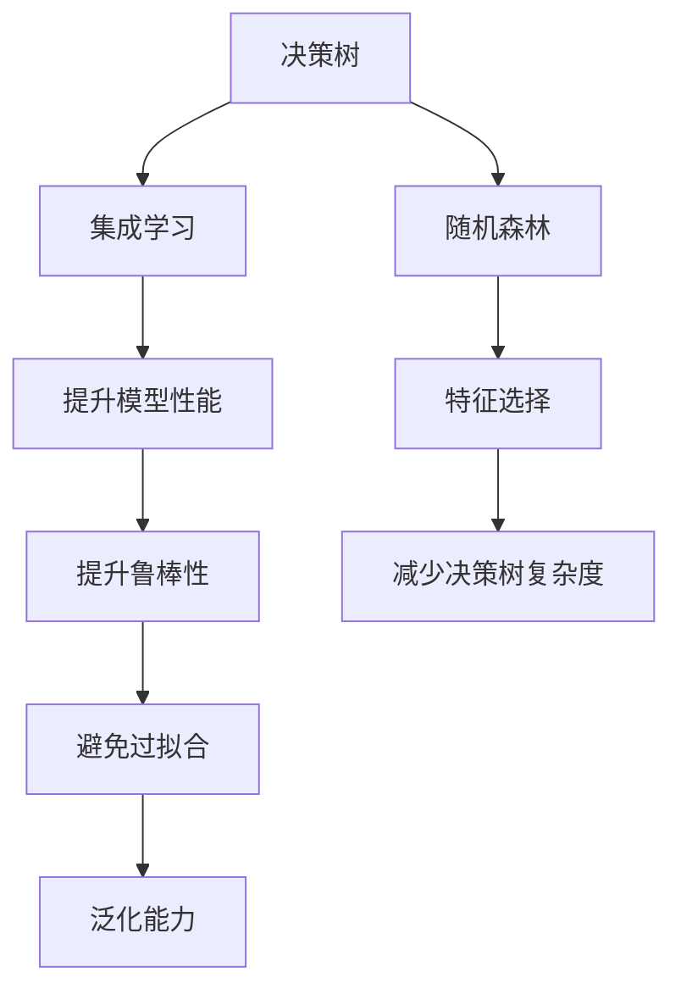

                 

# 随机森林(Random Forests) - 原理与代码实例讲解

> 关键词：随机森林,决策树,集成学习,特征选择,过拟合,交叉验证,代码实例

## 1. 背景介绍

### 1.1 问题由来

决策树是机器学习领域的一种常见模型，其基于树形结构来对数据进行划分和预测。然而，单棵决策树模型容易过拟合，泛化能力有限。为了克服这一问题，随机森林算法（Random Forest）应运而生。

随机森林是一种集成学习方法，通过构建多棵决策树，利用随机采样和特征选择策略，形成多个子模型，并对其进行集成，以获得更稳定、准确的预测结果。

### 1.2 问题核心关键点

- 随机森林：基于决策树模型，通过集成多个随机子模型，提升模型的泛化能力和稳定性。
- 决策树：基于信息增益、基尼指数等选择最优特征进行数据划分，建立树形结构。
- 集成学习：将多个基模型进行融合，提升模型性能和鲁棒性。
- 特征选择：通过随机采样和特征选择策略，减小决策树的复杂度，避免过拟合。
- 过拟合：指模型在训练集上表现优秀，但在测试集上泛化能力差的问题。
- 交叉验证：一种模型评估方法，通过分割数据集来评估模型性能，减少过拟合风险。
- 代码实例：基于Scikit-learn库，给出随机森林的实现示例，并进行详细解释。

## 2. 核心概念与联系

### 2.1 核心概念概述

为更好地理解随机森林算法，本节将介绍几个密切相关的核心概念：

- 决策树（Decision Tree）：一种基于树形结构的数据分类与回归模型，通过节点分裂来划分数据。
- 随机森林（Random Forest）：一种集成学习算法，通过构建多棵决策树，提升模型的泛化能力和稳定性。
- 集成学习（Ensemble Learning）：将多个基模型进行融合，提升模型性能和鲁棒性。
- 特征选择（Feature Selection）：通过随机采样和特征选择策略，减小决策树的复杂度，避免过拟合。
- 过拟合（Overfitting）：指模型在训练集上表现优秀，但在测试集上泛化能力差的问题。
- 交叉验证（Cross-Validation）：一种模型评估方法，通过分割数据集来评估模型性能，减少过拟合风险。

这些核心概念之间的逻辑关系可以通过以下Mermaid流程图来展示：



这个流程图展示了几大核心概念的关联关系：

1. 决策树是随机森林的基模型。
2. 集成学习通过融合多个基模型，提升模型性能和鲁棒性。
3. 特征选择通过随机采样和特征选择策略，减小决策树的复杂度，避免过拟合。
4. 随机森林利用特征选择策略，提升模型的泛化能力和稳定性。

## 3. 核心算法原理 & 具体操作步骤

### 3.1 算法原理概述

随机森林算法通过构建多棵决策树，利用随机采样和特征选择策略，形成多个子模型，并对其进行集成，以获得更稳定、准确的预测结果。

具体而言，随机森林算法包含以下步骤：
1. 从训练集中随机有放回地抽取样本，形成训练子集。
2. 从特征集中随机选择特征子集，构建决策树模型。
3. 对所有决策树进行集成，形成随机森林模型。
4. 使用随机森林模型进行预测，并计算模型性能。

### 3.2 算法步骤详解

以下是随机森林算法的详细步骤：

**Step 1: 准备训练数据集**
- 从原始数据集中随机抽取有放回的样本，形成训练集。
- 对训练集进行划分，生成多个训练子集。

**Step 2: 构建决策树**
- 对每个训练子集，随机选择特征子集，构建决策树模型。
- 决策树的构建方式与传统的决策树相同，通过信息增益、基尼指数等选择最优特征进行数据划分。

**Step 3: 集成决策树**
- 对所有决策树进行集成，通过投票或平均等策略，得到最终的预测结果。
- 通过交叉验证等方法评估模型性能，并进行参数调优。

**Step 4: 预测与评估**
- 使用随机森林模型对新样本进行预测。
- 使用各种评估指标（如准确率、召回率、F1分数等）评估模型性能。

### 3.3 算法优缺点

随机森林算法具有以下优点：
1. 泛化能力强：通过集成多个子模型，减少过拟合风险。
2. 模型稳定：随机采样和特征选择策略，提升模型的鲁棒性。
3. 处理多类问题能力强：通过多棵决策树的集成，处理多类分类问题。
4. 算法复杂度较低：模型结构简单，易于实现和理解。

同时，随机森林算法也存在一些缺点：
1. 训练时间较长：需要构建多棵决策树，计算量较大。
2. 特征选择策略可能会影响结果：如何选择合适的特征子集，仍需进一步研究。
3. 对于特征之间存在强相关性数据，效果不佳。

### 3.4 算法应用领域

随机森林算法广泛应用于多个领域，例如：

- 金融风险评估：通过随机森林模型对金融数据进行分析，评估投资风险和信用风险。
- 医疗诊断：利用随机森林算法进行疾病预测和患者风险评估，辅助医生诊疗。
- 电商平台推荐：通过随机森林模型分析用户行为，实现个性化商品推荐。
- 图像分类：通过随机森林算法进行图像特征提取和分类，识别物体和场景。
- 自然语言处理：利用随机森林模型进行文本分类、情感分析等任务。
- 工业生产优化：通过随机森林模型优化生产流程和质量控制。

## 4. 数学模型和公式 & 详细讲解 & 举例说明

### 4.1 数学模型构建

随机森林模型由多棵决策树组成，每棵决策树的构建方式与传统的决策树相同。以下是随机森林模型的数学模型构建：

$$
f(x) = \frac{1}{n}\sum_{i=1}^n f_i(x)
$$

其中 $f(x)$ 为随机森林模型的预测结果，$n$ 为决策树的数量，$f_i(x)$ 为第 $i$ 棵决策树的预测结果。

### 4.2 公式推导过程

以二分类问题为例，随机森林模型的预测公式如下：

$$
y = \sum_{i=1}^n y_i
$$

其中 $y$ 为模型预测结果，$y_i$ 为第 $i$ 棵决策树的预测结果，通常取多数投票的方式。

### 4.3 案例分析与讲解

假设有训练集 $D=\{(x_1, y_1), (x_2, y_2), ..., (x_m, y_m)\}$，其中 $x_i$ 为样本特征，$y_i$ 为样本标签，$y_i \in \{0, 1\}$。随机森林算法通过以下步骤进行模型训练：

1. 随机抽取 $m$ 个有放回的样本，形成训练集 $D_1, D_2, ..., D_m$。
2. 对每个训练子集 $D_i$，随机选择 $k$ 个特征，构建决策树模型 $T_i$。
3. 对每个训练子集 $D_i$，通过投票方式集成决策树模型 $T_i$，得到随机森林模型 $F$。
4. 使用随机森林模型 $F$ 对新样本 $x$ 进行预测，得到预测结果 $y$。

## 5. 项目实践：代码实例和详细解释说明

### 5.1 开发环境搭建

在进行随机森林实践前，我们需要准备好开发环境。以下是使用Python进行Scikit-learn库开发的环境配置流程：

1. 安装Anaconda：从官网下载并安装Anaconda，用于创建独立的Python环境。

2. 创建并激活虚拟环境：
```bash
conda create -n skf-env python=3.7 
conda activate skf-env
```

3. 安装Scikit-learn库：
```bash
pip install scikit-learn
```

4. 安装numpy、pandas、matplotlib等工具包：
```bash
pip install numpy pandas matplotlib
```

完成上述步骤后，即可在`skf-env`环境中开始随机森林的实践。

### 5.2 源代码详细实现

这里我们以手写数字识别（MNIST数据集）为例，给出使用Scikit-learn库实现随机森林模型的完整代码实现。

首先，导入必要的库和数据：

```python
from sklearn.datasets import load_digits
from sklearn.ensemble import RandomForestClassifier
from sklearn.model_selection import train_test_split
from sklearn.metrics import accuracy_score
import matplotlib.pyplot as plt

# 加载数据集
digits = load_digits()
X = digits.data
y = digits.target

# 划分数据集
X_train, X_test, y_train, y_test = train_test_split(X, y, test_size=0.2, random_state=42)
```

然后，定义随机森林模型并进行训练：

```python
# 定义随机森林模型
rf = RandomForestClassifier(n_estimators=100, random_state=42)

# 训练模型
rf.fit(X_train, y_train)

# 评估模型
y_pred = rf.predict(X_test)
accuracy = accuracy_score(y_test, y_pred)
print(f"Accuracy: {accuracy:.2f}")
```

最后，展示模型性能：

```python
# 绘制混淆矩阵
from sklearn.metrics import confusion_matrix

cm = confusion_matrix(y_test, y_pred)
plt.imshow(cm, interpolation='nearest', cmap=plt.cm.Blues)
plt.title('Confusion matrix')
plt.colorbar()
plt.xlabel('Predicted label')
plt.ylabel('True label')
plt.show()

# 绘制ROC曲线
from sklearn.metrics import roc_curve

probs = rf.predict_proba(X_test)
fpr, tpr, _ = roc_curve(y_test, probs[:, 1])
plt.plot(fpr, tpr)
plt.title('ROC curve')
plt.xlabel('False Positive Rate')
plt.ylabel('True Positive Rate')
plt.show()
```

以上就是使用Scikit-learn库实现随机森林模型的完整代码实现。可以看到，通过Scikit-learn库，可以方便地构建、训练和评估随机森林模型。

### 5.3 代码解读与分析

让我们再详细解读一下关键代码的实现细节：

**load_digits函数**：
- 加载MNIST手写数字数据集，获取特征向量和标签向量。

**train_test_split函数**：
- 将数据集随机划分为训练集和测试集，比例为8:2。

**RandomForestClassifier类**：
- 定义随机森林模型，其中 `n_estimators` 为决策树的数量。

**fit函数**：
- 使用训练集对随机森林模型进行训练。

**predict函数**：
- 使用训练好的模型对测试集进行预测。

**accuracy_score函数**：
- 计算模型在测试集上的准确率。

**confusion_matrix函数**：
- 绘制混淆矩阵，显示模型在各个类别上的预测情况。

**roc_curve函数**：
- 绘制ROC曲线，评估模型在二分类任务上的性能。

可以看到，Scikit-learn库使得随机森林的实现变得简洁高效。开发者可以将更多精力放在数据处理、模型改进等高层逻辑上，而不必过多关注底层的实现细节。

## 6. 实际应用场景

### 6.1 金融风险评估

金融风险评估是随机森林算法的一个重要应用领域。金融机构需要评估客户的信用风险、投资风险等，以制定合理的贷款策略和投资方案。通过随机森林模型，可以分析客户的历史交易数据、信用记录等，预测其未来的信用风险和投资风险。

在实际应用中，可以将客户数据作为特征向量，利用随机森林模型进行预测。如果预测结果显示客户存在较高的风险，金融机构可以采取相应的措施，如拒绝贷款、调整贷款利率等。

### 6.2 医疗诊断

医疗诊断是随机森林算法的另一个重要应用领域。通过随机森林模型，可以分析患者的病历数据、实验室检测结果等，预测其是否患有某种疾病。

在实际应用中，可以将患者的病历数据、实验室检测结果等作为特征向量，利用随机森林模型进行预测。如果预测结果显示患者可能患有某种疾病，医生可以进一步检查确诊，并制定相应的治疗方案。

### 6.3 电商平台推荐

电商平台推荐是随机森林算法的典型应用场景之一。通过随机森林模型，可以分析用户的浏览记录、购买记录等数据，推荐用户可能感兴趣的商品。

在实际应用中，可以将用户数据作为特征向量，利用随机森林模型进行推荐。如果预测结果显示用户可能对某种商品感兴趣，电商平台可以向用户推荐该商品，提高用户满意度和销售额。

### 6.4 图像分类

图像分类是随机森林算法的另一个重要应用领域。通过随机森林模型，可以分析图像的像素值、颜色等特征，将其分类为不同的物体或场景。

在实际应用中，可以将图像的像素值、颜色等特征作为特征向量，利用随机森林模型进行分类。如果预测结果显示图像属于某个类别，可以将其打上相应的标签，进行后续处理。

## 7. 工具和资源推荐

### 7.1 学习资源推荐

为了帮助开发者系统掌握随机森林算法，这里推荐一些优质的学习资源：

1. 《Python机器学习基础教程》书籍：介绍了机器学习的基础知识，包括随机森林算法。
2. 《机器学习实战》书籍：通过实例讲解随机森林算法的实现过程。
3. Scikit-learn官方文档：提供了详细的随机森林算法实现教程和示例代码。
4 Kaggle竞赛：参加Kaggle机器学习竞赛，实践随机森林算法的应用。
5 Coursera《机器学习》课程：由斯坦福大学教授Andrew Ng讲授，深入浅出地讲解了随机森林算法。

通过对这些资源的学习实践，相信你一定能够快速掌握随机森林算法的精髓，并用于解决实际的机器学习问题。

### 7.2 开发工具推荐

高效的开发离不开优秀的工具支持。以下是几款用于随机森林开发的常用工具：

1. Python：流行的编程语言，适合快速迭代研究。
2. Scikit-learn：开源的Python机器学习库，提供了丰富的随机森林算法实现。
3. Pandas：用于数据处理和分析的Python库，适合处理大规模数据集。
4. Matplotlib：用于绘制图表的Python库，适合可视化模型结果。
5. Numpy：用于数值计算的Python库，适合处理大规模矩阵运算。

合理利用这些工具，可以显著提升随机森林开发的效率，加快创新迭代的步伐。

### 7.3 相关论文推荐

随机森林算法的发展源于学界的持续研究。以下是几篇奠基性的相关论文，推荐阅读：

1. Breiman, L. (2001). Random Forests. Machine Learning, 45(1), 5-32.
2 Quinlan, J. R. (1986). Induction of Decision Trees. Machine Learning, 1(1), 81-106.
3 Ho, T. K. (1998). The Random Subspace Method for Constructing Decision Trees Inductively. Pattern Analysis and Machine Intelligence, 20(8), 832-844.
4 Friedman, J. H. (2001). Greedy Function Approximation: A Gradient Boosting Machine. Annals of Statistics, 29(5), 1189-1232.
5 Liu, F. T. (2002). Beyond Bagging and Boosting: Reducing Generalization Error with Subspace Randomization. Machine Learning, 42(1), 143-156.

这些论文代表了随机森林算法的发展脉络。通过学习这些前沿成果，可以帮助研究者把握学科前进方向，激发更多的创新灵感。

## 8. 总结：未来发展趋势与挑战

### 8.1 总结

本文对随机森林算法进行了全面系统的介绍。首先阐述了随机森林算法的研究背景和意义，明确了随机森林在集成学习中的独特价值。其次，从原理到实践，详细讲解了随机森林算法的数学模型和实现步骤，给出了随机森林的代码实现示例，并进行详细解释。同时，本文还广泛探讨了随机森林算法在金融风险评估、医疗诊断、电商平台推荐、图像分类等诸多领域的应用前景，展示了随机森林算法的广阔应用空间。最后，本文精选了随机森林算法的各类学习资源，力求为读者提供全方位的技术指引。

通过本文的系统梳理，可以看到，随机森林算法在集成学习中具有独特的优势，通过集成多个基模型，提升模型的泛化能力和稳定性。未来，随机森林算法将继续发展，探索更多的应用场景和优化策略。

### 8.2 未来发展趋势

展望未来，随机森林算法的发展趋势如下：

1. 更高效的特征选择：通过改进特征选择策略，提升模型的泛化能力和鲁棒性。
2. 多模态数据的集成：将文本、图像、音频等多种模态数据进行融合，提升模型对现实世界的理解和建模能力。
3. 多任务学习：通过随机森林模型同时处理多个任务，提高模型的多任务学习和泛化能力。
4. 解释性增强：通过改进算法模型，提升模型的可解释性，增强模型的透明度和可信度。
5. 超参数优化：通过自动化调参方法，找到最优的超参数组合，提升模型的性能和鲁棒性。

这些发展趋势将推动随机森林算法不断进步，拓展其在更多领域的应用，提升模型的性能和鲁棒性。

### 8.3 面临的挑战

尽管随机森林算法已经取得了瞩目成就，但在迈向更加智能化、普适化应用的过程中，仍面临诸多挑战：

1. 数据量瓶颈：在处理大规模数据集时，需要保证特征向量的稀疏性，避免维度灾难。
2. 算法复杂度：随机森林算法需要构建多棵决策树，计算量较大，如何优化算法效率，仍需进一步研究。
3. 模型可解释性：随机森林算法的黑盒特性，导致模型的可解释性较弱，需要进一步改进。
4. 数据预处理：在处理不同类型的数据时，需要采用不同的数据预处理方法，保证数据的质量和一致性。
5. 超参数调优：随机森林算法的超参数较多，如何自动化调优，仍需进一步研究。

这些挑战将推动随机森林算法的研究不断深入，探索新的优化策略和方法，提升算法的性能和可解释性。

### 8.4 研究展望

面对随机森林算法所面临的挑战，未来的研究需要在以下几个方面寻求新的突破：

1. 探索更高效的特征选择方法：改进特征选择策略，提升模型的泛化能力和鲁棒性。
2. 研究多模态数据的集成方法：将文本、图像、音频等多种模态数据进行融合，提升模型对现实世界的理解和建模能力。
3. 改进算法的解释性：通过改进算法模型，提升模型的可解释性，增强模型的透明度和可信度。
4. 自动化调参方法：通过自动化调参方法，找到最优的超参数组合，提升模型的性能和鲁棒性。
5. 处理不同类型的数据：研究不同类型数据的特点和处理方法，保证数据的质量和一致性。

这些研究方向的探索，将推动随机森林算法不断进步，拓展其在更多领域的应用，提升模型的性能和鲁棒性。

## 9. 附录：常见问题与解答

**Q1：随机森林算法如何避免过拟合？**

A: 随机森林算法通过随机采样和特征选择策略，减小决策树的复杂度，避免过拟合。具体而言，随机森林算法在构建决策树时，通过随机抽取训练集样本和特征子集，减小决策树的复杂度。同时，随机森林算法通过集成多个决策树，减小模型在训练集上的过拟合风险。

**Q2：随机森林算法与传统决策树算法有什么区别？**

A: 随机森林算法与传统决策树算法的主要区别在于：
1. 随机森林算法通过集成多个决策树，提升模型的泛化能力和稳定性，而传统决策树算法只有一棵决策树。
2. 随机森林算法通过随机采样和特征选择策略，减小决策树的复杂度，避免过拟合，而传统决策树算法通常容易出现过拟合问题。
3. 随机森林算法可以处理多类分类问题，而传统决策树算法只能处理二类分类问题。

**Q3：随机森林算法在实际应用中有哪些局限性？**

A: 随机森林算法在实际应用中存在以下局限性：
1. 计算量大：需要构建多棵决策树，计算量较大，对于大规模数据集，计算时间较长。
2. 特征选择策略：如何选择合适的特征子集，仍需进一步研究，特征选择策略可能会影响结果。
3. 数据预处理：在处理不同类型的数据时，需要采用不同的数据预处理方法，保证数据的质量和一致性。
4. 模型可解释性：随机森林算法的黑盒特性，导致模型的可解释性较弱，需要进一步改进。

**Q4：如何优化随机森林算法的性能？**

A: 随机森林算法的性能优化可以从以下几个方面入手：
1. 特征选择策略：改进特征选择策略，提升模型的泛化能力和鲁棒性。
2. 多模态数据的集成：将文本、图像、音频等多种模态数据进行融合，提升模型对现实世界的理解和建模能力。
3. 解释性增强：通过改进算法模型，提升模型的可解释性，增强模型的透明度和可信度。
4. 自动化调参方法：通过自动化调参方法，找到最优的超参数组合，提升模型的性能和鲁棒性。

这些优化策略可以显著提升随机森林算法的性能和鲁棒性，拓展其在更多领域的应用。

---

作者：禅与计算机程序设计艺术 / Zen and the Art of Computer Programming

