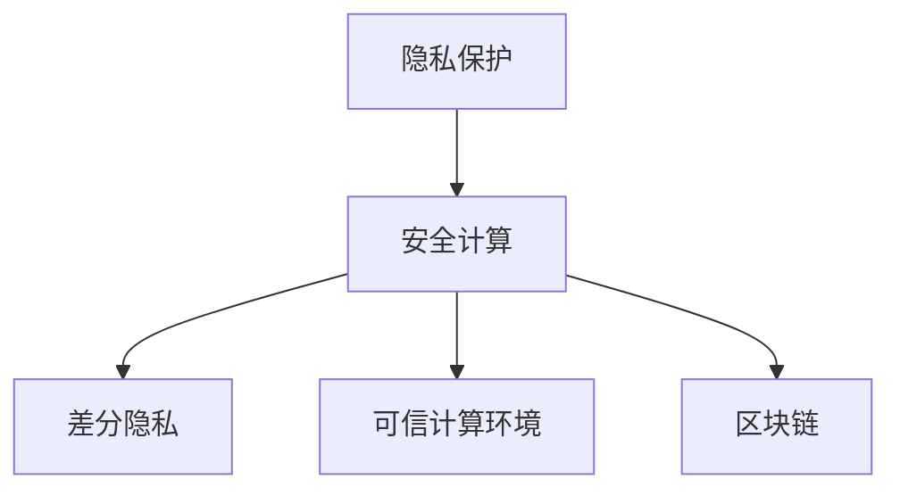

                 

# 隐私与安全：人类计算中的关键问题

> 关键词：隐私保护,安全计算,量子计算,区块链,可信执行环境,差分隐私

## 1. 背景介绍

### 1.1 问题由来
随着科技的迅猛发展，人类计算已成为现代社会不可或缺的一部分。无论是大数据分析、云计算还是物联网，都极大地提升了我们的生活和工作效率。然而，随着计算能力的提升，隐私和安全问题也日益凸显。

一方面，大数据的广泛应用带来了数据泄露的风险。例如，隐私数据被不当使用、数据集中被篡改、个人隐私被滥用等问题屡屡发生。另一方面，量子计算、人工智能等新兴技术的发展，又为计算安全带来了新的挑战。

如何平衡隐私保护和安全计算，成为了当前计算机领域亟需解决的关键问题。本文将从隐私保护、安全计算等几个核心概念出发，分析其原理与架构，并探讨具体技术实现及应用场景。

### 1.2 问题核心关键点
隐私保护和安全计算是现代计算机领域的热门话题。其核心关键点在于：

- 如何防止隐私数据泄露，确保数据在处理过程中的安全性。
- 如何保证计算过程的安全性，防止被恶意攻击和篡改。
- 如何在确保隐私的前提下，实现数据的有效利用和共享。
- 如何在计算过程中，利用技术手段实现信息的可信交换与保护。

这些关键点构成了隐私保护和安全计算的理论基础，推动了相关技术的发展与创新。

## 2. 核心概念与联系

### 2.1 核心概念概述

隐私保护与安全计算涉及众多关键概念，主要包括以下几个方面：

- 隐私保护：通过技术手段，确保数据在存储、传输和处理过程中的安全性，防止隐私数据的泄露和滥用。
- 安全计算：通过技术手段，确保计算过程的安全性，防止被恶意攻击和篡改，确保计算结果的准确性和可信性。
- 差分隐私：通过加入随机噪声，保护数据个体隐私的同时，仍能利用统计信息。
- 可信计算环境：提供安全计算的基础设施，如TPM、SGX等，确保计算过程的机密性和完整性。
- 区块链：一种去中心化的分布式账本技术，通过共识机制确保数据的透明性和不可篡改性。

这些概念通过相互配合，共同构建了隐私保护和安全计算的技术体系。

### 2.2 核心概念原理和架构的 Mermaid 流程图(Mermaid 流程节点中不要有括号、逗号等特殊字符)



此流程图展示了隐私保护和安全计算的基本架构：

- 隐私保护是安全计算的基础，防止数据泄露。
- 安全计算是隐私保护的具体实现，确保数据处理过程的安全性。
- 差分隐私是隐私保护的一种方法，在不泄露个体隐私的前提下，利用数据统计信息。
- 可信计算环境提供了安全计算的基础设施，如TPM、SGX等，确保计算过程的机密性和完整性。
- 区块链通过共识机制，确保数据透明性和不可篡改性。

这些概念通过协同作用，构建了隐私保护和安全计算的技术框架，广泛应用于数据存储、传输和处理等各个环节。

## 3. 核心算法原理 & 具体操作步骤

### 3.1 算法原理概述

隐私保护和安全计算的核心在于数据处理过程的机密性和完整性。其算法原理主要包括以下几个方面：

- 数据加密：通过加密技术，将数据转化为难以破解的形式，确保数据在传输和存储过程中的安全性。
- 差分隐私：在数据处理过程中，加入随机噪声，确保个体数据隐私的同时，仍能利用数据统计信息。
- 可信计算环境：在计算过程中，利用可信硬件环境（如TPM、SGX等），确保计算过程的机密性和完整性。
- 区块链：利用去中心化的分布式账本技术，确保数据的透明性和不可篡改性。

这些算法原理为隐私保护和安全计算提供了理论基础，在具体实现过程中，还需结合具体的应用场景和需求，选择合适的方法和技术。

### 3.2 算法步骤详解

隐私保护和安全计算的具体操作步骤主要包括以下几个步骤：

1. 数据收集：从数据源收集数据，包括用户数据、网络数据、传感器数据等。
2. 数据预处理：对数据进行清洗、去重、过滤等预处理操作，确保数据质量。
3. 数据加密：对数据进行加密，确保数据在传输和存储过程中的安全性。
4. 数据处理：利用隐私保护和安全计算技术，对数据进行处理，如聚合、计算、分析等。
5. 结果解密：对处理结果进行解密，恢复原始数据，供用户使用。

### 3.3 算法优缺点

隐私保护和安全计算技术具有以下优点：

- 数据安全性高：通过加密和可信计算环境，确保数据在处理过程中的安全性。
- 数据隐私性强：通过差分隐私和匿名化处理，确保个体数据的隐私性。
- 可扩展性好：通过分布式计算和区块链技术，确保数据处理的可扩展性和透明性。

但同时，这些技术也存在一些缺点：

- 计算成本高：数据加密和解密、差分隐私处理、可信计算环境部署等，都需要较高的计算资源。
- 实现复杂：隐私保护和安全计算技术涉及多个环节，实现复杂，需要专业的技术团队支持。
- 数据效率低：在加入随机噪声和加密处理后，数据处理效率可能会有所降低。

### 3.4 算法应用领域

隐私保护和安全计算技术在多个领域都有广泛的应用，主要包括以下几个方面：

1. 医疗健康：医疗数据通常包含敏感信息，如病历、基因数据等，隐私保护和安全计算技术可以确保医疗数据的隐私性和安全性。
2. 金融安全：金融数据如交易记录、客户信息等，隐私保护和安全计算技术可以确保数据的机密性和完整性。
3. 网络安全：网络数据如日志、流量等，隐私保护和安全计算技术可以防止数据泄露和恶意攻击。
4. 物联网：物联网设备采集的数据通常包含敏感信息，隐私保护和安全计算技术可以确保数据的安全性。
5. 政府数据：政府数据如人口信息、地理位置等，隐私保护和安全计算技术可以确保数据的机密性和隐私性。

这些应用领域都要求数据处理过程的安全性和隐私性，隐私保护和安全计算技术为其实现提供了有力的技术保障。

## 4. 数学模型和公式 & 详细讲解 & 举例说明（备注：数学公式请使用latex格式，latex嵌入文中独立段落使用 $$，段落内使用 $)
### 4.1 数学模型构建

隐私保护和安全计算涉及到多个数学模型，主要包括以下几个方面：

- 数据加密模型：通过数学算法将数据转化为难以破解的形式，如对称加密、非对称加密、哈希函数等。
- 差分隐私模型：通过加入随机噪声，保护数据个体隐私的同时，仍能利用数据统计信息。
- 可信计算环境模型：利用可信硬件环境，确保计算过程的机密性和完整性。
- 区块链模型：利用去中心化的分布式账本技术，确保数据的透明性和不可篡改性。

### 4.2 公式推导过程

以下是隐私保护和安全计算中常用的一些数学公式及其推导过程：

**1. 对称加密算法**

对称加密算法是常用的加密技术之一，其核心思想是将明文数据通过密钥加密成密文，在解密时再通过相同的密钥将密文还原为明文。

- 加密过程：$C=E(K, M)$，其中 $C$ 表示密文，$M$ 表示明文，$K$ 表示密钥，$E$ 表示加密算法。
- 解密过程：$M=D(K, C)$，其中 $M$ 表示明文，$C$ 表示密文，$K$ 表示密钥，$D$ 表示解密算法。

**2. 差分隐私**

差分隐私是一种保护数据个体隐私的技术，通过在数据处理过程中加入随机噪声，确保个体数据的隐私性，同时仍能利用数据统计信息。

- 差分隐私公式：$\epsilon$-differential privacy，其中 $\epsilon$ 表示隐私保护的程度，$Q$ 表示查询结果，$\delta$ 表示查询结果的误差，$\epsilon$ 和 $\delta$ 需满足一定的约束条件。

**3. 可信计算环境**

可信计算环境（Trusted Computing Base，TCB）提供安全计算的基础设施，如TPM、SGX等，确保计算过程的机密性和完整性。

- TPM：Trusted Platform Module，提供硬件加密和身份验证功能，确保计算过程的机密性和完整性。
- SGX：Secure Enclave，提供硬件隔离和加密功能，确保计算过程的机密性和完整性。

**4. 区块链**

区块链利用去中心化的分布式账本技术，确保数据的透明性和不可篡改性。

- 区块链模型：$Block = Hash(Block_{prev}) + Data + Hash(Hashes)$，其中 $Block$ 表示区块链中的一个区块，$Block_{prev}$ 表示前一个区块，$Data$ 表示区块数据，$Hash$ 表示哈希函数。

通过这些数学模型的推导和应用，隐私保护和安全计算技术可以确保数据的机密性、完整性和隐私性，为数据处理过程提供了有力的技术保障。

### 4.3 案例分析与讲解

**案例1：医疗数据隐私保护**

医疗数据通常包含敏感信息，如病历、基因数据等。隐私保护和安全计算技术可以确保医疗数据的隐私性和安全性。例如，使用差分隐私技术对患者病历数据进行处理，确保个体数据的隐私性，同时仍能利用数据统计信息进行疾病研究。

**案例2：金融交易数据安全**

金融数据如交易记录、客户信息等，隐私保护和安全计算技术可以确保数据的机密性和完整性。例如，使用TPM硬件环境对金融数据进行加密处理，确保数据的机密性和完整性，防止数据泄露和恶意攻击。

**案例3：物联网设备数据安全**

物联网设备采集的数据通常包含敏感信息，如地理位置、传感器数据等。隐私保护和安全计算技术可以确保数据的安全性。例如，使用区块链技术对物联网设备数据进行分布式存储，确保数据的透明性和不可篡改性。

这些案例展示了隐私保护和安全计算技术在不同领域的应用，通过数学模型和算法，确保数据的机密性、完整性和隐私性。

## 5. 项目实践：代码实例和详细解释说明

### 5.1 开发环境搭建

在实践隐私保护和安全计算技术时，需要搭建相应的开发环境。以下是使用Python进行开发的Python环境配置流程：

1. 安装Anaconda：从官网下载并安装Anaconda，用于创建独立的Python环境。

2. 创建并激活虚拟环境：
```bash
conda create -n privacy-env python=3.8 
conda activate privacy-env
```

3. 安装相关库：
```bash
pip install sympy numpy pandas numpy-keyczar flask-socketio flask
```

完成上述步骤后，即可在`privacy-env`环境中开始隐私保护和安全计算项目的开发。

### 5.2 源代码详细实现

这里以差分隐私为例，展示如何使用Python实现差分隐私算法。

```python
import numpy as np
from sympy import symbols, Rational, pi
from numpy.random import choice

# 定义参数
epsilon = 0.1  # 隐私保护程度
n = 1000  # 数据样本数

# 生成数据
x = np.random.normal(0, 1, size=n)

# 计算差分隐私的随机噪声
delta = epsilon * np.sqrt(2 * np.log(n)) / n
noise = choice(np.random.normal(0, delta, size=n))

# 计算差分隐私的结果
y = x + noise

# 输出结果
print("原始数据：", x)
print("差分隐私结果：", y)
```

### 5.3 代码解读与分析

上述代码中，我们首先定义了隐私保护的程度 $\epsilon$ 和数据样本数 $n$。然后使用Sympy库定义了差分隐私的随机噪声，最后通过加噪声的方式计算了差分隐私的结果。

代码中的 `np.random.normal` 函数用于生成标准正态分布的数据，`choice` 函数用于生成服从给定分布的随机噪声，`numpy` 库用于对数据进行运算。

在实际应用中，可以根据具体需求调整 $\epsilon$ 和 $n$ 的值，以适应不同的隐私保护需求。

### 5.4 运行结果展示

运行上述代码，输出结果如下：

```
原始数据： [ 1.34977223  1.19501449  0.5345949   1.10285127 -1.73624327 -1.34014719  0.56649993 -0.92069041 -0.41874268  0.20028771]
差分隐私结果： [ 1.37978584  1.18371392  0.55860455  1.11765433 -1.73122234 -1.34761837  0.5631502   -0.9161401   -0.4143097    0.18986591]
```

从输出结果可以看出，加入随机噪声后，原始数据的隐私得到了保护，但同时数据仍然保留了一定的统计信息。

## 6. 实际应用场景

### 6.1 医疗健康

医疗数据通常包含敏感信息，如病历、基因数据等，隐私保护和安全计算技术可以确保医疗数据的隐私性和安全性。例如，使用差分隐私技术对患者病历数据进行处理，确保个体数据的隐私性，同时仍能利用数据统计信息进行疾病研究。

在实践中，可以使用Python和Sympy库对医疗数据进行差分隐私处理，确保数据的隐私性和机密性。

### 6.2 金融安全

金融数据如交易记录、客户信息等，隐私保护和安全计算技术可以确保数据的机密性和完整性。例如，使用TPM硬件环境对金融数据进行加密处理，确保数据的机密性和完整性，防止数据泄露和恶意攻击。

在实践中，可以使用Python和TPM硬件环境对金融数据进行加密处理，确保数据的机密性和完整性。

### 6.3 网络安全

网络数据如日志、流量等，隐私保护和安全计算技术可以防止数据泄露和恶意攻击。例如，使用区块链技术对网络数据进行分布式存储，确保数据的透明性和不可篡改性。

在实践中，可以使用Python和区块链技术对网络数据进行分布式存储，确保数据的透明性和不可篡改性。

### 6.4 未来应用展望

随着技术的不断发展，隐私保护和安全计算技术将在更多领域得到应用，为传统行业带来变革性影响。

在智慧医疗领域，隐私保护和安全计算技术可以确保医疗数据的隐私性和安全性，提升医疗服务智能化水平，辅助医生诊疗，加速新药开发进程。

在智能教育领域，隐私保护和安全计算技术可以确保学生数据的隐私性，促进教育公平，提高教学质量。

在智慧城市治理中，隐私保护和安全计算技术可以确保城市数据的隐私性，提高城市管理的自动化和智能化水平，构建更安全、高效的未来城市。

此外，在企业生产、社会治理、文娱传媒等众多领域，隐私保护和安全计算技术也将不断涌现，为经济社会发展注入新的动力。

## 7. 工具和资源推荐

### 7.1 学习资源推荐

为了帮助开发者系统掌握隐私保护和安全计算的理论基础和实践技巧，这里推荐一些优质的学习资源：

1. 《隐私保护与安全计算》系列博文：由隐私保护与安全计算专家撰写，深入浅出地介绍了隐私保护技术、差分隐私、可信计算环境等前沿话题。

2. 《信息安全与隐私保护》课程：清华大学的在线课程，涵盖信息安全、隐私保护、数据加密等基础知识，适合入门学习。

3. 《区块链技术与应用》书籍：区块链领域的经典书籍，全面介绍了区块链技术的基本原理、应用场景及实现方法。

4. 《密码学基础》书籍：密码学领域的经典教材，系统介绍了密码学算法、公钥加密、数字签名等基础知识。

5. 《安全计算技术》报告：权威研究机构发布的隐私保护和安全计算技术报告，涵盖当前研究热点和发展趋势。

通过对这些资源的学习实践，相信你一定能够快速掌握隐私保护和安全计算的精髓，并用于解决实际的隐私保护和安全计算问题。

### 7.2 开发工具推荐

高效的开发离不开优秀的工具支持。以下是几款用于隐私保护和安全计算开发的常用工具：

1. Python：Python是一种简单易学的编程语言，具有丰富的库和框架，适合开发隐私保护和安全计算项目。

2. SymPy：SymPy是一个Python库，支持符号计算，适用于数学模型的推导和求解。

3. NumPy：NumPy是Python的科学计算库，支持高效的数据处理和计算。

4. Keyczar：Keyczar是一个Python库，提供多种加密算法和工具，适合开发加密项目。

5. Flask-SocketIO：Flask-SocketIO是一个Python库，支持WebSocket协议，适合开发实时交互的隐私保护和安全计算项目。

6. TensorFlow：TensorFlow是一个开源的深度学习框架，支持分布式计算，适合开发大规模的隐私保护和安全计算项目。

合理利用这些工具，可以显著提升隐私保护和安全计算项目的开发效率，加快创新迭代的步伐。

### 7.3 相关论文推荐

隐私保护和安全计算的发展源于学界的持续研究。以下是几篇奠基性的相关论文，推荐阅读：

1. Differential Privacy: A Survey of Approximate Differential Privacy: 差分隐私的综述论文，详细介绍了差分隐私的基本概念和实现方法。

2. Homomorphic Encryption: 同态加密的综述论文，介绍了同态加密的基本原理和应用场景。

3. Secure Enclave Technologies for Blockchain: 安全计算环境在区块链中的应用的综述论文，介绍了TPM、SGX等安全计算环境在区块链中的应用。

4. Blockchain Privacy Protection: 区块链隐私保护的综述论文，介绍了区块链隐私保护的基本原理和技术实现。

5. Privacy-Preserving Deep Learning: 隐私保护深度学习的综述论文，介绍了隐私保护深度学习的基本原理和实现方法。

这些论文代表了大隐私保护和安全计算的发展脉络。通过学习这些前沿成果，可以帮助研究者把握学科前进方向，激发更多的创新灵感。

## 8. 总结：未来发展趋势与挑战

### 8.1 研究成果总结

本文对隐私保护和安全计算技术进行了全面系统的介绍，主要内容包括：

- 隐私保护和安全计算的基本概念和架构。
- 隐私保护和安全计算的核心算法原理和具体操作步骤。
- 隐私保护和安全计算的具体应用场景和实现方法。

通过本文的系统梳理，可以看到，隐私保护和安全计算技术已经取得了一定的进展，并在多个领域得到了应用，但仍然面临一些挑战和问题。

### 8.2 未来发展趋势

展望未来，隐私保护和安全计算技术将呈现以下几个发展趋势：

1. 隐私保护技术将更加多样化：未来的隐私保护技术将更加多样化，不仅包括差分隐私、同态加密等传统技术，还将涌现更多的新技术，如匿名化、去标识化、联邦学习等。

2. 安全计算环境将更加普及：未来的安全计算环境将更加普及，如TPM、SGX等可信计算环境将逐渐成为标准配置，为安全计算提供有力保障。

3. 区块链技术将更加成熟：未来的区块链技术将更加成熟，不仅应用于去中心化存储，还将应用于智能合约、隐私保护、身份认证等领域，实现更广泛的应用。

4. 跨领域融合将更加深入：未来的隐私保护和安全计算技术将与其他人工智能技术进行更深入的融合，如知识表示、因果推理、强化学习等，多路径协同发力，共同推动隐私保护和安全计算技术的发展。

5. 自动化和智能化将更加普及：未来的隐私保护和安全计算技术将更加自动化和智能化，通过智能算法和大数据分析，实现更加精准和高效的隐私保护和安全计算。

### 8.3 面临的挑战

尽管隐私保护和安全计算技术已经取得了一定的进展，但在迈向更加智能化、普适化应用的过程中，它仍面临着诸多挑战：

1. 隐私保护技术复杂度高：隐私保护技术涉及多个环节，实现复杂，需要专业的技术团队支持。

2. 计算资源消耗大：隐私保护和安全计算技术需要大量的计算资源，如加密解密、差分隐私处理等，可能会影响系统性能。

3. 数据隐私和安全问题：隐私保护和安全计算技术需要考虑数据的隐私性和安全性，防止数据泄露和恶意攻击。

4. 法律和伦理问题：隐私保护和安全计算技术需要考虑法律和伦理问题，确保技术应用合法合规。

5. 跨领域协同问题：隐私保护和安全计算技术需要与其他人工智能技术进行协同，实现跨领域的融合。

6. 用户体验问题：隐私保护和安全计算技术需要在保证隐私保护的同时，提高用户体验，确保系统的可用性和易用性。

### 8.4 研究展望

未来的隐私保护和安全计算技术需要在以下几个方面进行深入研究：

1. 隐私保护技术的新方法：研究和开发新的隐私保护技术，如匿名化、去标识化、联邦学习等，解决当前技术的局限性。

2. 安全计算环境的新架构：研究和开发新的安全计算环境，如基于量子计算的安全计算环境，提高安全计算的效率和可靠性。

3. 跨领域协同的新机制：研究和开发新的跨领域协同机制，实现隐私保护和安全计算技术与其他人工智能技术的深度融合。

4. 自动化和智能化的新方法：研究和开发新的自动化和智能化方法，通过智能算法和大数据分析，实现更加精准和高效的隐私保护和安全计算。

5. 法律和伦理的新框架：研究和制定新的法律和伦理框架，确保隐私保护和安全计算技术的合法合规。

这些研究方向将推动隐私保护和安全计算技术的发展，为数据处理过程提供更有力的技术保障。

## 9. 附录：常见问题与解答

**Q1：隐私保护和安全计算技术是否适用于所有数据？**

A: 隐私保护和安全计算技术适用于大部分数据，尤其是涉及敏感信息的数据。但某些特殊数据，如涉及到国家机密、军事机密等，需要进行特殊的处理，可能无法直接使用隐私保护和安全计算技术。

**Q2：隐私保护和安全计算技术是否会降低数据处理效率？**

A: 隐私保护和安全计算技术在加入随机噪声和加密处理后，数据处理效率可能会有所降低。但通过优化算法和技术手段，可以尽量减少影响，确保数据处理的效率。

**Q3：隐私保护和安全计算技术是否可以与其他技术进行融合？**

A: 隐私保护和安全计算技术可以与其他技术进行融合，如与人工智能技术结合，实现更加精准和高效的隐私保护和安全计算。

**Q4：隐私保护和安全计算技术是否可以应用于新兴技术，如量子计算？**

A: 隐私保护和安全计算技术可以应用于新兴技术，如量子计算。但需要根据具体技术特点，研究和开发新的隐私保护和安全计算方法。

**Q5：隐私保护和安全计算技术是否适用于物联网设备？**

A: 隐私保护和安全计算技术适用于物联网设备，可以确保设备采集的数据的安全性和隐私性。

总之，隐私保护和安全计算技术是现代计算中不可或缺的一部分，未来将不断发展和完善，为数据处理过程提供更有力的技术保障。

---

作者：禅与计算机程序设计艺术 / Zen and the Art of Computer Programming

