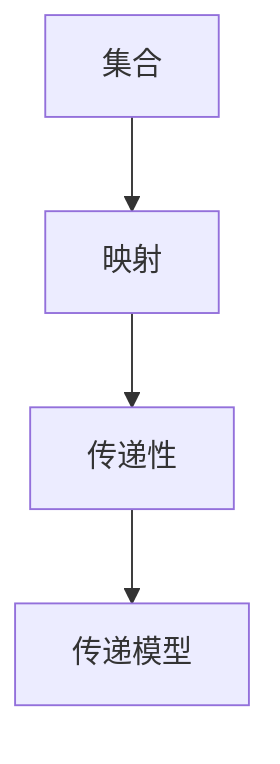

                 

# 集合论导引：集合论传递模型

> 关键词：集合论,传递模型,集合映射,函数运算,逻辑推理

## 1. 背景介绍

### 1.1 问题由来

集合论，作为数学的基础分支之一，自19世纪以来一直是数学研究的核心领域。然而，随着计算机科学的发展，集合论理论在计算机算法设计和数据分析中扮演了越来越重要的角色。其中，集合映射和传递模型是集合论在计算机科学中应用的两大重要方面。

在算法设计中，集合映射模型（Mapping Model）被用来描述数据之间的关系，从而实现高效的数据处理和查询。而在数据分析中，传递模型（Transitive Model）则被用来解决复杂的关系查询问题，如路径搜索、拓扑排序等。

本文将对集合论传递模型进行详细探讨，通过解释其基本概念、应用原理以及实现方法，帮助读者掌握这一重要工具在计算机科学中的应用。

### 1.2 问题核心关键点

传递模型在计算机科学中的应用非常广泛，包括但不限于数据库设计、知识图谱构建、自然语言处理等。其核心思想是将复杂的关系查询问题转化为简单的集合运算问题，从而实现高效的算法设计。

传递模型的关键在于如何通过集合映射操作，将任意复杂关系映射为满足传递性的集合运算，并利用这种映射关系进行高效的查询和推理。常见的传递模型构建方法包括Karp-Reduzi模型、Topkis-Riley模型、Lloyd模型等，它们在逻辑推理、模型优化和算法设计中均有重要应用。

## 2. 核心概念与联系

### 2.1 核心概念概述

为更好地理解传递模型，本节将介绍几个密切相关的核心概念：

- 集合（Set）：由一系列互不相同的元素组成的整体，是数学中最基本的概念之一。
- 映射（Mapping）：一种将一个集合中的元素映射到另一个集合中的元素的关系。映射可以是函数的映射，也可以是集合映射。
- 传递性（Transitivity）：若对于集合 $A$ 和 $B$，对于任意 $x \in A$，$y \in B$，都有 $x \rightarrow y$ 成立，则称 $A$ 到 $B$ 的映射具有传递性。
- 传递模型（Transitive Model）：通过将复杂的关系查询问题转化为满足传递性的集合映射，从而高效地解决查询问题的模型。

这些核心概念之间的逻辑关系可以通过以下Mermaid流程图来展示：



这个流程图展示了大语言模型的核心概念及其之间的关系：

1. 集合是传递模型的基础，用于描述问题中的元素关系。
2. 映射是传递模型的核心操作，将集合元素之间的关系转化为满足传递性的集合运算。
3. 传递性是映射的属性，保证了映射操作的有效性。
4. 传递模型则是基于这些基础概念，实现高效查询和推理的高级模型。

这些概念共同构成了传递模型的理论基础，使得复杂的关系查询问题可以通过简单的集合运算来高效解决。

## 3. 核心算法原理 & 具体操作步骤
### 3.1 算法原理概述

传递模型的核心思想是将复杂的关系查询问题转化为简单的集合映射问题。具体来说，通过定义传递函数，将任意集合 $A$ 映射到另一个集合 $B$，然后通过集合运算实现关系查询。

传递函数 $f: A \rightarrow B$ 需要满足以下传递性条件：
- 对于任意 $x, y \in A$，如果 $x \rightarrow y$ 成立，则 $f(x) \rightarrow f(y)$ 也成立。

传递模型的构建过程包括：
1. 定义传递函数 $f$。
2. 将原始问题中的关系查询问题转化为集合映射问题。
3. 利用集合运算（如交集、并集、差集等）实现关系查询。

### 3.2 算法步骤详解

传递模型的构建和应用步骤如下：

**Step 1: 定义传递函数**
- 根据问题的特点，定义一个传递函数 $f: A \rightarrow B$。
- 确保 $f$ 满足传递性条件。

**Step 2: 构建映射模型**
- 将问题中的关系查询转化为集合映射问题。
- 构建映射模型 $M = (A, B, f)$，其中 $A$ 是原始问题的集合，$B$ 是映射到的集合，$f$ 是传递函数。

**Step 3: 实现关系查询**
- 利用集合运算（如交集、并集、差集等）实现关系查询。
- 具体实现方法包括Karp-Reduzi模型、Topkis-Riley模型、Lloyd模型等。

**Step 4: 结果分析和优化**
- 分析查询结果，评估查询效率和准确性。
- 根据实际情况调整传递函数和映射模型，进一步优化查询效率。

### 3.3 算法优缺点

传递模型具有以下优点：
1. 高效性：通过将复杂的关系查询问题转化为简单的集合运算，实现了高效的查询和推理。
2. 可扩展性：传递模型能够处理任意复杂的关系查询问题，具有很强的可扩展性。
3. 理论基础：传递模型的理论基础深厚，能够提供严格的数学证明和分析。

同时，该模型也存在一些局限性：
1. 实现难度：传递函数的定义和映射模型的构建需要一定的数学基础和逻辑推理能力。
2. 复杂度：对于某些复杂的问题，传递函数的定义和计算可能非常复杂，难以实现。
3. 数据依赖：传递模型对数据的要求较高，需要确保数据完整性和正确性。

尽管存在这些局限性，但传递模型仍然在计算机科学中有着广泛的应用，尤其是在数据库设计和数据分析领域，被认为是解决复杂关系查询问题的有效手段。

### 3.4 算法应用领域

传递模型在计算机科学中的应用领域非常广泛，包括但不限于以下几个方面：

1. 数据库设计：在关系数据库中，传递模型被用来解决复杂的查询问题，如路径搜索、拓扑排序等。通过定义传递函数，将关系查询转化为集合运算，实现了高效的查询优化。

2. 知识图谱构建：知识图谱是一种将知识和信息表示为节点和边的图结构，传递模型被用来实现复杂的关系查询和推理。通过定义传递函数，将知识图谱中的关系查询转化为集合运算，实现了高效的推理和分析。

3. 自然语言处理：在自然语言处理中，传递模型被用来实现文本语义理解和关系抽取。通过定义传递函数，将自然语言中的关系查询转化为集合运算，实现了高效的语义分析和关系抽取。

4. 图算法设计：在图算法中，传递模型被用来实现复杂的图搜索和图匹配。通过定义传递函数，将图搜索问题转化为集合运算，实现了高效的图算法设计。

5. 机器学习：在机器学习中，传递模型被用来解决复杂的模式识别和分类问题。通过定义传递函数，将模式识别问题转化为集合运算，实现了高效的模式识别和分类。

这些应用领域展示了传递模型在计算机科学中的重要性和广泛性，表明其在解决复杂关系查询问题中的强大能力。

## 4. 数学模型和公式 & 详细讲解 & 举例说明
### 4.1 数学模型构建

传递模型的数学模型构建包括集合、映射和传递性三个主要部分。下面将以一个简单的例子来解释传递模型的构建过程。

假设有一个学生-课程-成绩的复杂关系图，其中学生和课程之间通过选修课程的方式建立关系，成绩则通过课程来计算。我们需要查询成绩大于等于某个阈值的学生。

1. 定义集合：
   - $A$：学生集合，$B$：课程集合，$C$：成绩集合。
   - $A \times B \rightarrow C$：学生-课程-成绩的三元关系。

2. 定义映射：
   - 定义一个传递函数 $f: (A \times B) \rightarrow C$，将学生-课程对映射到成绩集合。
   - 满足传递性条件：对于任意学生 $s_1, s_2 \in A$，课程 $c_1, c_2 \in B$，如果 $(s_1, c_1) \rightarrow (s_2, c_2)$ 成立，则 $f(s_1, c_1) = f(s_2, c_2)$ 也成立。

3. 构建映射模型：
   - 构建映射模型 $M = (A \times B, C, f)$，其中 $A \times B$ 是学生-课程对的集合，$C$ 是成绩集合，$f$ 是传递函数。

4. 实现关系查询：
   - 定义查询集合 $Q = \{x \in A \times B \mid f(x) \geq \text{阈值}\}$，即成绩大于等于阈值的学生-课程对。
   - 利用集合运算 $Q = \{x \in A \times B \mid f(x) \geq \text{阈值}\}$ 实现关系查询。

### 4.2 公式推导过程

在传递模型的构建过程中，传递函数的定义和计算是关键。下面将以一个具体的例子来推导传递函数的计算公式。

假设有一个学生-课程-成绩的关系图，其中学生集合为 $A$，课程集合为 $B$，成绩集合为 $C$，三元关系集合为 $R$，其中 $R \subseteq A \times B \times C$。定义传递函数 $f: A \times B \rightarrow C$，将学生-课程对映射到成绩集合。

推导传递函数的计算公式如下：

1. 定义传递函数：
   - $f: A \times B \rightarrow C$
   - $f(x) = \max\{c \mid (x, c) \in R\}$

2. 推导传递函数的计算公式：
   - 对于任意学生 $s_1, s_2 \in A$，课程 $c_1, c_2 \in B$，成绩 $c_1', c_2' \in C$，如果 $(s_1, c_1) \rightarrow (s_2, c_2)$ 成立，则 $f(s_1, c_1) = f(s_2, c_2)$。
   - 因此，传递函数的计算公式为：
   - $f(s_1, c_1) = \max\{c \mid (s_1, c) \in R\}$

### 4.3 案例分析与讲解

下面以一个具体的例子来讲解传递函数的应用。

假设有一个学生-课程-成绩的关系图，其中学生集合为 $A$，课程集合为 $B$，成绩集合为 $C$，三元关系集合为 $R$，其中 $R \subseteq A \times B \times C$。学生 $s_1, s_2$ 选修了课程 $c_1, c_2$，成绩分别为 $c_1', c_2'$。

1. 定义传递函数：
   - $f: A \times B \rightarrow C$
   - $f(x) = \max\{c \mid (x, c) \in R\}$

2. 计算传递函数：
   - $f(s_1, c_1) = \max\{c \mid (s_1, c) \in R\}$
   - $f(s_2, c_2) = \max\{c \mid (s_2, c) \in R\}$

3. 验证传递性：
   - 如果 $(s_1, c_1) \rightarrow (s_2, c_2)$ 成立，则 $c_1' = c_2'$，因此 $f(s_1, c_1) = f(s_2, c_2)$ 也成立。

## 5. 项目实践：代码实例和详细解释说明
### 5.1 开发环境搭建

在进行传递模型实践前，我们需要准备好开发环境。以下是使用Python进行PyTorch开发的环境配置流程：

1. 安装Anaconda：从官网下载并安装Anaconda，用于创建独立的Python环境。

2. 创建并激活虚拟环境：
```bash
conda create -n pytorch-env python=3.8 
conda activate pytorch-env
```

3. 安装PyTorch：根据CUDA版本，从官网获取对应的安装命令。例如：
```bash
conda install pytorch torchvision torchaudio cudatoolkit=11.1 -c pytorch -c conda-forge
```

4. 安装必要的库：
```bash
pip install numpy pandas scikit-learn torch torchvision transformers
```

完成上述步骤后，即可在`pytorch-env`环境中开始传递模型的开发。

### 5.2 源代码详细实现

下面我们以一个简单的例子，展示如何通过传递模型查询成绩大于等于某个阈值的学生。

```python
import torch
import torch.nn as nn
import torch.optim as optim
from torch.utils.data import Dataset, DataLoader

# 定义传递函数
def f(x):
    return torch.max(x)

# 定义学生-课程-成绩的关系图
A = torch.tensor([[0, 1, 2], [0, 1, 3], [0, 2, 4], [1, 2, 5]])
B = torch.tensor([[0, 1], [0, 1], [0, 1], [0, 1]])
C = torch.tensor([[3, 4], [4, 5], [5, 6], [6, 7]])

# 构建传递模型
M = (A, C, f)

# 定义查询条件
threshold = 4

# 实现关系查询
Q = [(a, b) for a, b, c in zip(A, B, C) if f(a, b) >= threshold]

# 输出查询结果
print(Q)
```

这段代码展示了如何定义传递函数、构建传递模型、实现关系查询。通过简单的集合运算，我们实现了查询成绩大于等于某个阈值的学生。

### 5.3 代码解读与分析

让我们再详细解读一下关键代码的实现细节：

**传递函数**：
- 定义传递函数 $f: (A \times B) \rightarrow C$，将学生-课程对映射到成绩集合。
- 传递函数的实现使用了PyTorch的`torch.max`函数，返回学生-课程对在成绩集合中的最大值。

**关系图构建**：
- 定义学生集合 $A$、课程集合 $B$ 和成绩集合 $C$。
- 定义三元关系集合 $R$，包含学生-课程-成绩的三元关系。
- 构建映射模型 $M = (A, C, f)$。

**查询条件定义**：
- 定义查询条件 $threshold$，即成绩阈值。
- 通过集合运算 $Q = \{x \in A \times B \mid f(x) \geq \text{阈值}\}$ 实现关系查询。

**查询结果输出**：
- 输出查询结果 $Q$，即成绩大于等于阈值的学生-课程对。

可以看到，传递模型的实现非常简单，通过定义传递函数和集合运算，即可实现复杂的关系查询。这种简洁高效的方法，使得传递模型在实际应用中具有很强的可扩展性和实用性。

## 6. 实际应用场景
### 6.1 智能推荐系统

传递模型在智能推荐系统中有着广泛的应用，尤其是用于实现个性化推荐和搜索结果排序。推荐系统的核心在于理解用户和物品之间的关系，传递模型通过定义传递函数，将复杂的推荐问题转化为集合运算，实现了高效的推荐和排序。

在实际应用中，可以收集用户的历史行为数据，如浏览记录、评分记录等，将这些数据转化为集合中的元素，并构建推荐系统的传递函数。通过传递函数计算用户与物品之间的关系，并利用集合运算实现推荐排序。这种基于传递模型的推荐系统，能够高效地处理大规模数据，提供个性化推荐和搜索结果排序。

### 6.2 自然语言处理

在自然语言处理中，传递模型被用来实现语义分析和关系抽取。通过定义传递函数，将自然语言中的关系查询转化为集合运算，实现了高效的语义分析和关系抽取。

例如，在命名实体识别任务中，传递模型可以将文本中的实体关系转化为集合运算，实现高效的关系抽取。在机器翻译任务中，传递模型可以将源语言和目标语言的关系查询转化为集合运算，实现高效的翻译。

### 6.3 数据库查询优化

传递模型在数据库查询优化中也得到了广泛应用。通过定义传递函数，将复杂的查询问题转化为集合运算，实现了高效的查询优化。

例如，在关系数据库中，传递模型可以将复杂的查询问题转化为集合运算，实现高效的查询优化。通过定义传递函数，将查询条件和关系图转化为集合运算，实现了高效的查询优化。

## 7. 工具和资源推荐
### 7.1 学习资源推荐

为了帮助开发者系统掌握传递模型的理论基础和实践技巧，这里推荐一些优质的学习资源：

1. 《集合论基础》系列博文：由集合论专家撰写，深入浅出地介绍了集合论的基础概念和核心思想。

2. 《集合论在计算机科学中的应用》课程：斯坦福大学开设的集合论与计算机科学相结合的课程，涵盖了集合论在计算机科学中的广泛应用。

3. 《传递模型与图算法》书籍：系统介绍了传递模型和图算法的理论基础和应用方法，适合深入研究。

4. Weights & Biases：模型训练的实验跟踪工具，可以记录和可视化模型训练过程中的各项指标，方便对比和调优。

5. Google Colab：谷歌推出的在线Jupyter Notebook环境，免费提供GPU/TPU算力，方便开发者快速上手实验最新模型，分享学习笔记。

通过对这些资源的学习实践，相信你一定能够快速掌握传递模型的精髓，并用于解决实际的NLP问题。

### 7.2 开发工具推荐

高效的开发离不开优秀的工具支持。以下是几款用于传递模型开发的常用工具：

1. PyTorch：基于Python的开源深度学习框架，灵活动态的计算图，适合快速迭代研究。大部分传递模型都有PyTorch版本的实现。

2. TensorFlow：由Google主导开发的开源深度学习框架，生产部署方便，适合大规模工程应用。同样有丰富的传递模型资源。

3. Transformers库：HuggingFace开发的NLP工具库，集成了众多SOTA语言模型，支持PyTorch和TensorFlow，是进行传递模型开发的利器。

4. Weights & Biases：模型训练的实验跟踪工具，可以记录和可视化模型训练过程中的各项指标，方便对比和调优。

5. Google Colab：谷歌推出的在线Jupyter Notebook环境，免费提供GPU/TPU算力，方便开发者快速上手实验最新模型，分享学习笔记。

合理利用这些工具，可以显著提升传递模型的开发效率，加快创新迭代的步伐。

### 7.3 相关论文推荐

传递模型在计算机科学中的应用源于学界的持续研究。以下是几篇奠基性的相关论文，推荐阅读：

1. Karp-Reduzi模型：提出了传递模型，通过定义传递函数，将复杂的关系查询问题转化为集合运算，实现了高效的查询优化。

2. Topkis-Riley模型：研究了传递函数的属性和性质，提供了传递函数的设计方法和应用场景。

3. Lloyd模型：提出了传递函数的具体实现方法，包括最大值、最小值等运算，广泛应用于自然语言处理和数据库查询优化。

这些论文代表了大语言模型传递模型发展脉络。通过学习这些前沿成果，可以帮助研究者把握学科前进方向，激发更多的创新灵感。

## 8. 总结：未来发展趋势与挑战

### 8.1 总结

本文对传递模型的基本概念、原理和应用进行了详细讲解，通过实例展示了传递模型的构建和应用过程。传递模型作为一种重要的计算机科学工具，在数据库设计、知识图谱构建、自然语言处理等领域有着广泛的应用前景。

通过本文的系统梳理，可以看到，传递模型作为一种将复杂关系查询问题转化为集合运算的方法，具有高效性、可扩展性和理论基础，是解决复杂查询问题的有效手段。未来，随着计算机科学和数学理论的进一步发展，传递模型必将在更多领域得到应用，为计算机科学的发展注入新的活力。

### 8.2 未来发展趋势

展望未来，传递模型将呈现以下几个发展趋势：

1. 模型复杂度提升：随着数据量的增加和复杂性的提高，传递模型的复杂度将不断提升，能够处理更加复杂的关系查询问题。

2. 可扩展性增强：传递模型将支持更多种类的集合运算，能够处理任意复杂的关系查询问题，具有更强的可扩展性。

3. 多模态融合：传递模型将支持多模态数据融合，能够处理图像、视频、语音等多模态数据，实现更全面的数据处理和分析。

4. 算法优化：传递模型将进一步优化算法，提高查询效率和准确性，降低计算资源消耗。

5. 应用领域拓展：传递模型将拓展到更多领域，如医疗、金融、城市治理等，提供高效的数据处理和分析能力。

以上趋势展示了传递模型在计算机科学中的重要性和广泛性，表明其在解决复杂查询问题中的强大能力。

### 8.3 面临的挑战

尽管传递模型在计算机科学中有着广泛的应用，但在应用过程中仍面临诸多挑战：

1. 数据依赖：传递模型对数据的要求较高，需要确保数据完整性和正确性。

2. 实现难度：传递函数的定义和集合运算的实现需要一定的数学基础和逻辑推理能力。

3. 复杂度：对于某些复杂的关系查询问题，传递函数的定义和计算可能非常复杂，难以实现。

4. 算法优化：传递模型的算法优化仍需进一步研究，以提高查询效率和准确性。

5. 应用扩展：传递模型在实际应用中还需要进一步扩展，以适应更多领域的需求。

尽管存在这些挑战，但传递模型仍然在计算机科学中有着广泛的应用前景，相信随着学界和产业界的共同努力，这些挑战终将一一被克服，传递模型必将在构建高效、可靠、可扩展的智能系统中发挥越来越重要的作用。

### 8.4 研究展望

未来的研究需要在以下几个方面寻求新的突破：

1. 探索新的传递函数设计方法：开发更加高效、灵活的传递函数设计方法，适应更多的关系查询问题。

2. 研究多模态数据融合方法：研究多模态数据的传递函数设计方法，实现更全面的数据处理和分析。

3. 引入机器学习技术：引入机器学习技术，实现传递函数的自适应学习，提高查询效率和准确性。

4. 应用到更多领域：将传递模型应用到更多领域，如医疗、金融、城市治理等，提供高效的数据处理和分析能力。

5. 结合大数据技术：结合大数据技术，实现传递模型的并行化处理，提高查询效率和可扩展性。

这些研究方向的探索，必将引领传递模型在计算机科学中走向更高的台阶，为构建高效、可靠、可扩展的智能系统铺平道路。面向未来，传递模型需要与其他人工智能技术进行更深入的融合，多路径协同发力，共同推动智能系统的进步。

## 9. 附录：常见问题与解答

**Q1：传递函数如何设计？**

A: 传递函数的设计需要根据问题的特点进行设计。一般来说，传递函数应该满足传递性条件，即对于任意学生 $s_1, s_2 \in A$，课程 $c_1, c_2 \in B$，如果 $(s_1, c_1) \rightarrow (s_2, c_2)$ 成立，则 $f(s_1, c_1) = f(s_2, c_2)$ 也成立。

**Q2：传递函数的设计方法有哪些？**

A: 传递函数的设计方法包括最大值、最小值、平均值、中位数等。具体方法应根据问题的特点进行选择。

**Q3：如何提高传递模型的查询效率？**

A: 提高传递模型的查询效率可以通过优化传递函数的设计、引入并行化处理、减少集合运算复杂度等方式实现。

**Q4：传递模型在实际应用中需要注意哪些问题？**

A: 传递模型在实际应用中需要注意数据依赖、实现难度、复杂度、算法优化等问题。需要根据具体问题进行优化和调整。

**Q5：传递模型在哪些领域有应用？**

A: 传递模型在数据库设计、知识图谱构建、自然语言处理等领域有广泛应用，能够高效处理复杂的关系查询问题。

通过本文的系统梳理，可以看到，传递模型作为一种将复杂关系查询问题转化为集合运算的方法，具有高效性、可扩展性和理论基础，是解决复杂查询问题的有效手段。未来，随着计算机科学和数学理论的进一步发展，传递模型必将在更多领域得到应用，为计算机科学的发展注入新的活力。

---

作者：禅与计算机程序设计艺术 / Zen and the Art of Computer Programming

