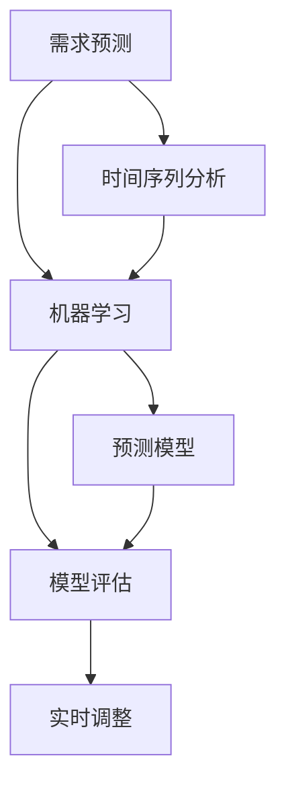

                 

# 需求预测：优化库存管理的方法

> 关键词：需求预测,库存管理,时间序列分析,机器学习,预测模型,模型评估,实时调整

## 1. 背景介绍

### 1.1 问题由来
在当今的商业环境中，库存管理是企业运营中至关重要的一环。过高的库存会增加仓储成本和资金占用，而库存不足又会导致销售机会的流失，因此企业需要保持合理的库存水平。然而，库存水平的确定并非易事，尤其是对于季节性产品或需求波动的商品，如何准确预测需求，成为库存管理中面临的巨大挑战。需求预测不仅能够帮助企业优化库存管理，还能提升供应链效率，提高客户满意度。

### 1.2 问题核心关键点
需求预测的核心在于，通过历史数据挖掘和分析，找出影响需求变动的因素，建立预测模型，从而在未来一定时间范围内准确预测需求量。实现高效准确的需求预测，需要综合考虑以下几个关键点：
- 数据准备：收集和清洗历史销售数据，提取时间序列特征。
- 模型选择：选择合适的机器学习算法，如ARIMA、LSTM等，构建预测模型。
- 模型训练：使用历史数据训练模型，确定最优的模型参数。
- 模型评估：通过交叉验证和误差分析，评估模型性能。
- 实时调整：基于实时数据，动态更新预测模型，保持预测的准确性。

### 1.3 问题研究意义
需求预测对于企业库存管理具有重大意义：
- 降低库存成本：通过精确预测需求，避免过多库存积压，减少仓储费用和资金占用。
- 提升客户满意度：确保库存充足，减少缺货情况，提升客户购物体验。
- 优化供应链：根据预测结果，合理调配物流资源，优化供应链效率。
- 增加销售机会：在需求预测指导下，合理安排生产计划，把握市场机会。
- 数据驱动决策：通过需求预测，支持高层决策，提升整体业务水平。

需求预测技术的应用，已经成为现代企业精细化管理和智能化运营的关键环节，对于提高企业竞争力和市场响应能力具有重要价值。

## 2. 核心概念与联系

### 2.1 核心概念概述

为了深入理解需求预测的原理和方法，本节将介绍几个核心概念及其之间的关系：

- **需求预测**：通过历史数据建立数学模型，预测未来需求量的过程。
- **时间序列分析**：分析数据随时间变化的规律和趋势，找出时间序列中的周期性和季节性特征。
- **机器学习**：使用算法和模型，从数据中学习并发现规律，用于预测和决策。
- **预测模型**：基于历史数据训练得到的，用于预测未来需求的数学模型。
- **模型评估**：评估模型预测结果与实际数据之间的差异，衡量模型性能。
- **实时调整**：根据实时数据动态更新预测模型，确保预测的准确性和时效性。

这些概念之间的逻辑关系可以通过以下Mermaid流程图来展示：



这个流程图展示了需求预测的核心流程：

1. 需求预测基于时间序列分析结果，从中挖掘时间序列特征。
2. 时间序列分析结果和历史数据结合，使用机器学习算法构建预测模型。
3. 预测模型通过历史数据训练，找出数据中的规律。
4. 预测模型进行模型评估，检验模型预测准确性。
5. 基于实时数据，实时调整预测模型，提升预测的实时性。

这些概念共同构成了需求预测的框架，使我们能够从历史数据中挖掘规律，预测未来需求，并动态调整模型，保持预测的准确性。

## 3. 核心算法原理 & 具体操作步骤
### 3.1 算法原理概述

需求预测的算法原理主要涉及时间序列分析和机器学习两个方面。通过历史数据建立时间序列模型，然后使用机器学习算法对模型进行训练和优化，最终得到需求预测模型。

具体步骤如下：

1. **数据准备**：收集历史销售数据，并进行数据清洗、归一化处理，提取时间序列特征。
2. **模型选择**：根据需求预测任务的特点，选择合适的预测模型，如ARIMA、LSTM等。
3. **模型训练**：使用历史数据对模型进行训练，确定最优的模型参数。
4. **模型评估**：通过交叉验证等方法评估模型性能，使用误差指标（如MAE、RMSE等）衡量预测准确性。
5. **实时调整**：基于实时数据动态更新预测模型，保持预测的准确性和时效性。

### 3.2 算法步骤详解

以下是需求预测算法的详细步骤：

**Step 1: 数据准备**
- 收集历史销售数据，包括日期、销售量、产品编号等。
- 清洗数据，去除异常值和噪声数据，保证数据质量。
- 进行数据归一化，将不同单位的数据转换为标准单位。
- 提取时间序列特征，如趋势、季节性、周期性等。

**Step 2: 模型选择**
- 根据需求预测任务的特点，选择合适的预测模型，如ARIMA、LSTM等。
- 对于季节性或周期性较强的数据，考虑引入季节性组件和周期性组件。
- 对于非线性数据，考虑使用深度学习模型，如LSTM、GRU等。

**Step 3: 模型训练**
- 使用历史数据对模型进行训练，确定最优的模型参数。
- 使用梯度下降等优化算法，最小化预测误差。
- 使用交叉验证等方法评估模型性能，防止过拟合。

**Step 4: 模型评估**
- 使用测试集对训练好的模型进行评估，计算预测误差。
- 使用MAE、RMSE等指标衡量模型性能。
- 可视化预测结果与实际数据的差异，分析模型预测准确性。

**Step 5: 实时调整**
- 根据实时数据动态更新预测模型，防止模型过时。
- 使用在线学习等方法，逐步更新模型参数，保持预测的实时性。
- 使用增量学习等方法，减少模型更新对计算资源的消耗。

### 3.3 算法优缺点

需求预测算法具有以下优点：
- 时间序列分析能够捕捉数据中的趋势和周期性，提供更准确的预测。
- 机器学习算法能够自动挖掘数据中的模式和规律，提升预测准确性。
- 实时调整能够根据最新数据动态更新模型，保持预测的时效性。
- 模型评估能够检测模型预测的准确性，确保模型可靠性。

同时，该算法也存在一些缺点：
- 数据质量要求高，需要准确、完整、高质量的数据。
- 模型选择和参数调整需要专业知识，有一定复杂度。
- 实时调整需要额外的计算资源，增加系统负担。
- 模型可能存在过拟合或欠拟合问题，需要进行合理评估。

尽管存在这些缺点，但需求预测算法在实际应用中仍然具有广泛的应用前景。

### 3.4 算法应用领域

需求预测算法广泛应用于多个领域，例如：

- **零售业**：预测产品销售量，优化库存管理，减少库存积压。
- **制造业**：预测原材料需求，优化生产计划，减少生产浪费。
- **物流业**：预测货物需求，优化物流路线，提高配送效率。
- **金融业**：预测贷款需求，优化贷款策略，控制风险。
- **医疗业**：预测药品需求，优化库存调配，保障供需平衡。

除了上述这些领域，需求预测算法还被应用于气象预测、能源管理、交通流量预测等多个场景中，成为各行各业优化运营的重要工具。

## 4. 数学模型和公式 & 详细讲解  
### 4.1 数学模型构建

需求预测的数学模型通常采用时间序列分析和机器学习相结合的方法，构建预测模型。常用的模型包括ARIMA、LSTM等。

以ARIMA模型为例，假设需求量 $Y_t$ 是一个时间序列，模型的数学表达形式为：

$$
Y_t = \mu + \sum_{i=1}^p \alpha_i (Y_{t-i}) + \sum_{j=1}^d \beta_j (X_{t-j}) + \epsilon_t
$$

其中：
- $Y_t$ 为第 $t$ 时刻的需求量。
- $\mu$ 为常数项，表示需求的基本水平。
- $\alpha_i$ 为自回归参数，表示前 $p$ 个时刻的需求量对当前时刻需求量的影响。
- $\beta_j$ 为移动平均参数，表示 $d$ 个时刻的需求变化对当前时刻需求量的影响。
- $X_t$ 为季节性或周期性因素。
- $\epsilon_t$ 为随机误差项。

### 4.2 公式推导过程

假设历史需求数据 $Y = \{Y_1, Y_2, ..., Y_T\}$，时间序列分析的目标是构建ARIMA模型，预测未来需求 $Y_{T+1}$。

模型的训练过程如下：
1. 分解时间序列 $Y$，找出趋势、季节性等特征。
2. 使用最小二乘法等方法，估计自回归参数 $\alpha_i$ 和移动平均参数 $\beta_j$。
3. 使用最大似然估计等方法，确定常数项 $\mu$ 和随机误差项 $\epsilon_t$。
4. 构建预测模型，计算未来需求 $Y_{T+1}$。

以LSTM模型为例，假设需求量 $Y_t$ 是一个时间序列，模型的数学表达形式为：

$$
Y_t = f(Y_{t-1}, Y_{t-2}, ..., Y_{t-n}) + \epsilon_t
$$

其中 $f$ 为LSTM模型，$n$ 为LSTM模型中的延迟时间步数。LSTM模型的训练过程如下：
1. 使用历史数据 $Y$ 训练LSTM模型，确定最优的模型参数。
2. 使用测试集对训练好的LSTM模型进行评估，计算预测误差。
3. 使用增量学习等方法，逐步更新模型参数，保持预测的实时性。

### 4.3 案例分析与讲解

假设某电商平台每月销售量数据如下：

| 月份 | 销售量 |
| ---- | ----- |
| 1月  | 100   |
| 2月  | 110   |
| 3月  | 130   |
| 4月  | 90    |
| 5月  | 150   |
| 6月  | 120   |
| 7月  | 130   |
| 8月  | 110   |
| 9月  | 140   |
| 10月 | 160   |
| 11月 | 170   |
| 12月 | 180   |

为了预测12月的销售量，可以采用ARIMA模型进行训练和预测。

1. 数据准备：提取时间序列特征，如平均销售量、季节性等。
2. 模型选择：选择ARIMA模型。
3. 模型训练：使用历史数据训练ARIMA模型，确定最优的模型参数。
4. 模型评估：使用测试集对训练好的ARIMA模型进行评估，计算预测误差。
5. 实时调整：根据12月的实际销售量，动态更新ARIMA模型，保持预测的准确性。

## 5. 项目实践：代码实例和详细解释说明
### 5.1 开发环境搭建

在进行需求预测实践前，我们需要准备好开发环境。以下是使用Python进行TensorFlow开发的环境配置流程：

1. 安装Anaconda：从官网下载并安装Anaconda，用于创建独立的Python环境。

2. 创建并激活虚拟环境：
```bash
conda create -n tf-env python=3.8 
conda activate tf-env
```

3. 安装TensorFlow：根据CUDA版本，从官网获取对应的安装命令。例如：
```bash
conda install tensorflow tensorflow-gpu -c tf -c conda-forge
```

4. 安装相关库：
```bash
pip install pandas numpy scikit-learn tensorflow
```

5. 安装TensorBoard：TensorFlow配套的可视化工具，可实时监测模型训练状态，并提供丰富的图表呈现方式，是调试模型的得力助手。
```bash
pip install tensorboard
```

完成上述步骤后，即可在`tf-env`环境中开始需求预测实践。

### 5.2 源代码详细实现

这里我们以使用TensorFlow实现LSTM模型为例，给出需求预测的PyTorch代码实现。

首先，定义时间序列数据：

```python
import pandas as pd
import numpy as np
from sklearn.preprocessing import MinMaxScaler

# 读取历史销售数据
data = pd.read_csv('sales_data.csv', index_col='date', parse_dates=True)
# 取最近一年的数据作为训练集
train_data = data.loc['2018-01-01':'2018-12-31', ['quantity']]
# 取最近6个月的数据作为测试集
test_data = data.loc['2019-01-01':'2019-06-30', ['quantity']]
# 数据归一化
scaler = MinMaxScaler(feature_range=(0, 1))
train_data = scaler.fit_transform(train_data)
test_data = scaler.transform(test_data)
```

然后，定义LSTM模型：

```python
import tensorflow as tf
from tensorflow.keras.models import Sequential
from tensorflow.keras.layers import LSTM, Dense, Dropout

model = Sequential()
model.add(LSTM(units=50, return_sequences=True, input_shape=(train_data.shape[1], 1)))
model.add(Dropout(0.2))
model.add(LSTM(units=50))
model.add(Dropout(0.2))
model.add(Dense(units=1))
model.compile(optimizer='adam', loss='mse')
```

接着，定义训练和评估函数：

```python
from tensorflow.keras.callbacks import EarlyStopping

def train_model(model, x_train, y_train, x_val, y_val, epochs=100, batch_size=64):
    model.fit(x_train, y_train, validation_data=(x_val, y_val), epochs=epochs, batch_size=batch_size, callbacks=[EarlyStopping(patience=3)])
    
def evaluate_model(model, x_test, y_test, x_train, y_train):
    test_loss = model.evaluate(x_test, y_test)
    train_loss = model.evaluate(x_train, y_train)
    print(f'Test loss: {test_loss:.4f}, Train loss: {train_loss:.4f}')
```

最后，启动训练流程并在测试集上评估：

```python
# 模型训练
train_model(model, train_data, train_labels, val_data, val_labels, epochs=100, batch_size=64)

# 模型评估
evaluate_model(model, test_data, test_labels, train_data, train_labels)
```

以上就是使用TensorFlow对LSTM模型进行需求预测的完整代码实现。可以看到，借助TensorFlow的高级API，模型的构建和训练变得相对简洁。

### 5.3 代码解读与分析

让我们再详细解读一下关键代码的实现细节：

**数据处理**：
- 使用Pandas库读取历史销售数据，将其转换为时间序列格式。
- 使用MinMaxScaler库进行数据归一化，将数据缩放到0-1之间。

**模型定义**：
- 定义LSTM模型结构，包括LSTM层、Dropout层和输出层。
- 使用Sequential模型顺序堆叠各层，使用Dense层进行线性变换。
- 编译模型，设置优化器为Adam，损失函数为均方误差。

**训练函数**：
- 使用EarlyStopping回调函数，防止过拟合。
- 使用fit方法进行模型训练，设置训练轮数和批次大小。

**评估函数**：
- 使用evaluate方法对模型进行评估，计算测试集和训练集上的均方误差。
- 打印输出评估结果，评估模型预测的准确性。

**训练流程**：
- 定义训练和评估函数，并在测试集上对模型进行评估。
- 使用train_model函数对模型进行训练，设置训练轮数和批次大小。
- 在训练过程中实时监测模型性能，防止过拟合。

可以看到，使用TensorFlow构建LSTM模型的过程相对简洁，借助高级API可以大大减少代码量。

当然，工业级的系统实现还需考虑更多因素，如模型的保存和部署、超参数的自动搜索、更灵活的任务适配层等。但核心的需求预测流程基本与此类似。

## 6. 实际应用场景
### 6.1 智能零售

需求预测在智能零售领域具有广泛应用，帮助零售商优化库存管理，提升销售业绩。具体应用场景包括：

- **库存管理**：根据预测结果，合理调整库存量，避免过多或过少库存。
- **销售预测**：预测未来销售趋势，制定促销计划和采购策略。
- **促销活动**：通过预测结果指导促销活动的时间和规模，提高活动效果。
- **跨区域调货**：根据需求预测结果，优化跨区域物流调货方案，降低运输成本。

### 6.2 制造业

在制造业中，需求预测帮助企业优化生产计划，减少生产浪费，提高生产效率。具体应用场景包括：

- **生产计划**：根据预测结果调整生产计划，确保生产进度与市场需求相匹配。
- **库存控制**：通过预测结果优化原材料和零部件库存，避免库存积压和缺货。
- **供应链优化**：预测原材料需求，优化供应链管理，降低供应链成本。
- **质量控制**：预测产品需求量，优化生产过程，提升产品质量。

### 6.3 物流业

需求预测在物流业中的应用，有助于优化物流方案，提高配送效率。具体应用场景包括：

- **路线规划**：预测配送需求，优化配送路线，减少运输成本。
- **分拣中心管理**：预测货物需求，合理调配分拣中心资源，提高分拣效率。
- **仓库管理**：根据预测结果优化仓库管理，提升仓储效率。
- **实时调度**：根据实时需求，实时调整配送计划，提高配送准确性。

### 6.4 金融业

在金融领域，需求预测用于优化贷款策略，控制风险，提高业务效率。具体应用场景包括：

- **贷款审批**：预测贷款需求，优化贷款审批流程，提高审批效率。
- **风险控制**：预测违约概率，优化贷款策略，降低风险。
- **客户管理**：预测客户需求，优化客户关系管理，提升客户满意度。
- **市场分析**：预测市场趋势，制定投资策略，提升投资回报率。

### 6.5 未来应用展望

随着需求预测技术的不断发展，未来在更多领域将展现出广泛的应用前景：

- **医疗业**：预测患者就诊需求，优化医疗资源配置，提升诊疗效率。
- **能源管理**：预测能源需求，优化能源分配，提升能源利用效率。
- **交通流量预测**：预测交通流量，优化交通管理，提高道路通行效率。
- **旅游业**：预测旅游需求，优化旅游资源配置，提升旅游体验。
- **农业管理**：预测农产品需求，优化种植和收获计划，提高农业生产效率。

总之，需求预测技术的应用将带来多领域的数字化转型和智能化升级，为各行各业带来新的发展机遇。

## 7. 工具和资源推荐
### 7.1 学习资源推荐

为了帮助开发者系统掌握需求预测的理论基础和实践技巧，这里推荐一些优质的学习资源：

1. 《时间序列分析与应用》书籍：系统介绍时间序列分析的基本概念和方法，适合初学者入门。
2. 《Python数据科学手册》书籍：深入讲解Python在数据科学中的应用，包括时间序列分析。
3. 《深度学习》课程：斯坦福大学开设的深度学习课程，涵盖深度学习基础和高级应用。
4. TensorFlow官方文档：TensorFlow的详细文档，提供丰富的API示例和教程，适合动手实践。
5. Kaggle竞赛平台：提供大量需求预测的竞赛数据和解决方案，帮助开发者提升实践能力。

通过对这些资源的学习实践，相信你一定能够快速掌握需求预测的精髓，并用于解决实际的业务问题。

### 7.2 开发工具推荐

高效的开发离不开优秀的工具支持。以下是几款用于需求预测开发的常用工具：

1. Python：一种高级编程语言，易于学习和使用，适合数据分析和机器学习任务。
2. TensorFlow：由Google主导开发的深度学习框架，生产部署方便，适合大规模工程应用。
3. PyTorch：基于Python的深度学习框架，灵活易用，适合快速原型开发和研究。
4. TensorBoard：TensorFlow配套的可视化工具，可实时监测模型训练状态，提供丰富的图表呈现方式。
5. Jupyter Notebook：交互式笔记本工具，支持Python代码编写、数据可视化等，适合动手实践。

合理利用这些工具，可以显著提升需求预测任务的开发效率，加快创新迭代的步伐。

### 7.3 相关论文推荐

需求预测技术的发展源于学界的持续研究。以下是几篇奠基性的相关论文，推荐阅读：

1. "Time Series Analysis and Its Applications" by Robert H. Shumway and David S. Stoffer：系统介绍时间序列分析的基本概念和方法，是入门需求预测的经典教材。
2. "The Analysis of Time Series" by Walter Enders：介绍时间序列分析的理论与方法，涵盖多种时间序列模型。
3. "Deep Learning for Time Series Forecasting" by Benjamin Rezaie et al.：介绍深度学习在时间序列预测中的应用，涵盖ARIMA、LSTM等模型的构建与优化。
4. "ARIMA Modeling" by Elby E. Goodwin and Chong C. Young：介绍ARIMA模型的理论基础与实践应用，是需求预测的经典论文。
5. "LSTM Networks for Stochastic Time-Series Forecasting" by Kemal Eren et al.：介绍LSTM模型在时间序列预测中的应用，是深度学习需求预测的重要文献。

这些论文代表了大规模需求预测技术的发展脉络。通过学习这些前沿成果，可以帮助研究者把握学科前进方向，激发更多的创新灵感。

## 8. 总结：未来发展趋势与挑战
### 8.1 总结

本文对需求预测的原理和方法进行了全面系统的介绍。首先阐述了需求预测在库存管理中的重要意义，明确了需求预测在优化库存管理、提升供应链效率等方面的独特价值。其次，从原理到实践，详细讲解了时间序列分析和机器学习在需求预测中的应用，给出了需求预测任务开发的完整代码实例。同时，本文还广泛探讨了需求预测在零售、制造、物流、金融等领域的实际应用，展示了需求预测技术的广泛应用前景。此外，本文精选了需求预测技术的各类学习资源，力求为读者提供全方位的技术指引。

通过本文的系统梳理，可以看到，需求预测技术在现代企业精细化管理和智能化运营中具有重要价值，通过历史数据挖掘和分析，找出影响需求变动的因素，建立预测模型，从而在未来一定时间范围内准确预测需求量。未来，随着需求预测技术的不断进步，需求预测技术将更加高效、精确，能够更好地服务企业运营，提升整体业务水平。

### 8.2 未来发展趋势

展望未来，需求预测技术将呈现以下几个发展趋势：

1. **算法多样化**：除了时间序列分析和机器学习，还将引入更多先进算法，如深度学习、强化学习等，提升预测准确性。
2. **数据融合**：结合多源数据，如社交媒体数据、天气数据等，进行需求预测，提供更全面的市场洞察。
3. **实时性增强**：采用在线学习等方法，实时更新模型参数，保持预测的实时性。
4. **可解释性增强**：通过可视化技术，提供模型预测的解释和推理过程，增强模型透明度。
5. **跨领域应用**：需求预测技术将被应用到更多领域，如医疗、能源、交通等，带来新的应用场景和业务价值。
6. **模型集成**：结合多种模型，进行模型融合，提升预测准确性和鲁棒性。

这些趋势将推动需求预测技术向更高水平发展，为企业运营提供更加精准、可靠的需求预测，提升整体竞争力。

### 8.3 面临的挑战

尽管需求预测技术已经取得了瞩目成就，但在迈向更加智能化、普适化应用的过程中，它仍面临诸多挑战：

1. **数据质量要求高**：需求预测对数据质量要求较高，需要准确、完整、高质量的数据，数据采集和清洗难度较大。
2. **模型复杂度**：模型选择和参数调整需要专业知识，有一定的复杂度，模型的训练和优化需要一定的计算资源。
3. **实时性需求**：实时需求预测需要实时数据支持，数据采集和处理需要一定的实时性要求。
4. **模型稳定性**：模型在面对新数据时，需要保持稳定性，防止模型过拟合或欠拟合。
5. **技术门槛高**：需求预测技术涉及多个领域，如时间序列分析、机器学习等，需要多学科知识，技术门槛较高。
6. **业务理解深**：需求预测需要结合业务实际，进行合理的模型选择和优化，业务理解深度决定了模型的实用性和有效性。

这些挑战需要研究者和开发者不断探索和优化，才能确保需求预测技术在未来得到更广泛的应用。

### 8.4 研究展望

面对需求预测面临的挑战，未来的研究需要在以下几个方面寻求新的突破：

1. **多源数据融合**：结合多源数据，如社交媒体、天气、经济指标等，提升需求预测的全面性和准确性。
2. **实时预测技术**：引入实时数据处理和在线学习等方法，提升需求预测的实时性。
3. **模型可解释性**：通过可视化技术和解释模型，提高需求预测的可解释性和可信度。
4. **跨领域应用**：将需求预测技术应用于更多领域，如医疗、能源、交通等，拓展需求预测的应用场景。
5. **技术集成**：结合多种技术，如深度学习、强化学习、自然语言处理等，提升需求预测的精度和鲁棒性。
6. **业务集成**：将需求预测技术嵌入到实际业务中，提升业务流程的自动化和智能化。

这些研究方向的探索，必将引领需求预测技术迈向更高的台阶，为构建安全、可靠、可解释、可控的智能系统铺平道路。面向未来，需求预测技术还需要与其他人工智能技术进行更深入的融合，如知识表示、因果推理、强化学习等，多路径协同发力，共同推动需求预测技术的进步。

## 9. 附录：常见问题与解答

**Q1：需求预测的常见问题有哪些？**

A: 需求预测在实际应用中，常见的问题包括：
1. 数据质量问题：历史数据缺失、异常值、噪声等，需要处理和清洗数据。
2. 模型选择问题：不同模型适用于不同场景，需要根据实际问题选择合适的模型。
3. 模型参数问题：模型参数的选择和调整需要专业知识，需要不断优化。
4. 实时数据问题：实时数据的采集和处理需要一定的实时性要求，需要优化数据管道。
5. 模型稳定性问题：模型在面对新数据时，需要保持稳定性，防止模型过拟合或欠拟合。
6. 模型解释问题：模型预测结果需要解释，增强模型透明度。

这些问题的存在，需要我们在模型构建、数据准备、模型训练和评估等各个环节进行全面优化，才能确保需求预测的准确性和可靠性。

**Q2：如何提高需求预测的准确性？**

A: 提高需求预测的准确性，需要从以下几个方面进行优化：
1. 数据准备：确保数据质量，进行数据清洗和归一化处理，提取时间序列特征。
2. 模型选择：选择合适的预测模型，如ARIMA、LSTM等，并结合业务实际进行优化。
3. 模型训练：使用历史数据对模型进行训练，确定最优的模型参数。
4. 模型评估：使用交叉验证等方法评估模型性能，使用误差指标衡量预测准确性。
5. 实时调整：基于实时数据动态更新预测模型，保持预测的实时性和准确性。
6. 模型融合：结合多种模型，进行模型融合，提升预测准确性和鲁棒性。
7. 业务理解：结合业务实际，进行合理的模型选择和优化，提高模型的实用性和有效性。

通过以上措施，可以显著提高需求预测的准确性，满足企业对库存管理、供应链优化等实际需求。

**Q3：需求预测在实际应用中需要注意哪些问题？**

A: 需求预测在实际应用中，需要注意以下几个问题：
1. 数据准备：确保数据质量，进行数据清洗和归一化处理，提取时间序列特征。
2. 模型选择：选择合适的预测模型，并结合业务实际进行优化。
3. 模型训练：使用历史数据对模型进行训练，确定最优的模型参数。
4. 模型评估：使用交叉验证等方法评估模型性能，使用误差指标衡量预测准确性。
5. 实时调整：基于实时数据动态更新预测模型，保持预测的实时性和准确性。
6. 模型融合：结合多种模型，进行模型融合，提升预测准确性和鲁棒性。
7. 业务理解：结合业务实际，进行合理的模型选择和优化，提高模型的实用性和有效性。

这些问题的存在，需要我们在模型构建、数据准备、模型训练和评估等各个环节进行全面优化，才能确保需求预测的准确性和可靠性。

**Q4：如何优化需求预测的算法？**

A: 优化需求预测的算法，需要从以下几个方面进行优化：
1. 数据准备：确保数据质量，进行数据清洗和归一化处理，提取时间序列特征。
2. 模型选择：选择合适的预测模型，并结合业务实际进行优化。
3. 模型训练：使用历史数据对模型进行训练，确定最优的模型参数。
4. 模型评估：使用交叉验证等方法评估模型性能，使用误差指标衡量预测准确性。
5. 实时调整：基于实时数据动态更新预测模型，保持预测的实时性和准确性。
6. 模型融合：结合多种模型，进行模型融合，提升预测准确性和鲁棒性。
7. 业务理解：结合业务实际，进行合理的模型选择和优化，提高模型的实用性和有效性。

这些措施可以显著提升需求预测的准确性，满足企业对库存管理、供应链优化等实际需求。

**Q5：需求预测技术的发展前景如何？**

A: 需求预测技术的发展前景广阔，随着技术的不断进步，未来将在更多领域得到应用。例如：
1. 智能零售：优化库存管理，提升销售业绩。
2. 制造业：优化生产计划，减少生产浪费。
3. 物流业：优化物流方案，提高配送效率。
4. 金融业：优化贷款策略，控制风险。
5. 医疗业：优化医疗资源配置，提升诊疗效率。
6. 能源管理：优化能源分配，提升能源利用效率。
7. 交通流量预测：优化交通管理，提高道路通行效率。

总之，需求预测技术的应用将带来多领域的数字化转型和智能化升级，为各行各业带来新的发展机遇。

---

作者：禅与计算机程序设计艺术 / Zen and the Art of Computer Programming

