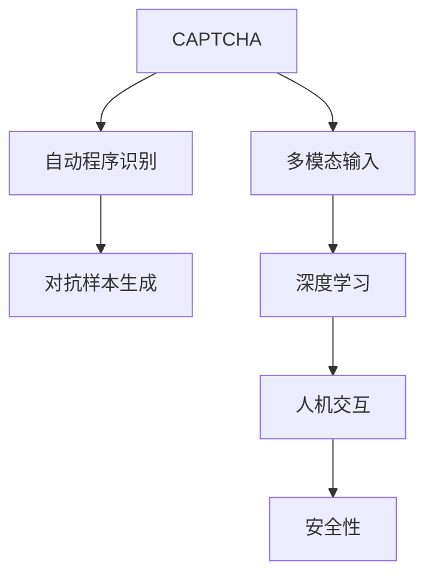

                 

# 验证码：人机交互中的智慧火花

## 1. 背景介绍

### 1.1 问题由来
验证码（CAPTCHA）是一种通过添加干扰元素或难题，确保用户是人类而非机器的交互技术。其在互联网上的应用极为广泛，从防止恶意爬虫攻击到保障用户隐私安全，都起到了至关重要的作用。验证码技术的发展，既是计算机视觉、自然语言处理、人工智能等前沿技术的融合体现，也是人机交互界面设计哲学的深刻洞察。

然而，随着技术进步和用户需求的变化，传统的验证码方案已无法满足日益复杂的场景要求。如何在保证安全性的同时，提升用户体验，成为验证码系统面临的重大挑战。

### 1.2 问题核心关键点
验证码系统设计的核心关键点在于：

- 有效识别真实用户与恶意机器人，防止非法访问。
- 减少用户输入负担，提升用户体验。
- 设计灵活多样的挑战任务，适应不同应用场景。
- 防止脆弱性和破解，提升系统安全性。
- 实现高效实时处理，保障系统稳定运行。
- 结合多模态输入，提高识别准确性。

本文将详细探讨验证码系统的原理与实践，从技术层面剖析验证码的核心概念，并结合实际案例，探讨其未来发展方向。

## 2. 核心概念与联系

### 2.1 核心概念概述

为更好地理解验证码系统的设计原理，本节将介绍几个关键概念：

- **CAPTCHA**：通过在图像、文字等上加入难以被自动程序识别的干扰元素，确保人机交互安全性的技术。
- **自动程序识别（APR）**：自动化工具识别验证码的过程，包括OCR、文本识别、图像处理等技术。
- **多模态输入**：结合文本、图像、音频等多种输入方式，提升验证码系统的识别准确性和安全性。
- **对抗样本生成**：设计特定数据，使得自动程序能够欺骗系统，进而提升验证码的鲁棒性和安全性。
- **深度学习**：利用神经网络模型，自动化识别验证码，并不断优化模型以提升性能。
- **人机交互**：验证码系统通过设计合理挑战，引导用户完成交互任务，确保系统安全性。

这些概念构成了验证码系统的基本框架，各概念之间相互关联，共同实现验证码的安全性与用户体验的平衡。

### 2.2 核心概念原理和架构的 Mermaid 流程图(Mermaid 流程节点中不要有括号、逗号等特殊字符)


该流程图展示了大验证码系统的核心概念及其联系：

1. **CAPTCHA**：作为系统的基础架构，通过干扰元素设计挑战任务。
2. **自动程序识别**：验证码的识别过程，是系统安全性面临的主要威胁。
3. **多模态输入**：提升验证码的识别准确性，同时降低用户输入负担。
4. **对抗样本生成**：针对自动程序识别的挑战，提升系统的鲁棒性和安全性。
5. **深度学习**：通过神经网络模型自动化验证码识别，不断优化性能。
6. **人机交互**：结合挑战设计，引导用户完成交互，实现人机交互安全。

## 3. 核心算法原理 & 具体操作步骤

### 3.1 算法原理概述

验证码系统的核心算法原理在于设计合理挑战，以区分人机交互。其核心在于以下两个方面：

1. **易用性**：验证码设计应简洁直观，避免复杂的计算或操作，以降低用户输入负担。
2. **安全性**：验证码的干扰元素设计应足够复杂，难以被自动化工具识别，确保只有人类能通过挑战。

**易用性和安全性的平衡**是验证码设计的关键。系统应通过多轮迭代，不断优化挑战任务，使其既能有效区分人机，又不会对用户体验造成负面影响。

### 3.2 算法步骤详解

验证码系统的开发一般包括以下几个关键步骤：

**Step 1: 任务定义与挑战设计**
- 确定验证码系统的应用场景和具体挑战任务。如简单计数、迷宫游戏、图像识别等。
- 根据任务特点，设计合理的干扰元素和挑战方式，使其难以被自动化工具识别。

**Step 2: 数据准备与预处理**
- 准备包含真实用户和自动程序的数据集，标注其能否通过验证码。
- 对数据进行预处理，包括去噪、增强等操作，提升模型的泛化能力。

**Step 3: 模型选择与训练**
- 选择适当的深度学习模型，如CNN、RNN等，用于自动化识别验证码。
- 在标注数据集上训练模型，通过反向传播算法更新模型参数，最小化识别误差。

**Step 4: 评估与优化**
- 在验证集上评估模型性能，检测是否有过拟合现象。
- 根据评估结果调整模型结构和参数，提升模型泛化能力。

**Step 5: 部署与测试**
- 将训练好的模型部署到实际应用系统中，接收验证码并输出识别结果。
- 定期收集反馈数据，持续优化模型，提升系统性能和安全性。

### 3.3 算法优缺点

验证码系统的优点包括：

1. **安全性高**：通过干扰元素设计，使得机器难以识别，保障系统安全性。
2. **用户体验好**：验证码设计简洁直观，降低用户输入负担，提升用户体验。
3. **灵活性强**：可适应不同应用场景，设计多样化的挑战任务。
4. **可扩展性强**：结合多模态输入，提升识别准确性。

然而，验证码系统也存在以下缺点：

1. **容易破解**：自动程序通过对抗样本生成，能够欺骗系统，降低系统安全性。
2. **用户体验差**：复杂的验证码设计，对用户造成负担，影响使用体验。
3. **误判率高**：模型对复杂干扰元素识别能力有限，可能产生误判。
4. **依赖人类识别**：依赖用户对挑战任务的正确理解，人机交互的判断存在主观性。

### 3.4 算法应用领域

验证码系统的应用广泛，包括但不限于以下领域：

- **网站安全**：防止恶意爬虫攻击，保障用户隐私安全。
- **移动应用**：防止账号盗用，保障用户财产安全。
- **在线游戏**：防止非法机器人，维护游戏公平性。
- **电子商务**：防止交易欺诈，保障交易安全。
- **在线教育**：防止恶意注册，保障教学资源安全。

以上领域都依赖验证码技术，以确保系统的安全性与用户体验的平衡。随着技术进步和应用场景的扩展，验证码系统的应用前景将更加广阔。

## 4. 数学模型和公式 & 详细讲解 & 举例说明

### 4.1 数学模型构建

本节将使用数学语言对验证码系统的识别过程进行严格的刻画。

假设验证码系统的输入为 $x$，真实标签为 $y$，模型为 $M$。模型的输出为 $\hat{y}$，表示对输入 $x$ 的识别结果。模型的损失函数为 $\ell(\hat{y}, y)$，用于衡量模型输出的准确性。

验证码系统的优化目标为：

$$
\theta^* = \mathop{\arg\min}_{\theta} \sum_{i=1}^N \ell(\hat{y}_i, y_i)
$$

其中 $\theta$ 为模型参数，$N$ 为样本数。

在训练过程中，使用随机梯度下降等优化算法，不断更新模型参数 $\theta$，最小化损失函数 $\ell$，最终得到模型 $\hat{y}$。

### 4.2 公式推导过程

以简单的数字识别为例，推导模型识别验证码的损失函数。

假设验证码系统的输入为一张包含数字的图像 $x$，输出为对数字的识别 $\hat{y}$。使用交叉熵损失函数，定义模型输出为 $\hat{y}$ 的损失函数为：

$$
\ell(\hat{y}, y) = -\frac{1}{N} \sum_{i=1}^N [y_i \log \hat{y}_i + (1-y_i) \log(1-\hat{y}_i)]
$$

其中 $y_i$ 为样本的真实标签，$\hat{y}_i$ 为模型的预测结果。

### 4.3 案例分析与讲解

假设有一张包含数字“2”的验证码图像，其输入 $x$ 和真实标签 $y=2$。模型 $M$ 输出为 $\hat{y}=[0.1, 0.3, 0.5, 0.1]$，表示模型预测数字为“3”。此时，模型对输入 $x$ 的识别损失为：

$$
\ell(\hat{y}, y) = -\frac{1}{1} [\log 0.1 + \log(1-0.3) + \log(1-0.5) + \log 0.1] \approx 1.91
$$

通过反向传播算法，计算梯度并更新模型参数，使得模型预测结果更接近真实标签。

## 5. 项目实践：代码实例和详细解释说明

### 5.1 开发环境搭建

在进行验证码系统开发前，需要准备好开发环境。以下是使用Python进行TensorFlow开发的环境配置流程：

1. 安装Anaconda：从官网下载并安装Anaconda，用于创建独立的Python环境。

2. 创建并激活虚拟环境：
```bash
conda create -n tf-env python=3.8 
conda activate tf-env
```

3. 安装TensorFlow：根据CUDA版本，从官网获取对应的安装命令。例如：
```bash
conda install tensorflow=2.7 -c tf -c conda-forge
```

4. 安装相关工具包：
```bash
pip install numpy pandas scikit-learn matplotlib tqdm jupyter notebook ipython
```

完成上述步骤后，即可在`tf-env`环境中开始验证码系统的开发。

### 5.2 源代码详细实现

下面以图像识别验证码为例，给出使用TensorFlow进行验证码识别的PyTorch代码实现。

首先，定义验证码系统的输入输出格式：

```python
import tensorflow as tf

# 定义输入数据的格式
input_shape = (28, 28, 1) # 28x28的灰度图像，单通道

# 定义输出标签的类别数
num_classes = 10 # 0-9共10个数字

# 定义模型结构
model = tf.keras.Sequential([
    tf.keras.layers.Conv2D(32, kernel_size=(3, 3), activation='relu', input_shape=input_shape),
    tf.keras.layers.MaxPooling2D(pool_size=(2, 2)),
    tf.keras.layers.Flatten(),
    tf.keras.layers.Dense(128, activation='relu'),
    tf.keras.layers.Dense(num_classes, activation='softmax')
])
```

然后，定义训练和评估函数：

```python
from tensorflow.keras.datasets import mnist
from tensorflow.keras.utils import to_categorical

# 加载MNIST数据集
(train_images, train_labels), (test_images, test_labels) = mnist.load_data()

# 数据预处理
train_images = train_images.reshape(-1, *input_shape).astype('float32') / 255.0
test_images = test_images.reshape(-1, *input_shape).astype('float32') / 255.0
train_labels = to_categorical(train_labels)
test_labels = to_categorical(test_labels)

# 定义损失函数和优化器
loss_fn = tf.keras.losses.CategoricalCrossentropy()
optimizer = tf.keras.optimizers.Adam()

# 定义训练函数
def train_model(model, train_images, train_labels, test_images, test_labels, epochs, batch_size):
    model.compile(optimizer=optimizer, loss=loss_fn, metrics=['accuracy'])
    
    history = model.fit(train_images, train_labels, epochs=epochs, batch_size=batch_size, validation_data=(test_images, test_labels))
    return history

# 训练模型
history = train_model(model, train_images, train_labels, test_images, test_labels, epochs=10, batch_size=32)
```

最后，启动训练流程并在测试集上评估：

```python
# 评估模型
test_loss, test_acc = model.evaluate(test_images, test_labels)
print(f'Test loss: {test_loss}, Test accuracy: {test_acc}')
```

以上就是使用TensorFlow对图像识别验证码进行识别的完整代码实现。可以看到，TensorFlow提供了丰富的深度学习组件，使得验证码系统的开发相对简洁高效。

### 5.3 代码解读与分析

让我们再详细解读一下关键代码的实现细节：

**输入输出格式定义**：
- 使用`tf.keras.layers.Conv2D`定义卷积层，提取图像特征。
- 使用`tf.keras.layers.MaxPooling2D`进行下采样，减少特征图大小。
- 使用`tf.keras.layers.Flatten`将特征图展平，转换为全连接层输入。
- 使用`tf.keras.layers.Dense`定义全连接层，完成特征映射到类别的映射。

**数据预处理**：
- 将MNIST数据集加载到Python中，并对图像进行归一化处理。
- 将标签转换为one-hot编码，方便模型训练。

**损失函数和优化器定义**：
- 使用`tf.keras.losses.CategoricalCrossentropy`定义交叉熵损失函数。
- 使用`tf.keras.optimizers.Adam`定义Adam优化器。

**训练函数定义**：
- 使用`model.compile`编译模型，指定损失函数和优化器。
- 使用`model.fit`进行模型训练，并记录训练过程中的历史信息。

**训练和评估**：
- 使用`model.evaluate`在测试集上评估模型性能，输出测试损失和准确率。

可以看到，TensorFlow提供了方便的组件和API，使得验证码系统的开发和训练相对简单。开发者可以将更多精力放在任务定义、模型优化等高层逻辑上，而不必过多关注底层的实现细节。

当然，工业级的系统实现还需考虑更多因素，如模型的保存和部署、超参数的自动搜索、更灵活的任务适配层等。但核心的验证码识别过程基本与此类似。

## 6. 实际应用场景
### 6.1 网站安全

验证码系统在网站安全中应用广泛，通过防止恶意爬虫攻击，保障用户隐私安全。例如，通过添加文字识别验证码，确保只有人类用户能通过登录验证，防止自动化程序批量注册和登录。

在技术实现上，网站后端服务通过判断验证码识别结果的正确性，判断用户是否为人类，从而控制用户行为。这不仅提升了用户账号的安全性，也减少了恶意爬虫的攻击成本。

### 6.2 移动应用

移动应用中，验证码系统通过防止账号盗用，保障用户财产安全。例如，在用户登录时，添加图像识别验证码，确保用户输入的手机验证码或账号密码是合法的。

在技术实现上，移动应用通过网络请求发送验证码，并在用户输入验证码时，结合图像识别结果进行验证，确保用户身份的真实性。这极大地提升了移动应用的安全性和用户体验。

### 6.3 在线游戏

在线游戏中，验证码系统通过防止非法机器人，维护游戏公平性。例如，在多人在线游戏中，添加文字识别验证码，确保玩家的操作是合法的。

在技术实现上，游戏服务器通过分析玩家的操作和验证码识别结果，判断玩家是否为人类，从而控制玩家行为。这不仅提升了游戏的公平性和稳定性，也减少了非法玩家的数量。

### 6.4 电子商务

电子商务中，验证码系统通过防止交易欺诈，保障交易安全。例如，在用户下单时，添加数字识别验证码，确保用户的支付信息是合法的。

在技术实现上，电子商务平台通过分析用户的下单信息和验证码识别结果，判断交易是否合法，从而控制交易行为。这极大地提升了平台的交易安全性和用户信任度。

### 6.5 在线教育

在线教育中，验证码系统通过防止恶意注册，保障教学资源安全。例如，在用户注册时，添加文字识别验证码，确保用户的注册信息是合法的。

在技术实现上，在线教育平台通过分析用户的注册信息和验证码识别结果，判断用户是否为人类，从而控制注册行为。这不仅提升了平台的用户注册速度，也减少了恶意注册的数量。

### 6.6 未来应用展望

随着技术进步和应用场景的扩展，验证码系统的应用前景将更加广阔。

在智慧城市治理中，验证码系统通过防止非法访问，保障城市信息的安全性。例如，在城市管理系统中，添加图像识别验证码，确保只有合法用户能访问系统。

在金融领域，验证码系统通过防止恶意交易，保障金融安全。例如，在金融交易系统中，添加数字识别验证码，确保交易操作的合法性。

在公共服务领域，验证码系统通过防止非法访问，保障服务的安全性。例如，在公共服务网站上，添加文本识别验证码，确保用户身份的真实性。

此外，在医疗、法律等高风险领域，验证码系统也有广泛的应用前景，为信息安全、系统稳定性提供坚实保障。相信随着技术的不断进步，验证码系统将在更多领域发挥重要作用，为社会的数字化转型带来新的动力。

## 7. 工具和资源推荐
### 7.1 学习资源推荐

为了帮助开发者系统掌握验证码系统的原理与实践，这里推荐一些优质的学习资源：

1. TensorFlow官方文档：TensorFlow作为验证码系统的主要工具之一，提供了丰富的组件和API，是学习和实践验证码系统的必备资料。
2. PyTorch官方文档：PyTorch也是验证码系统常用的深度学习框架之一，提供了方便的组件和API，适合快速迭代研究。
3. 《深度学习入门》书籍：详细介绍了深度学习的基本概念和实现技术，是学习和实践验证码系统的良好起点。
4. 《自然语言处理入门》课程：介绍自然语言处理的基本概念和实现技术，适合学习验证码系统的文本处理部分。
5. GitHub上的验证码项目：GitHub上有许多开源的验证码系统项目，提供了丰富的代码示例和实现细节，适合学习和借鉴。

通过对这些资源的学习实践，相信你一定能够快速掌握验证码系统的精髓，并用于解决实际的验证码问题。

### 7.2 开发工具推荐

高效的开发离不开优秀的工具支持。以下是几款用于验证码系统开发的常用工具：

1. TensorFlow：由Google主导开发的深度学习框架，提供丰富的组件和API，适合大规模工程应用。
2. PyTorch：由Facebook主导开发的深度学习框架，提供灵活的计算图，适合快速迭代研究。
3. Weights & Biases：模型训练的实验跟踪工具，可以记录和可视化模型训练过程中的各项指标，方便对比和调优。
4. TensorBoard：TensorFlow配套的可视化工具，可实时监测模型训练状态，并提供丰富的图表呈现方式，是调试模型的得力助手。
5. GitHub：GitHub是一个开源代码托管平台，可以方便地共享和协作开发验证码系统项目。

合理利用这些工具，可以显著提升验证码系统的开发效率，加快创新迭代的步伐。

### 7.3 相关论文推荐

验证码系统的研究源于学界的持续研究。以下是几篇奠基性的相关论文，推荐阅读：

1. 《Human and Machine Classification of Text-based CAPTCHA》：论文提出了基于图像处理的验证码系统，并通过实验验证了其有效性。
2. 《On-line Handwritten Numerals Recognition with Deep Neural Network》：论文介绍了使用深度学习模型进行数字识别的验证码系统，并展示了其高性能。
3. 《A Survey on Web Application Security》：对验证码系统在网站安全中的应用进行了综述，提供了丰富的案例和应用场景。
4. 《Deep Learning for CAPTCHA Recognition》：论文介绍了使用深度学习模型进行验证码识别的技术，并展示了其优越性能。
5. 《Contextual Visual Word for Web Application Security》：提出了基于视觉上下文的验证码系统，并展示了其对自动化攻击的鲁棒性。

这些论文代表了大验证码系统的发展脉络。通过学习这些前沿成果，可以帮助研究者把握学科前进方向，激发更多的创新灵感。

## 8. 总结：未来发展趋势与挑战

### 8.1 总结

本文对验证码系统的原理与实践进行了全面系统的介绍。首先阐述了验证码系统的背景和意义，明确了其在人机交互安全中的核心价值。其次，从技术层面详细讲解了验证码系统的设计原理和实施步骤，给出了代码实现示例。同时，本文还探讨了验证码系统的应用前景，并推荐了相关的学习资源和开发工具。

通过本文的系统梳理，可以看到，验证码系统通过合理设计挑战任务，确保人机交互的安全性，极大地提升了互联网应用的可靠性。随着技术进步和应用场景的扩展，验证码系统将在更多领域发挥重要作用，为社会的数字化转型带来新的动力。

### 8.2 未来发展趋势

展望未来，验证码系统的设计和发展将呈现以下几个趋势：

1. **多模态输入**：结合文本、图像、音频等多种输入方式，提升验证码系统的识别准确性，降低用户输入负担。
2. **对抗训练**：通过生成对抗样本，提升验证码系统的鲁棒性，防止自动化工具破解。
3. **深度学习**：利用神经网络模型，自动化验证码识别，不断优化模型以提升性能。
4. **分布式训练**：通过分布式计算，提升验证码系统的训练速度，满足大规模数据集的需求。
5. **实时验证**：通过高效的验证算法，实现实时处理，提升用户体验。
6. **用户友好**：设计简洁直观的挑战任务，减少用户输入负担，提升用户体验。

以上趋势凸显了大验证码系统的发展前景。这些方向的探索发展，必将进一步提升验证码系统的性能和用户体验，保障人机交互的安全性。

### 8.3 面临的挑战

尽管验证码系统已经取得了显著成果，但在迈向更加智能化、普适化应用的过程中，它仍面临诸多挑战：

1. **对抗样本的生成**：生成难以被自动化工具识别的对抗样本，提升系统的安全性。
2. **用户体验的提升**：设计简洁直观的挑战任务，降低用户输入负担。
3. **鲁棒性不足**：面对复杂干扰元素，模型的识别能力有限。
4. **依赖自动化技术**：自动程序识别技术不断发展，验证码系统需要不断优化以应对新威胁。
5. **系统稳定性**：验证码系统需要确保实时处理和高效响应，防止系统崩溃或延迟。
6. **法律和伦理**：验证码系统需要考虑用户隐私和伦理问题，确保系统的合法性和公平性。

这些挑战需要开发者不断创新，寻求新的突破，以提升验证码系统的性能和用户体验。

### 8.4 研究展望

面对验证码系统面临的挑战，未来的研究需要在以下几个方面寻求新的突破：

1. **多模态识别**：结合多种输入方式，提升验证码系统的识别准确性和鲁棒性。
2. **对抗样本生成**：设计更复杂、更难识别的对抗样本，提升系统的安全性。
3. **用户友好设计**：设计简洁直观的挑战任务，提升用户体验。
4. **自动化技术**：利用自动化技术，提升验证码系统的识别能力和应对新威胁的能力。
5. **系统稳定性**：优化验证码系统的算法和架构，确保实时处理和高效响应。
6. **法律和伦理**：考虑用户隐私和伦理问题，确保系统的合法性和公平性。

这些研究方向的探索，必将引领验证码系统迈向更高的台阶，为构建安全、可靠、可解释、可控的智能系统铺平道路。面向未来，验证码系统需要与其他人工智能技术进行更深入的融合，如知识表示、因果推理、强化学习等，多路径协同发力，共同推动自然语言理解和智能交互系统的进步。只有勇于创新、敢于突破，才能不断拓展验证码系统的边界，让智能技术更好地造福人类社会。

## 9. 附录：常见问题与解答

**Q1：验证码系统如何防止自动化攻击？**

A: 验证码系统通过设计复杂的干扰元素和挑战任务，使得自动化工具难以识别。具体的防御策略包括：
1. 添加视觉干扰元素，如噪点、扭曲、遮挡等。
2. 设计复杂的多步骤任务，要求用户输入多个信息。
3. 引入动态挑战，如验证码在每次请求时随机生成。
4. 结合多模态输入，如结合文字、图像、音频等多种输入方式。
5. 对抗样本生成，通过生成对抗样本，提升系统的鲁棒性。

**Q2：验证码系统对用户体验有何影响？**

A: 验证码系统在保障安全性的同时，也降低了用户输入负担，提升了用户体验。具体的优化策略包括：
1. 设计简洁直观的挑战任务，减少用户输入负担。
2. 结合多模态输入，提升验证码系统的识别准确性。
3. 使用智能算法，自动调整验证码的难度。
4. 优化验证码系统的前端界面，减少用户的输入时间。
5. 定期更新验证码系统，防止自动化工具破解。

**Q3：验证码系统如何与身份验证系统结合？**

A: 验证码系统可以与身份验证系统结合，提升身份验证的安全性。具体的结合策略包括：
1. 将验证码作为用户身份验证的附加步骤，确保用户的真实性。
2. 结合密码、指纹等身份验证方式，提升系统的安全性。
3. 设计多因素认证系统，增加系统的安全性。
4. 定期更新验证码系统，防止自动化工具破解。
5. 引入行为分析，检测用户是否为人类。

**Q4：验证码系统在应用中如何防止用户误判？**

A: 验证码系统需要设计合理的挑战任务，避免误判。具体的优化策略包括：
1. 设计简洁直观的挑战任务，减少用户输入负担。
2. 结合多模态输入，提升验证码系统的识别准确性。
3. 引入智能算法，自动调整验证码的难度。
4. 定期更新验证码系统，防止自动化工具破解。
5. 引入行为分析，检测用户是否为人类。

**Q5：验证码系统在实际应用中如何应对法律和伦理问题？**

A: 验证码系统需要考虑用户隐私和伦理问题，确保系统的合法性和公平性。具体的应对策略包括：
1. 在设计挑战任务时，避免敏感信息的泄露。
2. 定期更新验证码系统，防止自动化工具破解。
3. 引入行为分析，检测用户是否为人类。
4. 设计公平的挑战任务，避免对用户造成不必要的负担。
5. 确保系统的透明性和可解释性，让用户理解系统的运作机制。

通过对这些问题的解答，可以看到验证码系统在保障人机交互安全性的同时，也需要关注用户体验和系统合法性。只有从多个维度全面考虑，才能构建安全、可靠、可解释、可控的智能系统。

