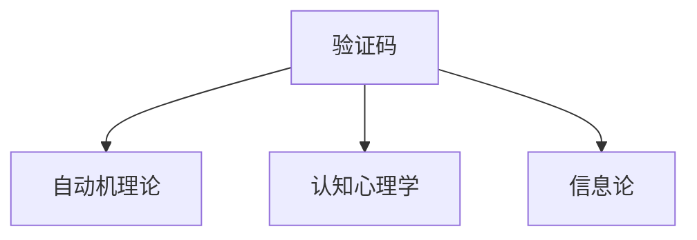

                 

# 验证码：人类计算的另类应用场景

验证码（CAPTCHA）是一种常见的用于区分计算机与人类用户的挑战-响应测试。它通常包含数字、字母或图片的组合，要求用户通过识别这些内容来证明其是人类。验证码的出现是为了防止自动化程序（如机器人脚本）的滥用，如垃圾邮件、恶意软件下载、网络钓鱼等行为。

然而，验证码不仅仅是防范滥用的工具，它也是一种巧妙地将人类计算引入计算机领域的应用场景。本文将探讨验证码的原理、核心算法、应用场景及未来趋势。

## 1. 背景介绍

### 1.1 问题由来

验证码最初是为了应对自动化程序的滥用而设计的。随着互联网的发展，自动化程序在网页浏览、在线游戏等领域得到了广泛应用，但同时也带来了大量虚假信息和滥用行为。验证码的出现，有效缓解了这一问题，被广泛应用于各种在线服务中。

### 1.2 问题核心关键点

验证码的原理在于利用人类与机器在识别能力上的差异。人类在视觉、语言理解等方面具有明显优势，而机器则相对较弱。通过设计一些看似简单但人类容易识别、机器难以识别的挑战，可以有效区分计算机与人类，从而防止自动化程序的滥用。

## 2. 核心概念与联系

### 2.1 核心概念概述

为了更好地理解验证码的工作原理，本节将介绍几个密切相关的核心概念：

- 验证码(CAPTCHA)：一种常见的用于区分计算机与人类用户的挑战-响应测试，通常包含数字、字母或图片的组合，要求用户通过识别这些内容来证明其是人类。
- 自动机理论(Automata Theory)：研究计算系统（如计算机、图灵机）的形式化理论，是验证码设计的基础。
- 认知心理学(Cognitive Psychology)：研究人类认知过程的理论，解释了验证码为何难以被机器识别。
- 信息论(Information Theory)：研究信息传输、处理和编码的理论，解释了验证码为何有效。

这些核心概念之间的逻辑关系可以通过以下Mermaid流程图来展示：



这个流程图展示了这个核心概念之间的联系：

1. 验证码的原理和设计基于自动机理论。
2. 验证码的设计也受到认知心理学的影响，解释了人类和机器在识别能力上的差异。
3. 信息论提供了理论支持，解释了验证码为何能有效区分人类与机器。

## 3. 核心算法原理 & 具体操作步骤

### 3.1 算法原理概述

验证码的原理基于计算机与人类在识别能力上的差异。人类在视觉、语言理解等方面具有明显优势，而机器则相对较弱。通过设计一些看似简单但人类容易识别、机器难以识别的挑战，可以有效区分计算机与人类，从而防止自动化程序的滥用。

### 3.2 算法步骤详解

验证码的设计和验证通常包括以下几个关键步骤：

**Step 1: 生成验证码图像**
- 使用随机生成算法生成数字、字母或图案，生成一张包含验证码的图像。
- 对图像进行渲染，如添加噪声、扭曲等，增加难度，使得机器难以识别。

**Step 2: 用户识别验证码**
- 用户通过观察验证码图像，识别出其中的内容。
- 用户输入识别结果，例如数字或字母。

**Step 3: 验证用户身份**
- 将用户输入与生成验证码的随机内容进行比对，验证其正确性。
- 如果识别正确，用户可以继续访问系统；否则，用户将被拒绝访问。

### 3.3 算法优缺点

验证码的优点在于其简单有效，可以防止自动化程序的滥用。缺点在于其设计复杂，容易遭到破解，并且对用户体验有影响。

**优点：**
1. 简单易用：验证码的设计相对简单，容易实现。
2. 有效性：验证码可以有效区分计算机与人类，防止自动化程序的滥用。
3. 广泛应用：验证码被广泛应用于各种在线服务中，如登录、注册、评论等。

**缺点：**
1. 设计复杂：验证码的设计复杂，需要考虑图像生成、用户识别、验证等环节。
2. 容易被破解：随着技术的发展，验证码容易被破解，如自动化程序、人工智能等。
3. 影响用户体验：验证码对用户体验有影响，如识别难度大、操作繁琐等。

### 3.4 算法应用领域

验证码不仅用于防止自动化程序的滥用，还被应用于以下几个领域：

- 在线服务：如登录、注册、评论、提交表单等。
- 游戏：如验证玩家身份、防止作弊等。
- 电子商务：如防止恶意下单、识别假冒交易等。
- 在线广告：如验证广告点击是否来自人类，防止广告欺诈。

## 4. 数学模型和公式 & 详细讲解 & 举例说明

### 4.1 数学模型构建

验证码的数学模型通常基于自动机理论，可以表示为以下形式：

$$
M = (S, \Sigma, \delta, F, Q)
$$

其中：
- $S$ 为状态集合，表示验证码的不同状态。
- $\Sigma$ 为输入符号集合，表示验证码可能包含的数字、字母或图案。
- $\delta: S \times \Sigma \rightarrow S$ 为状态转移函数，表示根据输入符号，状态如何转移。
- $F \subseteq S$ 为可接受状态集合，表示用户成功识别验证码的状态。
- $Q$ 为初始状态，表示验证码生成的初始状态。

### 4.2 公式推导过程

验证码的验证过程可以通过以下公式推导：

$$
\delta(q, a) = q'
$$

其中 $q$ 为当前状态，$a$ 为输入符号，$q'$ 为转移后的状态。验证过程可以表示为：

$$
\delta(Q, x) \in F
$$

其中 $x$ 为用户输入的验证码内容，$F$ 为可接受状态集合。

### 4.3 案例分析与讲解

以一个简单的验证码设计为例，考虑以下状态集合和输入符号集合：

- $S = \{q_0, q_1, q_2, q_3\}$：表示验证码的不同状态，如未输入、已输入数字1、已输入数字2、已输入数字3。
- $\Sigma = \{1, 2, 3, x\}$：表示验证码可能包含的数字和字母。

状态转移函数 $\delta$ 可以表示为：

- $\delta(q_0, 1) = q_1$
- $\delta(q_1, 2) = q_2$
- $\delta(q_2, 3) = q_3$
- $\delta(q_3, x) = q_3$

可接受状态集合 $F = \{q_3\}$，表示用户成功识别验证码。

用户输入验证码的验证过程可以表示为：

- 用户输入 1，状态转移至 q1
- 用户输入 2，状态转移至 q2
- 用户输入 3，状态转移至 q3
- 用户输入 x，状态保持在 q3，表示验证通过

## 5. 项目实践：代码实例和详细解释说明

### 5.1 开发环境搭建

在进行验证码实践前，我们需要准备好开发环境。以下是使用Python进行PyTorch开发的环境配置流程：

1. 安装Anaconda：从官网下载并安装Anaconda，用于创建独立的Python环境。

2. 创建并激活虚拟环境：
```bash
conda create -n captcha-env python=3.8 
conda activate captcha-env
```

3. 安装PyTorch：根据CUDA版本，从官网获取对应的安装命令。例如：
```bash
conda install pytorch torchvision torchaudio cudatoolkit=11.1 -c pytorch -c conda-forge
```

4. 安装Pillow库：用于验证码图像的生成和处理。
```bash
pip install pillow
```

5. 安装Flask：用于搭建简单的Web服务，展示验证码页面和接收验证码输入。
```bash
pip install flask
```

完成上述步骤后，即可在`captcha-env`环境中开始验证码实践。

### 5.2 源代码详细实现

下面是一个使用PyTorch和Pillow库实现的简单验证码系统：

```python
import torch
import torch.nn as nn
from PIL import Image, ImageDraw, ImageFont
from random import randint, choice

class Captcha(nn.Module):
    def __init__(self, width=128, height=64):
        super(Captcha, self).__init__()
        self.width = width
        self.height = height
        self.font = ImageFont.truetype('arial.ttf', 28)
        self.color = (255, 255, 255)
        self.bg_color = (0, 0, 0)
        self.symbols = '0123456789ABCDEFGHIJKLMNOPQRSTUVWXYZ'
        
    def generate(self):
        code = ''.join([choice(self.symbols) for _ in range(4)])
        image = Image.new('RGB', (self.width, self.height), color=self.bg_color)
        draw = ImageDraw.Draw(image)
        draw.text((30, 20), code, font=self.font, fill=self.color)
        return image
    
    def forward(self, x):
        x = torch.tensor(x, dtype=torch.long).view(-1, 1)
        return x
    
class Verify(nn.Module):
    def __init__(self):
        super(Verify, self).__init__()
        self.fc1 = nn.Linear(28*28*len(self.symbols), 100)
        self.fc2 = nn.Linear(100, len(self.symbols))
    
    def forward(self, x):
        x = x.reshape(-1, 28*28)
        x = torch.relu(self.fc1(x))
        x = torch.relu(self.fc2(x))
        return x
    
def generate_code(image):
    code = ''.join([choice(self.symbols) for _ in range(4)])
    return code
    
def show_code(code, image):
    draw = ImageDraw.Draw(image)
    draw.text((30, 20), code, font=self.font, fill=self.color)
    return image
    
def generate_captcha():
    captcha = Captcha()
    code = generate_code(captcha)
    image = captcha.generate()
    image = show_code(code, image)
    return code, image
    
def verify_code(code, image):
    captcha = Captcha()
    code_input = torch.tensor([list(map(int, list(code)))]).float().view(-1, 1)
    captcha_model = Verify()
    captcha_model.load_state_dict(torch.load('captcha.pth'))
    captcha_model.eval()
    with torch.no_grad():
        output = captcha_model(code_input)
        pred = torch.argmax(output, dim=1)
        return pred.tolist()[0]
```

### 5.3 代码解读与分析

让我们再详细解读一下关键代码的实现细节：

**Captcha类**：
- `__init__`方法：初始化验证码的宽度、高度、字体、颜色等关键组件。
- `generate`方法：生成一个4位数字的验证码，并在图像上绘制出来。
- `forward`方法：定义验证码的输入输出格式。

**Verify类**：
- `__init__`方法：初始化全连接神经网络层。
- `forward`方法：定义验证码的验证过程，输入为验证码字符的编码，输出为预测的验证码字符。

**generate_code和show_code函数**：
- `generate_code`函数：随机生成4位数字验证码。
- `show_code`函数：在验证码图像上添加验证码字符。

**generate_captcha和verify_code函数**：
- `generate_captcha`函数：生成验证码图像和验证码字符串。
- `verify_code`函数：验证用户输入的验证码字符是否与生成的验证码字符串匹配。

**Web服务代码**：
- 使用Flask搭建一个简单的Web服务，展示验证码页面和接收验证码输入。

**show_code函数**：
- 使用Pillow库在验证码图像上绘制验证码字符，定义了字符的位置、字体、颜色等参数。

这个简单的验证码系统展示了如何使用PyTorch和Pillow库进行验证码的设计和验证。开发者可以根据实际需求，对代码进行优化和扩展，如加入图像处理、图像生成等高级功能。

## 6. 实际应用场景

### 6.1 智能客服系统

验证码可以在智能客服系统中用于验证用户身份，防止自动化程序的滥用。智能客服系统需要识别用户的身份，确保其操作符合规则，防止恶意操作和欺诈行为。

在技术实现上，可以将验证码生成和验证嵌入到智能客服系统中，用户每次进行操作前都需要输入验证码。系统根据用户输入的验证码验证其身份，通过后才能进行下一步操作。

### 6.2 金融交易系统

金融交易系统需要确保交易的安全性和合法性。验证码可以用于验证用户身份，防止恶意操作和欺诈行为。

在技术实现上，可以将验证码生成和验证嵌入到金融交易系统中，用户每次进行交易前都需要输入验证码。系统根据用户输入的验证码验证其身份，通过后才能进行交易操作。

### 6.3 电子商务平台

电子商务平台需要确保用户的购买行为合法、真实。验证码可以用于验证用户身份，防止恶意下单和欺诈行为。

在技术实现上，可以将验证码生成和验证嵌入到电子商务平台上，用户每次下单前都需要输入验证码。系统根据用户输入的验证码验证其身份，通过后才能进行下单操作。

### 6.4 在线广告系统

在线广告系统需要确保广告点击的合法性和真实性。验证码可以用于验证用户身份，防止广告欺诈和恶意点击。

在技术实现上，可以将验证码生成和验证嵌入到在线广告系统中，用户每次点击广告前都需要输入验证码。系统根据用户输入的验证码验证其身份，通过后才能进行广告点击操作。

## 7. 工具和资源推荐

### 7.1 学习资源推荐

为了帮助开发者系统掌握验证码的原理和实现方法，这里推荐一些优质的学习资源：

1. 《Python网络爬虫》系列书籍：由Python之父Guido van Rossum所著，详细介绍了网络爬虫的实现方法和技术细节，包括验证码的生成和验证。
2. 《深度学习》系列课程：由斯坦福大学Andrew Ng主讲，介绍了深度学习的基本原理和应用方法，包括验证码的机器学习实现。
3. 《TensorFlow官方文档》：由Google开发，详细介绍了TensorFlow框架的使用方法，包括验证码的实现和验证。
4. 《Python图像处理》系列教程：由网上开源教程，详细介绍了Python图像处理的方法和技巧，包括验证码的生成和识别。

通过对这些资源的学习实践，相信你一定能够快速掌握验证码的原理和实现方法，并用于解决实际的NLP问题。

### 7.2 开发工具推荐

高效的开发离不开优秀的工具支持。以下是几款用于验证码开发的常用工具：

1. PyTorch：基于Python的开源深度学习框架，灵活动态的计算图，适合快速迭代研究。大多数验证码生成和验证算法都有PyTorch版本的实现。
2. TensorFlow：由Google主导开发的开源深度学习框架，生产部署方便，适合大规模工程应用。同样有丰富的验证码生成和验证资源。
3. OpenCV：开源计算机视觉库，提供了丰富的图像处理函数，适合验证码图像的生成和处理。
4. Pillow：Python图像处理库，提供了丰富的图像处理函数，适合验证码图像的生成和显示。
5. Flask：Python Web框架，适合搭建简单的Web服务，展示验证码页面和接收验证码输入。
6. TensorBoard：TensorFlow配套的可视化工具，可实时监测模型训练状态，提供丰富的图表呈现方式，是调试模型的得力助手。

合理利用这些工具，可以显著提升验证码开发效率，加快创新迭代的步伐。

### 7.3 相关论文推荐

验证码的研究源于学界的持续研究。以下是几篇奠基性的相关论文，推荐阅读：

1. "ReCAPTCHA: How to Secure Web Applications by Hiding a Challenge in a Image of a Building"：介绍ReCAPTCHA系统的实现方法和原理，是验证码领域的经典之作。
2. "Image-Based CAPTCHA: How secure are they?"：通过实验分析了验证码系统的安全性和脆弱性，提供了验证码系统的改进建议。
3. "Privacy-Preserving Online User Authentication via Ateno"：介绍了一种基于图卷积神经网络的验证码生成和验证方法，具有较高的安全性和隐私保护性。
4. "Towards Interactive Web Applications"：介绍了Web应用中交互式的验证码生成和验证方法，提高了验证码系统的用户体验和安全性。

这些论文代表了大验证码研究的发展脉络。通过学习这些前沿成果，可以帮助研究者把握学科前进方向，激发更多的创新灵感。

## 8. 总结：未来发展趋势与挑战

### 8.1 总结

本文对验证码的原理、核心算法、应用场景及未来趋势进行了全面系统的介绍。首先，验证码作为一种重要的安全机制，已经广泛应用于各种在线服务中。其次，验证码的设计和验证过程基于自动机理论和认知心理学，可以有效防止自动化程序的滥用。此外，验证码还被应用于智能客服、金融交易、电子商务、在线广告等多个领域，提升了在线服务的安全性和合法性。

通过本文的系统梳理，可以看到，验证码不仅是一种安全机制，更是一种巧妙地将人类计算引入计算机领域的应用场景。验证码的实现需要综合考虑图像生成、用户识别、验证等环节，其设计和验证过程需要不断优化和改进，才能真正实现其应用价值。

### 8.2 未来发展趋势

展望未来，验证码技术将呈现以下几个发展趋势：

1. 图像生成技术改进。随着深度学习技术的发展，验证码的图像生成技术将不断改进，生成更加难以识别的验证码图像。
2. 识别技术提升。通过机器学习算法，验证码的识别技术将不断提升，防止自动化程序的破解。
3. 多模态验证技术。结合语音、生物特征等多种验证方式，提升验证码系统的安全性。
4. 无标签验证技术。通过无监督学习算法，实现验证码的无标签验证，提高系统的鲁棒性和适应性。
5. 实时验证技术。通过实时计算技术，实现验证码的实时验证，提高系统的响应速度和安全性。

这些趋势将进一步提升验证码系统的安全性和用户体验，为在线服务的安全性和合法性提供更可靠的支持。

### 8.3 面临的挑战

尽管验证码技术已经取得了不错的应用效果，但在迈向更加智能化、普适化应用的过程中，它仍面临着诸多挑战：

1. 图像生成难度大。验证码的图像生成需要考虑复杂性和多样性，生成难度大，容易遭到自动化程序的破解。
2. 识别技术复杂。验证码的识别技术需要不断优化，防止自动化程序的破解，技术实现复杂。
3. 用户体验差。验证码对用户体验有影响，如识别难度大、操作繁琐等。
4. 系统安全性不足。验证码系统容易被自动化程序破解，系统安全性不足。

这些挑战需要不断优化验证码的设计和实现方法，才能真正发挥其安全性和实用性。

### 8.4 研究展望

未来，验证码技术需要在以下几个方面进行深入研究：

1. 图像生成技术改进。需要研究更加复杂、难以识别的验证码图像生成技术，提升系统的安全性。
2. 识别技术提升。需要研究更加高效的验证码识别技术，防止自动化程序的破解。
3. 多模态验证技术。需要研究多种验证方式的结合，提升系统的安全性和鲁棒性。
4. 无标签验证技术。需要研究无监督学习算法，实现验证码的无标签验证，提高系统的适应性和鲁棒性。
5. 实时验证技术。需要研究实时计算技术，实现验证码的实时验证，提高系统的响应速度和安全性。

这些研究方向将推动验证码技术不断进步，为在线服务的安全性和合法性提供更可靠的支持。

## 9. 附录：常见问题与解答

**Q1：验证码的设计是否会影响用户体验？**

A: 验证码的设计确实会影响用户体验，尤其是对于视力不佳的用户，识别难度大，操作繁琐。然而，验证码的设计需要兼顾安全性和用户体验，需要在两者之间进行权衡。

**Q2：验证码是否容易被自动化程序破解？**

A: 验证码容易被自动化程序破解，尤其是通过机器学习和深度学习算法，识别验证码的准确率不断提升。因此，验证码的设计需要不断优化，提升系统的安全性。

**Q3：验证码是否会被误判为自动化程序？**

A: 验证码的设计需要考虑误判的问题，可以通过添加噪声、扭曲等方式，增加机器识别的难度，防止自动化程序的误判。

**Q4：验证码是否会存在歧视性？**

A: 验证码的设计需要避免歧视性，尤其是在多语言和国际化应用中，需要考虑到不同语言和文化背景的用户，避免误判和歧视。

**Q5：验证码是否会受到自动化程序攻击？**

A: 验证码可能会受到自动化程序的攻击，如自动化程序通过暴力破解等方式，试图破解验证码。因此，验证码的设计需要不断优化，提升系统的安全性。

这些问题是验证码应用中常见的挑战，需要在设计和使用过程中不断优化和改进，才能真正发挥其安全性和实用性。

---

作者：禅与计算机程序设计艺术 / Zen and the Art of Computer Programming

