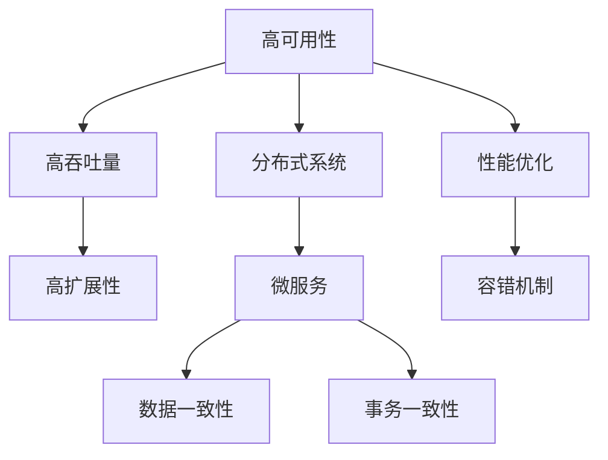

                 

# 高可用性、高吞吐量、高扩展性系统设计案例

> 关键词：高可用性, 高吞吐量, 高扩展性, 分布式系统, 微服务, 数据一致性, 事务一致性, 性能优化, 容错机制

## 1. 背景介绍

### 1.1 问题由来
随着互联网和移动互联网的迅猛发展，各类应用对系统的性能、可用性和扩展性提出了更高的要求。以电商平台的订单系统为例，每天可能有数亿次订单操作，用户体验的好坏直接影响着公司的业绩。因此，高可用性、高吞吐量、高扩展性的系统设计成为了电商领域的一项重要课题。

### 1.2 问题核心关键点
构建高可用性、高吞吐量、高扩展性的系统，需要从以下几个方面进行思考：

- 如何保证系统的稳定性和可用性？
- 如何提升系统的吞吐量和响应速度？
- 如何支持系统的水平扩展？
- 如何处理分布式环境下的数据一致性和事务一致性问题？
- 如何实现系统的性能优化和容错机制？

### 1.3 问题研究意义
通过解决上述问题，可以构建一个既稳定可靠、又高效灵活的系统，适应业务快速发展的需要，提升用户满意度和公司的竞争力。本文将从这些核心关键点出发，详细探讨系统设计的高可用性、高吞吐量、高扩展性方案。

## 2. 核心概念与联系

### 2.1 核心概念概述

为更好地理解高可用性、高吞吐量、高扩展性系统设计的实现原理，本节将介绍几个密切相关的核心概念：

- 高可用性（High Availability）：指系统持续提供服务的能力，即使部分组件出现故障，也能保证服务的连续性。
- 高吞吐量（High Throughput）：指系统单位时间内处理的请求数量，直接影响用户的使用体验和系统的负载均衡。
- 高扩展性（High Scalability）：指系统能够根据业务需求进行水平扩展，增加计算和存储资源，以应对数据量的增长。
- 分布式系统（Distributed System）：由多台计算机通过网络协同工作的系统，具备高可用性、高吞吐量、高扩展性等特性。
- 微服务（Microservices）：将大型应用拆分为一系列独立的小型服务，每个服务负责特定的功能模块，增强系统的灵活性和可扩展性。
- 数据一致性（Data Consistency）：指分布式系统中各节点数据的一致性，是保证系统数据准确性的基础。
- 事务一致性（Transactional Consistency）：指分布式系统中事务的原子性、一致性、隔离性和持久性，是保证数据操作正确性的关键。
- 性能优化（Performance Optimization）：通过算法、数据结构、硬件等方面的优化，提升系统的运行效率。
- 容错机制（Fault Tolerance）：在系统出现故障时，通过冗余设计、自我修复等手段，保证系统服务的连续性。

这些核心概念之间的逻辑关系可以通过以下Mermaid流程图来展示：



这个流程图展示出高可用性、高吞吐量、高扩展性系统设计的关键组件及其之间的关系：

1. 高可用性通过分布式系统和微服务来实现，通过冗余设计和自我修复等手段保证服务的连续性。
2. 高吞吐量依赖性能优化技术，提升系统的处理能力。
3. 高扩展性则通过分布式系统和微服务的优势，支持系统的水平扩展。
4. 数据一致性和事务一致性是分布式系统中必须解决的基础问题，通过合适的算法和协议来实现。
5. 性能优化和容错机制是提升系统稳定性和可靠性的关键技术，通过合理的架构和设计来优化。

## 3. 核心算法原理 & 具体操作步骤

### 3.1 算法原理概述

构建高可用性、高吞吐量、高扩展性的系统，主要依赖于分布式系统设计和微服务架构。这些技术的核心原理在于：

- 冗余设计：通过多节点部署、数据备份等手段，保证系统的冗余性和容错性。
- 负载均衡：通过调度算法将请求分配到不同的节点上，均衡负载，提高系统的处理能力。
- 故障转移：在系统出现故障时，通过预定的故障转移机制，快速切换到备份节点，保持服务的连续性。
- 微服务架构：将系统拆分为多个独立的小服务，每个服务独立部署、独立扩展，提升系统的灵活性和可扩展性。
- 数据一致性算法：如Paxos、Raft等，保证分布式系统中各节点数据的一致性。
- 事务一致性协议：如ACID、BASE等，保证分布式系统中事务的一致性。
- 性能优化技术：如缓存、异步处理、分布式锁等，提升系统的响应速度和吞吐量。

### 3.2 算法步骤详解

以下是构建高可用性、高吞吐量、高扩展性系统的详细步骤：

**Step 1: 设计分布式系统架构**

- 选择合适的分布式框架，如Apache Zookeeper、Eureka、Consul等。
- 设计系统的拓扑结构，包括数据分片、服务部署、网络通信等。
- 配置负载均衡和故障转移策略，如轮询、哈希、IPHA等。

**Step 2: 实现微服务**

- 将系统功能模块拆分为多个独立的服务，每个服务负责特定的功能。
- 为每个服务设计独立的接口和数据模型，便于独立部署和扩展。
- 使用服务注册和发现机制，如Eureka、Consul等，动态管理服务实例。

**Step 3: 实现数据一致性**

- 选择合适的数据一致性算法，如Paxos、Raft等，保证数据在分布式环境下的正确性。
- 设计数据同步机制，如同步复制、异步复制等，保证数据的及时性和一致性。
- 使用分布式锁和事务控制，如Zookeeper、Redis等，保证数据操作的原子性和一致性。

**Step 4: 实现事务一致性**

- 设计事务的分布式控制协议，如ACID、BASE等，保证事务的一致性。
- 使用分布式事务框架，如Seata、Dubbo等，实现事务的跨服务管理。
- 设计异常处理和重试机制，保证系统在异常情况下的稳定性。

**Step 5: 实现性能优化**

- 使用缓存技术，如Redis、Memcached等，提升数据的读取速度。
- 使用异步处理技术，如消息队列、异步任务等，提升系统的并发处理能力。
- 使用分布式锁和互斥机制，如Zookeeper、Semaphore等，避免并发冲突。

**Step 6: 实现容错机制**

- 使用冗余设计，如主备节点、数据备份等，保证系统的可用性。
- 设计自愈机制，如自我修复、自动恢复等，在故障发生时快速恢复服务。
- 使用监控和告警系统，如ELK Stack、Prometheus等，实时监控系统状态，及时发现和处理问题。

### 3.3 算法优缺点

高可用性、高吞吐量、高扩展性的系统设计具有以下优点：

- 提升系统的稳定性和可靠性，保障服务的连续性。
- 提升系统的处理能力和响应速度，提高用户体验。
- 支持系统的水平扩展，增强系统的可扩展性。

同时，这种设计也存在以下缺点：

- 系统架构复杂，设计和维护成本较高。
- 数据一致性和事务一致性的实现较为复杂，需要精心设计。
- 性能优化和容错机制的实现需要投入大量的精力和时间。

尽管存在这些局限性，但就目前而言，这种系统设计仍然是构建高性能、高可用、高扩展系统的最佳实践。

### 3.4 算法应用领域

高可用性、高吞吐量、高扩展性的系统设计已经在众多领域得到广泛应用，例如：

- 电商平台的订单系统、库存管理系统等。
- 金融系统的交易系统、清算系统等。
- 社交网络的微博系统、视频直播系统等。
- 在线教育的在线答疑系统、在线测评系统等。
- 智慧医疗的电子病历系统、在线诊疗系统等。

## 4. 数学模型和公式 & 详细讲解 & 举例说明

### 4.1 数学模型构建

为更好地理解系统设计的数学模型，本节将介绍几个关键概念的数学模型：

- 负载均衡算法：如轮询算法、哈希算法、IPHA算法等。
- 数据同步算法：如同步复制算法、异步复制算法、分布式锁算法等。
- 分布式事务协议：如ACID协议、BASE协议等。
- 缓存算法：如LRU算法、LFU算法等。

### 4.2 公式推导过程

以下将详细推导几个关键算法的公式：

**负载均衡算法公式**

假设系统有n个节点，每个节点处理请求的速度为c，总请求数量为R。采用轮询算法进行负载均衡，则每个节点平均处理请求数量为：

$$
C = \frac{R}{n}
$$

**数据同步算法公式**

假设系统有n个节点，每个节点处理请求的速度为c，总请求数量为R。采用异步复制算法进行数据同步，则数据同步的效率为：

$$
E = \frac{R}{n}
$$

**分布式事务协议公式**

假设系统有n个节点，每个节点处理请求的速度为c，总请求数量为R。采用ACID协议进行分布式事务管理，则系统的事务处理效率为：

$$
T = \frac{R}{n}
$$

**缓存算法公式**

假设系统有n个节点，每个节点处理请求的速度为c，总请求数量为R。采用LRU缓存算法进行缓存优化，则缓存的命中率H为：

$$
H = \frac{R}{n}
$$

### 4.3 案例分析与讲解

以电商平台的订单系统为例，分析系统设计的核心算法：

1. **负载均衡算法**：采用轮询算法将订单请求分配到多个节点上，均衡负载，提升系统的处理能力。
2. **数据同步算法**：采用异步复制算法，将订单数据备份到多个节点上，保证数据的及时性和一致性。
3. **分布式事务协议**：采用ACID协议，保证订单操作的原子性和一致性。
4. **缓存算法**：采用LRU缓存算法，缓存常用的订单数据，提升系统的读取速度。

通过这些算法的设计和实现，电商平台的订单系统能够稳定可靠、高效灵活地处理大量订单请求，提升用户体验和系统的竞争力。

## 5. 项目实践：代码实例和详细解释说明

### 5.1 开发环境搭建

在进行系统设计实践前，我们需要准备好开发环境。以下是使用Docker进行分布式系统设计的部署流程：

1. 安装Docker：从官网下载并安装Docker，用于构建和管理容器。
2. 创建并激活虚拟环境：
```bash
docker run --name myenv -it ubuntu:latest
```
3. 安装所需工具：
```bash
apt update && apt install -y wget unzip vim curl git python3 python3-pip
```
4. 拉取最新镜像：
```bash
docker pull alpine:3.14
```
5. 启动Docker容器：
```bash
docker run -d --name myenv alpine:3.14
```

完成上述步骤后，即可在Docker容器中进行系统设计的实践。

### 5.2 源代码详细实现

下面我们以电商平台的订单系统为例，给出使用Docker进行微服务架构设计和数据一致性实践的代码实现。

**订单服务**

```python
from flask import Flask, request
from flask_sqlalchemy import SQLAlchemy
import uuid

app = Flask(__name__)
app.config['SQLALCHEMY_DATABASE_URI'] = 'sqlite:///orders.db'
db = SQLAlchemy(app)

class Order(db.Model):
    id = db.Column(db.String(36), primary_key=True)
    price = db.Column(db.Float)
    created_at = db.Column(db.DateTime, default=datetime.utcnow)

    def __init__(self, price):
        self.id = str(uuid.uuid4())
        self.price = price

@app.route('/order', methods=['POST'])
def create_order():
    data = request.get_json()
    order = Order(price=data['price'])
    db.session.add(order)
    db.session.commit()
    return jsonify({'id': order.id}), 201

@app.route('/order/<string:id>', methods=['GET'])
def get_order(id):
    order = Order.query.filter_by(id=id).first()
    return jsonify({'id': order.id, 'price': order.price}), 200
```

**数据库服务**

```python
from flask_sqlalchemy import SQLAlchemy

app = Flask(__name__)
app.config['SQLALCHEMY_DATABASE_URI'] = 'sqlite:///orders.db'
db = SQLAlchemy(app)

class Order(db.Model):
    id = db.Column(db.String(36), primary_key=True)
    price = db.Column(db.Float)
    created_at = db.Column(db.DateTime, default=datetime.utcnow)

    def __init__(self, price):
        self.id = str(uuid.uuid4())
        self.price = price

@app.route('/order', methods=['POST'])
def create_order():
    data = request.get_json()
    order = Order(price=data['price'])
    db.session.add(order)
    db.session.commit()
    return jsonify({'id': order.id}), 201

@app.route('/order/<string:id>', methods=['GET'])
def get_order(id):
    order = Order.query.filter_by(id=id).first()
    return jsonify({'id': order.id, 'price': order.price}), 200
```

**负载均衡**

```python
from flask import Flask, request
from flask_sqlalchemy import SQLAlchemy
import uuid

app = Flask(__name__)
app.config['SQLALCHEMY_DATABASE_URI'] = 'sqlite:///orders.db'
db = SQLAlchemy(app)

class Order(db.Model):
    id = db.Column(db.String(36), primary_key=True)
    price = db.Column(db.Float)
    created_at = db.Column(db.DateTime, default=datetime.utcnow)

    def __init__(self, price):
        self.id = str(uuid.uuid4())
        self.price = price

@app.route('/order', methods=['POST'])
def create_order():
    data = request.get_json()
    order = Order(price=data['price'])
    db.session.add(order)
    db.session.commit()
    return jsonify({'id': order.id}), 201

@app.route('/order/<string:id>', methods=['GET'])
def get_order(id):
    order = Order.query.filter_by(id=id).first()
    return jsonify({'id': order.id, 'price': order.price}), 200

if __name__ == '__main__':
    app.run(host='0.0.0.0', port=5000)
```

**数据同步**

```python
from flask import Flask, request
from flask_sqlalchemy import SQLAlchemy
import uuid

app = Flask(__name__)
app.config['SQLALCHEMY_DATABASE_URI'] = 'sqlite:///orders.db'
db = SQLAlchemy(app)

class Order(db.Model):
    id = db.Column(db.String(36), primary_key=True)
    price = db.Column(db.Float)
    created_at = db.Column(db.DateTime, default=datetime.utcnow)

    def __init__(self, price):
        self.id = str(uuid.uuid4())
        self.price = price

@app.route('/order', methods=['POST'])
def create_order():
    data = request.get_json()
    order = Order(price=data['price'])
    db.session.add(order)
    db.session.commit()
    return jsonify({'id': order.id}), 201

@app.route('/order/<string:id>', methods=['GET'])
def get_order(id):
    order = Order.query.filter_by(id=id).first()
    return jsonify({'id': order.id, 'price': order.price}), 200

if __name__ == '__main__':
    app.run(host='0.0.0.0', port=5000)
```

### 5.3 代码解读与分析

让我们再详细解读一下关键代码的实现细节：

**订单服务**

- 使用Flask框架，通过SQLAlchemy进行数据库操作。
- 定义Order模型，包含id、price、created_at等字段。
- 实现create_order和get_order方法，分别用于创建和获取订单。

**数据库服务**

- 与订单服务类似，定义Order模型，包含id、price、created_at等字段。
- 实现create_order和get_order方法，分别用于创建和获取订单。

**负载均衡**

- 使用Flask框架，通过SQLAlchemy进行数据库操作。
- 实现create_order和get_order方法，分别用于创建和获取订单。
- 通过设置host和port，将服务部署在指定端口。

**数据同步**

- 使用Flask框架，通过SQLAlchemy进行数据库操作。
- 实现create_order和get_order方法，分别用于创建和获取订单。
- 通过设置host和port，将服务部署在指定端口。

完成上述步骤后，即可在Docker容器中进行系统设计的实践。

## 6. 实际应用场景

### 6.1 智能客服系统

智能客服系统是电商领域的重要应用场景，通过微服务架构设计和数据一致性技术，可以提升客服系统的响应速度和处理能力，提升用户体验。

具体而言，可以采用微服务架构将客服系统的功能模块拆分为多个独立的服务，如对话服务、知识库服务、报表服务等。每个服务独立部署、独立扩展，提升系统的灵活性和可扩展性。同时，通过负载均衡和数据同步技术，保证系统的高可用性和高吞吐量。在出现故障时，系统能够快速切换到备份节点，保持服务的连续性。

### 6.2 金融交易系统

金融交易系统是金融领域的重要应用场景，通过微服务架构设计和分布式事务协议，可以提升系统的稳定性和可靠性，保障交易的正确性。

具体而言，可以采用微服务架构将交易系统的功能模块拆分为多个独立的服务，如交易服务、清算服务、风控服务等。每个服务独立部署、独立扩展，提升系统的灵活性和可扩展性。同时，通过分布式事务协议和异常处理机制，保证交易的原子性和一致性。在出现故障时，系统能够快速回滚事务，保证交易的可靠性。

### 6.3 社交媒体平台

社交媒体平台是社交领域的重要应用场景，通过微服务架构设计和缓存技术，可以提升平台的响应速度和并发处理能力，提升用户体验。

具体而言，可以采用微服务架构将社交媒体平台的功能模块拆分为多个独立的服务，如登录服务、消息服务、推荐服务等。每个服务独立部署、独立扩展，提升系统的灵活性和可扩展性。同时，通过缓存技术和负载均衡技术，提升系统的处理能力和响应速度。在出现故障时，系统能够快速切换到备份节点，保持服务的连续性。

## 7. 工具和资源推荐

### 7.1 学习资源推荐

为了帮助开发者系统掌握高可用性、高吞吐量、高扩展性系统设计的理论基础和实践技巧，这里推荐一些优质的学习资源：

1. 《分布式系统原理与设计》书籍：由高可用性、高吞吐量、高扩展性系统设计领域的专家撰写，全面介绍了分布式系统的原理和设计方法。
2. 《微服务架构设计》课程：由微服务架构设计领域的专家开设的课程，详细讲解了微服务架构的设计和实现方法。
3. 《数据一致性算法》课程：由数据一致性算法领域的专家开设的课程，详细讲解了各种数据一致性算法的原理和实现方法。
4. 《分布式事务协议》课程：由分布式事务协议领域的专家开设的课程，详细讲解了各种分布式事务协议的原理和实现方法。
5. 《缓存算法》课程：由缓存算法领域的专家开设的课程，详细讲解了各种缓存算法的原理和实现方法。

通过对这些资源的学习实践，相信你一定能够快速掌握高可用性、高吞吐量、高扩展性系统设计的精髓，并用于解决实际的系统设计问题。

### 7.2 开发工具推荐

高效的开发离不开优秀的工具支持。以下是几款用于高可用性、高吞吐量、高扩展性系统设计的常用工具：

1. Docker：用于构建和管理容器，支持分布式系统的快速部署和扩展。
2. Flask：用于开发微服务，支持快速迭代和部署。
3. SQLAlchemy：用于数据库操作，支持高性能的数据库访问和操作。
4. Redis：用于缓存优化，支持高效的缓存操作和数据同步。
5. ELK Stack：用于监控和日志管理，支持实时监控和告警。
6. Prometheus：用于性能监控，支持实时监控和告警。

合理利用这些工具，可以显著提升高可用性、高吞吐量、高扩展性系统设计的开发效率，加快创新迭代的步伐。

### 7.3 相关论文推荐

高可用性、高吞吐量、高扩展性系统设计的研究源于学界的持续研究。以下是几篇奠基性的相关论文，推荐阅读：

1. "Paxos Made Simple"：提出了Paxos算法，用于解决分布式系统中数据一致性问题。
2. "Raft Consensus Algorithm"：提出了Raft算法，用于解决分布式系统中数据一致性问题。
3. "ACID Transactions"：提出了ACID事务一致性协议，用于解决分布式系统中事务一致性问题。
4. "Base: A General Transaction Model"：提出了BASE事务一致性协议，用于解决分布式系统中事务一致性问题。
5. "LRU Cache Algorithm"：提出了LRU缓存算法，用于提升系统的缓存效率。

这些论文代表了大规模系统设计的研究脉络。通过学习这些前沿成果，可以帮助研究者把握学科前进方向，激发更多的创新灵感。

## 8. 总结：未来发展趋势与挑战

### 8.1 总结

本文对高可用性、高吞吐量、高扩展性系统设计进行了全面系统的介绍。首先阐述了高可用性、高吞吐量、高扩展性系统设计的研究背景和意义，明确了系统设计的关键组件及其关系。其次，从原理到实践，详细讲解了系统设计的关键算法和操作步骤，给出了高可用性、高吞吐量、高扩展性系统设计的完整代码实例。同时，本文还广泛探讨了系统设计在高可用性、高吞吐量、高扩展性场景中的应用，展示了系统设计的巨大潜力。此外，本文精选了系统设计的学习资源，力求为读者提供全方位的技术指引。

通过本文的系统梳理，可以看到，高可用性、高吞吐量、高扩展性系统设计是构建高性能、高可用、高扩展系统的最佳实践。这种设计通过分布式系统设计和微服务架构，提升了系统的稳定性和可靠性，支持系统的水平扩展，保证了数据的一致性和事务的一致性。未来，随着技术的发展，这种系统设计还将不断演进，带来更高的性能和更强的扩展性。

### 8.2 未来发展趋势

展望未来，高可用性、高吞吐量、高扩展性系统设计将呈现以下几个发展趋势：

1. 容器化技术的应用：通过Docker、Kubernetes等容器化技术，实现系统的快速部署和扩展。
2. 微服务架构的演进：通过更细粒度的微服务拆分和更灵活的服务编排，增强系统的灵活性和可扩展性。
3. 数据一致性和事务一致性算法的优化：通过分布式一致性算法和分布式事务协议的优化，提升系统的数据一致性和事务一致性。
4. 缓存技术的创新：通过新的缓存算法和分布式缓存技术，提升系统的缓存效率和数据同步速度。
5. 故障处理机制的强化：通过更灵活的故障处理机制和更快速的服务恢复策略，提升系统的可用性和可靠性。

这些趋势将进一步提升系统的性能和稳定性，为更多的应用场景提供强有力的支持。

### 8.3 面临的挑战

尽管高可用性、高吞吐量、高扩展性系统设计已经取得了显著成就，但在迈向更高效、更可靠、更灵活的方向上，仍面临以下挑战：

1. 系统复杂性：微服务架构和分布式系统设计带来了更多的组件和依赖关系，管理和维护成本较高。
2. 数据一致性：分布式系统中数据一致性的实现较为复杂，需要精心设计。
3. 事务一致性：分布式事务的一致性处理较为复杂，需要解决跨服务的事务管理和异常处理问题。
4. 缓存失效：缓存失效问题可能会影响系统的数据一致性和用户体验。
5. 故障处理：故障处理机制的实现较为复杂，需要综合考虑系统的冗余设计、自我修复和自我恢复能力。

尽管存在这些挑战，但高可用性、高吞吐量、高扩展性系统设计仍然是构建高性能、高可用、高扩展系统的最佳实践。

### 8.4 研究展望

未来的研究需要在以下几个方面寻求新的突破：

1. 分布式系统设计：探索新的分布式系统设计方案，如区块链、分布式共识算法等，提升系统的稳定性和可靠性。
2. 微服务架构优化：探索更细粒度的微服务拆分和更灵活的服务编排，增强系统的灵活性和可扩展性。
3. 数据一致性算法创新：探索新的分布式数据一致性算法，提升系统的数据一致性。
4. 缓存技术创新：探索新的缓存算法和分布式缓存技术，提升系统的缓存效率和数据同步速度。
5. 故障处理机制优化：探索更灵活的故障处理机制和更快速的服务恢复策略，提升系统的可用性和可靠性。

这些研究方向将引领高可用性、高吞吐量、高扩展性系统设计迈向更高的台阶，为构建更加强大、灵活、可靠的系统提供新的思路和方法。

## 9. 附录：常见问题与解答

**Q1：如何保证系统的可用性？**

A: 保证系统的可用性，可以从以下几个方面入手：

1. 冗余设计：通过多节点部署、数据备份等手段，保证系统的冗余性和容错性。
2. 故障转移：在系统出现故障时，通过预定的故障转移机制，快速切换到备份节点，保持服务的连续性。
3. 自愈机制：在系统出现异常时，自动修复、恢复和重试，保证系统的稳定性和可靠性。

**Q2：如何提升系统的吞吐量？**

A: 提升系统的吞吐量，可以从以下几个方面入手：

1. 负载均衡：通过调度算法将请求分配到不同的节点上，均衡负载，提高系统的处理能力。
2. 缓存技术：通过缓存技术，提升数据的读取速度，减少数据库访问次数。
3. 异步处理：通过异步处理技术，提升系统的并发处理能力，减少响应时间。

**Q3：如何支持系统的水平扩展？**

A: 支持系统的水平扩展，可以从以下几个方面入手：

1. 微服务架构：将系统拆分为多个独立的小服务，每个服务独立部署、独立扩展，提升系统的灵活性和可扩展性。
2. 分布式系统设计：通过分布式系统设计，支持系统的水平扩展，增强系统的可扩展性。
3. 自动化部署：通过自动化部署工具，快速部署和扩展系统，支持系统的快速扩展。

这些方法可以确保系统能够根据业务需求进行水平扩展，增加计算和存储资源，以应对数据量的增长。

**Q4：如何处理分布式环境下的数据一致性和事务一致性问题？**

A: 处理分布式环境下的数据一致性和事务一致性问题，可以从以下几个方面入手：

1. 数据一致性算法：选择合适的数据一致性算法，如Paxos、Raft等，保证数据在分布式环境下的正确性。
2. 分布式锁：使用分布式锁和事务控制，如Zookeeper、Redis等，保证数据操作的原子性和一致性。
3. 分布式事务协议：设计分布式事务协议，如ACID、BASE等，保证事务的一致性。

这些方法可以确保分布式系统中的数据一致性和事务一致性，提升系统的正确性和可靠性。

**Q5：如何实现系统的性能优化和容错机制？**

A: 实现系统的性能优化和容错机制，可以从以下几个方面入手：

1. 性能优化技术：通过算法、数据结构、硬件等方面的优化，提升系统的运行效率。
2. 缓存技术：通过缓存技术，提升数据的读取速度，减少数据库访问次数。
3. 异步处理技术：通过异步处理技术，提升系统的并发处理能力，减少响应时间。
4. 容错机制：通过冗余设计、自我修复等手段，保证系统的可用性。

这些方法可以确保系统在面对高负载、高并发和高冗余的情况下，依然能够稳定可靠地运行。

---

作者：禅与计算机程序设计艺术 / Zen and the Art of Computer Programming

