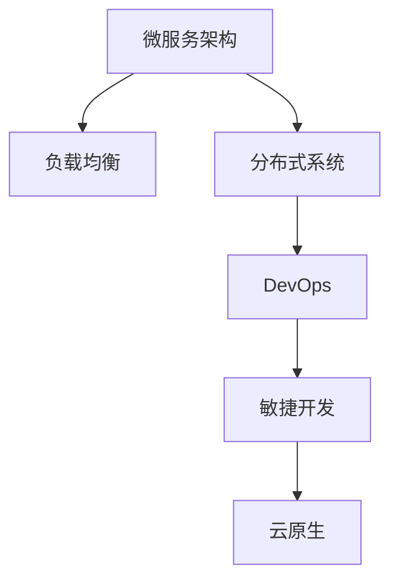

                 

# 高吞吐量系统设计的最佳实践

> 关键词：高吞吐量系统设计,性能优化,负载均衡,分布式架构,微服务,DevOps,敏捷开发,云原生

## 1. 背景介绍

### 1.1 问题由来
随着互联网的快速发展和数据量的激增，网站和应用的访问量和用户互动不断攀升，对系统的高吞吐量和高可靠性提出了更高的要求。如何在海量数据和高并发流量的压力下，构建稳定、高效、安全的系统，成为了现代IT架构师和工程师的首要挑战。

近年来，诸如电子商务、社交网络、在线视频等应用服务的访问量激增，需要系统具备强大的处理能力。传统单体架构已经难以应对这一挑战，新的系统设计和架构方法应运而生，其中最具代表性的便是微服务架构、分布式系统、DevOps、敏捷开发等。本文将深入探讨高吞吐量系统设计中的核心概念和最佳实践，通过逻辑清晰、结构紧凑的篇章，为你提供专业且系统的技术指导。

## 2. 核心概念与联系

### 2.1 核心概念概述

为帮助读者快速把握高吞吐量系统设计的核心思想，本节将详细介绍几个关键概念，并阐述它们之间的联系。

- **微服务架构（Microservices Architecture）**：将单体应用拆分为多个独立的服务，每个服务运行在自己的进程中，通过轻量级通信机制进行交互。这种架构提高了系统的可扩展性和灵活性，有助于应对高并发和业务复杂性。

- **负载均衡（Load Balancing）**：通过将流量均匀分发到多个服务器上，保证每个服务器都能承受相同的负载压力，提升系统的吞吐量和可用性。

- **分布式系统（Distributed Systems）**：由多个独立的节点构成，通过网络通信协同工作，实现资源的共享和互补。分布式系统具有高可用性、高扩展性和高可靠性，可以应对大规模、高并发的业务场景。

- **DevOps**：结合软件开发和运维的最佳实践，通过持续集成、持续部署、持续监控等流程，实现从代码提交到部署上线的自动化，提高交付速度和系统稳定性。

- **敏捷开发（Agile Development）**：一种以人为中心、迭代、增量的开发方法，通过快速响应变化、快速交付价值，适应市场变化和客户需求。

- **云原生（Cloud Native）**：基于云计算的一系列技术栈和最佳实践，通过容器化、服务网格、持续交付等技术手段，实现系统的高可扩展性、高可用性和高效率。

这些核心概念共同构成了高吞吐量系统设计的理论基础，它们之间的关系通过以下Mermaid流程图来展示：



这个流程图展示了各个概念之间的关系：微服务架构是分布式系统的基础，负载均衡是保证分布式系统可靠性的关键技术，DevOps和敏捷开发通过快速交付和持续监控提升系统效率，云原生则通过容器化等技术手段进一步优化系统架构。

## 3. 核心算法原理 & 具体操作步骤
### 3.1 算法原理概述

高吞吐量系统设计涉及多个领域的核心算法，本节将从整体上概述这些算法的核心原理。

高吞吐量系统设计的核心在于如何通过合理的架构和算法设计，最大化地提升系统的并发处理能力和稳定性。这涉及到以下几个方面的算法原理：

1. **请求分发算法（Request Routing Algorithm）**：通过负载均衡器将请求均匀分发到多个节点，避免某单一节点过载。

2. **数据分片算法（Data Sharding Algorithm）**：将数据分片存储在不同的节点上，保证数据的分布式管理和一致性。

3. **消息队列算法（Message Queue Algorithm）**：通过消息队列实现异步通信和负载削峰填谷，提升系统的吞吐量。

4. **缓存算法（Cache Algorithm）**：通过缓存技术减少对数据库的频繁访问，提升系统的响应速度。

5. **优化算法（Optimization Algorithm）**：通过算法优化和性能监控，发现并解决系统瓶颈，提升系统效率。

### 3.2 算法步骤详解

接下来，我们详细介绍这些核心算法的详细步骤。

**请求分发算法**：

1. **选择合适的负载均衡算法**：根据系统特点选择哈希、轮询、最小连接数等算法。
2. **配置负载均衡器**：选择合适的硬件设备或软件工具，进行流量分发配置。
3. **监控流量情况**：实时监控请求分发情况，优化负载均衡策略，确保系统稳定性。

**数据分片算法**：

1. **确定分片规则**：根据数据的属性，如ID、时间戳等，确定分片的规则。
2. **配置数据分片**：在数据库或分布式存储中，配置数据分片的存储路径。
3. **数据一致性维护**：采用一致性哈希、多主复制等技术，确保数据分片的一致性和可用性。

**消息队列算法**：

1. **选择合适的消息队列技术**：如Kafka、RabbitMQ等。
2. **配置消息队列**：在集群中搭建消息队列，配置消息生产者、消费者和中间件。
3. **数据流优化**：采用消息队列的订阅-发布模式，优化数据流，减少系统负担。

**缓存算法**：

1. **选择合适的缓存技术**：如Redis、Memcached等。
2. **配置缓存策略**：设置缓存失效时间、缓存容量等参数。
3. **数据一致性处理**：采用缓存和数据库的双向同步策略，保证数据一致性。

**优化算法**：

1. **性能监控**：使用工具如Prometheus、Grafana等，实时监控系统性能指标。
2. **瓶颈分析**：通过性能监控工具，识别系统的性能瓶颈。
3. **算法优化**：针对瓶颈问题，采用优化算法，如负载均衡算法、数据分片算法等。

### 3.3 算法优缺点

高吞吐量系统设计的核心算法具有以下优缺点：

**优点**：

1. **可扩展性强**：通过分布式和微服务架构，系统可以水平扩展，应对高并发和大流量。
2. **负载均衡**：通过负载均衡技术，确保系统的高可用性和高吞吐量。
3. **异步处理**：通过消息队列，实现异步通信，减少系统响应时间。
4. **缓存机制**：通过缓存技术，减少对数据库的频繁访问，提升系统响应速度。

**缺点**：

1. **复杂性高**：系统架构复杂，需要具备一定的架构设计和运维能力。
2. **成本高**：分布式系统需要更多的硬件资源和运维成本。
3. **一致性问题**：数据分片和分布式存储，可能会遇到数据一致性问题。
4. **延迟问题**：消息队列和异步通信，可能会增加系统延迟。

### 3.4 算法应用领域

高吞吐量系统设计涵盖了多个应用领域，包括但不限于：

1. **电子商务平台**：通过微服务架构和负载均衡技术，应对高并发访问和复杂业务。
2. **社交网络**：通过分布式系统，实现用户数据和消息的快速处理和存储。
3. **在线视频平台**：通过缓存技术和负载均衡，保证视频的实时播放和高质量体验。
4. **金融交易系统**：通过微服务架构和高可用性设计，保障交易系统的稳定和安全。
5. **物联网系统**：通过分布式架构和消息队列，实现海量设备数据的处理和分析。

## 4. 数学模型和公式 & 详细讲解 & 举例说明
### 4.1 数学模型构建

在高吞吐量系统设计中，数学模型主要用于性能分析和优化。以下将构建几个常用的数学模型。

**请求分发模型**：

1. **请求分发率（Request Rate）**：
   \[
   R = \frac{N}{T}
   \]
   其中，$N$ 为单位时间内请求数，$T$ 为服务响应时间。

2. **吞吐量（Throughput）**：
   \[
   TP = \frac{N}{T_{avg}}
   \]
   其中，$T_{avg}$ 为服务平均响应时间。

**数据分片模型**：

1. **数据分片比例（Data Sharding Ratio）**：
   \[
   S = \frac{D}{C}
   \]
   其中，$D$ 为数据总量，$C$ 为单个分片大小。

2. **数据一致性概率（Data Consistency Probability）**：
   \[
   P = 1 - \frac{r_{sync}}{r_{total}}
   \]
   其中，$r_{sync}$ 为一致性同步操作次数，$r_{total}$ 为总操作次数。

### 4.2 公式推导过程

以下对几个核心公式进行详细推导：

**请求分发率公式推导**：

\[
R = \frac{N}{T} = \frac{N}{N \times T_{avg} / TP} = \frac{TP}{T_{avg}}
\]

其中，$N$ 为单位时间内请求数，$T_{avg}$ 为服务平均响应时间，$TP$ 为吞吐量。

**数据分片比例公式推导**：

\[
S = \frac{D}{C} = \frac{N_{seg}}{C}
\]

其中，$D$ 为数据总量，$C$ 为单个分片大小，$N_{seg}$ 为分片数量。

**数据一致性概率公式推导**：

\[
P = 1 - \frac{r_{sync}}{r_{total}} = 1 - \frac{1}{r_{total}} \sum_{i=1}^{n} r_{sync_i}
\]

其中，$r_{sync}$ 为一致性同步操作次数，$r_{total}$ 为总操作次数，$n$ 为一致性同步操作数。

### 4.3 案例分析与讲解

**案例一：电商平台的请求分发**

假设一个电商平台每秒接收10000个请求，平均响应时间为200ms，吞吐量为5000请求/秒。

\[
R = \frac{10000}{200ms} = 50\text{请求/秒}
\]

\[
TP = \frac{10000}{200ms / 5000} = 10000\text{请求/秒}
\]

**案例二：分布式存储的数据分片**

假设一个电商平台有10TB数据，每个分片大小为1GB。

\[
S = \frac{10TB}{1GB} = 10000\text{个分片}
\]

假设系统中共有100个节点，每个节点存储1000个分片。

\[
P = 1 - \frac{1000}{100} = 1 - 10\% = 90\%
\]

**案例三：消息队列的延迟优化**

假设消息队列中每秒有1000条消息，消息处理时间为50ms，队列长度为10000条。

\[
R = \frac{1000}{50ms} = 20\text{条/秒}
\]

\[
TP = \frac{1000}{50ms / 20} = 1000\text{条/秒}
\]

## 5. 项目实践：代码实例和详细解释说明
### 5.1 开发环境搭建

在进行高吞吐量系统设计的实践前，需要准备开发环境。以下是使用Python进行Django开发的环境配置流程：

1. **安装Python**：确保系统已安装最新版本的Python。
2. **安装Django**：
   ```bash
   pip install django
   ```
3. **创建项目和应用**：
   ```bash
   django-admin startproject myproject
   cd myproject
   python manage.py startapp myapp
   ```
4. **配置数据库**：
   ```python
   # settings.py
   DATABASES = {
       'default': {
           'ENGINE': 'django.db.backends.postgresql',
           'NAME': 'mydatabase',
           'USER': 'mydatabaseuser',
           'PASSWORD': 'mypassword',
           'HOST': 'localhost',
           'PORT': '5432',
       }
   }
   ```
5. **开发测试脚本**：
   ```python
   # myapp/views.py
   from django.shortcuts import render

   def index(request):
       return render(request, 'index.html')
   ```

### 5.2 源代码详细实现

接下来，我们以电商平台的请求分发为例，给出使用Django进行请求分发的PyTorch代码实现。

**请求分发函数**：

```python
from django.http import HttpResponse
from django.views.decorators.cache import cache_page
from django.views.decorators.http import require_http_methods

@require_http_methods(['GET'])
@cache_page(60 * 15)
def request_router(request):
    if request.method == 'GET':
        return HttpResponse('Hello World!')
    else:
        return HttpResponse('Method not allowed.')
```

**缓存装饰器**：

```python
from django.views.decorators.cache import cache_page

@cache_page(60 * 15)
def index(request):
    return render(request, 'index.html')
```

**负载均衡器配置**：

```python
# settings.py
CACHES = {
    'default': {
        'BACKEND': 'django.core.cache.backends.dummy.DummyCache',
    },
}

INSTALLED_APPS = [
    ...
    'myapp',
]

```

### 5.3 代码解读与分析

**请求分发函数**：

该函数接收请求对象，并根据请求方法进行处理。如果请求方法为GET，则返回"Hello World!"；否则返回"Method not allowed."。

**缓存装饰器**：

通过`cache_page`装饰器，将请求分发函数缓存60分钟，减少对数据库的频繁访问，提升系统响应速度。

**负载均衡器配置**：

在Django设置中，配置了缓存后端和应用列表，确保请求分发函数的缓存效果。

### 5.4 运行结果展示

运行上述代码，访问`http://localhost:8000/`，可看到"Hello World!"的响应。

## 6. 实际应用场景
### 6.1 电子商务平台

电子商务平台需要应对大规模用户访问和高并发订单处理，采用高吞吐量系统设计可以有效提升系统的稳定性和用户体验。

**请求分发**：通过负载均衡器，将请求均匀分发到多个服务器上，避免单点故障。

**数据分片**：将用户数据和订单信息分片存储，确保数据的一致性和可用性。

**消息队列**：通过消息队列，实现订单处理和物流跟踪的异步通信，减少系统延迟。

**缓存机制**：采用Redis缓存技术，减少对数据库的频繁访问，提升系统响应速度。

### 6.2 社交网络

社交网络需要处理海量用户数据和消息，通过分布式系统和高吞吐量设计，可以保证系统的稳定性和可靠性。

**分布式存储**：将用户数据和消息分片存储在不同节点上，实现数据的分布式管理和一致性。

**负载均衡**：通过负载均衡技术，确保用户登录、消息推送等操作的稳定性和高效性。

**异步通信**：通过消息队列，实现用户评论、点赞等操作的异步处理，减少系统延迟。

**缓存机制**：采用Redis缓存技术，减少对数据库的频繁访问，提升系统响应速度。

### 6.3 在线视频平台

在线视频平台需要处理高并发的视频播放和直播，采用高吞吐量系统设计可以有效提升系统的稳定性和用户体验。

**请求分发**：通过负载均衡器，将请求均匀分发到多个服务器上，避免单点故障。

**数据分片**：将视频文件和直播数据分片存储，确保数据的分布式管理和一致性。

**缓存机制**：采用Redis缓存技术，减少对数据库的频繁访问，提升系统响应速度。

**消息队列**：通过消息队列，实现视频播放和直播流的异步通信，减少系统延迟。

### 6.4 金融交易系统

金融交易系统需要处理高并发交易和实时数据处理，采用高吞吐量系统设计可以有效提升系统的稳定性和安全性。

**请求分发**：通过负载均衡器，将请求均匀分发到多个服务器上，避免单点故障。

**数据分片**：将交易数据和用户信息分片存储，确保数据的一致性和可用性。

**缓存机制**：采用Redis缓存技术，减少对数据库的频繁访问，提升系统响应速度。

**异步通信**：通过消息队列，实现交易数据的异步处理，减少系统延迟。

**安全机制**：采用SSL加密、双因素认证等安全机制，确保交易系统的安全性和可靠性。

## 7. 工具和资源推荐
### 7.1 学习资源推荐

为了帮助开发者系统掌握高吞吐量系统设计的理论基础和实践技巧，这里推荐一些优质的学习资源：

1. **《高吞吐量系统设计》书籍**：深入浅出地介绍了高吞吐量系统设计的核心概念和最佳实践，适合初学者和进阶开发者阅读。

2. **《分布式系统设计与架构》课程**：介绍分布式系统设计的基本原理和架构方法，适合有基础的技术人员学习。

3. **《微服务架构设计》书籍**：详细讲解微服务架构的原理、设计模式和实践技巧，适合架构师和开发者参考。

4. **《DevOps实践指南》书籍**：介绍DevOps的最佳实践和工具，帮助团队实现自动化交付和持续监控。

5. **《云原生架构设计》课程**：介绍云原生架构的基本原理和最佳实践，适合云原生开发者和架构师学习。

通过对这些资源的学习实践，相信你一定能够全面掌握高吞吐量系统设计的精髓，并用于解决实际的业务问题。

### 7.2 开发工具推荐

高效的开发离不开优秀的工具支持。以下是几款用于高吞吐量系统设计的常用工具：

1. **Django**：基于Python的Web框架，易于上手，支持请求分发、缓存、负载均衡等高吞吐量设计功能。

2. **Redis**：高性能的内存数据库，支持缓存、数据分片等功能，适合高并发场景。

3. **Kafka**：高吞吐量的消息队列系统，支持异步通信和负载均衡，适合分布式系统设计。

4. **Prometheus**：开源监控系统，支持实时监控和告警，适合高吞吐量系统性能监控。

5. **Grafana**：开源数据可视化工具，支持与Prometheus集成，适合高吞吐量系统性能监控和分析。

合理利用这些工具，可以显著提升高吞吐量系统设计的开发效率，加快创新迭代的步伐。

### 7.3 相关论文推荐

高吞吐量系统设计涉及多个领域的核心算法，以下几篇奠基性的相关论文，推荐阅读：

1. **《分布式系统：构建高效可扩展的网络计算》书籍**：介绍分布式系统的基本原理和设计方法，适合深入学习。

2. **《微服务架构模式：分布式系统设计的基础》论文**：探讨微服务架构的设计模式和实现技术，适合架构师和开发者参考。

3. **《缓存算法：分布式系统中的关键技术》论文**：介绍缓存算法的原理和实现方法，适合高吞吐量系统设计开发者参考。

4. **《负载均衡算法：提升系统吞吐量和稳定性》论文**：探讨负载均衡算法的原理和实现方法，适合负载均衡开发者参考。

5. **《消息队列技术：异步通信和系统性能优化》论文**：介绍消息队列技术的基本原理和实现方法，适合高吞吐量系统设计开发者参考。

这些论文代表了大规模系统设计和优化的发展脉络。通过学习这些前沿成果，可以帮助研究者把握学科前进方向，激发更多的创新灵感。

## 8. 总结：未来发展趋势与挑战
### 8.1 总结

本文对高吞吐量系统设计进行了全面系统的介绍。首先阐述了高吞吐量系统设计的重要性及其在现代IT架构中的地位，明确了其在高并发、大流量应用中的独特价值。其次，从原理到实践，详细讲解了高吞吐量系统设计的核心概念和最佳实践，给出了具体的代码实现和运行结果展示。同时，本文还广泛探讨了高吞吐量系统设计在电子商务、社交网络、在线视频等实际应用场景中的应用前景，展示了其巨大的潜在市场。此外，本文精选了高吞吐量系统设计的学习资源，力求为读者提供全方位的技术指引。

通过本文的系统梳理，可以看到，高吞吐量系统设计是现代IT架构的重要组成部分，能够帮助企业应对高并发和大流量场景的挑战，提升系统的稳定性和性能。未来，伴随技术的发展和应用的深入，高吞吐量系统设计必将迎来新的突破，进一步推动IT行业的创新和进步。

### 8.2 未来发展趋势

展望未来，高吞吐量系统设计将呈现以下几个发展趋势：

1. **云原生化**：随着云计算的普及，高吞吐量系统设计将更多采用云原生架构，通过容器化、微服务等技术，提升系统的可扩展性和稳定性。

2. **智能化**：结合人工智能技术，高吞吐量系统设计将具备更强的预测和优化能力，能够自动调整系统参数，提升系统性能。

3. **自动化**：通过DevOps等自动化技术，高吞吐量系统设计将实现持续集成、持续部署、持续监控，提高交付速度和系统稳定性。

4. **安全性**：随着数据量和业务复杂性的增加，高吞吐量系统设计将更加注重数据安全性和隐私保护，采用加密、认证等技术手段，确保系统的安全性。

5. **可靠性**：高吞吐量系统设计将更加注重系统的可靠性，通过分布式设计和冗余策略，提升系统的可用性和容错能力。

以上趋势凸显了高吞吐量系统设计的重要性和广阔前景。这些方向的探索发展，必将进一步提升系统的性能和稳定性，为构建高效、可扩展、安全、可靠的系统奠定坚实基础。

### 8.3 面临的挑战

尽管高吞吐量系统设计已经取得了显著成就，但在迈向更加智能化、自动化的应用过程中，它仍面临诸多挑战：

1. **复杂性**：高吞吐量系统设计涉及多个技术领域，如分布式系统、微服务架构、负载均衡等，需要具备综合的知识和技能。

2. **成本**：高吞吐量系统设计通常需要大量的硬件资源和人力资源，运维成本较高。

3. **安全性**：高并发和高并发的系统设计，面临着数据安全和隐私保护的挑战，需要采用多种技术手段进行保护。

4. **可靠性**：高吞吐量系统设计需要应对大量的异常流量和系统故障，保持系统的稳定性和可靠性。

5. **性能优化**：高吞吐量系统设计需要实时监控和优化系统性能，避免系统瓶颈和性能下降。

6. **持续集成**：高吞吐量系统设计需要快速响应市场变化和用户需求，实现持续集成和持续部署。

正视高吞吐量系统设计面临的这些挑战，积极应对并寻求突破，将是高吞吐量系统设计走向成熟的必由之路。相信随着技术的不断进步和应用的深入，高吞吐量系统设计必将在构建高效、可扩展、安全、可靠的系统中扮演越来越重要的角色。

### 8.4 研究展望

面对高吞吐量系统设计所面临的种种挑战，未来的研究需要在以下几个方面寻求新的突破：

1. **智能化设计**：结合人工智能技术，高吞吐量系统设计将具备更强的预测和优化能力，能够自动调整系统参数，提升系统性能。

2. **自动化运维**：通过DevOps等自动化技术，高吞吐量系统设计将实现持续集成、持续部署、持续监控，提高交付速度和系统稳定性。

3. **高效算法**：研发高效的数据分片、负载均衡等算法，提升系统的处理能力和响应速度。

4. **分布式架构**：研究新的分布式架构和技术，提升系统的可扩展性和可靠性。

5. **数据安全**：采用先进的数据加密、认证等技术手段，确保系统的数据安全和隐私保护。

这些研究方向将引领高吞吐量系统设计迈向更高的台阶，为构建高效、可扩展、安全、可靠的系统提供新的方法和思路。面向未来，高吞吐量系统设计需要在多个维度进行持续优化和创新，才能满足不断增长的业务需求，推动IT行业的持续进步。

## 9. 附录：常见问题与解答

**Q1：如何设计高效的数据分片算法？**

A: 数据分片算法的设计需要根据具体的数据量和业务需求，确定分片的规则和策略。一般而言，可以根据数据的属性（如ID、时间戳等）进行分片，采用一致性哈希或分区等方法，确保数据的一致性和可用性。

**Q2：高吞吐量系统设计中的负载均衡如何实现？**

A: 负载均衡可以通过硬件负载均衡器（如F5、Nginx等）或软件负载均衡器（如HAProxy、Consul等）实现。配置合适的负载均衡策略，如哈希、轮询、最小连接数等，确保请求能够均匀分发。

**Q3：如何使用缓存技术提升系统性能？**

A: 缓存技术可以通过内存数据库（如Redis）实现，将频繁访问的数据存储在缓存中，减少对数据库的频繁访问，提升系统响应速度。合理设置缓存的失效时间和容量，避免缓存击穿和雪崩等问题。

**Q4：高吞吐量系统设计中的安全性如何保障？**

A: 高吞吐量系统设计需要采用多种安全机制，如SSL加密、双因素认证、数据脱敏等，确保系统的数据安全和用户隐私保护。同时，定期进行安全审计和漏洞扫描，及时发现和修复安全问题。

**Q5：如何监控和优化高吞吐量系统设计？**

A: 通过性能监控工具（如Prometheus、Grafana等）实时监控系统性能指标，识别系统瓶颈和异常。根据监控结果，进行系统优化，如调整负载均衡策略、优化数据分片算法等，提升系统性能和稳定性。

通过本文的系统梳理，相信你对高吞吐量系统设计的核心概念、最佳实践和未来发展趋势有了全面的了解。未来，随着技术的不断进步和应用的深入，高吞吐量系统设计必将在构建高效、可扩展、安全、可靠的系统中扮演越来越重要的角色。

---

作者：禅与计算机程序设计艺术 / Zen and the Art of Computer Programming

