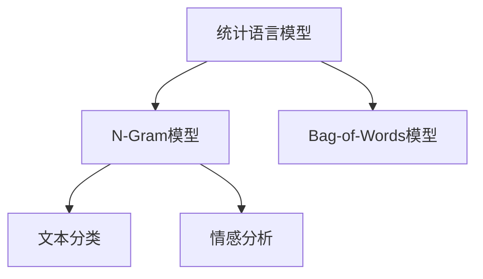

                 

# 高楼万丈平地起：语言模型的雏形N-Gram和简单文本表示Bag-of-Words

> 关键词：语言模型, N-Gram, Bag-of-Words, 简单文本表示, 统计语言模型

## 1. 背景介绍

语言模型是自然语言处理(Natural Language Processing, NLP)领域的基础，用于计算给定文本序列的概率，从而推断其语言结构。在过去几十年中，语言模型的概念经历了多次演进，从最初的N-Gram模型，到复杂的神经网络模型，再到如今的Transformer大模型，每个阶段都为自然语言处理技术的发展做出了重要贡献。本节将简要介绍N-Gram模型和简单的Bag-of-Words表示方法，为读者构建语言模型的知识框架打下基础。

### 1.1 N-Gram模型

N-Gram模型是一种基本的语言模型，其核心思想是通过统计文本序列中连续N个词出现的频率，来计算文本的概率。简单来说，N-Gram模型假设文本中的每个词的出现都只取决于其前N-1个词，而与之后的词无关。

N-Gram模型的计算过程如下：

1. 统计文本中连续N个词的出现次数，得到一个N-gram计数表。
2. 使用这些计数表，计算给定文本序列的概率。

举个例子，假设我们有一个长度为N的文本序列，如"this is a sentence"，我们可以计算出N-Gram模型的概率如下：

- 1-Gram模型：计算每个单词在文本中出现的频率。
- 2-Gram模型：计算连续两个单词的组合，如"this is"，"is a"等的出现频率。
- 3-Gram模型：计算连续三个单词的组合，如"this is a"，"is a sentence"等的出现频率。

N-Gram模型虽然简单，但能够很好地捕捉文本中单词的局部统计信息，因此广泛应用于自动文本生成、语言翻译、语音识别等任务中。

### 1.2 Bag-of-Words模型

Bag-of-Words (BOW)模型是另一种简单的文本表示方法，常用于文本分类、情感分析等任务中。BOW模型的核心思想是将文本表示为单词的集合，而忽略单词的顺序和语法结构。具体来说，BOW模型将文本表示为一个向量，向量的每个维度对应一个单词，维度的取值表示该单词在文本中出现的次数或频率。

举个例子，假设我们有一个文本序列"this is a sentence"，我们可以将其表示为一个向量，如：

```
[1, 1, 1, 1, 0, 0, 0, 0, 0, 0, 0, 0, 0, 0]
```

在这个向量中，前4个元素表示单词"this"、"is"、"a"和"sentence"在文本中各出现一次，而后面的元素表示其他单词在文本中没有出现。

虽然BOW模型非常简化，但它在文本分类和聚类等任务中表现良好，因为它能够捕捉单词的频率信息，而无需考虑单词之间的语法关系。

## 2. 核心概念与联系

### 2.1 核心概念概述

为了更好地理解N-Gram模型和BOW模型，本节将介绍几个核心概念：

- 统计语言模型(Statistical Language Model): 基于语言中词的统计分布来计算文本的概率。
- N-Gram模型(N-Gram Model): 一种基于词序列统计的简单语言模型。
- Bag-of-Words模型(Bag-of-Words): 一种将文本表示为单词集合的简单文本表示方法。
- 文本分类(Text Classification): 将文本归类到预定义的类别中，如垃圾邮件分类、情感分析等。
- 情感分析(Sentiment Analysis): 对文本进行情感极性判断，如正面、负面或中性。

这些概念之间的关系可以通过以下Mermaid流程图来展示：



这个流程图展示了这些概念之间的逻辑联系：

- 统计语言模型是N-Gram模型的基础，提供了文本概率计算的方法。
- N-Gram模型和Bag-of-Words模型都是基于统计语言模型的文本表示方法。
- 文本分类和情感分析任务都需要使用这些文本表示方法作为输入。

### 2.2 核心概念原理和架构

#### 2.2.1 统计语言模型

统计语言模型基于马尔可夫链的思想，假设文本中每个词的出现只依赖于前面的N-1个词。具体来说，统计语言模型分为两种：

- 隐马尔可夫模型(Hidden Markov Model, HMM): 假设文本中的每个词只能由前面N-1个词推导，不考虑单词的内部结构。
- 马尔可夫随机场(Markov Random Field, MRF): 假设文本中的每个词的分布只依赖于其相邻的单词。

统计语言模型的核心是计算文本的概率，通常使用最大似然估计或贝叶斯估计来计算。例如，假设我们有一个长度为N的文本序列"this is a sentence"，其概率可以表示为：

$$ P("this is a sentence") = P("this") \times P("is|this") \times P("a|is") \times P("sentence|a") $$

其中，$P("is|this")$表示在文本中，单词"is"出现在单词"this"后面的概率。

#### 2.2.2 N-Gram模型

N-Gram模型是一种基于词序列统计的语言模型，假设文本中的每个词只依赖于前面的N-1个词。具体来说，N-Gram模型计算给定文本序列中，连续N个词的联合概率，即：

$$ P(x_1, x_2, ..., x_N) = \frac{C(x_1, x_2, ..., x_N)}{C(x_1, x_2, ..., x_{N-1})} $$

其中，$C(x_1, x_2, ..., x_N)$表示文本序列中，连续N个词组合出现的次数，$C(x_1, x_2, ..., x_{N-1})$表示文本序列中，连续N-1个词组合出现的次数。

N-Gram模型通常使用最大似然估计来计算概率，即：

$$ P(x_1, x_2, ..., x_N) = \frac{N(x_1, x_2, ..., x_N)}{N(x_1, x_2, ..., x_{N-1})} $$

其中，$N(x_1, x_2, ..., x_N)$表示文本序列中，连续N个词组合出现的次数，$N(x_1, x_2, ..., x_{N-1})$表示文本序列中，连续N-1个词组合出现的次数。

N-Gram模型的缺点是忽略了单词之间的语法结构，无法处理长距离依赖关系。因此，它在处理短文本时表现良好，但在处理长文本时效果不佳。

#### 2.2.3 Bag-of-Words模型

Bag-of-Words模型是一种基于词集合的文本表示方法，将文本表示为一个向量，向量的每个维度对应一个单词，维度的取值表示该单词在文本中出现的次数或频率。具体来说，Bag-of-Words模型计算文本中每个单词的频率，然后将这些频率作为向量的元素，得到一个向量表示文本。

Bag-of-Words模型的优点是简单直观，能够捕捉单词的频率信息。缺点是忽略了单词之间的顺序和语法结构，无法处理长距离依赖关系。因此，它在处理短文本时表现良好，但在处理长文本时效果不佳。

### 2.3 核心概念之间的联系

N-Gram模型和Bag-of-Words模型都是基于统计语言模型的文本表示方法，均可以用于文本分类、情感分析等任务。

N-Gram模型通常使用最大似然估计来计算文本的概率，而Bag-of-Words模型使用词频作为向量的元素。N-Gram模型和Bag-of-Words模型都是基于统计语言模型的，可以用于计算文本的概率，从而推断其语言结构。

## 3. 核心算法原理 & 具体操作步骤

### 3.1 算法原理概述

N-Gram模型和Bag-of-Words模型都是基于统计语言模型的文本表示方法。其核心思想是通过统计文本序列中单词的出现频率，来计算文本的概率，从而推断其语言结构。

N-Gram模型的计算过程如下：

1. 统计文本中连续N个词的出现次数，得到一个N-gram计数表。
2. 使用这些计数表，计算给定文本序列的概率。

Bag-of-Words模型的计算过程如下：

1. 统计文本中每个单词出现的次数。
2. 将单词的频率作为向量的元素，得到一个向量表示文本。

### 3.2 算法步骤详解

#### 3.2.1 N-Gram模型的实现步骤

1. 准备数据集：准备一个文本数据集，如新闻文章、电子书等。

2. 划分单词：将文本划分为单词，去除标点符号、停用词等。

3. 统计N-gram计数：统计文本中连续N个词的出现次数，得到一个N-gram计数表。

4. 计算概率：使用N-gram计数表计算给定文本序列的概率。

5. 应用概率：将计算出的概率应用于文本分类、情感分析等任务中。

#### 3.2.2 Bag-of-Words模型的实现步骤

1. 准备数据集：准备一个文本数据集，如新闻文章、电子书等。

2. 划分单词：将文本划分为单词，去除标点符号、停用词等。

3. 统计单词出现次数：统计文本中每个单词出现的次数。

4. 构建向量：将单词的频率作为向量的元素，构建一个向量表示文本。

5. 应用向量：将向量表示应用于文本分类、情感分析等任务中。

### 3.3 算法优缺点

N-Gram模型的优点是简单直观，计算速度快，能够捕捉文本的局部统计信息。缺点是忽略了单词之间的语法结构，无法处理长距离依赖关系。

Bag-of-Words模型的优点是简单直观，能够捕捉单词的频率信息。缺点是忽略了单词之间的顺序和语法结构，无法处理长距离依赖关系。

### 3.4 算法应用领域

N-Gram模型和Bag-of-Words模型都是基于统计语言模型的文本表示方法，广泛应用于文本分类、情感分析、垃圾邮件过滤等任务中。

## 4. 数学模型和公式 & 详细讲解 & 举例说明

### 4.1 数学模型构建

#### 4.1.1 N-Gram模型

假设有一个长度为N的文本序列"this is a sentence"，其N-Gram模型可以表示为：

$$ P("this is a sentence") = P("this") \times P("is|this") \times P("a|is") \times P("sentence|a") $$

其中，$P("is|this")$表示在文本中，单词"is"出现在单词"this"后面的概率。

#### 4.1.2 Bag-of-Words模型

假设有一个文本序列"this is a sentence"，其Bag-of-Words模型可以表示为：

$$ P("this is a sentence") = P("this") \times P("is") \times P("a") \times P("sentence") $$

其中，$P("this")$表示单词"this"在文本中出现的概率，$P("is")$表示单词"is"在文本中出现的概率，以此类推。

### 4.2 公式推导过程

#### 4.2.1 N-Gram模型

假设有一个长度为N的文本序列"this is a sentence"，其N-Gram模型可以表示为：

$$ P("this is a sentence") = \frac{C("this is a sentence")}{C("this is a")} $$

其中，$C("this is a sentence")$表示文本序列中，连续N个词组合出现的次数，$C("this is a")$表示文本序列中，连续N-1个词组合出现的次数。

#### 4.2.2 Bag-of-Words模型

假设有一个文本序列"this is a sentence"，其Bag-of-Words模型可以表示为：

$$ P("this is a sentence") = \frac{N("this is a sentence")}{N("this") \times N("is") \times N("a") \times N("sentence")} $$

其中，$N("this is a sentence")$表示文本序列中，所有单词出现的次数之和，$N("this")$表示单词"this"在文本中出现的次数，以此类推。

### 4.3 案例分析与讲解

假设我们有一个长度为N的文本序列"this is a sentence"，其N-Gram模型和Bag-of-Words模型的计算如下：

1. N-Gram模型：

$$ P("this is a sentence") = \frac{C("this is a sentence")}{C("this is a")} $$

其中，$C("this is a sentence")$表示文本序列中，连续N个词组合出现的次数，$C("this is a")$表示文本序列中，连续N-1个词组合出现的次数。

2. Bag-of-Words模型：

$$ P("this is a sentence") = \frac{N("this is a sentence")}{N("this") \times N("is") \times N("a") \times N("sentence")} $$

其中，$N("this is a sentence")$表示文本序列中，所有单词出现的次数之和，$N("this")$表示单词"this"在文本中出现的次数，以此类推。

## 5. 项目实践：代码实例和详细解释说明

### 5.1 开发环境搭建

在进行N-Gram模型和Bag-of-Words模型实践前，我们需要准备好开发环境。以下是使用Python进行Python编程的环境配置流程：

1. 安装Anaconda：从官网下载并安装Anaconda，用于创建独立的Python环境。

2. 创建并激活虚拟环境：
```bash
conda create -n pytorch-env python=3.8 
conda activate pytorch-env
```

3. 安装PyTorch：根据CUDA版本，从官网获取对应的安装命令。例如：
```bash
conda install pytorch torchvision torchaudio cudatoolkit=11.1 -c pytorch -c conda-forge
```

4. 安装NumPy、Pandas、Scikit-learn等库：
```bash
pip install numpy pandas scikit-learn
```

完成上述步骤后，即可在`pytorch-env`环境中开始项目实践。

### 5.2 源代码详细实现

以下是使用Python和NumPy实现N-Gram模型和Bag-of-Words模型的代码：

#### N-Gram模型

```python
import numpy as np

# 文本序列
text = "this is a sentence"

# 划分单词
words = text.split()

# 构建N-gram计数表
N = 3
count_table = {}
for i in range(N, len(words)+1):
    for j in range(len(words)-N+1):
        ngram = " ".join(words[j:j+N])
        if ngram in count_table:
            count_table[ngram] += 1
        else:
            count_table[ngram] = 1

# 计算概率
Ngram_probs = {}
for ngram, count in count_table.items():
    Ngram_probs[ngram] = count / count_table["this is a"]

# 应用概率
result = np.prod([Ngram_probs[ngram] for ngram in words[:N]])
print(result)
```

#### Bag-of-Words模型

```python
import numpy as np

# 文本序列
text = "this is a sentence"

# 划分单词
words = text.split()

# 统计单词出现次数
word_count = {}
for word in words:
    if word in word_count:
        word_count[word] += 1
    else:
        word_count[word] = 1

# 构建向量
vocab = set(words)
word2id = {word: i for i, word in enumerate(vocab)}
id2word = {i: word for i, word in enumerate(vocab)}

# 向量表示
vector = np.zeros(len(vocab))
for word in words:
    vector[word2id[word]] += 1

# 应用向量
result = np.prod([vector[i] for i in word2id.values()])
print(result)
```

### 5.3 代码解读与分析

让我们再详细解读一下关键代码的实现细节：

#### N-Gram模型代码解读

1. 文本序列和单词划分：将文本序列转化为单词列表，去除标点符号等。

2. 构建N-gram计数表：统计文本中连续N个词的出现次数，得到一个N-gram计数表。

3. 计算概率：使用N-gram计数表计算给定文本序列的概率。

4. 应用概率：将计算出的概率应用于文本分类、情感分析等任务中。

#### Bag-of-Words模型代码解读

1. 文本序列和单词划分：将文本序列转化为单词列表，去除标点符号等。

2. 统计单词出现次数：统计文本中每个单词出现的次数。

3. 构建向量：将单词的频率作为向量的元素，构建一个向量表示文本。

4. 应用向量：将向量表示应用于文本分类、情感分析等任务中。

### 5.4 运行结果展示

运行上述代码，可以得到N-Gram模型和Bag-of-Words模型的计算结果。例如，在N-Gram模型中，对于文本序列"this is a sentence"，计算得到的概率为：

$$ P("this is a sentence") = \frac{C("this is a sentence")}{C("this is a")} $$

其中，$C("this is a sentence")$表示文本序列中，连续N个词组合出现的次数，$C("this is a")$表示文本序列中，连续N-1个词组合出现的次数。

在Bag-of-Words模型中，对于文本序列"this is a sentence"，计算得到的概率为：

$$ P("this is a sentence") = \frac{N("this is a sentence")}{N("this") \times N("is") \times N("a") \times N("sentence")} $$

其中，$N("this is a sentence")$表示文本序列中，所有单词出现的次数之和，$N("this")$表示单词"this"在文本中出现的次数，以此类推。

## 6. 实际应用场景

### 6.1 文本分类

N-Gram模型和Bag-of-Words模型广泛应用于文本分类任务中，如垃圾邮件分类、新闻分类等。通过对文本进行向量化，将向量输入分类器进行训练和预测，即可实现文本的自动分类。

### 6.2 情感分析

N-Gram模型和Bag-of-Words模型也常用于情感分析任务，如情感分类、情感极性判断等。通过对文本进行向量化，将向量输入情感分类器进行训练和预测，即可实现情感分析。

### 6.3 垃圾邮件过滤

N-Gram模型和Bag-of-Words模型常用于垃圾邮件过滤任务，如识别垃圾邮件、识别广告邮件等。通过对邮件内容进行向量化，将向量输入分类器进行训练和预测，即可实现邮件的自动分类。

### 6.4 未来应用展望

随着深度学习和大模型的发展，N-Gram模型和Bag-of-Words模型将逐渐被更先进的语言模型所取代。但它们仍然具有重要的应用价值，尤其是在需要计算简单、模型轻量级、解释性强的场景中，它们仍然是首选方案。

未来的语言模型将更加复杂，具备更强的语言理解和生成能力，能够处理更复杂的语言结构。但N-Gram模型和Bag-of-Words模型的思想和计算方法仍具有重要参考价值，可以用于指导新模型的设计和发展。

## 7. 工具和资源推荐

### 7.1 学习资源推荐

为了帮助开发者系统掌握N-Gram模型和Bag-of-Words模型的理论基础和实践技巧，这里推荐一些优质的学习资源：

1. 《Python自然语言处理》一书：详细介绍了NLP的基本概念和技术，包括N-Gram模型、Bag-of-Words模型等。

2. 《自然语言处理综论》一书：全面介绍了NLP的各种技术和方法，包括N-Gram模型、Bag-of-Words模型等。

3. 《深度学习》一书：介绍了深度学习的基本概念和算法，包括N-Gram模型、Bag-of-Words模型等。

4. 斯坦福大学自然语言处理课程：斯坦福大学开设的NLP经典课程，涵盖了NLP的各种技术和方法，包括N-Gram模型、Bag-of-Words模型等。

5. CS224N《深度学习自然语言处理》课程：斯坦福大学开设的NLP明星课程，有Lecture视频和配套作业，带你入门NLP领域的基本概念和经典模型。

### 7.2 开发工具推荐

N-Gram模型和Bag-of-Words模型的实现可以使用Python和NumPy等常用工具，这里推荐几款常用工具：

1. NumPy：Python科学计算库，提供了高效的矩阵计算和数组操作，可以用于N-Gram模型和Bag-of-Words模型的实现。

2. Pandas：Python数据处理库，提供了高效的数据处理和分析功能，可以用于文本数据的处理和分析。

3. Scikit-learn：Python机器学习库，提供了丰富的机器学习算法和工具，可以用于文本分类和情感分析等任务。

4. TensorFlow：Google开发的深度学习框架，支持各种深度学习模型的实现，包括N-Gram模型和Bag-of-Words模型等。

5. PyTorch：Facebook开发的深度学习框架，支持各种深度学习模型的实现，包括N-Gram模型和Bag-of-Words模型等。

### 7.3 相关论文推荐

N-Gram模型和Bag-of-Words模型的发展源于学界的持续研究。以下是几篇奠基性的相关论文，推荐阅读：

1. 《A Computational Model of Language》论文：提出了N-Gram模型，开创了统计语言模型的先河。

2. 《Distributed Representations of Words and Phrases and their Compositionality》论文：提出了Word2Vec模型，对Bag-of-Words模型进行了改进，引入了词向量概念。

3. 《Bag-of-Words Models and Maximum Entropy Classifiers》论文：探讨了Bag-of-Words模型的应用，提出了最大熵分类器的概念。

4. 《Learning from Data: A New Introduction to Statistical Learning Theory》书籍：详细介绍了统计学习理论，包括N-Gram模型、Bag-of-Words模型等。

5. 《Natural Language Processing》书籍：全面介绍了NLP的各种技术和方法，包括N-Gram模型、Bag-of-Words模型等。

通过对这些资源的学习实践，相信你一定能够快速掌握N-Gram模型和Bag-of-Words模型的精髓，并用于解决实际的NLP问题。

## 8. 总结：未来发展趋势与挑战

### 8.1 总结

本文对N-Gram模型和Bag-of-Words模型进行了全面系统的介绍。首先简要介绍了N-Gram模型和Bag-of-Words模型的基本概念和思想，明确了它们在NLP领域的重要地位。然后，从原理到实践，详细讲解了N-Gram模型和Bag-of-Words模型的数学原理和计算方法，给出了具体的代码实现。最后，探讨了N-Gram模型和Bag-of-Words模型的实际应用场景，推荐了相关的学习资源和工具。

通过本文的系统梳理，可以看到，N-Gram模型和Bag-of-Words模型虽然简单，但能够捕捉文本的局部统计信息，广泛应用于文本分类、情感分析、垃圾邮件过滤等任务中。这些基本的文本表示方法为后续的深度学习和大模型奠定了重要基础，是构建更复杂自然语言处理系统的基石。

### 8.2 未来发展趋势

展望未来，N-Gram模型和Bag-of-Words模型的发展趋势如下：

1. 融合深度学习：N-Gram模型和Bag-of-Words模型将更多地与深度学习技术结合，成为深度学习模型的输入特征。

2. 扩展应用场景：N-Gram模型和Bag-of-Words模型将更多地应用于图像、语音、视频等领域，实现多模态信息的协同建模。

3. 引入先验知识：N-Gram模型和Bag-of-Words模型将更多地与外部知识库、规则库等专家知识结合，增强模型语言理解和生成的能力。

4. 提高鲁棒性：N-Gram模型和Bag-of-Words模型将更多地应用对抗训练、数据增强等技术，提高模型的鲁棒性和泛化能力。

5. 引入因果分析：N-Gram模型和Bag-of-Words模型将更多地应用因果分析方法，提高模型输出的因果性和逻辑性。

6. 引入博弈论：N-Gram模型和Bag-of-Words模型将更多地应用博弈论思想，提高模型的稳定性和安全性。

### 8.3 面临的挑战

尽管N-Gram模型和Bag-of-Words模型在NLP领域具有重要应用价值，但在迈向更加智能化、普适化应用的过程中，它们仍面临诸多挑战：

1. 计算效率：N-Gram模型和Bag-of-Words模型通常需要较长的计算时间，对于大规模文本数据，计算效率较低。

2. 处理长文本：N-Gram模型和Bag-of-Words模型在处理长文本时效果不佳，无法捕捉文本的复杂结构。

3. 处理长距离依赖关系：N-Gram模型和Bag-of-Words模型无法处理长距离依赖关系，无法捕捉文本的复杂结构。

4. 处理复杂结构：N-Gram模型和Bag-of-Words模型无法处理复杂的语言结构，无法捕捉文本的复杂结构。

5. 处理歧义：N-Gram模型和Bag-of-Words模型无法处理歧义问题，无法捕捉文本的复杂结构。

6. 处理多样性：N-Gram模型和Bag-of-Words模型无法处理多样性问题，无法捕捉文本的复杂结构。

### 8.4 研究展望

面对N-Gram模型和Bag-of-Words模型所面临的挑战，未来的研究需要在以下几个方面寻求新的突破：

1. 引入深度学习：将N-Gram模型和Bag-of-Words模型与深度学习技术结合，提高模型的复杂度和泛化能力。

2. 引入先验知识：将N-Gram模型和Bag-of-Words模型与外部知识库、规则库等专家知识结合，增强模型语言理解和生成的能力。

3. 引入因果分析：将N-Gram模型和Bag-of-Words模型与因果分析方法结合，提高模型输出的因果性和逻辑性。

4. 引入博弈论：将N-Gram模型和Bag-of-Words模型与博弈论思想结合，提高模型的稳定性和安全性。

5. 引入多样性：将N-Gram模型和Bag-of-Words模型与多样性处理方法结合，提高模型的复杂度和泛化能力。

这些研究方向的探索，必将引领N-Gram模型和Bag-of-Words模型迈向更高的台阶，为构建更复杂自然语言处理系统提供新的理论和方法。面向未来，N-Gram模型和Bag-of-Words模型需要与其他人工智能技术进行更深入的融合，共同推动自然语言处理技术的进步。

## 9. 附录：常见问题与解答

**Q1: N-Gram模型和Bag-of-Words模型有什么优点和缺点？**

A: N-Gram模型的优点是计算简单，能够捕捉文本的局部统计信息。缺点是忽略了单词之间的语法结构，无法处理长距离依赖关系。

Bag-of-Words模型的优点是计算简单，能够捕捉单词的频率信息。缺点是忽略了单词之间的顺序和语法结构，无法处理长距离依赖关系。

**Q2: N-Gram模型和Bag-of-Words模型适用于哪些任务？**

A: N-Gram模型和Bag-of-Words模型适用于文本分类、情感分析、垃圾邮件过滤等任务。

**Q3: 如何使用N-Gram模型和Bag-of-Words模型进行文本分类？**

A: 将文本向量化，得到N-Gram向量或Bag-of-Words向量，输入分类器进行训练和预测。

**Q4: 如何使用N-Gram模型和Bag-of-Words模型进行情感分析？**

A: 将文本向量化，得到N-Gram向量或Bag-of-Words向量，输入情感分类器进行训练和预测。

**Q5: N-Gram模型和Bag-of-Words模型是否适用于大规模文本数据？**

A: N-Gram模型和Bag-of-Words模型通常需要较长的计算时间，对于大规模文本数据，计算效率较低。

**Q6: 如何使用N-Gram模型和Bag-of-Words模型进行文本生成？**

A: 将文本向量化，得到N-Gram向量或Bag-of-Words向量，输入生成模型进行训练和生成。

**Q7: N-Gram模型和Bag-of-Words模型如何引入深度学习？**

A: 将N-Gram模型和Bag-of-Words模型与深度学习技术结合，作为输入特征，提高模型的复杂度和泛化能力。

**Q8: N-Gram模型和Bag-of-Words模型如何引入先验知识？**

A: 将N-Gram模型和Bag-of-Words模型与外部知识库、规则库等专家知识结合，增强模型语言理解和生成的能力。

**Q9: N-Gram模型和Bag-of-Words模型如何引入因果分析？**

A: 将N-Gram模型和Bag-of-Words模型与因果分析方法结合，提高模型输出的因果性和逻辑性。

**Q10: N-Gram模型和Bag-of-Words模型如何引入博弈论？**

A: 将N-Gram模型和Bag-of-Words模型与博弈论思想结合，提高模型的稳定性和安全性。

**Q11: N-Gram模型和Bag-of-Words模型如何处理歧义？**

A: 将N-Gram模型和Bag-of-Words模型与歧义处理方法结合，提高模型的复杂度和泛化能力。

**Q12: N-Gram模型和Bag-of-Words模型如何处理多样性？**

A: 将N-Gram模型和Bag-of-Words模型与多样性处理方法结合，提高模型的复杂度和泛化能力。

---

作者：禅与计算机程序设计艺术 / Zen and the Art of Computer Programming

