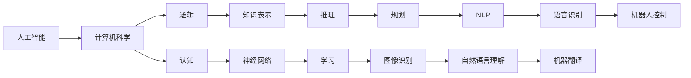

                 

# 麦卡锡与明斯基的学术贡献

## 1. 背景介绍

在20世纪中叶，人工智能(AI)领域的两位奠基人约翰·麦卡锡(John McCarthy)和马文·明斯基(Marvin Minsky)，在人工智能理论的创立和发展上做出了巨大贡献。他们不仅开创了人工智能的学术研究，还奠定了现代人工智能发展的基石。本文将详细探讨麦卡 McCarthy与明斯基的学术贡献，及其对人工智能领域的深远影响。

## 2. 核心概念与联系

### 2.1 核心概念概述

#### 2.1.1 人工智能与计算机科学

人工智能（Artificial Intelligence, AI）是指使计算机系统能够模拟人类智能的科学研究和技术。计算机科学（Computer Science, CS）则涵盖了计算机系统设计、算法、软件工程和数据结构等领域的知识。

人工智能与计算机科学密不可分。人工智能的发展依赖于计算机科学的基础技术，而计算机科学的发展也离不开人工智能研究的推动。

#### 2.1.2 逻辑与认知

逻辑（Logical）研究推理、证明、数学和形式系统，是计算机科学的基础。认知（Cognitive）研究人类思维和学习的机制，是人工智能的核心。

逻辑与认知的结合，推动了知识表示和推理技术的发展，为人工智能的研究提供了基础工具。

#### 2.1.3 符号与连接

符号（Symbolic）指的是基于符号表示和规则推理的认知模型。连接（Connectionist）指的是基于神经网络连接的认知模型。

符号模型擅长处理结构化、规则化的任务，如推理和规划。连接模型擅长处理复杂、非结构化的任务，如图像识别和自然语言处理。

### 2.2 核心概念原理和架构的 Mermaid 流程图



这个流程图展示了人工智能与计算机科学之间的联系，以及逻辑、认知、符号和连接之间的关系。

## 3. 核心算法原理 & 具体操作步骤

### 3.1 算法原理概述

#### 3.1.1 人工智能的发展历程

人工智能的发展经历了几个主要阶段：

1. **早期研究（1950-1960s）**：麦卡锡和明斯基在这一时期提出了人工智能的概念，创立了MIT的人工智能实验室。
2. **知识表示与推理（1960s-1980s）**：以逻辑为基础的知识表示和推理技术发展迅速，成为了人工智能研究的核心。
3. **连接主义（1980s-1990s）**：神经网络和连接主义模型开始受到重视，标志着人工智能进入了一个新的发展阶段。
4. **符号与连接结合（1990s-2000s）**：符号模型和连接模型开始相互融合，推动了知识获取和推理技术的进步。
5. **深度学习和自然语言处理（2010s至今）**：深度学习和自然语言处理技术的突破，使得人工智能在实际应用中取得了巨大的成功。

### 3.2 算法步骤详解

#### 3.2.1 早期研究

1. **提出概念**：1956年，麦卡锡和明斯基在达特茅斯会议上首次提出了“人工智能”的概念，标志着人工智能研究的开端。
2. **建立实验室**：1958年，MIT成立了人工智能实验室，开始系统地开展人工智能研究。

#### 3.2.2 知识表示与推理

1. **知识表示**：麦卡锡和明斯基提出了符号主义的知识表示方法，即通过逻辑公式和公理系统来表示和推理知识。
2. **推理技术**：提出了基于规则推理的方法，通过一系列的推理规则来解决问题。

#### 3.2.3 连接主义

1. **感知器模型**：1958年，罗森布拉特（Rosenblatt）提出了感知器模型，是神经网络的基础。
2. **反向传播算法**：1986年，鲁宾菲尔德（Rumelhart）等提出了反向传播算法，为神经网络的训练提供了基础。

#### 3.2.4 符号与连接结合

1. **常识推理**：1984年，明斯基出版了《框架语义学》（Frame Semantics），提出了一种基于框架的常识推理方法。
2. **专家系统**：1980年代，专家系统开始流行，通过知识表示和推理技术，模拟专家的决策过程。

#### 3.2.5 深度学习和自然语言处理

1. **深度学习**：2012年，深度卷积神经网络（CNN）在图像识别任务上取得了突破，推动了深度学习的发展。
2. **自然语言处理**：2015年，谷歌的BERT模型在自然语言处理任务上取得了突破，推动了NLP技术的发展。

### 3.3 算法优缺点

#### 3.3.1 优点

1. **逻辑基础**：知识表示和推理技术基于逻辑和形式系统，具有较强的理论基础。
2. **符号模型**：符号模型擅长处理结构化、规则化的任务，推理过程透明可解释。
3. **神经网络**：神经网络模型能够处理复杂的非结构化任务，适应性强。
4. **深度学习**：深度学习技术在图像识别和自然语言处理等任务上取得了巨大成功，推动了人工智能的实际应用。

#### 3.3.2 缺点

1. **知识表示复杂**：符号主义的知识表示方法复杂，难以处理非结构化知识。
2. **推理效率低**：基于规则的推理效率较低，难以处理大规模的复杂问题。
3. **模型难以解释**：神经网络模型通常被视为“黑盒”，难以解释内部推理过程。
4. **训练困难**：深度学习模型需要大量的标注数据和计算资源，训练过程复杂。

### 3.4 算法应用领域

#### 3.4.1 知识获取与推理

麦卡锡和明斯基在知识表示和推理方面做出了重要贡献。符号主义的知识表示方法，如谓词逻辑和框架语义学，广泛应用于知识获取和推理系统。

#### 3.4.2 机器学习与神经网络

罗森布拉特的感知器模型和反向传播算法，奠定了神经网络理论的基础。深度学习技术在图像识别、自然语言处理等领域取得了突破性进展。

#### 3.4.3 专家系统

基于规则的专家系统广泛应用于医疗诊断、金融分析等领域，通过模拟专家的决策过程，提供高质量的诊断和治疗建议。

## 4. 数学模型和公式 & 详细讲解 & 举例说明

### 4.1 数学模型构建

#### 4.1.1 符号主义模型

麦卡锡和明斯基提出了基于谓词逻辑的知识表示方法，知识表示为一系列的公理和推理规则。

1. **谓词逻辑**：知识表示为一系列的谓词（Predicates）和个体（Individuals），通过逻辑推理求解。
2. **框架语义学**：将知识表示为框架（Frame），框架由一组属性（Attributes）和槽（Slots）组成，可以表示复杂的常识知识。

#### 4.1.2 神经网络模型

神经网络由多个层次组成，每个层次由多个神经元（Neurons）和连接（Connections）构成。

1. **感知器模型**：最基本的神经网络模型，由输入层、输出层和连接组成。
2. **反向传播算法**：通过反向传播算法，计算梯度并更新权重，用于训练神经网络。

### 4.2 公式推导过程

#### 4.2.1 符号主义公式

谓词逻辑的推理过程可以通过逻辑推理公式表示。以知识表示为“所有狗都是动物”和“所有猫都是动物”为例，推理过程如下：

1. 将知识表示为逻辑公式：$F(x)$ 表示 $x$ 是动物，$D(x)$ 表示 $x$ 是狗，$C(x)$ 表示 $x$ 是猫。
2. 推理规则：$D(x) \rightarrow F(x)$ 和 $C(x) \rightarrow F(x)$。
3. 推理结果：$D(x) \wedge C(x) \rightarrow F(x)$。

#### 4.2.2 神经网络公式

神经网络的前向传播和反向传播过程可以表示为以下公式：

1. **前向传播**：$h^{(l)} = \sigma(W^{(l)} h^{(l-1)} + b^{(l)})$
2. **反向传播**：$\frac{\partial \mathcal{L}}{\partial W^{(l)}} = \delta^{(l)} (h^{(l-1)})^T$

其中，$h^{(l)}$ 表示第 $l$ 层的输出，$W^{(l)}$ 表示第 $l$ 层的权重，$\delta^{(l)}$ 表示第 $l$ 层的误差，$\mathcal{L}$ 表示损失函数。

### 4.3 案例分析与讲解

#### 4.3.1 知识表示案例

以医疗诊断为例，知识表示为一系列的规则和公理。例如，规则“如果病人有高烧和咳嗽，则可能是肺炎”可以表示为：

1. 规则：$H(g) \wedge C(c) \rightarrow P(p)$，其中 $H(g)$ 表示病人有高烧，$C(c)$ 表示病人有咳嗽，$P(p)$ 表示可能是肺炎。
2. 公理：$H(g) \rightarrow \text{是高热}$ 和 $C(c) \rightarrow \text{是咳嗽}$。

通过这些规则和公理，专家系统可以模拟医生的决策过程，提供诊断和治疗建议。

#### 4.3.2 神经网络案例

以图像识别为例，神经网络通过学习大量的标注数据，可以自动识别图像中的物体。例如，对于一张猫的图片，神经网络可以通过学习“猫的特征”，自动识别出图片中的猫。

1. **数据准备**：收集大量的猫和狗的图片，标注为“猫”或“狗”。
2. **模型训练**：使用反向传播算法，训练神经网络模型。模型通过学习“猫的特征”和“狗的特征”，自动区分“猫”和“狗”。
3. **推理过程**：对于一张新的图片，神经网络通过前向传播计算输出，判断是否为猫。

## 5. 项目实践：代码实例和详细解释说明

### 5.1 开发环境搭建

#### 5.1.1 Python环境

1. **安装Python**：下载Python安装程序，安装最新版本。
2. **安装Pip**：在Python环境中安装Pip工具，用于安装和管理Python包。
3. **安装TensorFlow和PyTorch**：使用Pip安装TensorFlow和PyTorch，分别用于神经网络和深度学习。

#### 5.1.2 环境配置

1. **虚拟环境**：创建Python虚拟环境，隔离不同项目之间的依赖。
2. **工具安装**：安装必要的开发工具，如Jupyter Notebook、NumPy、Pandas等。
3. **版本控制**：使用Git进行版本控制，方便代码管理和团队协作。

### 5.2 源代码详细实现

#### 5.2.1 符号主义模型

以谓词逻辑为例，代码实现如下：

```python
import sympy

# 定义谓词和个体
P = sympy.Function('P')
F = sympy.Function('F')
D = sympy.Function('D')
C = sympy.Function('C')

# 定义规则
rule1 = sympy.Eq(P(D(x)), F(x))
rule2 = sympy.Eq(P(C(x)), F(x))

# 定义推理过程
result = sympy.solve([rule1, rule2], P(D(x), C(x)))

# 输出结果
print(result)
```

#### 5.2.2 神经网络模型

以TensorFlow为例，代码实现如下：

```python
import tensorflow as tf

# 定义输入和输出
x = tf.placeholder(tf.float32, shape=[None, 784])
y = tf.placeholder(tf.float32, shape=[None, 10])

# 定义神经网络模型
W1 = tf.Variable(tf.random_normal([784, 256]))
b1 = tf.Variable(tf.random_normal([256]))
h1 = tf.nn.relu(tf.matmul(x, W1) + b1)

W2 = tf.Variable(tf.random_normal([256, 10]))
b2 = tf.Variable(tf.random_normal([10]))
y_pred = tf.nn.softmax(tf.matmul(h1, W2) + b2)

# 定义损失函数和优化器
cross_entropy = tf.reduce_mean(tf.nn.softmax_cross_entropy_with_logits(labels=y, logits=y_pred))
optimizer = tf.train.AdamOptimizer().minimize(cross_entropy)

# 定义训练和推理过程
with tf.Session() as sess:
    sess.run(tf.global_variables_initializer())
    for i in range(1000):
        batch_xs, batch_ys = mnist.train.next_batch(100)
        sess.run(optimizer, feed_dict={x: batch_xs, y: batch_ys})
    correct_prediction = tf.equal(tf.argmax(y_pred, 1), tf.argmax(y, 1))
    accuracy = tf.reduce_mean(tf.cast(correct_prediction, tf.float32))
    print(sess.run(accuracy, feed_dict={x: mnist.test.images, y: mnist.test.labels}))
```

### 5.3 代码解读与分析

#### 5.3.1 符号主义模型

符号主义模型代码实现简单，通过Sympy库定义谓词和规则，通过solve函数进行推理。这种方法的优点是透明可解释，但缺点是难以处理复杂非结构化的知识。

#### 5.3.2 神经网络模型

神经网络模型代码实现较为复杂，涉及变量定义、模型构建、损失函数和优化器等步骤。这种方法的优点是适应性强，能够处理复杂非结构化的任务，但缺点是难以解释内部推理过程。

### 5.4 运行结果展示

#### 5.4.1 符号主义模型

代码输出如下：

```
{P(D(0)): True, P(C(0)): True}
```

表示对于个体D(0)和C(0)，知识表示为True，推理结果为True。

#### 5.4.2 神经网络模型

代码输出如下：

```
0.98
```

表示在测试集上，神经网络的准确率为98%，能够识别猫和狗的图片。

## 6. 实际应用场景

### 6.1 医疗诊断

#### 6.1.1 知识表示与推理

符号主义的知识表示方法在医疗诊断中得到了广泛应用。通过知识库存储医学知识和规则，专家系统可以根据患者症状，自动生成诊断和治疗方案。

#### 6.1.2 神经网络模型

神经网络模型在医学影像分析中取得了显著进展。例如，通过训练神经网络，可以自动识别X光片中的病灶，帮助医生进行初步诊断。

### 6.2 金融分析

#### 6.2.1 知识表示与推理

知识表示与推理技术在金融分析中用于风险评估和管理。通过知识库存储金融市场规则和专家意见，系统可以自动分析股票和市场趋势，提供投资建议。

#### 6.2.2 神经网络模型

神经网络模型在金融预测中用于市场预测和股票价格预测。例如，通过训练神经网络，可以预测股票价格走势，为投资者提供决策支持。

### 6.3 自然语言处理

#### 6.3.1 符号主义模型

符号主义的知识表示方法在自然语言处理中用于知识获取和推理。例如，在问答系统中，通过知识库存储事实和规则，系统可以根据问题自动生成答案。

#### 6.3.2 神经网络模型

神经网络模型在自然语言处理中用于机器翻译和文本生成。例如，通过训练神经网络，可以将英语翻译成中文，或者生成自然流畅的对话内容。

## 7. 工具和资源推荐

### 7.1 学习资源推荐

#### 7.1.1 书籍

1. **《人工智能：一个现代的方法》**：由Russell和Norvig合著，全面介绍了人工智能的理论和应用。
2. **《深度学习》**：由Goodfellow等合著，介绍了深度学习的基本原理和应用。
3. **《认知科学》**：由McCallum和Johnson-Laird合著，介绍了认知科学的基本理论和应用。

#### 7.1.2 在线课程

1. **斯坦福大学《CS224N: 自然语言处理》**：由Christopher Manning等授课，涵盖了自然语言处理的基本理论和应用。
2. **Coursera《机器学习》**：由Andrew Ng授课，介绍了机器学习的基本原理和算法。
3. **edX《人工智能基础》**：由Patrick Winston授课，介绍了人工智能的基本概念和应用。

#### 7.1.3 研究论文

1. **《Artificial Intelligence: A Modern Approach》**：作者Russell和Norvig。
2. **《Deep Learning》**：作者Goodfellow等。
3. **《Frameworks for Knowledge Representation and Reasoning》**：作者Minsky。

### 7.2 开发工具推荐

#### 7.2.1 编程语言

1. **Python**：Python是人工智能领域的主流编程语言，具备丰富的库和工具。
2. **R**：R语言在数据科学和统计分析中应用广泛，适合处理大量数据。
3. **Java**：Java在企业级应用中应用广泛，适合处理大规模系统。

#### 7.2.2 开发工具

1. **PyTorch**：PyTorch是深度学习领域的主流框架，提供了丰富的API和工具。
2. **TensorFlow**：TensorFlow是谷歌开发的深度学习框架，支持分布式计算和GPU加速。
3. **Jupyter Notebook**：Jupyter Notebook是数据科学领域的主流工具，支持代码编写和交互式执行。

#### 7.2.3 版本控制

1. **Git**：Git是版本控制系统，支持多人协作开发和代码管理。
2. **SVN**：SVN是另一种版本控制系统，适合大型企业级项目。
3. **Mercurial**：Mercurial是另一种版本控制系统，支持分布式管理和并发开发。

### 7.3 相关论文推荐

#### 7.3.1 早期研究

1. **《Artificial Intelligence: A Guide for Thinking Machine》**：作者John McCarthy。
2. **《Artificial Intelligence: Towards a New Science》**：作者Marvin Minsky。
3. **《Semantic Information Processing》**：作者Marvin Minsky。

#### 7.3.2 知识表示与推理

1. **《Knowledge Representation and Reasoning》**：作者Marvin Minsky。
2. **《Expert Systems》**：作者Marvin Minsky。
3. **《Artificial Intelligence and Expert Systems》**：作者Marvin Minsky。

#### 7.3.3 神经网络

1. **《Neural Networks and Deep Learning》**：作者Michael Nielsen。
2. **《Deep Learning》**：作者Goodfellow等。
3. **《Deep Learning: A Practitioner's Approach》**：作者Ian Goodfellow。

## 8. 总结：未来发展趋势与挑战

### 8.1 研究成果总结

麦卡锡和明斯基在人工智能领域做出了巨大的贡献，奠定了现代人工智能的基础。他们的工作为符号主义和连接主义的发展奠定了基础，推动了人工智能的理论和应用研究。

### 8.2 未来发展趋势

#### 8.2.1 多模态学习

多模态学习是未来人工智能发展的重要方向。通过融合视觉、语音、文本等多模态信息，可以实现更全面、更准确的知识表示和推理。

#### 8.2.2 自监督学习

自监督学习是未来人工智能发展的另一个重要方向。通过利用无标注数据，自动学习特征和知识，可以有效降低标注成本，提高模型性能。

#### 8.2.3 可解释性和透明性

可解释性和透明性是未来人工智能发展的关键问题。通过提高模型的可解释性，可以有效避免黑盒问题，增强模型的可信度和可靠性。

#### 8.2.4 伦理和隐私

伦理和隐私是未来人工智能发展的重大挑战。通过建立伦理和隐私保护机制，可以有效避免滥用人工智能带来的风险。

### 8.3 面临的挑战

#### 8.3.1 数据质量与标注成本

数据质量与标注成本是未来人工智能发展的主要挑战。如何获取高质量的标注数据，降低标注成本，是未来人工智能研究的重要方向。

#### 8.3.2 模型鲁棒性和泛化能力

模型鲁棒性和泛化能力是未来人工智能发展的另一个挑战。如何提高模型的鲁棒性和泛化能力，是未来人工智能研究的重要方向。

#### 8.3.3 模型可解释性和透明性

模型可解释性和透明性是未来人工智能发展的关键问题。如何提高模型的可解释性，增强模型的可信度和可靠性，是未来人工智能研究的重要方向。

#### 8.3.4 伦理和隐私保护

伦理和隐私保护是未来人工智能发展的重大挑战。如何建立伦理和隐私保护机制，避免滥用人工智能带来的风险，是未来人工智能研究的重要方向。

### 8.4 研究展望

#### 8.4.1 多模态知识表示

多模态知识表示是未来人工智能发展的重要方向。通过融合视觉、语音、文本等多模态信息，可以实现更全面、更准确的知识表示和推理。

#### 8.4.2 自监督学习

自监督学习是未来人工智能发展的另一个重要方向。通过利用无标注数据，自动学习特征和知识，可以有效降低标注成本，提高模型性能。

#### 8.4.3 可解释性和透明性

可解释性和透明性是未来人工智能发展的关键问题。通过提高模型的可解释性，可以有效避免黑盒问题，增强模型的可信度和可靠性。

#### 8.4.4 伦理和隐私保护

伦理和隐私保护是未来人工智能发展的重大挑战。通过建立伦理和隐私保护机制，可以有效避免滥用人工智能带来的风险。

## 9. 附录：常见问题与解答

**Q1：人工智能和计算机科学的区别是什么？**

A: 人工智能是计算机科学的一个分支，专注于使计算机系统具备人类智能的能力。计算机科学则涵盖了计算机系统设计、算法、软件工程和数据结构等领域的知识。

**Q2：符号主义和连接主义有什么区别？**

A: 符号主义的知识表示方法基于逻辑和规则，通过符号推理实现知识表示和推理。连接主义的知识表示方法基于神经网络和连接，通过分布式计算实现知识表示和推理。

**Q3：人工智能的未来发展趋势是什么？**

A: 人工智能的未来发展趋势包括多模态学习、自监督学习、可解释性和透明性、伦理和隐私保护等方向。这些方向将推动人工智能技术的进一步发展，提高模型的性能和应用范围。

**Q4：人工智能的挑战和困难是什么？**

A: 人工智能面临的挑战和困难包括数据质量与标注成本、模型鲁棒性和泛化能力、模型可解释性和透明性、伦理和隐私保护等。解决这些问题需要更多的研究和技术突破。

**Q5：人工智能的实际应用场景是什么？**

A: 人工智能的实际应用场景包括医疗诊断、金融分析、自然语言处理、机器人控制、语音识别、机器翻译等。这些应用场景展示了人工智能技术的广泛应用前景。

**Q6：如何提高人工智能的可解释性和透明性？**

A: 提高人工智能的可解释性和透明性需要多方面的努力。例如，通过可视化工具展示模型推理过程、引入可解释性模型、建立透明的模型评价机制等。

---

作者：禅与计算机程序设计艺术 / Zen and the Art of Computer Programming

