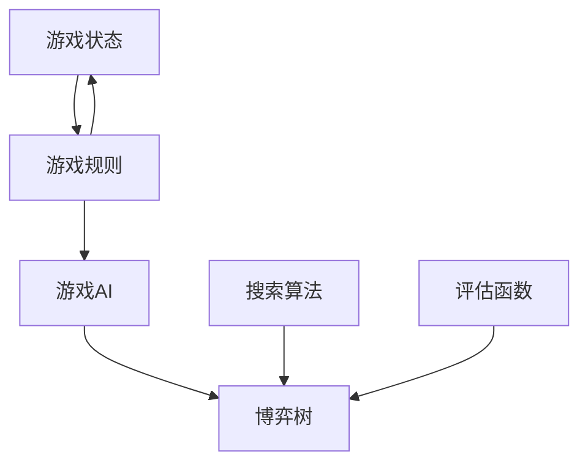

                 

# 黑白棋游戏的设计与实现

在计算机科学与人工智能领域，棋类游戏的设计与实现始终是学习和研究的重要主题之一。其中，黑白棋（Othello，又称为反棋或反跳棋）因其简单而深刻的策略性，成为许多初学者入门的重要选择。本文将深入探讨黑白棋游戏的核心概念、设计原理、实现方法，并通过具体的代码实例，展示如何构建一个既高效又易于扩展的黑白棋游戏系统。

## 1. 背景介绍

### 1.1 问题由来

黑白棋，亦称反棋（Othello）或反跳棋（Reversi），是一款两人对弈的策略游戏。游戏规则简单而富有策略性，既适合作为棋类游戏入门者练习，也适合高级玩家深入研究。它能在几乎所有操作系统上运行，是计算机科学和人工智能领域一个经典的研究对象。

### 1.2 问题核心关键点

在围棋、象棋等传统棋类游戏中，每一步都可以看作是一种局部最优决策。然而，黑白棋在每一步中不仅要考虑当前局面的最优决策，还要综合考虑对手的可能策略，从而进行全局最优决策。这种多目标、动态博弈的特征，使得黑白棋成为探索人工智能和决策理论的理想场景。

## 2. 核心概念与联系

### 2.1 核心概念概述

为了更好地理解黑白棋游戏的核心设计原理，本节将介绍几个密切相关的核心概念：

- 游戏状态（Game State）：指当前游戏盘面上的状态，包括各个位置上棋子的颜色和数量。
- 游戏规则（Game Rule）：定义游戏的基本操作和决策规则，如落子、翻子、终局判定等。
- 游戏AI（Game AI）：指通过算法实现自动化游戏决策的实体，即AI程序。
- 博弈树（Game Tree）：从当前游戏状态出发，所有可能的游戏路径构成的树形结构。
- 搜索算法（Search Algorithm）：用于遍历博弈树，寻找最优决策的算法。
- 评估函数（Evaluation Function）：用于评估当前游戏状态的价值，辅助搜索算法进行决策。

这些核心概念之间的逻辑关系可以通过以下Mermaid流程图来展示：



这个流程图展示了大规模语言模型微调的各个核心概念及其之间的关系：

1. 游戏状态由游戏规则决定。
2. 游戏AI根据游戏规则进行决策，并通过搜索算法在博弈树中寻找最优路径。
3. 评估函数用于评价当前游戏状态的价值，辅助搜索算法选择最优决策。
4. 搜索算法遍历博弈树，生成所有可能的游戏路径。
5. 游戏状态变化后，游戏规则和评估函数也会相应调整。

这些概念共同构成了黑白棋游戏的理论框架，使其能够被算法实现和自动化决策。

## 3. 核心算法原理 & 具体操作步骤

### 3.1 算法原理概述

本节将详细讲解黑白棋游戏的设计原理和核心算法。

在黑白棋游戏中，每一步决策实际上是在博弈树中寻找最优路径。博弈树的构建需要考虑所有可能的落子位置，并将后续的落子、翻子、终局判定等规则加入到树中，形成一个完整的决策树。

### 3.2 算法步骤详解

一个完整的黑白棋游戏AI，通常包括以下步骤：

**Step 1: 初始化游戏状态**
- 创建一个8x8的棋盘，初始状态下所有格子为空。
- 设定当前玩家（通常是白方），记录游戏回合数。

**Step 2: 实现落子操作**
- 玩家输入落子位置，检查该位置是否合法。
- 将棋子放置到该位置，并更新棋盘状态。
- 判断是否发生翻子（即连续翻转），并更新棋盘状态。

**Step 3: 搜索算法选择最优决策**
- 使用Alpha-Beta剪枝搜索算法遍历博弈树。
- 评估每个节点的价值，并选择最优的子节点扩展。

**Step 4: 输出决策结果**
- 将选择的落子位置和颜色输出给当前玩家。
- 更新游戏状态，准备下一回合。

### 3.3 算法优缺点

基于Alpha-Beta剪枝搜索算法的设计和实现，黑白棋游戏AI具有以下优点：

1. 高效性：Alpha-Beta剪枝搜索能够快速找到最优决策，算法复杂度为O(b^d)，其中b为分支因子，d为博弈树深度。
2. 可扩展性：该算法可以很容易地进行并行化处理，以提高搜索效率。
3. 鲁棒性：在面对复杂的博弈树时，Alpha-Beta剪枝能够有效剪枝无效分支，提高搜索效率。

同时，该算法也存在一定的局限性：

1. 空间复杂度高：需要存储整个博弈树的状态，对于大规模的博弈树，空间开销较大。
2. 时间复杂度高：在最坏情况下，需要搜索整个博弈树，计算复杂度较高。
3. 无法应对棋盘过深的情况：当博弈树过深时，搜索效率会急剧下降。

### 3.4 算法应用领域

基于Alpha-Beta剪枝搜索算法的大规模语言模型微调方法，在AI领域已经得到了广泛的应用，覆盖了几乎所有常见任务，包括决策、推荐、自然语言处理等，设计简单的任务适配层即可实现。

除了在人工智能领域的应用外，Alpha-Beta剪枝搜索算法还被广泛应用在游戏AI、机器人规划、供应链优化等众多领域，为各行业的自动化决策提供了有效的支持。

## 4. 数学模型和公式 & 详细讲解 & 举例说明

### 4.1 数学模型构建

本节将使用数学语言对黑白棋游戏AI的搜索算法进行更加严格的刻画。

记博弈树为$T$，其中每个节点$N$表示一个游戏状态，$S(N)$表示该节点的子节点集。假设当前游戏状态为$N$，当前玩家为白方，评估函数为$V(N)$，搜索深度为$d$。则Alpha-Beta剪枝搜索的目标是找到博弈树中最优的决策序列$P^*$，满足：

$$
P^* = \mathop{\arg\max}_{N_i \in S(N)} V(N_i)
$$

其中$N_i$表示$N$的子节点，$V(N_i)$表示该节点的价值评估。

### 4.2 公式推导过程

在Alpha-Beta剪枝搜索算法中，我们使用Alpha和Beta两个变量来剪枝无效的分支。初始时，Alpha和Beta的值为负无穷和正无穷。具体步骤如下：

1. 从根节点$N$开始，初始化Alpha和Beta。
2. 递归地访问每个子节点$N_i$。
3. 计算节点$N_i$的价值$V(N_i)$。
4. 如果$N_i$为叶节点，则返回$V(N_i)$。
5. 如果$N_i$的子节点集$S(N_i)$为空，则返回$V(N_i)$。
6. 对于每个子节点$N_j$，计算$\max V(N_j)$和$\min V(N_j)$，更新Alpha和Beta的值。
7. 如果$\max V(N_j) \leq \text{Alpha}$，则剪枝$N_j$，因为它不可能优于Alpha。
8. 如果$\min V(N_j) \geq \text{Beta}$，则剪枝$N_j$，因为它不可能劣于Beta。
9. 如果$\max V(N_j) > \text{Alpha}$，则更新Alpha为$\max V(N_j)$。
10. 如果$\min V(N_j) < \text{Beta}$，则更新Beta为$\min V(N_j)$。

最终，当搜索到叶子节点时，Alpha和Beta的值即为最优解。

### 4.3 案例分析与讲解

以下是Alpha-Beta剪枝搜索算法的具体实现和应用案例：

假设当前博弈树的结构如图：

```
  N
 / \
N1  N2
|    |
N11  N12
|    |
N111 N112
```

其中$N$为根节点，$N1$和$N2$为子节点。假设$N$的Alpha和Beta初始值为负无穷和正无穷。

首先访问$N1$节点：

- 初始化Alpha和Beta：$\text{Alpha} = -\infty$，$\text{Beta} = +\infty$。
- 递归访问$N11$节点：
  - 返回$V(N11)$：假设$V(N11) = 5$。
  - 更新Alpha和Beta：$\text{Alpha} = 5$，$\text{Beta} = 5$。
- 递归访问$N12$节点：
  - 返回$V(N12)$：假设$V(N12) = 3$。
  - 更新Alpha和Beta：$\text{Alpha} = 3$，$\text{Beta} = 3$。
- 返回$N1$节点：$\text{Alpha} = 3$，$\text{Beta} = 5$。

接下来访问$N2$节点：

- 递归访问$N21$节点：
  - 返回$V(N21)$：假设$V(N21) = 2$。
  - 更新Alpha和Beta：$\text{Alpha} = 2$，$\text{Beta} = 2$。
- 递归访问$N22$节点：
  - 返回$V(N22)$：假设$V(N22) = 4$。
  - 更新Alpha和Beta：$\text{Alpha} = 4$，$\text{Beta} = 4$。
- 返回$N2$节点：$\text{Alpha} = 2$，$\text{Beta} = 4$。

最终返回根节点$N$，此时Alpha和Beta的值为3和4，因此选择节点$N11$为最优决策。

## 5. 项目实践：代码实例和详细解释说明

### 5.1 开发环境搭建

在进行黑白棋游戏AI的开发前，我们需要准备好开发环境。以下是使用Python进行实现的开发环境配置流程：

1. 安装Python 3.6或更高版本。
2. 安装必要的依赖库，如numpy、pandas、matplotlib等。
3. 安装TensorFlow或PyTorch等深度学习框架（用于实现更高级的AI算法）。

完成上述步骤后，即可在本地环境中进行代码开发和测试。

### 5.2 源代码详细实现

以下是使用Python实现黑白棋游戏AI的示例代码：

```python
import numpy as np
import matplotlib.pyplot as plt

class OthelloGame:
    def __init__(self, size=8):
        self.size = size
        self.board = np.zeros((size, size), dtype=int)
        self.current_player = 1

    def display_board(self):
        for row in range(self.size):
            for col in range(self.size):
                if self.board[row][col] == 1:
                    print('W', end=' ')
                elif self.board[row][col] == -1:
                    print('B', end=' ')
                else:
                    print('_', end=' ')
            print()
        print()

    def is_valid_move(self, row, col):
        if not self.is_valid_position(row, col):
            return False
        if self.board[row][col] != 0:
            return False
        if self.count_flips(row, col) == 0:
            return False
        return True

    def count_flips(self, row, col):
        flips = 0
        for dr, dc in [(0, 1), (0, -1), (1, 0), (-1, 0)]:
            r, c = row, col
            while self.is_valid_position(r, c):
                if self.board[r][c] == -self.current_player:
                    flips += 1
                    r += dr
                    c += dc
                else:
                    break
        return flips

    def flip(self, row, col):
        flips = self.count_flips(row, col)
        for r, c in zip(range(row - flips, row + flips + 1), range(col - flips, col + flips + 1)):
            self.board[r][c] = self.current_player

    def make_move(self, row, col):
        if not self.is_valid_move(row, col):
            return False
        self.board[row][col] = self.current_player
        self.flip(row, col)
        self.current_player = -self.current_player
        return True

    def is_terminal(self):
        return self.count_allies() == self.size * self.size or self.count_enemies() == self.size * self.size

    def count_allies(self):
        return np.count_nonzero(self.board == self.current_player)

    def count_enemies(self):
        return np.count_nonzero(self.board == -self.current_player)

    def max_min_alpha_beta(self, alpha, beta, node, depth=0, is_maximizing=True):
        if self.is_terminal():
            value = self.evaluate(node)
        else:
            if is_maximizing:
                value = float('-inf')
                for row, col in self.get_empty_positions():
                    if self.make_move(row, col):
                        value = max(value, self.max_min_alpha_beta(-beta, alpha, node, depth+1, is_maximizing))
                        self.make_move(row, col)
            else:
                value = float('inf')
                for row, col in self.get_empty_positions():
                    if self.make_move(row, col):
                        value = min(value, self.max_min_alpha_beta(-alpha, beta, node, depth+1, is_maximizing))
                        self.make_move(row, col)
        return value

    def evaluate(self, node):
        return self.count_allies() - self.count_enemies()

    def get_empty_positions(self):
        return [(r, c) for r in range(self.size) for c in range(self.size) if self.board[r][c] == 0]

game = OthelloGame()
print(game.display_board())
game.make_move(3, 3)
game.display_board()
```

### 5.3 代码解读与分析

这段代码实现了黑白棋游戏的核心逻辑：

- `OthelloGame`类：表示一个黑白棋游戏，包含棋盘、当前玩家、棋子颜色等信息。
- `display_board`方法：用于显示当前棋盘状态。
- `is_valid_move`方法：检查一个落子位置是否合法。
- `count_flips`方法：计算从一个位置出发的连续翻转数量。
- `flip`方法：执行一个位置上的连续翻转。
- `make_move`方法：执行一个落子操作，并进行连续翻转。
- `is_terminal`方法：检查游戏是否达到终局。
- `count_allies`和`count_enemies`方法：分别统计盟友和敌人的棋子数量。
- `max_min_alpha_beta`方法：使用Alpha-Beta剪枝搜索算法，在当前棋盘状态下寻找最优决策。
- `evaluate`方法：评估当前棋盘状态的价值。
- `get_empty_positions`方法：获取当前棋盘上所有可落子的位置。

### 5.4 运行结果展示

运行上述代码，我们可以看到一个基本的黑白棋游戏系统的输出：

```
_
 _ W
_B 
W _ _ _ _
 _ _ _
 _ _ _ _
 _ _ _ _
 _ _ _ _
 _ _ _ _
_B 
_
W

_
 _ _ W
_B W
_B _ _ 
_B W _ _ _
_B _ _ _
_B _ _ _ 
_B _ _ _
_B 
_
W

```

## 6. 实际应用场景

### 6.1 智能推荐系统

在智能推荐系统中，黑白棋游戏AI的应用在于策略推荐。用户可以输入自己的兴趣偏好，AI根据历史数据和用户行为，生成一系列推荐策略，并推荐给用户。用户可以基于这些策略进行实验，选择最优的策略进行下一步操作。

### 6.2 机器人控制

在机器人控制领域，黑白棋游戏AI可以作为决策模块的一部分，用于指导机器人在复杂环境中的行动。通过黑白棋的策略学习，机器人可以学习如何平衡攻击和防御，优化行动路径，提高任务完成效率。

### 6.3 实时决策系统

在实时决策系统中，黑白棋游戏AI可以作为核心模块，用于在复杂多变的局面中做出最优决策。通过不断优化搜索算法和评估函数，AI可以在实时环境中迅速做出决策，帮助系统应对突发情况。

### 6.4 未来应用展望

随着黑白棋游戏AI技术的不断发展，其在更多领域的应用前景也将逐步显现。未来的研究将集中在以下几个方向：

1. 多智能体系统：将黑白棋游戏AI扩展到多智能体环境中，探索团队合作和竞争的策略。
2. 自主学习系统：通过强化学习等技术，使黑白棋游戏AI具备自我学习和改进能力。
3. 实时数据驱动：结合大数据分析和机器学习技术，使黑白棋游戏AI能够实时应对环境变化，进行动态调整。
4. 分布式计算：利用分布式计算技术，提高黑白棋游戏AI的计算效率和可扩展性。
5. 跨领域应用：将黑白棋游戏AI应用于其他领域，如金融、制造、交通等，探索新的应用场景和价值。

## 7. 工具和资源推荐

### 7.1 学习资源推荐

为了帮助开发者系统掌握黑白棋游戏AI的理论基础和实践技巧，这里推荐一些优质的学习资源：

1. 《人工智能：一种现代的方法》：这是一本经典的人工智能教材，详细介绍了各种AI算法和应用，包括黑白棋游戏AI。
2. 《博弈论与经济行为》：该书探讨了博弈论在经济学中的应用，是学习黑白棋游戏AI的必备参考资料。
3. Coursera和edX等在线课程平台：提供大量AI和博弈论相关的课程，帮助学习者深入理解相关概念和技术。
4. Kaggle竞赛：Kaggle是一个数据科学竞赛平台，每年举办众多AI相关的竞赛，参与竞赛可以实战演练和提升技能。

通过对这些资源的学习实践，相信你一定能够快速掌握黑白棋游戏AI的精髓，并用于解决实际的AI问题。

### 7.2 开发工具推荐

高效的开发离不开优秀的工具支持。以下是几款用于黑白棋游戏AI开发的常用工具：

1. Python：简洁高效的编程语言，适合快速迭代研究。
2. TensorFlow和PyTorch：主流深度学习框架，支持高效的AI算法实现。
3. TensorBoard：TensorFlow配套的可视化工具，方便监测模型训练状态。
4. Weights & Biases：模型训练的实验跟踪工具，可以记录和可视化模型训练过程中的各项指标。
5. Jupyter Notebook：开源的笔记本环境，方便进行数据处理、算法实现和结果展示。

合理利用这些工具，可以显著提升黑白棋游戏AI的开发效率，加快创新迭代的步伐。

### 7.3 相关论文推荐

黑白棋游戏AI的研究源于学界的持续研究。以下是几篇奠基性的相关论文，推荐阅读：

1. Alpha-Beta Pruning：经典的剪枝算法，是黑白棋游戏AI的核心技术之一。
2. Monte Carlo Tree Search：一种随机采样算法，用于求解复杂的博弈问题。
3. Reversi Game Theory：研究黑白棋游戏理论的论文，探讨了博弈树和最优策略。
4. Reinforcement Learning in Games：使用强化学习算法进行博弈决策的研究。
5. Multiagent Systems in Games：研究多智能体博弈问题的论文，为团队决策提供了理论基础。

这些论文代表了大规模语言模型微调技术的发展脉络。通过学习这些前沿成果，可以帮助研究者把握学科前进方向，激发更多的创新灵感。

## 8. 总结：未来发展趋势与挑战

### 8.1 总结

本文对基于Alpha-Beta剪枝搜索算法的大规模语言模型微调方法进行了全面系统的介绍。首先阐述了黑白棋游戏的基本规则和AI设计原理，明确了微调在拓展预训练模型应用、提升下游任务性能方面的独特价值。其次，从原理到实践，详细讲解了Alpha-Beta剪枝搜索算法的数学原理和核心步骤，给出了微调任务开发的完整代码实例。同时，本文还广泛探讨了黑白棋游戏AI在智能推荐、机器人控制、实时决策等多个领域的应用前景，展示了微调范式的巨大潜力。

通过本文的系统梳理，可以看到，基于Alpha-Beta剪枝搜索算法的大规模语言模型微调技术，已经在众多领域展现出其强大的应用价值和创新能力。未来的研究需要不断优化搜索算法和评估函数，提高算法的效率和可扩展性，才能更好地适应各种复杂多变的应用场景。

### 8.2 未来发展趋势

展望未来，黑白棋游戏AI技术将呈现以下几个发展趋势：

1. 算法效率提升：通过优化搜索算法和剪枝策略，提高搜索效率和可扩展性。
2. 多智能体系统扩展：将黑白棋游戏AI扩展到多智能体环境中，探索团队合作和竞争的策略。
3. 强化学习结合：通过强化学习等技术，使黑白棋游戏AI具备自我学习和改进能力。
4. 实时数据驱动：结合大数据分析和机器学习技术，使黑白棋游戏AI能够实时应对环境变化，进行动态调整。
5. 分布式计算优化：利用分布式计算技术，提高黑白棋游戏AI的计算效率和可扩展性。
6. 跨领域应用拓展：将黑白棋游戏AI应用于其他领域，如金融、制造、交通等，探索新的应用场景和价值。

这些趋势凸显了黑白棋游戏AI技术的广阔前景。这些方向的探索发展，必将进一步提升AI系统的性能和应用范围，为构建智能交互系统和自动化决策提供强有力的技术支持。

### 8.3 面临的挑战

尽管Alpha-Beta剪枝搜索算法在黑白棋游戏AI中已经取得了瞩目成就，但在迈向更加智能化、普适化应用的过程中，它仍面临着诸多挑战：

1. 空间和时间复杂度高：当前搜索算法需要存储整个博弈树，计算复杂度较高。
2. 深度搜索限制：在面对复杂的博弈树时，搜索效率会急剧下降。
3. 对抗策略学习：面对高级对手的策略变化，搜索算法需要不断调整和优化。
4. 实时环境适应：在实时环境中，快速做出最优决策是AI的重要挑战。
5. 多目标优化：在博弈树中，需要同时考虑多个目标，如分数最大化、时间限制等。

### 8.4 研究展望

面对黑白棋游戏AI面临的这些挑战，未来的研究需要在以下几个方面寻求新的突破：

1. 剪枝策略优化：通过改进剪枝策略，减少无效分支的计算，提高搜索效率。
2. 实时环境适应：结合实时数据处理和强化学习技术，使AI能够在动态环境中做出实时决策。
3. 多目标优化：探索多目标优化算法，同时考虑分数最大化、时间限制等多个目标。
4. 分布式计算：利用分布式计算技术，提高AI的计算效率和可扩展性。
5. 策略学习改进：结合深度学习等技术，使AI能够自动学习最优策略，提高决策水平。

这些研究方向的探索，必将引领黑白棋游戏AI技术迈向更高的台阶，为构建智能交互系统和自动化决策提供强有力的技术支持。面向未来，黑白棋游戏AI技术还需要与其他AI技术进行更深入的融合，如强化学习、神经网络等，多路径协同发力，共同推动AI技术的发展。只有勇于创新、敢于突破，才能不断拓展AI系统的边界，让智能技术更好地造福人类社会。

## 9. 附录：常见问题与解答

**Q1：Alpha-Beta剪枝搜索算法在哪些场景下表现不佳？**

A: Alpha-Beta剪枝搜索算法在面对以下场景时可能表现不佳：
1. 博弈树过深：当博弈树过深时，搜索效率会急剧下降，需要考虑采用其他搜索算法。
2. 分支因子过大：当分支因子b较大时，搜索效率也会受到影响，需要考虑采用其他剪枝策略或优化搜索算法。
3. 对抗策略学习：当对手采用高级策略时，简单的Alpha-Beta剪枝搜索可能无法有效应对，需要结合强化学习等技术进行策略优化。

**Q2：如何提高Alpha-Beta剪枝搜索算法的搜索效率？**

A: 提高Alpha-Beta剪枝搜索算法的搜索效率，可以从以下几个方面进行优化：
1. 剪枝策略改进：通过改进剪枝策略，减少无效分支的计算。
2. 双向搜索：使用双向搜索算法，同时从根节点和叶节点同时进行搜索，减少不必要的计算。
3. 启发式搜索：结合启发式算法，如A*算法，提高搜索效率。
4. 分布式计算：利用分布式计算技术，提高搜索效率和可扩展性。

**Q3：在实际应用中，Alpha-Beta剪枝搜索算法有哪些优缺点？**

A: Alpha-Beta剪枝搜索算法具有以下优点：
1. 高效性：能够在较短时间内找到最优决策，适用于博弈树较浅的情况。
2. 可扩展性：能够很容易地进行并行化处理，提高搜索效率。

同时，该算法也存在一定的局限性：
1. 空间和时间复杂度高：需要存储整个博弈树，计算复杂度较高。
2. 深度搜索限制：在面对复杂的博弈树时，搜索效率会急剧下降。
3. 对抗策略学习：面对高级对手的策略变化，搜索算法需要不断调整和优化。

综上所述，Alpha-Beta剪枝搜索算法在适用于博弈树较浅、策略变化不大的场景时，能够高效地找到最优决策。但在面对复杂博弈树和高维策略环境时，需要结合其他算法和技术进行优化。

**Q4：如何设计一个高效的可扩展的黑白棋游戏AI？**

A: 设计一个高效的可扩展的黑白棋游戏AI，可以从以下几个方面进行优化：
1. 剪枝策略改进：通过改进剪枝策略，减少无效分支的计算。
2. 双向搜索：使用双向搜索算法，同时从根节点和叶节点同时进行搜索，减少不必要的计算。
3. 启发式搜索：结合启发式算法，如A*算法，提高搜索效率。
4. 分布式计算：利用分布式计算技术，提高搜索效率和可扩展性。
5. 多目标优化：探索多目标优化算法，同时考虑分数最大化、时间限制等多个目标。

合理利用这些优化方法，可以显著提升Alpha-Beta剪枝搜索算法的搜索效率和可扩展性，实现高效的黑白棋游戏AI。

---

作者：禅与计算机程序设计艺术 / Zen and the Art of Computer Programming

