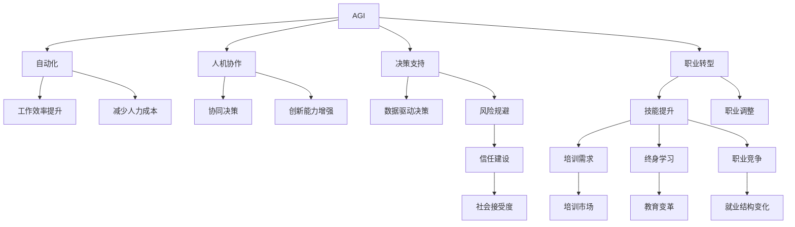

                 

# AGI对未来工作方式的潜在影响

> 关键词：通用人工智能(AGI), 工作方式, 自动化, 人机协作, 决策支持, 职业转型

## 1. 背景介绍

### 1.1 问题由来
随着人工智能(AI)技术的迅猛发展，特别是通用人工智能(AGI)的逐渐成熟，其对未来工作方式的影响正变得越来越显著。AGI指的是一种能够执行各种智力任务的机器系统，包括学习、推理、解决问题、理解自然语言、视觉感知、运动操作等。与专用AI系统（如自动驾驶、语音识别等）相比，AGI具备更为广泛的应用领域，能够跨领域融合，实现更高程度的智能化。

AGI的应用前景包括但不限于医疗、金融、制造、教育、娱乐等多个领域。这些领域的工作方式将因AGI的引入而发生深刻变革，带来新的机会与挑战。本文将深入探讨AGI对未来工作方式的潜在影响，包括其如何改变劳动市场结构、工作流程、职业技能要求以及组织管理方式。

### 1.2 问题核心关键点
AGI对工作方式的影响主要体现在以下几个方面：

- **工作流程自动化**：AGI能高效处理重复性、规则性强的工作，自动化完成日常任务，提高工作效率。
- **人机协作增强**：AGI能够协助人类进行复杂决策、数据分析和创造性工作，形成强大的人机协同效应。
- **职业角色重塑**：AGI的出现将重新定义工作岗位，某些角色将被取代，而新的职业机会也将随之产生。
- **决策支持优化**：AGI提供强大的数据分析和预测能力，帮助企业优化决策过程，提高决策质量。
- **伦理与社会挑战**：AGI的广泛应用引发了一系列伦理和社会问题，如就业替代、隐私保护、决策透明度等。

## 2. 核心概念与联系

### 2.1 核心概念概述

为更好地理解AGI对工作方式的影响，本节将介绍几个关键概念及其相互关系：

- **通用人工智能(AGI)**：指能够执行各种智力任务的机器系统，具备与人类相当的智能水平。
- **自动化**：指使用机器或计算机代替人工完成特定任务的过程，提高生产效率。
- **人机协作**：指人类与机器系统共同完成复杂任务，发挥各自优势。
- **决策支持**：指机器系统辅助人类进行决策的过程，提供数据驱动的决策依据。
- **职业转型**：指因技术变革导致的职业角色和技能需求的变化，需要劳动者进行技能提升和职业调整。
- **伦理与社会问题**：AGI的应用涉及隐私、安全性、偏见和歧视等伦理和社会问题，需要全社会共同关注和解决。

这些概念之间的关系可以通过以下Mermaid流程图来展示：



该流程图展示了AGI对工作方式影响的关键环节：

1. AGI通过自动化提升工作效率，减少人力成本。
2. AGI与人机协作提升决策和创新能力，支持协同决策。
3. AGI提供数据驱动的决策支持，降低决策风险。
4. AGI导致职业转型，促进技能提升和职业调整。
5. AGI引发一系列伦理和社会问题，需要信任建设和社会接受度提升。

## 3. 核心算法原理 & 具体操作步骤
### 3.1 算法原理概述

AGI通过复杂的算法和架构，实现对海量数据的学习和处理。其核心原理包括以下几个方面：

- **深度学习和神经网络**：AGI利用深度学习技术，通过多层神经网络进行数据建模和预测。
- **知识图谱和符号推理**：AGI整合知识图谱和符号推理能力，具备强有力的知识表示和逻辑推理功能。
- **迁移学习和多模态学习**：AGI通过迁移学习和多模态学习，能够跨领域和模态进行知识的迁移和融合。
- **模型解释和可解释性**：AGI提供模型解释和可解释性，帮助人类理解其决策过程和输出结果。

### 3.2 算法步骤详解

AGI的工作流程通常包括以下关键步骤：

1. **数据采集和预处理**：收集与任务相关的数据，进行清洗和预处理，确保数据质量。
2. **模型训练和调优**：使用深度学习模型进行训练，通过数据集进行多轮迭代，优化模型参数。
3. **知识融合和推理**：将知识图谱、符号逻辑等知识与神经网络模型融合，实现知识驱动的推理和决策。
4. **输出解释和反馈**：对AGI的输出结果进行解释，提供可视化报告和决策建议，同时根据反馈调整模型。

### 3.3 算法优缺点

AGI的优点包括：

- **高效处理大数据**：能够处理海量数据，提供快速、准确的分析结果。
- **支持多领域融合**：具备跨领域知识整合和推理能力，适应复杂场景。
- **增强人机协作**：与人协作，提升决策质量和工作效率。
- **提供决策支持**：基于数据和知识进行决策，降低人为错误和偏见。

AGI的缺点包括：

- **高计算资源需求**：需要大量计算资源进行训练和推理，对硬件设备要求较高。
- **数据依赖性强**：需要大量高质量的数据进行训练，数据质量影响模型效果。
- **模型解释性不足**：黑盒模型难以解释其决策过程，缺乏透明度。
- **伦理和法律问题**：涉及隐私保护、偏见和歧视等伦理问题，需要严格监管。

### 3.4 算法应用领域

AGI在多个领域已展现出显著的应用前景，包括但不限于：

- **医疗**：通过图像识别、疾病诊断等，提升医疗服务效率和准确性。
- **金融**：进行风险评估、投资决策和市场预测，优化金融产品设计。
- **制造业**：通过智能生产、供应链优化和质量控制，提高生产效率和产品精度。
- **教育**：个性化学习推荐、作业批改和智能辅导，提升教育质量和个性化水平。
- **安全**：进行威胁检测、网络安全监控和风险预警，提升信息安全保障。

这些应用领域展示了AGI的广泛潜力和多样化应用场景。

## 4. 数学模型和公式 & 详细讲解 & 举例说明

### 4.1 数学模型构建

为了更好地理解AGI的工作原理，本节将使用数学语言对AGI的核心算法进行详细解释。

设输入数据为 $x$，AGI模型为 $f(x; \theta)$，其中 $\theta$ 为模型参数。假设AGI的任务为分类问题，输出结果为 $y \in \{0,1\}$，则分类任务的目标函数为交叉熵损失函数：

$$
L(y, f(x; \theta)) = -y\log f(x; \theta) - (1-y)\log(1-f(x; \theta))
$$

在训练过程中，目标是最小化损失函数 $L$，即：

$$
\min_{\theta} \sum_{i=1}^N L(y_i, f(x_i; \theta))
$$

其中 $N$ 为训练样本数，$y_i$ 为样本的真实标签。

### 4.2 公式推导过程

假设AGI使用一个简单的神经网络模型，包含 $n$ 个隐藏层，每层包含 $m$ 个神经元，输入层为 $x$，输出层为 $y$，神经元激活函数为 $g$，则模型的前向传播过程为：

$$
h_0 = x
$$

$$
h_l = g(W_lh_{l-1} + b_l), l=1,...,n
$$

$$
y = g(W_nh_{n-1} + b_n)
$$

其中 $W_l$ 和 $b_l$ 分别为第 $l$ 层的权重和偏置。

目标函数 $L$ 对模型参数 $\theta$ 的梯度为：

$$
\nabla_{\theta} L = -y \nabla_{\theta} f(x; \theta) - (1-y) \nabla_{\theta} [1-f(x; \theta)]
$$

使用随机梯度下降（SGD）优化算法，更新模型参数：

$$
\theta \leftarrow \theta - \eta \nabla_{\theta} L
$$

其中 $\eta$ 为学习率。

### 4.3 案例分析与讲解

以图像分类任务为例，说明AGI的工作流程：

1. **数据准备**：收集图像数据集，进行标注和预处理。
2. **模型训练**：使用卷积神经网络（CNN）模型，在标注数据上训练模型，最小化交叉熵损失。
3. **知识融合**：将知识图谱中的类别信息和关系整合到神经网络中，提升分类准确性。
4. **模型测试**：在测试集上评估模型性能，使用混淆矩阵、准确率等指标评估分类效果。
5. **模型优化**：根据测试结果调整模型超参数，如学习率、隐藏层数等。

## 5. 项目实践：代码实例和详细解释说明

### 5.1 开发环境搭建

在进行AGI开发前，需要先搭建好开发环境。以下是使用Python和TensorFlow进行AGI开发的环境配置流程：

1. 安装Anaconda：从官网下载并安装Anaconda，用于创建独立的Python环境。
2. 创建并激活虚拟环境：
```bash
conda create -n agi-env python=3.8 
conda activate agi-env
```
3. 安装TensorFlow：根据CUDA版本，从官网获取对应的安装命令。例如：
```bash
conda install tensorflow -c pytorch -c conda-forge
```
4. 安装各类工具包：
```bash
pip install numpy pandas scikit-learn matplotlib tqdm jupyter notebook ipython
```

完成上述步骤后，即可在`agi-env`环境中开始AGI开发。

### 5.2 源代码详细实现

下面我们以图像分类任务为例，给出使用TensorFlow进行AGI开发的PyTorch代码实现。

首先，定义图像分类任务的数据处理函数：

```python
import tensorflow as tf
from tensorflow import keras
import numpy as np

class ImageClassificationDataset(tf.data.Dataset):
    def __init__(self, images, labels, batch_size=32):
        self.images = images
        self.labels = labels
        self.batch_size = batch_size
        
    def __len__(self):
        return len(self.images) // self.batch_size
    
    def __getitem__(self, index):
        start = index * self.batch_size
        end = (index + 1) * self.batch_size
        batch_images = self.images[start:end]
        batch_labels = self.labels[start:end]
        return batch_images, batch_labels

# 加载数据集
(x_train, y_train), (x_test, y_test) = keras.datasets.mnist.load_data()

x_train = x_train / 255.0
x_test = x_test / 255.0

train_dataset = ImageClassificationDataset(x_train, y_train)
test_dataset = ImageClassificationDataset(x_test, y_test)
```

然后，定义AGI模型和优化器：

```python
import tensorflow.keras as keras

model = keras.Sequential([
    keras.layers.Flatten(input_shape=(28, 28)),
    keras.layers.Dense(128, activation='relu'),
    keras.layers.Dense(10)
])

optimizer = keras.optimizers.Adam(learning_rate=0.001)
```

接着，定义训练和评估函数：

```python
from tensorflow.keras import metrics

def train_epoch(model, dataset, batch_size, optimizer):
    dataloader = tf.data.Dataset.from_tensor_slices(dataset)
    dataloader = dataloader.batch(batch_size).prefetch(buffer_size=tf.data.experimental.AUTOTUNE)
    
    model.compile(optimizer=optimizer, loss=tf.keras.losses.SparseCategoricalCrossentropy(from_logits=True),
                  metrics=[metrics.SparseCategoricalAccuracy()])
    
    model.fit(dataloader, epochs=10, validation_data=test_dataset)
    
def evaluate(model, dataset, batch_size):
    dataloader = tf.data.Dataset.from_tensor_slices(dataset)
    dataloader = dataloader.batch(batch_size).prefetch(buffer_size=tf.data.experimental.AUTOTUNE)
    
    model.evaluate(dataloader)
```

最后，启动训练流程并在测试集上评估：

```python
train_epoch(model, train_dataset, batch_size=32, optimizer=optimizer)
evaluate(model, test_dataset, batch_size=32)
```

以上就是使用TensorFlow对图像分类任务进行AGI开发的完整代码实现。可以看到，TensorFlow提供了丰富的模型构建和优化器选择，使得AGI开发变得相对简单和直观。

### 5.3 代码解读与分析

让我们再详细解读一下关键代码的实现细节：

**ImageClassificationDataset类**：
- `__init__`方法：初始化图像和标签数据，定义批次大小。
- `__len__`方法：返回数据集的批次数量。
- `__getitem__`方法：获取单个批次的数据。

**模型定义**：
- 定义了一个简单的神经网络，包含一个扁平化层、一个全连接层和一个输出层。
- 使用Adam优化器进行参数更新。

**训练和评估函数**：
- 使用`tf.data.Dataset`对数据进行批次化处理，方便模型训练和推理。
- 在训练函数中使用`model.compile`进行模型编译，设置损失函数和评价指标。
- 在评估函数中使用`model.evaluate`对模型在测试集上的性能进行评估。

**训练流程**：
- 定义训练轮数和批次大小，启动训练过程。
- 在每个epoch结束后，评估模型在测试集上的性能。

可以看到，TensorFlow的API使得AGI开发非常直观和高效，开发者可以专注于模型设计和优化，而不必过多关注底层实现细节。

## 6. 实际应用场景
### 6.1 医疗影像分析

AGI在医疗影像分析中有着广泛的应用前景。传统上，医生需要手动分析大量医学影像，耗时耗力且容易出现误诊。AGI可以自动进行图像分割、病灶识别和疾病诊断，提升诊断准确性和效率。

具体应用包括：
- **图像分割**：使用AGI进行肿瘤、器官等影像区域的自动分割。
- **病灶识别**：识别和标记影像中的病灶位置和大小，辅助医生进行诊断。
- **疾病诊断**：利用AGI进行多模态数据融合，辅助医生进行早期疾病诊断。

AGI的引入将大大减轻医生的工作负担，提高诊断速度和准确性，同时降低误诊风险。

### 6.2 金融市场预测

AGI在金融市场预测中也有着重要应用。传统的金融分析依赖人工经验和数据分析，容易出现偏见和遗漏。AGI可以基于海量数据进行市场分析，提供精准的市场预测和投资建议。

具体应用包括：
- **市场趋势预测**：通过分析历史数据和实时新闻，预测股票、期货等金融产品的走势。
- **风险评估**：评估金融产品的风险等级，提供投资组合优化建议。
- **欺诈检测**：通过分析交易数据，检测潜在的欺诈行为。

AGI的应用将使金融机构能够更准确地把握市场动态，优化投资策略，降低风险。

### 6.3 智能交通管理

AGI在智能交通管理中也有着巨大潜力。传统的交通管理依赖人工调度，容易出现延误和拥堵。AGI可以实时分析交通数据，优化交通信号和路线规划，提高交通效率。

具体应用包括：
- **交通流量预测**：预测交通流量，优化交通信号灯的时序。
- **路线规划**：根据实时交通情况，推荐最优路线。
- **事故预警**：分析历史事故数据，预警潜在的安全隐患。

AGI的应用将使交通管理更加智能和高效，提高城市的通行能力和安全性。

## 7. 工具和资源推荐
### 7.1 学习资源推荐

为了帮助开发者系统掌握AGI的理论基础和实践技巧，这里推荐一些优质的学习资源：

1. **《深度学习》课程**：斯坦福大学开设的深度学习课程，全面讲解深度学习的基本概念和应用。
2. **TensorFlow官方文档**：TensorFlow的官方文档，提供了丰富的教程和API文档，是学习和使用TensorFlow的必备资料。
3. **Keras官方文档**：Keras的官方文档，提供了丰富的模型构建和优化器选择，适合快速上手实验。
4. **AGI领域的学术论文**：通过阅读最新的学术论文，了解AGI领域的最新进展和技术突破。
5. **在线学习平台**：如Coursera、edX等在线学习平台，提供丰富的AGI相关课程和资源。

通过对这些资源的学习实践，相信你一定能够快速掌握AGI的精髓，并用于解决实际的AGI问题。

### 7.2 开发工具推荐

高效的开发离不开优秀的工具支持。以下是几款用于AGI开发的常用工具：

1. **Python**：AGI开发的主流编程语言，灵活性强，生态丰富。
2. **TensorFlow**：Google主导的深度学习框架，适合大规模工程应用。
3. **Keras**：Keras提供高层次API，适合快速实验和原型开发。
4. **PyTorch**：Facebook主导的深度学习框架，灵活性好，社区活跃。
5. **Jupyter Notebook**：交互式开发环境，适合数据探索和模型调试。

合理利用这些工具，可以显著提升AGI开发和实验的效率，加快创新迭代的步伐。

### 7.3 相关论文推荐

AGI技术的发展源于学界的持续研究。以下是几篇奠基性的相关论文，推荐阅读：

1. **《深度学习》**：Ian Goodfellow、Yoshua Bengio和Aaron Courville合著，全面讲解深度学习的基本概念和技术。
2. **《GPT-3：语言模型预训练的革命》**：OpenAI发布的GPT-3模型论文，展示了大型语言模型的强大潜力。
3. **《迁移学习：跨领域知识共享》**：Tom Mitchell等人编写的迁移学习书籍，详细讲解了迁移学习的基本理论和应用。
4. **《多模态学习：跨模态知识融合》**：Jitendra Malik等人编写的多模态学习书籍，讲解了多模态学习的理论和应用。
5. **《AGI的未来：人工智能的全面觉醒》**：研究机构和专家撰写的关于AGI未来发展的探讨文章，提供前沿思考。

这些论文代表了大语言模型微调技术的发展脉络。通过学习这些前沿成果，可以帮助研究者把握学科前进方向，激发更多的创新灵感。

## 8. 总结：未来发展趋势与挑战
### 8.1 总结

本文对AGI对未来工作方式的潜在影响进行了全面系统的介绍。首先阐述了AGI的概念及其对工作方式的影响，明确了AGI在自动化、人机协作、决策支持、职业转型、伦理问题等方面的独特价值。其次，从原理到实践，详细讲解了AGI的工作原理和关键步骤，给出了AGI任务开发的完整代码实例。同时，本文还广泛探讨了AGI在医疗、金融、交通等多个领域的应用前景，展示了AGI的广泛潜力和多样化应用场景。此外，本文精选了AGI技术的各类学习资源，力求为读者提供全方位的技术指引。

通过本文的系统梳理，可以看到，AGI技术正在成为各行各业的重要范式，极大地拓展了人工智能的应用边界，催生了更多的落地场景。得益于海量数据的预训练和先进算法，AGI具备处理复杂任务的能力，有望在提升工作效率、优化决策质量、增强创新能力等方面发挥巨大作用。未来，伴随AGI技术的不断演进，其在多个领域的应用将更加深入和广泛，引领智能技术向更高层次迈进。

### 8.2 未来发展趋势

展望未来，AGI技术将呈现以下几个发展趋势：

1. **更广泛的应用场景**：AGI将拓展到更多领域，包括教育、娱乐、安全等，提供更加全面、个性化的服务。
2. **更强的自适应能力**：AGI将具备更强的自适应和学习能力，能够实时吸收新知识和适应新环境。
3. **更高程度的自动化**：AGI将能够自主进行任务规划和执行，进一步解放人类的劳动。
4. **更强的协作能力**：AGI将具备更强的人机协作能力，与人类共同完成复杂任务。
5. **更强的解释性**：AGI将提供更强的可解释性，使人类能够理解其决策过程和输出结果。

这些趋势凸显了AGI技术的广泛前景和巨大潜力，预示着未来工作方式将发生深刻变革。

### 8.3 面临的挑战

尽管AGI技术已经取得了瞩目成就，但在迈向更加智能化、普适化应用的过程中，它仍面临着诸多挑战：

1. **数据质量和数量**：高质量、大规模数据是AGI训练的基础，如何获取和处理这些数据是关键。
2. **计算资源需求**：AGI的训练和推理需要大量计算资源，如何优化硬件资源利用率是重要问题。
3. **模型解释性不足**：AGI的复杂性使其难以解释决策过程，缺乏透明度。
4. **伦理和社会问题**：AGI的应用引发了一系列伦理和社会问题，如就业替代、隐私保护、决策透明度等，需要严格监管。
5. **技术壁垒**：AGI技术的高门槛使得一般企业难以采用，如何降低门槛并实现大规模应用是重要课题。

这些挑战需要技术界和产业界的共同努力，才能实现AGI技术的广泛应用和普及。

### 8.4 研究展望

面对AGI面临的挑战，未来的研究需要在以下几个方面寻求新的突破：

1. **更高效的训练和推理方法**：开发更高效的模型和算法，降低对计算资源的需求。
2. **更强的解释性和可解释性**：增强模型的可解释性，使其决策过程更加透明和可理解。
3. **更广泛的数据源和多模态融合**：拓展数据源，整合多模态信息，提升AGI的综合能力。
4. **更强的跨领域迁移能力**：提高AGI的跨领域迁移能力，使其在更多领域中发挥作用。
5. **更强的伦理和法律保障**：建立AGI的伦理和法律框架，确保其应用的安全性和公正性。

这些研究方向的探索，必将引领AGI技术的不断进步，推动智能技术向更广阔的领域加速渗透。

## 9. 附录：常见问题与解答

**Q1：AGI是否会对所有职业造成威胁？**

A: AGI并非对所有职业造成威胁。AGI主要取代重复性、规则性强的任务，而需要创造性、情感理解和复杂决策的任务仍需人类完成。某些职业如创意写作、心理咨询、艺术创作等，难以被AGI完全取代。

**Q2：AGI的应用过程中有哪些风险？**

A: AGI的应用过程中存在以下风险：
1. **数据隐私**：AGI需处理大量数据，涉及隐私保护问题。
2. **偏见和歧视**：AGI可能学习到数据中的偏见，产生歧视性输出。
3. **安全性**：AGI的应用需防止恶意攻击，保障系统安全。
4. **透明度**：AGI的决策过程需透明，避免黑箱问题。

**Q3：AGI的发展需要哪些关键技术支持？**

A: AGI的发展需要以下关键技术支持：
1. **深度学习**：AGI的核心算法，通过多层神经网络进行数据建模和预测。
2. **知识图谱**：整合知识图谱，提供丰富的背景知识和逻辑推理能力。
3. **迁移学习**：通过跨领域知识迁移，提升AGI的泛化能力。
4. **多模态学习**：整合视觉、听觉、文本等多模态信息，提升综合能力。
5. **可解释性技术**：提供模型解释和可解释性，帮助理解AGI的决策过程。

**Q4：如何确保AGI的决策过程透明？**

A: 确保AGI的决策过程透明，需采取以下措施：
1. **可解释性技术**：使用可解释性技术，如LIME、SHAP等，解释AGI的决策过程。
2. **数据可视化**：使用数据可视化工具，展示AGI的决策依据和过程。
3. **伦理审查**：建立伦理审查机制，确保AGI的决策过程符合伦理规范。

**Q5：AGI对职业转型有哪些影响？**

A: AGI将带来以下职业转型影响：
1. **新职业机会**：AGI的应用将催生新的职业机会，如数据科学家、AGI开发者、AGI应用工程师等。
2. **职业培训**：职业培训需适应AGI带来的变化，提升从业者的技能水平。
3. **职业调整**：某些职业将逐步消失或改变，需重新定义职业角色。

这些影响使得职业培训和职业调整成为未来工作的重点。

---

作者：禅与计算机程序设计艺术 / Zen and the Art of Computer Programming

