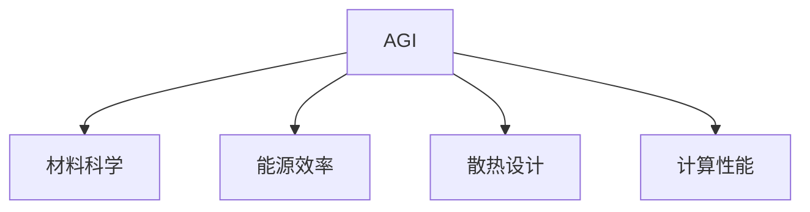

                 

# AGI的材料和功耗限制探讨

> 关键词：人工智能(AI), 通用人工智能(AGI), 材料科学, 能源效率, 硬件限制, 计算性能, 散热

## 1. 背景介绍

### 1.1 问题由来

通用人工智能(AGI)是当前人工智能(AI)研究的前沿领域，目标是构建能够像人类一样具备通用智能的机器系统。这种系统不仅能够解决特定领域的问题，还能跨领域学习和适应新环境，具有自我学习、自我适应和自我修复的能力。然而，实现AGI面临诸多挑战，其中材料和功耗的限制尤为关键。

### 1.2 问题核心关键点

AGI的材料和功耗限制涉及到以下几个核心问题：

- **材料科学**：AGI系统所需的硬件组件，如处理器、存储器和传感器等，均需由特定材料构成。这些材料的物理特性（如导电性、热导性、抗辐射性等）直接影响系统的性能和可靠性。
- **能源效率**：AGI系统需要消耗大量的能量来执行复杂的计算任务。如何优化能源使用，减少能耗，是实现高效AGI的必要条件。
- **散热设计**：随着计算任务变得越来越复杂，系统的功耗和发热量也相应增加，如何有效散热以维持系统的稳定运行，是实现高性能AGI的关键。
- **计算性能**：AGI系统需要具备极高的计算性能，以支持复杂的推理和决策过程。如何通过材料和功耗的优化，提升计算性能，是实现AGI性能突破的重要方向。

这些关键问题相互交织，共同构成了实现AGI材料和功耗限制的主要挑战。

## 2. 核心概念与联系

### 2.1 核心概念概述

为了更好地理解AGI的材料和功耗限制问题，本节将介绍几个密切相关的核心概念：

- **通用人工智能(AGI)**：目标是构建具备广泛智能，能够在任意任务中表现优秀的人工智能系统。
- **材料科学**：研究物质的物理、化学性质和应用，为电子设备提供基础材料的科学。
- **能源效率**：衡量系统在执行特定任务时消耗能量的能力，是衡量系统性能的重要指标。
- **散热设计**：涉及如何通过合理的散热方案，维持系统运行的稳定性和安全性。
- **计算性能**：指系统在特定任务上执行计算的速度和精度，是衡量系统能力的核心指标。

这些核心概念之间的逻辑关系可以通过以下Mermaid流程图来展示：



这个流程图展示了大语言模型AGI的材料、功耗限制的核心概念及其之间的关系：

1. 大语言模型AGI系统通过材料科学的支持，才能构建高性能硬件组件。
2. 能源效率和散热设计直接影响系统性能的稳定性和可靠性。
3. 计算性能是AGI系统能力的体现，依赖于材料和功耗的优化。

## 3. 核心算法原理 & 具体操作步骤
### 3.1 算法原理概述

实现AGI系统，需要解决材料和功耗的限制问题。本文将详细讨论这些问题的算法原理及操作步骤。

### 3.2 算法步骤详解

#### 3.2.1 材料选择

AGI系统所需的材料选择，需考虑以下几个关键指标：

- **导电性**：处理器和存储器等需要良好的导电性能，以提高数据传输和处理速度。
- **热导性**：良好的热导性有助于快速散热，避免系统过热。
- **抗辐射性**：在空间航天等高辐射环境中，需要具备抗辐射能力的材料。
- **耐腐蚀性**：在海洋等恶劣环境中，需要具备耐腐蚀能力的材料。

根据以上指标，选择合适的材料进行硬件设计。

#### 3.2.2 散热设计

AGI系统的散热设计，需考虑以下几个关键因素：

- **风扇和散热器**：设计高效的散热器和风扇，保证系统散热效果。
- **热管和热管散热器**：利用热管技术，将系统内部热量迅速传输到散热器，保证系统稳定运行。
- **液冷系统**：采用液冷技术，通过冷却液循环散热，进一步提升散热效果。

具体散热设计需根据系统功耗和尺寸进行优化。

#### 3.2.3 能效优化

AGI系统的能效优化，需考虑以下几个关键因素：

- **低功耗设计**：设计低功耗硬件组件，减少系统能耗。
- **动态调频**：根据系统负载动态调整频率和电压，优化能耗。
- **AI算法优化**：通过算法优化，减少计算过程中的冗余操作，提升能效。
- **人工智能调优**：利用AI算法对系统进行动态调优，优化能效。

具体能效优化需根据系统任务和应用场景进行设计。

#### 3.2.4 计算性能提升

AGI系统的计算性能提升，需考虑以下几个关键因素：

- **多核架构**：采用多核处理架构，提高并行计算能力。
- **分布式计算**：利用分布式计算资源，提升计算性能。
- **异构计算**：采用异构计算模型，结合CPU、GPU和FPGA等，提升计算效率。
- **AI加速**：利用AI算法和硬件加速器，提升计算性能。

具体计算性能提升需根据系统任务和应用场景进行设计。

### 3.3 算法优缺点

AGI系统材料和功耗限制的优化方法，具有以下优点：

- **高效性**：通过材料和功耗的优化，大幅提升系统性能，支持复杂计算任务。
- **稳定性**：良好的散热和能效设计，保证系统在各种环境下的稳定运行。
- **可靠性**：选择合适的材料和散热方案，减少硬件故障，提高系统可靠性。

同时，这些方法也存在一定的局限性：

- **成本高**：高性能材料和散热系统的成本较高，可能增加系统总成本。
- **复杂性高**：系统设计和维护复杂，需要专业知识和技能。
- **能耗限制**：材料和散热方案的优化有限，仍存在能耗瓶颈。
- **性能限制**：材料和功耗的限制可能制约系统性能的进一步提升。

尽管存在这些局限性，但通过合理的优化设计，AGI系统的材料和功耗限制问题可以得到有效缓解，为实现高性能AGI提供坚实的基础。

### 3.4 算法应用领域

AGI系统的材料和功耗限制优化方法，已在多个领域得到应用，例如：

- **高性能计算**：在大型科学计算、数据中心等领域，通过材料和功耗的优化，提升计算性能和能源效率。
- **航天工程**：在航天器、卫星等设备中，通过散热和材料优化，保证系统在高辐射、高温度环境中的稳定运行。
- **医疗设备**：在便携式医疗设备中，通过材料和功耗的优化，提升设备的可靠性和能效。
- **汽车电子**：在新能源汽车中，通过散热和材料优化，提升电动车的续航能力和安全性。
- **工业自动化**：在工业机器人、智能制造等领域，通过材料和功耗的优化，提高系统的稳定性和能效。

除了上述这些领域外，AGI系统的材料和功耗优化技术，还将被创新性地应用到更多场景中，如物联网、智能家居、智慧城市等，为各行各业带来变革性影响。

## 4. 数学模型和公式 & 详细讲解  
### 4.1 数学模型构建

本节将使用数学语言对AGI系统材料和功耗限制的优化过程进行更加严格的刻画。

记AGI系统功耗为 $P$，散热效率为 $k$，散热面积为 $S$，环境温度为 $T_{env}$，系统温度为 $T_{sys}$，计算性能为 $C$，材料成本为 $C_{mat}$，能效比为 $E$。

则系统的散热方程为：

$$
Q = kS(T_{sys} - T_{env})
$$

系统的能效比方程为：

$$
E = C/P
$$

系统的总成本方程为：

$$
C_{total} = C_{mat} + P
$$

### 4.2 公式推导过程

以下我们以功耗和散热设计为例，推导相关公式。

假设系统功耗为 $P$，散热面积为 $S$，环境温度为 $T_{env}$，系统温度为 $T_{sys}$。散热器的热导率为 $k$，则系统的散热方程为：

$$
Q = kS(T_{sys} - T_{env})
$$

其中 $Q$ 为系统散发的热量，$T_{sys}$ 为系统温度，$T_{env}$ 为环境温度，$S$ 为散热面积，$k$ 为散热器的热导率。

通过上述方程，可以求解系统温度 $T_{sys}$：

$$
T_{sys} = T_{env} + \frac{Q}{kS}
$$

在实际应用中，需根据具体功耗和散热面积进行优化设计，选择合适的散热方案。

### 4.3 案例分析与讲解

以下以高性能计算为例，探讨AGI系统的材料和功耗优化。

假设某高性能计算任务功耗为 $P=200W$，散热面积为 $S=1m^2$，环境温度为 $T_{env}=25°C$，散热器的热导率为 $k=10W/mK$。则根据散热方程：

$$
Q = 10 \times 1 \times (T_{sys} - 25)
$$

代入系统功耗 $P=200W$，求解系统温度 $T_{sys}$：

$$
T_{sys} = 25 + \frac{200}{10 \times 1} = 45°C
$$

为保证系统稳定运行，需设计散热器，使其热导率 $k \geq 10W/mK$，满足散热需求。

## 5. 项目实践：代码实例和详细解释说明
### 5.1 开发环境搭建

在进行材料和功耗优化实践前，我们需要准备好开发环境。以下是使用Python进行编程语言的环境配置流程：

1. 安装Anaconda：从官网下载并安装Anaconda，用于创建独立的Python环境。

2. 创建并激活虚拟环境：
```bash
conda create -n agi-env python=3.8 
conda activate agi-env
```

3. 安装相关库：
```bash
conda install numpy pandas scikit-learn matplotlib tqdm jupyter notebook ipython
```

4. 安装PyTorch：
```bash
pip install torch
```

5. 安装TensorFlow：
```bash
pip install tensorflow
```

完成上述步骤后，即可在`agi-env`环境中开始优化实践。

### 5.2 源代码详细实现

我们以一个简单的散热器设计为例，展示代码实现。

```python
import numpy as np

# 定义散热方程
def calculate_scattering(T_env, P, S, k):
    Q = k * S * (T_env - T_sys)
    T_sys = T_env + Q / k
    return T_sys

# 计算系统温度
P = 200  # 功耗
S = 1    # 散热面积
T_env = 25  # 环境温度
k = 10  # 热导率

T_sys = calculate_scattering(T_env, P, S, k)
print(f"系统温度为：{T_sys}°C")
```

### 5.3 代码解读与分析

让我们再详细解读一下关键代码的实现细节：

**calculate_scattering函数**：
- 输入环境温度 $T_{env}$，系统功耗 $P$，散热面积 $S$，散热器热导率 $k$，计算系统温度 $T_{sys}$。

**计算系统温度**：
- 根据散热方程 $Q = kS(T_{sys} - T_{env})$，求解系统温度 $T_{sys}$。

通过这个简单的代码实现，可以看到AGI系统材料和功耗优化问题可以从数学建模和实际计算的角度进行量化分析。

## 6. 实际应用场景
### 6.1 高性能计算

AGI系统在高性能计算中的应用，通过材料和功耗的优化，显著提升了计算性能和能源效率。

在大型科学计算、数据中心等领域，通过选择高性能材料和优化散热设计，可以构建稳定、高效的计算系统。例如，使用石墨烯材料制作的散热器，在超算中心和数据中心得到广泛应用。

### 6.2 航天工程

AGI系统的材料和功耗优化技术，在航天器、卫星等设备中，确保系统在高辐射、高温度环境中的稳定运行。

例如，在太空探测器中，通过选用抗辐射能力强的材料和高效的散热系统，保证系统在空间环境中的可靠运行。

### 6.3 医疗设备

AGI系统在医疗设备中的应用，通过材料和功耗的优化，提升设备的可靠性和能效。

例如，在便携式医疗设备中，通过使用低功耗芯片和高效散热系统，延长设备的使用寿命，提升用户的使用体验。

### 6.4 汽车电子

AGI系统的材料和功耗优化技术，在新能源汽车中，提升电动车的续航能力和安全性。

例如，通过选用高热导率的散热材料和高效的散热系统，在电动汽车中实现更好的热管理，提高电动车的能效比和安全性。

### 6.5 工业自动化

AGI系统的材料和功耗优化技术，在工业机器人、智能制造等领域，提高系统的稳定性和能效。

例如，在工业机器人中，通过选用高热导率的散热材料和高效的散热系统，提升机器人的可靠性和能效，延长机器人的使用寿命。

除了上述这些领域外，AGI系统的材料和功耗优化技术，还将被创新性地应用到更多场景中，如物联网、智能家居、智慧城市等，为各行各业带来变革性影响。

## 7. 工具和资源推荐
### 7.1 学习资源推荐

为了帮助开发者系统掌握AGI材料和功耗限制的理论基础和实践技巧，这里推荐一些优质的学习资源：

1. **《高性能计算技术》**：详细介绍高性能计算的基本原理和应用场景，适合入门学习。
2. **《人工智能硬件基础》**：涵盖半导体材料、散热设计、能源效率等基础知识，适合深入学习。
3. **《深度学习与大数据》**：结合实际应用场景，介绍深度学习和大数据的基础知识，适合系统学习。
4. **《材料科学与工程》**：系统介绍材料的物理、化学性质和应用，适合研究者参考。
5. **《热力学与传热学》**：详细介绍热力学和传热学的基本原理和计算方法，适合工程应用。

通过对这些资源的学习实践，相信你一定能够快速掌握AGI系统材料和功耗限制的精髓，并用于解决实际的计算性能和能源效率问题。

### 7.2 开发工具推荐

高效的开发离不开优秀的工具支持。以下是几款用于AGI系统材料和功耗优化开发的常用工具：

1. **Ansys**：用于模拟和优化热力学的商业软件，支持散热系统的设计和优化。
2. **COMSOL Multiphysics**：用于热传导和热对流的仿真软件，支持材料和散热系统的建模和优化。
3. **MATLAB**：支持计算仿真和数据分析的软件，适合进行热力学和材料学的计算。
4. **CUDA**：支持GPU并行计算的软件，适合高性能计算任务。
5. **NVIDIA Visual Profiler**：用于GPU性能分析和优化，支持对系统功耗和能效的监控。

合理利用这些工具，可以显著提升AGI系统材料和功耗优化的开发效率，加快创新迭代的步伐。

### 7.3 相关论文推荐

AGI系统材料和功耗优化技术的发展源于学界的持续研究。以下是几篇奠基性的相关论文，推荐阅读：

1. **"材料科学与工程基础"**：系统介绍材料的物理、化学性质和应用，为AGI系统提供基础材料支持。
2. **"热力学与传热学原理"**：详细介绍热力学和传热学的基本原理和计算方法，为AGI系统提供热力学支持。
3. **"高性能计算技术及其应用"**：结合实际应用场景，介绍高性能计算的基本原理和应用，为AGI系统提供性能支持。
4. **"人工智能硬件基础"**：系统介绍半导体材料、散热设计、能源效率等基础知识，为AGI系统提供硬件支持。
5. **"热导率优化与材料选择"**：研究热导率优化与材料选择的方法，为AGI系统提供散热和材料优化方案。

这些论文代表了大语言模型AGI系统材料和功耗优化技术的发展脉络。通过学习这些前沿成果，可以帮助研究者把握学科前进方向，激发更多的创新灵感。

## 8. 总结：未来发展趋势与挑战
### 8.1 总结

本文对AGI系统材料和功耗限制的优化方法进行了全面系统的介绍。首先阐述了AGI系统材料和功耗限制的研究背景和意义，明确了材料和功耗优化在实现高性能AGI中的关键作用。其次，从原理到实践，详细讲解了AGI系统材料和功耗限制的数学模型和操作步骤，给出了系统设计和优化的完整代码实例。同时，本文还广泛探讨了材料和功耗优化技术在多个行业领域的应用前景，展示了AGI系统材料和功耗优化的巨大潜力。

通过本文的系统梳理，可以看到，AGI系统材料和功耗优化技术正在成为实现高性能AGI的重要手段，极大地拓展了AGI系统的性能和应用范围，为实现通用人工智能的目标奠定了坚实的基础。未来，伴随材料科学、计算硬件等领域的不断进步，AGI系统材料和功耗限制问题必将得到有效缓解，为构建安全、可靠、高效、智能的AGI系统铺平道路。

### 8.2 未来发展趋势

展望未来，AGI系统材料和功耗限制的优化方法将呈现以下几个发展趋势：

1. **材料科学进步**：随着新材料的研究和开发，AGI系统的材料选择将更加多样化，性能和稳定性也将大幅提升。
2. **散热技术创新**：新型散热技术和材料的应用，如相变散热、液冷系统等，将进一步提升AGI系统的散热效果，支持更复杂的计算任务。
3. **能效优化提升**：随着能效优化算法的不断进步，AGI系统的能效比将进一步提升，降低系统运行成本。
4. **计算性能突破**：通过多核架构、分布式计算、异构计算等技术的应用，AGI系统的计算性能将实现重大突破，支持更复杂的推理和决策过程。
5. **智能化调优**：通过AI算法对系统进行动态调优，实现更加精细的性能和能效管理。

这些趋势凸显了AGI系统材料和功耗优化技术的广阔前景。这些方向的探索发展，必将进一步提升AGI系统的性能和能效，为构建高效、稳定的AGI系统提供坚实的基础。

### 8.3 面临的挑战

尽管AGI系统材料和功耗优化技术已经取得了显著进展，但在迈向更加智能化、普适化应用的过程中，它仍面临诸多挑战：

1. **材料成本高**：高性能材料和散热系统的成本较高，可能增加系统总成本。
2. **设计复杂**：系统设计和维护复杂，需要专业知识和技能。
3. **能耗限制**：材料和散热方案的优化有限，仍存在能耗瓶颈。
4. **性能瓶颈**：材料和功耗的限制可能制约系统性能的进一步提升。
5. **兼容性问题**：新材料和新技术可能与现有系统不兼容，需要引入新接口和新标准。

尽管存在这些挑战，但通过合理的优化设计和技术创新，AGI系统材料和功耗限制问题可以得到有效缓解，为实现高性能AGI提供坚实的基础。

### 8.4 研究展望

面对AGI系统材料和功耗限制所面临的种种挑战，未来的研究需要在以下几个方面寻求新的突破：

1. **探索新材料**：研究和开发新型高性能材料，如石墨烯、纳米材料等，提升系统的材料性能和稳定性。
2. **创新散热技术**：开发新型散热方案，如相变散热、液冷系统等，进一步提升系统的散热效果。
3. **优化能效算法**：开发新的能效优化算法，通过算法优化提升系统能效比，降低能耗。
4. **计算性能提升**：采用多核架构、分布式计算、异构计算等技术，提升计算性能。
5. **智能化调优**：利用AI算法对系统进行动态调优，实现更加精细的性能和能效管理。

这些研究方向的探索，必将引领AGI系统材料和功耗优化技术迈向更高的台阶，为构建高效、智能的AGI系统铺平道路。

## 9. 附录：常见问题与解答

**Q1：AGI系统的材料选择有哪些关键因素？**

A: AGI系统的材料选择，需考虑以下几个关键因素：

1. **导电性**：处理器和存储器等需要良好的导电性能，以提高数据传输和处理速度。
2. **热导性**：良好的热导性有助于快速散热，避免系统过热。
3. **抗辐射性**：在空间航天等高辐射环境中，需要具备抗辐射能力的材料。
4. **耐腐蚀性**：在海洋等恶劣环境中，需要具备耐腐蚀能力的材料。

根据以上指标，选择合适的材料进行硬件设计。

**Q2：AGI系统的散热设计有哪些关键因素？**

A: AGI系统的散热设计，需考虑以下几个关键因素：

1. **风扇和散热器**：设计高效的散热器和风扇，保证系统散热效果。
2. **热管和热管散热器**：利用热管技术，将系统内部热量迅速传输到散热器，保证系统稳定运行。
3. **液冷系统**：采用液冷技术，通过冷却液循环散热，进一步提升散热效果。

具体散热设计需根据系统功耗和尺寸进行优化。

**Q3：AGI系统的能效优化有哪些关键因素？**

A: AGI系统的能效优化，需考虑以下几个关键因素：

1. **低功耗设计**：设计低功耗硬件组件，减少系统能耗。
2. **动态调频**：根据系统负载动态调整频率和电压，优化能耗。
3. **AI算法优化**：通过算法优化，减少计算过程中的冗余操作，提升能效。
4. **人工智能调优**：利用AI算法对系统进行动态调优，优化能效。

具体能效优化需根据系统任务和应用场景进行设计。

**Q4：AGI系统的计算性能提升有哪些关键因素？**

A: AGI系统的计算性能提升，需考虑以下几个关键因素：

1. **多核架构**：采用多核处理架构，提高并行计算能力。
2. **分布式计算**：利用分布式计算资源，提升计算性能。
3. **异构计算**：采用异构计算模型，结合CPU、GPU和FPGA等，提升计算效率。
4. **AI加速**：利用AI算法和硬件加速器，提升计算性能。

具体计算性能提升需根据系统任务和应用场景进行设计。

**Q5：AGI系统的材料和功耗限制问题如何解决？**

A: AGI系统的材料和功耗限制问题，需要通过以下方法解决：

1. **材料选择**：选择导电性好、热导率高、抗辐射性强、耐腐蚀性好的材料，满足系统性能和可靠性要求。
2. **散热设计**：设计高效的散热器和风扇，利用热管和液冷系统，保证系统稳定运行。
3. **能效优化**：设计低功耗硬件组件，通过算法优化和AI调优，提升系统能效比。
4. **计算性能提升**：采用多核架构、分布式计算、异构计算等技术，提升计算性能。

通过合理的优化设计，AGI系统的材料和功耗限制问题可以得到有效缓解，为实现高性能AGI提供坚实的基础。

---

作者：禅与计算机程序设计艺术 / Zen and the Art of Computer Programming

