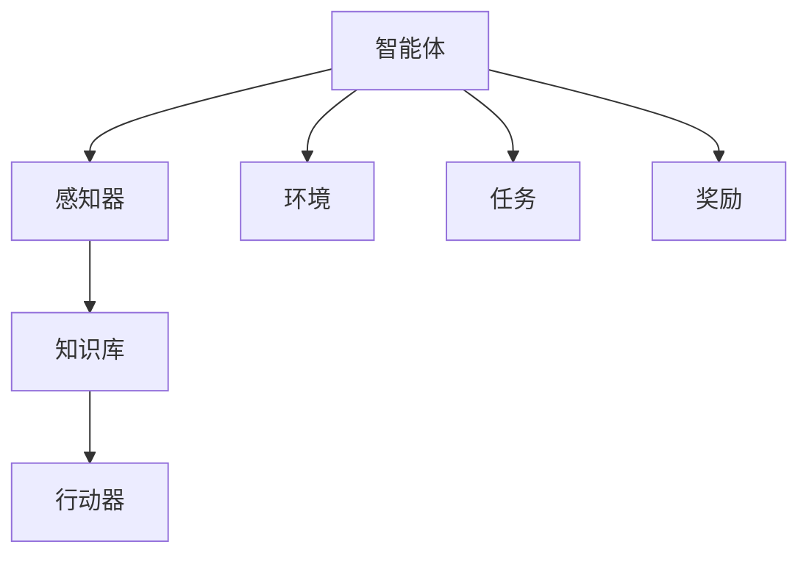

                 

## 1. 背景介绍

### 1.1 问题由来

近年来，随着人工智能(AI)技术在各个领域的广泛应用，智能体(Agent)作为AI的核心组成部分，逐渐成为研究的热点。智能体是一个自主运行的实体，能够在特定环境中执行任务，具备学习和适应环境的能力。智能体的研究旨在解决复杂的自动化决策问题，广泛应用于机器人控制、游戏AI、金融交易、推荐系统等众多领域。

然而，尽管智能体在许多任务中表现出色，但如何设计高效、鲁棒、可解释的智能体，始终是人工智能研究的前沿挑战。智能体在实际应用中需要处理高度不确定的环境，并且需要不断地从新的经验中学习，以提高其性能和适应性。在复杂的多智能体系统中，如何实现各智能体之间的协同工作，并高效应对资源约束、安全隐私等挑战，也是研究的重要方向。

### 1.2 问题核心关键点

智能体作为人工智能的重要研究对象，涉及的核心关键点包括：

- 自主决策：智能体能够在无外界干预的情况下，自主执行复杂任务。
- 环境感知：智能体能够通过传感器获取环境信息，感知自身状态和环境变化。
- 学习机制：智能体能够从经验中学习，更新内部知识库，提高决策能力。
- 多智能体交互：智能体能够在多智能体系统中协同工作，实现集体决策。
- 鲁棒性和安全性：智能体能够应对环境不确定性，保持鲁棒性，并遵守伦理和安全标准。

这些关键点决定了智能体的设计、训练和应用方法。在智能体的研究中，我们不仅需要掌握智能体的基础理论和算法，还需要理解其在实际应用中的表现和挑战。

### 1.3 问题研究意义

智能体的研究具有重要的理论和实际意义：

1. **理论研究**：智能体的研究推动了人工智能理论的发展，涵盖了控制论、认知心理学、博弈论等多个学科。
2. **技术创新**：智能体的研究成果直接影响了自动驾驶、机器人、游戏AI等领域的技术进步。
3. **应用拓展**：智能体在智慧城市、智能制造、网络安全等多个垂直领域展现出广泛的应用前景。
4. **伦理与法律**：智能体的决策行为涉及伦理与法律问题，如何确保智能体的公平性、透明度和安全性，是研究的重点。
5. **经济效益**：智能体的广泛应用将显著提高生产效率，降低运营成本，带来巨大的经济效益。

通过系统深入地研究智能体，可以更好地理解其设计和应用的原理，推动人工智能技术的产业化进程，提升各行业的智能化水平。

## 2. 核心概念与联系

### 2.1 核心概念概述

为更好地理解智能体的设计原则和应用方法，本节将介绍几个密切相关的核心概念：

- 智能体(Agent)：能够自主感知环境、决策并执行任务的实体。
- 感知器(Sensor)：用于获取环境信息的设备或模块。
- 知识库(Knowledge Base)：智能体的决策知识库，存储经验、规则和模型等。
- 行动器(Actuator)：智能体用于执行决策的设备或模块。
- 环境(Environment)：智能体运行的物理或虚拟空间。
- 任务(Task)：智能体需要完成的特定目标。
- 奖励(Reward)：智能体执行任务的反馈机制。

这些核心概念之间的逻辑关系可以通过以下Mermaid流程图来展示：



这个流程图展示出智能体各个组件之间的关系：

1. 智能体通过感知器获取环境信息，感知自身状态和环境变化。
2. 智能体在知识库中存储学习到的知识，形成决策依据。
3. 智能体通过行动器执行决策，完成特定任务。
4. 智能体根据环境反馈的奖励，调整知识库，优化决策能力。

这些组件相互作用，使智能体能够在复杂环境中自主完成各种任务。

## 3. 核心算法原理 & 具体操作步骤

### 3.1 算法原理概述

智能体的设计和训练通常遵循强化学习(RL)的原理。强化学习是一种通过与环境互动，通过奖励信号不断调整决策策略的学习方法。智能体在每次执行决策后，会接收到环境给予的奖励，通过累积奖励的最大化来优化决策策略。

形式化地，设智能体的状态空间为 $S$，动作空间为 $A$，奖励函数为 $R$，策略为 $\pi$。智能体的目标是通过优化策略 $\pi$，使得总奖励最大化。即求解：

$$
\max_{\pi} \mathbb{E}_{s \sim \rho_\pi, a \sim \pi} \left[\sum_{t=0}^{\infty} \gamma^t R(s_t, a_t) \right]
$$

其中 $\rho_\pi$ 为在策略 $\pi$ 下状态的分布。

智能体的训练过程通常包括以下步骤：

1. 初始化智能体和环境，定义奖励函数。
2. 通过感知器获取环境信息，在知识库中进行状态表示。
3. 根据策略 $\pi$，选择一个动作 $a$。
4. 执行动作 $a$，观察环境变化，获得状态 $s'$ 和奖励 $r$。
5. 通过学习算法更新知识库和策略 $\pi$，调整智能体的行为。
6. 重复步骤 3-5，直至达到停止条件。

### 3.2 算法步骤详解

智能体的设计与训练过程可以分为以下几个关键步骤：

**Step 1: 环境定义与感知器选择**

定义智能体运行的环境 $E$，选择合适的感知器 $S$ 用于获取环境信息。例如，在机器人控制中，摄像头和激光雷达是常用的感知器；在游戏AI中，像素数据和游戏状态信息是常见的感知输入。

**Step 2: 知识库设计**

设计智能体的知识库 $K$，存储环境状态 $s$、状态转移概率 $P(s'|s,a)$ 和奖励函数 $R(s,a)$ 等。这些信息用于构建智能体的状态表示和决策规则。

**Step 3: 行动器选择**

选择行动器 $A$，将智能体的决策输出转化为可执行的动作。例如，在机器人控制中，行动器可能是电机、机械臂等；在游戏AI中，行动器可能是键盘、鼠标等。

**Step 4: 决策策略设计**

设计智能体的决策策略 $\pi$，通常采用价值函数或策略梯度等方法。价值函数方法如Q-learning、SARSA等，策略梯度方法如Policy Gradient、REINFORCE等。这些方法通过不断调整策略，优化智能体的决策效果。

**Step 5: 学习算法实现**

选择合适的学习算法，如Q-learning、Deep Q-learning、Actor-Critic等，根据感知器输入和环境反馈，更新智能体的知识库和策略。

**Step 6: 模型评估与迭代**

在训练过程中，定期评估智能体的性能，使用验证集或其他评估指标如FPS、成功率等，调整智能体的参数和策略。不断迭代，直至达到预期性能。

### 3.3 算法优缺点

智能体设计具有以下优点：

1. 自主决策：智能体能够自主执行复杂任务，减少人工干预。
2. 自适应：智能体能够根据环境变化调整决策策略，适应新情况。
3. 学习能力强：智能体通过与环境互动，不断学习和优化决策。
4. 可扩展：智能体的设计可以适应各种应用场景，易于扩展。

同时，智能体也存在以下局限性：

1. 环境建模复杂：智能体的决策依赖于对环境的精确建模，复杂环境难以建模。
2. 决策鲁棒性不足：在环境变化或噪声干扰下，智能体可能出现决策失误。
3. 计算资源消耗大：复杂的决策过程和模型训练需要大量计算资源。
4. 数据需求高：智能体的训练需要大量的训练数据，数据采集成本较高。
5. 可解释性差：智能体的决策过程复杂，难以解释和调试。

尽管存在这些局限性，但智能体作为一种高级AI形式，在复杂决策问题中展现出巨大的应用潜力，并逐渐成为人工智能研究的热点。

### 3.4 算法应用领域

智能体作为AI技术的重要组成部分，广泛应用于以下几个领域：

- 自动驾驶：在自动驾驶中，智能体能够实时感知道路状况，自主决策和执行驾驶操作。
- 机器人控制：在机器人控制中，智能体能够感知环境，自主执行复杂任务。
- 游戏AI：在游戏AI中，智能体能够感知游戏状态，自主决策和执行游戏操作。
- 推荐系统：在推荐系统中，智能体能够根据用户行为，自主推荐个性化内容。
- 金融交易：在金融交易中，智能体能够感知市场信息，自主决策和执行交易操作。
- 智能制造：在智能制造中，智能体能够感知生产状态，自主执行制造任务。

除了上述这些经典应用外，智能体还被创新性地应用到更多场景中，如医疗诊断、城市管理、安全监控等，为各行各业带来智能化变革。

## 4. 数学模型和公式 & 详细讲解 & 举例说明

### 4.1 数学模型构建

本节将使用数学语言对智能体的设计和训练过程进行更加严格的刻画。

设智能体的状态空间为 $S$，动作空间为 $A$，奖励函数为 $R$。假设智能体在状态 $s$ 时，采取动作 $a$，观察到下一个状态 $s'$，获得奖励 $r$。则智能体的状态转移概率为 $P(s'|s,a)$，智能体的状态表示函数为 $V(s)$，策略为 $\pi(a|s)$。

智能体的目标是通过优化策略 $\pi$，使得总奖励最大化。即求解：

$$
\max_{\pi} \mathbb{E}_{s \sim \rho_\pi, a \sim \pi} \left[\sum_{t=0}^{\infty} \gamma^t R(s_t, a_t) \right]
$$

其中 $\rho_\pi$ 为在策略 $\pi$ 下状态的分布。

### 4.2 公式推导过程

以下我们以Q-learning算法为例，推导智能体学习过程的数学公式。

在Q-learning中，智能体的状态值函数 $Q(s,a)$ 表示在状态 $s$ 下，采取动作 $a$ 的累积奖励。Q-learning通过以下递推关系不断更新状态值函数：

$$
Q(s,a) \leftarrow Q(s,a) + \alpha \left[R(s,a) + \gamma \max_{a'} Q(s',a') - Q(s,a) \right]
$$

其中 $\alpha$ 为学习率，$\gamma$ 为折扣因子，$s'$ 为下一个状态，$a'$ 为在该状态下的最佳动作。

根据状态值函数的更新公式，智能体通过不断调整 $Q(s,a)$ 的值，优化决策策略。在每次决策时，智能体根据 $Q(s,a)$ 的值，选择动作 $a$。这样，智能体通过与环境的不断交互，逐步优化状态值函数，从而实现自主决策。

### 4.3 案例分析与讲解

假设有一个智能体在迷宫中寻找出口。迷宫的每个位置为状态 $s$，每个方向为动作 $a$，智能体每次移动会获得一定的奖励或惩罚。智能体的状态值函数 $Q(s,a)$ 表示在状态 $s$ 下，采取动作 $a$ 的累积奖励。智能体的目标是找到出口，最大化累积奖励。

智能体的Q-learning学习过程如下：

1. 初始化状态值函数 $Q(s,a)$ 为0，学习率 $\alpha = 0.01$，折扣因子 $\gamma = 0.9$。
2. 智能体从起点开始，随机选择一个动作 $a$。
3. 根据动作 $a$，智能体观察到下一个状态 $s'$ 和奖励 $r$。
4. 根据状态转移概率 $P(s'|s,a)$ 更新状态值函数：
$$
Q(s,a) \leftarrow Q(s,a) + \alpha \left[r + \gamma \max_{a'} Q(s',a') - Q(s,a) \right]
$$
5. 重复步骤2-4，直至找到出口或达到预设的迭代次数。

假设智能体通过Q-learning学习到以下状态值函数：

- 在起点，智能体认为向右走最为有利，因为可以获得更多的奖励。
- 在迷宫的中间，智能体认为向左走最为有利，因为可以避开障碍。
- 在出口附近，智能体认为向右走最为有利，因为可以直接到达出口。

这样，智能体通过不断调整状态值函数，逐步优化决策策略，最终找到出口。

## 5. 项目实践：代码实例和详细解释说明

### 5.1 开发环境搭建

在进行智能体开发前，我们需要准备好开发环境。以下是使用Python进行PyTorch开发的环境配置流程：

1. 安装Anaconda：从官网下载并安装Anaconda，用于创建独立的Python环境。

2. 创建并激活虚拟环境：
```bash
conda create -n pytorch-env python=3.8 
conda activate pytorch-env
```

3. 安装PyTorch：根据CUDA版本，从官网获取对应的安装命令。例如：
```bash
conda install pytorch torchvision torchaudio cudatoolkit=11.1 -c pytorch -c conda-forge
```

4. 安装OpenAI Gym：
```bash
pip install gym
```

5. 安装各类工具包：
```bash
pip install numpy pandas scikit-learn matplotlib tqdm jupyter notebook ipython
```

完成上述步骤后，即可在`pytorch-env`环境中开始智能体开发。

### 5.2 源代码详细实现

这里我们以Q-learning算法实现一个迷宫智能体的为例，给出使用PyTorch的代码实现。

```python
import torch
import numpy as np
import gym
from torch.optim import Adam
from torch.nn import Parameter
import matplotlib.pyplot as plt

# 定义状态值函数 Q(s,a)
class QNetwork(torch.nn.Module):
    def __init__(self, state_dim, action_dim, hidden_dim):
        super(QNetwork, self).__init__()
        self.fc1 = torch.nn.Linear(state_dim, hidden_dim)
        self.fc2 = torch.nn.Linear(hidden_dim, hidden_dim)
        self.fc3 = torch.nn.Linear(hidden_dim, action_dim)

    def forward(self, state):
        x = torch.relu(self.fc1(state))
        x = torch.relu(self.fc2(x))
        return torch.tanh(self.fc3(x))

# 定义智能体
class Agent:
    def __init__(self, state_dim, action_dim, hidden_dim):
        self.state_dim = state_dim
        self.action_dim = action_dim
        self.hidden_dim = hidden_dim
        self.q_network = QNetwork(state_dim, action_dim, hidden_dim)
        self.optimizer = Adam(self.q_network.parameters(), lr=0.01)
        self.gamma = 0.9

    def act(self, state):
        state = torch.from_numpy(state).float()
        with torch.no_grad():
            q_values = self.q_network(state)
            action = np.argmax(q_values.numpy())
        return action

    def update(self, state, action, next_state, reward, done):
        state = torch.from_numpy(state).float()
        next_state = torch.from_numpy(next_state).float()
        reward = torch.from_numpy(np.array([reward])).float()
        q_values = self.q_network(state)
        q_next = self.q_network(next_state)
        target = reward + self.gamma * torch.max(q_next)
        q_values[0][action] = target
        self.optimizer.zero_grad()
        q_values.backward()
        self.optimizer.step()

# 定义迷宫环境
class Environment:
    def __init__(self):
        self.state_dim = 4
        self.action_dim = 4
        self.reward = -1
        self.done = False
        self.env = gym.make('FrozenLake-v0')
        self.env.seed(0)
        self.env.reset()

    def act(self, action):
        state, reward, done, info = self.env.step(action)
        return state, reward, done

    def reset(self):
        self.env.reset()
        self.done = False
        return self.env.reset()

# 定义实验参数
state_dim = 4
action_dim = 4
hidden_dim = 32
episodes = 5000
iterations = 10

# 训练智能体
env = Environment()
agent = Agent(state_dim, action_dim, hidden_dim)
rewards = []

for episode in range(episodes):
    state = env.reset()
    state_values = torch.zeros(state_dim, action_dim)
    done = False
    for iteration in range(iterations):
        action = agent.act(state)
        next_state, reward, done = env.act(action)
        agent.update(state, action, next_state, reward, done)
        state_values = torch.tensor(state_values, dtype=torch.float)
        state_values[action] = q_values[0][action]
        state = next_state
        if done:
            break
    rewards.append(state_values[0][2])  # 迷宫中的出口位置

# 可视化训练结果
plt.plot(rewards)
plt.xlabel('Episode')
plt.ylabel('Reward')
plt.show()
```

以上代码实现了使用Q-learning算法训练迷宫智能体的过程。可以看到，智能体通过不断与环境互动，调整状态值函数，逐步优化决策策略，最终成功找到出口。

### 5.3 代码解读与分析

让我们再详细解读一下关键代码的实现细节：

**QNetwork类**：
- `__init__`方法：初始化网络参数，包含全连接层和激活函数。
- `forward`方法：前向传播计算状态值函数。

**Agent类**：
- `__init__`方法：初始化智能体参数，包含状态值函数、优化器和折扣因子。
- `act`方法：选择动作并计算当前状态值函数。
- `update`方法：更新状态值函数和网络参数。

**Environment类**：
- `__init__`方法：定义环境参数，包含状态维数、动作维数、奖励和状态转移函数。
- `act`方法：执行动作并观察环境变化。
- `reset`方法：重置环境状态。

**实验参数**：
- 定义迷宫环境的状态维数、动作维数、隐藏层维数、训练轮数和集数。

**训练过程**：
- 在每个集数内，智能体通过与环境互动，逐步优化状态值函数。
- 通过计算每个集数的最终状态值函数，可视化智能体的学习过程。

可以看到，通过这些关键组件和算法，智能体能够有效地在复杂环境中自主学习和决策。

当然，工业级的系统实现还需考虑更多因素，如智能体的存储和通信、多智能体协同、学习效率优化等。但核心的智能体微调方法基本与此类似。

## 6. 实际应用场景

### 6.1 智能客服系统

智能客服系统作为智能体在实际应用中的一个典型案例，展示了智能体在处理复杂客户交互中的高效和智能。传统的客服系统依赖于规则和人工干预，难以应对大规模客户请求和复杂场景。而使用智能体，可以24小时不间断工作，实时响应客户咨询，提供个性化的服务。

在技术实现上，智能体可以通过深度学习模型，学习历史对话数据，自动理解客户意图，匹配最佳回复模板，生成自然流畅的回答。对于新问题，系统可以接入检索系统实时搜索相关内容，动态组织生成回答。如此构建的智能客服系统，能大幅提升客户咨询体验和问题解决效率。

### 6.2 金融交易

在金融交易中，智能体能够实时监测市场变化，自主决策和执行交易操作。传统的交易系统依赖于人工或固定规则，难以适应快速变化的市场环境。而使用智能体，可以基于历史交易数据和市场信息，不断优化交易策略，提高收益和风险管理能力。

具体而言，智能体可以学习市场行为模型，根据实时数据和预测结果，调整交易仓位和操作策略，实现自动化的交易决策。在模型训练和验证过程中，智能体还可以引入模拟交易数据，评估策略效果，不断迭代优化。

### 6.3 推荐系统

推荐系统作为智能体在实际应用中的另一重要应用场景，展示了智能体在个性化推荐中的强大能力。传统的推荐系统依赖于固定规则和用户历史行为数据，难以满足个性化需求。而使用智能体，可以实时学习用户行为和兴趣，提供个性化和多样化的推荐内容。

在技术实现上，智能体可以通过学习用户行为数据和物品特征，构建推荐模型。通过与用户互动，智能体可以实时调整推荐策略，最大化用户满意度。此外，智能体还可以引入多样性约束和用户反馈机制，提升推荐效果。

### 6.4 未来应用展望

随着智能体技术的不断发展，未来在智能体领域将涌现更多创新应用，为各行各业带来变革性影响。

在智慧医疗领域，智能体可以用于病历分析、诊断辅助、个性化治疗等方面，提升医疗服务的智能化水平。在智能教育领域，智能体可以用于智能答疑、学习路径推荐、心理辅导等方面，因材施教，促进教育公平。在智能制造领域，智能体可以用于生产调度、质量控制、设备维护等方面，提升制造效率和精度。

此外，在智慧城市、智能交通、安全监控等多个领域，智能体也展现出广泛的应用前景。智能体的设计与应用，将带来人机交互方式的根本变革，深刻影响各行业的智能化进程。

## 7. 工具和资源推荐

### 7.1 学习资源推荐

为了帮助开发者系统掌握智能体的理论基础和实践技巧，这里推荐一些优质的学习资源：

1. 《Reinforcement Learning: An Introduction》书籍：由Richard S. Sutton和Andrew G. Barto著，系统介绍了强化学习的基础理论和方法。

2. OpenAI Gym：OpenAI提供的强化学习环境，包含多种环境模拟和评估工具，方便智能体学习和测试。

3. DeepRL书籍：由Ioannis Antonoglou等著，涵盖了深度强化学习领域的最新进展，包括Q-learning、深度Q-learning、Actor-Critic等。

4. DeepMind论文集：DeepMind在强化学习领域的多篇经典论文，如AlphaGo、AlphaZero等，提供了前沿的科研方向和思路。

5. RLlib库：OpenAI开源的强化学习库，提供了多种算法和模型实现，支持大规模实验和应用。

通过对这些资源的学习实践，相信你一定能够系统掌握智能体的设计、训练和优化方法，并用于解决实际的自动化决策问题。

### 7.2 开发工具推荐

高效的开发离不开优秀的工具支持。以下是几款用于智能体开发的常用工具：

1. PyTorch：基于Python的开源深度学习框架，灵活动态的计算图，适合快速迭代研究。大部分智能体算法都有PyTorch版本的实现。

2. TensorFlow：由Google主导开发的开源深度学习框架，生产部署方便，适合大规模工程应用。同样有丰富的智能体算法资源。

3. OpenAI Gym：强化学习环境的开源实现，包含多种环境模拟和评估工具，方便智能体学习和测试。

4. Weights & Biases：模型训练的实验跟踪工具，可以记录和可视化模型训练过程中的各项指标，方便对比和调优。与主流深度学习框架无缝集成。

5. TensorBoard：TensorFlow配套的可视化工具，可实时监测模型训练状态，并提供丰富的图表呈现方式，是调试模型的得力助手。

6. Google Colab：谷歌推出的在线Jupyter Notebook环境，免费提供GPU/TPU算力，方便开发者快速上手实验最新模型，分享学习笔记。

合理利用这些工具，可以显著提升智能体开发和训练的效率，加快创新迭代的步伐。

### 7.3 相关论文推荐

智能体作为AI技术的重要组成部分，涉及的理论和算法研究广泛。以下是几篇奠基性的相关论文，推荐阅读：

1. DeepMind的AlphaGo论文：展示了智能体在复杂博弈中的能力，引发了对深度强化学习的广泛关注。

2. OpenAI的GPT-3论文：展示了智能体在大规模无监督语言模型中的应用，推动了自然语言处理领域的发展。

3. Q-learning算法论文：提出了Q-learning算法，奠定了强化学习基础，并广泛应用于各类智能体系统中。

4. DeepMind的AlphaZero论文：展示了智能体在零样本学习和多智能体博弈中的应用，进一步拓展了强化学习的应用范围。

5. Actor-Critic算法论文：提出了Actor-Critic算法，结合了策略梯度和价值函数的优点，提升了智能体的训练效率和稳定性。

这些论文代表了大智能体研究的发展脉络。通过学习这些前沿成果，可以帮助研究者把握学科前进方向，激发更多的创新灵感。

## 8. 总结：未来发展趋势与挑战

### 8.1 总结

本文对智能体的设计、训练和应用方法进行了全面系统的介绍。首先阐述了智能体的研究背景和意义，明确了智能体在自动化决策中的重要性和挑战。其次，从原理到实践，详细讲解了智能体的数学模型和算法实现过程，给出了智能体开发的完整代码实例。同时，本文还广泛探讨了智能体在实际应用中的表现和挑战。

通过本文的系统梳理，可以看到，智能体的研究已经取得显著进展，并在多个实际应用中展现出巨大潜力。未来，随着技术不断发展和应用场景的不断扩展，智能体的设计和应用将更加多样化和复杂化，带来更广泛的影响和价值。

### 8.2 未来发展趋势

展望未来，智能体的研究将呈现以下几个发展趋势：

1. 多智能体系统：随着多智能体协同任务需求的增加，研究者将关注智能体之间的通信、协作和同步，提高系统整体效率。

2. 强化学习算法改进：研究者将继续优化强化学习算法，提高训练效率和决策鲁棒性，引入更多先进的机器学习和深度学习技术。

3. 强化学习与优化算法结合：研究者将探索将强化学习与优化算法结合的新方法，提高决策效率和效果，如强化学习与模拟退火、遗传算法的结合。

4. 强化学习与自然语言处理结合：研究者将探索将强化学习与自然语言处理结合的新方法，提升智能体在处理自然语言输入时的表现。

5. 强化学习与增强学习结合：研究者将探索将强化学习与增强学习结合的新方法，提高智能体在动态环境中的适应性和自学习能力。

6. 强化学习与可解释性结合：研究者将探索提高智能体决策过程的可解释性，使其输出更加透明、可信，满足伦理和安全标准。

以上趋势凸显了智能体技术的不断进步和应用前景，推动了AI技术的全面发展。相信随着技术不断突破，智能体将在更多领域实现大规模应用，带来更深刻的变革。

### 8.3 面临的挑战

尽管智能体技术已经取得显著进展，但在迈向更加智能化、普适化应用的过程中，它仍面临着诸多挑战：

1. 环境复杂性：智能体面对的环境复杂多变，难以建模和预测。如何应对不确定性，提高鲁棒性，是关键挑战。

2. 计算资源消耗：智能体训练和运行需要大量的计算资源，如何优化模型和算法，减少资源消耗，是技术瓶颈。

3. 数据需求：智能体的训练依赖于大量高质量数据，数据采集和标注成本高昂。如何降低数据需求，提升数据利用率，是研究方向。

4. 决策可解释性：智能体的决策过程复杂，难以解释和调试。如何提高可解释性，增强透明度，是伦理和法律要求。

5. 系统安全性：智能体的决策可能受到恶意攻击，如对抗性样本、欺诈等。如何保障系统安全性，是安全隐私问题。

6. 伦理与法律：智能体的决策可能涉及伦理和法律问题，如公平性、隐私保护等。如何确保智能体的公平性和合法性，是重要课题。

这些挑战凸显了智能体技术在应用中的复杂性和复杂性。未来需要从多个维度协同发力，才能实现智能体的广泛应用和深远影响。

### 8.4 研究展望

面对智能体面临的诸多挑战，未来的研究需要在以下几个方面寻求新的突破：

1. 探索多智能体协同学习：研究者将继续探索多智能体系统中的学习机制和协同方法，提高系统整体效能。

2. 研究多智能体强化学习：研究者将关注多智能体环境下的强化学习问题，提出新的算法和模型。

3. 优化模型结构和训练算法：研究者将探索优化模型结构和训练算法的方法，提高智能体的决策效率和效果。

4. 增强智能体的可解释性：研究者将探索提高智能体决策过程的可解释性，增强透明度，满足伦理和安全标准。

5. 研究多模态智能体系统：研究者将探索将智能体应用于多模态数据的处理和融合，提升智能体在处理复杂输入时的表现。

6. 研究强化学习与自然语言处理结合：研究者将探索将强化学习与自然语言处理结合的新方法，提升智能体在处理自然语言输入时的表现。

7. 研究强化学习与优化算法结合：研究者将探索将强化学习与优化算法结合的新方法，提高智能体在动态环境中的适应性和自学习能力。

这些研究方向将引领智能体技术的发展方向，推动智能体在各个领域的应用落地，带来更广泛的影响和价值。

## 9. 附录：常见问题与解答

**Q1：智能体的决策过程是如何实现的？**

A: 智能体的决策过程通常基于强化学习算法，通过与环境互动，不断调整决策策略。智能体通过感知器获取环境信息，知识库存储决策依据，行动器执行决策操作。在每个时间步，智能体根据当前状态和历史经验，选择最佳动作，最大化累积奖励。

**Q2：智能体如何处理不确定性？**

A: 智能体通常采用随机探索和确定性利用的策略来处理不确定性。例如，在Q-learning中，智能体通过ε-greedy策略，随机选择一个动作，探索环境。在确定性利用策略中，智能体根据当前状态和历史经验，选择最佳动作。

**Q3：智能体的可解释性如何提升？**

A: 智能体的可解释性可以通过多种方式提升，如规则集成、因果推理、知识图谱等。例如，在深度强化学习中，可以将决策过程映射为规则集，增强可解释性。在因果推理中，可以使用因果模型，解释智能体决策的因果关系。

**Q4：智能体在多智能体系统中的应用有何挑战？**

A: 智能体在多智能体系统中的应用面临以下挑战：

1. 通信和同步：智能体之间需要高效通信和同步，避免信息不对称和协同障碍。
2. 协同策略优化：需要设计协同策略，优化各智能体的行为，提高系统整体效率。
3. 安全性和隐私：智能体之间的协同可能涉及安全性和隐私问题，需要确保数据和决策的安全。
4. 全局最优性：多智能体系统的决策目标通常是全局最优，需要设计合理的奖励函数和优化算法。

这些挑战需要通过优化算法、通信协议和安全机制等技术手段来解决。

**Q5：智能体在实际应用中的性能评估方法有哪些？**

A: 智能体在实际应用中的性能评估方法包括：

1. 累积奖励：智能体的累积奖励是评估其在特定任务中表现的重要指标，越高表示性能越好。
2. 成功率：智能体在任务中的成功率，即成功完成任务的比例，可以反映其在实际应用中的效果。
3. FPS（每秒处理次数）：智能体在处理环境变化时的响应速度，可以反映其实时处理能力。
4. 准确率和召回率：智能体在分类任务中的准确率和召回率，可以反映其在分类任务中的表现。
5. 可视化结果：通过可视化智能体的决策过程和行为轨迹，可以直观展示智能体的表现和优化方向。

这些评估方法可以帮助开发者全面了解智能体的性能和优化方向，指导后续的改进和优化。

