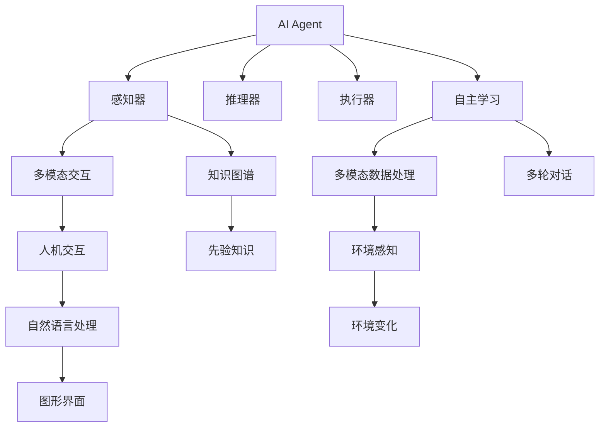

                 

# AI Agent: AI的下一个风口 Camel.AI：引领自主与交流智能体的未来

## 1. 背景介绍

### 1.1 问题由来

随着人工智能技术的飞速发展，AI Agent（AI代理人）正逐渐成为当前AI领域的前沿研究方向。AI Agent是指能够自主感知环境、学习和推理，并能够与环境进行交互的智能体。近年来，AI Agent在自动驾驶、机器人、智能推荐系统、智能客服等领域得到了广泛应用，极大地提高了系统的智能性和效率。

然而，现有的AI Agent仍然存在诸多局限性。例如，当前AI Agent往往依赖于结构化的输入，难以处理非结构化数据；自主学习能力有限，需要大量手工标注数据进行训练；交互能力不足，缺乏对用户意图的深度理解等。这些问题使得AI Agent在实际应用中面临诸多挑战，亟需突破现有瓶颈。

### 1.2 问题核心关键点

解决上述问题的关键在于如何构建更加智能、自主、高效的AI Agent。本文将重点探讨AI Agent的核心算法原理，详细介绍AI Agent的开发流程和案例分析，并对AI Agent的实际应用场景、未来趋势和挑战进行展望。

## 2. 核心概念与联系

### 2.1 核心概念概述

为更好地理解AI Agent的原理和架构，本节将介绍几个密切相关的核心概念：

- **AI Agent**：能够自主感知环境、学习和推理，并能够与环境进行交互的智能体。AI Agent通常由感知器、推理器和执行器三部分组成。
- **自主学习**：AI Agent能够通过与环境互动，自主学习环境中的规律和知识，并根据当前状态做出最优决策。
- **多模态交互**：AI Agent能够处理多种模态数据，包括文本、图像、语音等，从而实现更全面和深入的环境感知。
- **人机交互**：AI Agent能够通过自然语言或图形界面等形式，与用户进行实时互动，提供智能服务。
- **知识图谱**：AI Agent可以结合外部知识图谱，获取丰富的先验知识，提升决策的准确性和鲁棒性。

这些核心概念之间的逻辑关系可以通过以下Mermaid流程图来展示：



这个流程图展示出AI Agent的核心组件及其之间的关系：

1. AI Agent通过感知器感知环境信息，并通过推理器进行决策。
2. 感知器能够处理多种模态数据，如文本、图像、语音等。
3. 推理器通过自主学习，利用多模态数据进行推理，形成知识图谱。
4. 执行器根据推理结果，采取相应行动。
5. 人机交互界面实现用户与AI Agent的实时互动。

## 3. 核心算法原理 & 具体操作步骤
### 3.1 算法原理概述

AI Agent的开发和优化主要围绕自主学习、多模态交互、人机交互等核心算法展开。

- **自主学习**：AI Agent通过与环境的交互，自主学习环境中的规律和知识，从而能够自主做出决策。
- **多模态交互**：AI Agent能够处理多种模态数据，并通过融合不同模态信息提升环境感知能力。
- **人机交互**：AI Agent通过自然语言处理或图形界面，与用户进行实时互动，提供智能服务。

### 3.2 算法步骤详解

**Step 1: 数据收集与预处理**

- 收集AI Agent所处环境的数据，包括文本、图像、音频等多种模态数据。
- 对数据进行清洗和预处理，去除噪声和无用信息，形成结构化的训练数据集。

**Step 2: 特征提取与表示**

- 将收集到的数据通过特征提取算法进行转换，形成模型能够理解的特征向量。
- 使用Transformer等模型进行特征表示，将多种模态数据转化为高维向量，以便于后续处理。

**Step 3: 模型训练与优化**

- 使用深度学习模型，如循环神经网络、卷积神经网络、Transformer等，对特征向量进行训练，形成AI Agent的决策模型。
- 通过自主学习算法，如强化学习、自监督学习等，对AI Agent进行优化，提升其决策能力。

**Step 4: 人机交互与多轮对话**

- 设计自然语言处理模块，实现用户与AI Agent的实时互动。
- 使用多轮对话算法，如序列到序列模型、Transformer等，实现多轮对话功能。

**Step 5: 模型部署与持续学习**

- 将训练好的AI Agent模型部署到生产环境中，实现实时服务。
- 通过持续学习算法，如增量学习、在线学习等，让AI Agent在运行过程中不断学习新知识，提升模型性能。

### 3.3 算法优缺点

AI Agent具有以下优点：

1. 自主性强：AI Agent能够自主感知环境，并通过自主学习算法不断优化决策能力。
2. 多模态处理：AI Agent能够处理多种模态数据，提升环境感知能力。
3. 实时交互：AI Agent能够与用户进行实时互动，提供智能服务。

同时，AI Agent也存在一定的局限性：

1. 数据依赖性高：AI Agent的性能高度依赖于训练数据的质量和数量。
2. 交互复杂度高：多模态交互和自然语言处理增加了AI Agent的复杂度。
3. 可解释性不足：AI Agent的决策过程通常缺乏可解释性，难以对其推理逻辑进行分析和调试。

尽管存在这些局限性，但就目前而言，AI Agent仍是大规模智能系统的核心技术。未来相关研究的重点在于如何进一步降低数据依赖，提高模型的可解释性，并拓展AI Agent在更广泛的应用场景中的表现。

### 3.4 算法应用领域

AI Agent的应用领域非常广泛，包括但不限于以下几个方面：

- 智能推荐系统：通过多模态数据和自主学习算法，提升推荐系统的智能性和个性化程度。
- 智能客服：通过自然语言处理和人机交互模块，实现实时智能客服，提升用户体验。
- 自动驾驶：通过多模态感知和自主学习算法，实现环境感知和决策，提升驾驶安全性。
- 机器人控制：通过多轮对话和自主学习算法，实现机器人与环境的互动，提升任务完成效率。
- 医疗诊断：通过多模态数据和自主学习算法，提升医疗诊断的准确性和鲁棒性。
- 智能安防：通过多模态感知和人机交互模块，提升安防系统的智能性，实现实时监控和预警。

以上这些领域仅仅是AI Agent的一部分应用场景，未来AI Agent还将有更广阔的应用前景。随着技术的不断进步，AI Agent将在更多的场景中发挥重要作用。

## 4. 数学模型和公式 & 详细讲解 & 举例说明

### 4.1 数学模型构建

假设AI Agent在环境 $E$ 中，其状态为 $s$，行为为 $a$，环境奖励为 $r$，且当前状态 $s_t$ 到下一个状态 $s_{t+1}$ 的转移概率为 $p(s_{t+1}|s_t,a)$。

AI Agent的自主学习目标是通过与环境互动，最大化累积奖励 $R = \sum_{t=0}^{\infty} \gamma^t r_{t+1}$，其中 $\gamma$ 为折扣因子。

### 4.2 公式推导过程

根据上述目标，AI Agent的自主学习可以采用Q-Learning算法，具体推导如下：

1. 定义Q函数，表示在状态 $s_t$ 下，采取行为 $a$ 的期望奖励：
$$ Q(s_t,a) = \mathbb{E}[\sum_{t=0}^{\infty} \gamma^t r_{t+1}|s_t,a] $$

2. Q-Learning的更新公式为：
$$ Q(s_t,a) \leftarrow Q(s_t,a) + \alpha [r + \gamma \max_{a'} Q(s_{t+1},a')] $$

其中 $\alpha$ 为学习率，$a'$ 为在状态 $s_{t+1}$ 下可能的动作。

3. 通过Q函数，计算在当前状态 $s_t$ 下采取最优行为 $a^*$ 的期望奖励：
$$ Q^*(s_t) = \max_a Q(s_t,a) $$

4. 根据Q函数，计算AI Agent在状态 $s_t$ 下的最优行为：
$$ a^* = \mathop{\arg\max}_{a} Q(s_t,a) $$

5. 通过多轮交互，AI Agent能够逐步优化其决策能力，提升自主学习能力。

### 4.3 案例分析与讲解

假设AI Agent在智能推荐系统中，需要根据用户的历史行为数据和当前兴趣，推荐符合用户偏好的商品。AI Agent可以通过以下步骤进行优化：

1. 收集用户的历史行为数据和兴趣标签。
2. 将数据转换为特征向量，并进行归一化处理。
3. 使用Transformer等模型，对特征向量进行训练，形成Q函数。
4. 在多轮对话中，获取用户的实时兴趣反馈，更新Q函数。
5. 根据Q函数，计算推荐商品的期望奖励，选择最优商品进行推荐。

通过以上步骤，AI Agent能够逐步提升推荐系统的智能性和个性化程度，为用户提供更优质的推荐服务。

## 5. 项目实践：代码实例和详细解释说明

### 5.1 开发环境搭建

在进行AI Agent的开发实践前，我们需要准备好开发环境。以下是使用Python进行TensorFlow开发的环境配置流程：

1. 安装Anaconda：从官网下载并安装Anaconda，用于创建独立的Python环境。

2. 创建并激活虚拟环境：
```bash
conda create -n ai-agent-env python=3.8 
conda activate ai-agent-env
```

3. 安装TensorFlow：根据CUDA版本，从官网获取对应的安装命令。例如：
```bash
conda install tensorflow -c tensorflow -c conda-forge
```

4. 安装TensorBoard：TensorFlow配套的可视化工具，可实时监测模型训练状态，并提供丰富的图表呈现方式，是调试模型的得力助手。
```bash
pip install tensorboard
```

5. 安装PyTorch：基于Python的开源深度学习框架，适合快速迭代研究。
```bash
pip install torch torchvision torchaudio
```

完成上述步骤后，即可在`ai-agent-env`环境中开始AI Agent的开发实践。

### 5.2 源代码详细实现

以下是一个简单的AI Agent模型实现的代码示例，用于推荐系统的多轮对话和决策过程。

```python
import tensorflow as tf
from tensorflow.keras.layers import Input, Dense, Dropout, Embedding
from tensorflow.keras.models import Model
from tensorflow.keras.optimizers import Adam

# 定义模型输入和输出
user_input = Input(shape=(64,), name='user_input')
item_input = Input(shape=(64,), name='item_input')

# 定义多层感知器模型
fc1 = Dense(128, activation='relu')(user_input)
fc2 = Dense(64, activation='relu')(fc1)
fc3 = Dense(32, activation='relu')(fc2)

fc4 = Dense(128, activation='relu')(item_input)
fc5 = Dense(64, activation='relu')(fc4)
fc6 = Dense(32, activation='relu')(fc5)

# 连接用户和物品特征向量
concat = tf.keras.layers.concatenate([fc3, fc6])

# 输出Q函数
q_value = Dense(1, name='q_value')(concat)

# 定义模型
model = Model(inputs=[user_input, item_input], outputs=q_value)

# 编译模型
model.compile(optimizer=Adam(learning_rate=0.01), loss='mse')

# 训练模型
model.fit(x=[train_user, train_item], y=train_q_value, epochs=100, batch_size=32, validation_split=0.2)

# 预测推荐结果
recommendation = model.predict([test_user, test_item])[0][0]
```

以上代码实现了一个简单的AI Agent推荐模型，通过多层感知器将用户和物品特征向量连接，输出Q函数，并进行训练和预测。实际应用中，还需要设计多轮对话模块，实现用户与AI Agent的实时互动。

### 5.3 代码解读与分析

让我们再详细解读一下关键代码的实现细节：

**输入层**：
- `user_input`：用户的历史行为特征向量。
- `item_input`：物品的特征向量。

**多层感知器层**：
- 定义了三个全连接层，通过ReLU激活函数增强特征表示能力。
- 通过连接用户和物品特征向量，形成Q函数输入。

**输出层**：
- `q_value`：Q函数输出，表示用户对物品的期望奖励。

**模型编译**：
- 使用Adam优化器，设置学习率为0.01，损失函数为均方误差。

**模型训练**：
- 在训练集上进行模型训练，设置训练轮数为100，批次大小为32，验证集占总数据集的20%。

**模型预测**：
- 在测试集上进行模型预测，得到推荐结果。

可以看出，以上代码实现了一个简单的Q-Learning算法，通过多层感知器对用户和物品特征向量进行建模，并在多轮对话中不断优化Q函数，实现智能推荐。实际应用中，还需要根据具体任务进行优化设计。

## 6. 实际应用场景

### 6.1 智能推荐系统

AI Agent在智能推荐系统中有着广泛的应用前景。推荐系统通过多模态数据和自主学习算法，能够实时感知用户兴趣和行为，推荐符合用户偏好的商品或内容。

在实际应用中，AI Agent可以通过以下步骤实现推荐功能：

1. 收集用户的历史行为数据和兴趣标签。
2. 将数据转换为特征向量，并进行归一化处理。
3. 使用多层感知器模型，对特征向量进行训练，形成Q函数。
4. 在多轮对话中，获取用户的实时兴趣反馈，更新Q函数。
5. 根据Q函数，计算推荐商品的期望奖励，选择最优商品进行推荐。

通过以上步骤，AI Agent能够逐步提升推荐系统的智能性和个性化程度，为用户提供更优质的推荐服务。

### 6.2 智能客服

AI Agent在智能客服中也有着广泛的应用前景。智能客服通过自然语言处理和人机交互模块，能够实时回答用户问题，提升客服效率和用户体验。

在实际应用中，AI Agent可以通过以下步骤实现智能客服功能：

1. 收集历史客服对话记录和常见问题标签。
2. 将数据转换为特征向量，并进行归一化处理。
3. 使用Transformer等模型，对特征向量进行训练，形成Q函数。
4. 在多轮对话中，获取用户的实时问题反馈，更新Q函数。
5. 根据Q函数，计算最佳回答的期望奖励，选择最优回答进行回复。

通过以上步骤，AI Agent能够逐步提升客服系统的智能性和交互能力，为用户提供更优质的客服服务。

### 6.3 自动驾驶

AI Agent在自动驾驶中也有着广泛的应用前景。自动驾驶系统通过多模态感知和自主学习算法，能够实时感知环境和路况，做出最优驾驶决策。

在实际应用中，AI Agent可以通过以下步骤实现自动驾驶功能：

1. 收集传感器数据和路况信息。
2. 将数据转换为特征向量，并进行归一化处理。
3. 使用深度学习模型，对特征向量进行训练，形成Q函数。
4. 在多轮对话中，获取实时环境和路况反馈，更新Q函数。
5. 根据Q函数，计算最优驾驶行为的期望奖励，选择最优行为进行执行。

通过以上步骤，AI Agent能够逐步提升自动驾驶系统的智能性和安全性，实现环境感知和决策。

## 7. 工具和资源推荐

### 7.1 学习资源推荐

为了帮助开发者系统掌握AI Agent的理论基础和实践技巧，这里推荐一些优质的学习资源：

1. 《深度学习》课程：斯坦福大学开设的深度学习经典课程，涵盖了深度学习的基本概念和算法。
2. 《TensorFlow实战》书籍：TensorFlow官方文档，提供了丰富的实践样例，适合初学者学习。
3. 《自然语言处理》课程：北京大学开设的自然语言处理课程，涵盖了NLP的基本概念和算法。
4. 《强化学习》书籍：经典的强化学习教材，介绍了强化学习的基本概念和算法。
5. 《Python深度学习》书籍：适合初学者的深度学习入门书籍，涵盖深度学习的基本概念和算法。

通过对这些资源的学习实践，相信你一定能够快速掌握AI Agent的精髓，并用于解决实际的NLP问题。

### 7.2 开发工具推荐

高效的开发离不开优秀的工具支持。以下是几款用于AI Agent开发的常用工具：

1. TensorFlow：基于Python的开源深度学习框架，适合快速迭代研究。
2. PyTorch：基于Python的开源深度学习框架，灵活性和动态计算图是其优点。
3. TensorBoard：TensorFlow配套的可视化工具，可实时监测模型训练状态，并提供丰富的图表呈现方式。
4. Scikit-learn：Python中的机器学习库，提供了丰富的模型和算法。
5. Keras：高层次的深度学习框架，易于使用和调试。

合理利用这些工具，可以显著提升AI Agent的开发效率，加快创新迭代的步伐。

### 7.3 相关论文推荐

AI Agent的发展源于学界的持续研究。以下是几篇奠基性的相关论文，推荐阅读：

1. AlphaGo：DeepMind开发的围棋AI，展示了强化学习在复杂决策问题中的巨大潜力。
2. GPT-3：OpenAI开发的语言模型，展示了大模型在自然语言处理中的巨大能力。
3. BERT：Google开发的预训练语言模型，展示了预训练大模型在NLP任务中的巨大潜力。
4. Multi-Agent System：多智能体系统，介绍了多智能体间的协作和通信，为AI Agent提供理论支持。
5. Deep Reinforcement Learning：深度强化学习，介绍了深度学习和强化学习的结合，为AI Agent提供算法支持。

这些论文代表了大模型和AI Agent的发展脉络。通过学习这些前沿成果，可以帮助研究者把握学科前进方向，激发更多的创新灵感。

## 8. 总结：未来发展趋势与挑战

### 8.1 总结

本文对AI Agent的核心算法原理进行了全面系统的介绍。首先阐述了AI Agent的研究背景和意义，明确了AI Agent在智能推荐、智能客服、自动驾驶等领域的重要作用。其次，从原理到实践，详细讲解了AI Agent的数学模型和算法步骤，给出了AI Agent的开发流程和案例分析。同时，本文还广泛探讨了AI Agent的实际应用场景、未来趋势和挑战，展示了AI Agent的巨大潜力。

通过本文的系统梳理，可以看到，AI Agent在智能系统的开发和优化中扮演了核心角色。AI Agent能够处理多种模态数据，实现多轮对话和自主学习，提升系统的智能性和交互能力，为NLP技术的落地应用提供了重要工具。未来，伴随技术的不断进步，AI Agent必将在更多领域发挥重要作用。

### 8.2 未来发展趋势

展望未来，AI Agent的发展趋势主要包括以下几个方面：

1. 多模态数据融合：AI Agent能够处理多种模态数据，提升环境感知能力，增强决策鲁棒性。
2. 自监督学习：AI Agent能够利用无标签数据进行自主学习，减少对标注数据的依赖。
3. 多智能体协同：AI Agent能够实现多智能体间的协作和通信，提升整体系统的智能性。
4. 可解释性增强：AI Agent能够提供决策的解释和依据，提升系统的可解释性和可信度。
5. 自适应学习：AI Agent能够根据环境变化进行自适应学习，提升系统的灵活性和适应性。
6. 伦理与安全：AI Agent能够考虑伦理和安全因素，避免有害行为和偏见。

以上趋势凸显了AI Agent的广阔前景。这些方向的探索发展，必将进一步提升AI Agent的性能和应用范围，为人类认知智能的进化带来深远影响。

### 8.3 面临的挑战

尽管AI Agent已经取得了显著进展，但在迈向更加智能化、普适化应用的过程中，它仍面临诸多挑战：

1. 数据依赖性高：AI Agent的性能高度依赖于训练数据的质量和数量。
2. 交互复杂度高：多模态交互和自然语言处理增加了AI Agent的复杂度。
3. 可解释性不足：AI Agent的决策过程通常缺乏可解释性，难以对其推理逻辑进行分析和调试。
4. 安全性有待保障：AI Agent可能学习到有害信息，导致有害输出。
5. 伦理道德约束：AI Agent的行为需要符合伦理道德，避免有害偏见。

尽管存在这些挑战，但AI Agent的研究仍处于快速发展阶段，未来有望克服现有瓶颈，实现更加智能化和普适化的应用。

### 8.4 研究展望

面向未来，AI Agent的研究方向将主要集中在以下几个方面：

1. 多模态数据融合：如何处理多种模态数据，提升环境感知能力和决策鲁棒性，仍是需要深入研究的问题。
2. 自监督学习：如何在无标签数据上进行自主学习，减少对标注数据的依赖，是未来研究的重要方向。
3. 多智能体协同：如何实现多智能体间的协作和通信，提升整体系统的智能性，是未来的研究方向。
4. 可解释性增强：如何增强AI Agent的可解释性，提升系统的可信度和可控性，仍是需要研究的问题。
5. 自适应学习：如何实现AI Agent的自适应学习，提升系统的灵活性和适应性，是未来的研究方向。
6. 伦理与安全：如何考虑伦理和安全因素，避免有害行为和偏见，是未来的研究方向。

这些研究方向将进一步推动AI Agent技术的发展，为人工智能技术的落地应用提供重要工具。只有勇于创新、敢于突破，才能不断拓展AI Agent的边界，实现更加智能化和普适化的应用。

