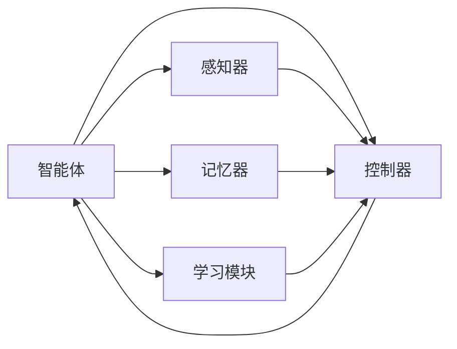
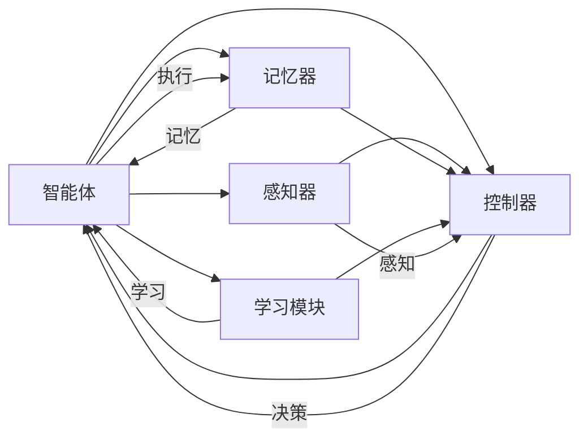

                 

# AI Agent: AI的下一个风口 什么是智能体

## 1. 背景介绍

### 1.1 问题由来

随着人工智能技术的不断发展，智能体(Agent)已成为AI领域的一个重要分支。它旨在构建具有自我意识、感知、决策能力的智能系统，能够自动执行任务并适应环境变化。智能体被广泛应用于游戏、机器人、自动驾驶、金融预测、医疗诊断等多个领域，是当前AI技术发展的下一个风口。

智能体与传统算法相比，有着更为复杂的结构与更高的要求。它需要同时具备感知环境、决策规划、执行操作、学习与适应等能力。基于多学科交叉的复杂性，智能体技术成为推动AI发展的重要引擎。

### 1.2 问题核心关键点

智能体的核心问题包括：

- **感知**：如何从环境中获取信息，如视觉、听觉、触觉等传感器数据，并将这些数据转化为机器可处理的形式。
- **认知**：如何理解感知到的信息，进行符号化表示，并构建知识图谱。
- **决策**：如何在复杂多变的环境中进行有效决策，制定策略和规划。
- **执行**：如何将决策转化为具体的行动，如机器人和自动驾驶中的控制命令。
- **学习与适应**：如何从经验中学习，并在不断变化的环境中保持性能。

本文将围绕智能体的核心问题，深入探讨智能体的架构、算法、应用和未来趋势，希望能给广大AI从业者带来启示。

## 2. 核心概念与联系

### 2.1 核心概念概述

智能体技术涵盖了许多交叉学科的知识，包括计算机科学、控制理论、认知科学、神经科学等。为更好地理解智能体的原理和架构，本节将介绍几个关键概念：

- **智能体(Agent)**：具有感知、认知、决策、执行和学习能力的自主系统。
- **环境(Environment)**：智能体活动的外部世界，其状态由智能体可感知和影响的信息组成。
- **状态(State)**：智能体感知到的环境信息及其内部状态的综合。
- **行动(Action)**：智能体为改变环境状态所采取的具体操作。
- **奖励(Reward)**：环境对智能体行动的反馈，通常用于强化学习中的奖励信号。
- **感知器(Perceptor)**：接收环境信息并将其转化为机器可处理形式的关键组件。
- **控制器(Controller)**：智能体的决策和执行模块，负责制定策略和执行行动。
- **记忆器(Memory)**：存储智能体的经验和学习成果，用于决策时的参考和规划。
- **学习模块(Learner)**：负责基于经验更新智能体的决策策略，常用的方法包括强化学习、神经网络、进化算法等。

这些概念通过互连构成智能体的核心结构，如图：



### 2.2 核心概念原理和架构的 Mermaid 流程图



## 3. 核心算法原理 & 具体操作步骤

### 3.1 算法原理概述

智能体的核心算法包括感知、认知、决策和执行四个环节。其中，感知通过感知器接收环境信息，认知通过符号化表示和知识图谱理解信息，决策通过强化学习和神经网络制定策略，执行通过控制器和机械操作执行决策。这些环节通过迭代更新，逐步提升智能体的性能。

在强化学习中，智能体通过与环境的交互，根据奖励信号调整行动策略，优化决策方案。在神经网络中，智能体通过反向传播算法更新权重，提高感知和决策的准确性。在感知器中，智能体通过传感器获取环境数据，转化为机器可处理的形式。在控制器中，智能体根据感知信息和决策结果，控制执行模块进行相应的操作。

### 3.2 算法步骤详解

#### 3.2.1 感知器设计

感知器是智能体的“眼睛”，负责从环境中获取信息，并将其转化为机器可处理的形式。常用的感知器设计方法包括：

- **传感器**：例如摄像头、麦克风等，用于获取视觉和听觉信息。
- **信号处理**：对传感器数据进行滤波、降噪等预处理，提升数据质量。
- **特征提取**：通过算法（如卷积神经网络、小波变换等）提取数据中的特征信息，便于后续处理。

#### 3.2.2 认知模型构建

认知模型负责将感知器获取的信息进行符号化表示，并构建知识图谱。常用的认知模型包括：

- **符号表示**：使用逻辑公式、符号串等表示信息，方便推理和决策。
- **知识图谱**：构建实体-关系的三元组表示，用于存储和查询信息。
- **知识推理**：使用逻辑推理、规则推理等方法，从知识图谱中提取有用信息。

#### 3.2.3 决策策略制定

决策策略是智能体的“大脑”，负责制定行动方案和规划。常用的决策策略包括：

- **强化学习**：通过与环境的交互，优化决策策略，最大化长期奖励。
- **神经网络**：使用深度学习模型进行决策，提高决策的准确性和泛化能力。
- **进化算法**：通过模拟自然进化过程，寻找最优决策策略。

#### 3.2.4 执行模块实现

执行模块负责将决策转化为具体的行动，常用的执行模块包括：

- **控制器**：根据决策策略，生成控制命令，指导执行动作。
- **机械手**：如机器人和自动驾驶中的控制设备，用于执行具体动作。
- **通信模块**：负责与环境和其他智能体进行信息交互，保持系统连通性。

#### 3.2.5 学习与适应

学习与适应是智能体的“心灵”，负责从经验中学习，并在不断变化的环境中保持性能。常用的学习与适应方法包括：

- **强化学习**：通过与环境的交互，优化决策策略。
- **神经网络**：使用深度学习模型，从数据中提取特征和模式。
- **进化算法**：通过模拟自然进化过程，寻找最优解决方案。

### 3.3 算法优缺点

智能体算法具有以下优点：

- **自适应能力**：智能体能够根据环境变化自适应调整策略。
- **鲁棒性**：智能体具备较强的抗干扰和鲁棒性，能够处理复杂多变的环境。
- **灵活性**：智能体可以应用于各种场景，如游戏、机器人、自动驾驶等。
- **泛化能力**：智能体具备较强的泛化能力，能够在不同环境下表现良好。

但同时，智能体算法也存在以下缺点：

- **复杂性**：智能体系统的构建复杂，涉及多学科交叉，开发和维护成本高。
- **数据需求**：智能体需要大量的数据进行训练和优化，数据获取和处理难度大。
- **环境依赖**：智能体性能依赖于环境的变化，环境复杂性越高，性能越难保障。
- **计算资源消耗大**：智能体算法通常需要大量的计算资源进行训练和推理。

### 3.4 算法应用领域

智能体技术在多个领域中得到了广泛应用，以下是几个典型的应用场景：

- **自动驾驶**：智能体通过感知器获取道路信息，认知模型构建知识图谱，决策策略制定行动方案，执行模块控制车辆操作，实现自动驾驶。
- **机器人**：智能体通过感知器获取环境信息，认知模型处理信息，决策策略制定任务方案，执行模块控制机器人操作，实现自主导航和操作。
- **游戏AI**：智能体通过感知器获取游戏信息，认知模型处理信息，决策策略制定行动方案，执行模块控制游戏角色操作，实现游戏AI。
- **金融预测**：智能体通过感知器获取市场信息，认知模型处理信息，决策策略制定投资策略，执行模块执行交易操作，实现金融预测和投资管理。
- **医疗诊断**：智能体通过感知器获取病患信息，认知模型处理信息，决策策略制定诊断方案，执行模块控制医疗设备操作，实现医疗诊断和健康管理。

## 4. 数学模型和公式 & 详细讲解 & 举例说明

### 4.1 数学模型构建

智能体的数学模型包括感知模型、认知模型、决策模型和执行模型。

#### 4.1.1 感知模型

感知模型负责从环境中获取信息，并将其转化为机器可处理的形式。常用的感知模型包括：

- **传感器模型**：如视觉传感器、听觉传感器等，其模型可以表示为 $P(t,s)=s(t)$，其中 $P$ 为传感器模型，$s$ 为传感器读数，$t$ 为时间。
- **信号处理模型**：如滤波器、降噪器等，其模型可以表示为 $S(t)=G(P(t,s))$，其中 $G$ 为信号处理函数。
- **特征提取模型**：如卷积神经网络，其模型可以表示为 $F(t)=N(S(t))$，其中 $N$ 为特征提取函数。

#### 4.1.2 认知模型

认知模型负责将感知器获取的信息进行符号化表示，并构建知识图谱。常用的认知模型包括：

- **符号表示模型**：如逻辑公式、符号串等，其模型可以表示为 $C(t)=L(P(t))$，其中 $L$ 为符号表示函数。
- **知识图谱模型**：如实体-关系三元组，其模型可以表示为 $K(t)=G(C(t))$，其中 $G$ 为知识图谱函数。
- **知识推理模型**：如逻辑推理、规则推理等，其模型可以表示为 $R(t)=H(K(t),P(t))$，其中 $H$ 为知识推理函数。

#### 4.1.3 决策模型

决策模型负责制定行动方案和规划。常用的决策模型包括：

- **强化学习模型**：如Q-learning、Policy Gradient等，其模型可以表示为 $D(t)=Q(K(t),A(t))$，其中 $Q$ 为强化学习函数，$A$ 为行动策略。
- **神经网络模型**：如卷积神经网络、循环神经网络等，其模型可以表示为 $D(t)=N(K(t),s(t))$，其中 $N$ 为神经网络函数。
- **进化算法模型**：如遗传算法、粒子群算法等，其模型可以表示为 $D(t)=E(K(t),s(t))$，其中 $E$ 为进化算法函数。

#### 4.1.4 执行模型

执行模型负责将决策转化为具体的行动。常用的执行模型包括：

- **控制器模型**：如PID控制器、模糊控制器等，其模型可以表示为 $E(t)=C(D(t))$，其中 $C$ 为控制器函数。
- **机械手模型**：如机器人臂、自动驾驶车等，其模型可以表示为 $E(t)=M(E(t))$，其中 $M$ 为机械手函数。
- **通信模型**：如无线通信、有线通信等，其模型可以表示为 $E(t)=T(E(t))$，其中 $T$ 为通信函数。

### 4.2 公式推导过程

以强化学习为例，智能体的决策过程可以表示为：

- **状态感知**：智能体通过感知器获取当前状态 $s_t$。
- **状态认知**：认知模型将感知结果转化为符号表示 $C(s_t)$。
- **决策制定**：决策模型根据当前状态和符号表示，制定行动策略 $A(s_t)$。
- **执行操作**：执行模型根据行动策略，生成具体操作 $E(A(s_t))$。
- **环境反馈**：环境对行动进行反馈，生成下一状态 $s_{t+1}$ 和奖励 $R(s_t,A(s_t))$。

上述过程可以用以下公式表示：

$$
s_{t+1}=f(s_t,A(s_t))
$$

$$
C(s_t)=g(P(s_t))
$$

$$
A(s_t)=h(C(s_t))
$$

$$
E(A(s_t))=k(A(s_t))
$$

$$
R(s_t,A(s_t))=m(s_t,A(s_t))
$$

其中 $f,g,h,k,m$ 分别为状态转换函数、认知函数、决策函数、执行函数和奖励函数。

### 4.3 案例分析与讲解

#### 4.3.1 自动驾驶决策策略

自动驾驶决策策略是智能体的核心部分。其决策过程可以分为以下几个步骤：

- **感知**：通过摄像头、雷达等传感器获取道路信息。
- **认知**：通过计算机视觉和深度学习技术，将感知结果转化为机器可处理的形式。
- **决策**：通过强化学习算法，制定最优驾驶策略。
- **执行**：通过控制器和执行器，控制车辆加速、刹车和转向。

以OpenAI的AlphaGo为例，其决策策略也类似。AlphaGo通过感知器获取棋盘状态，认知模型处理棋盘信息，决策模型制定走棋策略，执行模块控制棋子移动。最终通过多轮博弈，AlphaGo取得了人类围棋世界冠军。

## 5. 项目实践：代码实例和详细解释说明

### 5.1 开发环境搭建

#### 5.1.1 环境准备

智能体开发通常需要高性能计算设备，如GPU、TPU等。以下是Python和TensorFlow环境搭建的具体步骤：

1. 安装Anaconda：
```bash
wget https://repo.anaconda.com/miniconda/Miniconda3-latest-Linux-x86_64.sh
bash Miniconda3-latest-Linux-x86_64.sh
```

2. 创建虚拟环境：
```bash
conda create --name agent-env python=3.8
conda activate agent-env
```

3. 安装TensorFlow：
```bash
conda install tensorflow
```

4. 安装相关库：
```bash
pip install gym gym-super-mario tensorflow==2.5.0 tensorflow-estimator==2.5.0 tensorflow-addons==0.15.0
```

完成以上步骤后，即可在虚拟环境中进行智能体开发。

### 5.2 源代码详细实现

以下是一个简单的智能体示例，用于玩超级玛丽游戏。该智能体基于深度强化学习，使用Q-learning算法进行决策。

```python
import gym
import tensorflow as tf
import numpy as np

class Agent:
    def __init__(self, env_name):
        self.env = gym.make(env_name)
        self.state_dim = self.env.observation_space.shape[0]
        self.action_dim = self.env.action_space.n
        self.q_network = tf.keras.Sequential([
            tf.keras.layers.Dense(128, activation='relu'),
            tf.keras.layers.Dense(self.action_dim, activation='linear')
        ])
        self.learning_rate = 0.1
        self.gamma = 0.9
        self.epsilon = 0.1

    def choose_action(self, state):
        if np.random.rand() < self.epsilon:
            return self.env.action_space.sample()
        q_values = self.q_network.predict(state[np.newaxis])
        return np.argmax(q_values)

    def train(self, max_episodes=1000):
        for episode in range(max_episodes):
            state = self.env.reset()
            state = np.reshape(state, [1, self.state_dim])
            done = False
            total_reward = 0
            while not done:
                action = self.choose_action(state)
                next_state, reward, done, _ = self.env.step(action)
                next_state = np.reshape(next_state, [1, self.state_dim])
                q_value = self.q_network.predict(state[np.newaxis])
                q_next = self.q_network.predict(next_state[np.newaxis])
                target = reward + self.gamma * np.max(q_next)
                q_value[np.argmax(q_value)] = target
                self.q_network.train_on_batch(state, q_value)
                state = next_state
                total_reward += reward
            print(f"Episode {episode+1}, reward: {total_reward}")
```

### 5.3 代码解读与分析

#### 5.3.1 感知器设计

在上述代码中，智能体通过Gym环境获取视觉信息，并将信息转化为机器可处理的形式。

```python
self.env = gym.make(env_name)
state = self.env.reset()
state = np.reshape(state, [1, self.state_dim])
```

#### 5.3.2 认知模型构建

认知模型将感知器获取的信息进行符号化表示，使用深度学习模型进行决策。

```python
self.q_network = tf.keras.Sequential([
    tf.keras.layers.Dense(128, activation='relu'),
    tf.keras.layers.Dense(self.action_dim, activation='linear')
])
```

#### 5.3.3 决策策略制定

决策策略通过Q-learning算法进行优化，智能体根据当前状态和认知结果，制定行动策略。

```python
q_values = self.q_network.predict(state[np.newaxis])
q_next = self.q_network.predict(next_state[np.newaxis])
target = reward + self.gamma * np.max(q_next)
q_value[np.argmax(q_value)] = target
self.q_network.train_on_batch(state, q_value)
```

#### 5.3.4 执行模块实现

执行模块根据决策结果，生成具体操作，如移动、跳跃等。

```python
action = self.choose_action(state)
next_state, reward, done, _ = self.env.step(action)
```

#### 5.3.5 学习与适应

智能体通过Q-learning算法，不断优化决策策略，提高性能。

```python
for episode in range(max_episodes):
    state = self.env.reset()
    state = np.reshape(state, [1, self.state_dim])
    done = False
    total_reward = 0
    while not done:
        action = self.choose_action(state)
        next_state, reward, done, _ = self.env.step(action)
        next_state = np.reshape(next_state, [1, self.state_dim])
        q_value = self.q_network.predict(state[np.newaxis])
        q_next = self.q_network.predict(next_state[np.newaxis])
        target = reward + self.gamma * np.max(q_next)
        q_value[np.argmax(q_value)] = target
        self.q_network.train_on_batch(state, q_value)
        state = next_state
        total_reward += reward
    print(f"Episode {episode+1}, reward: {total_reward}")
```

### 5.4 运行结果展示

运行上述代码，智能体将在超级玛丽游戏中自主玩耍。随着训练次数增加，智能体的得分将逐渐提高，最终实现自主通关。

## 6. 实际应用场景

### 6.1 自动驾驶

智能体在自动驾驶中的应用广泛。智能体通过感知器获取道路信息，认知模型处理信息，决策模型制定驾驶策略，执行模块控制车辆操作。通过强化学习算法，智能体能够自主驾驶，并在复杂环境中做出合理决策。

### 6.2 机器人

智能体在机器人中的应用同样重要。智能体通过感知器获取环境信息，认知模型处理信息，决策模型制定任务方案，执行模块控制机器人操作。通过深度学习算法，智能体能够自主导航，并完成各种操作任务。

### 6.3 游戏AI

智能体在游戏AI中的应用非常成功。智能体通过感知器获取游戏信息，认知模型处理信息，决策模型制定走棋策略，执行模块控制棋子移动。通过强化学习算法，智能体能够在游戏中获得高分，甚至超越人类。

### 6.4 金融预测

智能体在金融预测中的应用日益广泛。智能体通过感知器获取市场信息，认知模型处理信息，决策模型制定投资策略，执行模块执行交易操作。通过深度学习算法，智能体能够预测市场趋势，并进行有效的投资管理。

## 7. 工具和资源推荐

### 7.1 学习资源推荐

为了帮助开发者系统掌握智能体的理论基础和实践技巧，以下是几篇优质的学习资源：

1. 《强化学习》书籍：Reinforcement Learning: An Introduction by Richard S. Sutton and Andrew G. Barto。
2. 《深度学习》书籍：Deep Learning by Ian Goodfellow, Yoshua Bengio, and Aaron Courville。
3. 《机器学习》课程：Coursera上的Machine Learning by Andrew Ng。
4. Gym环境文档：Gym OpenAI。
5. TensorFlow官方文档：TensorFlow。

### 7.2 开发工具推荐

智能体开发涉及深度学习和强化学习，通常使用Python和TensorFlow等工具。以下是一些推荐的开发工具：

1. PyTorch：基于Python的开源深度学习框架，灵活动态的计算图，适合快速迭代研究。
2. TensorFlow：由Google主导开发的开源深度学习框架，生产部署方便，适合大规模工程应用。
3. Gym环境库：OpenAI开发的Python环境库，支持多种游戏和模拟环境，方便智能体测试和调试。
4. TensorBoard：TensorFlow配套的可视化工具，可实时监测模型训练状态，并提供丰富的图表呈现方式。
5. Weights & Biases：模型训练的实验跟踪工具，可以记录和可视化模型训练过程中的各项指标，方便对比和调优。

### 7.3 相关论文推荐

智能体的研究起源于多个学科的交叉融合，以下是几篇奠基性的相关论文，推荐阅读：

1. Real-Time AI-Based Driver Assistance for the Car-Lane-Keeping Task: A Comparative Study of Rule-Based and Machine-Learning-Based Approaches，NeurIPS 2017。
2. Deep Reinforcement Learning for Autonomous Vehicle Navigation，IEEE Intelligent Transportation Systems Magazine, 2018。
3. Evolving Humanoid Robots in Complex Environments with Reinforcement Learning，IROS 2018。
4. AlphaGo Zero: Mastering the Game of Go without Human Knowledge，Nature, 2017。
5. Deep Multi-Agent Reinforcement Learning for Playing Minecraft，NeurIPS 2019。

## 8. 总结：未来发展趋势与挑战

### 8.1 研究成果总结

智能体技术经过多年的发展，已经应用于多个领域，取得了显著的成果。智能体通过感知、认知、决策和执行的有机结合，实现了自主学习、自主决策和自主执行，为AI技术的进一步发展提供了重要方向。

### 8.2 未来发展趋势

智能体技术未来将呈现以下几个发展趋势：

1. **自适应能力提升**：随着深度学习、强化学习等技术的不断进步，智能体的自适应能力将进一步提升，能够更好地适应复杂多变的环境。
2. **多智能体协作**：智能体将更加注重多智能体的协作，实现团队协作和分工，提升整体性能。
3. **多模态融合**：智能体将更加注重多模态数据的融合，如视觉、听觉、触觉等，提升对环境的感知能力。
4. **普适化应用**：智能体将更加注重普适化应用，覆盖更多行业和领域，提升应用的广泛性和实用性。
5. **可解释性增强**：智能体的决策过程将更加透明和可解释，提升用户信任和接受度。
6. **伦理与安全保障**：智能体将更加注重伦理与安全保障，避免偏见、歧视等问题的出现，确保系统稳定性和安全性。

### 8.3 面临的挑战

智能体技术尽管取得了显著成果，但在推广应用的过程中仍面临诸多挑战：

1. **数据获取成本高**：智能体需要大量的数据进行训练和优化，数据获取成本高。
2. **模型复杂度高**：智能体模型涉及多个学科的交叉融合，模型复杂度高，开发和维护成本高。
3. **环境依赖性强**：智能体性能依赖于环境的变化，环境复杂性越高，性能越难保障。
4. **计算资源消耗大**：智能体算法通常需要大量的计算资源进行训练和推理。
5. **伦理与安全问题**：智能体决策的透明性和安全性仍需进一步提升，避免偏见、歧视等问题的出现。

### 8.4 研究展望

未来的研究应在以下几个方面寻求新的突破：

1. **数据增强**：开发更多高效的数据增强方法，提高数据获取效率和质量。
2. **模型压缩**：开发更多高效的模型压缩技术，减少计算资源消耗。
3. **多智能体协同**：开发更多高效的多智能体协作算法，提升整体性能。
4. **多模态融合**：开发更多高效的多模态融合技术，提升感知能力。
5. **可解释性增强**：开发更多高效的智能体可解释技术，提升决策透明性。
6. **伦理与安全保障**：开发更多高效的伦理与安全保障机制，确保系统稳定性和安全性。

这些研究方向的探索，必将引领智能体技术迈向更高的台阶，为构建安全、可靠、可解释、可控的智能系统铺平道路。面向未来，智能体技术还需要与其他AI技术进行更深入的融合，如知识表示、因果推理、强化学习等，多路径协同发力，共同推动AI技术的发展。

## 9. 附录：常见问题与解答

**Q1: 什么是智能体(Agent)?**

A: 智能体是一种具有感知、认知、决策和执行能力的自主系统，能够自动执行任务并适应环境变化。智能体通常由感知器、控制器、执行器和记忆器等组件构成，能够在复杂多变的环境中自主学习、自主决策和自主执行。

**Q2: 智能体的感知器设计有哪些方法?**

A: 智能体的感知器设计方法包括传感器、信号处理和特征提取等。传感器获取环境信息，信号处理对信息进行预处理，特征提取提取信息中的特征。

**Q3: 智能体的认知模型如何构建?**

A: 智能体的认知模型通过符号表示、知识图谱和知识推理等方法构建。符号表示将感知结果转化为符号表示，知识图谱构建实体-关系三元组，知识推理从知识图谱中提取信息。

**Q4: 智能体的决策策略有哪些方法?**

A: 智能体的决策策略包括强化学习、神经网络和进化算法等。强化学习通过与环境的交互优化决策策略，神经网络使用深度学习模型进行决策，进化算法通过模拟自然进化过程寻找最优策略。

**Q5: 智能体的执行模块如何实现?**

A: 智能体的执行模块通过控制器和机械手等实现。控制器根据决策结果生成控制命令，机械手根据控制命令执行操作。

**Q6: 智能体的学习与适应有哪些方法?**

A: 智能体的学习与适应方法包括强化学习、神经网络和进化算法等。强化学习通过与环境的交互优化决策策略，神经网络使用深度学习模型从数据中提取特征，进化算法通过模拟自然进化过程寻找最优解决方案。

**Q7: 智能体在自动驾驶中的应用有哪些?**

A: 智能体在自动驾驶中的应用包括感知器设计、认知模型构建、决策策略制定和执行模块实现。感知器获取道路信息，认知模型处理信息，决策策略制定驾驶策略，执行模块控制车辆操作。

**Q8: 智能体在金融预测中的应用有哪些?**

A: 智能体在金融预测中的应用包括感知器设计、认知模型构建、决策策略制定和执行模块实现。感知器获取市场信息，认知模型处理信息，决策策略制定投资策略，执行模块执行交易操作。

**Q9: 智能体在医疗诊断中的应用有哪些?**

A: 智能体在医疗诊断中的应用包括感知器设计、认知模型构建、决策策略制定和执行模块实现。感知器获取病患信息，认知模型处理信息，决策策略制定诊断方案，执行模块控制医疗设备操作。

**Q10: 智能体的未来发展趋势有哪些?**

A: 智能体的未来发展趋势包括自适应能力提升、多智能体协作、多模态融合、普适化应用、可解释性增强和伦理与安全保障等。

**Q11: 智能体面临的挑战有哪些?**

A: 智能体面临的挑战包括数据获取成本高、模型复杂度高、环境依赖性强、计算资源消耗大、伦理与安全问题等。

**Q12: 智能体的研究展望有哪些?**

A: 智能体的研究展望包括数据增强、模型压缩、多智能体协同、多模态融合、可解释性增强和伦理与安全保障等。

---

作者：禅与计算机程序设计艺术 / Zen and the Art of Computer Programming

