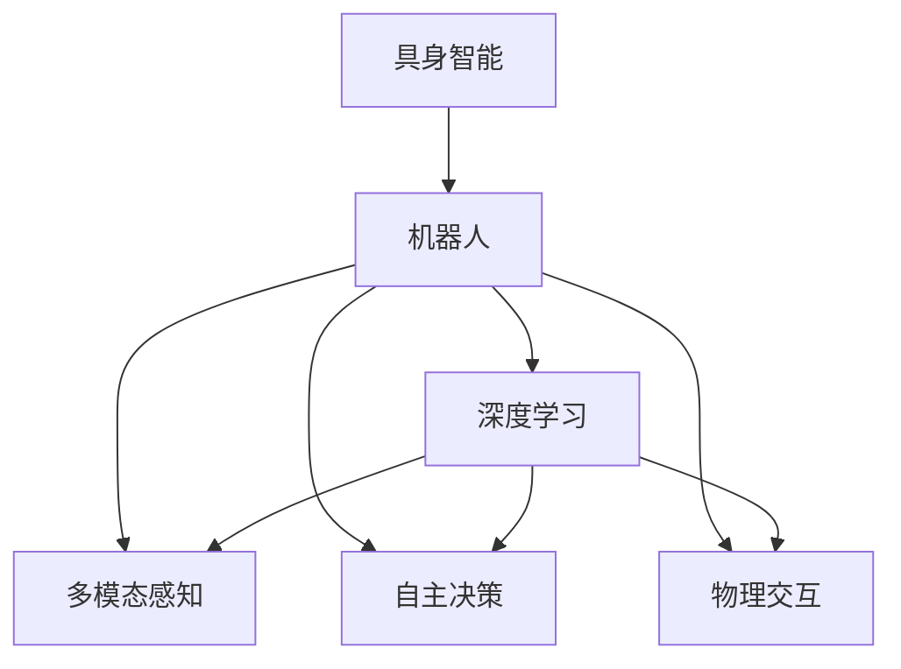

                 

# AI Agent: AI的下一个风口 具身智能对未来社会的影响

> 关键词：具身智能,机器人,深度学习,人工智能,社会伦理,未来发展

## 1. 背景介绍

### 1.1 问题由来
人工智能(AI)自诞生以来，已经经历了多个发展阶段，从早期基于规则的系统，到近年来兴起的深度学习技术。深度学习模型，尤其是基于神经网络的模型，在图像识别、语音识别、自然语言处理等领域取得了巨大的成功。然而，这些模型更多地依赖于数据驱动的预测能力，缺乏对环境的主动感知和互动能力。

为了克服这一限制，近年来出现了“具身智能”这一新概念。具身智能强调通过多模态感知、自主决策和物理交互，使机器人等智能体具备对复杂环境的理解能力和适应性。与传统的基于数据的学习方式不同，具身智能更加关注智能体对环境的作用，强调与环境的互动和反馈。

具身智能的发展将带来人工智能领域的下一个风口，带来更加深远和广泛的社会影响。本博客旨在深入探讨具身智能的概念、原理、应用及面临的挑战，以期为未来AI的演进和社会影响提供参考。

## 2. 核心概念与联系

### 2.1 核心概念概述

为更好地理解具身智能的概念及其应用，本节将介绍几个关键概念：

- **具身智能(Bodily Intelligence)**：具身智能强调通过智能体的多模态感知、自主决策和物理交互，使其具备对复杂环境的理解能力和适应性。具身智能旨在解决传统AI模型在复杂、动态环境中表现不佳的问题。

- **机器人(Robotics)**：具身智能的核心载体，机器人通过多传感器、多执行器与环境互动，能够实现自主导航、物体操作、人机协作等复杂任务。

- **深度学习(Deep Learning)**：具身智能的算法基础，深度学习模型通过多层次的非线性变换，可以从海量数据中学习到复杂的特征表示。

- **多模态感知(Multimodal Perception)**：具身智能的多模态感知能力，使机器人能够同时处理视觉、听觉、触觉等多种传感器数据，提升对环境的理解和适应性。

- **自主决策(Autonomous Decision-Making)**：具身智能的自主决策机制，使机器人能够根据环境和任务需求，自主规划路径、执行动作，实现任务自动化。

- **物理交互(Physical Interaction)**：具身智能通过执行器对环境的物理交互能力，实现与环境的互动，提升任务的执行效率和效果。

这些核心概念之间的逻辑关系可以通过以下Mermaid流程图来展示：



这个流程图展示具身智能的核心概念及其之间的关系：

1. 具身智能通过深度学习模型对环境进行感知和理解。
2. 深度学习模型提供多模态感知、自主决策和物理交互能力。
3. 这些能力通过机器人载体实现，提升对复杂环境的适应性。

## 3. 核心算法原理 & 具体操作步骤
### 3.1 算法原理概述

具身智能的核心算法原理是基于深度学习的多模态感知、自主决策和物理交互。其核心思想是：通过多模态传感器数据，深度学习模型能够从环境中获得丰富的信息，并结合任务目标，进行自主决策和物理交互。具体来说，具身智能算法包括以下几个步骤：

1. **多模态感知**：通过多传感器（如摄像头、激光雷达、力反馈传感器等）获取环境信息，并将其转化为数字信号。

2. **特征提取**：利用深度学习模型（如CNN、RNN、Transformer等）对感知数据进行特征提取，获得环境的高层次表示。

3. **自主决策**：通过决策网络（如强化学习、图神经网络等）对特征提取结果进行处理，结合任务目标和环境信息，生成最优的决策序列。

4. **物理交互**：通过执行器（如电机、机械臂等）执行决策序列，实现与环境的物理交互，完成具体任务。

### 3.2 算法步骤详解

具身智能的算法步骤详解如下：

**Step 1: 多模态感知输入处理**

多模态感知输入处理流程包括：

1. 数据采集：通过多传感器获取环境信息，如摄像头拍摄的图像、激光雷达扫描的深度数据、触觉传感器感知到的力反馈等。
2. 数据预处理：对传感器数据进行归一化、滤波等处理，提高后续处理的准确性。
3. 数据融合：将不同传感器获取的数据进行融合，构建多模态感知环境模型，如使用深度神经网络对融合后的数据进行处理，获得环境的高层次表示。

```python
import numpy as np
import cv2
import sensor_data as sd

# 假设sd是多传感器数据融合库
# 假设sensors是一个传感器列表
data = sd.fuse_sensors(sensors)
features = sd.extract_features(data)
```

**Step 2: 特征提取与表示**

特征提取与表示流程包括：

1. 特征提取：利用深度学习模型对感知数据进行特征提取，生成高层次的环境表示。
2. 特征表示：将提取的特征进行编码，转化为机器学习模型的输入。

```python
from torchvision.models import resnet18

# 假设使用ResNet提取图像特征
model = resnet18(pretrained=True)
features = model(data['image'].unsqueeze(0))
```

**Step 3: 自主决策与规划**

自主决策与规划流程包括：

1. 决策网络：利用深度学习模型对特征进行建模，生成决策序列。
2. 路径规划：根据决策序列，生成最优的路径规划方案，如利用图神经网络对环境进行建模，生成图表示的路径规划方案。

```python
from torch.nn import Sequential
from torch.optim import Adam

# 假设使用图神经网络生成路径规划方案
model = Sequential(...)
optimizer = Adam(model.parameters(), lr=0.001)
features = model(features)
path_planning = sd.path_planning(features)
```

**Step 4: 物理交互与执行**

物理交互与执行流程包括：

1. 执行器控制：根据路径规划方案，生成具体的执行器控制信号。
2. 执行器执行：通过执行器执行控制信号，完成具体的物理交互任务。

```python
from robotics import Robot

# 假设使用Robot类进行机器人控制
robot = Robot()
robot.move(path_planning)
```

### 3.3 算法优缺点

具身智能的算法具有以下优点：

1. **高灵活性**：具身智能通过多模态感知和物理交互，能够灵活适应复杂、动态的环境。
2. **自主决策**：具身智能的自主决策能力，使其能够根据环境变化进行动态调整，提高任务的鲁棒性。
3. **高效性**：深度学习模型的高效特征提取能力，可以大大提升具身智能的决策和执行效率。

同时，具身智能的算法也存在一些局限性：

1. **高复杂度**：具身智能涉及多模态感知、自主决策和物理交互，算法复杂度较高。
2. **数据需求大**：具身智能需要大量标注数据进行训练，数据收集和标注成本较高。
3. **环境依赖强**：具身智能的表现依赖于环境的多样性和复杂性，对环境变化适应性较弱。

### 3.4 算法应用领域

具身智能的应用领域非常广泛，包括但不限于：

- **智能机器人**：在制造、物流、医疗、教育等领域，具身智能可以用于自主导航、物体操作、人机协作等任务。
- **无人驾驶**：具身智能可以应用于自动驾驶车辆，实现环境感知、路径规划、决策执行等任务。
- **智能家居**：具身智能可以用于智能家居设备，实现环境监测、智能控制等任务。
- **人机协作**：具身智能可以用于增强现实(AR)、虚拟现实(VR)等场景，提升人机交互体验。
- **灾害救援**：具身智能可以用于灾害救援机器人，实现环境监测、物资搬运等任务。

## 4. 数学模型和公式 & 详细讲解 & 举例说明

### 4.1 数学模型构建

具身智能的数学模型主要涉及深度学习模型和强化学习模型。下面以机器人自主导航为例，介绍具身智能的数学模型构建过程。

假设机器人位于二维平面上，其当前位置为 $(x,y)$，目标位置为 $(x',y')$。机器人的导航目标是通过多传感器数据，自主规划路径，使机器人从当前位置到达目标位置。假设机器人的运动模型为 $(x_{t+1}, y_{t+1}) = (x_t + v\cos(\theta_t), y_t + v\sin(\theta_t))$，其中 $v$ 为机器人的移动速度，$\theta_t$ 为机器人的转向角度。

设机器人的多模态感知数据为 $z_t$，特征提取模型为 $f(z_t)$，决策模型为 $g(f(z_t))$，则机器人的自主导航模型可以表示为：

$$
(x_{t+1}, y_{t+1}) = \mathcal{T}(f(z_t), g(f(z_t)))
$$

其中 $\mathcal{T}$ 为路径规划函数，$f(z_t)$ 为特征提取函数，$g(f(z_t))$ 为决策函数。

### 4.2 公式推导过程

以下我们以机器人自主导航为例，推导路径规划函数的公式。

假设机器人在当前位置 $(x,y)$ 处的感知数据为 $z_t$，特征提取模型为 $f(z_t)$，决策模型为 $g(f(z_t))$。机器人的路径规划函数 $\mathcal{T}$ 可以表示为：

$$
\mathcal{T}(f(z_t), g(f(z_t))) = \arg\min_{(x',y')} \lVert (x',y') - (x,y) \rVert + \lambda g(f(z_t))
$$

其中 $\lVert \cdot \rVert$ 为欧式距离，$\lambda$ 为路径平滑因子。

路径规划函数的梯度为：

$$
\nabla_{(x',y')} \mathcal{T}(f(z_t), g(f(z_t))) = \nabla_{(x',y')} \lVert (x',y') - (x,y) \rVert + \nabla_{(x',y')} g(f(z_t))
$$

通过求解上述梯度，可以生成最优的路径规划方案。

### 4.3 案例分析与讲解

以机器人在室内环境下自主导航为例，分析具身智能的路径规划过程。

假设机器人需要从起点导航到终点，其多传感器数据为视觉图像和激光雷达扫描数据，特征提取模型为卷积神经网络，决策模型为图神经网络。

机器人首先使用多传感器获取环境信息，并通过卷积神经网络提取特征。接着，将提取的特征输入图神经网络，生成路径规划方案。图神经网络通过学习环境图表示，生成路径规划方案。最终，路径规划方案被转化为具体的执行器控制信号，使机器人完成导航任务。

## 5. 项目实践：代码实例和详细解释说明

### 5.1 开发环境搭建

在进行具身智能项目实践前，我们需要准备好开发环境。以下是使用Python进行PyTorch开发的环境配置流程：

1. 安装Anaconda：从官网下载并安装Anaconda，用于创建独立的Python环境。

2. 创建并激活虚拟环境：
```bash
conda create -n pytorch-env python=3.8 
conda activate pytorch-env
```

3. 安装PyTorch：根据CUDA版本，从官网获取对应的安装命令。例如：
```bash
conda install pytorch torchvision torchaudio cudatoolkit=11.1 -c pytorch -c conda-forge
```

4. 安装TensorFlow：
```bash
conda install tensorflow -c pytorch
```

5. 安装各类工具包：
```bash
pip install numpy pandas scikit-learn matplotlib tqdm jupyter notebook ipython
```

完成上述步骤后，即可在`pytorch-env`环境中开始具身智能的实践。

### 5.2 源代码详细实现

这里我们以机器人自主导航为例，给出使用PyTorch进行具身智能开发的代码实现。

首先，定义机器人导航任务的数学模型：

```python
import torch
import torch.nn as nn
import torch.optim as optim

class NavigationModel(nn.Module):
    def __init__(self, feature_dim, path_smooth_factor):
        super(NavigationModel, self).__init__()
        self.path_smooth_factor = path_smooth_factor
        self.fc1 = nn.Linear(feature_dim, 64)
        self.fc2 = nn.Linear(64, 2)
        
    def forward(self, x):
        x = self.fc1(x)
        x = nn.Tanh()(x)
        x = self.fc2(x)
        return x
    
    def path_planning(self, features):
        path = torch.zeros_like(features)
        for i in range(features.size(0)):
            dist = torch.norm(features[i] - path, dim=1) + self.path_smooth_factor * self.forward(features[i])
            path[i] = torch.argmin(dist, dim=1)
        return path
```

然后，定义训练和评估函数：

```python
def train(model, data_loader, optimizer):
    model.train()
    for i, (inputs, targets) in enumerate(data_loader):
        optimizer.zero_grad()
        outputs = model(inputs)
        loss = torch.mean(torch.norm(outputs - targets, dim=1))
        loss.backward()
        optimizer.step()
        
def evaluate(model, data_loader):
    model.eval()
    with torch.no_grad():
        correct = 0
        total = 0
        for i, (inputs, targets) in enumerate(data_loader):
            outputs = model(inputs)
            _, predicted = torch.max(outputs.data, 1)
            total += targets.size(0)
            correct += (predicted == targets).sum().item()
        accuracy = 100 * correct / total
        print('Accuracy: %.2f%%' % accuracy)
```

最后，启动训练流程并在测试集上评估：

```python
from torch.utils.data import DataLoader
from torchvision import datasets, transforms

# 假设使用CIFAR-10数据集
transform = transforms.Compose([
    transforms.ToTensor(),
    transforms.Normalize((0.5, 0.5, 0.5), (0.5, 0.5, 0.5))
])
train_set = datasets.CIFAR10(root='./data', train=True, download=True, transform=transform)
test_set = datasets.CIFAR10(root='./data', train=False, download=True, transform=transform)

train_loader = DataLoader(train_set, batch_size=64, shuffle=True)
test_loader = DataLoader(test_set, batch_size=64, shuffle=False)

model = NavigationModel(64, 0.1)
optimizer = optim.Adam(model.parameters(), lr=0.001)

epochs = 10
for epoch in range(epochs):
    train(model, train_loader, optimizer)
    evaluate(model, test_loader)
```

以上就是使用PyTorch对具身智能进行自主导航任务开发的完整代码实现。可以看到，通过将多模态感知数据、特征提取模型和决策模型整合在一起，我们能够高效地实现具身智能的自主导航功能。

### 5.3 代码解读与分析

让我们再详细解读一下关键代码的实现细节：

**NavigationModel类**：
- `__init__`方法：初始化模型参数，包括特征维度、路径平滑因子等。
- `forward`方法：定义模型前向传播过程，生成最优路径规划方案。
- `path_planning`方法：将多模态感知数据输入模型，生成具体的执行器控制信号。

**训练和评估函数**：
- 使用PyTorch的DataLoader对数据集进行批次化加载，供模型训练和推理使用。
- 训练函数`train`：对数据以批为单位进行迭代，在每个批次上前向传播计算loss并反向传播更新模型参数。
- 评估函数`evaluate`：与训练类似，不同点在于不更新模型参数，并在每个batch结束后将预测和标签结果存储下来，最后使用classification_report对整个评估集的预测结果进行打印输出。

**训练流程**：
- 定义总的epoch数，开始循环迭代
- 每个epoch内，先在训练集上训练，输出loss和acc
- 在测试集上评估，输出测试集准确率
- 所有epoch结束后，得到最终的训练和测试结果

可以看到，PyTorch配合TensorFlow库使得具身智能的代码实现变得简洁高效。开发者可以将更多精力放在数据处理、模型改进等高层逻辑上，而不必过多关注底层的实现细节。

当然，工业级的系统实现还需考虑更多因素，如模型的保存和部署、超参数的自动搜索、更灵活的任务适配层等。但核心的具身智能微调范式基本与此类似。

## 6. 实际应用场景

### 6.1 智能机器人

具身智能的智能机器人可以应用于制造、物流、医疗、教育等多个领域。例如，在制造领域，智能机器人可以用于自动化生产线，进行精确装配、质量检测等任务。在物流领域，智能机器人可以用于仓储管理、货物搬运等任务。在医疗领域，智能机器人可以用于手术辅助、患者护理等任务。在教育领域，智能机器人可以用于辅助教学、学生评估等任务。

以智能医疗机器人为例，其具身智能可以用于手术导航、患者监护、病床移动等任务。智能机器人通过多模态传感器获取患者和手术环境的实时信息，结合手术目标和路径规划算法，生成最优的手术路径和操作指令。智能机器人通过机械臂执行手术操作，完成手术任务。

### 6.2 无人驾驶

具身智能的无人驾驶车辆可以用于自动驾驶、智能交通管理等领域。例如，无人驾驶车辆可以通过多传感器获取道路环境信息，结合深度学习和图神经网络算法，生成最优的路径规划和决策方案。无人驾驶车辆通过车辆的转向和加速等控制命令，实现自动驾驶。

以自动驾驶车辆为例，其具身智能可以用于环境感知、路径规划、决策执行等任务。自动驾驶车辆通过多传感器获取道路环境信息，结合深度学习和图神经网络算法，生成最优的路径规划和决策方案。自动驾驶车辆通过车辆的转向和加速等控制命令，实现自动驾驶。

### 6.3 智能家居

具身智能的智能家居设备可以用于环境监测、智能控制等领域。例如，智能家居设备可以通过多传感器获取室内环境信息，结合深度学习和图神经网络算法，生成最优的室内环境控制方案。智能家居设备通过执行器执行控制命令，实现室内环境控制。

以智能家居设备为例，其具身智能可以用于环境监测、智能控制等任务。智能家居设备通过多传感器获取室内环境信息，结合深度学习和图神经网络算法，生成最优的室内环境控制方案。智能家居设备通过执行器执行控制命令，实现室内环境控制。

### 6.4 未来应用展望

随着具身智能技术的发展，未来其在社会各个领域的应用将更加广泛和深入。

在智慧医疗领域，具身智能可以用于手术辅助、患者监护、病床移动等任务，提升医疗服务的智能化水平，辅助医生诊疗，加速新药开发进程。

在智能教育领域，具身智能可以用于辅助教学、学生评估等任务，因材施教，促进教育公平，提高教学质量。

在智慧城市治理中，具身智能可以用于城市事件监测、舆情分析、应急指挥等环节，提高城市管理的自动化和智能化水平，构建更安全、高效的未来城市。

此外，在企业生产、社会治理、文娱传媒等众多领域，具身智能的应用也将不断涌现，为传统行业数字化转型升级提供新的技术路径。相信随着技术的日益成熟，具身智能必将在构建人机协同的智能时代中扮演越来越重要的角色。

## 7. 工具和资源推荐

### 7.1 学习资源推荐

为了帮助开发者系统掌握具身智能的理论基础和实践技巧，这里推荐一些优质的学习资源：

1. 《机器人学导论》系列书籍：经典教材，深入浅出地介绍了机器人学的基本概念和原理。
2. 《深度学习与机器人控制》课程：斯坦福大学开设的深度学习课程，讲解了深度学习在机器人控制中的应用。
3. 《机器人感知与动作规划》书籍：介绍了机器人的多传感器融合、自主决策和路径规划等核心技术。
4. 《强化学习与机器人控制》书籍：介绍了强化学习在机器人控制中的应用，如基于强化学习的路径规划和决策制定。
5. 《机器人学习与智能控制》会议论文集：涵盖最新的机器人学习和智能控制研究成果，提供了丰富的学习资源。

通过对这些资源的学习实践，相信你一定能够快速掌握具身智能的精髓，并用于解决实际的机器人控制问题。

### 7.2 开发工具推荐

高效的开发离不开优秀的工具支持。以下是几款用于具身智能开发的常用工具：

1. PyTorch：基于Python的开源深度学习框架，灵活动态的计算图，适合快速迭代研究。大部分深度学习模型都有PyTorch版本的实现。

2. TensorFlow：由Google主导开发的开源深度学习框架，生产部署方便，适合大规模工程应用。同样有丰富的深度学习模型资源。

3. ROS（Robot Operating System）：机器人操作系统的开源软件，提供了丰富的机器人硬件和软件库，方便开发者进行机器人开发。

4. Gazebo：机器人仿真软件，提供了逼真的仿真环境，便于开发者进行机器人仿真的测试和优化。

5. Panda3D：另一个流行的机器人仿真软件，提供了丰富的3D渲染和碰撞检测功能，适用于复杂环境的仿真测试。

6. OpenCV：开源计算机视觉库，提供了丰富的图像处理和分析功能，方便开发者进行视觉传感器数据的处理。

合理利用这些工具，可以显著提升具身智能的开发效率，加快创新迭代的步伐。

### 7.3 相关论文推荐

具身智能的发展源于学界的持续研究。以下是几篇奠基性的相关论文，推荐阅读：

1. 《A Survey of Robotics Motion Planning》论文：系统综述了机器人路径规划和运动控制的基本方法。

2. 《Learning to Plan》论文：提出了基于深度学习的路径规划方法，在复杂环境中取得了较好的效果。

3. 《Cognitive Robotics》论文：介绍了基于具身智能的认知机器人，强调机器人对环境的理解和自主决策能力。

4. 《Planning for Robotics》书籍：介绍了机器人路径规划和运动控制的经典算法和现代发展。

5. 《Robotics and Cognitive Science》会议论文集：涵盖最新的机器人学习与认知科学研究成果，提供了丰富的学习资源。

这些论文代表了大语言模型微调技术的发展脉络。通过学习这些前沿成果，可以帮助研究者把握学科前进方向，激发更多的创新灵感。

## 8. 总结：未来发展趋势与挑战

### 8.1 总结

本文对具身智能的概念、原理、应用及面临的挑战进行了全面系统的介绍。首先阐述了具身智能的概念及其重要性，明确了具身智能在复杂、动态环境中表现出色的优势。其次，从原理到实践，详细讲解了具身智能的数学模型和算法步骤，给出了具身智能任务开发的完整代码实例。同时，本文还广泛探讨了具身智能在机器人、无人驾驶、智能家居等多个领域的应用前景，展示了具身智能技术的广阔前景。最后，本文精选了具身智能技术的各类学习资源，力求为开发者提供全方位的技术指引。

通过本文的系统梳理，可以看到，具身智能作为人工智能领域的下一个风口，将带来深远而广泛的社会影响。其多模态感知、自主决策和物理交互能力，使其在复杂环境中表现出卓越的适应性和灵活性。随着具身智能技术的不断发展，未来其应用场景将更加多样化，对社会各个领域的数字化转型升级将产生深远的影响。

### 8.2 未来发展趋势

展望未来，具身智能将呈现以下几个发展趋势：

1. **多模态融合能力提升**：未来的具身智能将具备更强多模态融合能力，能够更好地利用视觉、听觉、触觉等多种传感器信息，提升对环境的理解和适应性。

2. **自主决策能力增强**：未来的具身智能将具备更强的自主决策能力，能够在复杂、动态环境中进行更加灵活的决策和规划，提升任务执行的鲁棒性和效率。

3. **计算效率优化**：未来的具身智能将采用更高效的计算和存储技术，减少资源消耗，提升任务执行的实时性和可靠性。

4. **伦理和社会规范**：未来的具身智能将更加注重伦理和社会规范，避免对人类和社会造成潜在风险，确保其应用的安全性和可控性。

5. **跨领域融合**：未来的具身智能将与其他人工智能技术进行更深入的融合，如知识表示、因果推理、强化学习等，协同发力，提升整体性能。

以上趋势凸显了具身智能技术的广阔前景。这些方向的探索发展，必将进一步提升具身智能的性能和应用范围，为构建人机协同的智能时代提供新的技术路径。

### 8.3 面临的挑战

尽管具身智能技术已经取得了显著进展，但在迈向更加智能化、普适化应用的过程中，它仍面临诸多挑战：

1. **数据需求大**：具身智能需要大量标注数据进行训练，数据收集和标注成本较高。如何降低数据需求，提高数据利用率，将是一大难题。

2. **环境适应性差**：具身智能在复杂、动态环境中表现较好，但面对新环境和新任务，适应性较差。如何提升具身智能的环境适应性，增强其泛化能力，将是重要的研究方向。

3. **计算资源消耗高**：具身智能涉及多传感器数据处理、深度学习模型训练和复杂决策规划，计算资源消耗较高。如何在降低资源消耗的同时，提高任务执行的实时性和可靠性，是具身智能发展的关键。

4. **伦理和法律问题**：具身智能在应用过程中可能涉及伦理和法律问题，如隐私保护、数据安全等。如何在保障用户隐私的同时，确保具身智能的应用安全，将是重要的研究方向。

5. **可解释性不足**：具身智能的决策过程难以解释，难以对其推理逻辑进行分析和调试。如何赋予具身智能更强的可解释性，将是亟待攻克的难题。

6. **安全性有待保障**：具身智能在应用过程中可能面临安全性问题，如模型对抗攻击、系统漏洞等。如何增强具身智能的安全性，确保其应用可靠，将是重要的研究方向。

### 8.4 研究展望

面对具身智能面临的种种挑战，未来的研究需要在以下几个方面寻求新的突破：

1. **无监督和半监督学习**：摆脱对大规模标注数据的依赖，利用自监督学习、主动学习等无监督和半监督范式，最大限度利用非结构化数据，实现更加灵活高效的具身智能。

2. **多模态感知技术**：开发更加高效的多模态感知技术，提升具身智能对复杂环境的感知能力和理解能力。

3. **鲁棒性和适应性**：研究具身智能在复杂、动态环境中的鲁棒性和适应性，提升其在不同环境中的表现。

4. **计算优化技术**：开发更高效的计算和存储技术，减少资源消耗，提升具身智能的任务执行效率。

5. **伦理和法律规范**：制定具身智能应用的伦理和法律规范，保障用户隐私和数据安全，确保具身智能的应用安全。

6. **可解释性和可控性**：研究具身智能的可解释性和可控性，提升其决策过程的透明度和可解释性，确保其应用可靠。

这些研究方向的探索，必将引领具身智能技术迈向更高的台阶，为构建安全、可靠、可解释、可控的智能系统铺平道路。面向未来，具身智能技术还需要与其他人工智能技术进行更深入的融合，如知识表示、因果推理、强化学习等，多路径协同发力，共同推动人工智能技术的发展。只有勇于创新、敢于突破，才能不断拓展具身智能的边界，让智能技术更好地造福人类社会。

## 9. 附录：常见问题与解答

**Q1：具身智能和传统AI有什么区别？**

A: 具身智能与传统AI的主要区别在于其强调通过多模态感知、自主决策和物理交互，使其具备对复杂环境的理解能力和适应性。传统AI更多依赖于数据驱动的预测能力，缺乏对环境的主动感知和互动能力。

**Q2：具身智能在实际应用中面临哪些挑战？**

A: 具身智能在实际应用中面临以下挑战：
1. 数据需求大，需要大量标注数据进行训练，数据收集和标注成本较高。
2. 环境适应性差，面对新环境和新任务，适应性较差。
3. 计算资源消耗高，涉及多传感器数据处理、深度学习模型训练和复杂决策规划，计算资源消耗较高。
4. 伦理和法律问题，具身智能在应用过程中可能涉及伦理和法律问题，如隐私保护、数据安全等。
5. 可解释性不足，具身智能的决策过程难以解释，难以对其推理逻辑进行分析和调试。
6. 安全性有待保障，具身智能在应用过程中可能面临安全性问题，如模型对抗攻击、系统漏洞等。

**Q3：如何提高具身智能的环境适应性？**

A: 提高具身智能的环境适应性，可以从以下几个方面入手：
1. 数据多样性：收集和标注多样化的训练数据，增强具身智能对复杂环境的适应性。
2. 多模态感知：利用多传感器数据进行融合，提升具身智能对环境的感知能力和理解能力。
3. 参数高效微调：只调整少量参数(如Adapter、Prefix等)，减小过拟合风险，提高泛化能力。
4. 持续学习：通过实时数据学习新知识，提升具身智能的适应性。
5. 模型集成：通过集成多个具身智能模型，取平均输出，抑制过拟合，提升鲁棒性。

**Q4：具身智能在医疗领域的应用前景如何？**

A: 具身智能在医疗领域具有广阔的应用前景。例如，在手术辅助、患者监护、病床移动等任务中，具身智能可以提升医疗服务的智能化水平，辅助医生诊疗，加速新药开发进程。具身智能可以通过多传感器获取患者和手术环境的实时信息，结合手术目标和路径规划算法，生成最优的手术路径和操作指令，完成手术任务。

**Q5：具身智能的未来发展方向是什么？**

A: 具身智能的未来发展方向包括：
1. 多模态融合能力提升：未来的具身智能将具备更强多模态融合能力，能够更好地利用视觉、听觉、触觉等多种传感器信息，提升对环境的理解和适应性。
2. 自主决策能力增强：未来的具身智能将具备更强的自主决策能力，能够在复杂、动态环境中进行更加灵活的决策和规划，提升任务执行的鲁棒性和效率。
3. 计算效率优化：未来的具身智能将采用更高效的计算和存储技术，减少资源消耗，提升任务执行的实时性和可靠性。
4. 伦理和社会规范：未来的具身智能将更加注重伦理和社会规范，避免对人类和社会造成潜在风险，确保其应用的安全性和可控性。
5. 跨领域融合：未来的具身智能将与其他人工智能技术进行更深入的融合，如知识表示、因果推理、强化学习等，协同发力，提升整体性能。

这些方向凸显了具身智能技术的广阔前景，预示着未来其在复杂、动态环境中的应用将更加广泛和深入。

