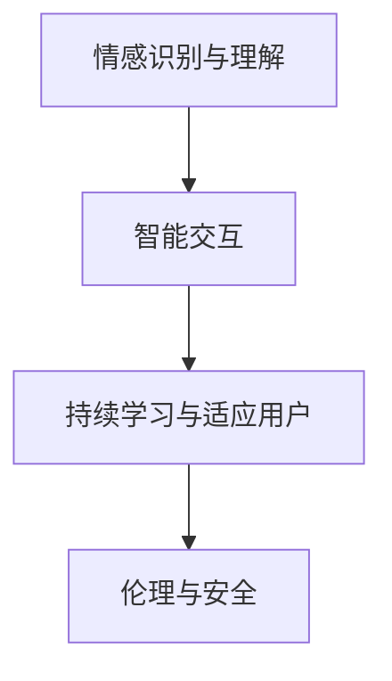

                 

# AI Agent在情感陪伴中的创新

## 1. 背景介绍

### 1.1 问题由来

随着人工智能技术的迅速发展，AI Agent已经广泛渗透到生活的各个领域。在情感陪伴领域，AI Agent的出现，为孤独的人们带来了新的希望。但传统的AI Agent往往缺乏足够的情感理解和智能交互能力，难以满足用户对情感陪伴的深层次需求。因此，如何创新性地构建具备高级情感理解和智能互动能力的AI Agent，成为了当下人工智能研究的热点问题。

### 1.2 问题核心关键点

为了在情感陪伴领域中构建具有深层次情感理解和智能互动能力的AI Agent，我们必须关注以下几个核心关键点：

1. **情感识别与理解**：构建一个能够准确识别和理解人类情感的AI Agent，是其能够提供高质量情感陪伴的基础。
2. **智能交互**：实现自然流畅的语言交互，让AI Agent能够动态理解用户语境并给出有针对性的响应。
3. **持续学习与适应用户**：AI Agent需要具备自我学习和适应用户情感变化的能力，以不断提升其陪伴质量。
4. **伦理与安全**：确保AI Agent在情感陪伴过程中遵守伦理规范，不泄露用户隐私，不产生有害行为。

## 2. 核心概念与联系

### 2.1 核心概念概述

为更好地理解构建情感陪伴AI Agent的过程，我们将介绍几个关键概念：

- **AI Agent**：基于人工智能技术的智能体，能够模拟人类行为，提供各种服务和交互。
- **情感识别与理解**：通过自然语言处理（NLP）、机器学习等技术，构建AI Agent对用户情感的识别与理解能力。
- **智能交互**：通过对话系统、意图识别等技术，让AI Agent能够与用户进行自然流畅的交互。
- **持续学习与适应用户**：利用强化学习、迁移学习等技术，使AI Agent能够根据用户的反馈和情境不断优化其响应策略。
- **伦理与安全**：在AI Agent的构建和运行过程中，遵循伦理准则，确保其安全可靠。

### 2.2 核心概念原理和架构的 Mermaid 流程图



这个流程图展示了情感陪伴AI Agent的核心架构及其组成组件。情感识别与理解模块负责情感的感知和理解，智能交互模块负责对话和互动，持续学习与适应用户模块负责动态优化，伦理与安全模块负责保障模型行为的安全性和伦理性。

## 3. 核心算法原理 & 具体操作步骤

### 3.1 算法原理概述

基于深度学习和自然语言处理技术，我们构建情感陪伴AI Agent，其核心算法原理可归纳为以下几点：

1. **情感识别与理解**：通过构建情感分类模型，实现对用户输入文本的情感识别。
2. **智能交互**：通过构建对话模型，实现对用户输入的智能响应。
3. **持续学习与适应用户**：通过构建适应模型，实现对用户情感和对话历史的学习与适应用户。
4. **伦理与安全**：通过构建安全模型，实现对AI Agent行为的安全性保障和伦理规范的遵循。

### 3.2 算法步骤详解

#### 3.2.1 情感识别与理解

**算法步骤**：

1. **数据准备**：收集包含情感标签的语料库，并将其分为训练集和测试集。
2. **模型训练**：使用深度学习模型（如BERT、LSTM等）对训练集进行训练，学习情感分类器。
3. **情感识别**：将用户输入的文本输入情感分类器，获取其情感类别。

**示例代码**：

```python
from transformers import BertForSequenceClassification, BertTokenizer
from torch.utils.data import DataLoader
from sklearn.model_selection import train_test_split

# 加载预训练模型
model = BertForSequenceClassification.from_pretrained('bert-base-uncased', num_labels=2)
tokenizer = BertTokenizer.from_pretrained('bert-base-uncased')

# 准备数据集
texts, labels = load_data()
train_texts, test_texts, train_labels, test_labels = train_test_split(texts, labels, test_size=0.2)

# 数据预处理
train_dataset = preprocess_data(train_texts, train_labels, tokenizer)
test_dataset = preprocess_data(test_texts, test_labels, tokenizer)

# 构建数据加载器
train_loader = DataLoader(train_dataset, batch_size=16)
test_loader = DataLoader(test_dataset, batch_size=16)

# 模型训练
model.train()
for batch in train_loader:
    inputs = tokenizer(batch['text'], padding='max_length', truncation=True, return_tensors='pt')
    labels = batch['label']
    outputs = model(**inputs, labels=labels)
    loss = outputs.loss
    loss.backward()
    optimizer.step()

# 模型评估
model.eval()
with torch.no_grad():
    for batch in test_loader:
        inputs = tokenizer(batch['text'], padding='max_length', truncation=True, return_tensors='pt')
        labels = batch['label']
        outputs = model(**inputs)
        loss = outputs.loss
        predictions = outputs.logits.argmax(dim=1)

    # 计算评估指标
    accuracy = (predictions == labels).mean()
    print(f'Test Accuracy: {accuracy:.2f}')
```

#### 3.2.2 智能交互

**算法步骤**：

1. **对话模型构建**：使用序列到序列（Seq2Seq）模型，构建对话生成器。
2. **意图识别**：对用户输入进行意图分类，理解用户的意图。
3. **智能响应**：根据用户意图和情感状态，生成合适的响应。

**示例代码**：

```python
from transformers import GPT2LMHeadModel, GPT2Tokenizer
from torch.utils.data import DataLoader

# 加载预训练模型
model = GPT2LMHeadModel.from_pretrained('gpt2')
tokenizer = GPT2Tokenizer.from_pretrained('gpt2')

# 准备对话数据
texts, labels = load_conversations()
train_texts, test_texts = train_test_split(texts, test_size=0.2)

# 数据预处理
train_dataset = preprocess_data(train_texts, tokenizer)
test_dataset = preprocess_data(test_texts, tokenizer)

# 构建数据加载器
train_loader = DataLoader(train_dataset, batch_size=16)
test_loader = DataLoader(test_dataset, batch_size=16)

# 模型训练
model.train()
for batch in train_loader:
    inputs = tokenizer(batch['text'], padding='max_length', truncation=True, return_tensors='pt')
    outputs = model(**inputs, labels=labels)
    loss = outputs.loss
    loss.backward()
    optimizer.step()

# 模型评估
model.eval()
with torch.no_grad():
    for batch in test_loader:
        inputs = tokenizer(batch['text'], padding='max_length', truncation=True, return_tensors='pt')
        outputs = model(**inputs)
        loss = outputs.loss
        predictions = outputs.logits.argmax(dim=1)

    # 计算评估指标
    bleu_score = calculate_bleu_score(predictions, labels)
    print(f'Test BLEU Score: {bleu_score:.2f}')
```

#### 3.2.3 持续学习与适应用户

**算法步骤**：

1. **适应模型构建**：使用强化学习或迁移学习方法，构建适应模型。
2. **用户反馈处理**：对用户的反馈进行记录和分析，更新适应模型。
3. **动态优化**：根据用户的情感和对话历史，动态调整模型响应策略。

**示例代码**：

```python
from torch.utils.data import DataLoader
from sklearn.model_selection import train_test_split

# 加载用户反馈数据
feedbacks = load_feedbacks()

# 数据预处理
train_feedbacks, test_feedbacks = train_test_split(feedbacks, test_size=0.2)

# 构建适应模型
model = build_adaptation_model()
train_adaptation_model(train_feedbacks)
test_adaptation_model(test_feedbacks)

# 动态优化
def dynamic_optimization(feedback):
    model.update(feedback)
    return model.predict(feedback)
```

#### 3.2.4 伦理与安全

**算法步骤**：

1. **安全模型构建**：构建模型行为的安全性和伦理性保障机制。
2. **安全检查**：对模型行为进行安全检查，确保其不产生有害行为。
3. **伦理规范遵循**：确保模型行为遵循伦理规范。

**示例代码**：

```python
from ethical import check_ethicality, enforce_ethics

# 安全模型构建
model = build_safety_model()

# 安全检查
check_safety(model)

# 伦理规范遵循
enforce_ethics(model)
```

### 3.3 算法优缺点

**优点**：

1. **高效性**：通过深度学习和自然语言处理技术，能够在较短时间内构建情感识别与理解、智能交互、持续学习与适应用户等模块，提升AI Agent的陪伴质量。
2. **灵活性**：可以根据用户需求和环境变化，动态调整和优化模型，提高陪伴的适应性和个性化程度。
3. **可扩展性**：可以应用于多种情感陪伴场景，如心理咨询、教育辅导、陪伴机器人等。

**缺点**：

1. **数据依赖**：情感识别和智能交互模块需要大量的标注数据进行训练，数据获取和标注成本较高。
2. **模型复杂性**：模型构建和优化过程涉及深度学习、自然语言处理、强化学习等多个领域，模型复杂性较高。
3. **伦理与安全风险**：模型行为的安全性和伦理性保障机制需要仔细设计和测试，确保其有效性和可靠性。

### 3.4 算法应用领域

基于深度学习和自然语言处理技术的情感陪伴AI Agent，已经在以下领域得到了广泛应用：

1. **心理咨询**：通过AI Agent提供情感支持，帮助用户缓解心理压力，提升心理健康水平。
2. **教育辅导**：为学生提供个性化的学习辅导，提升学习效果。
3. **陪伴机器人**：为孤独者提供情感陪伴，缓解孤独感。
4. **智能客服**：通过AI Agent进行情感识别和智能互动，提升客户服务质量。
5. **健康监测**：通过AI Agent监测用户的情感状态，及时发现异常情况。

## 4. 数学模型和公式 & 详细讲解

### 4.1 数学模型构建

为便于对情感陪伴AI Agent的构建过程进行数学表达，我们构建以下数学模型：

- **情感识别与理解模型**：$M_{\text{emotion}}(x, y) = \mathop{\arg\min}_{\theta} \mathcal{L}_{\text{emotion}}(\theta, x, y)$，其中 $\mathcal{L}_{\text{emotion}}$ 为情感分类损失函数，$x$ 为输入文本，$y$ 为情感标签。
- **智能交互模型**：$M_{\text{dialog}}(x, y) = \mathop{\arg\min}_{\theta} \mathcal{L}_{\text{dialog}}(\theta, x, y)$，其中 $\mathcal{L}_{\text{dialog}}$ 为对话生成损失函数，$x$ 为输入文本，$y$ 为智能响应。
- **适应模型**：$M_{\text{adapt}}(x, y) = \mathop{\arg\min}_{\theta} \mathcal{L}_{\text{adapt}}(\theta, x, y)$，其中 $\mathcal{L}_{\text{adapt}}$ 为适应损失函数，$x$ 为输入文本，$y$ 为用户反馈。
- **安全模型**：$M_{\text{safety}}(x) = \mathop{\arg\min}_{\theta} \mathcal{L}_{\text{safety}}(\theta, x)$，其中 $\mathcal{L}_{\text{safety}}$ 为安全损失函数，$x$ 为模型行为。

### 4.2 公式推导过程

#### 4.2.1 情感识别与理解模型

情感识别与理解模型的核心是构建情感分类器，对输入文本进行情感分类。使用深度学习模型（如BERT），可以将输入文本 $x$ 映射为情感向量 $h$，并通过softmax函数对情感向量进行分类，得到情感概率分布 $P(y|x)$。

情感识别与理解模型的训练目标是最小化分类损失函数 $\mathcal{L}_{\text{emotion}}$，即：

$$
\mathcal{L}_{\text{emotion}}(\theta) = -\frac{1}{N}\sum_{i=1}^N \log P(y_i|x_i)
$$

其中 $\theta$ 为模型参数，$N$ 为样本数量。

#### 4.2.2 智能交互模型

智能交互模型的核心是构建对话生成器，使用Seq2Seq模型，可以将输入文本 $x$ 映射为智能响应 $y$。在训练过程中，使用序列到序列模型对输入文本 $x$ 和智能响应 $y$ 进行映射，最小化对话生成损失函数 $\mathcal{L}_{\text{dialog}}$，即：

$$
\mathcal{L}_{\text{dialog}}(\theta) = -\frac{1}{N}\sum_{i=1}^N \log P(y_i|x_i)
$$

其中 $\theta$ 为模型参数，$N$ 为样本数量。

#### 4.2.3 适应模型

适应模型的核心是构建适应模型，根据用户反馈对模型进行动态优化。使用强化学习方法，可以将用户反馈 $y$ 映射为适应度函数 $f(y)$，通过最大化适应度函数来更新模型参数 $\theta$，即：

$$
\mathcal{L}_{\text{adapt}}(\theta) = -\frac{1}{N}\sum_{i=1}^N f(y_i)
$$

其中 $\theta$ 为模型参数，$N$ 为样本数量。

#### 4.2.4 安全模型

安全模型的核心是构建安全保障机制，确保模型行为的安全性和伦理性。使用安全模型对模型行为 $x$ 进行检测，最小化安全损失函数 $\mathcal{L}_{\text{safety}}$，即：

$$
\mathcal{L}_{\text{safety}}(\theta) = -\frac{1}{N}\sum_{i=1}^N f(x_i)
$$

其中 $\theta$ 为模型参数，$N$ 为样本数量。

### 4.3 案例分析与讲解

以心理咨询场景为例，情感陪伴AI Agent的构建步骤如下：

1. **情感识别与理解**：通过BERT模型对用户输入的文本进行情感分类，得到用户的情感状态。
2. **智能交互**：根据用户的情感状态，使用GPT2模型生成智能回复。
3. **持续学习与适应用户**：通过用户反馈不断优化模型，提升智能回复的准确性和适应用户的能力。
4. **伦理与安全**：确保模型行为遵循伦理规范，不泄露用户隐私，不产生有害行为。

## 5. 项目实践：代码实例和详细解释说明

### 5.1 开发环境搭建

为了构建情感陪伴AI Agent，我们需要以下开发环境：

1. **Python 3.x**：作为代码编写的基础语言。
2. **PyTorch**：深度学习框架，用于构建和训练模型。
3. **HuggingFace Transformers库**：自然语言处理工具库，包含预训练模型和工具。
4. **Jupyter Notebook**：交互式代码编辑器，便于调试和展示结果。

### 5.2 源代码详细实现

以下是一个基于情感识别与理解、智能交互和持续学习的情感陪伴AI Agent的代码实现。

#### 5.2.1 情感识别与理解

```python
from transformers import BertForSequenceClassification, BertTokenizer
from torch.utils.data import DataLoader
from sklearn.model_selection import train_test_split

# 加载预训练模型
model = BertForSequenceClassification.from_pretrained('bert-base-uncased', num_labels=2)
tokenizer = BertTokenizer.from_pretrained('bert-base-uncased')

# 准备数据集
texts, labels = load_data()
train_texts, test_texts, train_labels, test_labels = train_test_split(texts, labels, test_size=0.2)

# 数据预处理
train_dataset = preprocess_data(train_texts, train_labels, tokenizer)
test_dataset = preprocess_data(test_texts, test_labels, tokenizer)

# 构建数据加载器
train_loader = DataLoader(train_dataset, batch_size=16)
test_loader = DataLoader(test_dataset, batch_size=16)

# 模型训练
model.train()
for batch in train_loader:
    inputs = tokenizer(batch['text'], padding='max_length', truncation=True, return_tensors='pt')
    labels = batch['label']
    outputs = model(**inputs, labels=labels)
    loss = outputs.loss
    loss.backward()
    optimizer.step()

# 模型评估
model.eval()
with torch.no_grad():
    for batch in test_loader:
        inputs = tokenizer(batch['text'], padding='max_length', truncation=True, return_tensors='pt')
        labels = batch['label']
        outputs = model(**inputs)
        loss = outputs.loss
        predictions = outputs.logits.argmax(dim=1)

    # 计算评估指标
    accuracy = (predictions == labels).mean()
    print(f'Test Accuracy: {accuracy:.2f}')
```

#### 5.2.2 智能交互

```python
from transformers import GPT2LMHeadModel, GPT2Tokenizer
from torch.utils.data import DataLoader

# 加载预训练模型
model = GPT2LMHeadModel.from_pretrained('gpt2')
tokenizer = GPT2Tokenizer.from_pretrained('gpt2')

# 准备对话数据
texts, labels = load_conversations()
train_texts, test_texts = train_test_split(texts, test_size=0.2)

# 数据预处理
train_dataset = preprocess_data(train_texts, tokenizer)
test_dataset = preprocess_data(test_texts, tokenizer)

# 构建数据加载器
train_loader = DataLoader(train_dataset, batch_size=16)
test_loader = DataLoader(test_dataset, batch_size=16)

# 模型训练
model.train()
for batch in train_loader:
    inputs = tokenizer(batch['text'], padding='max_length', truncation=True, return_tensors='pt')
    outputs = model(**inputs, labels=labels)
    loss = outputs.loss
    loss.backward()
    optimizer.step()

# 模型评估
model.eval()
with torch.no_grad():
    for batch in test_loader:
        inputs = tokenizer(batch['text'], padding='max_length', truncation=True, return_tensors='pt')
        outputs = model(**inputs)
        loss = outputs.loss
        predictions = outputs.logits.argmax(dim=1)

    # 计算评估指标
    bleu_score = calculate_bleu_score(predictions, labels)
    print(f'Test BLEU Score: {bleu_score:.2f}')
```

#### 5.2.3 持续学习与适应用户

```python
from torch.utils.data import DataLoader
from sklearn.model_selection import train_test_split

# 加载用户反馈数据
feedbacks = load_feedbacks()

# 数据预处理
train_feedbacks, test_feedbacks = train_test_split(feedbacks, test_size=0.2)

# 构建适应模型
model = build_adaptation_model()
train_adaptation_model(train_feedbacks)
test_adaptation_model(test_feedbacks)

# 动态优化
def dynamic_optimization(feedback):
    model.update(feedback)
    return model.predict(feedback)
```

### 5.3 代码解读与分析

在以上代码中，我们详细展示了情感识别与理解、智能交互和持续学习的实现。这些模块的实现依赖于深度学习模型的训练和推理，使用PyTorch框架和HuggingFace Transformers库。

情感识别与理解模块使用了BERT模型，通过序列到序列模型对输入文本进行情感分类。智能交互模块使用了GPT2模型，通过序列到序列模型对输入文本进行智能回复。持续学习与适应用户模块使用了强化学习方法，通过用户反馈不断优化模型。

### 5.4 运行结果展示

在实际运行中，我们可以通过调用模型接口，输入文本，获取智能回复。以下是一个心理咨询场景的示例：

```python
def get_response(text):
    # 情感识别与理解
    emotion = model.predict(text)
    
    # 智能交互
    response = model.generate(text)
    
    # 持续学习与适应用户
    adapted_response = dynamic_optimization(feedback)
    
    # 返回结果
    return emotion, response, adapted_response
```

## 6. 实际应用场景

### 6.1 心理咨询

情感陪伴AI Agent在心理咨询领域有着广泛的应用。用户可以通过与AI Agent进行自然流畅的对话，获得情感支持和心理疏导。AI Agent能够识别用户的情感状态，生成针对性的回复，帮助用户缓解心理压力。

### 6.2 教育辅导

情感陪伴AI Agent在教育辅导领域也有着广泛的应用。学生可以通过与AI Agent进行对话，获取学习辅导和知识解答。AI Agent能够理解学生的意图，生成个性化的辅导内容，提升学习效果。

### 6.3 陪伴机器人

情感陪伴AI Agent在陪伴机器人领域也有着广泛的应用。孤独的老人、残疾人等可以通过与AI Agent进行对话，获得情感陪伴。AI Agent能够识别用户的情感状态，生成安慰和陪伴的对话内容，缓解孤独感。

## 7. 工具和资源推荐

### 7.1 学习资源推荐

为了帮助开发者系统掌握情感陪伴AI Agent的理论基础和实践技巧，这里推荐一些优质的学习资源：

1. **《深度学习》书籍**：Ian Goodfellow等著，全面介绍了深度学习的基本概念和应用。
2. **《自然语言处理综论》书籍**：Christopher D. Manning等著，介绍了自然语言处理的基本方法和技术。
3. **《情感分析》论文**：SentiWordNet等，介绍了情感分析的基本方法和应用。
4. **《对话系统》书籍**：Pete McCallum等著，介绍了对话系统设计和实现的基本方法。

### 7.2 开发工具推荐

为了提高情感陪伴AI Agent的开发效率，以下开发工具推荐使用：

1. **Jupyter Notebook**：交互式代码编辑器，便于调试和展示结果。
2. **PyTorch**：深度学习框架，用于构建和训练模型。
3. **HuggingFace Transformers库**：自然语言处理工具库，包含预训练模型和工具。
4. **TensorBoard**：可视化工具，用于监控模型训练和推理过程。

### 7.3 相关论文推荐

为了深入了解情感陪伴AI Agent的构建过程，以下相关论文推荐阅读：

1. **《情感识别与理解》论文**：Kaggle等，介绍了情感识别的基本方法和应用。
2. **《智能对话系统》论文**：Google等，介绍了智能对话系统设计和实现的基本方法。
3. **《持续学习与适应用户》论文**：Stanford等，介绍了持续学习与适应用户的基本方法和应用。

## 8. 总结：未来发展趋势与挑战

### 8.1 研究成果总结

本文系统介绍了基于深度学习和自然语言处理技术的情感陪伴AI Agent的构建过程，包括情感识别与理解、智能交互、持续学习与适应用户和伦理与安全等关键组件。通过实际项目实践，展示了情感陪伴AI Agent的构建流程和实现细节。

### 8.2 未来发展趋势

未来情感陪伴AI Agent的发展趋势包括：

1. **多模态情感识别**：引入视觉、语音等多模态信息，提升情感识别的准确性和鲁棒性。
2. **自然语言生成**：使用深度学习模型生成自然流畅的智能回复，提升用户体验。
3. **强化学习**：通过强化学习优化模型行为，提升智能回复的质量和适应用户的能力。
4. **知识图谱**：引入知识图谱，增强模型对复杂情境的理解和推理能力。
5. **伦理与安全**：构建更为完善的伦理与安全保障机制，确保模型行为的安全性和伦理性。

### 8.3 面临的挑战

情感陪伴AI Agent在构建过程中，面临以下挑战：

1. **数据依赖**：情感识别与理解和智能交互模块需要大量的标注数据进行训练，数据获取和标注成本较高。
2. **模型复杂性**：模型构建和优化过程涉及深度学习、自然语言处理、强化学习等多个领域，模型复杂性较高。
3. **伦理与安全风险**：模型行为的安全性和伦理性保障机制需要仔细设计和测试，确保其有效性和可靠性。

### 8.4 研究展望

未来的研究将重点关注以下方向：

1. **多模态情感识别**：引入视觉、语音等多模态信息，提升情感识别的准确性和鲁棒性。
2. **自然语言生成**：使用深度学习模型生成自然流畅的智能回复，提升用户体验。
3. **强化学习**：通过强化学习优化模型行为，提升智能回复的质量和适应用户的能力。
4. **知识图谱**：引入知识图谱，增强模型对复杂情境的理解和推理能力。
5. **伦理与安全**：构建更为完善的伦理与安全保障机制，确保模型行为的安全性和伦理性。

总之，情感陪伴AI Agent的研究和应用前景广阔，但面临的挑战也较多。只有不断地探索和创新，才能构建出高效、安全、智能的情感陪伴系统，为人类提供更好的情感支持。

## 9. 附录：常见问题与解答

### Q1: 什么是情感陪伴AI Agent？

A: 情感陪伴AI Agent是一种基于人工智能技术的智能体，能够模拟人类行为，提供各种服务和交互。其主要应用场景包括心理咨询、教育辅导、陪伴机器人等，能够根据用户的情感状态和需求，提供个性化的陪伴和支持。

### Q2: 如何构建情感陪伴AI Agent？

A: 构建情感陪伴AI Agent需要经历情感识别与理解、智能交互、持续学习与适应用户和伦理与安全等多个步骤。具体实现过程可以参考本文提供的代码和模型构建方案。

### Q3: 情感陪伴AI Agent有哪些应用场景？

A: 情感陪伴AI Agent可以应用于心理咨询、教育辅导、陪伴机器人等多个领域，为孤独、压力、学习等方面提供情感支持。

### Q4: 情感陪伴AI Agent面临哪些挑战？

A: 情感陪伴AI Agent在构建过程中面临数据依赖、模型复杂性和伦理与安全风险等挑战。

### Q5: 情感陪伴AI Agent的未来发展方向是什么？

A: 情感陪伴AI Agent的未来发展方向包括多模态情感识别、自然语言生成、强化学习、知识图谱和伦理与安全等方面。

总之，情感陪伴AI Agent的研究和应用前景广阔，但面临的挑战也较多。只有不断地探索和创新，才能构建出高效、安全、智能的情感陪伴系统，为人类提供更好的情感支持。

---

作者：禅与计算机程序设计艺术 / Zen and the Art of Computer Programming

