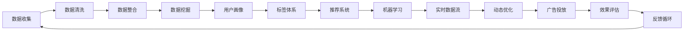

                 

# AI DMP 数据基建：如何利用数据提升营销效率

## 1. 背景介绍

### 1.1 问题由来

在数字经济时代，数据已成为企业最重要的资产之一。如何高效地利用数据，为营销、运营、决策等业务环节提供有力支撑，已成为企业数字化转型的关键问题。AI DMP（人工智能驱动的数据中台）作为一种新兴的数据基建技术，近年来在营销领域引起了广泛关注。AI DMP通过整合企业内外部数据，运用机器学习、数据挖掘等技术手段，构建统一、可交互的数据平台，从而提升数据利用效率，实现精准营销和智能决策。

### 1.2 问题核心关键点

AI DMP的核心价值在于其通过数据驱动的方式，为企业提供深入、全面的用户画像，优化营销策略，提升广告投放效果，降低营销成本。具体而言，AI DMP能够：

- 统一数据来源：整合企业内部各系统、各渠道的用户数据，形成统一的用户视图。
- 深度分析用户：通过机器学习算法对用户行为进行分析，挖掘用户兴趣、需求等深层信息。
- 精准定位受众：构建基于用户画像的标签体系，实现用户细分，提升广告投放精准度。
- 实时优化策略：实时监控广告投放效果，动态调整投放策略，优化广告ROI。
- 自动化流程：自动化处理数据清洗、数据建模、模型评估等复杂流程，降低人工干预，提高工作效率。

这些关键点展示了AI DMP在提升数据利用效率、优化营销效果方面的重要作用，以及其在数字化转型中的战略意义。

### 1.3 问题研究意义

AI DMP作为数字化转型的重要工具，其研究意义重大：

1. **提升营销效率**：通过数据分析和建模，AI DMP帮助企业精准定位用户，优化广告投放策略，提高广告ROI，从而大幅提升营销效率。
2. **降低营销成本**：减少人工干预和重复工作，提升数据利用效率，降低人力、时间和运营成本。
3. **增强决策支持**：通过深度分析用户行为，提供丰富的洞察，帮助企业制定科学、合理的决策，提升市场竞争力。
4. **支持多渠道营销**：整合多种数据来源，实现多渠道数据统一管理和共享，提升跨渠道营销效果。
5. **强化数据治理**：建立规范的数据治理流程，确保数据质量和数据安全，为企业数字化建设提供坚实基础。

## 2. 核心概念与联系

### 2.1 核心概念概述

为了更好地理解AI DMP的基本原理和架构，本节将介绍几个密切相关的核心概念：

- **AI DMP**：人工智能驱动的数据中台，通过整合多源数据，运用机器学习、数据挖掘等技术，构建用户画像和标签体系，支持精准营销和智能决策。
- **用户画像**：基于用户行为、属性等数据，构建详尽、全面的用户视图，帮助企业精准定位用户。
- **数据挖掘**：从大量数据中挖掘有价值的洞察和知识，用于用户行为预测、市场细分、趋势分析等。
- **推荐系统**：根据用户兴趣和行为，推荐相关产品或服务，提升用户体验和满意度。
- **机器学习**：通过算法模型，从数据中学习规律，用于用户预测、广告优化、情感分析等。
- **实时数据流**：通过实时数据采集和处理，实现数据的实时监控和分析，支持动态优化。

这些核心概念之间存在着紧密的联系，共同构成了AI DMP的工作框架。通过理解这些概念，我们可以更好地把握AI DMP的工作原理和优化方向。

### 2.2 核心概念原理和架构的 Mermaid 流程图



这个流程图展示了AI DMP从数据收集到广告投放的全过程，以及各个环节之间的依赖关系：

1. **数据收集**：通过多种渠道采集用户行为数据，包括线上点击、购买、搜索等行为，以及线下门店、问卷调查等数据。
2. **数据清洗**：对收集到的数据进行去重、去噪、标准化等处理，确保数据质量。
3. **数据整合**：将来自不同渠道、不同格式的数据进行统一，形成一个完整、统一的用户视图。
4. **数据挖掘**：运用机器学习算法对用户数据进行分析，挖掘出用户兴趣、行为等深层次信息。
5. **用户画像**：根据数据挖掘结果，构建详细的用户画像，包括基本信息、行为特征、兴趣偏好等。
6. **标签体系**：基于用户画像，构建标签体系，用于用户细分和精准营销。
7. **推荐系统**：根据用户画像和标签体系，推荐相关产品或服务，提升用户体验和满意度。
8. **机器学习**：运用机器学习算法，优化广告投放策略、预测用户行为、分析市场趋势等。
9. **实时数据流**：通过实时数据采集和处理，实现数据的实时监控和分析，支持动态优化。
10. **动态优化**：根据实时数据流，动态调整广告投放策略，优化广告ROI。
11. **广告投放**：基于动态优化结果，执行广告投放，实现精准营销。
12. **效果评估**：对广告投放效果进行评估，收集反馈信息，支持持续优化。
13. **反馈循环**：将评估结果反馈到数据收集和清洗环节，形成闭环，持续提升数据利用效率和广告效果。

通过理解这些核心概念，我们可以更好地掌握AI DMP的架构和工作流程。

## 3. 核心算法原理 & 具体操作步骤

### 3.1 算法原理概述

AI DMP的核心算法包括数据整合、用户画像构建、标签体系设计、推荐系统和实时数据流处理等多个部分。本节将详细讲解这些算法的原理和操作步骤。

AI DMP的算法流程可以概括为以下几个步骤：

1. **数据收集**：从多个渠道采集用户数据，包括线上点击、购买、搜索等行为数据，以及线下问卷、门店数据等。
2. **数据清洗**：对收集到的数据进行去重、去噪、标准化等处理，确保数据质量。
3. **数据整合**：将来自不同渠道、不同格式的数据进行统一，形成一个完整、统一的用户视图。
4. **数据挖掘**：运用机器学习算法对用户数据进行分析，挖掘出用户兴趣、行为等深层次信息。
5. **用户画像**：根据数据挖掘结果，构建详细的用户画像，包括基本信息、行为特征、兴趣偏好等。
6. **标签体系**：基于用户画像，构建标签体系，用于用户细分和精准营销。
7. **推荐系统**：根据用户画像和标签体系，推荐相关产品或服务，提升用户体验和满意度。
8. **机器学习**：运用机器学习算法，优化广告投放策略、预测用户行为、分析市场趋势等。
9. **实时数据流**：通过实时数据采集和处理，实现数据的实时监控和分析，支持动态优化。
10. **动态优化**：根据实时数据流，动态调整广告投放策略，优化广告ROI。
11. **广告投放**：基于动态优化结果，执行广告投放，实现精准营销。
12. **效果评估**：对广告投放效果进行评估，收集反馈信息，支持持续优化。

### 3.2 算法步骤详解

**Step 1: 数据收集**

AI DMP的数据收集环节需要从多个渠道获取用户数据，包括：

- **线上数据**：点击、购买、搜索等行为数据，社交媒体互动数据，网站访问数据等。
- **线下数据**：问卷调查、门店交易数据、电话记录等。

数据收集需要遵循数据隐私和安全的相关法规，确保用户隐私得到保护。

**Step 2: 数据清洗**

数据清洗的目的是去除噪声、填补缺失值、标准化数据格式等，确保数据质量。具体步骤包括：

- **去重去噪**：去除重复和无用的数据记录。
- **数据清洗**：处理缺失值、异常值和错误数据。
- **数据标准化**：统一数据格式和单位，确保数据的可比性和一致性。

数据清洗完成后，将形成一个完整、准确的用户数据集。

**Step 3: 数据整合**

数据整合是将来自不同渠道、不同格式的数据进行统一，形成一个完整、统一的用户视图。具体步骤如下：

- **数据对齐**：将不同来源的数据记录对齐，确保同一用户的不同数据记录一致。
- **数据融合**：将各数据源的字段进行融合，形成一个综合的用户视图。
- **数据校验**：对整合后的数据进行校验，确保数据一致性和完整性。

数据整合完成后，将形成一个全面、统一的用户数据集。

**Step 4: 数据挖掘**

数据挖掘是通过机器学习算法对用户数据进行分析，挖掘出用户兴趣、行为等深层次信息。具体步骤如下：

- **特征提取**：从用户数据中提取有意义的特征，如年龄、性别、兴趣偏好、行为习惯等。
- **算法选择**：选择合适的机器学习算法，如决策树、随机森林、聚类算法等。
- **模型训练**：使用训练集数据训练模型，得到用户兴趣、行为等预测结果。
- **模型评估**：对模型进行评估，选择性能最优的模型。

数据挖掘完成后，将得到一个全面、深入的用户行为和兴趣分析结果。

**Step 5: 用户画像构建**

用户画像是基于数据挖掘结果，构建详尽、全面的用户视图，帮助企业精准定位用户。具体步骤如下：

- **用户细分**：根据用户行为、属性等数据，将用户分为不同的细分群体。
- **画像构建**：构建详细的用户画像，包括基本信息、行为特征、兴趣偏好等。
- **画像优化**：定期更新用户画像，确保画像的准确性和实时性。

用户画像构建完成后，将得到一个全面、详细、实时更新的用户视图。

**Step 6: 标签体系设计**

标签体系是基于用户画像，构建标签体系，用于用户细分和精准营销。具体步骤如下：

- **标签设计**：设计具有实际意义的标签，如年龄、性别、兴趣偏好、行为习惯等。
- **标签体系构建**：将用户画像中的数据映射到不同的标签上，形成一个完整的标签体系。
- **标签优化**：根据广告投放效果和用户反馈，动态调整标签体系，确保标签的有效性。

标签体系构建完成后，将形成一个全面、准确、动态的标签体系。

**Step 7: 推荐系统构建**

推荐系统是基于用户画像和标签体系，推荐相关产品或服务，提升用户体验和满意度。具体步骤如下：

- **推荐算法选择**：选择合适的推荐算法，如协同过滤、基于内容的推荐等。
- **推荐模型训练**：使用训练集数据训练推荐模型，得到用户推荐结果。
- **推荐结果优化**：根据用户反馈和点击率等指标，优化推荐算法和模型。

推荐系统构建完成后，将能够根据用户画像和标签体系，精准推荐相关产品或服务。

**Step 8: 机器学习优化**

机器学习是运用机器学习算法，优化广告投放策略、预测用户行为、分析市场趋势等。具体步骤如下：

- **广告投放策略优化**：根据用户行为数据，优化广告投放策略，提升广告ROI。
- **用户行为预测**：使用机器学习算法预测用户行为，提高广告的个性化和精准度。
- **市场趋势分析**：运用机器学习算法分析市场趋势，指导业务决策。

机器学习优化完成后，将得到一个高效、精准的广告投放策略和市场分析结果。

**Step 9: 实时数据流处理**

实时数据流是通过实时数据采集和处理，实现数据的实时监控和分析，支持动态优化。具体步骤如下：

- **数据采集**：实时采集用户行为数据，如点击、购买、搜索等行为数据。
- **数据处理**：对实时数据进行清洗、整合和分析，确保数据的实时性和准确性。
- **实时监控**：实时监控广告投放效果，支持动态优化。

实时数据流处理完成后，将能够实时监控广告投放效果，支持动态优化。

**Step 10: 动态优化**

动态优化是根据实时数据流，动态调整广告投放策略，优化广告ROI。具体步骤如下：

- **效果评估**：对广告投放效果进行评估，收集反馈信息。
- **优化策略**：根据效果评估结果，动态调整广告投放策略。
- **效果监控**：实时监控优化效果，确保广告ROI最大化。

动态优化完成后，将能够动态调整广告投放策略，优化广告ROI。

**Step 11: 广告投放**

广告投放是基于动态优化结果，执行广告投放，实现精准营销。具体步骤如下：

- **投放策略制定**：根据动态优化结果，制定精准的广告投放策略。
- **广告投放执行**：使用广告投放平台执行广告投放策略。
- **投放效果监控**：实时监控广告投放效果，确保广告效果最大化。

广告投放完成后，将能够精准投放广告，实现精准营销。

**Step 12: 效果评估**

效果评估是对广告投放效果进行评估，收集反馈信息，支持持续优化。具体步骤如下：

- **效果评估**：对广告投放效果进行评估，收集反馈信息。
- **优化建议**：根据效果评估结果，提出优化建议。
- **反馈循环**：将评估结果反馈到数据收集和清洗环节，形成闭环，持续提升数据利用效率和广告效果。

效果评估完成后，将能够对广告投放效果进行评估，支持持续优化。

### 3.3 算法优缺点

AI DMP的算法具有以下优点：

- **数据整合能力强**：能够整合企业内部各系统、各渠道的用户数据，形成一个全面、统一的用户视图。
- **用户画像准确**：通过机器学习算法对用户数据进行分析，挖掘出用户兴趣、行为等深层次信息，构建详细的用户画像。
- **标签体系全面**：基于用户画像，构建标签体系，用于用户细分和精准营销，提高广告投放的精准度。
- **推荐系统个性化**：根据用户画像和标签体系，推荐相关产品或服务，提升用户体验和满意度。
- **机器学习高效**：运用机器学习算法，优化广告投放策略、预测用户行为、分析市场趋势等，提升营销效率和效果。
- **实时数据流及时**：通过实时数据采集和处理，实现数据的实时监控和分析，支持动态优化。

同时，AI DMP的算法也存在以下缺点：

- **数据隐私问题**：收集和整合大量用户数据，可能涉及用户隐私问题，需要严格遵循数据隐私法规。
- **数据质量要求高**：数据清洗和整合环节要求数据质量高，存在数据清洗难度大、数据标准不一致等问题。
- **算法复杂度高**：数据挖掘和机器学习算法复杂，需要强大的算法支持和计算资源。
- **实时处理难度大**：实时数据流处理需要高并发的计算能力和稳定的网络环境，存在技术实现难度大等问题。

尽管存在这些局限性，但AI DMP在提升数据利用效率、优化营销效果方面的优势仍然明显，具有广阔的应用前景。

### 3.4 算法应用领域

AI DMP在以下几个领域得到了广泛应用：

- **电商**：通过用户画像和推荐系统，提升电商平台的个性化推荐和广告投放效果。
- **广告**：通过标签体系和实时数据流处理，优化广告投放策略，提升广告ROI。
- **金融**：通过用户画像和市场趋势分析，优化金融产品的推荐和广告投放策略。
- **娱乐**：通过用户画像和推荐系统，提升娱乐平台的内容推荐和广告投放效果。
- **医疗**：通过用户画像和行为预测，优化医疗广告的投放和精准营销。

以上应用领域展示了AI DMP的强大能力，以及在数字化转型中的战略意义。

## 4. 数学模型和公式 & 详细讲解 & 举例说明

### 4.1 数学模型构建

AI DMP的数学模型主要包括用户画像构建、推荐系统、机器学习等部分。本节将详细讲解这些数学模型的构建。

**用户画像构建**：

用户画像是基于用户行为、属性等数据，构建详尽、全面的用户视图。其数学模型可以表示为：

$$
P_i = \{ (a_i, b_i, c_i) \}
$$

其中 $P_i$ 为第 $i$ 个用户画像，$a_i$ 为用户基本信息，$b_i$ 为用户行为特征，$c_i$ 为用户兴趣偏好。

**推荐系统**：

推荐系统是基于用户画像和标签体系，推荐相关产品或服务。其数学模型可以表示为：

$$
R_i = f(P_i, L_i)
$$

其中 $R_i$ 为用户 $i$ 的推荐结果，$f$ 为推荐函数，$L_i$ 为用户 $i$ 的标签体系。

**机器学习优化**：

机器学习是运用机器学习算法，优化广告投放策略、预测用户行为、分析市场趋势等。其数学模型可以表示为：

$$
A^* = \arg\min_A \sum_i \ell(A_i, R_i)
$$

其中 $A$ 为广告投放策略，$\ell$ 为损失函数，$A_i$ 为第 $i$ 个广告策略，$R_i$ 为第 $i$ 个推荐结果。

### 4.2 公式推导过程

**用户画像构建**：

用户画像的构建过程主要涉及数据的收集、清洗、整合和分析。其公式推导过程如下：

- **数据收集**：
  $$
  D_{data} = \{ (x_i, y_i) \}_{i=1}^N
  $$

- **数据清洗**：
  $$
  D_{clean} = \{ (x_i', y_i') \}_{i=1}^N
  $$

- **数据整合**：
  $$
  D_{integrated} = \bigcup_{i=1}^N \{ (x_i', y_i') \}
  $$

- **数据挖掘**：
  $$
  F_i = f(D_i)
  $$

其中 $F_i$ 为用户 $i$ 的特征向量，$f$ 为特征提取函数。

- **用户画像构建**：
  $$
  P_i = g(F_i)
  $$

其中 $P_i$ 为用户 $i$ 的画像，$g$ 为画像构建函数。

**推荐系统**：

推荐系统的构建过程主要涉及数据的整合、特征提取和推荐算法的选择。其公式推导过程如下：

- **数据整合**：
  $$
  D_{integrated} = \bigcup_{i=1}^N \{ (x_i', y_i') \}
  $$

- **特征提取**：
  $$
  F_i = f(D_i)
  $$

- **推荐算法选择**：
  $$
  \begin{aligned}
  R_i = f(P_i, L_i) = g(F_i, L_i)
  \end{aligned}
  $$

其中 $R_i$ 为用户 $i$ 的推荐结果，$f$ 为推荐函数，$g$ 为推荐算法。

**机器学习优化**：

机器学习的优化过程主要涉及模型的训练、评估和优化。其公式推导过程如下：

- **模型训练**：
  $$
  \begin{aligned}
  \hat{A} = \arg\min_A \sum_i \ell(A_i, R_i)
  \end{aligned}
  $$

- **模型评估**：
  $$
  E_i = \hat{A}(x_i')
  $$

- **模型优化**：
  $$
  \begin{aligned}
  \hat{A} = \arg\min_A \sum_i \ell(A_i, R_i)
  \end{aligned}
  $$

其中 $\hat{A}$ 为优化后的广告策略，$\ell$ 为损失函数，$x_i'$ 为用户 $i$ 的特征向量，$R_i$ 为用户 $i$ 的推荐结果。

### 4.3 案例分析与讲解

**电商平台的个性化推荐**：

电商平台通过用户画像和推荐系统，提升个性化推荐和广告投放效果。具体步骤包括：

- **数据收集**：收集用户浏览、点击、购买等行为数据，以及用户基本信息数据。
- **数据清洗**：对数据进行去重、去噪、标准化等处理，确保数据质量。
- **数据整合**：将用户行为数据和基本信息数据整合，形成一个完整、统一的用户视图。
- **数据挖掘**：运用机器学习算法对用户数据进行分析，挖掘出用户兴趣、行为等深层次信息。
- **用户画像构建**：根据数据挖掘结果，构建详细的用户画像，包括基本信息、行为特征、兴趣偏好等。
- **标签体系设计**：基于用户画像，构建标签体系，用于用户细分和精准营销。
- **推荐系统构建**：根据用户画像和标签体系，推荐相关产品或服务，提升用户体验和满意度。
- **机器学习优化**：运用机器学习算法，优化广告投放策略、预测用户行为、分析市场趋势等，提升营销效率和效果。
- **实时数据流处理**：通过实时数据采集和处理，实现数据的实时监控和分析，支持动态优化。
- **动态优化**：根据实时数据流，动态调整广告投放策略，优化广告ROI。
- **广告投放**：基于动态优化结果，执行广告投放，实现精准营销。
- **效果评估**：对广告投放效果进行评估，收集反馈信息，支持持续优化。

## 5. 项目实践：代码实例和详细解释说明

### 5.1 开发环境搭建

在进行AI DMP项目开发前，我们需要准备好开发环境。以下是使用Python进行Pandas开发的环境配置流程：

1. 安装Anaconda：从官网下载并安装Anaconda，用于创建独立的Python环境。

2. 创建并激活虚拟环境：
```bash
conda create -n admp-env python=3.8 
conda activate admp-env
```

3. 安装Pandas：
```bash
pip install pandas
```

4. 安装NumPy、Matplotlib、Jupyter Notebook等常用工具包：
```bash
pip install numpy matplotlib jupyter notebook ipython
```

完成上述步骤后，即可在`admp-env`环境中开始AI DMP项目开发。

### 5.2 源代码详细实现

这里我们以电商平台的用户画像构建为例，给出使用Pandas库构建用户画像的PyTorch代码实现。

首先，定义用户画像的数据结构：

```python
import pandas as pd

# 定义用户画像的数据结构
class UserProfile:
    def __init__(self, user_id, age, gender, interests):
        self.user_id = user_id
        self.age = age
        self.gender = gender
        self.interests = interests
```

然后，定义数据读取和处理函数：

```python
# 定义数据读取函数
def read_user_data(file_path):
    data = pd.read_csv(file_path)
    return data

# 定义数据处理函数
def process_user_data(data):
    # 去重去噪
    data.drop_duplicates(inplace=True)
    data.dropna(inplace=True)
    # 标准化数据
    data['age'] = data['age'].apply(lambda x: 0 if x is None else x)
    data['interests'] = data['interests'].apply(lambda x: 'Unknown' if x is None else x)
    # 数据类型转换
    data['age'] = data['age'].astype(int)
    data['interests'] = data['interests'].astype(str)
    # 数据合并
    data = data.merge(age_col, on='user_id', how='left')
    data = data.merge(interests_col, on='user_id', how='left')
    return data

# 定义数据存储函数
def save_user_data(data, file_path):
    data.to_csv(file_path, index=False)
```

接着，定义用户画像构建函数：

```python
# 定义用户画像构建函数
def build_user_profiles(data):
    user_profiles = []
    for user_id, row in data.iterrows():
        user_profile = UserProfile(user_id, row['age'], row['gender'], row['interests'])
        user_profiles.append(user_profile)
    return user_profiles
```

最后，启动用户画像构建流程：

```python
# 读取用户数据
data = read_user_data('user_data.csv')

# 处理用户数据
data = process_user_data(data)

# 构建用户画像
user_profiles = build_user_profiles(data)

# 保存用户画像
save_user_data(user_profiles, 'user_profiles.csv')
```

以上就是使用Pandas库构建用户画像的完整代码实现。可以看到，Pandas库提供了强大的数据处理和分析功能，能够高效处理大规模用户数据，生成详尽的用户画像。

### 5.3 代码解读与分析

让我们再详细解读一下关键代码的实现细节：

**UserProfile类**：
- `__init__`方法：初始化用户画像的各个属性。

**read_user_data函数**：
- 从指定文件中读取用户数据，返回Pandas DataFrame格式的数据集。

**process_user_data函数**：
- 对数据进行去重去噪、标准化等处理，确保数据质量。
- 将年龄、兴趣等字段的数据类型转换为整数或字符串。
- 将用户数据与年龄、兴趣等字段进行合并，形成一个完整的用户视图。

**build_user_profiles函数**：
- 遍历数据集中的每一行，构建一个UserProfile对象，形成完整的用户画像列表。

**save_user_data函数**：
- 将用户画像保存到指定文件中。

可以看到，通过使用Pandas库，我们可以轻松地进行数据清洗、数据整合、数据处理等操作，生成详尽、全面的用户画像，为AI DMP项目提供数据支撑。

当然，工业级的系统实现还需考虑更多因素，如数据的实时更新、分布式计算、数据安全等。但核心的数据处理和画像构建流程基本与此类似。

## 6. 实际应用场景

### 6.1 电商平台的用户画像构建

在电商平台中，用户画像的构建对于个性化推荐和广告投放至关重要。通过构建详尽的用户画像，电商平台能够精准地推荐相关产品，提升用户体验和满意度。

具体而言，电商平台可以通过以下步骤实现用户画像构建：

- **数据收集**：收集用户浏览、点击、购买等行为数据，以及用户基本信息数据。
- **数据清洗**：对数据进行去重、去噪、标准化等处理，确保数据质量。
- **数据整合**：将用户行为数据和基本信息数据整合，形成一个完整、统一的用户视图。
- **数据挖掘**：运用机器学习算法对用户数据进行分析，挖掘出用户兴趣、行为等深层次信息。
- **用户画像构建**：根据数据挖掘结果，构建详细的用户画像，包括基本信息、行为特征、兴趣偏好等。
- **标签体系设计**：基于用户画像，构建标签体系，用于用户细分和精准营销。
- **推荐系统构建**：根据用户画像和标签体系，推荐相关产品或服务，提升用户体验和满意度。
- **机器学习优化**：运用机器学习算法，优化广告投放策略、预测用户行为、分析市场趋势等，提升营销效率和效果。
- **实时数据流处理**：通过实时数据采集和处理，实现数据的实时监控和分析，支持动态优化。
- **动态优化**：根据实时数据流，动态调整广告投放策略，优化广告ROI。
- **广告投放**：基于动态优化结果，执行广告投放，实现精准营销。
- **效果评估**：对广告投放效果进行评估，收集反馈信息，支持持续优化。

通过用户画像构建，电商平台能够全面、深入地了解用户需求和行为，精准地进行个性化推荐和广告投放，从而提升用户粘性和满意度。

### 6.2 金融行业的用户画像构建

在金融行业中，用户画像的构建对于精准营销、风险控制和客户管理至关重要。通过构建详尽的用户画像，金融机构能够更好地理解用户需求，制定合理的营销策略，控制风险。

具体而言，金融机构可以通过以下步骤实现用户画像构建：

- **数据收集**：收集用户账户、交易记录、理财行为等数据。
- **数据清洗**：对数据进行去重、去噪、标准化等处理，确保数据质量。
- **数据整合**：将用户账户数据和交易记录数据整合，形成一个完整、统一的用户视图。
- **数据挖掘**：运用机器学习算法对用户数据进行分析，挖掘出用户风险偏好、理财习惯等深层次信息。
- **用户画像构建**：根据数据挖掘结果，构建详细的用户画像，包括基本信息、交易行为、理财偏好等。
- **标签体系设计**：基于用户画像，构建标签体系，用于用户细分和精准营销。
- **推荐系统构建**：根据用户画像和标签体系，推荐相关金融产品或服务，提升用户体验和满意度。
- **机器学习优化**：运用机器学习算法，优化营销策略、预测用户风险、分析市场趋势等，提升营销效率和效果。
- **实时数据流处理**：通过实时数据采集和处理，实现数据的实时监控和分析，支持动态优化。
- **动态优化**：根据实时数据流，动态调整营销策略，优化营销效果。
- **营销投放**：基于动态优化结果，执行营销活动，实现精准营销。
- **效果评估**：对营销效果进行评估，收集反馈信息，支持持续优化。

通过用户画像构建，金融机构能够全面、深入地了解用户需求和行为，精准地进行金融产品推荐和营销，提升用户满意度和忠诚度，同时控制风险，确保金融稳定运行。

### 6.3 娱乐行业的用户画像构建

在娱乐行业中，用户画像的构建对于内容推荐和广告投放至关重要。通过构建详尽的用户画像，娱乐平台能够精准地推荐相关内容，提升用户体验和满意度。

具体而言，娱乐平台可以通过以下步骤实现用户画像构建：

- **数据收集**：收集用户观看、评分、评论等行为数据，以及用户基本信息数据。
- **数据清洗**：对数据进行去重、去噪、标准化等处理，确保数据质量。
- **数据整合**：将用户观看数据和基本信息数据整合，形成一个完整、统一的用户视图。
- **数据挖掘**：运用机器学习算法对用户数据进行分析，挖掘出用户兴趣、偏好等深层次信息。
- **用户画像构建**：根据数据挖掘结果，构建详细的用户画像，包括基本信息、行为特征、兴趣偏好等。
- **标签体系设计**：基于用户画像，构建标签体系，用于用户细分和精准营销。
- **推荐系统构建**：根据用户画像和标签体系，推荐相关内容或广告，提升用户体验和满意度。
- **机器学习优化**：运用机器学习算法，优化广告投放策略、预测用户行为、分析市场趋势等，提升营销效率和效果。
- **实时数据流处理**：通过实时数据采集和处理，实现数据的实时监控和分析，支持动态优化。
- **动态优化**：根据实时数据流，动态调整广告投放策略，优化广告ROI。
- **内容投放**：基于动态优化结果，执行内容投放，实现精准营销。
- **效果评估**：对内容投放效果进行评估，收集反馈信息，支持持续优化。

通过用户画像构建，娱乐平台能够全面、深入地了解用户需求和行为，精准地进行内容推荐和广告投放，提升用户体验和满意度，增加用户粘性。

## 7. 工具和资源推荐

### 7.1 学习资源推荐

为了帮助开发者系统掌握AI DMP的原理和实践技巧，这里推荐一些优质的学习资源：

1. 《数据中台建设与实践》系列博文：由数据中台技术专家撰写，深入浅出地介绍了数据中台的概念、原理和实践方法。

2. 《数据挖掘与统计学习》课程：斯坦福大学开设的统计学明星课程，介绍了数据挖掘的基本概念和常用算法。

3. 《数据科学入门与实践》书籍：提供了从数据处理到机器学习的全面指南，适合初学者入门。

4. Kaggle平台：一个数据科学竞赛平台，提供大量的数据集和竞赛项目，适合数据科学爱好者进行实战练习。

5. GitHub开源项目：GitHub上有许多数据中台和AI DMP的开源项目，可以提供丰富的实践案例和代码参考。

通过对这些资源的学习实践，相信你一定能够系统掌握AI DMP的原理和实践技巧，并用于解决实际的AI DMP问题。

### 7.2 开发工具推荐

高效的开发离不开优秀的工具支持。以下是几款用于AI DMP开发常用的工具：

1. Jupyter Notebook：一个交互式的开发环境，适合数据探索、模型训练和结果展示。

2. PyCharm：一个强大的IDE，支持多种语言和框架，适合Python编程。

3. Visual Studio Code：一个轻量级的IDE，支持多种语言和框架，适合快速开发和调试。

4. Pandas：一个强大的数据处理库，适合处理大规模数据集，提供丰富的数据处理和分析功能。

5. Scikit-learn：一个强大的机器学习库，提供丰富的机器学习算法和工具，适合模型训练和评估。

6. TensorFlow：一个强大的深度学习框架，支持多种深度学习模型和算法，适合大规模工程应用。

合理利用这些工具，可以显著提升AI DMP的开发效率，加快创新迭代的步伐。

### 7.3 相关论文推荐

AI DMP作为数字化转型的重要工具，其研究意义重大。以下是几篇奠基性的相关论文，推荐阅读：

1. 《数据中台：数据治理新范式》：介绍了数据中台的概念、原理和实践方法，提供了数据治理的全景视角。

2. 《基于用户画像的个性化推荐系统》：介绍了用户画像的概念、构建方法和推荐系统，提供了用户画像驱动的推荐系统框架。

3. 《数据驱动的智能广告投放优化》：介绍了数据驱动的广告投放优化方法，提供了广告投放优化的系统框架。

4. 《机器学习在数据挖掘中的应用》：介绍了机器学习在数据挖掘中的基本原理和应用场景，提供了数据挖掘的深度学习框架。

5. 《实时数据流处理技术》：介绍了实时数据流处理的概念、技术和应用场景，提供了实时数据流处理的系统框架。

这些论文代表了大数据和AI DMP的研究前沿，通过学习这些前沿成果，可以帮助研究者把握学科前进方向，激发更多的创新灵感。

## 8. 总结：未来发展趋势与挑战

### 8.1 研究成果总结

AI DMP作为数字化转型的重要工具，近年来取得了显著的研究成果：

- 数据整合能力增强：AI DMP能够整合企业内部各系统、各渠道的用户数据，形成一个全面、统一的用户视图。
- 用户画像准确性提高：AI DMP通过机器学习算法对用户数据进行分析，挖掘出用户兴趣、行为等深层次信息，构建详细的用户画像。
- 推荐系统个性化提升：AI DMP根据用户画像和标签体系，推荐相关产品或服务，提升用户体验和满意度。
- 机器学习优化效果显著：AI DMP运用机器学习算法，优化广告投放策略、预测用户行为、分析市场趋势等，提升营销效率和效果。
- 实时数据流处理能力增强：AI DMP通过实时数据采集和处理，实现数据的实时监控和分析，支持动态优化。

这些研究成果展示了AI DMP在提升数据利用效率、优化营销效果方面的强大能力，为数字化转型提供了重要支撑。

### 8.2 未来发展趋势

展望未来，AI DMP将呈现以下几个发展趋势：

1. **数据整合能力更强**：未来AI DMP将能够整合更多数据源，涵盖线上、线下、社交等多渠道数据，形成一个更加全面、统一的用户视图。
2. **用户画像更准确**：未来AI DMP将通过更先进的机器学习算法，挖掘出更多深层次的用户信息，构建更加详尽、准确的用户画像。
3. **推荐系统更个性化**：未来AI DMP将根据用户画像和行为数据，提供更加个性化、精准的推荐服务，提升用户体验和满意度。
4. **机器学习更高效**：未来AI DMP将运用更高效的算法和计算资源，优化广告投放策略、预测用户行为、分析市场趋势等，提升营销效率和效果。
5. **实时数据流处理更及时**：未来AI DMP将通过更高效的数据采集和处理技术，实现数据的实时监控和分析，支持动态优化。
6. **多模态数据融合**：未来AI DMP将融合多种数据模态，如视觉、语音、文本等，实现多模态数据整合和分析。
7. **持续学习机制**：未来AI DMP将引入持续学习机制，不断从新数据中学习，保持模型的时效性和适应性。

以上趋势展示了AI DMP未来发展的广阔前景，将进一步提升数据利用效率和营销效果。

### 8.3 面临的挑战

尽管AI DMP在数字化转型中具有重要的战略意义，但在实际应用中也面临诸多挑战：

1. **数据隐私问题**：收集和整合大量用户数据，可能涉及用户隐私问题，需要严格遵循数据隐私法规。
2. **数据质量要求高**：数据清洗和整合环节要求数据质量高，存在数据清洗难度大、数据标准不一致等问题。
3. **算法复杂度高**：数据挖掘和机器学习算法复杂，需要强大的算法支持和计算资源。
4. **实时处理难度大**：实时数据流处理需要高并发的计算能力和稳定的网络环境，存在技术实现难度大等问题。
5. **模型解释性不足**：AI DMP的模型往往是"黑盒"系统，难以解释其内部工作机制和决策逻辑，存在可解释性不足的问题。

尽管存在这些挑战，但通过不断优化数据采集、清洗、整合和分析流程，引入先进的机器学习算法，优化实时数据流处理技术，AI DMP将逐步克服这些难题，实现更高效、更精准、更智能的数据利用和营销优化。

### 8.4 研究展望

未来AI DMP的研究方向主要集中在以下几个方面：

1. **数据隐私保护**：研究如何在数据收集和处理过程中保护用户隐私，遵循相关法规，确保数据安全。
2. **数据质量提升**：研究如何提高数据清洗和整合的自动化水平，减少人工干预，提高数据质量。
3. **算法效率优化**：研究如何引入高效的算法和计算资源，优化数据挖掘和机器学习算法的效率，降低计算成本。
4. **实时处理技术**：研究如何优化实时数据流处理的性能，降低技术实现难度，实现数据的实时监控和分析。
5. **模型解释性增强**：研究如何增强AI DMP模型的可解释性，提高模型的透明性和可理解性，确保模型决策的合理性。
6. **多模态数据融合**：研究如何融合多种数据模态，提升多模态数据整合和分析的效果，实现更全面、准确的用户画像。
7. **持续学习机制**：研究如何引入持续学习机制，不断从新数据中学习，保持模型的时效性和适应性。

这些研究方向将进一步推动AI DMP的发展，提升数据利用效率和营销效果，为数字化转型提供更加坚实的技术基础。

## 9. 附录：常见问题与解答

**Q1：AI DMP和传统数据中台有什么区别？**

A: AI DMP相较于传统数据中台，具有以下几个区别：

- **数据整合能力更强**：AI DMP能够整合更多数据源，涵盖线上、线下、社交等多渠道数据，形成一个更加全面、统一的用户视图。
- **数据利用效率更高**：AI DMP通过机器学习算法对用户数据进行分析，挖掘出用户兴趣、行为等深层次信息，构建详细的用户画像，提升数据利用效率。
- **实时处理能力更强**：AI DMP通过实时数据采集和处理，实现数据的实时监控和分析，支持动态优化。
- **推荐系统更精准**：AI DMP根据用户画像和标签体系，推荐相关产品或服务，提升用户体验和满意度。
- **算法复杂度更高**：AI DMP引入机器学习、数据挖掘等算法，增加了数据处理的复杂度。

这些区别展示了AI DMP在数据利用效率、营销效果、实时处理等方面的优势。

**Q2：AI DMP如何保护用户隐私？**

A: AI DMP在数据收集和处理过程中，需要严格遵循数据隐私法规，保护用户隐私。具体措施包括：

- **数据匿名化**：对用户数据进行匿名化处理，去除可以识别个人身份的信息。
- **数据加密**：对数据传输和存储进行加密，防止数据泄露。
- **权限控制**：对数据访问进行权限控制，确保只有授权人员可以访问敏感数据。
- **隐私协议**：与用户签订隐私协议，明确数据使用范围和保护措施。
- **合规审计**：定期进行数据合规审计，确保数据处理符合法规要求。

这些措施能够有效保护用户隐私，确保数据安全。

**Q3：AI DMP的实时数据流处理技术有哪些？**

A: AI DMP的实时数据流处理技术主要包括：

- **数据采集技术**：通过多种渠道实时采集数据，如点击流数据、搜索日志、社交网络数据等。
- **数据存储技术**：使用分布式存储技术，如Hadoop、Spark等，确保数据的高可用性和高扩展性。
- **数据处理技术**：使用

