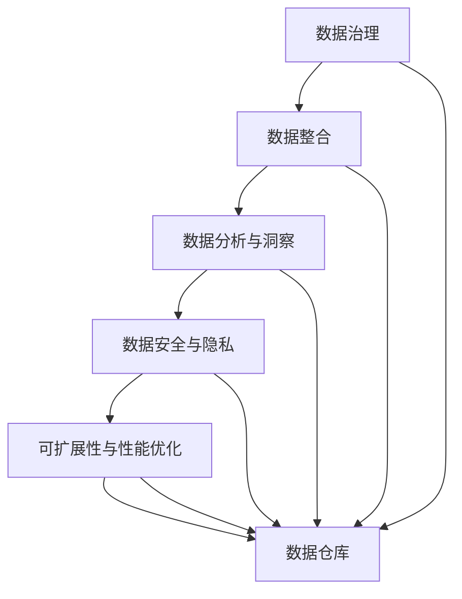

                 

# AI DMP 数据基建：数据分析与洞察

> 关键词：AI DMP, 数据基建, 数据分析, 数据洞察, 数据工程, 数据科学

## 1. 背景介绍

### 1.1 问题由来
在数字化转型加速的今天，数据驱动的决策日益成为企业竞争的关键。AI DMP（人工智能数据管理平台）作为数据驱动决策的重要工具，正迅速成为数字化时代的核心基础设施。它通过智能算法对海量数据进行高效分析，帮助企业实现业务智能和客户洞察，从而提升决策效率和竞争力。然而，随着数据量的爆炸式增长和业务场景的复杂化，传统的数据基建和分析方法已难以满足需求，迫切需要创新和升级。

### 1.2 问题核心关键点
AI DMP 数据基建的核心在于其能够对海量数据进行高效分析和洞察。其核心关键点包括：

1. **数据治理**：确保数据的质量和一致性，避免数据孤岛和冗余。
2. **数据整合**：将来自不同渠道的数据统一管理和融合，实现数据湖的构建。
3. **数据分析与洞察**：利用先进的分析技术和算法，挖掘数据中的深层次洞察，支持决策制定。
4. **数据安全与隐私**：保护用户隐私，确保数据在处理和传输过程中的安全。
5. **可扩展性与性能优化**：支持大规模数据处理，同时保持系统的高效和稳定。

AI DMP 的目标是通过数据治理、数据整合、数据分析与洞察、数据安全和可扩展性等关键组件，实现数据的全面管理和深度分析，为企业提供高质量的数据资产和业务洞察。

## 2. 核心概念与联系

### 2.1 核心概念概述

为了更好地理解 AI DMP 数据基建，本节将介绍几个密切相关的核心概念：

- **数据治理**：指对数据的收集、存储、管理和使用的标准化和规范化过程，确保数据的质量和一致性。
- **数据整合**：指将来自不同源的数据进行清洗、转换和集成，形成统一的数据视图。
- **数据分析与洞察**：指通过数据挖掘、机器学习等技术，从数据中提取有价值的洞察和知识，支持业务决策。
- **数据安全与隐私**：指在数据处理和传输过程中，保护用户隐私和数据安全，防止数据泄露和滥用。
- **可扩展性与性能优化**：指在处理大规模数据时，保证系统的可扩展性和性能优化，避免性能瓶颈。

这些概念之间相互联系，共同构成 AI DMP 数据基建的核心框架。

### 2.2 核心概念原理和架构的 Mermaid 流程图



这个流程图展示了 AI DMP 数据基建的核心组件及其相互关系：

1. 数据治理是基础，确保数据的质量和一致性。
2. 数据整合将不同源的数据融合，形成统一的数据视图。
3. 数据分析与洞察利用先进技术从数据中提取价值。
4. 数据安全和隐私保护用户数据，防止滥用。
5. 可扩展性和性能优化确保系统的高效和稳定。

所有这些组件共同作用，支持数据仓库的构建，为企业提供高质量的数据资产和业务洞察。

## 3. 核心算法原理 & 具体操作步骤
### 3.1 算法原理概述

AI DMP 数据基建的算法原理主要围绕数据治理、数据整合、数据分析与洞察、数据安全和可扩展性等关键组件展开。其中，数据分析与洞察是核心，主要通过以下算法和技术实现：

- **数据清洗**：通过去除噪声和异常值，提升数据质量。
- **数据转换**：通过映射和聚合，将数据转换为适合分析的格式。
- **特征工程**：通过特征选择和构造，提升数据表达能力。
- **机器学习与深度学习**：利用算法模型对数据进行分类、回归、聚类等分析，挖掘数据中的洞察。
- **自然语言处理**：通过文本分析技术，提取和分析文本数据中的信息。

这些算法和技术通过协同工作，实现数据的全面管理和深度分析。

### 3.2 算法步骤详解

AI DMP 数据基建的算法步骤主要分为以下几个步骤：

**Step 1: 数据收集与治理**
- 收集来自不同渠道的数据，确保数据的质量和一致性。
- 清洗数据，去除噪声和异常值。
- 进行数据标准化，确保数据的一致性。

**Step 2: 数据整合**
- 对不同来源的数据进行清洗和转换，将其集成到一个统一的数据视图。
- 利用 ETL 工具，将数据从源系统抽取、转换和加载到数据仓库。
- 利用数据湖技术，支持大规模数据的存储和管理。

**Step 3: 数据分析与洞察**
- 进行特征工程，提取和构造有意义的特征。
- 应用机器学习和深度学习算法，对数据进行分类、回归、聚类等分析。
- 利用自然语言处理技术，提取和分析文本数据中的信息。

**Step 4: 数据安全与隐私**
- 对敏感数据进行加密和脱敏，防止数据泄露。
- 实施访问控制和审计机制，确保数据的安全性和隐私性。

**Step 5: 可扩展性与性能优化**
- 设计可扩展的数据架构，支持大规模数据处理。
- 利用缓存、分布式计算等技术，提升系统的性能和效率。
- 进行性能监控和调优，确保系统的稳定性和可靠性。

这些步骤构成了 AI DMP 数据基建的核心算法流程，通过协同工作，实现数据的全面管理和深度分析。

### 3.3 算法优缺点

AI DMP 数据基建的算法具有以下优点：

1. **高效性**：通过数据清洗、转换和集成，提高了数据的质量和一致性。
2. **可扩展性**：支持大规模数据的存储和管理，适应不同规模的企业需求。
3. **数据分析能力强**：利用机器学习和深度学习算法，可以从数据中挖掘出深层次的洞察和知识。
4. **隐私保护**：通过数据加密和脱敏，保护用户隐私和数据安全。

然而，AI DMP 数据基建的算法也存在一些缺点：

1. **复杂性高**：涉及数据治理、数据整合、数据分析与洞察、数据安全和可扩展性等多个组件，需要综合考虑。
2. **技术门槛高**：需要掌握数据治理、数据整合、数据分析与洞察、数据安全和可扩展性等多项技术。
3. **数据质量依赖**：数据的质量和一致性直接影响分析结果的准确性和可靠性。

尽管存在这些局限性，AI DMP 数据基建通过综合应用多项技术，仍能够实现数据的全面管理和深度分析，为企业提供高质量的数据资产和业务洞察。

### 3.4 算法应用领域

AI DMP 数据基建在多个领域都有广泛的应用，例如：

1. **市场营销**：通过分析客户行为数据，实现精准营销和客户洞察。
2. **金融风控**：利用数据分析和洞察，评估风险，制定风险管理策略。
3. **供应链管理**：通过数据分析，优化供应链流程，提高效率和降低成本。
4. **人力资源管理**：利用数据分析，优化招聘和员工绩效评估。
5. **医疗健康**：通过数据分析，优化医疗资源配置和疾病预测。

这些应用展示了 AI DMP 数据基建在各行各业中的广泛应用，进一步验证了其在数据驱动决策中的重要价值。

## 4. 数学模型和公式 & 详细讲解 & 举例说明

### 4.1 数学模型构建

AI DMP 数据基建的数学模型主要围绕数据治理、数据整合、数据分析与洞察、数据安全和可扩展性等组件展开。以下以数据清洗为例，构建数学模型。

假设原始数据集为 $D=\{x_i\}_{i=1}^N$，其中 $x_i$ 为样本，$N$ 为样本总数。设 $X$ 为数据矩阵，$y$ 为标签向量。

**数据清洗的目标**：去除噪声和异常值，提升数据质量。

**数据清洗的数学模型**：

$$
\hat{X} = \text{clean}(X, \epsilon)
$$

其中 $\epsilon$ 为噪声容忍度，$\hat{X}$ 为清洗后的数据矩阵。

### 4.2 公式推导过程

**数据清洗的数学推导**：

1. **异常值检测**：
   - 首先，利用统计方法检测异常值，如标准差、四分位数等。
   - 设 $X_{\text{out}}$ 为检测到的异常值，则 $X_{\text{out}} = \{x_i|x_i \in X\}$。
   - 定义异常值的容忍度 $\epsilon$，根据容忍度进行异常值剔除，得到清洗后的数据矩阵 $\hat{X}$。

2. **噪声去除**：
   - 利用数据平滑方法去除噪声，如均值滤波、中值滤波等。
   - 设 $X_{\text{smoothing}}$ 为平滑后的数据矩阵，则 $X_{\text{smoothing}} = \text{smooth}(X, \delta)$，其中 $\delta$ 为平滑参数。
   - 最终得到清洗后的数据矩阵 $\hat{X}$。

### 4.3 案例分析与讲解

以金融风控为例，分析 AI DMP 数据基建在数据清洗和数据整合中的应用。

**数据清洗**：
- 收集来自不同渠道的客户数据，包括历史交易记录、社交媒体数据等。
- 利用异常值检测方法，检测并剔除异常值。
- 利用噪声去除方法，平滑客户行为数据，去除噪声。

**数据整合**：
- 将不同来源的数据清洗和转换为统一格式，形成统一的数据视图。
- 利用 ETL 工具，将数据从源系统抽取、转换和加载到数据仓库。
- 利用数据湖技术，支持大规模数据的存储和管理。

## 5. 项目实践：代码实例和详细解释说明
### 5.1 开发环境搭建

在进行 AI DMP 数据基建开发前，我们需要准备好开发环境。以下是使用 Python 和 PySpark 进行开发的环境配置流程：

1. 安装 Anaconda：从官网下载并安装 Anaconda，用于创建独立的 Python 环境。

2. 创建并激活虚拟环境：
```bash
conda create -n ai-dmp python=3.8 
conda activate ai-dmp
```

3. 安装 PySpark：根据 CPython 版本，从官网获取对应的安装命令。例如：
```bash
conda install pyspark
```

4. 安装必要的 Python 库：
```bash
pip install pandas numpy scikit-learn scikit-optics pyspark
```

5. 安装 PySpark 库：
```bash
pip install pyspark-ml tensorflow pyarrow
```

完成上述步骤后，即可在 `ai-dmp` 环境中开始 AI DMP 数据基建的开发实践。

### 5.2 源代码详细实现

下面我们以金融风控为例，给出使用 PySpark 和 TensorFlow 进行数据清洗和数据整合的 Python 代码实现。

首先，定义数据清洗函数：

```python
from pyspark.sql.functions import col, stddev, quantile
from pyspark.sql.types import IntegerType, FloatType

def clean_data(df):
    # 计算数据的标准差
    std = df.select(stddev(col('value')).alias('std'))
    # 定义异常值的容忍度
    epsilon = 2
    # 检测并剔除异常值
    df_cleaned = df.where(col('value') > col('std') * epsilon).drop('std')
    return df_cleaned
```

然后，定义数据整合函数：

```python
from pyspark.sql.functions import concat, split
from pyspark.sql.types import StringType, IntegerType, FloatType

def integrate_data(df):
    # 合并不同数据源
    df_merged = df.join(other_df, on=['id'])
    # 格式化数据
    df_merged = df_merged.withColumn('date', col('date').cast(StringType())) \
        .withColumn('value', col('value').alias('value')) \
        .withColumn('source', col('source').cast(IntegerType()))
    return df_merged
```

接着，定义数据预处理函数：

```python
from pyspark.sql.functions import window, rank, col
from pyspark.sql.types import StructType, StructField, StringType, IntegerType, FloatType

def preprocess_data(df):
    # 设置时间窗口
    df_windowed = df.select(col('date'), col('value')) \
        .withColumn('date', window(col('date'), 30).partitionBy('date').orderBy('date')) \
        .withColumn('rank', rank().over(window.partitionBy('date')))
    # 根据时间窗口计算均值和标准差
    df_preprocessed = df_windowed.groupBy('date', 'rank') \
        .agg(avg('value').alias('avg_value'), stddev('value').alias('std_value')) \
        .select(col('date'), col('rank'), col('avg_value'), col('std_value'))
    return df_preprocessed
```

最后，启动数据处理流程：

```python
# 定义数据清洗和整合的函数
def data_processing(df):
    df_cleaned = clean_data(df)
    df_merged = integrate_data(df_cleaned)
    df_preprocessed = preprocess_data(df_merged)
    return df_preprocessed

# 读取数据集
df = spark.read.format('csv').option('header', 'true').load('data.csv')

# 进行数据处理
df_processed = data_processing(df)

# 输出处理后的数据
df_processed.show()
```

以上就是使用 PySpark 和 TensorFlow 进行数据清洗和数据整合的完整代码实现。可以看到，通过 PySpark 和 TensorFlow 的高效计算能力，数据处理变得更加简单高效。

### 5.3 代码解读与分析

让我们再详细解读一下关键代码的实现细节：

**clean_data 函数**：
- 利用 pyspark.sql.functions 模块的 stddev 和 where 方法，计算数据的标准差，并检测并剔除异常值。
- 返回清洗后的数据集。

**integrate_data 函数**：
- 利用 pyspark.sql.functions 模块的 join、concat、split 方法，合并不同数据源。
- 利用 withColumn 方法，格式化数据。
- 返回整合后的数据集。

**preprocess_data 函数**：
- 利用 pyspark.sql.functions 模块的 window、rank、agg 方法，设置时间窗口并计算均值和标准差。
- 返回预处理后的数据集。

**data_processing 函数**：
- 调用 clean_data、integrate_data 和 preprocess_data 函数，进行数据清洗、数据整合和数据预处理。
- 返回预处理后的数据集。

**data_processing 函数**：
- 读取数据集。
- 调用 data_processing 函数，进行数据处理。
- 输出处理后的数据集。

## 6. 实际应用场景

### 6.1 智能营销

在智能营销领域，AI DMP 数据基建通过分析客户行为数据，实现精准营销和客户洞察。具体而言，通过数据分析与洞察组件，可以实时监控和预测客户行为，制定个性化的营销策略，提升客户转化率和满意度。

**案例分析**：
- 某电商平台利用 AI DMP 数据基建，分析用户行为数据，发现某些用户对特定商品的点击和购买率较高。
- 根据用户行为数据，制定个性化的推荐策略，推荐相关商品，提升用户购买率。

### 6.2 金融风控

在金融风控领域，AI DMP 数据基建通过数据分析与洞察组件，评估客户信用风险，制定风险管理策略。具体而言，通过数据分析与洞察组件，可以实时监控和预测客户信用风险，制定相应的风险控制措施。

**案例分析**：
- 某银行利用 AI DMP 数据基建，分析客户的历史交易记录、社交媒体数据等，评估客户信用风险。
- 根据评估结果，制定相应的信贷政策和风险控制措施，降低坏账率。

### 6.3 供应链管理

在供应链管理领域，AI DMP 数据基建通过数据分析与洞察组件，优化供应链流程，提高效率和降低成本。具体而言，通过数据分析与洞察组件，可以实时监控和预测供应链中的各种风险和问题，及时采取措施。

**案例分析**：
- 某制造企业利用 AI DMP 数据基建，分析供应链中的各种数据，如物流数据、库存数据等，实时监控供应链中的各种风险和问题。
- 根据监控结果，及时采取相应的措施，优化供应链流程，提高效率和降低成本。

## 7. 工具和资源推荐

### 7.1 学习资源推荐

为了帮助开发者系统掌握 AI DMP 数据基建的理论基础和实践技巧，这里推荐一些优质的学习资源：

1. 《Python数据分析与数据科学》书籍：详细介绍了 Python 数据分析和数据科学的各种方法，适合初学者入门。

2. 《Pyspark教程》视频课程：由 Udemy 提供的 PySpark 视频课程，涵盖了 PySpark 的基本用法和高级技术，适合 PySpark 入门和进阶学习。

3. 《TensorFlow实战》书籍：TensorFlow 实战指南，提供了丰富的 TensorFlow 应用案例，适合 TensorFlow 入门和实践。

4. 《自然语言处理（NLP）与机器学习》课程：斯坦福大学开设的 NLP 课程，涵盖了 NLP 和机器学习的基本概念和常用算法，适合 NLP 和机器学习领域的深入学习。

5. 《数据科学基础》课程：Coursera 上的数据科学基础课程，由约翰霍普金斯大学提供，涵盖了数据科学的基本概念和常用工具，适合数据科学领域的学习和入门。

通过对这些资源的学习实践，相信你一定能够快速掌握 AI DMP 数据基建的精髓，并用于解决实际的业务问题。

### 7.2 开发工具推荐

高效的开发离不开优秀的工具支持。以下是几款用于 AI DMP 数据基建开发的常用工具：

1. PySpark：基于 Python 的开源分布式计算框架，支持大规模数据处理，适合 AI DMP 数据基建的开发。

2. TensorFlow：由 Google 主导开发的开源深度学习框架，生产部署方便，适合 AI DMP 数据基建的深度学习部分。

3. Apache Hadoop：Apache Hadoop 提供的大数据处理框架，支持大规模数据存储和管理，适合 AI DMP 数据基建的开发。

4. Apache Kafka：Apache Kafka 提供的高性能分布式消息系统，适合 AI DMP 数据基建的实时数据处理和传输。

5. Apache Flink：Apache Flink 提供的流式计算框架，支持实时数据处理，适合 AI DMP 数据基建的实时分析。

合理利用这些工具，可以显著提升 AI DMP 数据基建的开发效率，加快创新迭代的步伐。

### 7.3 相关论文推荐

AI DMP 数据基建的研究源于学界的持续研究。以下是几篇奠基性的相关论文，推荐阅读：

1. "Data Governance: Principles and Practices for Effective Data Management"（数据治理原则与实践）：详细介绍了数据治理的基本概念和实践方法。

2. "Data Integration in the Age of Big Data"（大数据时代的数据整合）：探讨了在大数据背景下，数据整合的挑战和解决方案。

3. "Machine Learning and Data Science with Python"（Python 机器学习和数据科学）：介绍了 Python 在数据科学和机器学习中的应用，适合 AI DMP 数据基建的算法实现。

4. "Distributed Systems: Concepts and Design"（分布式系统概念与设计）：介绍了分布式系统的基本概念和设计方法，适合 AI DMP 数据基建的大数据处理部分。

5. "Natural Language Processing with TensorFlow"（使用 TensorFlow 的自然语言处理）：介绍了 TensorFlow 在自然语言处理中的应用，适合 AI DMP 数据基建的深度学习部分。

这些论文代表了大数据和人工智能领域的研究进展，通过学习这些前沿成果，可以帮助研究者把握学科前进方向，激发更多的创新灵感。

## 8. 总结：未来发展趋势与挑战

### 8.1 研究成果总结

AI DMP 数据基建通过数据治理、数据整合、数据分析与洞察、数据安全和可扩展性等关键组件，实现数据的全面管理和深度分析。在数字化转型加速的今天，AI DMP 数据基建已成为数据驱动决策的重要工具。

通过系统梳理，可以看到 AI DMP 数据基建在数据治理、数据整合、数据分析与洞察、数据安全和可扩展性等方面的进展。AI DMP 数据基建通过综合应用多项技术，实现数据的全面管理和深度分析，为企业提供高质量的数据资产和业务洞察。

### 8.2 未来发展趋势

展望未来，AI DMP 数据基建将呈现以下几个发展趋势：

1. **自动化与智能化**：未来 AI DMP 数据基建将更多地引入自动化和智能化技术，如 AI 自动化数据治理、智能数据分析与洞察等，进一步提升数据处理的效率和精度。

2. **云计算与边缘计算**：AI DMP 数据基建将更多地利用云计算和边缘计算技术，支持大规模数据处理和实时数据处理，满足不同规模企业的需求。

3. **实时性增强**：未来 AI DMP 数据基建将更多地支持实时数据处理和分析，满足企业对实时决策的需求。

4. **数据隐私与安全**：未来 AI DMP 数据基建将更多地考虑数据隐私和安全问题，如数据匿名化、数据加密、访问控制等，保护用户隐私和数据安全。

5. **多模态数据融合**：未来 AI DMP 数据基建将更多地支持多模态数据融合，如文本、图像、视频、语音等多模态数据的整合与分析，提升数据分析的深度和广度。

这些趋势凸显了 AI DMP 数据基建在数据治理、数据整合、数据分析与洞察、数据安全和可扩展性等方面的发展前景，将继续推动数据驱动决策的发展。

### 8.3 面临的挑战

尽管 AI DMP 数据基建已经取得了不小的进展，但在迈向更加智能化、普适化应用的过程中，仍面临诸多挑战：

1. **数据质量与一致性**：数据治理是 AI DMP 数据基建的基础，但在数据多样性、数据孤岛和数据冗余等问题上仍需进一步提升。

2. **计算资源瓶颈**：AI DMP 数据基建涉及大规模数据处理和深度学习算法，计算资源消耗巨大，如何优化计算资源利用率是未来的关键挑战。

3. **数据安全与隐私**：数据安全和隐私是 AI DMP 数据基建的重要组成部分，如何在保障用户隐私的同时，确保数据的安全性和可靠性，是未来的重要课题。

4. **模型解释性与可解释性**：AI DMP 数据基建需要模型具有较强的解释性和可解释性，以便于业务人员理解和信任模型的决策结果。

5. **数据治理复杂性**：数据治理是 AI DMP 数据基建的基础，但数据治理复杂度较高，需要综合考虑数据来源、数据质量、数据安全等多个方面。

这些挑战需要开发者在数据治理、数据整合、数据分析与洞察、数据安全和可扩展性等多个方面不断优化和创新，才能满足企业对数据驱动决策的需求。

### 8.4 研究展望

面对 AI DMP 数据基建所面临的挑战，未来的研究需要在以下几个方面寻求新的突破：

1. **自动化数据治理**：引入自动化和智能化技术，提升数据治理的效率和精度。

2. **实时数据处理**：利用云计算和边缘计算技术，支持大规模实时数据处理和分析。

3. **数据隐私与安全**：引入数据匿名化、数据加密、访问控制等技术，保护用户隐私和数据安全。

4. **多模态数据融合**：支持文本、图像、视频、语音等多模态数据的整合与分析，提升数据分析的深度和广度。

5. **模型解释性与可解释性**：引入可解释性和可解释性技术，提升模型的解释性和可解释性。

6. **数据治理复杂性**：综合考虑数据治理的多个方面，提升数据治理的效率和精度。

这些研究方向将引领 AI DMP 数据基建技术的发展，推动数据驱动决策的普及和应用。

## 9. 附录：常见问题与解答

**Q1：AI DMP 数据基建的核心组件是什么？**

A: AI DMP 数据基建的核心组件包括数据治理、数据整合、数据分析与洞察、数据安全和可扩展性。

**Q2：AI DMP 数据基建的算法步骤有哪些？**

A: AI DMP 数据基建的算法步骤包括数据收集与治理、数据整合、数据分析与洞察、数据安全与隐私、可扩展性与性能优化。

**Q3：AI DMP 数据基建在金融风控中的应用场景是什么？**

A: 在金融风控领域，AI DMP 数据基建通过数据分析与洞察组件，评估客户信用风险，制定风险管理策略。

**Q4：AI DMP 数据基建的计算资源瓶颈有哪些？**

A: AI DMP 数据基建的计算资源瓶颈包括大规模数据处理、深度学习算法、数据安全与隐私、模型解释性与可解释性等。

**Q5：AI DMP 数据基建的未来发展趋势有哪些？**

A: AI DMP 数据基建的未来发展趋势包括自动化与智能化、云计算与边缘计算、实时性增强、数据隐私与安全、多模态数据融合等。

**Q6：AI DMP 数据基建如何提升数据处理效率？**

A: AI DMP 数据基建通过数据治理、数据整合、数据分析与洞察、数据安全和可扩展性等关键组件，实现数据的全面管理和深度分析，从而提升数据处理效率。

---

作者：禅与计算机程序设计艺术 / Zen and the Art of Computer Programming

