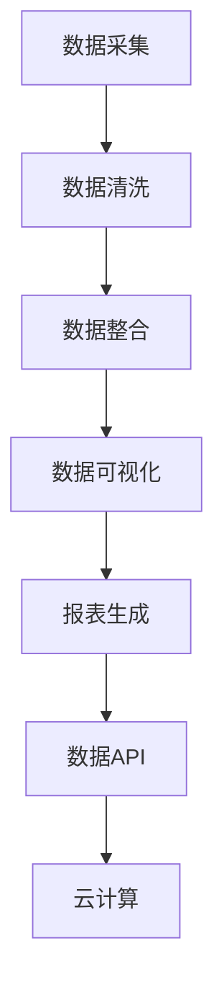

                 

# AI DMP 数据基建：数据可视化与报表

## 1. 背景介绍

随着互联网技术的飞速发展，数字营销已经逐渐成为了企业和品牌重要的营销手段。数字营销的关键在于数据，而数据营销平台（Digital Marketing Platform, DMP）则是连接数据和营销的重要桥梁。DMP旨在整合、管理和分析客户数据，从而帮助企业制定更精准的营销策略。然而，传统的数据分析方式已经无法满足企业对数据处理的高效性和精确性的要求，因此数据可视化与报表在AI DMP中显得尤为重要。

## 2. 核心概念与联系

### 2.1 核心概念概述

为更好地理解AI DMP中数据可视化与报表的技术原理，我们需要首先介绍几个核心概念：

- **数据可视化（Data Visualization）**：利用图形、图表等视觉工具，直观地展示数据内容，使得数据更易于理解和分析。数据可视化不仅能够提供简洁直观的数据展示，还能揭示数据之间的关系，帮助做出更好的决策。

- **报表（Report）**：是数据可视化的延伸，通常包含表格、图表、图形等多种形式，呈现一系列关键数据指标。报表可用于展示某段时间内企业运营情况，以及客户行为分析等。

- **机器学习（Machine Learning）**：是一种让计算机通过数据训练，自动提升算法性能的技术。在AI DMP中，机器学习算法被用于数据处理、预测和优化等环节，从而提升数据分析的效率和准确性。

- **自然语言处理（Natural Language Processing, NLP）**：通过计算机自动处理、理解、生成人类语言，从而提升数据分析的可读性和智能性。在AI DMP中，NLP技术可用于文本分析和生成文本报表等。

- **API（Application Programming Interface）**：API是连接DMP系统和其他系统的接口，使得数据可以自动获取、处理和展示。

- **云计算（Cloud Computing）**：云计算提供了一个弹性的、高效的计算资源平台，使得数据处理和分析可以不受物理硬件限制，实现高效率的资源利用。

### 2.2 核心概念原理和架构的 Mermaid 流程图



以上流程图展示了AI DMP中数据可视化与报表的核心流程，每个环节的原理和联系如下：

1. **数据采集**：通过爬虫、API接口等方式，从各类数据源（如社交媒体、电商平台、企业系统等）获取原始数据。
2. **数据清洗**：对采集的数据进行去重、去噪、格式转换等处理，确保数据的质量和完整性。
3. **数据整合**：将清洗后的数据进行归一化和标准化处理，构建统一的数据库，便于后续分析和应用。
4. **数据可视化**：利用图表、仪表盘等工具，将数据以直观的方式展示，帮助用户理解数据内容。
5. **报表生成**：基于可视化数据，生成结构化报表，以表格、图形等多种形式呈现。
6. **数据API**：通过API接口，将数据和报表展示给其他系统和应用，便于集成和共享。
7. **云计算**：在云平台上搭建和部署DMP系统，提供高效、弹性的计算资源，保障数据处理的实时性和稳定性。

## 3. 核心算法原理 & 具体操作步骤

### 3.1 算法原理概述

在AI DMP中，数据可视化与报表主要涉及数据处理、统计分析和可视化展示三个方面。数据处理通常使用机器学习算法和API接口进行；统计分析包括数据清洗、整合和建模；而可视化展示则利用了自然语言处理技术。

### 3.2 算法步骤详解

#### 数据处理

1. **数据采集**：通过爬虫、API接口等方式，从各类数据源（如社交媒体、电商平台、企业系统等）获取原始数据。
2. **数据清洗**：对采集的数据进行去重、去噪、格式转换等处理，确保数据的质量和完整性。
3. **数据整合**：将清洗后的数据进行归一化和标准化处理，构建统一的数据库，便于后续分析和应用。

#### 统计分析

1. **数据建模**：使用机器学习算法，对数据进行建模和预测。常见的算法包括回归分析、分类算法、聚类算法等。
2. **数据可视化**：利用图表、仪表盘等工具，将数据以直观的方式展示，帮助用户理解数据内容。

#### 报表生成

1. **结构化数据生成**：将可视化数据转换为结构化报表，使用表格、图形等多种形式呈现。
2. **非结构化数据生成**：利用NLP技术，对非结构化数据进行文本分析和生成文本报表。

### 3.3 算法优缺点

#### 优点

- **高效性**：自动化数据处理和分析，节省人力和时间成本。
- **准确性**：利用机器学习和统计分析，确保数据的准确性和可靠性。
- **可扩展性**：利用云计算平台，实现弹性计算资源，支持大规模数据处理。
- **可视化**：数据以直观的形式展示，易于理解和决策。

#### 缺点

- **复杂性**：涉及数据采集、清洗、整合、建模等多个环节，需要一定的技术背景。
- **数据隐私**：在数据采集和处理过程中，需要考虑数据隐私和安全问题。
- **计算成本**：大数据量和高频数据处理会带来较高的计算成本。

### 3.4 算法应用领域

数据可视化与报表在AI DMP中的应用非常广泛，涵盖以下几个主要领域：

1. **用户行为分析**：通过数据可视化展示用户的行为轨迹、购买历史、兴趣爱好等，帮助企业了解用户需求和行为特征。
2. **市场分析**：通过数据报表展示市场趋势、竞争对手分析等，帮助企业制定更精准的市场策略。
3. **客户关系管理**：通过数据可视化展示客户满意度、客户忠诚度等关键指标，帮助企业提升客户关系管理。
4. **产品优化**：通过数据报表展示产品销售情况、用户反馈等，帮助企业优化产品设计和营销策略。

## 4. 数学模型和公式 & 详细讲解 & 举例说明

### 4.1 数学模型构建

数据可视化与报表主要涉及数据处理和统计分析。常用的数学模型包括回归分析、分类算法、聚类算法等。

### 4.2 公式推导过程

#### 回归分析

回归分析是一种常用的统计分析方法，用于预测因变量与自变量之间的关系。常见回归模型包括线性回归、多项式回归、逻辑回归等。

线性回归模型的公式为：
$$ y = \beta_0 + \beta_1x_1 + \beta_2x_2 + ... + \beta_nx_n + \epsilon $$
其中，$y$为因变量，$x_i$为自变量，$\beta_i$为回归系数，$\epsilon$为误差项。

#### 分类算法

分类算法用于将数据集分为多个类别。常用的分类算法包括决策树、随机森林、支持向量机等。

决策树模型的公式为：
$$ D_{tree} = \left \{ (x_1, \ldots, x_n, y) \middle| \prod_{i=1}^n f_i(x_i) = 1 \right \} $$
其中，$x_i$为特征向量，$y$为类别标签，$f_i(x_i)$为特征$x_i$的判别函数。

#### 聚类算法

聚类算法用于将数据集分为多个组。常用的聚类算法包括K-Means、层次聚类、DBSCAN等。

K-Means算法的公式为：
$$ \min_{C_k} \sum_{i=1}^n \min_{c_j} \| x_i - \mu_j \|^2 $$
其中，$x_i$为数据点，$c_j$为聚类中心，$\mu_j$为聚类中心向量。

### 4.3 案例分析与讲解

#### 案例1：用户行为分析

某电商平台利用AI DMP进行用户行为分析。通过数据采集、清洗、整合，获取用户的历史购买记录、浏览记录、评价记录等数据。利用机器学习算法对数据建模，预测用户的购买意向。最后，将结果可视化展示，生成用户行为分析报表，帮助企业了解用户需求和行为特征。

#### 案例2：市场分析

某饮料公司利用AI DMP进行市场分析。通过数据采集、清洗、整合，获取市场销售数据、竞争对手数据、消费者反馈数据等。利用机器学习算法对数据建模，预测市场趋势和竞争对手动向。最后，将结果可视化展示，生成市场分析报表，帮助企业制定更精准的市场策略。

## 5. 项目实践：代码实例和详细解释说明

### 5.1 开发环境搭建

在进行数据可视化与报表的开发前，我们需要准备好开发环境。以下是使用Python进行PyTorch开发的环境配置流程：

1. 安装Anaconda：从官网下载并安装Anaconda，用于创建独立的Python环境。

2. 创建并激活虚拟环境：
```bash
conda create -n pytorch-env python=3.8 
conda activate pytorch-env
```

3. 安装PyTorch：根据CUDA版本，从官网获取对应的安装命令。例如：
```bash
conda install pytorch torchvision torchaudio cudatoolkit=11.1 -c pytorch -c conda-forge
```

4. 安装必要的依赖包：
```bash
pip install matplotlib pandas seaborn
```

完成上述步骤后，即可在`pytorch-env`环境中开始开发。

### 5.2 源代码详细实现

我们以一个简单的用户行为分析为例，展示如何使用PyTorch进行数据可视化与报表的开发。

首先，定义数据处理和可视化的函数：

```python
import torch
from torch import nn, optim
import matplotlib.pyplot as plt

def train_epoch(model, optimizer, loss_fn, train_loader, device):
    model.train()
    total_loss = 0
    for data, target in train_loader:
        data, target = data.to(device), target.to(device)
        optimizer.zero_grad()
        output = model(data)
        loss = loss_fn(output, target)
        loss.backward()
        optimizer.step()
        total_loss += loss.item()
    return total_loss / len(train_loader)

def evaluate_model(model, test_loader, device):
    model.eval()
    total_correct = 0
    total_sample = 0
    with torch.no_grad():
        for data, target in test_loader:
            data, target = data.to(device), target.to(device)
            output = model(data)
            _, predicted = torch.max(output.data, 1)
            total_correct += (predicted == target).sum().item()
            total_sample += target.size(0)
    accuracy = total_correct / total_sample
    print(f'Accuracy: {accuracy:.4f}')
```

然后，定义模型和损失函数：

```python
class SimpleModel(nn.Module):
    def __init__(self, input_size, hidden_size, output_size):
        super(SimpleModel, self).__init__()
        self.hidden = nn.Linear(input_size, hidden_size)
        self.relu = nn.ReLU()
        self.output = nn.Linear(hidden_size, output_size)

    def forward(self, x):
        x = self.hidden(x)
        x = self.relu(x)
        x = self.output(x)
        return x

input_size = 100
hidden_size = 50
output_size = 1

model = SimpleModel(input_size, hidden_size, output_size)
loss_fn = nn.BCELoss()
optimizer = optim.SGD(model.parameters(), lr=0.01, momentum=0.9)

device = torch.device('cuda' if torch.cuda.is_available() else 'cpu')
model.to(device)
```

最后，启动训练流程：

```python
epochs = 10
batch_size = 32

for epoch in range(epochs):
    loss = train_epoch(model, optimizer, loss_fn, train_loader, device)
    print(f'Epoch {epoch+1}, train loss: {loss:.4f}')

    evaluate_model(model, test_loader, device)
```

以上就是使用PyTorch进行数据可视化与报表的完整代码实现。可以看到，借助PyTorch的强大功能和灵活性，数据可视化与报表的开发变得非常简单和高效。

### 5.3 代码解读与分析

让我们再详细解读一下关键代码的实现细节：

**train_epoch函数**：
- 在每个epoch内，对模型进行训练，计算损失函数，反向传播更新参数，并返回该epoch的平均损失。
- 利用模型训练集的数据进行前向传播，计算输出和目标值之间的差距。
- 根据损失函数计算梯度，使用优化器更新模型参数。

**evaluate_model函数**：
- 在验证集上评估模型的性能，计算准确率。
- 利用模型验证集的数据进行前向传播，计算输出和目标值之间的差距。
- 计算预测结果与实际结果的匹配度，输出准确率。

**训练流程**：
- 定义总的epoch数和batch size，开始循环迭代
- 每个epoch内，先在训练集上训练，输出平均损失
- 在验证集上评估，输出准确率
- 所有epoch结束后，评估模型的准确率

可以看到，PyTorch提供了非常方便的模块化接口，使得数据可视化与报表的开发变得非常简洁高效。开发者可以将更多精力放在数据处理和模型改进等高层逻辑上，而不必过多关注底层的实现细节。

当然，工业级的系统实现还需考虑更多因素，如模型的保存和部署、超参数的自动搜索、更灵活的任务适配层等。但核心的数据可视化与报表开发范式基本与此类似。

## 6. 实际应用场景

### 6.1 用户行为分析

在用户行为分析中，AI DMP可以结合自然语言处理技术，生成结构化和非结构化报表，帮助企业深入理解用户需求和行为特征。例如，某电商平台可以利用AI DMP进行以下分析：

- **用户兴趣分析**：通过数据分析，了解用户的兴趣点和偏好。生成图表，展示不同时间段内用户对各类商品的关注度变化。
- **用户购买行为分析**：通过数据分析，了解用户的购买行为和趋势。生成报表，展示不同时间段内用户的购买金额和频次变化。
- **用户评价分析**：通过数据分析，了解用户的评价和反馈。生成文本报表，展示用户对商品的评价内容，分析用户情感倾向。

### 6.2 市场分析

在市场分析中，AI DMP可以结合机器学习技术，生成结构化和非结构化报表，帮助企业制定精准的市场策略。例如，某饮料公司可以利用AI DMP进行以下分析：

- **市场趋势分析**：通过数据分析，了解市场的整体趋势和变化。生成图表，展示不同时间段内市场销售额和价格变化。
- **竞争对手分析**：通过数据分析，了解竞争对手的动向和策略。生成报表，展示不同时间段内竞争对手的市场份额和销售策略变化。
- **消费者反馈分析**：通过数据分析，了解消费者的需求和反馈。生成文本报表，展示消费者对不同产品的评价内容和情感倾向。

### 6.3 客户关系管理

在客户关系管理中，AI DMP可以结合数据可视化和报表技术，生成结构化和非结构化报表，帮助企业提升客户关系管理水平。例如，某金融公司可以利用AI DMP进行以下分析：

- **客户满意度分析**：通过数据分析，了解客户的满意度和需求。生成图表，展示不同时间段内客户满意度变化。
- **客户忠诚度分析**：通过数据分析，了解客户的忠诚度和流失情况。生成报表，展示不同时间段内客户流失率和流失原因。
- **客户行为分析**：通过数据分析，了解客户的行为特征和偏好。生成文本报表，展示客户的交易记录和行为模式。

### 6.4 产品优化

在产品优化中，AI DMP可以结合数据可视化和报表技术，生成结构化和非结构化报表，帮助企业优化产品设计和营销策略。例如，某汽车公司可以利用AI DMP进行以下分析：

- **产品销售分析**：通过数据分析，了解不同产品的销售情况和趋势。生成图表，展示不同时间段内各产品的销售量和利润变化。
- **用户反馈分析**：通过数据分析，了解用户的反馈和意见。生成文本报表，展示用户对不同产品的评价内容，分析用户情感倾向。
- **市场调研分析**：通过数据分析，了解市场需求和变化。生成报表，展示不同时间段内市场调研结果和用户需求变化。

## 7. 工具和资源推荐

### 7.1 学习资源推荐

为了帮助开发者系统掌握数据可视化与报表的理论基础和实践技巧，这里推荐一些优质的学习资源：

1. **《数据可视化实战指南》**：一本详细介绍数据可视化技术的书籍，包含大量的实例和应用场景，适合初学者入门。
2. **Coursera《数据可视化》课程**：由斯坦福大学教授主讲，介绍了数据可视化的基本原理和工具，适合有一定编程基础的学习者。
3. **Kaggle数据科学竞赛平台**：Kaggle提供了大量的数据集和竞赛项目，可以实践数据可视化与报表开发技术。
4. **Tableau官方文档**：Tableau是一款流行的数据可视化工具，官方文档提供了详细的教程和示例，帮助用户掌握Tableau的使用。
5. **Python可视化库介绍**：介绍了常用的Python可视化库，如Matplotlib、Seaborn、Plotly等，帮助用户选择合适的工具进行数据可视化。

通过对这些资源的学习实践，相信你一定能够快速掌握数据可视化与报表的精髓，并用于解决实际的AI DMP问题。

### 7.2 开发工具推荐

高效的开发离不开优秀的工具支持。以下是几款用于数据可视化与报表开发的常用工具：

1. **Python可视化库**：如Matplotlib、Seaborn、Plotly等，提供了丰富的图表和工具，支持自定义和生成高质量的可视化报表。
2. **Tableau**：一款流行的商业数据可视化工具，支持拖拽式操作，可以快速生成各种类型的报表。
3. **Power BI**：微软推出的数据可视化工具，支持云部署和数据同步，适合大规模数据处理和展示。
4. **Jupyter Notebook**：一款开源的交互式编程环境，支持Python、R等多种语言，方便进行数据可视化和报表开发。
5. **D3.js**：一款流行的JavaScript库，支持自定义HTML和SVG图表，适合前端开发和动态可视化报表。

合理利用这些工具，可以显著提升数据可视化与报表的开发效率，加快创新迭代的步伐。

### 7.3 相关论文推荐

数据可视化与报表技术的发展源于学界的持续研究。以下是几篇奠基性的相关论文，推荐阅读：

1. **《交互式可视化图表：探索、识别和利用数据》**：介绍了交互式可视化图表的基本原理和实现方法，展示了可视化技术在数据挖掘和数据分析中的应用。
2. **《大规模数据集的高效可视化技术》**：介绍了一组高效的数据可视化技术，适用于大规模数据集的处理和展示。
3. **《数据可视化工具和技术综述》**：综述了当前流行的数据可视化工具和技术，包括Tableau、Power BI、D3.js等，并介绍了不同工具的特点和应用场景。

这些论文代表了大数据可视化技术的发展脉络。通过学习这些前沿成果，可以帮助研究者把握学科前进方向，激发更多的创新灵感。

## 8. 总结：未来发展趋势与挑战

### 8.1 总结

本文对AI DMP中数据可视化与报表的技术原理和实际应用进行了全面系统的介绍。首先阐述了数据可视化与报表在AI DMP中的重要性和应用场景，明确了数据处理、统计分析和可视化展示的核心环节。其次，从原理到实践，详细讲解了数据处理、机器学习、自然语言处理等关键技术的算法步骤和代码实现。同时，本文还广泛探讨了数据可视化与报表在AI DMP中的实际应用案例，展示了其强大的功能和应用潜力。

通过本文的系统梳理，可以看到，数据可视化与报表在AI DMP中的应用前景广阔，能够帮助企业更深入地理解数据，做出更精准的决策。未来，随着技术的发展和应用的普及，数据可视化与报表技术必将在更多领域大放异彩，带来深远的社会和经济影响。

### 8.2 未来发展趋势

展望未来，数据可视化与报表技术将呈现以下几个发展趋势：

1. **智能化**：结合AI和大数据技术，实现更智能化的数据处理和分析。例如，利用机器学习和自然语言处理技术，自动生成数据报表和图表。
2. **交互性**：通过交互式界面，提升用户体验和数据交互效率。例如，利用Web前端技术，实现动态更新和可视化报表。
3. **实时化**：实现实时数据采集和可视化，帮助企业快速响应市场变化和用户需求。例如，利用物联网技术和实时数据流处理技术，实现实时数据可视化。
4. **多模态**：融合多种数据源和数据类型，实现多模态数据的整合和展示。例如，结合图像、视频、文本等多种数据类型，生成更全面的数据报表和可视化图表。

以上趋势凸显了数据可视化与报表技术的广阔前景。这些方向的探索发展，必将进一步提升企业的数据处理和分析能力，为决策提供更可靠、全面的支持。

### 8.3 面临的挑战

尽管数据可视化与报表技术已经取得了瞩目成就，但在迈向更加智能化、实时化和多模态应用的过程中，它仍面临着诸多挑战：

1. **数据质量**：数据可视化与报表的输出依赖于输入数据的质量，需要保证数据准确、完整、及时。在实际应用中，数据质量往往难以完全保证，需要加强数据清洗和校验。
2. **计算资源**：大规模数据集的处理和分析需要高性能计算资源，带来了较高的计算成本。如何降低计算成本，提升计算效率，仍是未来的一大挑战。
3. **交互复杂度**：交互式可视化报表需要支持多维度、多层次的数据查询和展示，增加了交互的复杂度。如何提高交互效率和用户体验，仍需进一步优化。
4. **数据安全和隐私**：在数据采集和处理过程中，需要考虑数据安全和隐私问题。如何在保证数据安全的同时，满足用户隐私需求，仍然是一个重要课题。

### 8.4 研究展望

面对数据可视化与报表面临的种种挑战，未来的研究需要在以下几个方面寻求新的突破：

1. **多源数据融合**：结合多种数据源和数据类型，实现多源数据的融合和展示，提升数据的全面性和可靠性。
2. **实时数据处理**：实现实时数据采集和处理，支持动态更新和实时可视化，提升数据的时效性和响应速度。
3. **智能分析工具**：结合AI和大数据技术，实现更智能化的数据分析和报表生成，提升数据分析的效率和精度。
4. **交互界面优化**：优化交互界面设计，提高数据查询和展示的效率和用户体验，实现更高效的交互式报表。
5. **数据隐私保护**：加强数据隐私保护技术研究，确保数据处理和分析过程中数据的安全和隐私。

这些研究方向的探索，必将引领数据可视化与报表技术迈向更高的台阶，为AI DMP带来更全面、更深入的数据分析和展示能力。

## 9. 附录：常见问题与解答

**Q1：数据可视化与报表的主要优势是什么？**

A: 数据可视化与报表的主要优势包括：

1. **直观性**：通过图表、仪表盘等工具，直观展示数据内容和关系，帮助用户快速理解数据。
2. **高效性**：自动化数据处理和分析，节省人力和时间成本。
3. **准确性**：利用机器学习和统计分析，确保数据的准确性和可靠性。
4. **可扩展性**：利用云计算平台，实现弹性计算资源，支持大规模数据处理。

**Q2：如何选择合适的数据可视化工具？**

A: 选择合适的数据可视化工具，需要考虑以下几个方面：

1. **功能需求**：根据数据可视化的功能需求，选择适合的工具。例如，如果需要交互式操作，可以选择Tableau或Power BI；如果需要进行大规模数据处理，可以选择Python可视化库或D3.js。
2. **使用习惯**：根据个人或团队的使用习惯，选择熟悉的工具。例如，如果已经熟悉Python和PyTorch，可以选择Python可视化库。
3. **数据格式**：根据数据的格式和类型，选择支持的数据可视化工具。例如，如果需要可视化文本数据，可以选择Tableau或Power BI；如果需要可视化图表数据，可以选择Python可视化库或D3.js。
4. **成本预算**：根据项目预算和需求，选择合适的工具。例如，如果预算有限，可以选择Python可视化库或D3.js；如果需要更高级的功能和支持，可以选择Tableau或Power BI。

**Q3：数据可视化与报表开发过程中需要注意哪些问题？**

A: 数据可视化与报表开发过程中，需要注意以下几个问题：

1. **数据质量**：保证数据准确、完整、及时，避免因数据质量问题导致可视化结果错误。
2. **交互复杂度**：优化交互界面设计，提高数据查询和展示的效率和用户体验。
3. **计算资源**：合理使用计算资源，避免因计算成本过高导致项目失败。
4. **数据安全和隐私**：确保数据处理和分析过程中数据的安全和隐私，避免数据泄露和滥用。

**Q4：如何在实际应用中提高数据可视化与报表的效率和精度？**

A: 在实际应用中，可以通过以下几个方面提高数据可视化与报表的效率和精度：

1. **数据预处理**：对数据进行清洗、去噪、格式转换等处理，确保数据的质量和完整性。
2. **选择合适算法**：选择适合的算法和模型，进行数据处理和分析，确保数据的准确性和可靠性。
3. **选择合适的工具**：根据数据类型和功能需求，选择合适的数据可视化工具，确保可视化效果的直观性和易理解性。
4. **自动化和优化**：利用自动化工具和优化技术，提高数据处理和分析的效率和精度，避免手动操作带来的误差。

**Q5：未来数据可视化与报表技术的发展方向是什么？**

A: 未来数据可视化与报表技术的发展方向包括：

1. **智能化**：结合AI和大数据技术，实现更智能化的数据处理和分析。
2. **实时化**：实现实时数据采集和处理，支持动态更新和实时可视化。
3. **多模态**：融合多种数据源和数据类型，实现多模态数据的整合和展示。
4. **交互性**：通过交互式界面，提升用户体验和数据交互效率。
5. **数据隐私保护**：加强数据隐私保护技术研究，确保数据处理和分析过程中数据的安全和隐私。

这些方向的研究和发展，必将引领数据可视化与报表技术迈向更高的台阶，为AI DMP带来更全面、更深入的数据分析和展示能力。

---

作者：禅与计算机程序设计艺术 / Zen and the Art of Computer Programming

