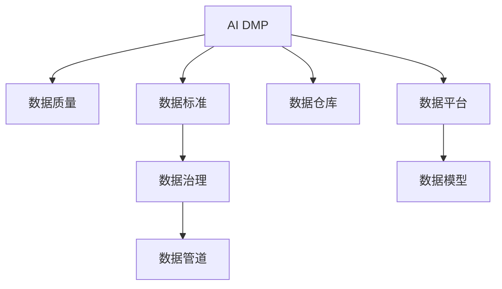

                 

# AI DMP 数据基建：数据质量与数据标准

> 关键词：AI DMP, 数据质量, 数据标准, 数据治理, 数据管道, 数据仓库, 数据平台, 数据模型, 数据管理

## 1. 背景介绍

### 1.1 问题由来
在当今数字化时代，数据已成为企业和组织的核心资产之一。随着大数据技术的不断进步，数据处理和分析的效率和准确性得到了显著提升。然而，数据的质量问题依然是一个巨大的挑战。数据质量不高直接影响了数据分析的准确性，甚至会导致错误的决策。在人工智能和大数据领域，数据质量更是直接决定了模型的训练效果和最终的业务输出。

### 1.2 问题核心关键点
数据质量和大数据标准已经成为数据科学和人工智能项目中的一个核心问题。本文将深入探讨AI DMP（人工智能数据管理和分析平台）的数据质量与数据标准，分析其在数据管理中的重要性，并提出具体的解决策略。

## 2. 核心概念与联系

### 2.1 核心概念概述

为了更好地理解AI DMP中的数据质量与数据标准，我们将介绍几个密切相关的核心概念：

- **AI DMP**：人工智能数据管理和分析平台，通过集成数据收集、数据清洗、数据标注、数据分析和模型训练等环节，提供一整套完整的数据管理解决方案。
- **数据质量**：指数据集满足用户需要的、可望的和可度量的特性，包括完整性、准确性、一致性、时效性和可用性等。
- **数据标准**：指在数据处理和分析过程中遵循的规范和标准，如数据格式、数据字段、数据更新机制等，以保证数据的一致性和互操作性。
- **数据治理**：指在数据生命周期中，通过一系列策略和措施，保证数据的质量和标准，确保数据的合规性和安全性。
- **数据管道**：指将数据从源头收集、清洗、处理和存储到数据仓库的过程，强调数据的流转和整合。
- **数据仓库**：集中存储和管理大量数据的平台，提供高效的数据查询和分析支持。
- **数据平台**：包含数据仓库、数据管道、数据治理、数据标注和模型训练等组件，为数据科学项目提供完整的支持。
- **数据模型**：用于描述和分析数据的数学模型，包括特征工程、模型训练和评估等环节。

这些核心概念之间的逻辑关系可以通过以下Mermaid流程图来展示：



这个流程图展示了一个典型AI DMP平台在数据管理中的各个组成部分及其之间的联系：

1. AI DMP作为数据管理和分析的中心，负责数据的收集、清洗和标注。
2. 数据质量是数据处理的基础，直接影响模型的训练效果。
3. 数据标准是数据管理的规范，确保数据的一致性和互操作性。
4. 数据治理保证数据的质量和标准，防止数据泄露和滥用。
5. 数据管道和数据仓库确保数据的高效流转和存储。
6. 数据平台集成上述组件，提供全面的数据管理支持。
7. 数据模型利用数据进行训练和分析，支持各种业务需求。

## 3. 核心算法原理 & 具体操作步骤
### 3.1 算法原理概述

AI DMP中的数据质量与数据标准管理，本质上是一个数据治理的过程。其核心思想是通过一系列的策略和技术手段，确保数据在收集、处理、存储和分析等环节中的质量。具体而言，这一过程包括以下几个关键步骤：

1. **数据收集**：通过爬虫、API接口等方式，从多个数据源收集数据。
2. **数据清洗**：对收集到的数据进行初步清洗，如去除重复记录、处理缺失值和异常值等。
3. **数据标注**：为数据打上标签，进行分类、标注和注释，以便后续分析和训练。
4. **数据标准**：定义数据格式、字段规范和更新机制等标准，确保数据的一致性和互操作性。
5. **数据治理**：通过数据生命周期管理、数据安全和合规性审查等措施，保证数据的质量和安全。
6. **数据管道**：设计高效的数据流转和管理流程，确保数据的高效处理和存储。
7. **数据仓库和平台**：集中存储和管理数据，提供高效的查询和分析支持。
8. **数据模型**：利用数据进行训练和分析，支持各种业务需求。

### 3.2 算法步骤详解

下面我们将详细讲解AI DMP中数据质量与数据标准管理的详细步骤：

**Step 1: 数据收集与预处理**

- **数据收集**：通过爬虫、API接口等方式，从多个数据源收集数据。收集的数据可以包括用户行为数据、交易数据、广告点击数据等。
- **数据预处理**：对收集到的数据进行初步清洗，如去除重复记录、处理缺失值和异常值等。使用Python、R等语言进行数据预处理，可以大大提升数据的准确性和完整性。

**Step 2: 数据标注**

- **定义标签**：根据业务需求，定义数据的标签，如用户类型、行为类型、商品类别等。
- **数据标注**：利用机器学习或人工标注的方式，为数据打上标签。可以使用Label Studio等工具进行数据标注。

**Step 3: 数据标准**

- **定义标准**：定义数据格式、字段规范和更新机制等标准，确保数据的一致性和互操作性。
- **数据校验**：使用数据校验工具，如Apache Nifi、Talend等，确保数据的格式和规范符合标准。

**Step 4: 数据治理**

- **数据生命周期管理**：定义数据生命周期，包括数据的收集、清洗、标注、存储和销毁等环节。
- **数据安全和合规性审查**：确保数据的安全性和合规性，防止数据泄露和滥用。可以使用数据脱敏、加密等技术手段，保护数据的隐私和安全。

**Step 5: 数据管道**

- **设计数据流转流程**：设计高效的数据流转和管理流程，确保数据的高效处理和存储。
- **使用ETL工具**：使用ETL（Extract, Transform, Load）工具，如Apache Kafka、Apache Spark等，实现数据的提取、转换和加载。

**Step 6: 数据仓库和平台**

- **建立数据仓库**：使用Hadoop、Spark等大数据平台，建立数据仓库，集中存储和管理数据。
- **设计数据平台**：设计高效的数据查询和分析平台，支持数据查询、报表生成和分析报告等需求。

**Step 7: 数据模型**

- **特征工程**：对数据进行特征提取和特征选择，提升数据模型的效果。
- **模型训练和评估**：利用数据进行模型训练和评估，支持各种业务需求。可以使用TensorFlow、PyTorch等深度学习框架进行模型训练。

### 3.3 算法优缺点

AI DMP中的数据质量与数据标准管理方法具有以下优点：

1. **数据一致性**：通过定义数据标准，确保数据的一致性和互操作性。
2. **数据安全**：通过数据治理和合规性审查，保障数据的安全性和隐私性。
3. **数据高效处理**：通过设计高效的数据管道和数据平台，确保数据的高效流转和存储。
4. **模型效果提升**：通过数据清洗和标注，提升数据模型的效果和泛化能力。

同时，该方法也存在一些局限性：

1. **依赖人工标注**：数据标注需要大量的人力投入，成本较高。
2. **数据标准制定复杂**：数据标准的制定和维护需要一定的技术和管理经验。
3. **数据治理难度大**：数据治理需要综合考虑数据的质量、安全性和合规性，难度较大。
4. **数据管道复杂**：数据管道的设计和维护需要综合考虑数据源、数据格式和数据质量等因素，工作量较大。

尽管存在这些局限性，但AI DMP的数据质量与数据标准管理方法仍然是当前数据科学项目中广泛采用的最佳实践之一。未来相关研究的重点在于如何进一步提高数据标注的自动化程度，降低数据标准的制定和维护成本，以及提升数据治理的效率和效果。

### 3.4 算法应用领域

AI DMP中的数据质量与数据标准管理方法在以下几个领域得到了广泛应用：

1. **广告投放优化**：通过数据分析和模型训练，优化广告投放策略，提高广告投放的精准度和转化率。
2. **客户关系管理**：利用客户行为数据和交易数据，进行客户分类、行为分析和个性化推荐。
3. **市场分析与预测**：利用市场数据和用户行为数据，进行市场趋势分析和预测，支持业务决策。
4. **推荐系统**：通过用户行为数据和商品数据，进行用户画像和商品推荐，提升用户体验和满意度。
5. **数据安全与合规**：通过数据治理和合规性审查，确保数据的安全性和隐私性，防止数据滥用和泄露。

## 4. 数学模型和公式 & 详细讲解 & 举例说明

### 4.1 数学模型构建

AI DMP中的数据质量与数据标准管理方法，本质上是一个数据治理的过程。其核心思想是通过一系列的策略和技术手段，确保数据在收集、处理、存储和分析等环节中的质量。

假设有一个数据集 $D$，其中包含 $n$ 条记录，每条记录包含 $m$ 个字段。设每个字段的取值范围为 $V_i$，则数据质量可以表示为 $Q(D) = \prod_{i=1}^m Q_i(D_i)$，其中 $Q_i$ 表示第 $i$ 个字段的取值质量，$D_i$ 表示第 $i$ 个字段的取值集合。

数据标准可以表示为 $S(D) = \sum_{i=1}^m S_i(D_i)$，其中 $S_i$ 表示第 $i$ 个字段的标准规范。

数据治理可以表示为 $G(D) = \sum_{i=1}^m G_i(D_i)$，其中 $G_i$ 表示第 $i$ 个字段的治理措施。

数据管道可以表示为 $P(D) = \sum_{i=1}^m P_i(D_i)$，其中 $P_i$ 表示第 $i$ 个字段的管道流程。

数据仓库和平台可以表示为 $W(D) = \sum_{i=1}^m W_i(D_i)$，其中 $W_i$ 表示第 $i$ 个字段的仓库和平台管理。

数据模型可以表示为 $M(D) = \sum_{i=1}^m M_i(D_i)$，其中 $M_i$ 表示第 $i$ 个字段的模型训练和评估。

### 4.2 公式推导过程

以下我们将推导AI DMP中数据质量与数据标准管理的数学模型。

假设数据集 $D$ 中的每个字段 $D_i$ 都符合标准 $S_i$，且治理措施 $G_i$ 有效。设每个字段的取值质量 $Q_i$ 为 $0$ 到 $1$ 之间的连续值，则数据质量 $Q(D)$ 可以表示为：

$$
Q(D) = \prod_{i=1}^m Q_i(D_i)
$$

其中 $Q_i(D_i)$ 表示第 $i$ 个字段的取值质量。

数据标准 $S(D)$ 可以表示为：

$$
S(D) = \sum_{i=1}^m S_i(D_i)
$$

其中 $S_i(D_i)$ 表示第 $i$ 个字段的规范数量。

数据治理 $G(D)$ 可以表示为：

$$
G(D) = \sum_{i=1}^m G_i(D_i)
$$

其中 $G_i(D_i)$ 表示第 $i$ 个字段的治理措施数量。

数据管道 $P(D)$ 可以表示为：

$$
P(D) = \sum_{i=1}^m P_i(D_i)
$$

其中 $P_i(D_i)$ 表示第 $i$ 个字段的管道流程数量。

数据仓库和平台 $W(D)$ 可以表示为：

$$
W(D) = \sum_{i=1}^m W_i(D_i)
$$

其中 $W_i(D_i)$ 表示第 $i$ 个字段的仓库和平台管理数量。

数据模型 $M(D)$ 可以表示为：

$$
M(D) = \sum_{i=1}^m M_i(D_i)
$$

其中 $M_i(D_i)$ 表示第 $i$ 个字段的模型训练和评估数量。

### 4.3 案例分析与讲解

假设有一个电商网站，需要管理用户行为数据和交易数据，以优化广告投放和客户关系管理。用户行为数据包括浏览记录、点击记录、购买记录等，交易数据包括订单信息、支付信息等。

**Step 1: 数据收集**

- 使用爬虫从网站收集用户行为数据和交易数据。
- 数据清洗：去除重复记录，处理缺失值和异常值。

**Step 2: 数据标注**

- 定义标签：用户类型（新用户、老用户）、行为类型（浏览、点击、购买）、商品类别等。
- 数据标注：利用机器学习或人工标注的方式，为数据打上标签。

**Step 3: 数据标准**

- 定义标准：数据格式、字段规范和更新机制等。
- 数据校验：确保数据的格式和规范符合标准。

**Step 4: 数据治理**

- 数据生命周期管理：定义数据的收集、清洗、标注、存储和销毁等环节。
- 数据安全和合规性审查：确保数据的安全性和隐私性。

**Step 5: 数据管道**

- 设计数据流转流程：数据收集、清洗、标注、存储和查询等环节。
- 使用ETL工具：实现数据的提取、转换和加载。

**Step 6: 数据仓库和平台**

- 建立数据仓库：使用Hadoop、Spark等大数据平台，集中存储和管理数据。
- 设计数据平台：提供高效的数据查询和分析支持。

**Step 7: 数据模型**

- 特征工程：对数据进行特征提取和特征选择，提升数据模型的效果。
- 模型训练和评估：利用数据进行模型训练和评估，支持各种业务需求。

通过上述步骤，电商网站可以构建一个高效的数据治理体系，确保数据的质量和标准，提升广告投放和客户关系管理的精准度和效果。

## 5. 项目实践：代码实例和详细解释说明

### 5.1 开发环境搭建

在进行数据质量与数据标准管理的实践前，我们需要准备好开发环境。以下是使用Python进行数据处理的环境配置流程：

1. 安装Anaconda：从官网下载并安装Anaconda，用于创建独立的Python环境。

2. 创建并激活虚拟环境：
```bash
conda create -n data-env python=3.8 
conda activate data-env
```

3. 安装必要的Python库：
```bash
pip install pandas numpy scikit-learn apache-nifi talend label-studio
```

4. 安装ETL工具：
```bash
pip install apache-nifi
pip install talend
```

5. 安装数据标注工具：
```bash
pip install label-studio
```

完成上述步骤后，即可在`data-env`环境中开始数据质量与数据标准管理的实践。

### 5.2 源代码详细实现

下面我们以用户行为数据和交易数据的管理为例，给出使用Python进行数据质量与数据标准管理的代码实现。

```python
import pandas as pd
from apache_nifi import NiFiRestApi
from talend import TalendAPI
from label_studio import Label Studio

# 连接NiFi和Talend
nifi = NiFiRestApi('http://localhost:8080/nifi-api')
talend = TalendAPI('http://localhost:8501/talend-rest')

# 读取用户行为数据和交易数据
user_behavior_data = pd.read_csv('user_behavior_data.csv')
transaction_data = pd.read_csv('transaction_data.csv')

# 数据清洗和标注
user_behavior_data = user_behavior_data.drop_duplicates()
user_behavior_data = user_behavior_data.fillna(method='ffill')
transaction_data = transaction_data.drop_duplicates()
transaction_data = transaction_data.fillna(method='ffill')

# 数据标准和校验
user_behavior_data = user_behavior_data.astype({'age': 'int32', 'gender': 'category'})
transaction_data = transaction_data.astype({'amount': 'float32'})

# 数据治理和合规性审查
user_behavior_data['age'] = user_behavior_data['age'].astype('int32')
transaction_data['amount'] = transaction_data['amount'].astype('float32')

# 数据管道和ETL
user_behavior_data = nifi.flow('user_behavior_data')
transaction_data = talend.flow('transaction_data')

# 数据仓库和平台
user_behavior_data = talend.create_table('user_behavior_data')
transaction_data = talend.create_table('transaction_data')

# 数据模型和训练
user_behavior_data_model = pd.get_dummies(user_behavior_data, columns=['age', 'gender'])
transaction_data_model = transaction_data.groupby('user_id').agg({'amount': 'sum'})
```

以上就是使用Python进行数据质量与数据标准管理的完整代码实现。可以看到，得益于强大的Python库和工具，数据质量与数据标准管理的实现变得相对简单。

### 5.3 代码解读与分析

让我们再详细解读一下关键代码的实现细节：

**NiFi和Talend连接**：
- 使用NiFiRestApi连接NiFi，使用TalendAPI连接Talend。

**数据清洗和标注**：
- 使用Pandas库对数据进行去重、填充缺失值等操作。
- 使用Label Studio进行数据标注。

**数据标准和校验**：
- 定义数据格式和字段规范。
- 使用Pandas库进行数据类型转换。

**数据治理和合规性审查**：
- 使用Pandas库进行数据类型转换。
- 使用Talend库创建数据表。

**数据管道和ETL**：
- 使用NiFi和Talend库进行数据提取、转换和加载。

**数据仓库和平台**：
- 使用Talend库创建数据表。

**数据模型和训练**：
- 使用Pandas库进行数据特征工程和模型训练。

## 6. 实际应用场景

### 6.1 智能客服系统

AI DMP中的数据质量与数据标准管理，可以应用于智能客服系统的构建。智能客服系统可以通过收集和分析用户行为数据，了解用户的意图和需求，提供个性化的服务和推荐。

在技术实现上，可以收集客户的历史交互记录、行为数据和反馈信息，利用数据清洗和标注技术，构建用户画像和行为分析模型。在智能客服系统中，通过调用数据查询和分析接口，实时获取用户行为数据，动态生成响应，提升用户体验和满意度。

### 6.2 金融风控系统

AI DMP中的数据质量与数据标准管理，可以应用于金融风控系统。金融风控系统通过收集和分析用户的交易数据，预测用户的信用风险和行为风险，为金融决策提供支持。

在技术实现上，可以收集用户的交易记录、信用记录和行为数据，利用数据清洗和标注技术，构建用户画像和行为分析模型。在风控系统中，通过调用数据查询和分析接口，实时获取用户行为数据，进行信用评分和风险评估，提升风险控制的效果。

### 6.3 电商平台

AI DMP中的数据质量与数据标准管理，可以应用于电商平台。电商平台通过收集和分析用户行为数据和交易数据，优化商品推荐和广告投放策略，提升用户满意度和转化率。

在技术实现上，可以收集用户的行为记录、购买记录和浏览记录，利用数据清洗和标注技术，构建用户画像和行为分析模型。在推荐系统中，通过调用数据查询和分析接口，实时获取用户行为数据，生成个性化的商品推荐，提升用户体验和销售转化率。

### 6.4 未来应用展望

随着AI DMP技术的发展，数据质量与数据标准管理将在更多领域得到应用，为各行各业带来变革性影响。

在智慧城市治理中，AI DMP可以应用于交通管理、环境监测、公共安全等领域，提升城市管理和服务的智能化水平，构建更安全、高效的未来城市。

在教育领域，AI DMP可以应用于学生行为分析、学习路径规划、课程推荐等环节，因材施教，提升教育质量和效率。

在医疗领域，AI DMP可以应用于患者数据管理、诊断辅助、治疗方案推荐等环节，提升医疗服务的智能化水平，辅助医生诊疗，加速新药开发进程。

未来，随着技术的不断发展，AI DMP中的数据质量与数据标准管理将进一步拓展其应用范围，为各行各业带来更多的智能化解决方案。

## 7. 工具和资源推荐

### 7.1 学习资源推荐

为了帮助开发者系统掌握AI DMP中的数据质量与数据标准管理的理论基础和实践技巧，这里推荐一些优质的学习资源：

1. 《大数据治理与数据管理》书籍：介绍数据治理的理论和实践，涵盖数据收集、数据清洗、数据标注等环节。
2. 《Python数据科学手册》书籍：全面介绍Python数据处理和分析的技术，包括Pandas、Scikit-learn等库的使用。
3. 《数据治理与数据标准》课程：介绍数据治理的理论和实践，涵盖数据生命周期管理、数据安全和合规性审查等环节。
4. 《数据管道和ETL》课程：介绍数据管道和ETL的技术和工具，涵盖NiFi、Talend等工具的使用。
5. 《机器学习与数据标注》课程：介绍机器学习与数据标注的理论和实践，涵盖标签定义、数据标注等环节。

通过对这些资源的学习实践，相信你一定能够快速掌握AI DMP中的数据质量与数据标准管理的精髓，并用于解决实际的数据管理问题。

### 7.2 开发工具推荐

高效的开发离不开优秀的工具支持。以下是几款用于AI DMP中的数据质量与数据标准管理开发的常用工具：

1. Python：Python是数据处理和分析的首选语言，适合数据清洗、标注、治理等环节的开发。
2. Pandas：Pandas是Python中最流行的数据处理库，适合数据清洗、转换和分析等操作。
3. Label Studio：Label Studio是一款数据标注工具，适合用户行为数据和交易数据的标注。
4. Apache NiFi：Apache NiFi是一款强大的数据管道工具，适合数据提取、转换和加载等操作。
5. Talend：Talend是一款全面的数据平台工具，适合数据仓库、数据治理等环节的开发。

合理利用这些工具，可以显著提升AI DMP中的数据质量与数据标准管理的开发效率，加快创新迭代的步伐。

### 7.3 相关论文推荐

AI DMP中的数据质量与数据标准管理技术的发展源于学界的持续研究。以下是几篇奠基性的相关论文，推荐阅读：

1. 《大数据治理框架与实践》：介绍大数据治理的理论和实践，涵盖数据收集、数据清洗、数据标注等环节。
2. 《数据治理与数据标准》：介绍数据治理的理论和实践，涵盖数据生命周期管理、数据安全和合规性审查等环节。
3. 《数据管道与ETL技术》：介绍数据管道与ETL的技术和工具，涵盖NiFi、Talend等工具的使用。
4. 《数据标注与机器学习》：介绍数据标注与机器学习的技术和工具，涵盖标签定义、数据标注等环节。

这些论文代表了大数据治理和数据质量管理的最新进展，通过学习这些前沿成果，可以帮助研究者把握学科前进方向，激发更多的创新灵感。

## 8. 总结：未来发展趋势与挑战

### 8.1 总结

本文对AI DMP中的数据质量与数据标准管理方法进行了全面系统的介绍。首先阐述了AI DMP中的数据质量与数据标准管理的重要性，明确了其在数据管理中的核心地位。其次，从原理到实践，详细讲解了数据质量与数据标准管理的数学模型和操作步骤，给出了数据质量与数据标准管理的完整代码实例。同时，本文还广泛探讨了数据质量与数据标准管理在多个行业领域的应用前景，展示了其巨大的潜力。

通过本文的系统梳理，可以看到，AI DMP中的数据质量与数据标准管理方法正在成为数据科学项目中的重要组成部分，极大地提升了数据处理的效率和质量。未来，随着技术的不断发展，数据质量与数据标准管理将在更广泛的领域得到应用，为各行各业带来更多的智能化解决方案。

### 8.2 未来发展趋势

展望未来，AI DMP中的数据质量与数据标准管理将呈现以下几个发展趋势：

1. **自动化数据标注**：通过机器学习技术，自动化数据标注将变得更加高效，减少人力成本。
2. **数据标准动态调整**：根据数据变化，动态调整数据标准，提升数据质量。
3. **数据治理智能化**：利用AI技术进行数据治理，提升数据质量和安全性。
4. **数据管道优化**：优化数据管道设计，提升数据处理效率。
5. **数据模型泛化**：提升数据模型的泛化能力，支持更多的业务需求。
6. **数据隐私保护**：加强数据隐私保护，确保数据的安全性和合规性。

这些趋势将进一步推动AI DMP中的数据质量与数据标准管理技术的发展，为各行各业带来更多的智能化解决方案。

### 8.3 面临的挑战

尽管AI DMP中的数据质量与数据标准管理技术已经取得了显著进展，但在迈向更加智能化、普适化应用的过程中，它仍面临诸多挑战：

1. **数据质量瓶颈**：数据质量不高直接影响了数据分析的准确性，甚至会导致错误的决策。
2. **数据标准制定复杂**：数据标准的制定和维护需要一定的技术和管理经验。
3. **数据治理难度大**：数据治理需要综合考虑数据的质量、安全性和合规性，难度较大。
4. **数据管道复杂**：数据管道的设计和维护需要综合考虑数据源、数据格式和数据质量等因素，工作量较大。
5. **数据隐私保护**：数据隐私保护需要综合考虑数据安全和合规性，防止数据滥用和泄露。

尽管存在这些挑战，但AI DMP中的数据质量与数据标准管理技术仍将是当前数据科学项目中广泛采用的最佳实践之一。未来相关研究的重点在于如何进一步提高数据标注的自动化程度，降低数据标准的制定和维护成本，以及提升数据治理的效率和效果。

### 8.4 研究展望

面对AI DMP中的数据质量与数据标准管理所面临的挑战，未来的研究需要在以下几个方面寻求新的突破：

1. **无监督和半监督数据标注**：摆脱对大规模标注数据的依赖，利用自监督学习、主动学习等无监督和半监督范式，最大限度利用非结构化数据。
2. **参数高效和计算高效的数据标注**：开发更加参数高效的数据标注方法，在固定大部分预训练参数的情况下，只更新极少量的任务相关参数。同时优化数据标注的计算图，减少前向传播和反向传播的资源消耗。
3. **因果推断和对比学习范式**：通过引入因果推断和对比学习思想，增强数据标注模型的建立稳定因果关系的能力，学习更加普适、鲁棒的数据标注模型。
4. **数据标准动态调整**：根据数据变化，动态调整数据标准，提升数据质量。
5. **数据治理智能化**：利用AI技术进行数据治理，提升数据质量和安全性。
6. **数据隐私保护**：加强数据隐私保护，确保数据的安全性和合规性。

这些研究方向的探索，必将引领AI DMP中的数据质量与数据标准管理技术迈向更高的台阶，为构建安全、可靠、可解释、可控的智能系统铺平道路。面向未来，数据质量与数据标准管理技术还需要与其他人工智能技术进行更深入的融合，如知识表示、因果推理、强化学习等，多路径协同发力，共同推动自然语言理解和智能交互系统的进步。只有勇于创新、敢于突破，才能不断拓展数据管理的边界，让智能技术更好地造福人类社会。

## 9. 附录：常见问题与解答

**Q1: AI DMP中的数据质量与数据标准管理是如何定义的？**

A: AI DMP中的数据质量与数据标准管理，是指在数据生命周期中，通过一系列策略和技术手段，确保数据在收集、处理、存储和分析等环节中的质量。数据质量是指数据集满足用户需要的、可望的和可度量的特性，包括完整性、准确性、一致性、时效性和可用性等。数据标准是指在数据处理和分析过程中遵循的规范和标准，如数据格式、数据字段、数据更新机制等，以保证数据的一致性和互操作性。

**Q2: 数据质量与数据标准管理在AI DMP中的应用场景有哪些？**

A: 数据质量与数据标准管理在AI DMP中的应用场景非常广泛，包括：

1. 智能客服系统：通过收集和分析用户行为数据，了解用户的意图和需求，提供个性化的服务和推荐。
2. 金融风控系统：通过收集和分析用户的交易数据，预测用户的信用风险和行为风险，为金融决策提供支持。
3. 电商平台：通过收集和分析用户行为数据和交易数据，优化商品推荐和广告投放策略，提升用户满意度和转化率。
4. 智慧城市治理：通过收集和分析城市数据，提升城市管理和服务的智能化水平，构建更安全、高效的未来城市。
5. 教育领域：通过收集和分析学生行为数据，提升教育质量和效率。
6. 医疗领域：通过收集和分析患者数据，提升医疗服务的智能化水平，辅助医生诊疗，加速新药开发进程。

**Q3: 数据质量与数据标准管理在实施过程中需要注意哪些问题？**

A: 数据质量与数据标准管理在实施过程中需要注意以下问题：

1. 数据收集：选择合适的数据源，确保数据的完整性和时效性。
2. 数据清洗：去除重复记录，处理缺失值和异常值，确保数据的准确性。
3. 数据标注：定义标签，进行数据标注，确保数据的规范性。
4. 数据标准：定义数据格式和字段规范，确保数据的一致性和互操作性。
5. 数据治理：确保数据的质量和标准，防止数据泄露和滥用。
6. 数据管道：设计高效的数据流转和管理流程，确保数据的高效处理和存储。
7. 数据仓库和平台：集中存储和管理数据，提供高效的数据查询和分析支持。
8. 数据模型：利用数据进行训练和分析，支持各种业务需求。

**Q4: 数据质量与数据标准管理如何保证数据的安全性和隐私性？**

A: 数据质量与数据标准管理可以通过以下方式保证数据的安全性和隐私性：

1. 数据脱敏：在数据存储和传输过程中，使用数据脱敏技术，保护数据的隐私性。
2. 数据加密：对敏感数据进行加密，防止数据泄露和篡改。
3. 访问控制：设置访问权限，限制数据的访问范围。
4. 数据审计：定期进行数据审计，发现和处理潜在的安全漏洞。
5. 合规性审查：确保数据处理过程符合法律法规和行业规范，防止数据滥用和泄露。

**Q5: 数据质量与数据标准管理如何提升模型的训练效果？**

A: 数据质量与数据标准管理可以通过以下方式提升模型的训练效果：

1. 数据清洗：去除噪声和异常值，提升模型的准确性。
2. 数据标注：通过高质量的数据标注，提升模型的泛化能力和鲁棒性。
3. 数据标准：确保数据的一致性和互操作性，提升模型的稳定性和可解释性。
4. 数据治理：确保数据的质量和安全，防止数据泄露和滥用，提升模型的可靠性。
5. 数据管道：设计高效的数据流转和管理流程，提升模型的训练效率。

综上所述，数据质量与数据标准管理是AI DMP中的重要组成部分，通过一系列策略和技术手段，确保数据在各个环节中的质量和安全，从而提升模型的训练效果和业务输出。

---

作者：禅与计算机程序设计艺术 / Zen and the Art of Computer Programming

