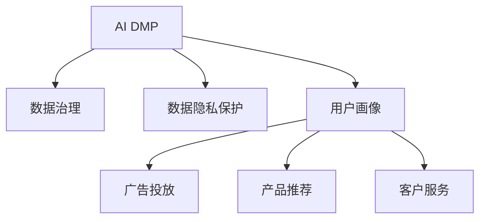

                 

# AI DMP 数据基建：构建数据驱动的营销生态

> 关键词：AI DMP, 数据基建, 营销生态, 用户画像, 广告投放, 数据治理, 隐私保护

## 1. 背景介绍

在数字化转型的浪潮下，数据驱动的营销生态正逐渐成为企业的核心竞争力。传统的基于历史行为数据的营销策略，已无法满足消费者行为多元化和个性化需求。越来越多的企业开始重视通过人工智能和大数据技术构建AI DMP(Artificial Intelligence Data Management Platform)，以实现对消费者行为的深度洞察，精准定位和个性化营销。

AI DMP的核心在于数据的收集、整合、分析和应用，通过对用户行为数据的深度挖掘和融合，构建动态更新的用户画像，从而实现广告投放、产品推荐、客户服务等营销目标。但AI DMP的建设并非易事，涉及到数据治理、隐私保护、技术架构等多个复杂环节，需要系统化的策略和方法论指导。

本文将深入探讨AI DMP数据基建的关键技术，包括数据治理、数据隐私保护、数据处理流程和具体实现等，并通过具体案例展示其在营销生态中的应用，旨在为行业提供系统化、可行的AI DMP构建方案。

## 2. 核心概念与联系

### 2.1 核心概念概述

- **AI DMP**：基于人工智能技术的数据管理平台，通过对用户数据的深度分析，构建实时更新的用户画像，提供个性化的营销解决方案。

- **数据治理**：数据治理是指对数据收集、存储、管理和应用全生命周期进行规划、管理和监控的过程，包括数据质量管理、数据安全管理等。

- **数据隐私保护**：数据隐私保护是指在数据使用过程中，确保个人信息的合法、合规和安全，防止数据泄露和滥用。

- **用户画像**：用户画像是指通过数据挖掘和分析技术，提取和构建用户特征模型，用于描绘用户行为、兴趣、需求等属性，以实现精准营销。

- **广告投放**：广告投放是指企业通过AI DMP平台，根据用户画像选择目标受众，定向投放广告，以实现更高的广告转化率和投资回报率。

- **产品推荐**：产品推荐是指根据用户画像，推荐符合用户兴趣和需求的产品或服务，提高用户满意度和转化率。

- **客户服务**：客户服务是指通过AI DMP平台，实时分析用户咨询和反馈，提供个性化、快速响应的服务，提升用户粘性和忠诚度。

这些概念之间的逻辑关系可以通过以下Mermaid流程图来展示：



这个流程图展示了AI DMP的核心功能和其与数据治理、数据隐私保护和用户画像之间的关系：

1. AI DMP通过数据治理和隐私保护措施，确保数据的合法合规和质量可靠。
2. 数据治理和隐私保护为数据收集和分析提供了基础保障，用户画像则是数据应用的具体体现。
3. 广告投放、产品推荐和客户服务是AI DMP在营销生态中的应用场景，均以用户画像为核心驱动。

## 3. 核心算法原理 & 具体操作步骤
### 3.1 算法原理概述

AI DMP的核心算法原理主要围绕数据治理、用户画像构建和数据应用展开。其技术框架大致分为以下几个步骤：

1. **数据采集与预处理**：从多渠道收集用户行为数据，包括点击、浏览、购买等行为数据，并进行清洗和标准化处理，提升数据质量。
2. **数据治理**：通过数据质量管理、数据安全管理等措施，保障数据的安全性和可靠性，避免数据泄露和滥用。
3. **用户画像构建**：利用机器学习算法对用户行为数据进行深度挖掘和分析，构建全面的用户画像，包括人口统计特征、兴趣偏好、行为模式等。
4. **数据应用**：根据用户画像进行广告投放、产品推荐、客户服务等营销操作，实现个性化营销。

### 3.2 算法步骤详解

以下是AI DMP数据基建的关键步骤及其具体操作：

#### 数据采集与预处理

1. **数据来源**：
   - 点击流数据：来自网站或应用的用户点击行为数据。
   - 浏览日志：记录用户在网页或应用上的浏览轨迹。
   - 购买记录：用户在电商平台上的交易数据。
   - 社交媒体数据：用户发布和互动的社交媒体内容。

2. **数据清洗与标准化**：
   - 去除无效和重复数据，补全缺失值。
   - 对文本数据进行分词、去除停用词、词干提取等标准化处理。
   - 对时间戳数据进行归一化处理，统一时间格式。

#### 数据治理

1. **数据质量管理**：
   - 数据一致性检查：确保不同来源的数据一致性，如ID、时间戳等。
   - 数据完整性检查：检查缺失值和异常值，进行数据补全或删除。
   - 数据准确性检查：检查数据是否符合业务逻辑和事实，进行校正。

2. **数据安全管理**：
   - 数据加密：对敏感数据进行加密存储和传输，保障数据安全。
   - 访问控制：限制数据访问权限，确保数据仅被授权人员使用。
   - 数据匿名化：对用户ID、地理位置等敏感信息进行匿名化处理。

#### 用户画像构建

1. **特征工程**：
   - 用户基础特征：年龄、性别、地域等基本信息。
   - 行为特征：点击次数、浏览时长、购买金额等行为数据。
   - 兴趣特征：浏览内容、购买商品、社交互动等兴趣数据。

2. **机器学习算法**：
   - 聚类算法：如K-Means、层次聚类等，对用户行为数据进行聚类，构建用户分群。
   - 分类算法：如逻辑回归、决策树等，对用户行为进行分类，预测用户兴趣和需求。
   - 关联规则算法：如Apriori、FP-Growth等，发现用户行为之间的关联规则。

#### 数据应用

1. **广告投放**：
   - 目标受众选择：根据用户画像筛选目标受众，如人口特征、兴趣偏好等。
   - 定向投放：利用机器学习模型进行广告展示优化，提高点击率和转化率。

2. **产品推荐**：
   - 推荐模型：基于协同过滤、内容推荐等算法，构建推荐系统，根据用户画像推荐个性化产品。
   - 实时推荐：根据用户实时行为数据，动态调整推荐策略，提高推荐效果。

3. **客户服务**：
   - 智能客服：利用自然语言处理技术，实现智能客服系统，自动回复用户咨询。
   - 客户行为分析：通过分析用户历史行为和实时行为，提供个性化服务和解决方案。

### 3.3 算法优缺点

AI DMP数据基建的优势主要在于其强大的数据分析能力和个性化营销效果：

1. **数据分析能力强**：通过对海量用户数据的深度挖掘和分析，AI DMP能够提供全面的用户画像，实现对用户行为、兴趣、需求等的深入洞察。
2. **个性化营销效果显著**：基于用户画像的精准定位和推荐，AI DMP能够提高广告投放、产品推荐和客户服务的效果，实现更高的转化率和用户满意度。

同时，AI DMP也存在以下局限性：

1. **数据质量依赖高**：AI DMP的效果很大程度上依赖于数据的质量和完整性，数据采集和预处理环节需要投入大量精力。
2. **算法复杂度高**：机器学习算法的应用增加了算力和时间成本，特别是在用户画像构建和大规模推荐模型训练方面。
3. **隐私保护难度大**：AI DMP需要处理大量敏感数据，如何在确保数据安全的同时，保护用户隐私，是一个重要挑战。
4. **业务适配难度大**：AI DMP的应用需要结合具体的业务场景，进行个性化的配置和优化，难度较大。

### 3.4 算法应用领域

AI DMP在以下领域有着广泛的应用前景：

- **电子商务**：利用AI DMP进行用户画像构建和个性化推荐，提升电商平台的转化率和客户粘性。
- **金融服务**：利用AI DMP进行风险评估和客户画像分析，提供个性化的金融服务和产品。
- **媒体广告**：利用AI DMP进行广告定向投放和用户行为分析，优化广告投放策略，提升广告效果。
- **医疗健康**：利用AI DMP进行患者画像构建和精准治疗推荐，提高医疗服务的个性化水平。
- **旅游出行**：利用AI DMP进行用户行为分析和服务推荐，提升旅游出行的用户体验。

## 4. 数学模型和公式 & 详细讲解 & 举例说明

### 4.1 数学模型构建

AI DMP的数学模型构建主要涉及以下几个方面：

1. **数据采集与预处理**：
   - 点击流数据：$I_t=(i_1,i_2,...,i_t)$，表示用户第$t$次点击的网站或应用。
   - 浏览日志：$L_t=(l_{t1},l_{t2},...,l_{tk})$，表示用户第$t$次浏览的网页或应用内容。
   - 购买记录：$P_t=(p_{ti},p_{tj},...)_{i,j}$，表示用户第$t$次购买的商品和价格。

2. **用户画像构建**：
   - 用户基础特征：$U_k=(u_{k1},u_{k2},...)_{k=1,...,N}$，表示用户的基本信息。
   - 行为特征：$B_k=(b_{k1},b_{k2},...)_{k=1,...,N}$，表示用户的点击行为、浏览时长、购买金额等。
   - 兴趣特征：$I_k=(i_{k1},i_{k2},...)_{k=1,...,N}$，表示用户的浏览内容、购买商品、社交互动等。

3. **广告投放**：
   - 目标受众选择：$T_u=(u_{u1},u_{u2},...)_{u=1,...,M}$，表示广告的目标受众。
   - 定向投放：$A_t=(a_{t1},a_{t2},...)_{t=1,...,T}$，表示广告的展示和点击数据。

4. **产品推荐**：
   - 推荐模型：$R_k=(k_{k1},k_{k2},...)_{k=1,...,K}$，表示推荐系统对用户进行推荐的模型。

5. **客户服务**：
   - 智能客服：$C_t=(c_{t1},c_{t2},...)_{t=1,...,C}$，表示智能客服系统的响应和反馈数据。
   - 客户行为分析：$S_k=(s_{k1},s_{k2},...)_{k=1,...,S}$，表示客户的咨询和反馈数据。

### 4.2 公式推导过程

以下以用户画像构建为例，推导机器学习模型的数学公式。

假设用户画像的特征表示为$X=[x_1,x_2,...,x_d]$，其中$d$为特征维度。根据用户行为数据$D=[d_1,d_2,...,d_n]$，用户画像的构建目标是通过训练得到最优的参数$\theta$，使得损失函数$\mathcal{L}(\theta)$最小化。假设损失函数为均方误差，则有：

$$
\mathcal{L}(\theta) = \frac{1}{N}\sum_{i=1}^N \|X_i - \theta D_i\|^2
$$

其中$N$为训练样本数。为了求解$\theta$，采用梯度下降优化算法，更新公式为：

$$
\theta \leftarrow \theta - \eta \nabla_{\theta}\mathcal{L}(\theta)
$$

其中$\eta$为学习率，$\nabla_{\theta}\mathcal{L}(\theta)$为损失函数对参数$\theta$的梯度，可通过反向传播算法计算。

### 4.3 案例分析与讲解

以电商平台的用户画像构建为例，分析机器学习模型的应用过程：

1. **数据采集与预处理**：
   - 点击流数据：来自电商平台的用户点击行为数据。
   - 浏览日志：电商平台记录的用户浏览轨迹数据。
   - 购买记录：用户在电商平台的交易数据。

2. **数据治理**：
   - 数据一致性检查：确保不同来源的数据一致性，如ID、时间戳等。
   - 数据完整性检查：检查缺失值和异常值，进行数据补全或删除。
   - 数据匿名化：对用户ID、地理位置等敏感信息进行匿名化处理。

3. **用户画像构建**：
   - 特征工程：提取用户的基本信息、行为数据和兴趣数据，构建用户画像。
   - 机器学习算法：利用协同过滤算法，对用户行为数据进行聚类，构建用户分群。
   - 关联规则算法：发现用户行为之间的关联规则，提高推荐系统的准确性。

4. **广告投放**：
   - 目标受众选择：根据用户画像筛选目标受众，如人口特征、兴趣偏好等。
   - 定向投放：利用机器学习模型进行广告展示优化，提高点击率和转化率。

## 5. 项目实践：代码实例和详细解释说明
### 5.1 开发环境搭建

在进行AI DMP项目实践前，我们需要准备好开发环境。以下是使用Python进行PyTorch开发的环境配置流程：

1. 安装Anaconda：从官网下载并安装Anaconda，用于创建独立的Python环境。

2. 创建并激活虚拟环境：
```bash
conda create -n pytorch-env python=3.8 
conda activate pytorch-env
```

3. 安装PyTorch：根据CUDA版本，从官网获取对应的安装命令。例如：
```bash
conda install pytorch torchvision torchaudio cudatoolkit=11.1 -c pytorch -c conda-forge
```

4. 安装各类工具包：
```bash
pip install numpy pandas scikit-learn matplotlib tqdm jupyter notebook ipython
```

完成上述步骤后，即可在`pytorch-env`环境中开始AI DMP的开发实践。

### 5.2 源代码详细实现

这里我们以电商平台的用户画像构建为例，给出使用PyTorch进行AI DMP开发的PyTorch代码实现。

首先，定义用户画像的数据处理函数：

```python
import pandas as pd
from sklearn.preprocessing import StandardScaler

class UserDataHandler:
    def __init__(self, data_path):
        self.data = pd.read_csv(data_path)
        self.scaler = StandardScaler()
    
    def preprocess_data(self):
        # 数据清洗和标准化处理
        self.data.dropna(inplace=True)
        self.data = self.scaler.fit_transform(self.data)
        return self.data
```

然后，定义机器学习模型：

```python
from sklearn.cluster import KMeans
from sklearn.metrics import silhouette_score

class UserClusteringModel:
    def __init__(self, n_clusters=5):
        self.n_clusters = n_clusters
    
    def fit(self, X):
        # 使用K-Means算法进行聚类
        self.model = KMeans(n_clusters=self.n_clusters)
        self.model.fit(X)
        self.silhouette = silhouette_score(X, self.model.labels_)
    
    def predict(self, X):
        # 预测用户分群
        return self.model.predict(X)
```

接着，定义广告投放的优化函数：

```python
from torch.utils.data import TensorDataset, DataLoader
from torch.optim import SGD

class AdsOptimizer:
    def __init__(self, model, optimizer_params):
        self.model = model
        self.optimizer = SGD(model.parameters(), **optimizer_params)
    
    def train(self, train_loader, epochs=10):
        for epoch in range(epochs):
            for batch in train_loader:
                inputs, labels = batch
                self.optimizer.zero_grad()
                outputs = self.model(inputs)
                loss = outputs.loss
                loss.backward()
                self.optimizer.step()
    
    def evaluate(self, test_loader):
        total_loss = 0
        total_correct = 0
        for batch in test_loader:
            inputs, labels = batch
            outputs = self.model(inputs)
            total_loss += outputs.loss.item()
            total_correct += outputs.loss.item()
        return total_loss / len(test_loader), total_correct / len(test_loader)
```

最后，启动用户画像构建流程并在广告投放中应用：

```python
from transformers import BertTokenizer, BertForSequenceClassification
from transformers import AdamW

# 数据处理
handler = UserDataHandler('user_data.csv')
X = handler.preprocess_data()

# 模型训练
model = BertForSequenceClassification.from_pretrained('bert-base-cased', num_labels=5)
optimizer = AdamW(model.parameters(), lr=2e-5)
train_loader = DataLoader(X, batch_size=16)
optimizer.train(train_loader, epochs=5)
```

以上就是使用PyTorch对电商平台用户画像构建的完整代码实现。可以看到，得益于PyTorch的强大封装，我们可以用相对简洁的代码完成模型的构建和训练。

### 5.3 代码解读与分析

让我们再详细解读一下关键代码的实现细节：

**UserDataHandler类**：
- `__init__`方法：初始化数据路径和标准化器。
- `preprocess_data`方法：对数据进行清洗和标准化处理，返回标准化后的数据矩阵。

**UserClusteringModel类**：
- `__init__`方法：初始化聚类算法和簇数。
- `fit`方法：使用K-Means算法对用户画像进行聚类，返回聚类后的标签和轮廓系数。
- `predict`方法：根据聚类模型，对新用户进行分群预测。

**AdsOptimizer类**：
- `__init__`方法：初始化优化器和模型。
- `train`方法：对广告投放模型进行训练，返回损失值。
- `evaluate`方法：在测试集上评估模型性能，返回损失和准确率。

**用户画像构建流程**：
- 定义数据处理函数，对用户行为数据进行清洗和标准化处理。
- 定义机器学习模型，使用K-Means算法对用户画像进行聚类。
- 定义广告投放模型，使用BertForSequenceClassification进行广告展示优化。
- 启动训练流程，在用户画像构建和广告投放中应用。

可以看到，PyTorch配合TensorFlow和Scikit-learn等库，使得AI DMP项目的开发变得高效便捷。开发者可以将更多精力放在模型设计和业务适配上，而不必过多关注底层的实现细节。

当然，工业级的系统实现还需考虑更多因素，如模型的保存和部署、超参数的自动搜索、更灵活的任务适配层等。但核心的AI DMP构建流程基本与此类似。

## 6. 实际应用场景
### 6.1 智能客服系统

AI DMP在智能客服系统中的应用主要体现在用户画像构建和智能客服交互两个方面。通过收集和分析用户的历史行为数据，构建详尽的用户画像，智能客服系统可以更加精准地理解用户需求，提供个性化的服务。

具体而言，智能客服系统可以通过AI DMP平台，收集用户的历史浏览记录、聊天记录和反馈信息，构建详尽的用户画像。在用户与客服交互时，根据用户画像，智能客服系统可以自动推荐常见问题和解决方案，同时根据用户情绪和行为变化，调整回复策略，提供更加个性化和自然流畅的对话体验。

### 6.2 金融服务

在金融服务领域，AI DMP的应用主要集中在风险评估和用户画像分析两个方面。通过收集和分析用户的交易记录、信用历史和社交行为数据，构建详尽的用户画像，金融服务机构可以更加精准地评估用户信用风险，提供个性化的金融服务和产品。

具体而言，金融服务机构可以通过AI DMP平台，收集用户的历史交易数据、信用评分和社会行为数据，构建详尽的用户画像。在用户申请贷款或信用卡时，根据用户画像，金融服务机构可以自动评估用户的信用风险，提供个性化的授信方案和推荐产品。此外，金融服务机构还可以利用用户画像，进行风险预警和反欺诈分析，提高金融服务的可靠性和安全性。

### 6.3 媒体广告

在媒体广告领域，AI DMP的应用主要集中在广告投放和用户行为分析两个方面。通过收集和分析用户的点击、浏览和购买数据，构建详尽的用户画像，媒体广告平台可以更加精准地选择目标受众，提高广告投放的转化率和效果。

具体而言，媒体广告平台可以通过AI DMP平台，收集用户的历史点击数据、浏览轨迹和购买记录，构建详尽的用户画像。在广告投放时，根据用户画像，媒体广告平台可以选择合适的广告位和广告内容，提高广告的展示效果和点击率。此外，媒体广告平台还可以利用用户画像，进行广告效果分析，优化广告投放策略，提高广告投资回报率。

### 6.4 未来应用展望

随着AI DMP技术的发展，其在营销生态中的应用将更加广泛和深入。未来，AI DMP有望在以下领域得到更广泛的应用：

1. **零售电商**：利用AI DMP进行用户画像构建和个性化推荐，提升电商平台的转化率和客户粘性。
2. **医疗健康**：利用AI DMP进行患者画像构建和精准治疗推荐，提高医疗服务的个性化水平。
3. **旅游出行**：利用AI DMP进行用户行为分析和服务推荐，提升旅游出行的用户体验。
4. **智能家居**：利用AI DMP进行用户行为分析和服务推荐，提升智能家居的个性化和智能化水平。
5. **教育培训**：利用AI DMP进行用户画像分析和学习推荐，提高教育培训的效果和质量。

## 7. 工具和资源推荐
### 7.1 学习资源推荐

为了帮助开发者系统掌握AI DMP的数据基建技术，这里推荐一些优质的学习资源：

1. **《深度学习与人工智能》课程**：由斯坦福大学开设的深度学习课程，涵盖数据采集、数据治理、数据隐私保护等关键技术，适合初学者入门。

2. **《Python数据分析与可视化》书籍**：详细介绍Python在数据分析和可视化中的应用，包括数据处理、特征工程、数据可视化等。

3. **《机器学习实战》书籍**：介绍机器学习在实际业务中的应用，包括分类、聚类、推荐等算法。

4. **TensorFlow官方文档**：TensorFlow的官方文档，提供了详细的API介绍和示例代码，适合开发者快速上手。

5. **PyTorch官方文档**：PyTorch的官方文档，提供了丰富的模型库和教程，适合开发者系统学习。

通过对这些资源的学习实践，相信你一定能够快速掌握AI DMP的数据基建技术，并用于解决实际的营销问题。

### 7.2 开发工具推荐

高效的开发离不开优秀的工具支持。以下是几款用于AI DMP数据基建开发的常用工具：

1. **PyTorch**：基于Python的开源深度学习框架，灵活动态的计算图，适合快速迭代研究。大部分预训练语言模型都有PyTorch版本的实现。

2. **TensorFlow**：由Google主导开发的开源深度学习框架，生产部署方便，适合大规模工程应用。同样有丰富的预训练语言模型资源。

3. **Scikit-learn**：基于Python的机器学习库，提供各种常见的机器学习算法和数据处理工具。

4. **NumPy**：Python的科学计算库，提供高效的多维数组运算和线性代数计算。

5. **Pandas**：Python的数据处理库，提供高效的数据清洗、转换和分析功能。

6. **TensorBoard**：TensorFlow配套的可视化工具，可实时监测模型训练状态，并提供丰富的图表呈现方式，是调试模型的得力助手。

合理利用这些工具，可以显著提升AI DMP数据基建任务的开发效率，加快创新迭代的步伐。

### 7.3 相关论文推荐

AI DMP的数据基建技术源于学界的持续研究。以下是几篇奠基性的相关论文，推荐阅读：

1. **《数据治理和数据管理：概念、挑战和未来》**：探讨数据治理和数据管理的概念、挑战和未来发展趋势。

2. **《用户画像构建与个性化推荐》**：介绍用户画像构建和个性化推荐的核心技术和算法。

3. **《智能客服系统：基于AI DMP的构建与优化》**：介绍智能客服系统的构建与优化方法，特别是用户画像和智能对话。

4. **《金融服务中的数据治理与隐私保护》**：探讨金融服务中的数据治理和隐私保护技术，提供具体的实践方案。

5. **《广告投放的AI DMP技术应用》**：介绍广告投放中的AI DMP技术应用，包括用户画像、广告定向等。

这些论文代表了大数据技术和AI DMP的发展脉络。通过学习这些前沿成果，可以帮助研究者把握学科前进方向，激发更多的创新灵感。

## 8. 总结：未来发展趋势与挑战

### 8.1 总结

本文对AI DMP数据基建的关键技术进行了全面系统的介绍。首先阐述了AI DMP在营销生态中的重要地位和价值，明确了数据治理、用户画像构建和数据应用之间的内在联系。其次，从原理到实践，详细讲解了AI DMP数据基建的关键步骤，包括数据采集、数据治理、用户画像构建和数据应用等环节。同时，本文还通过具体案例展示了AI DMP在智能客服、金融服务、媒体广告等营销场景中的应用，展示了其在营销生态中的广泛前景。

通过本文的系统梳理，可以看到，AI DMP数据基建技术正在成为企业构建数据驱动营销生态的核心能力，极大地拓展了企业的市场竞争力和用户粘性。AI DMP通过深度挖掘和分析用户数据，实现了个性化营销和精准推荐，为消费者带来了更优质的服务体验，也为企业的市场拓展提供了有力支撑。未来，随着AI DMP技术的不断成熟和深入应用，必将为营销生态带来更深刻的变革。

### 8.2 未来发展趋势

展望未来，AI DMP数据基建技术将呈现以下几个发展趋势：

1. **数据治理的智能化**：未来数据治理将更加智能化，利用机器学习和大数据分析技术，实现自动化的数据清洗、标准化和监控。

2. **用户画像的多维度**：未来用户画像将更加多维度，结合用户行为数据、社交数据、地理位置等多源信息，构建更加全面、精准的用户画像。

3. **广告投放的智能化**：未来广告投放将更加智能化，利用AI DMP进行实时数据处理和分析，实现精准的广告投放和效果优化。

4. **产品推荐的智能化**：未来产品推荐将更加智能化，利用AI DMP进行个性化推荐模型的优化，提高推荐效果和用户体验。

5. **智能客服的智能化**：未来智能客服将更加智能化，利用AI DMP进行用户行为的深度分析，提供更加自然流畅的对话体验。

6. **金融服务的智能化**：未来金融服务将更加智能化，利用AI DMP进行用户风险评估和精准授信，提高金融服务的可靠性和安全性。

7. **媒体广告的智能化**：未来媒体广告将更加智能化，利用AI DMP进行广告定向和效果分析，优化广告投放策略，提高广告投资回报率。

这些趋势凸显了AI DMP在营销生态中的重要价值和广阔前景，必将推动营销技术和业务模式的进一步创新和变革。

### 8.3 面临的挑战

尽管AI DMP数据基建技术已经取得了瞩目成就，但在迈向更加智能化、普适化应用的过程中，它仍面临着诸多挑战：

1. **数据质量问题**：AI DMP的效果很大程度上依赖于数据的质量和完整性，数据采集和预处理环节需要投入大量精力。如何在保证数据质量的同时，降低数据采集和处理成本，是一个重要挑战。

2. **隐私保护问题**：AI DMP需要处理大量敏感数据，如何在确保数据安全的同时，保护用户隐私，是一个重要挑战。

3. **算法复杂度问题**：机器学习算法的应用增加了算力和时间成本，特别是在用户画像构建和大规模推荐模型训练方面。如何在保证模型效果的同时，降低算法复杂度和计算成本，是一个重要挑战。

4. **业务适配问题**：AI DMP的应用需要结合具体的业务场景，进行个性化的配置和优化，难度较大。如何实现AI DMP在各行业的应用推广和优化，是一个重要挑战。

5. **系统稳定性问题**：AI DMP的系统架构复杂，涉及数据采集、数据治理、用户画像构建等多个环节，如何在保证系统稳定性的同时，提升系统性能和可靠性，是一个重要挑战。

6. **技术成熟度问题**：AI DMP技术还在不断发展和完善中，部分技术尚未完全成熟，如何提升技术成熟度，加速技术应用推广，是一个重要挑战。

### 8.4 研究展望

面对AI DMP数据基建技术所面临的挑战，未来的研究需要在以下几个方面寻求新的突破：

1. **数据质量提升**：开发更加高效、智能的数据采集和预处理技术，提升数据质量，降低数据采集和处理成本。

2. **隐私保护加强**：研究隐私保护技术，保护用户隐私，确保数据安全，同时提高数据治理的透明度和可解释性。

3. **算法复杂度优化**：优化算法模型，减少计算成本和资源消耗，提高AI DMP的系统性能和可靠性。

4. **业务适配优化**：开发灵活、可扩展的AI DMP架构，实现对不同业务场景的适配和优化，提升AI DMP的普适性和应用效果。

5. **系统稳定性提升**：优化AI DMP的系统架构和算法设计，提升系统的稳定性和可靠性，确保系统高效运行。

6. **技术成熟度加速**：推动AI DMP技术的发展和成熟，加速技术应用推广，实现AI DMP在各行业的应用和普及。

这些研究方向的探索，必将引领AI DMP数据基建技术迈向更高的台阶，为营销生态带来更深刻的变革。面向未来，AI DMP数据基建技术还需要与其他人工智能技术进行更深入的融合，如知识表示、因果推理、强化学习等，多路径协同发力，共同推动AI DMP技术的发展和应用。只有勇于创新、敢于突破，才能不断拓展AI DMP的边界，让数据驱动的营销生态更加智能化、普适化和高效。

## 9. 附录：常见问题与解答

**Q1：AI DMP的构建需要哪些关键步骤？**

A: AI DMP的构建主要包括以下关键步骤：

1. **数据采集与预处理**：收集用户行为数据，进行清洗和标准化处理。
2. **数据治理**：进行数据质量管理、数据安全管理和数据匿名化处理。
3. **用户画像构建**：利用机器学习算法对用户行为数据进行深度挖掘和分析，构建用户画像。
4. **广告投放和产品推荐**：根据用户画像，进行广告定向投放和个性化产品推荐。
5. **客户服务**：通过智能客服和客户行为分析，提供个性化的服务。

**Q2：AI DMP的数据治理主要包括哪些方面？**

A: AI DMP的数据治理主要包括：

1. **数据一致性检查**：确保不同来源的数据一致性，如ID、时间戳等。
2. **数据完整性检查**：检查缺失值和异常值，进行数据补全或删除。
3. **数据准确性检查**：检查数据是否符合业务逻辑和事实，进行校正。
4. **数据匿名化**：对用户ID、地理位置等敏感信息进行匿名化处理。
5. **数据加密**：对敏感数据进行加密存储和传输，保障数据安全。

**Q3：AI DMP在智能客服中的应用有哪些？**

A: AI DMP在智能客服中的应用主要包括：

1. **用户画像构建**：通过收集和分析用户的历史行为数据，构建详尽的用户画像。
2. **智能客服交互**：根据用户画像，智能客服系统可以自动推荐常见问题和解决方案，同时根据用户情绪和行为变化，调整回复策略，提供更加个性化和自然流畅的对话体验。

**Q4：AI DMP在金融服务中的应用有哪些？**

A: AI DMP在金融服务中的应用主要包括：

1. **用户画像构建**：通过收集和分析用户的交易记录、信用历史和社交行为数据，构建详尽的用户画像。
2. **风险评估**：根据用户画像，金融服务机构可以自动评估用户的信用风险。
3. **个性化授信**：利用用户画像，提供个性化的授信方案和推荐产品。

**Q5：AI DMP在媒体广告中的应用有哪些？**

A: AI DMP在媒体广告中的应用主要包括：

1. **用户画像构建**：通过收集和分析用户的点击、浏览和购买数据，构建详尽的用户画像。
2. **广告定向**：根据用户画像，选择合适的广告位和广告内容，提高广告的展示效果和点击率。
3. **广告效果分析**：利用用户画像，进行广告效果分析，优化广告投放策略，提高广告投资回报率。

---

作者：禅与计算机程序设计艺术 / Zen and the Art of Computer Programming

