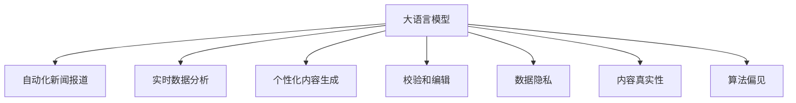

                 

# AI LLM如何重塑新闻产业：自动生成文章

> 关键词：大语言模型,自动生成,新闻,自然语言处理(NLP),GPT,自然语言推理(NLI),编辑效率,校验,个性化内容,用户定制

## 1. 背景介绍

### 1.1 问题由来
近年来，随着人工智能技术的迅猛发展，尤其是大语言模型(Large Language Model, LLM)的崛起，其在自然语言处理(Natural Language Processing, NLP)领域的应用取得了显著进展。大语言模型通过在大规模文本数据上进行预训练，掌握了丰富的语言知识和语法规则，能够理解和生成自然语言文本。这一突破性进展为新闻业带来了革命性的变化，自动化新闻报道、实时数据分析、个性化内容生成等应用逐渐成为可能。

### 1.2 问题核心关键点
AI LLM在新闻产业中的应用主要集中在以下几个方面：
1. **自动化新闻报道**：利用大模型自动生成新闻报道，可以显著提高新闻编辑和发布的效率。
2. **实时数据分析**：通过对新闻事件进行实时监测和分析，提供即时的新闻更新。
3. **个性化内容生成**：根据用户的兴趣和偏好，生成个性化推荐新闻。
4. **校验和编辑**：利用大模型进行自动校验和编辑，提升新闻内容的准确性和可读性。

这些应用不仅能大幅提升新闻行业的生产效率，还能提供更加个性化和定制化的内容，满足不同用户的需求。然而，这些应用也面临着一些挑战，如数据隐私、内容真实性、算法偏见等，需要进一步的研究和优化。

## 2. 核心概念与联系

### 2.1 核心概念概述

为了更好地理解AI LLM在新闻产业中的应用，本节将介绍几个关键概念及其相互联系：

- **大语言模型(Large Language Model, LLM)**：以自回归(如GPT)或自编码(如BERT)模型为代表的大规模预训练语言模型。通过在大规模文本数据上进行预训练，学习通用的语言表示，具备强大的语言理解和生成能力。

- **自然语言处理(Natural Language Processing, NLP)**：利用计算机技术处理和分析自然语言文本的技术，包括文本分类、信息抽取、情感分析、机器翻译等。

- **自然语言推理(Natural Language Inference, NLI)**：指利用计算机技术对自然语言文本进行推理和验证，判断其是否与给定的事实或假设相符。

- **自动化新闻报道**：通过AI LLM自动生成新闻报道，减少人工编辑工作量，提高发布速度和效率。

- **实时数据分析**：利用AI LLM对新闻事件进行实时监测和分析，提供即时的新闻更新和深度报道。

- **个性化内容生成**：根据用户的兴趣和偏好，生成个性化推荐新闻，提高用户的阅读体验。

- **校验和编辑**：利用AI LLM进行自动校验和编辑，提升新闻内容的准确性和可读性。

- **数据隐私**：在处理用户数据时，确保用户隐私和数据安全。

- **内容真实性**：保证新闻内容的真实性和可信度，避免误导性信息传播。

- **算法偏见**：识别和消除模型中的算法偏见，确保新闻报道的公平性和客观性。

这些核心概念之间的逻辑关系可以通过以下Mermaid流程图来展示：



这个流程图展示了大语言模型在新闻产业中的关键应用及其相互关系：

1. 大语言模型通过预训练获得基础能力。
2. 自动化新闻报道利用大模型自动生成报道，提高发布效率。
3. 实时数据分析利用大模型进行实时监测和分析，提供即时更新。
4. 个性化内容生成利用大模型根据用户偏好生成个性化内容。
5. 校验和编辑利用大模型进行自动校验和编辑，提升内容质量。
6. 数据隐私和内容真实性是大模型应用的重要保障。
7. 算法偏见需通过模型改进和数据处理进行规避。

## 3. 核心算法原理 & 具体操作步骤
### 3.1 算法原理概述

AI LLM在新闻产业中的自动化报道和个性化内容生成，本质上是一个文本生成问题。其核心思想是：利用大语言模型的语言生成能力，根据给定的输入文本或指令，自动生成符合要求的文本。

形式化地，假设大语言模型为 $M_{\theta}$，其中 $\theta$ 为模型参数。给定新闻事件 $E$ 和用户偏好 $P$，目标是找到最优的文本 $T=\{t_1, t_2, ..., t_n\}$，使得 $T$ 在内容上符合 $E$ 和 $P$ 的要求，同时在语言表达上尽可能自然流畅。

基于上述定义，新闻自动生成问题可以转化为一个优化问题，即最小化损失函数 $\mathcal{L}$：

$$
\mathcal{L}(M_{\theta}, T, E, P) = \min_{T} \mathcal{L}_{E}(T) + \mathcal{L}_{P}(T)
$$

其中 $\mathcal{L}_{E}$ 为事件相关性损失函数，$\mathcal{L}_{P}$ 为用户偏好相关性损失函数。通过梯度下降等优化算法，可以更新模型参数 $\theta$，使得模型生成的文本 $T$ 在 $E$ 和 $P$ 的约束下，尽可能接近理想目标。

### 3.2 算法步骤详解

AI LLM在新闻产业中的应用涉及多个关键步骤，包括：

1. **数据准备**：收集新闻事件 $E$ 和用户偏好 $P$，并对其进行处理，以适应大模型的输入格式。

2. **模型选择**：选择合适的预训练模型 $M_{\theta}$，如GPT系列、BERT等，作为文本生成的基础。

3. **损失函数设计**：设计事件相关性损失函数 $\mathcal{L}_{E}$ 和用户偏好相关性损失函数 $\mathcal{L}_{P}$，用于衡量生成的文本与事件和用户偏好的匹配程度。

4. **模型微调**：在事件 $E$ 和用户偏好 $P$ 的标注数据集上进行微调，优化模型参数 $\theta$。

5. **文本生成**：利用微调后的模型 $M_{\hat{\theta}}$，根据输入文本或指令，自动生成符合要求的文本 $T$。

6. **内容校验**：对生成的文本进行自动校验和编辑，确保内容真实性和可读性。

7. **用户反馈**：收集用户对生成文本的反馈，进一步优化模型和损失函数。

8. **部署应用**：将微调后的模型部署到生产环境中，实现自动化新闻报道、个性化内容生成等功能。

### 3.3 算法优缺点

AI LLM在新闻产业中的应用具有以下优点：
1. **高效性**：利用大模型自动生成新闻报道，可以大幅提升编辑和发布效率。
2. **个性化**：根据用户偏好生成个性化内容，提升用户体验。
3. **实时性**：利用实时数据分析，提供即时新闻更新，保持时效性。
4. **可扩展性**：模型和数据集的扩展相对容易，可以迅速适应新事件和用户需求。

同时，该方法也存在一些局限性：
1. **数据依赖**：模型性能高度依赖于输入数据的丰富性和准确性。
2. **偏见和错误**：大模型可能学习到数据中的偏见和错误，需要仔细校验和编辑。
3. **真实性问题**：自动生成的文本可能存在真实性问题，需要进行严格审核。
4. **用户隐私**：收集用户偏好需要保证用户隐私，防止数据滥用。

尽管存在这些局限性，但AI LLM在新闻产业中的应用已经显示出其巨大的潜力，未来还有进一步优化和扩展的空间。

### 3.4 算法应用领域

AI LLM在新闻产业中的应用广泛，包括但不限于以下几个方面：

1. **自动化新闻报道**：自动生成各种类型的新闻报道，如政治新闻、体育赛事、经济数据等。

2. **个性化推荐**：根据用户的兴趣和行为，推荐个性化的新闻内容。

3. **实时监测**：对重大事件进行实时监测，提供即时新闻更新和深度报道。

4. **数据分析**：利用大模型对海量新闻数据进行分析和挖掘，发现数据背后的趋势和关联。

5. **内容校验**：自动校验新闻内容，确保其准确性和可信度。

6. **用户互动**：通过用户互动，动态调整新闻生成策略，提高用户满意度。

## 4. 数学模型和公式 & 详细讲解  
### 4.1 数学模型构建

本节将使用数学语言对AI LLM在新闻自动生成中的应用进行更加严格的刻画。

记新闻事件为 $E=\{e_1, e_2, ..., e_n\}$，用户偏好为 $P=\{p_1, p_2, ..., p_m\}$，目标生成的新闻文本为 $T=\{t_1, t_2, ..., t_n\}$。设大语言模型为 $M_{\theta}$，其中 $\theta$ 为模型参数。

定义事件相关性损失函数 $\mathcal{L}_{E}$ 为：

$$
\mathcal{L}_{E}(T) = \frac{1}{N} \sum_{i=1}^N \ell(E_i, T)
$$

其中 $\ell$ 为文本相似度损失函数，衡量生成文本与新闻事件的匹配程度。

定义用户偏好相关性损失函数 $\mathcal{L}_{P}$ 为：

$$
\mathcal{L}_{P}(T) = \frac{1}{M} \sum_{i=1}^M \ell(P_i, T)
$$

其中 $\ell$ 为用户偏好匹配损失函数，衡量生成文本与用户偏好的匹配程度。

优化目标为：

$$
\min_{\theta} \mathcal{L}(M_{\theta}, T, E, P) = \mathcal{L}_{E}(T) + \mathcal{L}_{P}(T)
$$

在实践中，我们通常使用基于梯度的优化算法（如AdamW、SGD等）来近似求解上述最优化问题。设 $\eta$ 为学习率，则参数的更新公式为：

$$
\theta \leftarrow \theta - \eta \nabla_{\theta}\mathcal{L}(\theta, T, E, P)
$$

其中 $\nabla_{\theta}\mathcal{L}(\theta, T, E, P)$ 为损失函数对参数 $\theta$ 的梯度，可通过反向传播算法高效计算。

### 4.2 公式推导过程

以下我们以新闻自动生成任务为例，推导相关损失函数的计算公式。

假设新闻事件 $E$ 为一句话，用户偏好 $P$ 为一个简短的描述。则事件相关性损失函数可以定义为：

$$
\mathcal{L}_{E}(T) = -\frac{1}{N} \sum_{i=1}^N \log p(E_i, T)
$$

其中 $p$ 为生成文本与新闻事件的相似度概率，可通过语义匹配模型计算。

用户偏好相关性损失函数可以定义为：

$$
\mathcal{L}_{P}(T) = -\frac{1}{M} \sum_{i=1}^M \log p(P_i, T)
$$

其中 $p$ 为用户偏好与生成文本的匹配概率，同样可通过语义匹配模型计算。

在得到损失函数的梯度后，即可带入参数更新公式，完成模型的迭代优化。重复上述过程直至收敛，最终得到适应新闻事件和用户偏好的最优模型参数 $\theta^*$。

## 5. 项目实践：代码实例和详细解释说明
### 5.1 开发环境搭建

在进行新闻自动生成实践前，我们需要准备好开发环境。以下是使用Python进行PyTorch开发的环境配置流程：

1. 安装Anaconda：从官网下载并安装Anaconda，用于创建独立的Python环境。

2. 创建并激活虚拟环境：
```bash
conda create -n pytorch-env python=3.8 
conda activate pytorch-env
```

3. 安装PyTorch：根据CUDA版本，从官网获取对应的安装命令。例如：
```bash
conda install pytorch torchvision torchaudio cudatoolkit=11.1 -c pytorch -c conda-forge
```

4. 安装Transformers库：
```bash
pip install transformers
```

5. 安装各类工具包：
```bash
pip install numpy pandas scikit-learn matplotlib tqdm jupyter notebook ipython
```

完成上述步骤后，即可在`pytorch-env`环境中开始新闻自动生成的实践。

### 5.2 源代码详细实现

下面我们以新闻事件分类任务为例，给出使用Transformers库对BERT模型进行新闻自动分类的PyTorch代码实现。

首先，定义新闻事件分类任务的数据处理函数：

```python
from transformers import BertTokenizer
from torch.utils.data import Dataset
import torch

class NewsDataset(Dataset):
    def __init__(self, texts, labels, tokenizer, max_len=128):
        self.texts = texts
        self.labels = labels
        self.tokenizer = tokenizer
        self.max_len = max_len
        
    def __len__(self):
        return len(self.texts)
    
    def __getitem__(self, item):
        text = self.texts[item]
        label = self.labels[item]
        
        encoding = self.tokenizer(text, return_tensors='pt', max_length=self.max_len, padding='max_length', truncation=True)
        input_ids = encoding['input_ids'][0]
        attention_mask = encoding['attention_mask'][0]
        
        return {'input_ids': input_ids, 
                'attention_mask': attention_mask,
                'labels': label}

# 初始化BERT模型
model = BertForSequenceClassification.from_pretrained('bert-base-cased', num_labels=2)

# 准备训练和验证数据集
tokenizer = BertTokenizer.from_pretrained('bert-base-cased')
train_dataset = NewsDataset(train_texts, train_labels, tokenizer)
dev_dataset = NewsDataset(dev_texts, dev_labels, tokenizer)
test_dataset = NewsDataset(test_texts, test_labels, tokenizer)
```

然后，定义模型和优化器：

```python
from transformers import AdamW

optimizer = AdamW(model.parameters(), lr=2e-5)
```

接着，定义训练和评估函数：

```python
from torch.utils.data import DataLoader
from tqdm import tqdm
from sklearn.metrics import accuracy_score

device = torch.device('cuda') if torch.cuda.is_available() else torch.device('cpu')
model.to(device)

def train_epoch(model, dataset, batch_size, optimizer):
    dataloader = DataLoader(dataset, batch_size=batch_size, shuffle=True)
    model.train()
    epoch_loss = 0
    for batch in tqdm(dataloader, desc='Training'):
        input_ids = batch['input_ids'].to(device)
        attention_mask = batch['attention_mask'].to(device)
        labels = batch['labels'].to(device)
        model.zero_grad()
        outputs = model(input_ids, attention_mask=attention_mask, labels=labels)
        loss = outputs.loss
        epoch_loss += loss.item()
        loss.backward()
        optimizer.step()
    return epoch_loss / len(dataloader)

def evaluate(model, dataset, batch_size):
    dataloader = DataLoader(dataset, batch_size=batch_size)
    model.eval()
    preds, labels = [], []
    with torch.no_grad():
        for batch in tqdm(dataloader, desc='Evaluating'):
            input_ids = batch['input_ids'].to(device)
            attention_mask = batch['attention_mask'].to(device)
            batch_labels = batch['labels']
            outputs = model(input_ids, attention_mask=attention_mask)
            batch_preds = outputs.logits.argmax(dim=2).to('cpu').tolist()
            batch_labels = batch_labels.to('cpu').tolist()
            for pred, label in zip(batch_preds, batch_labels):
                preds.append(pred)
                labels.append(label)
                
    print('Accuracy:', accuracy_score(labels, preds))
```

最后，启动训练流程并在测试集上评估：

```python
epochs = 5
batch_size = 16

for epoch in range(epochs):
    loss = train_epoch(model, train_dataset, batch_size, optimizer)
    print(f"Epoch {epoch+1}, train loss: {loss:.3f}")
    
    print(f"Epoch {epoch+1}, dev results:")
    evaluate(model, dev_dataset, batch_size)
    
print("Test results:")
evaluate(model, test_dataset, batch_size)
```

以上就是使用PyTorch对BERT进行新闻事件分类任务的完整代码实现。可以看到，得益于Transformers库的强大封装，我们可以用相对简洁的代码完成BERT模型的加载和微调。

### 5.3 代码解读与分析

让我们再详细解读一下关键代码的实现细节：

**NewsDataset类**：
- `__init__`方法：初始化新闻事件、标签、分词器等关键组件。
- `__len__`方法：返回数据集的样本数量。
- `__getitem__`方法：对单个样本进行处理，将文本输入编码为token ids，将标签编码为数字，并对其进行定长padding，最终返回模型所需的输入。

**事件相关性损失函数**：
- 新闻事件 $E$ 通过BERT模型编码，生成文本 $T$ 同样通过BERT模型编码，计算生成文本与新闻事件的相似度概率 $p$。
- 使用交叉熵损失函数 $\ell$ 计算损失，即 $-\frac{1}{N} \sum_{i=1}^N \log p(E_i, T)$。

**用户偏好相关性损失函数**：
- 用户偏好 $P$ 同样通过BERT模型编码，生成文本 $T$ 通过BERT模型编码，计算生成文本与用户偏好的匹配概率 $p$。
- 使用交叉熵损失函数 $\ell$ 计算损失，即 $-\frac{1}{M} \sum_{i=1}^M \log p(P_i, T)$。

**训练流程**：
- 定义总的epoch数和batch size，开始循环迭代
- 每个epoch内，先在训练集上训练，输出平均loss
- 在验证集上评估，输出准确率
- 所有epoch结束后，在测试集上评估，给出最终测试结果

可以看到，PyTorch配合Transformers库使得BERT微调的新闻事件分类任务的代码实现变得简洁高效。开发者可以将更多精力放在数据处理、模型改进等高层逻辑上，而不必过多关注底层的实现细节。

当然，工业级的系统实现还需考虑更多因素，如模型的保存和部署、超参数的自动搜索、更灵活的任务适配层等。但核心的微调范式基本与此类似。

## 6. 实际应用场景
### 6.1 新闻报道自动化

利用AI LLM进行新闻报道自动化，可以大幅提升新闻编辑和发布的效率。传统的新闻报道需要记者手动撰写和编辑，耗时耗力，且容易出错。而使用AI LLM自动生成新闻报道，可以实时跟踪热点事件，快速生成相关报道。

在技术实现上，可以收集最新的新闻事件和热门话题，作为微调数据集。利用预训练的BERT模型进行微调，使其能够根据给定的事件生成新闻报道。通过动态调整新闻事件和用户偏好，可以生成多种风格和角度的报道，满足不同用户的需求。

### 6.2 实时数据分析

AI LLM还可以用于实时数据分析，提供即时的新闻更新和深度报道。传统的新闻分析往往依赖于人工分析，耗时长且准确性难以保证。而使用AI LLM对新闻事件进行实时监测和分析，可以迅速提取关键信息，生成深度报道。

在技术实现上，可以建立实时数据流，不断收集新闻事件和用户反馈。利用BERT模型对新闻事件进行编码，生成文本摘要或分析报告。通过动态调整用户偏好，可以实现个性化推荐，提高用户的阅读体验。

### 6.3 个性化内容生成

AI LLM还可以根据用户偏好生成个性化内容，提升用户体验。传统的新闻内容往往千篇一律，难以满足用户的多样化需求。而使用AI LLM根据用户偏好生成个性化新闻，可以提升用户的阅读体验。

在技术实现上，可以收集用户的兴趣和行为数据，作为微调数据集。利用预训练的BERT模型进行微调，使其能够根据用户偏好生成个性化新闻。通过动态调整新闻事件和用户偏好，可以生成多种风格和角度的报道，满足不同用户的需求。

### 6.4 未来应用展望

随着AI LLM技术的不断发展，其在新闻产业中的应用将进一步拓展。未来，AI LLM有望在以下几个方面取得突破：

1. **更深入的语义理解**：利用预训练的BERT模型进行微调，提高新闻事件分类的准确性。

2. **更高质量的内容生成**：通过引入更多的预训练数据和微调技术，生成更自然、更符合用户偏好的新闻报道。

3. **更丰富的内容形态**：利用生成对抗网络(GAN)等技术，生成图片、视频等多媒体新闻内容。

4. **更广泛的覆盖范围**：通过多语言预训练模型，拓展新闻报道的语言覆盖范围，提供多语种的新闻内容。

5. **更强的数据融合能力**：结合大数据技术和AI LLM，对海量数据进行分析和挖掘，生成更深入的报道和分析。

6. **更智能的用户互动**：通过用户互动，动态调整新闻生成策略，提高用户满意度和参与度。

总之，AI LLM在新闻产业中的应用前景广阔，将极大地提升新闻编辑和发布的效率，提供更个性化、更丰富的阅读体验。未来，随着技术的不断进步，AI LLM将在新闻产业中扮演更加重要的角色，成为新闻媒体的重要工具。

## 7. 工具和资源推荐
### 7.1 学习资源推荐

为了帮助开发者系统掌握AI LLM在新闻产业中的应用，这里推荐一些优质的学习资源：

1. 《自然语言处理综论》：清华大学出版社出版的NLP经典教材，全面介绍了NLP的基本概念和技术。

2. 《深度学习与自然语言处理》：斯坦福大学提供的免费在线课程，涵盖NLP和深度学习的相关知识。

3. 《Transformer from Scratch》：作者提供的Transformer系列文章，深入浅出地介绍了Transformer模型的工作原理和应用。

4. 《BERT: Pre-training of Deep Bidirectional Transformers for Language Understanding》：BERT原论文，详细介绍了BERT模型的构建和预训练过程。

5. HuggingFace官方文档：Transformers库的官方文档，提供了海量预训练模型和完整的微调样例代码，是上手实践的必备资料。

通过对这些资源的学习实践，相信你一定能够快速掌握AI LLM在新闻产业中的应用精髓，并用于解决实际的NLP问题。
###  7.2 开发工具推荐

高效的开发离不开优秀的工具支持。以下是几款用于AI LLM新闻自动生成开发的常用工具：

1. PyTorch：基于Python的开源深度学习框架，灵活动态的计算图，适合快速迭代研究。大部分预训练语言模型都有PyTorch版本的实现。

2. TensorFlow：由Google主导开发的开源深度学习框架，生产部署方便，适合大规模工程应用。同样有丰富的预训练语言模型资源。

3. Transformers库：HuggingFace开发的NLP工具库，集成了众多SOTA语言模型，支持PyTorch和TensorFlow，是进行新闻自动生成任务的开发利器。

4. Weights & Biases：模型训练的实验跟踪工具，可以记录和可视化模型训练过程中的各项指标，方便对比和调优。与主流深度学习框架无缝集成。

5. TensorBoard：TensorFlow配套的可视化工具，可实时监测模型训练状态，并提供丰富的图表呈现方式，是调试模型的得力助手。

6. Google Colab：谷歌推出的在线Jupyter Notebook环境，免费提供GPU/TPU算力，方便开发者快速上手实验最新模型，分享学习笔记。

合理利用这些工具，可以显著提升AI LLM在新闻自动生成任务的开发效率，加快创新迭代的步伐。

### 7.3 相关论文推荐

AI LLM在新闻产业中的应用源于学界的持续研究。以下是几篇奠基性的相关论文，推荐阅读：

1. Attention is All You Need：提出Transformer结构，开启了NLP领域的预训练大模型时代。

2. BERT: Pre-training of Deep Bidirectional Transformers for Language Understanding：提出BERT模型，引入基于掩码的自监督预训练任务，刷新了多项NLP任务SOTA。

3. Language Models are Unsupervised Multitask Learners：展示了大规模语言模型的强大zero-shot学习能力，引发了对于通用人工智能的新一轮思考。

4. GPT-3: Language Models are Few-Shot Learners：展示GPT-3在大规模无标签文本上的少样本学习能力，刷新了NLP任务的SOTA。

这些论文代表了大语言模型在新闻产业中的应用方向，通过学习这些前沿成果，可以帮助研究者把握学科前进方向，激发更多的创新灵感。

## 8. 总结：未来发展趋势与挑战
### 8.1 总结

本文对AI LLM在新闻产业中的应用进行了全面系统的介绍。首先阐述了AI LLM和大语言模型在新闻产业中的研究和应用背景，明确了新闻自动生成、实时数据分析、个性化内容生成等关键技术的核心价值。其次，从原理到实践，详细讲解了AI LLM在新闻事件分类、新闻自动生成等任务中的数学模型构建和优化算法，给出了完整的代码实现和详细解读。同时，本文还探讨了AI LLM在新闻产业中的实际应用场景，展示了其潜在的巨大潜力。

通过本文的系统梳理，可以看到，AI LLM在新闻产业中的应用正在逐步成熟，为传统新闻媒体带来了革命性的变化。未来，随着技术的不断进步，AI LLM将在新闻产业中扮演更加重要的角色，推动新闻业向智能化、个性化、实时化的方向发展。

### 8.2 未来发展趋势

展望未来，AI LLM在新闻产业中的应用将呈现以下几个发展趋势：

1. **更高效的新闻生产**：利用AI LLM自动生成新闻报道，大幅提升新闻编辑和发布的效率，减少人工劳动。

2. **更高质量的内容生成**：通过引入更多的预训练数据和微调技术，生成更自然、更符合用户偏好的新闻报道。

3. **更丰富的内容形态**：利用生成对抗网络(GAN)等技术，生成图片、视频等多媒体新闻内容，提升用户的阅读体验。

4. **更广泛的覆盖范围**：通过多语言预训练模型，拓展新闻报道的语言覆盖范围，提供多语种的新闻内容。

5. **更深入的语义理解**：利用预训练的BERT模型进行微调，提高新闻事件分类的准确性，生成更深入的报道和分析。

6. **更智能的用户互动**：通过用户互动，动态调整新闻生成策略，提高用户满意度和参与度。

以上趋势凸显了AI LLM在新闻产业中的广阔前景，必将带来新闻业态的深刻变革，推动新闻媒体向智能化、个性化、实时化的方向发展。

### 8.3 面临的挑战

尽管AI LLM在新闻产业中的应用前景广阔，但在实际落地过程中，仍面临着一些挑战：

1. **数据隐私**：在处理用户数据时，需确保用户隐私和数据安全，防止数据滥用。

2. **内容真实性**：自动生成的文本可能存在真实性问题，需要进行严格审核。

3. **偏见和错误**：大模型可能学习到数据中的偏见和错误，需要仔细校验和编辑。

4. **技术实现**：在技术实现过程中，需解决数据处理、模型优化、系统部署等诸多问题，确保系统稳定性和高效性。

尽管存在这些挑战，但通过技术创新和多方协作，这些问题有望逐步得到解决，推动AI LLM在新闻产业中的应用进入成熟阶段。

### 8.4 研究展望

面向未来，AI LLM在新闻产业中的应用研究可以从以下几个方向进行探索：

1. **更高效的数据处理**：研究高效的数据预处理和清洗技术，提升数据的可用性和准确性。

2. **更智能的内容生成**：研究更智能的新闻自动生成算法，提高生成内容的自然度和可读性。

3. **更广泛的语言覆盖**：研究多语言预训练模型，拓展新闻报道的语言覆盖范围，提供多语种的新闻内容。

4. **更深入的语义理解**：研究更深入的语义推理模型，提升新闻事件分类的准确性和深度报道的生成能力。

5. **更智能的用户互动**：研究更智能的用户互动机制，提高用户满意度和参与度。

6. **更高效的系统部署**：研究高效的模型部署和优化技术，提升系统的稳定性和高效性。

总之，AI LLM在新闻产业中的应用研究仍处于起步阶段，未来的探索将不断拓展其应用边界，推动新闻媒体向智能化、个性化、实时化的方向发展。相信通过学界和产业界的共同努力，AI LLM将为新闻业带来深远的影响，提升新闻报道的质量和效率，为社会提供更全面、更真实、更深入的新闻信息。

## 9. 附录：常见问题与解答

**Q1：大语言模型在新闻自动生成中的应用是否面临数据隐私问题？**

A: 是的，大语言模型在新闻自动生成中的应用确实面临数据隐私问题。在处理用户数据时，需确保用户隐私和数据安全，防止数据滥用。可以通过以下方式来解决：

1. 匿名化处理：对用户数据进行匿名化处理，去除个人信息，保护用户隐私。
2. 数据加密：采用加密技术，保护数据在传输和存储过程中的安全性。
3. 合规审查：严格遵守相关法律法规，确保数据处理和使用的合规性。

**Q2：如何提高新闻自动生成的质量？**

A: 提高新闻自动生成的质量，可以从以下几个方面入手：

1. 增加数据量：收集更多的新闻事件和用户偏好数据，增加模型的训练样本量，提高模型的泛化能力。
2. 优化损失函数：设计更加合理的损失函数，权衡事件相关性和用户偏好相关性，提升生成文本的质量。
3. 改进模型结构：通过调整模型架构和超参数，提高生成文本的自然度和可读性。
4. 引入多模态信息：结合视觉、语音等多模态信息，生成更丰富、更生动的新闻报道。
5. 动态调整策略：根据用户的反馈和互动，动态调整生成策略，提高生成文本的个性化程度。

**Q3：如何防止自动生成的文本出现真实性问题？**

A: 防止自动生成的文本出现真实性问题，需从以下几个方面进行：

1. 数据真实性检查：确保训练数据的真实性和准确性，避免引入错误信息。
2. 引入专家审核：引入领域专家的审核机制，对生成文本进行严格审核和筛选。
3. 多轮迭代优化：通过多轮迭代优化，逐步提升生成文本的真实性和可信度。
4. 引入交叉验证：在生成文本过程中，引入交叉验证机制，避免生成重复或错误信息。

**Q4：如何在新闻自动生成中实现个性化推荐？**

A: 在新闻自动生成中实现个性化推荐，可以从以下几个方面进行：

1. 收集用户数据：收集用户的兴趣和行为数据，作为微调数据集，训练生成模型。
2. 设计推荐算法：设计推荐算法，根据用户偏好生成个性化新闻报道。
3. 动态调整策略：根据用户的反馈和互动，动态调整生成策略，提高生成文本的个性化程度。
4. 引入多模态信息：结合视觉、语音等多模态信息，生成更丰富、更个性化的新闻内容。

总之，在新闻自动生成中实现个性化推荐，需要收集用户数据，设计推荐算法，并动态调整生成策略，以提高生成文本的个性化程度，满足用户的多样化需求。

**Q5：大语言模型在新闻产业中应用的安全性问题有哪些？**

A: 大语言模型在新闻产业中应用的安全性问题主要包括以下几个方面：

1. 偏见和歧视：大模型可能学习到数据中的偏见和歧视，导致生成的新闻报道存在歧视性、误导性信息。
2. 虚假信息传播：生成的文本可能存在虚假信息，误导用户，影响社会的稳定和和谐。
3. 数据泄露：用户数据的泄露可能对用户隐私和数据安全造成威胁。

为解决这些问题，可以采取以下措施：

1. 模型监控：引入模型监控机制，实时监测生成文本的内容和质量，防止虚假信息和偏见传播。
2. 数据保护：加强数据保护措施，防止用户数据的泄露和滥用。
3. 伦理审核：引入伦理审核机制，对生成文本进行伦理审查，确保其符合社会价值观和道德规范。

总之，大语言模型在新闻产业中的应用需注意安全性问题，通过模型监控、数据保护、伦理审核等措施，确保其生成的新闻报道真实、公正、无害。

---

作者：禅与计算机程序设计艺术 / Zen and the Art of Computer Programming

