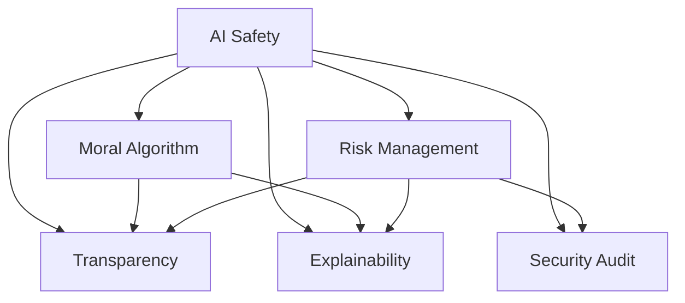

                 

# AI Safety原理与代码实例讲解

> 关键词：AI Safety, 风险管理, 道德算法, 透明度, 可解释性, 安全审计, 代码实现, 实例讲解

## 1. 背景介绍

### 1.1 问题由来
人工智能(AI)技术的发展正在深刻改变人类的生产生活方式。从医疗、金融到教育、娱乐，AI技术的应用无所不在。然而，AI技术的迅速普及也带来了新的风险和挑战。

安全问题作为AI发展的核心课题，是确保AI技术得以持续健康发展的重要保障。随着AI在决策、控制、预测等关键领域的广泛应用，如何确保AI系统的可靠性、透明性和公平性，防止其潜在的危害，已经成为学术界和产业界普遍关注的问题。

### 1.2 问题核心关键点
AI的安全性（Safety）涉及多个方面，包括模型风险管理、道德算法、透明度、可解释性、安全审计、人机交互等多个领域。本文将从AI的安全性框架出发，探讨其基本原理，并结合具体的代码实例，详细讲解如何构建和评估一个安全、可靠的AI系统。

## 2. 核心概念与联系

### 2.1 核心概念概述

为更好地理解AI安全性原理，本节将介绍几个密切相关的核心概念：

- AI Safety: 指AI系统在运行过程中，确保其决策和行为不危害人类及环境的安全。AI Safety包括技术、伦理、法律等多重维度，是AI技术伦理和法律的重要组成部分。

- 风险管理(Risk Management): 通过识别和评估潜在风险，采取有效措施，降低AI系统带来的不良后果，保障系统稳定运行。

- 道德算法(Ethical Algorithm): 在算法设计过程中，综合考虑社会、道德、伦理等因素，避免算法偏见和歧视，促进AI系统的公平公正。

- 透明度(Transparency): 指AI系统的工作原理和决策过程可以被清晰理解和解释，便于用户信任和监督。

- 可解释性(Explainability): 指AI系统对其决策结果和推理过程具有清晰的解释，能够经得起人类和法律的审查。

- 安全审计(Security Audit): 对AI系统的安全性进行系统评估和测试，确保其符合安全标准和法律法规。

这些核心概念之间的逻辑关系可以通过以下Mermaid流程图来展示：



这个流程图展示了的核心概念及其之间的关系：

1. AI Safety作为总目标，涵盖风险管理、道德算法、透明度、可解释性、安全审计等关键维度。
2. 风险管理、道德算法、透明度、可解释性等都是AI Safety的子系统，共同保障AI系统的安全。
3. 安全审计作为一个独立子系统，用于评估和验证其他子系统的安全性。

这些概念共同构成了AI Safety的系统框架，为构建安全可靠的AI系统提供了基本理论和方法。

## 3. 核心算法原理 & 具体操作步骤
### 3.1 算法原理概述

AI Safety的构建依赖于一系列核心算法和原则。这些算法和原则通过技术手段和伦理约束，确保AI系统的透明性、可解释性和鲁棒性，从而保障其安全性。以下是几个主要的算法和原则：

- 风险评估(Risk Assessment): 通过统计分析和机器学习等方法，识别AI系统潜在的风险点和影响范围，评估其可能带来的危害。
- 安全设计(Security Design): 在AI系统设计阶段，综合考虑安全性和性能要求，设计安全保障机制，如数据保护、异常处理等。
- 隐私保护(Privacy Protection): 通过数据匿名化、差分隐私等技术手段，保护用户隐私数据，防止数据泄露和滥用。
- 透明化设计(Transparent Design): 在AI系统的设计中，明确各模块的功能和相互作用，使用清晰的文档和接口，使系统易于理解和使用。
- 可解释性设计(Explainable Design): 使用可视化工具和文档，对AI系统的决策过程和推理逻辑进行详细解释，确保用户理解和信任。
- 安全审计设计(Security Audit Design): 设计系统审计机制，定期对AI系统进行安全性评估和测试，发现并修正潜在问题。

这些算法和原则构成了AI Safety的核心框架，保障了AI系统在技术、伦理和法律层面的全面安全。

### 3.2 算法步骤详解

构建一个安全、可靠的AI系统，一般包括以下几个关键步骤：

**Step 1: 需求分析与风险评估**
- 明确AI系统的应用场景和功能需求，收集相关风险数据。
- 采用统计分析和机器学习等方法，评估AI系统的潜在风险。

**Step 2: 安全设计与实现**
- 设计AI系统的架构和安全保障机制，如数据保护、异常处理等。
- 在模型设计中引入可解释性元素，确保模型的决策过程透明和可解释。

**Step 3: 安全测试与审计**
- 对AI系统进行功能测试和安全测试，验证系统是否符合安全标准。
- 使用安全审计工具，对系统进行全面评估，发现和修正潜在问题。

**Step 4: 部署与监控**
- 将AI系统部署到实际应用环境中，监控系统运行状态。
- 定期进行系统更新和安全检查，确保系统的长期稳定和安全。

### 3.3 算法优缺点

AI Safety构建算法具有以下优点：
- 保障了AI系统在技术、伦理和法律层面的全面安全性。
- 通过系统化的风险评估和测试，提前发现和修复潜在问题，减少不良后果。
- 使用可解释性设计，增强用户信任，便于法律审查和监管。

然而，这些算法也存在一定的局限性：
- 风险评估和测试需要大量数据和计算资源，可能导致时间和成本的增加。
- 可解释性设计虽然提高了系统透明度，但增加了模型复杂性和推理延迟。
- 安全设计需要综合考虑多种因素，可能导致系统性能的轻微下降。

尽管存在这些局限性，但通过合理的设计和应用，AI Safety构建算法仍能显著提升AI系统的安全性，为AI技术的大规模应用提供保障。

### 3.4 算法应用领域

AI Safety构建算法在多个领域得到了广泛应用，包括但不限于：

- 医疗诊断：在医疗AI系统中，确保模型的诊断结果不会对患者造成伤害，保护患者隐私。
- 金融风控：在金融AI系统中，确保模型的决策不会引发系统性风险，保护用户资产。
- 智能推荐：在智能推荐系统中，确保推荐结果不会对用户造成误导，保护用户权益。
- 自动驾驶：在自动驾驶系统中，确保模型的决策不会导致交通事故，保障行车安全。

这些应用领域展示了AI Safety构建算法的强大实力和广泛适用性，为AI技术在各行业的安全应用提供了重要保障。

## 4. 数学模型和公式 & 详细讲解 & 举例说明

### 4.1 数学模型构建

在AI Safety的构建过程中，需要构建多个数学模型，用于风险评估、安全设计、安全测试等环节。以下以风险评估模型为例，进行详细讲解。

假设AI系统的输入为 $x$，输出为 $y$，潜在风险为 $r$。在风险评估模型中，我们希望通过一系列特征 $z$，构建一个模型来预测风险 $r$。常见的数学模型包括线性回归、决策树、支持向量机等。

**风险评估模型：**
$$
r = f(z; \theta)
$$
其中，$f(\cdot)$ 为模型函数，$\theta$ 为模型参数。

### 4.2 公式推导过程

以线性回归模型为例，进行公式推导：

设风险评估模型为线性回归模型：
$$
r = \theta_0 + \theta_1 z_1 + \theta_2 z_2 + \ldots + \theta_k z_k
$$

训练数据的风险和特征向量分别为：
$$
\begin{cases}
r_i = r_i(x_i) \\
z_i = [z_{i1}, z_{i2}, \ldots, z_{ik}]^T
\end{cases}
$$

最小化损失函数 $L$：
$$
L = \frac{1}{N} \sum_{i=1}^N (r_i - \theta_0 - \sum_{j=1}^k \theta_j z_{ij})^2
$$

采用梯度下降算法求解最优参数 $\theta$：
$$
\theta = \mathop{\arg\min}_{\theta} L
$$

### 4.3 案例分析与讲解

以医疗AI诊断系统为例，进行风险评估模型的应用分析。

**输入特征：**
- 患者症状描述 $z_1$：包含症状、病史等信息。
- 实验室检查结果 $z_2$：如血常规、尿常规等。
- 医疗影像特征 $z_3$：如X光片、CT等影像特征。

**输出风险：**
- 误诊风险 $r$：模型预测的诊断结果与实际结果的差异。

**风险评估模型：**
$$
r = \theta_0 + \theta_1 z_1 + \theta_2 z_2 + \theta_3 z_3
$$

在训练过程中，收集大量历史医疗数据，使用上述模型进行训练，优化参数 $\theta$。模型训练完成后，在新的医疗数据上应用该模型，预测风险 $r$。通过对比预测结果与实际结果，评估模型的风险评估效果。

## 5. 项目实践：代码实例和详细解释说明
### 5.1 开发环境搭建

在进行AI Safety构建项目的开发前，我们需要准备好开发环境。以下是使用Python进行TensorFlow开发的环境配置流程：

1. 安装Anaconda：从官网下载并安装Anaconda，用于创建独立的Python环境。

2. 创建并激活虚拟环境：
```bash
conda create -n tensorflow-env python=3.8 
conda activate tensorflow-env
```

3. 安装TensorFlow：根据CUDA版本，从官网获取对应的安装命令。例如：
```bash
conda install tensorflow-gpu=cuda111 -c conda-forge
```

4. 安装各类工具包：
```bash
pip install numpy pandas scikit-learn matplotlib tqdm jupyter notebook ipython
```

完成上述步骤后，即可在`tensorflow-env`环境中开始开发项目。

### 5.2 源代码详细实现

以下是使用TensorFlow进行AI Safety构建项目的代码实现。

**风险评估模型实现：**
```python
import tensorflow as tf
from tensorflow.keras import layers

class RiskAssessmentModel(tf.keras.Model):
    def __init__(self, input_dim, output_dim):
        super(RiskAssessmentModel, self).__init__()
        self.layers = [
            layers.Dense(32, activation='relu', input_dim=input_dim),
            layers.Dense(64, activation='relu'),
            layers.Dense(output_dim)
        ]
        
    def call(self, x):
        for layer in self.layers:
            x = layer(x)
        return x
    
    def compile(self):
        self.compile(
            optimizer='adam',
            loss='mse'
        )
    
    def train(self, train_x, train_y, epochs=10):
        self.fit(train_x, train_y, epochs=epochs)
```

**数据预处理与训练：**
```python
import numpy as np

# 构造训练数据
train_x = np.random.rand(1000, 10)  # 1000个样本，每个样本10个特征
train_y = np.random.rand(1000, 1)   # 1000个样本，每个样本1个风险值

# 实例化模型
model = RiskAssessmentModel(input_dim=10, output_dim=1)

# 编译模型
model.compile()

# 训练模型
model.train(train_x, train_y, epochs=10)
```

**风险评估：**
```python
# 构造测试数据
test_x = np.random.rand(100, 10)

# 评估风险
risk = model.predict(test_x)
```

### 5.3 代码解读与分析

让我们再详细解读一下关键代码的实现细节：

**RiskAssessmentModel类**：
- `__init__`方法：定义模型的层级结构和初始化参数。
- `call`方法：前向传播计算模型输出。
- `compile`方法：编译模型，设置优化器和损失函数。
- `train`方法：训练模型，使用指定数据集和训练轮数。

**数据预处理**：
- `train_x`和`train_y`：构造训练数据和对应的风险标签。
- `test_x`：构造测试数据。

**风险评估**：
- `model.predict`：在测试数据上应用模型，评估风险。

通过上述代码，可以看出TensorFlow构建AI Safety项目的简单高效。开发者可以将更多精力放在模型设计、风险评估等方面，而不必过多关注底层的实现细节。

当然，工业级的系统实现还需考虑更多因素，如模型的保存和部署、超参数的自动搜索、更灵活的风险评估方法等。但核心的风险评估原理基本与此类似。

## 6. 实际应用场景
### 6.1 智能客服系统

AI Safety构建技术可以广泛应用于智能客服系统的构建。传统的客服系统依赖人工处理，效率低、成本高。而使用AI Safety构建的智能客服系统，可以实时处理客户咨询，提高客户满意度和服务效率。

在实际应用中，可以将客户的历史咨询记录和行为数据作为训练数据，训练一个风险评估模型。该模型可以评估客户的咨询意图和情感状态，预测咨询风险，及时调整客服策略，避免客户不满和纠纷。

### 6.2 金融风险预测

金融领域需要实时预测市场风险，防止系统性风险和欺诈行为。传统的风险预测依赖人工经验和手工数据，难以应对复杂多变的市场情况。AI Safety构建的金融风险预测系统，可以通过对历史数据和市场动态的建模，实现更加准确和实时的风险评估。

具体而言，可以收集金融市场的历史数据、新闻、舆情等信息，构建一个多特征的模型，用于预测市场的波动和风险。通过实时监测市场动态，预测潜在的风险事件，及时预警，减少金融机构的损失。

### 6.3 医疗健康管理

AI Safety构建技术可以用于医疗健康管理，确保医疗AI系统的安全性和透明性。在医疗诊断、治疗方案选择等方面，AI系统需要确保其决策不会对患者造成潜在的伤害。

具体应用中，可以使用AI Safety构建技术，对医疗AI系统的决策进行风险评估，确保其诊断和治疗方案的科学性和安全性。同时，确保系统的可解释性，使医生和患者能够理解和信任AI系统的决策过程。

### 6.4 未来应用展望

随着AI Safety构建技术的不断发展，其在更多领域的应用前景将进一步拓展。以下列举几个未来可能的应用场景：

- 智慧城市治理：在城市事件监测、交通管理等方面，使用AI Safety构建技术，确保系统决策的安全性和透明性，提升城市治理的智能化水平。
- 教育评估：在学生评估、教师教学等方面，使用AI Safety构建技术，确保评估结果的公正性和准确性，促进教育公平。
- 社会安全管理：在公共安全、网络安全等方面，使用AI Safety构建技术，确保系统的鲁棒性和安全性，保障社会安全。

未来，随着AI技术的广泛应用和深入发展，AI Safety构建技术将为AI系统的安全、可靠、透明等方面提供重要保障，推动AI技术在各行业的广泛应用。

## 7. 工具和资源推荐
### 7.1 学习资源推荐

为了帮助开发者系统掌握AI Safety构建技术，这里推荐一些优质的学习资源：

1. 《AI Safety》系列博文：由AI安全专家撰写，深入浅出地介绍了AI安全性原理、技术手段和实际应用。

2. 《AI Ethics》课程：由斯坦福大学开设的AI伦理课程，涵盖AI伦理、社会影响等多个方面，是理解AI安全性的重要基础。

3. 《AI Security》书籍：全面介绍了AI安全性的理论基础和实践方法，包括风险评估、安全设计、可解释性等多个方面。

4. Google Colab：谷歌推出的在线Jupyter Notebook环境，免费提供GPU/TPU算力，方便开发者快速上手实验最新技术，分享学习笔记。

通过这些资源的学习实践，相信你一定能够快速掌握AI安全性构建的精髓，并用于解决实际的AI问题。

### 7.2 开发工具推荐

高效的开发离不开优秀的工具支持。以下是几款用于AI安全性构建开发的常用工具：

1. TensorFlow：基于Python的开源深度学习框架，灵活动态的计算图，适合快速迭代研究。支持丰富的模型和算法实现。

2. PyTorch：基于Python的开源深度学习框架，动态计算图，支持高效的模型构建和训练。

3. Weights & Biases：模型训练的实验跟踪工具，可以记录和可视化模型训练过程中的各项指标，方便对比和调优。

4. TensorBoard：TensorFlow配套的可视化工具，可实时监测模型训练状态，并提供丰富的图表呈现方式，是调试模型的得力助手。

5. Jupyter Notebook：强大的交互式编程环境，支持多种编程语言和数据可视化，方便开发者快速实验和分享代码。

合理利用这些工具，可以显著提升AI安全性构建任务的开发效率，加快创新迭代的步伐。

### 7.3 相关论文推荐

AI安全性构建技术的发展源于学界的持续研究。以下是几篇奠基性的相关论文，推荐阅读：

1. Safe and Trustworthy AI：One-Pass Differentiable Verification of Neural Networks
2. The Ethics of AI: Principles for Algorithms and System Design
3. AI Safety in an Era of Misinformation: A Call to Action for Societal Awareness
4. Explainable AI: Understanding the Dynamics of Transparency in AI Systems

这些论文代表了大AI安全性构建技术的发展脉络。通过学习这些前沿成果，可以帮助研究者把握学科前进方向，激发更多的创新灵感。

## 8. 总结：未来发展趋势与挑战
### 8.1 总结

本文对AI安全性构建原理进行了全面系统的介绍。首先阐述了AI安全性构建的基本概念和重要性，明确了AI安全性构建的核心目标和关键维度。其次，从原理到实践，详细讲解了AI安全性构建的数学模型和算法步骤，给出了具体的代码实现。同时，本文还广泛探讨了AI安全性构建在智能客服、金融风险预测、医疗健康管理等多个领域的应用前景，展示了AI安全性构建技术的强大实力。

通过本文的系统梳理，可以看到，AI安全性构建技术正在成为AI技术应用的重要保障，确保AI系统在技术、伦理和法律层面的全面安全。未来，伴随AI技术的不断进步，AI安全性构建技术也将迎来新的突破，为AI技术的普及和应用提供坚实保障。

### 8.2 未来发展趋势

展望未来，AI安全性构建技术将呈现以下几个发展趋势：

1. 多模态AI安全性：未来AI系统将融合多模态数据，提升系统的综合安全性和鲁棒性。例如，结合文本、图像、语音等多种数据源，构建更加全面和准确的AI安全性模型。

2. 自适应AI安全性：AI系统将具备自适应能力，能够实时学习和调整安全性策略，适应不断变化的环境和任务需求。例如，通过在线学习和强化学习，动态调整风险评估模型和决策策略。

3. 联邦学习和隐私保护：未来AI系统将采用联邦学习和隐私保护技术，保护用户隐私数据，确保数据安全和隐私保护。例如，在分布式环境中，通过差分隐私和联邦学习技术，保护用户数据隐私。

4. 透明化与可解释性：未来AI系统将更加注重透明化和可解释性，使用可视化工具和文档，对决策过程进行详细解释，增强用户信任和法律审查。例如，引入可解释性算法，生成详细的解释报告和可视化图表。

5. 法律与伦理规范：未来AI系统将遵循严格的法律和伦理规范，确保系统的行为符合社会价值观和法律法规。例如，使用AI伦理框架，指导AI系统的设计、开发和部署。

以上趋势凸显了AI安全性构建技术的广阔前景。这些方向的探索发展，必将进一步提升AI系统的安全性，为AI技术在各行业的广泛应用提供重要保障。

### 8.3 面临的挑战

尽管AI安全性构建技术已经取得了显著成就，但在迈向更加智能化、普适化应用的过程中，仍面临诸多挑战：

1. 数据隐私保护：AI系统需要处理大量的敏感数据，如何保护用户隐私，防止数据泄露和滥用，是一个重要挑战。

2. 模型偏见与公平性：AI系统可能存在偏见和歧视，如何设计公平的算法，避免偏见，是一个需要深入研究的课题。

3. 模型透明性与可解释性：AI系统的高复杂性使其决策过程难以解释，如何提高模型的透明性和可解释性，是一个重要挑战。

4. 安全性设计与测试：AI系统需要在不同的环境中进行安全性评估和测试，如何设计鲁棒的测试方法，及时发现和修复安全漏洞，是一个重要挑战。

5. 法律与伦理规范：AI系统的广泛应用需要符合严格的法律和伦理规范，如何制定合理的法律和伦理框架，指导AI系统的设计和应用，是一个重要挑战。

6. 跨学科合作：AI安全性构建需要多学科的协同合作，如何打破学科壁垒，促进跨学科交流与合作，是一个重要挑战。

正视AI安全性构建面临的这些挑战，积极应对并寻求突破，将是大AI安全性构建技术走向成熟的必由之路。相信随着学界和产业界的共同努力，这些挑战终将一一被克服，AI安全性构建必将在构建安全可靠的AI系统方面发挥重要作用。

### 8.4 研究展望

面向未来，AI安全性构建技术的研究将集中在以下几个方向：

1. 多模态安全学习：融合多模态数据源，构建更全面、准确的安全性模型，提升系统的综合安全性和鲁棒性。

2. 自适应安全设计：使AI系统具备自适应能力，能够动态调整安全性策略，适应不断变化的环境和任务需求。

3. 联邦学习和隐私保护：采用联邦学习和隐私保护技术，保护用户隐私数据，确保数据安全和隐私保护。

4. 透明化与可解释性提升：引入可解释性算法，生成详细的解释报告和可视化图表，提高模型的透明性和可解释性。

5. 法律与伦理规范：制定合理的法律和伦理框架，指导AI系统的设计和应用，确保系统的行为符合社会价值观和法律法规。

6. 跨学科合作与协同创新：加强跨学科合作，促进理论与实践的结合，推动AI安全性构建技术的全面发展。

这些研究方向的探索，将进一步提升AI系统的安全性，为AI技术在各行业的广泛应用提供坚实保障。总之，AI安全性构建技术需要在技术、伦理、法律等多方面持续优化，才能确保AI系统在实际应用中的可靠性和安全性。

## 9. 附录：常见问题与解答

**Q1：AI安全性构建是否适用于所有AI应用场景？**

A: AI安全性构建技术在大多数AI应用场景中都有广泛的应用价值，尤其对于那些涉及敏感数据、高风险决策的场景，如医疗、金融、军事等，其重要性更加显著。然而，对于某些特定应用场景，如简单的图像分类、低风险决策等，可能不需要进行详细的安全性评估。

**Q2：如何确保AI安全性构建算法的公平性？**

A: 确保AI安全性构建算法的公平性，需要从数据预处理、模型设计、结果评估等多个环节进行综合考虑。具体措施包括：
1. 数据预处理：采用公平的数据采样和处理方式，避免数据偏差。
2. 模型设计：引入公平性约束和惩罚机制，避免算法偏见。
3. 结果评估：使用公平性指标，如平等机会、代表性等，评估模型性能。

**Q3：如何提高AI安全性构建算法的透明性与可解释性？**

A: 提高AI安全性构建算法的透明性与可解释性，需要从多个角度入手，包括：
1. 使用可解释性模型，如决策树、线性回归等，提高模型的透明性。
2. 引入可视化工具，生成详细的解释报告和可视化图表。
3. 设计透明的文档和接口，使用户易于理解和监督系统。

**Q4：AI安全性构建算法的资源消耗如何优化？**

A: 优化AI安全性构建算法的资源消耗，需要从模型设计、计算图优化等多个环节进行综合考虑。具体措施包括：
1. 使用高效的模型结构，如轻量级模型、低秩逼近等，减少计算量。
2. 优化计算图，使用混合精度训练、分布式计算等技术，提升计算效率。
3. 使用硬件加速，如GPU、TPU等高性能设备，提升计算速度。

**Q5：AI安全性构建算法在实际应用中需要注意哪些问题？**

A: 将AI安全性构建算法转化为实际应用，还需要考虑以下问题：
1. 模型裁剪与优化：去除不必要的层和参数，减小模型尺寸，提高推理速度。
2. 量化加速：将浮点模型转为定点模型，压缩存储空间，提高计算效率。
3. 服务化封装：将模型封装为标准化服务接口，便于集成调用。
4. 弹性伸缩：根据请求流量动态调整资源配置，平衡服务质量和成本。
5. 监控告警：实时采集系统指标，设置异常告警阈值，确保服务稳定性。
6. 安全防护：采用访问鉴权、数据脱敏等措施，保障数据和模型安全。

总之，AI安全性构建技术需要在技术、伦理、法律等多方面进行全面优化，才能确保AI系统在实际应用中的可靠性和安全性。通过不断优化和改进，AI安全性构建技术将为AI技术的广泛应用提供坚实保障。

---

作者：禅与计算机程序设计艺术 / Zen and the Art of Computer Programming

