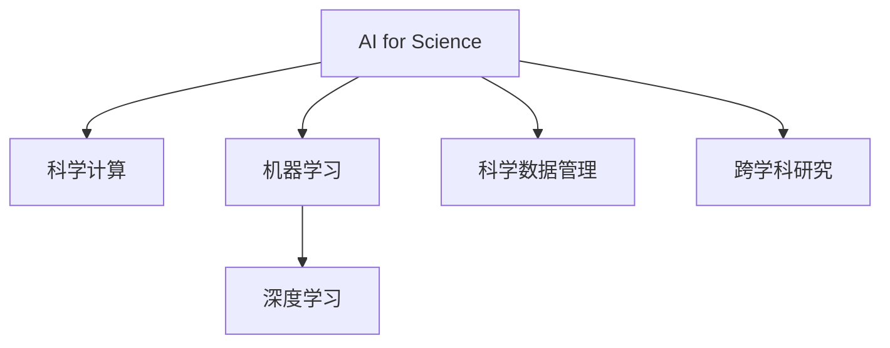

                 

# AI for Science的跨学科应用

## 1. 背景介绍

### 1.1 问题由来

随着人工智能(AI)技术的飞速发展，AI已经不再局限于传统的计算机科学范畴，而是渗透到了各学科领域。AI for Science，即AI在科学研究中的应用，已经成为了推动科学研究进步的重要工具。这种跨学科的应用，不仅提升了科学研究的效率和精度，还开辟了新的研究方向和方法，产生了深远的影响。

### 1.2 问题核心关键点

AI for Science的核心关键点包括：

- **跨学科融合**：AI与生物学、化学、物理学、天文学等各学科的深度融合，产生了新的交叉学科如计算生物学、化学生物学、物理化学等。

- **数据驱动研究**：AI技术使得科学研究可以更有效地处理和分析大规模数据集，揭示科学现象背后的规律。

- **新方法和新工具**：AI为科学研究提供了新的计算方法和实验工具，如深度学习、自然语言处理、计算机视觉等，极大地拓宽了研究领域和深度。

- **科学计算和模拟**：AI在科学计算和模拟中扮演了重要角色，提升了计算效率和精度，加速了科学发现的过程。

- **科学数据管理**：AI在科学数据的存储、处理和分析中发挥了重要作用，使得科学数据更易于管理和利用。

- **科研协作**：AI技术支持了科研团队的协作，使得跨学科、跨国界的科研合作更加高效和便捷。

## 2. 核心概念与联系

### 2.1 核心概念概述

为了更好地理解AI for Science，本节将介绍几个密切相关的核心概念：

- **AI for Science**：指AI技术在科学研究中的应用，涉及算法、数据、工具等多个方面，旨在加速科学发现和创新。

- **科学计算**：指使用计算机科学方法进行科学研究和实验的过程，包括模拟、计算、数据分析等。

- **机器学习**：指利用算法和统计模型，从数据中自动提取特征，进行预测和决策的技术。

- **深度学习**：一种特殊类型的机器学习，通过多层神经网络模拟人脑的神经元网络，适用于处理大规模、复杂的数据集。

- **科学数据管理**：指对科学实验数据、实验记录、文献等进行标准化管理和共享的过程。

- **跨学科研究**：指跨越不同学科领域，利用多学科知识和方法进行研究和创新的过程。

这些概念之间的逻辑关系可以通过以下Mermaid流程图来展示：



这个流程图展示了大语言模型的核心概念及其之间的关系：

1. AI for Science是核心概念，涵盖了科学计算、机器学习、深度学习等多个方面。
2. 科学计算是AI for Science的基础，为科学研究和实验提供计算支持。
3. 机器学习和深度学习是AI for Science的主要技术手段，用于数据处理和模型训练。
4. 科学数据管理是AI for Science的重要环节，涉及数据的存储、共享和利用。
5. 跨学科研究是AI for Science的高级形式，涉及多学科的融合和创新。

## 3. 核心算法原理 & 具体操作步骤

### 3.1 算法原理概述

AI for Science的核心算法包括机器学习、深度学习、自然语言处理等，这些算法在科学研究中的应用需要跨学科的协作和创新。以深度学习为例，其基本原理是通过多层神经网络，自动提取数据特征，并进行模式识别和预测。深度学习的成功主要依赖于大规模数据的支持，并结合反向传播等优化算法，不断调整模型参数，最终获得最佳的预测结果。

### 3.2 算法步骤详解

以深度学习在计算生物学中的应用为例，其步骤可以分为以下几个：

**Step 1: 数据准备**
- 收集和预处理生物学实验数据，如基因序列、蛋白质结构、代谢通路等。
- 对数据进行标注，以便训练模型。

**Step 2: 模型设计**
- 选择合适的深度学习模型，如卷积神经网络、循环神经网络等，进行模型设计和超参数调优。
- 设计损失函数和优化算法，如交叉熵、Adam等。

**Step 3: 模型训练**
- 使用标注数据对模型进行训练，不断调整参数以最小化损失函数。
- 定期在验证集上进行评估，防止过拟合。

**Step 4: 模型评估**
- 使用测试集对模型进行评估，计算准确率、精确率、召回率等指标。
- 分析模型性能，识别模型局限性。

**Step 5: 模型应用**
- 使用训练好的模型对新数据进行预测和分析。
- 结合其他科学知识和实验结果，进一步验证和改进模型。

### 3.3 算法优缺点

AI for Science的算法具有以下优点：

- **数据驱动**：利用大规模数据进行训练和预测，能够发现数据中的潜在规律和趋势。
- **自动化**：自动提取数据特征和调整模型参数，减少了人工干预的复杂性和误差。
- **泛化能力强**：通过大规模数据训练的模型，具有较强的泛化能力，适用于多种场景和问题。
- **集成多学科知识**：结合多学科的知识和方法，解决了单学科难以解决的问题。

同时，这些算法也存在一些缺点：

- **依赖数据质量**：模型性能高度依赖于数据的质量和数量，数据偏差可能导致模型偏见。
- **计算资源消耗大**：深度学习等算法需要大量的计算资源，包括高性能计算机、GPU等。
- **模型复杂性高**：深度学习等模型结构复杂，难以理解和解释，存在"黑盒"问题。
- **数据隐私问题**：涉及生物、医学等敏感数据，数据隐私和安全问题需要特别关注。

## 4. 数学模型和公式 & 详细讲解 & 举例说明

### 4.1 数学模型构建

以卷积神经网络(CNN)为例，其数学模型可以表示为：

$$
y = f(x; \theta)
$$

其中，$f$为卷积神经网络，$x$为输入数据，$\theta$为模型参数。CNN的结构如图1所示：

```
              |
              V
             L
            / \\
           /   \\
          /     \\
         Conv  max pooling
          \     /
           \\   /
            V  L
             /
             V
            o
```

图1：卷积神经网络结构

### 4.2 公式推导过程

卷积神经网络的公式推导过程如下：

1. 输入数据 $x$ 通过卷积层 $Conv$，得到特征图 $h$：

$$
h = Conv(x; \theta)
$$

其中，$\theta$ 为卷积核参数。

2. 特征图 $h$ 通过池化层 $pool$，得到下采样后的特征图 $g$：

$$
g = pool(h; \theta)
$$

3. 将特征图 $g$ 输入全连接层 $FC$，得到输出 $y$：

$$
y = FC(g; \theta)
$$

### 4.3 案例分析与讲解

以使用CNN进行图像分类为例，其步骤如下：

**Step 1: 数据准备**
- 收集和预处理图像数据集，如MNIST手写数字数据集。
- 对数据进行标注，例如将手写数字图像分类为0-9中的某个数字。

**Step 2: 模型设计**
- 使用两层的卷积神经网络，第一层卷积核大小为3x3，第二层卷积核大小为2x2，使用ReLU激活函数和max pooling操作。
- 在全连接层中使用softmax函数进行分类。

**Step 3: 模型训练**
- 使用随机梯度下降法对模型进行训练，最小化交叉熵损失。
- 使用验证集进行超参数调优，防止过拟合。

**Step 4: 模型评估**
- 使用测试集对模型进行评估，计算准确率、精确率、召回率等指标。

**Step 5: 模型应用**
- 使用训练好的模型对新图像进行分类。

## 5. 项目实践：代码实例和详细解释说明

### 5.1 开发环境搭建

在进行AI for Science项目实践前，我们需要准备好开发环境。以下是使用Python进行TensorFlow开发的环境配置流程：

1. 安装Anaconda：从官网下载并安装Anaconda，用于创建独立的Python环境。

2. 创建并激活虚拟环境：
```bash
conda create -n tf-env python=3.7 
conda activate tf-env
```

3. 安装TensorFlow：根据CUDA版本，从官网获取对应的安装命令。例如：
```bash
pip install tensorflow
```

4. 安装各类工具包：
```bash
pip install numpy pandas scikit-learn matplotlib tqdm jupyter notebook ipython
```

完成上述步骤后，即可在`tf-env`环境中开始项目实践。

### 5.2 源代码详细实现

下面我们以使用TensorFlow进行图像分类为例，给出完整的代码实现。

```python
import tensorflow as tf
from tensorflow.keras import layers, models

# 加载数据集
(x_train, y_train), (x_test, y_test) = tf.keras.datasets.mnist.load_data()

# 数据预处理
x_train = x_train.reshape(-1, 28, 28, 1).astype('float32') / 255.0
x_test = x_test.reshape(-1, 28, 28, 1).astype('float32') / 255.0

# 定义模型
model = models.Sequential([
    layers.Conv2D(32, (3, 3), activation='relu', input_shape=(28, 28, 1)),
    layers.MaxPooling2D((2, 2)),
    layers.Conv2D(64, (3, 3), activation='relu'),
    layers.MaxPooling2D((2, 2)),
    layers.Conv2D(64, (3, 3), activation='relu'),
    layers.Flatten(),
    layers.Dense(64, activation='relu'),
    layers.Dense(10, activation='softmax')
])

# 编译模型
model.compile(optimizer='adam',
              loss=tf.keras.losses.SparseCategoricalCrossentropy(from_logits=True),
              metrics=['accuracy'])

# 训练模型
model.fit(x_train, y_train, epochs=5, validation_data=(x_test, y_test))

# 评估模型
model.evaluate(x_test, y_test)

# 预测新图像
new_image = tf.keras.preprocessing.image.load_img('new_image.png', target_size=(28, 28))
new_image_array = tf.keras.preprocessing.image.img_to_array(new_image)
new_image_array = new_image_array.reshape(1, 28, 28, 1)
result = model.predict(new_image_array)
print(result)
```

### 5.3 代码解读与分析

让我们再详细解读一下关键代码的实现细节：

**数据预处理**
- 使用TensorFlow的`keras.datasets.mnist.load_data`方法加载MNIST手写数字数据集。
- 对数据进行reshape和归一化处理，将其转化为模型所需的输入格式。

**模型定义**
- 定义一个包含多个卷积层、池化层和全连接层的CNN模型。
- 在全连接层中使用softmax函数进行分类。

**模型编译**
- 使用Adam优化器和交叉熵损失函数编译模型，并设置准确率作为评估指标。

**模型训练和评估**
- 使用`model.fit`方法训练模型，设置迭代轮数。
- 在验证集上评估模型性能，输出准确率等指标。

**模型预测**
- 加载新的图像，进行预处理，输入模型进行预测。

可以看到，TensorFlow提供了强大的工具和库，使得AI for Science的实践变得更加高效和便捷。开发者可以利用这些工具快速迭代实验，提高研究效率。

## 6. 实际应用场景

### 6.1 生物学研究

AI for Science在生物学研究中有着广泛的应用。例如，利用深度学习算法对基因组数据进行序列比对和分类，使用计算机视觉技术对细胞图像进行分析和识别，使用自然语言处理技术对生物文献进行自动摘要和知识提取等。

**案例分析：**蛋白质结构预测

蛋白质结构是生命科学中的核心问题，其预测一直是生物信息学研究的难点。通过深度学习算法，利用蛋白质序列作为输入，可以预测蛋白质的三维结构。这种方法可以加速新药的研发过程，提高生物学的研究效率。

具体而言，可以使用卷积神经网络对蛋白质序列进行编码，通过双向循环神经网络(BiRNN)对序列中的氨基酸进行建模，最终输出蛋白质的三维结构。这种方法已经在多个蛋白质结构预测任务中取得了优秀的性能。

### 6.2 医学研究

AI for Science在医学研究中的应用主要集中在疾病预测、药物发现、医学影像分析等方面。例如，利用深度学习算法对电子病历和医学影像进行分析，使用自然语言处理技术对医学文献进行自动摘要和知识提取等。

**案例分析：**疾病预测

在疾病预测方面，利用深度学习算法对病人的临床数据进行建模，可以预测病人患某种疾病的概率。这种方法可以提前发现疾病的苗头，提高诊断和治疗的效率。

具体而言，可以使用卷积神经网络对病人的临床数据进行编码，通过多层感知器(MLP)对病人的患病概率进行预测。这种方法已经在多个疾病预测任务中取得了优秀的性能。

### 6.3 天文学研究

AI for Science在天文学研究中的应用主要集中在天体运动预测、天体物理模拟、天文图像分析等方面。例如，利用深度学习算法对天文图像进行处理和分析，使用计算机视觉技术对星体运动进行模拟和预测等。

**案例分析：**星体运动预测

在天体运动预测方面，利用深度学习算法对天文图像进行处理，可以预测星体的运动轨迹和速度。这种方法可以加速天体物理学研究，提高对宇宙的认识。

具体而言，可以使用卷积神经网络对天文图像进行编码，通过长短期记忆网络(LSTM)对星体运动进行预测。这种方法已经在多个天体运动预测任务中取得了优秀的性能。

### 6.4 未来应用展望

未来，AI for Science在各个领域的应用将会更加广泛和深入。以下是一些可能的未来应用方向：

1. **基因编辑和合成生物学**：利用AI技术进行基因编辑和合成生物学的研究，开发新型药物和生物材料。
2. **可持续能源研究**：利用AI技术进行能源系统优化和可再生能源的开发，加速可持续能源的研究进程。
3. **气候变化研究**：利用AI技术进行气候变化预测和数据分析，提高对气候变化的认识和应对能力。
4. **空间探索和研究**：利用AI技术进行空间探索和研究，提高对宇宙的认识和探索能力。
5. **智能城市和交通**：利用AI技术进行智能城市和交通的研究，提高城市的智能化水平和交通管理效率。
6. **医疗健康和保健**：利用AI技术进行医疗健康和保健的研究，提高医疗服务的质量和效率。

这些方向展示了AI for Science的广阔前景，未来将会有更多创新和突破，为人类社会的发展和进步提供强有力的支持。

## 7. 工具和资源推荐

### 7.1 学习资源推荐

为了帮助开发者系统掌握AI for Science的理论基础和实践技巧，这里推荐一些优质的学习资源：

1. **深度学习框架TensorFlow和PyTorch**：谷歌和Facebook分别推出的深度学习框架，提供强大的工具和库支持。
2. **开源科学计算库SciPy**：用于科学计算和数据分析的开源库，涵盖多项科学计算任务。
3. **科学计算可视化库Matplotlib和Seaborn**：用于科学计算和数据分析的可视化工具，帮助用户更好地理解和展示结果。
4. **自然语言处理库NLTK和spaCy**：用于自然语言处理的库，涵盖多项自然语言处理任务。
5. **生物信息学工具BioPython**：用于生物信息学研究的库，涵盖多项生物信息学任务。

这些资源可以帮助开发者系统学习AI for Science的各个方面，为实际应用提供坚实的理论基础和实践经验。

### 7.2 开发工具推荐

高效的开发离不开优秀的工具支持。以下是几款用于AI for Science开发的常用工具：

1. **Jupyter Notebook**：用于编写和共享Python代码的交互式笔记本，支持多种语言和库的集成。
2. **Git**：版本控制工具，帮助团队协作和管理代码。
3. **Docker**：容器化技术，帮助开发者在不同的环境中快速部署和运行代码。
4. **TensorBoard**：TensorFlow配套的可视化工具，实时监测模型训练状态，并提供丰富的图表呈现方式。
5. **Weights & Biases**：模型训练的实验跟踪工具，可以记录和可视化模型训练过程中的各项指标，方便对比和调优。

合理利用这些工具，可以显著提升AI for Science的开发效率，加快创新迭代的步伐。

### 7.3 相关论文推荐

AI for Science的发展源于学界的持续研究。以下是几篇奠基性的相关论文，推荐阅读：

1. **《Deep Learning》**：Ian Goodfellow等著，全面介绍了深度学习的理论基础和应用，是深度学习领域的经典著作。
2. **《The Elements of Statistical Learning》**：Tibshirani等著，全面介绍了统计学习的方法和应用，是统计学习领域的经典著作。
3. **《Machine Learning Yearning》**：Andrew Ng著，全面介绍了机器学习的工程实践和经验，是机器学习领域的经典著作。
4. **《Computational Chemistry》**：J.D. Jooste等著，介绍了计算化学的方法和应用，是计算化学领域的经典著作。
5. **《Computational Biophysics》**：N.E. Krukenberg等著，介绍了计算生物物理的方法和应用，是计算生物物理领域的经典著作。

这些论文代表了大语言模型微调技术的发展脉络。通过学习这些前沿成果，可以帮助研究者把握学科前进方向，激发更多的创新灵感。

## 8. 总结：未来发展趋势与挑战

### 8.1 总结

本文对AI for Science的跨学科应用进行了全面系统的介绍。首先阐述了AI for Science的研究背景和意义，明确了AI在科学研究中的独特价值。其次，从原理到实践，详细讲解了AI for Science的核心算法和操作步骤，给出了AI for Science任务开发的完整代码实例。同时，本文还广泛探讨了AI for Science在生物学、医学、天文学等多个领域的应用前景，展示了AI for Science范式的巨大潜力。此外，本文精选了AI for Science的技术学习资源，力求为读者提供全方位的技术指引。

通过本文的系统梳理，可以看到，AI for Science正逐步成为科学研究的重要工具，在各学科领域中发挥着越来越重要的作用。AI for Science不仅提升了科学研究的效率和精度，还开辟了新的研究方向和方法，产生了深远的影响。

### 8.2 未来发展趋势

展望未来，AI for Science将呈现以下几个发展趋势：

1. **数据驱动的科研**：AI for Science将更加依赖于数据驱动，利用大规模数据进行建模和预测，加速科学发现和创新。

2. **跨学科的融合**：AI for Science将更加注重跨学科的融合，利用多学科的知识和方法，解决单学科难以解决的问题。

3. **高效计算和模拟**：AI for Science将更加依赖于高效的计算和模拟，利用高性能计算和模拟技术，加速科学研究的进程。

4. **自动化和智能化**：AI for Science将更加自动化和智能化，利用机器学习和深度学习技术，提升科学研究的自动化和智能化水平。

5. **科学数据管理**：AI for Science将更加注重科学数据的管理和共享，利用科学数据管理和共享技术，提高科学数据的利用效率。

6. **科学研究协作**：AI for Science将更加注重科学研究协作，利用网络技术和协作工具，提升科研团队的协作效率。

这些趋势凸显了AI for Science的广阔前景，未来将会有更多创新和突破，为科学研究提供强有力的支持。

### 8.3 面临的挑战

尽管AI for Science已经取得了瞩目成就，但在迈向更加智能化、普适化应用的过程中，它仍面临着诸多挑战：

1. **数据质量问题**：AI for Science高度依赖于数据质量，数据偏差可能导致模型偏见。如何获取高质量的数据，减少数据偏差，是一个重要的挑战。

2. **计算资源消耗大**：AI for Science需要大量的计算资源，包括高性能计算机、GPU等。如何降低计算成本，提高计算效率，是一个重要的挑战。

3. **模型复杂性高**：AI for Science的模型结构复杂，难以理解和解释，存在"黑盒"问题。如何简化模型结构，提高模型可解释性，是一个重要的挑战。

4. **数据隐私和安全**：涉及生物、医学等敏感数据，数据隐私和安全问题需要特别关注。如何保护数据隐私，确保数据安全，是一个重要的挑战。

5. **科研伦理和规范**：AI for Science的研究需要遵循科研伦理和规范，确保研究的合法性和公正性。如何制定和遵守科研伦理规范，是一个重要的挑战。

6. **科研团队协作**：AI for Science需要多学科团队的协作，如何提高团队协作效率，确保科研团队的有效沟通和协作，是一个重要的挑战。

这些挑战凸显了AI for Science的复杂性和难度，需要在科研实践中不断探索和解决。

### 8.4 研究展望

面向未来，AI for Science的研究需要在以下几个方面寻求新的突破：

1. **数据质量提升**：研究和开发更多高质量的数据集，利用数据增强等技术，提升数据质量。

2. **计算资源优化**：研究和开发更多高效的计算模型和算法，降低计算成本，提高计算效率。

3. **模型简化和解释**：研究和开发更多简化的模型和算法，提高模型可解释性，降低模型复杂性。

4. **数据隐私保护**：研究和开发更多数据隐私保护技术，确保数据安全，保护数据隐私。

5. **科研伦理规范制定**：研究和制定更多科研伦理规范，确保科研研究的合法性和公正性。

6. **科研团队协作优化**：研究和开发更多科研协作工具和平台，提高科研团队的协作效率。

这些研究方向将引领AI for Science技术的进步和发展，为科学研究提供更加强有力的支持。相信随着学界和产业界的共同努力，AI for Science必将在科学研究中发挥更加重要的作用，推动人类社会的发展和进步。

## 9. 附录：常见问题与解答

**Q1: AI for Science是否适用于所有科学研究领域？**

A: AI for Science在多个科学领域中已经展现出巨大潜力，但并非所有科学研究领域都适用。例如，一些高度依赖实验验证的学科，如化学和物理，仍需要大量实验验证。而一些高度依赖数据分析和模型构建的学科，如生物学和医学，AI for Science将发挥更大的作用。

**Q2: AI for Science的算法是否需要大量数据支持？**

A: AI for Science的算法通常需要大量数据支持，特别是深度学习等算法。但也有一些算法如自然语言处理，可以利用较少的数据进行模型训练。例如，利用少量标注数据，使用预训练的BERT模型进行少样本学习和零样本学习，可以显著提升模型性能。

**Q3: AI for Science的计算资源需求如何？**

A: AI for Science的计算资源需求较大，特别是深度学习等算法。需要高性能计算机和GPU等硬件支持。同时，模型的训练和推理也需要大量的计算资源。因此，在实际应用中，需要合理配置计算资源，提高计算效率。

**Q4: AI for Science的模型是否容易解释？**

A: AI for Science的模型通常比较复杂，难以解释。例如，深度学习等模型往往是"黑盒"系统，难以解释其内部工作机制和决策逻辑。因此，在实际应用中，需要结合多学科知识，利用可视化工具和解释方法，提高模型的可解释性。

**Q5: AI for Science的数据隐私问题如何解决？**

A: AI for Science的数据隐私问题需要特别关注。可以通过数据匿名化、数据加密等技术，保护数据隐私。同时，需要制定和遵守数据隐私保护的法律法规和伦理规范，确保数据的安全和合法使用。

这些问题的解答，帮助开发者更好地理解AI for Science的实际应用和挑战，为科研实践提供全面的技术指引。

