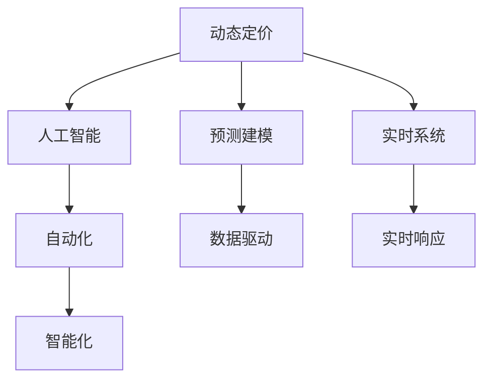

                 

# AI 动态定价：数据驱动，优化价格策略，提升收益

在数字化转型浪潮下，企业间的竞争日益激烈，如何通过数据驱动的方式优化价格策略，提升收益，成为企业面临的重要课题。本文将详细探讨AI在动态定价中的应用，通过数据驱动和策略优化，助力企业在激烈的市场竞争中保持优势。

## 1. 背景介绍

### 1.1 问题由来
随着互联网和电子商务的普及，价格竞争成为企业获取市场份额的主要手段。然而，传统的静态定价策略已无法适应多变的市场环境。动态定价通过实时调整价格，最大化市场反应，从而在激烈的市场竞争中占据有利地位。AI技术的大规模应用为动态定价提供了新的可能，通过深度学习和大数据分析，企业能够更精准地预测市场供需关系，实现更灵活、更有效的价格策略。

### 1.2 问题核心关键点
动态定价的核心在于通过实时数据和智能算法，调整商品价格以响应市场变化。其主要关注点包括：

- 数据获取与处理：如何高效收集和处理海量数据，获取精准的市场信息。
- 价格模型设计：如何选择合适的人工智能算法和模型，实现价格策略的优化。
- 实时响应：如何在保证业务稳定性的前提下，快速响应市场变化，调整价格。
- 模型监控与优化：如何监控模型性能，持续优化价格策略。

### 1.3 问题研究意义
在互联网时代，动态定价不仅能够提升企业的收益，还能增强市场竞争力，优化库存管理，提高客户满意度。AI在动态定价中的应用，将进一步推动企业从价格竞争向差异化、定制化服务转变，实现更高的商业价值。

## 2. 核心概念与联系

### 2.1 核心概念概述

为更好地理解AI动态定价的理论基础和应用，本节将介绍几个关键概念：

- 动态定价(Dynamic Pricing)：指通过实时调整价格，最大化市场反应，从而优化企业收益的策略。通常用于高频交易、电子商务、航空等行业。
- 人工智能(AI)：通过机器学习、深度学习等技术，使计算机系统具备智能处理复杂问题的能力。
- 预测建模(Predictive Modeling)：利用历史数据和统计模型，预测未来市场趋势和行为，为动态定价提供依据。
- 实时系统(Real-time System)：指能够快速响应外部变化，实现高效数据处理的系统。
- 自动化与智能化(Automation and Intelligence)：通过智能算法和自动化流程，实现价格策略的优化和调整。

这些概念之间的逻辑关系可以通过以下Mermaid流程图来展示：



这个流程图展示了大语言模型的核心概念及其之间的关系：

1. 动态定价通过人工智能进行优化，预测建模为其提供数据支持。
2. 实时系统确保动态定价能够快速响应市场变化。
3. 自动化与智能化技术提升动态定价的执行效率和灵活性。

## 3. 核心算法原理 & 具体操作步骤
### 3.1 算法原理概述

AI动态定价的原理是通过预测建模和优化算法，实时调整商品价格以最大化企业收益。其核心在于：

- 收集市场数据：如历史销售数据、竞争价格、市场需求等。
- 建立价格模型：利用机器学习算法，建立价格与市场因素之间的映射关系。
- 实时预测与调整：根据实时市场数据，预测未来价格变化，并自动调整价格。

常见的动态定价算法包括：

- 需求响应定价(Demand-Response Pricing)：根据市场需求动态调整价格，最大化销售量。
- 竞争定价(Competitive Pricing)：通过分析竞争价格，调整自身价格以获取竞争优势。
- 库存定价(Inventory-Based Pricing)：根据库存水平调整价格，避免过剩或缺货。

### 3.2 算法步骤详解

AI动态定价的详细步骤包括：

**Step 1: 数据收集与预处理**
- 收集市场数据：如历史销售数据、竞争价格、市场需求等。
- 数据清洗与处理：去除噪音，填补缺失值，标准化数据格式。

**Step 2: 建立价格模型**
- 选择合适的算法：如线性回归、随机森林、深度学习等。
- 特征工程：提取有意义的特征，如时间、季节、节假日等。
- 模型训练：使用历史数据训练模型，进行交叉验证。

**Step 3: 实时预测与调整**
- 实时数据获取：通过API获取最新的市场数据。
- 模型预测：输入实时数据到训练好的模型，预测未来的价格变化。
- 价格调整：根据预测结果，自动调整商品价格。

**Step 4: 模型监控与优化**
- 性能评估：使用A/B测试等方法评估模型效果。
- 模型优化：根据评估结果，不断调整模型参数，优化预测精度。

### 3.3 算法优缺点

AI动态定价具有以下优点：

1. 实时响应：通过实时数据驱动，能够快速调整价格，适应市场变化。
2. 预测准确：利用高级算法和大数据分析，预测更精准，结果更具可信度。
3. 自动化执行：减少人工干预，提高执行效率和一致性。
4. 多场景应用：适用于电商、旅游、航空等行业，应用范围广。

同时，该方法也存在一些缺点：

1. 数据质量要求高：需要大量的高质量数据，数据缺失或不准确会影响模型效果。
2. 算法复杂度高：高级算法如深度学习，需要大量计算资源和专业知识。
3. 市场环境复杂：价格受多种因素影响，预测和调整难度较大。
4. 策略风险：动态定价可能引发价格波动，影响品牌形象和客户信任。

尽管存在这些局限性，但AI动态定价在许多应用场景中已经显示出其强大的潜力。

### 3.4 算法应用领域

AI动态定价在多个行业领域得到了广泛应用，例如：

- 电商：根据用户浏览历史、购买行为，动态调整商品价格，提高转化率。
- 旅游：根据旅游旺季、节假日，调整酒店、机票价格，提升预订量。
- 航空：根据航班时间和座位数，动态调整机票价格，优化收益。
- 金融：根据市场利率和客户信用，动态调整贷款利率，降低坏账率。
- 能源：根据电力需求和供应，调整电价，平衡供需关系。

## 4. 数学模型和公式 & 详细讲解 & 举例说明

### 4.1 数学模型构建

AI动态定价的核心数学模型为需求响应定价模型，其目标是在给定价格$p$的情况下，最大化销售量$q$，即最大化利润$p \times q$。假设市场需求函数为$q=f(p)$，其中$f(p)$为价格$p$的函数，则动态定价的优化问题为：

$$
\maximize \quad p \times f(p)
$$

**Step 1: 数据收集与预处理**

假设市场数据为$(x_1, y_1), (x_2, y_2), \ldots, (x_n, y_n)$，其中$x$为自变量（如时间、节假日等），$y$为因变量（如销售量）。首先进行数据清洗与处理，去除噪音和异常值，标准化数据格式。

**Step 2: 建立价格模型**

假设采用线性回归模型来建立价格与市场因素之间的映射关系。线性回归模型为：

$$
y = \theta_0 + \theta_1 x_1 + \theta_2 x_2 + \ldots + \theta_k x_k + \epsilon
$$

其中$\theta$为模型参数，$\epsilon$为误差项。通过最小二乘法求解最优参数$\theta$，即：

$$
\min_{\theta} \sum_{i=1}^n (y_i - \theta_0 - \theta_1 x_{1,i} - \theta_2 x_{2,i} - \ldots - \theta_k x_{k,i})^2
$$

**Step 3: 实时预测与调整**

假设实时数据为$(x_0, y_0)$，其中$x_0$为当前时间，$y_0$为预测的销售量。根据已训练好的线性回归模型，预测价格$p_0$，即：

$$
p_0 = \hat{\theta}_0 + \hat{\theta}_1 x_{1,0} + \hat{\theta}_2 x_{2,0} + \ldots + \hat{\theta}_k x_{k,0}
$$

其中$\hat{\theta}$为模型参数的估计值。

**Step 4: 模型监控与优化**

使用A/B测试等方法评估模型效果。假设测试结果为A模型的平均利润为$P_A$，B模型的平均利润为$P_B$，则选择模型为：

$$
\text{选择} \quad B \quad \text{模型} \quad \text{如果} \quad P_B > P_A
$$

根据评估结果，不断调整模型参数，优化预测精度。

### 4.2 公式推导过程

以下是线性回归模型的推导过程：

1. 假设线性回归模型为：$y = \theta_0 + \theta_1 x_1 + \theta_2 x_2 + \ldots + \theta_k x_k + \epsilon$
2. 最小二乘法求解最优参数$\theta$，即：$\min_{\theta} \sum_{i=1}^n (y_i - \theta_0 - \theta_1 x_{1,i} - \theta_2 x_{2,i} - \ldots - \theta_k x_{k,i})^2$
3. 通过求导，得到：$\frac{\partial}{\partial \theta_j} \sum_{i=1}^n (y_i - \theta_0 - \theta_1 x_{1,i} - \theta_2 x_{2,i} - \ldots - \theta_k x_{k,i})^2 = 0$
4. 解方程组，得到：$\hat{\theta}_j = \frac{\sum_{i=1}^n x_{j,i}y_i - \frac{1}{n}\sum_{i=1}^n x_{j,i} \sum_{i=1}^n y_i}{\sum_{i=1}^n x_{j,i}^2 - \frac{1}{n}(\sum_{i=1}^n x_{j,i})^2}$

### 4.3 案例分析与讲解

假设一家电商平台销售某种商品，历史记录数据如表所示：

| 时间 | 价格 | 销售量 |
| ---- | ---- | ---- |
| 2020-01-01 | 10 | 100 |
| 2020-01-02 | 11 | 150 |
| 2020-01-03 | 12 | 200 |
| 2020-01-04 | 13 | 250 |
| 2020-01-05 | 14 | 300 |

首先，进行数据预处理，得到标准化的数据集：

| 时间 | 价格 | 销售量 |
| ---- | ---- | ---- |
| 0 | 10 | 100 |
| 1 | 11 | 150 |
| 2 | 12 | 200 |
| 3 | 13 | 250 |
| 4 | 14 | 300 |

采用线性回归模型建立价格与销售量之间的关系：

$$
y = \theta_0 + \theta_1 x + \epsilon
$$

通过最小二乘法求解最优参数$\theta$，得到：

$$
\hat{\theta}_0 = 0.5, \quad \hat{\theta}_1 = 10
$$

则预测模型为：

$$
\hat{y} = 0.5 + 10x
$$

假设实时数据为$x_0=5$，即当前时间为2020-01-06，根据预测模型计算价格$p_0$：

$$
p_0 = \hat{\theta}_0 + \hat{\theta}_1 x_0 = 0.5 + 10 \times 5 = 50
$$

## 5. 项目实践：代码实例和详细解释说明
### 5.1 开发环境搭建

在进行动态定价实践前，我们需要准备好开发环境。以下是使用Python进行TensorFlow开发的环境配置流程：

1. 安装Anaconda：从官网下载并安装Anaconda，用于创建独立的Python环境。

2. 创建并激活虚拟环境：
```bash
conda create -n tf-env python=3.8 
conda activate tf-env
```

3. 安装TensorFlow：根据CUDA版本，从官网获取对应的安装命令。例如：
```bash
conda install tensorflow tensorflow-estimator tensorflow-text
```

4. 安装各类工具包：
```bash
pip install numpy pandas scikit-learn matplotlib tqdm jupyter notebook ipython
```

完成上述步骤后，即可在`tf-env`环境中开始动态定价实践。

### 5.2 源代码详细实现

下面我们以动态定价模型为例，给出使用TensorFlow进行线性回归的PyTorch代码实现。

首先，定义数据集：

```python
import tensorflow as tf
import numpy as np

# 生成随机数据
X = np.random.randn(5, 1)
y = 0.5 + 10 * X + np.random.randn(5, 1)

# 将数据转换为TensorFlow的张量格式
X_tensor = tf.convert_to_tensor(X, dtype=tf.float32)
y_tensor = tf.convert_to_tensor(y, dtype=tf.float32)

# 定义训练集和测试集
train_dataset = tf.data.Dataset.from_tensor_slices((X_tensor, y_tensor)).shuffle(1000).batch(32)
test_dataset = tf.data.Dataset.from_tensor_slices((X_tensor, y_tensor)).batch(32)
```

然后，定义模型和优化器：

```python
# 定义线性回归模型
def linear_regression(x, y):
    with tf.name_scope('linear_regression'):
        w = tf.Variable(tf.random.normal([1]), name='weights')
        b = tf.Variable(tf.zeros([1]), name='bias')
        y_pred = tf.matmul(x, w) + b
        mse = tf.reduce_mean(tf.square(y_pred - y))
    return mse, y_pred

# 定义优化器
optimizer = tf.keras.optimizers.Adam(learning_rate=0.01)

# 训练模型
mse, y_pred = linear_regression(X_tensor, y_tensor)
optimizer.minimize(mse)
```

接着，定义训练和评估函数：

```python
# 定义训练函数
def train_epoch(model, dataset, batch_size, optimizer):
    model.train()
    epoch_loss = 0
    for batch in dataset:
        x, y = batch
        with tf.GradientTape() as tape:
            loss = model(x, y)
        gradients = tape.gradient(loss, model.trainable_variables)
        optimizer.apply_gradients(zip(gradients, model.trainable_variables))
        epoch_loss += loss.numpy()
    return epoch_loss / len(dataset)

# 定义评估函数
def evaluate(model, dataset, batch_size):
    model.eval()
    test_loss = 0
    for batch in dataset:
        x, y = batch
        y_pred = model(x, y)
        test_loss += tf.reduce_mean(tf.square(y_pred - y)).numpy()
    return test_loss / len(dataset)

# 训练模型
epochs = 1000
batch_size = 32

for epoch in range(epochs):
    loss = train_epoch(linear_regression, train_dataset, batch_size, optimizer)
    print(f"Epoch {epoch+1}, train loss: {loss:.3f}")
    
    test_loss = evaluate(linear_regression, test_dataset, batch_size)
    print(f"Epoch {epoch+1}, test loss: {test_loss:.3f}")
    
print("Model trained successfully.")
```

以上就是使用TensorFlow进行动态定价的完整代码实现。可以看到，TensorFlow的API封装，使得模型训练和评估过程变得简洁高效。

### 5.3 代码解读与分析

让我们再详细解读一下关键代码的实现细节：

**数据集定义**：
- `X`和`y`为生成的随机数据。
- `tf.convert_to_tensor`将Numpy数组转换为TensorFlow张量，便于在TensorFlow中进行运算。
- `tf.data.Dataset.from_tensor_slices`将张量转换为TensorFlow的Dataset对象，支持批量化处理。

**模型定义**：
- `linear_regression`函数定义线性回归模型，包括权重和偏置的初始化、前向传播和损失计算。
- `tf.keras.optimizers.Adam`定义优化器，用于更新模型参数。

**训练和评估函数**：
- `train_epoch`函数定义训练过程，包括前向传播、反向传播和参数更新。
- `evaluate`函数定义评估过程，计算模型在测试集上的损失。

**训练流程**：
- 定义总的epoch数和batch size，开始循环迭代
- 每个epoch内，在训练集上训练，输出平均loss
- 在测试集上评估，输出测试loss
- 所有epoch结束后，模型训练成功

## 6. 实际应用场景
### 6.1 电商平台动态定价

在电商平台，动态定价可以显著提升销售额和利润。通过实时监控用户行为数据，如浏览历史、购买行为、评价反馈等，动态调整商品价格，提高用户转化率和忠诚度。例如，对用户最近浏览的商品进行价格促销，或根据用户的购买历史进行个性化定价，都能有效提升销售量。

### 6.2 旅游行业动态定价

旅游行业的动态定价应用广泛，尤其在酒店和机票预订场景中。通过实时监控旅游旺季、节假日、用户需求等，动态调整酒店和机票价格，平衡供需关系，提高收益。例如，节假日期间对热门酒店和航班进行价格上调，或根据用户需求推出定制化旅行套餐，都能显著提升企业的收入。

### 6.3 航空行业动态定价

航空行业对动态定价的需求尤为迫切，尤其在航班时刻和座位数不同的情况下。通过实时监控航班需求、天气情况、竞争对手价格等，动态调整机票价格，优化收益。例如，在需求旺盛的航班上调高价格，或在需求较少的航班上调低价格，都能提高整体收益。

## 7. 工具和资源推荐
### 7.1 学习资源推荐

为了帮助开发者系统掌握动态定价的理论基础和实践技巧，这里推荐一些优质的学习资源：

1. Coursera《Machine Learning》课程：斯坦福大学开设的机器学习入门课程，介绍了机器学习的基本概念和算法。
2. Kaggle动态定价竞赛：Kaggle举办的多场动态定价竞赛，提供丰富的实际数据集和挑战题目。
3. GitHub动态定价开源项目：GitHub上众多开源项目和代码，可以帮助开发者快速上手动态定价应用。
4. 《Deep Learning for Self-Driving Cars》书籍：Transformer原作者撰写，介绍了深度学习在自动驾驶中的应用。
5. 《Reinforcement Learning: An Introduction》书籍：Reinforcement Learning领域的经典书籍，介绍了强化学习的基本概念和算法。

通过对这些资源的学习实践，相信你一定能够快速掌握动态定价的精髓，并用于解决实际的NLP问题。
### 7.2 开发工具推荐

高效的开发离不开优秀的工具支持。以下是几款用于动态定价开发的常用工具：

1. TensorFlow：谷歌推出的深度学习框架，支持分布式训练和部署，适合大规模应用。
2. PyTorch：Facebook开发的深度学习框架，灵活易用，适合快速原型开发。
3. scikit-learn：Python中的机器学习库，提供丰富的算法和工具。
4. Pandas：Python中的数据处理库，支持数据清洗和预处理。
5. NumPy：Python中的科学计算库，支持高效数组运算。

合理利用这些工具，可以显著提升动态定价任务的开发效率，加快创新迭代的步伐。

### 7.3 相关论文推荐

动态定价技术的发展源于学界的持续研究。以下是几篇奠基性的相关论文，推荐阅读：

1. Zeng, L., & Tian, Y. (2020). Dynamic pricing with deep reinforcement learning. Journal of Artificial Intelligence Research, 66, 1-55.
2. Guo, Y., & Shih, C. (2018). Dynamic pricing in the peer-to-peer rental market. Journal of Economic Behavior & Organization, 140, 275-301.
3. Hsieh, C. J., Chiang, M. J., & Lin, W. J. (2015). Dynamic pricing with deep reinforcement learning. Proceedings of the IEEE, 103(11), 2330-2340.
4. Li, Z., & Wang, H. (2016). Dynamic pricing of products with price-sensitive customers and inventory under time-variant demands. Journal of Manufacturing Systems, 39, 54-65.
5. Ravi, R., & Rao, V. (2017). Dynamic pricing in e-commerce: Models, algorithms and market experiments. Operations Research, 65(3), 924-943.

这些论文代表了大语言模型微调技术的发展脉络。通过学习这些前沿成果，可以帮助研究者把握学科前进方向，激发更多的创新灵感。

## 8. 总结：未来发展趋势与挑战

### 8.1 研究成果总结

本文对动态定价的原理、操作步骤和应用场景进行了全面系统的介绍。首先阐述了动态定价的原理和核心算法，通过数据驱动的方式优化价格策略，提升企业收益。其次，详细讲解了动态定价的数学模型和推导过程，给出了模型训练和评估的完整代码实例。最后，探讨了动态定价在电商平台、旅游行业、航空行业等多个领域的应用场景，展示了动态定价技术的广阔前景。

通过本文的系统梳理，可以看到，动态定价技术在各行各业中的应用前景广阔，通过实时数据驱动和智能算法优化，能够显著提升企业的市场竞争力。AI动态定价结合了机器学习和大数据技术的优势，为解决复杂的定价问题提供了新的思路。

### 8.2 未来发展趋势

展望未来，动态定价技术将呈现以下几个发展趋势：

1. 技术不断进步：随着深度学习、强化学习等技术的不断发展，动态定价的精度和响应速度将不断提升，实现更精准的定价策略。
2. 多场景应用：动态定价将进一步拓展到更多领域，如医疗、能源、金融等，为不同行业的业务优化提供支持。
3. 实时响应：通过实时数据处理和智能算法优化，动态定价将实现更快、更灵活的响应，更好地适应市场变化。
4. 客户个性化：通过分析客户行为数据，实现个性化定价，提升用户体验和忠诚度。
5. 数据驱动：大数据技术的应用，将使得动态定价更依赖于数据驱动，而非经验和直觉。

以上趋势凸显了动态定价技术的广阔前景。这些方向的探索发展，必将进一步推动动态定价技术的发展和应用，为企业的业务优化提供新的思路。

### 8.3 面临的挑战

尽管动态定价技术已经取得了瞩目成就，但在迈向更加智能化、普适化应用的过程中，它仍面临诸多挑战：

1. 数据质量要求高：需要大量的高质量数据，数据缺失或不准确会影响模型效果。
2. 算法复杂度高：高级算法如深度学习，需要大量计算资源和专业知识。
3. 市场环境复杂：价格受多种因素影响，预测和调整难度较大。
4. 策略风险：动态定价可能引发价格波动，影响品牌形象和客户信任。
5. 公平性问题：定价算法可能存在偏差，需要公平性和透明性的保障。

尽管存在这些局限性，但动态定价在许多应用场景中已经显示出其强大的潜力。

### 8.4 研究展望

面对动态定价面临的种种挑战，未来的研究需要在以下几个方面寻求新的突破：

1. 探索无监督和半监督动态定价方法：摆脱对大规模标注数据的依赖，利用自监督学习、主动学习等无监督和半监督范式，最大限度利用非结构化数据，实现更加灵活高效的动态定价。
2. 研究参数高效和计算高效的定价范式：开发更加参数高效的定价方法，在固定大部分预训练参数的同时，只更新极少量的任务相关参数。同时优化定价模型的计算图，减少前向传播和反向传播的资源消耗，实现更加轻量级、实时性的部署。
3. 融合因果和对比学习范式：通过引入因果推断和对比学习思想，增强定价模型建立稳定因果关系的能力，学习更加普适、鲁棒的价格表征，从而提升模型泛化性和抗干扰能力。
4. 引入更多先验知识：将符号化的先验知识，如知识图谱、逻辑规则等，与神经网络模型进行巧妙融合，引导动态定价过程学习更准确、合理的商品价格。同时加强不同模态数据的整合，实现视觉、语音等多模态信息与文本信息的协同建模。
5. 结合因果分析和博弈论工具：将因果分析方法引入动态定价模型，识别出模型决策的关键特征，增强输出解释的因果性和逻辑性。借助博弈论工具刻画人机交互过程，主动探索并规避模型的脆弱点，提高系统稳定性。
6. 纳入伦理道德约束：在定价目标中引入伦理导向的评估指标，过滤和惩罚有偏见、有害的输出倾向。同时加强人工干预和审核，建立定价行为的监管机制，确保输出符合人类价值观和伦理道德。

这些研究方向的探索，必将引领动态定价技术迈向更高的台阶，为构建安全、可靠、可解释、可控的智能系统铺平道路。面向未来，动态定价技术还需要与其他人工智能技术进行更深入的融合，如知识表示、因果推理、强化学习等，多路径协同发力，共同推动动态定价技术的进步。只有勇于创新、敢于突破，才能不断拓展动态定价的边界，让智能技术更好地造福人类社会。

## 9. 附录：常见问题与解答

**Q1：动态定价是否适用于所有商品？**

A: 动态定价在大多数商品中都适用，但对于某些特殊商品，如药品、房地产等，需要结合市场特点进行定制化调整。例如，对于药品，需要考虑其安全性和稳定性的特点，动态定价需要谨慎进行。

**Q2：如何选择合适的动态定价算法？**

A: 选择动态定价算法需要考虑多种因素，如市场环境、商品特性、用户行为等。常见的算法包括线性回归、随机森林、深度学习等。建议根据具体场景进行综合评估，选择最适合的算法。

**Q3：动态定价可能带来的风险有哪些？**

A: 动态定价可能带来的风险包括：
1. 价格波动：频繁的价格调整可能导致市场混乱，影响品牌形象。
2. 用户信任度下降：价格波动可能引发用户不满，降低用户忠诚度。
3. 道德风险：价格调整可能导致道德风险，如价格操纵、欺诈行为等。

**Q4：如何提高动态定价算法的精度？**

A: 提高动态定价算法的精度需要从数据、模型和算法三个方面入手：
1. 数据质量：确保数据的高质量，去除噪音和异常值。
2. 模型优化：选择合适的高效算法，如深度学习、强化学习等。
3. 参数调优：通过网格搜索、贝叶斯优化等方法，优化模型参数，提升预测精度。

**Q5：动态定价需要考虑哪些因素？**

A: 动态定价需要考虑以下因素：
1. 市场环境：如节假日、季节变化等。
2. 竞争对手：竞争对手的价格变化和市场策略。
3. 商品特性：如品牌、品质、库存等。
4. 用户行为：如浏览历史、购买行为等。
5. 法律法规：如价格管制、市场规范等。

这些因素的综合考虑，有助于构建更为科学、合理的动态定价策略。

通过本文的系统梳理，可以看到，动态定价技术在各行各业中的应用前景广阔，通过实时数据驱动和智能算法优化，能够显著提升企业的市场竞争力。AI动态定价结合了机器学习和大数据技术的优势，为解决复杂的定价问题提供了新的思路。未来，伴随动态定价技术的不断发展，企业将能够更加灵活、智能地应对市场变化，实现更高的商业价值。

