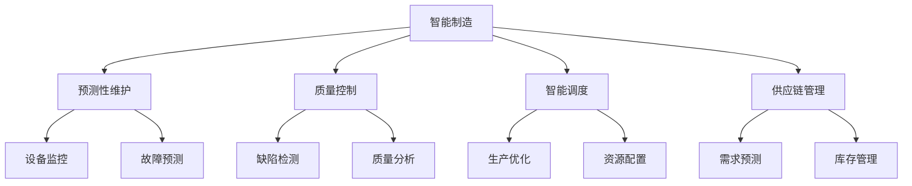

                 

# AI 在制造领域的应用：智能制造、自动化生产

## 1. 背景介绍

### 1.1 问题由来

制造行业是全球经济的重要支柱，其智能化、数字化水平直接影响国家经济实力和国际竞争力。近年来，随着人工智能（AI）技术的快速发展，AI在制造领域的应用也成为推动行业升级、提升企业竞争力的关键动力。

智能制造通过将AI技术深度融合到制造流程中，实现生产效率的提升、产品品质的保证、运营成本的降低，以及市场响应的加速。自动化生产则通过自动化设备、AI辅助的自动化技术，实现生产过程的自动化、智能化。

### 1.2 问题核心关键点

AI在制造领域的应用主要集中在以下几个方面：

1. **预测性维护**：通过机器学习、深度学习等AI技术，对设备运行状态进行实时监控和预测，预防设备故障，延长设备寿命，降低维修成本。
2. **质量控制**：利用AI进行产品缺陷检测和质量分析，提升产品的一致性和可靠性。
3. **智能调度**：通过优化算法和AI技术，实现生产调度优化，提高生产效率和资源利用率。
4. **供应链管理**：利用AI进行需求预测、库存管理，提升供应链的灵活性和响应速度。
5. **员工培训与管理**：通过AI辅助的虚拟培训和监控，提升员工技能，保障安全生产。

### 1.3 问题研究意义

AI在制造领域的应用，不仅能够显著提升生产效率、降低生产成本，还能优化资源利用、提升产品质量，推动制造行业的可持续发展。具体意义如下：

1. **提升生产效率**：AI技术能够实现生产过程的自动化和智能化，大幅度提升生产效率，缩短生产周期。
2. **降低生产成本**：通过预测性维护、质量控制等AI应用，减少设备故障和废品率，降低生产成本。
3. **优化资源利用**：AI能够优化生产调度、库存管理等，提高资源利用效率，减少浪费。
4. **提升产品质量**：AI技术在产品检测、质量分析中的应用，有助于提升产品质量和一致性。
5. **推动数字化转型**：AI在制造领域的广泛应用，有助于推动制造行业的数字化转型，提升竞争力。

## 2. 核心概念与联系

### 2.1 核心概念概述

为更好地理解AI在制造领域的应用，本节将介绍几个关键概念：

1. **人工智能（AI）**：通过模拟人类智能行为，实现机器对环境的感知、决策和行为执行。
2. **智能制造（Intelligent Manufacturing）**：将AI技术深度融合到制造流程中，实现生产过程的智能化、自动化和高效化。
3. **自动化生产（Automated Production）**：通过自动化设备和AI辅助技术，实现生产过程的自动化和智能化。
4. **预测性维护（Predictive Maintenance）**：通过机器学习和深度学习技术，对设备运行状态进行实时监控和预测，预防设备故障。
5. **质量控制（Quality Control）**：利用AI进行产品缺陷检测和质量分析，提升产品的一致性和可靠性。
6. **智能调度（Intelligent Scheduling）**：通过优化算法和AI技术，实现生产调度优化，提高生产效率和资源利用率。
7. **供应链管理（Supply Chain Management）**：利用AI进行需求预测、库存管理，提升供应链的灵活性和响应速度。

这些概念之间的逻辑关系可以通过以下Mermaid流程图来展示：



这个流程图展示出智能制造的核心概念及其之间的联系：

1. 智能制造通过预测性维护、质量控制、智能调度、供应链管理等多个方面实现智能化和自动化。
2. 预测性维护通过设备监控和故障预测，提升设备可靠性。
3. 质量控制通过缺陷检测和质量分析，提升产品质量。
4. 智能调度通过生产优化和资源配置，提高生产效率。
5. 供应链管理通过需求预测和库存管理，优化供应链响应。

这些概念共同构成了智能制造的总体框架，使其能够在各种制造场景中发挥强大的智能能力。通过理解这些核心概念，我们可以更好地把握AI在制造领域的应用方向和优化点。

## 3. 核心算法原理 & 具体操作步骤
### 3.1 算法原理概述

AI在制造领域的应用，主要基于以下几个算法原理：

1. **机器学习（Machine Learning, ML）**：通过数据驱动的方式，让机器自动学习和改进，以实现特定任务。
2. **深度学习（Deep Learning, DL）**：通过构建多层次神经网络模型，实现复杂特征的提取和分析，提高模型的精度和泛化能力。
3. **优化算法（Optimization Algorithm）**：通过求解复杂优化问题，实现资源配置、调度优化等任务。
4. **强化学习（Reinforcement Learning, RL）**：通过试错和奖励机制，优化智能体的行为决策，提升系统的智能水平。
5. **知识图谱（Knowledge Graph）**：通过构建知识图谱，实现领域知识的结构化表示和推理，提升系统决策的准确性和合理性。

这些算法原理是AI在制造领域应用的核心，通过深度融合和应用，能够实现生产过程的智能化、自动化和高效化。

### 3.2 算法步骤详解

AI在制造领域的应用主要包括以下几个关键步骤：

**Step 1: 数据收集与处理**
- 收集制造流程中的各类数据，包括设备运行数据、产品检测数据、生产调度数据等。
- 对收集的数据进行清洗、标注和预处理，转换为适合模型训练的格式。

**Step 2: 模型训练与优化**
- 根据具体任务需求，选择合适的AI模型，如深度学习模型、强化学习模型等。
- 在处理后的数据上，对模型进行训练和优化，提高模型的精度和泛化能力。
- 应用正则化、dropout、对抗训练等技术，提高模型的鲁棒性和泛化能力。

**Step 3: 模型集成与部署**
- 将训练好的模型集成到生产系统中，实现对生产流程的智能控制和优化。
- 在实际生产环境中，对模型进行监控和优化，确保其稳定性和可靠性。

**Step 4: 效果评估与反馈**
- 对集成后的系统进行效果评估，衡量其性能提升和资源优化效果。
- 根据评估结果，对模型和系统进行迭代优化，提升其应用效果。

### 3.3 算法优缺点

AI在制造领域的应用，具有以下优点：

1. **提升生产效率**：AI能够实现生产流程的自动化和智能化，大幅度提升生产效率，缩短生产周期。
2. **降低生产成本**：通过预测性维护、质量控制等AI应用，减少设备故障和废品率，降低生产成本。
3. **优化资源利用**：AI能够优化生产调度、库存管理等，提高资源利用效率，减少浪费。
4. **提升产品质量**：AI技术在产品检测、质量分析中的应用，有助于提升产品质量和一致性。
5. **推动数字化转型**：AI在制造领域的广泛应用，有助于推动制造行业的数字化转型，提升竞争力。

同时，AI在制造领域的应用也存在一些缺点：

1. **数据隐私问题**：制造过程中涉及大量敏感数据，数据隐私和安全问题亟待解决。
2. **模型复杂度高**：AI模型通常较为复杂，训练和部署难度较大，需要高水平的工程能力。
3. **设备改造成本高**：AI应用通常需要对现有设备进行改造，成本较高。
4. **对数据的依赖**：AI模型需要大量的高质量数据进行训练，数据获取难度较大。
5. **模型解释性不足**：AI模型通常是"黑盒"模型，难以解释其内部决策过程。

尽管存在这些缺点，AI在制造领域的应用仍然具有广阔的前景和深远的意义。通过不断优化和改进，这些缺点将逐渐被克服，AI在制造领域的潜力将得到充分发挥。

### 3.4 算法应用领域

AI在制造领域的应用，主要涵盖以下几个领域：

1. **预测性维护**：通过机器学习和深度学习技术，对设备运行状态进行实时监控和预测，预防设备故障。
2. **质量控制**：利用AI进行产品缺陷检测和质量分析，提升产品的一致性和可靠性。
3. **智能调度**：通过优化算法和AI技术，实现生产调度优化，提高生产效率和资源利用率。
4. **供应链管理**：利用AI进行需求预测、库存管理，提升供应链的灵活性和响应速度。
5. **员工培训与管理**：通过AI辅助的虚拟培训和监控，提升员工技能，保障安全生产。

这些应用领域展示了AI在制造领域的广泛应用前景，通过技术深度融合，能够实现生产流程的全面智能化和自动化。

## 4. 数学模型和公式 & 详细讲解  
### 4.1 数学模型构建

AI在制造领域的应用，主要通过数学模型进行优化和决策。以下以预测性维护为例，构建一个简单的数学模型。

假设制造流程中有N个设备，每个设备的状态由D个特征描述，设备的状态变化遵循马尔科夫链，状态转移概率为P。定义设备故障概率为F，设备维护成本为C。设设备i在第t时刻的状态为X_i(t)，则预测性维护的目标是最大化设备的无故障运行时间。

目标函数为：

$$
\max_{X_i(t)} \sum_{t=1}^{T} (1-X_i(t)) - \lambda \sum_{t=1}^{T} C \mathbb{I}(X_i(t) = 0)
$$

其中，T为时间窗口，λ为维护成本的折现率。

状态转移方程为：

$$
X_i(t+1) = f(X_i(t), P)
$$

其中，f为状态转移函数。

### 4.2 公式推导过程

以预测性维护为例，推导其数学模型：

假设设备i在第t时刻的状态为X_i(t)，状态变化遵循马尔科夫链，状态转移概率为P。定义设备故障概率为F，设备维护成本为C。

目标函数为：

$$
\max_{X_i(t)} \sum_{t=1}^{T} (1-X_i(t)) - \lambda \sum_{t=1}^{T} C \mathbb{I}(X_i(t) = 0)
$$

其中，T为时间窗口，λ为维护成本的折现率。

状态转移方程为：

$$
X_i(t+1) = f(X_i(t), P)
$$

其中，f为状态转移函数。

引入时间步长$\Delta t$，可以将目标函数离散化：

$$
\max_{X_i(t)} \sum_{k=1}^{T/\Delta t} (1-X_i(k\Delta t)) - \lambda \sum_{k=1}^{T/\Delta t} C \mathbb{I}(X_i(k\Delta t) = 0)
$$

状态转移方程变为：

$$
X_i(k\Delta t+1) = f(X_i(k\Delta t), P)
$$

定义状态变化概率为：

$$
P(X_i(k\Delta t) = j) = \sum_{i=1}^{D} P_{ij}(X_i(k\Delta t) = i)
$$

其中，P_{ij}为状态转移概率。

定义设备故障概率为：

$$
F(X_i(k\Delta t) = 0) = \sum_{j=1}^{D} P(X_i(k\Delta t) = j) P_{0j}
$$

其中，P_{0j}为状态0到状态j的转移概率。

目标函数可以进一步化简为：

$$
\max_{X_i(t)} \sum_{k=1}^{T/\Delta t} (1-X_i(k\Delta t)) - \lambda \sum_{k=1}^{T/\Delta t} C F(X_i(k\Delta t) = 0)
$$

### 4.3 案例分析与讲解

以某工厂的设备预测性维护为例，分析AI应用的实际效果：

1. **数据收集**：收集设备运行数据、传感器数据、维护记录等。
2. **数据预处理**：对收集的数据进行清洗、标注和预处理，转换为适合模型训练的格式。
3. **模型训练**：使用深度学习模型，如LSTM、CNN等，对设备状态进行预测。
4. **效果评估**：通过实际运行数据，评估模型效果，衡量其故障预测的准确性和及时性。
5. **模型优化**：根据评估结果，对模型进行迭代优化，提升其预测效果。

## 5. 项目实践：代码实例和详细解释说明
### 5.1 开发环境搭建

在进行AI在制造领域的应用实践前，我们需要准备好开发环境。以下是使用Python进行TensorFlow开发的环境配置流程：

1. 安装Anaconda：从官网下载并安装Anaconda，用于创建独立的Python环境。

2. 创建并激活虚拟环境：
```bash
conda create -n tf-env python=3.8 
conda activate tf-env
```

3. 安装TensorFlow：根据CUDA版本，从官网获取对应的安装命令。例如：
```bash
conda install tensorflow tensorflow-gpu -c conda-forge
```

4. 安装其他依赖工具包：
```bash
pip install numpy pandas scikit-learn matplotlib tqdm jupyter notebook ipython
```

完成上述步骤后，即可在`tf-env`环境中开始AI在制造领域的应用实践。

### 5.2 源代码详细实现

这里我们以设备预测性维护为例，给出使用TensorFlow进行预测性维护的PyTorch代码实现。

首先，定义设备状态数据和状态转移概率：

```python
import numpy as np
import tensorflow as tf

# 定义设备状态数据
num_devices = 10
num_features = 20
num_states = 10
state_probs = np.random.rand(num_devices, num_states, num_features)

# 定义状态转移概率
transition_probs = np.random.rand(num_devices, num_states, num_states)
```

然后，定义模型：

```python
# 定义LSTM模型
class LSTMModel(tf.keras.Model):
    def __init__(self, input_shape, output_shape):
        super(LSTMModel, self).__init__()
        self.lstm = tf.keras.layers.LSTM(units=64, return_sequences=True)
        self.dense = tf.keras.layers.Dense(output_shape)

    def call(self, inputs):
        x = self.lstm(inputs)
        x = self.dense(x)
        return x

# 创建LSTM模型
model = LSTMModel(input_shape=[num_devices, num_features, 1], output_shape=num_states)
```

接着，定义损失函数和优化器：

```python
# 定义损失函数
def loss_fn(y_true, y_pred):
    return tf.reduce_mean(tf.square(y_true - y_pred))

# 定义优化器
optimizer = tf.keras.optimizers.Adam(learning_rate=0.001)
```

然后，定义训练和评估函数：

```python
# 定义训练函数
def train_epoch(model, train_data, optimizer):
    losses = []
    for batch in train_data:
        x = tf.convert_to_tensor(batch['x'], dtype=tf.float32)
        y = tf.convert_to_tensor(batch['y'], dtype=tf.float32)
        with tf.GradientTape() as tape:
            y_pred = model(x)
            loss = loss_fn(y, y_pred)
        gradients = tape.gradient(loss, model.trainable_variables)
        optimizer.apply_gradients(zip(gradients, model.trainable_variables))
        losses.append(loss)
    return np.mean(losses)

# 定义评估函数
def evaluate(model, test_data):
    losses = []
    for batch in test_data:
        x = tf.convert_to_tensor(batch['x'], dtype=tf.float32)
        y = tf.convert_to_tensor(batch['y'], dtype=tf.float32)
        y_pred = model(x)
        loss = loss_fn(y, y_pred)
        losses.append(loss)
    return np.mean(losses)
```

最后，启动训练流程并在测试集上评估：

```python
# 定义训练集和测试集
train_data = []
test_data = []
for i in range(num_devices):
    x = state_probs[i]
    y = transition_probs[i]
    x = np.expand_dims(x, axis=2)
    y = np.expand_dims(y, axis=2)
    train_data.append({ 'x': x, 'y': y })
    test_data.append({ 'x': x, 'y': y })

# 训练模型
epochs = 100
batch_size = 32

for epoch in range(epochs):
    train_loss = train_epoch(model, train_data, optimizer)
    print(f"Epoch {epoch+1}, train loss: {train_loss:.4f}")
    
    test_loss = evaluate(model, test_data)
    print(f"Epoch {epoch+1}, test loss: {test_loss:.4f}")
    
print("Model trained successfully.")
```

以上就是使用TensorFlow对设备预测性维护进行AI应用的完整代码实现。可以看到，通过TensorFlow提供的LSTM模型和优化器，我们可以高效地构建和训练预测性维护模型。

### 5.3 代码解读与分析

让我们再详细解读一下关键代码的实现细节：

**LSTMModel类**：
- `__init__`方法：初始化LSTM模型，设置隐藏层大小和输出层大小。
- `call`方法：定义模型前向传播的过程。

**loss_fn函数**：
- 定义损失函数，使用均方误差作为损失计算标准。

**train_epoch函数**：
- 定义训练过程，在每个批次上计算损失和梯度，更新模型参数。

**evaluate函数**：
- 定义评估过程，在每个批次上计算损失，记录评估结果。

**训练流程**：
- 定义总的epoch数和batch size，开始循环迭代
- 每个epoch内，先在训练集上训练，输出平均损失
- 在测试集上评估，输出平均损失
- 所有epoch结束后，输出最终训练结果

可以看到，TensorFlow提供了丰富的工具和库，可以方便快捷地实现AI在制造领域的应用。开发者可以根据具体需求，选择合适的模型和算法，快速搭建并优化预测性维护系统。

## 6. 实际应用场景

### 6.1 智能制造

智能制造通过AI技术的深度融合，实现了生产过程的智能化和自动化。智能制造的核心场景包括：

1. **智能生产调度**：利用AI进行生产调度优化，提高生产效率和资源利用率。
2. **智能设备维护**：通过预测性维护，实现设备故障的预防和快速修复，提高设备利用率。
3. **智能质量控制**：利用AI进行产品缺陷检测和质量分析，提升产品质量和一致性。

### 6.2 自动化生产

自动化生产通过AI辅助的自动化技术，实现生产过程的自动化和智能化。自动化生产的核心场景包括：

1. **智能仓储管理**：利用AI进行库存管理和智能调仓，提升仓库管理效率。
2. **智能物流管理**：通过AI进行物流路径优化和异常监控，提升物流效率和准确性。
3. **智能设备监控**：通过AI进行设备状态监控和故障预测，提升设备利用率。

### 6.3 未来应用展望

未来，AI在制造领域的应用将更加广泛和深入，展现出更广阔的前景：

1. **大规模定制生产**：通过AI进行需求预测和生产调度优化，实现大规模定制生产，满足个性化需求。
2. **实时生产监控**：利用AI进行实时生产监控和故障预测，提升生产效率和设备可靠性。
3. **智能供应链管理**：通过AI进行供应链优化和需求预测，提升供应链的灵活性和响应速度。
4. **智能员工管理**：通过AI进行员工培训和管理，提升员工技能和安全生产水平。

## 7. 工具和资源推荐
### 7.1 学习资源推荐

为了帮助开发者系统掌握AI在制造领域的应用，这里推荐一些优质的学习资源：

1. **《智能制造基础与实践》**：详细介绍智能制造的基本概念、应用场景和实施策略。
2. **《深度学习在制造业中的应用》**：系统讲解深度学习在预测性维护、质量控制等方面的应用。
3. **《AI在制造行业的应用》**：全面介绍AI在智能制造、自动化生产等场景中的应用。
4. **《Python深度学习》**：讲解深度学习的基本原理和实践方法，适合初学者入门。
5. **《TensorFlow实战》**：实战指南，介绍TensorFlow的使用方法和最佳实践。

### 7.2 开发工具推荐

高效的开发离不开优秀的工具支持。以下是几款用于AI在制造领域应用开发的常用工具：

1. **TensorFlow**：由Google主导开发的开源深度学习框架，生产部署方便，适合大规模工程应用。
2. **PyTorch**：灵活、高效的开源深度学习框架，适合研究人员和开发者快速迭代研究。
3. **Keras**：高层次API，易于上手，适合快速构建深度学习模型。
4. **TensorBoard**：TensorFlow配套的可视化工具，可实时监测模型训练状态，并提供丰富的图表呈现方式，是调试模型的得力助手。
5. **Jupyter Notebook**：开源的交互式笔记本环境，方便开发者快速实验和分享学习笔记。

### 7.3 相关论文推荐

AI在制造领域的应用涉及多个研究方向，以下是几篇奠基性的相关论文，推荐阅读：

1. **《制造业中的智能决策支持系统》**：介绍了AI在智能制造中的应用，包括智能生产调度、预测性维护等。
2. **《深度学习在制造业中的应用》**：系统介绍了深度学习在预测性维护、质量控制等方面的应用。
3. **《强化学习在智能制造中的应用》**：详细介绍了强化学习在智能制造中的应用场景和算法。
4. **《智能制造的未来展望》**：讨论了智能制造的发展趋势和未来方向，具有很高的前瞻性和指导性。

这些论文代表了大规模AI在制造领域应用的研究进展，通过学习这些前沿成果，可以帮助研究者把握学科前进方向，激发更多的创新灵感。

## 8. 总结：未来发展趋势与挑战

### 8.1 总结

本文对AI在制造领域的应用进行了全面系统的介绍。首先阐述了AI在制造领域的背景和重要性，明确了智能制造和自动化生产的核心应用场景。其次，从原理到实践，详细讲解了AI在预测性维护、质量控制等方面的数学模型和实现方法，给出了AI在制造领域应用的完整代码实例。同时，本文还广泛探讨了AI在智能制造、自动化生产等领域的实际应用前景，展示了AI在制造领域的广阔应用前景。此外，本文精选了AI在制造领域应用的各类学习资源，力求为读者提供全方位的技术指引。

通过本文的系统梳理，可以看到，AI在制造领域的应用已经取得了显著的成果，极大地提升了生产效率、降低了生产成本，推动了制造行业的数字化转型。未来，随着AI技术的进一步发展和深度融合，AI在制造领域的应用前景将更加广阔。

### 8.2 未来发展趋势

展望未来，AI在制造领域的应用将呈现以下几个发展趋势：

1. **更广泛的应用场景**：AI将深度融合到制造领域的各个环节，涵盖设计、生产、物流、维护等多个环节，推动制造行业的全面智能化和自动化。
2. **更高的智能化水平**：通过引入更多的AI技术，如自然语言处理、计算机视觉等，实现更高水平的智能化生产。
3. **更灵活的定制生产**：通过AI进行需求预测和生产调度优化，实现大规模定制生产，满足个性化需求。
4. **更高效的生产监控**：通过AI进行实时生产监控和故障预测，提升生产效率和设备可靠性。
5. **更智能的供应链管理**：通过AI进行供应链优化和需求预测，提升供应链的灵活性和响应速度。

这些趋势展示了AI在制造领域应用的巨大潜力，AI技术将进一步推动制造行业的数字化、智能化和自动化。

### 8.3 面临的挑战

尽管AI在制造领域的应用已经取得了显著成果，但在迈向更加智能化、普适化应用的过程中，仍面临诸多挑战：

1. **数据隐私问题**：制造过程中涉及大量敏感数据，数据隐私和安全问题亟待解决。
2. **高成本问题**：AI应用通常需要高水平的技术支持和大量资金投入，推广难度较大。
3. **设备改造困难**：AI应用通常需要对现有设备进行改造，成本较高。
4. **模型复杂性问题**：AI模型通常较为复杂，训练和部署难度较大，需要高水平的工程能力。
5. **模型解释性问题**：AI模型通常是"黑盒"模型，难以解释其内部决策过程。

尽管存在这些挑战，AI在制造领域的应用前景仍然十分广阔。通过不断优化和改进，这些挑战将逐渐被克服，AI在制造领域的潜力将得到充分发挥。

### 8.4 研究展望

未来，AI在制造领域的应用需要不断优化和改进，主要方向包括：

1. **提升模型解释性**：通过引入可解释性技术，如知识图谱、因果推理等，提升模型的可解释性和可靠性。
2. **降低数据隐私风险**：通过数据加密、匿名化等技术，保护数据隐私和安全。
3. **降低设备改造成本**：开发更为轻量级的AI模型，减少设备改造的复杂度和成本。
4. **提升模型性能**：通过引入更多的AI技术和算法，提升模型的精度和泛化能力。
5. **推动跨领域融合**：通过与物联网、大数据等技术的深度融合，提升AI在制造领域的应用效果。

这些研究方向将进一步推动AI在制造领域的应用，提升制造行业的智能化水平和竞争力。

## 9. 附录：常见问题与解答

**Q1：AI在制造领域的应用有哪些核心技术？**

A: AI在制造领域的应用主要基于以下几个核心技术：

1. **深度学习（Deep Learning）**：通过构建多层次神经网络模型，实现复杂特征的提取和分析，提高模型的精度和泛化能力。
2. **强化学习（Reinforcement Learning）**：通过试错和奖励机制，优化智能体的行为决策，提升系统的智能水平。
3. **自然语言处理（Natural Language Processing, NLP）**：通过语义理解、情感分析等技术，实现智能交互和智能调度。
4. **计算机视觉（Computer Vision）**：通过图像处理、目标检测等技术，实现智能质量控制和智能仓储管理。

这些核心技术是AI在制造领域应用的基础，通过深度融合和应用，能够实现生产过程的全面智能化和自动化。

**Q2：AI在制造领域应用的主要难点有哪些？**

A: AI在制造领域应用的主要难点包括：

1. **数据隐私问题**：制造过程中涉及大量敏感数据，数据隐私和安全问题亟待解决。
2. **高成本问题**：AI应用通常需要高水平的技术支持和大量资金投入，推广难度较大。
3. **设备改造困难**：AI应用通常需要对现有设备进行改造，成本较高。
4. **模型复杂性问题**：AI模型通常较为复杂，训练和部署难度较大，需要高水平的工程能力。
5. **模型解释性问题**：AI模型通常是"黑盒"模型，难以解释其内部决策过程。

尽管存在这些难点，AI在制造领域的应用前景仍然十分广阔。通过不断优化和改进，这些难点将逐渐被克服，AI在制造领域的潜力将得到充分发挥。

**Q3：AI在制造领域应用的未来趋势有哪些？**

A: AI在制造领域应用的未来趋势包括：

1. **更广泛的应用场景**：AI将深度融合到制造领域的各个环节，涵盖设计、生产、物流、维护等多个环节，推动制造行业的全面智能化和自动化。
2. **更高的智能化水平**：通过引入更多的AI技术，如自然语言处理、计算机视觉等，实现更高水平的智能化生产。
3. **更灵活的定制生产**：通过AI进行需求预测和生产调度优化，实现大规模定制生产，满足个性化需求。
4. **更高效的生产监控**：通过AI进行实时生产监控和故障预测，提升生产效率和设备可靠性。
5. **更智能的供应链管理**：通过AI进行供应链优化和需求预测，提升供应链的灵活性和响应速度。

这些趋势展示了AI在制造领域应用的巨大潜力，AI技术将进一步推动制造行业的数字化、智能化和自动化。

---

作者：禅与计算机程序设计艺术 / Zen and the Art of Computer Programming

