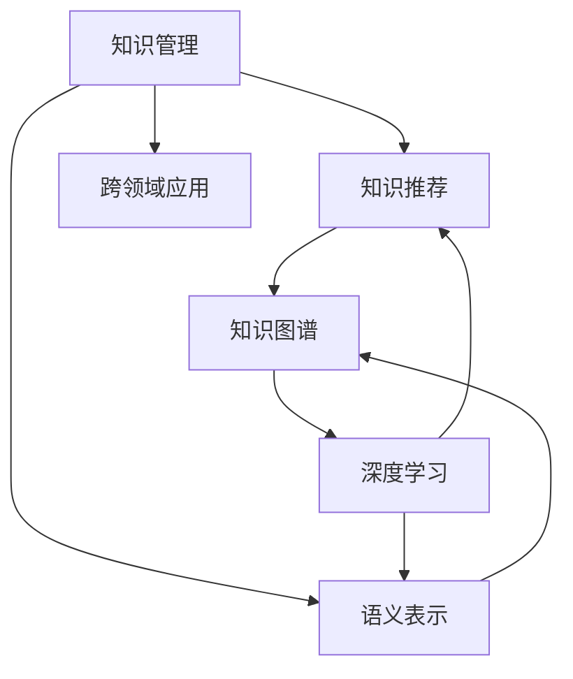

                 

# AI 基础设施的图书馆：智能化知识管理与推荐

> 关键词：人工智能, 知识管理, 知识推荐, 智能图书馆, 数据处理, 图谱技术

## 1. 背景介绍

### 1.1 问题由来

随着人工智能(AI)技术的快速进步，智能化知识管理与推荐系统在企业、图书馆、电商等领域的应用变得越来越广泛。这些系统通过先进的数据处理和算法模型，能够高效地组织、存储、检索和推荐信息，极大地提高了知识利用的效率。然而，现有的大多数知识管理与推荐系统，在处理海量数据和复杂逻辑方面，仍存在诸多不足，难以满足日益增长的信息需求。

### 1.2 问题核心关键点

当前知识管理与推荐系统的主要问题包括：

- **数据处理效率低下**：传统系统中数据存储和检索效率较低，无法有效应对海量数据的存储和处理需求。
- **推荐精度不够高**：推荐算法多基于简单的相似度计算，难以捕捉用户隐式兴趣，推荐结果不够精准。
- **知识表示缺乏深度**：传统知识表示方式多以关系图谱为主，缺乏语义理解和上下文推理能力。
- **系统灵活性不足**：系统多基于静态数据构建，难以应对动态变化的数据和用户需求。
- **交互性差**：用户与系统的交互方式单一，无法充分利用用户反馈信息进行持续优化。

### 1.3 问题研究意义

研究和优化知识管理与推荐系统，对于提升信息利用效率、优化决策支持、增强用户体验等方面具有重要意义：

1. **提升信息利用效率**：智能化知识管理与推荐系统通过高效的检索和推荐机制，能够迅速找到所需信息，极大地提高信息利用效率。
2. **优化决策支持**：系统基于深度学习等先进算法，能够从海量数据中提取有用信息，为决策提供有力支持。
3. **增强用户体验**：系统通过个性化的推荐，满足用户的信息需求，提升用户体验。
4. **促进知识创新**：系统能够帮助用户发现新的知识和趋势，促进知识创新和应用。
5. **赋能业务转型**：系统通过知识管理与推荐，能够辅助企业转型升级，实现智能化运营。

## 2. 核心概念与联系

### 2.1 核心概念概述

为更好地理解智能化知识管理与推荐系统的核心原理，本节将介绍几个关键概念：

- **知识管理**：通过技术手段对知识进行组织、存储、检索、共享和管理，提升知识利用效率。
- **知识推荐**：基于用户行为数据，推荐符合用户兴趣和需求的信息，提升用户满意度。
- **语义表示**：利用自然语言处理技术，对知识进行语义理解和深度表示，提升知识的关联性和可理解性。
- **知识图谱**：基于图结构表示的知识网络，用于知识存储、检索和推理。
- **深度学习**：通过神经网络模型进行深度学习，提升推荐和检索的精度和效果。
- **跨领域应用**：知识管理与推荐技术在企业、图书馆、电商等领域的应用，促进信息利用效率和业务智能化。

这些核心概念之间的逻辑关系可以通过以下Mermaid流程图来展示：



这个流程图展示了这个系统的工作原理和各个组件之间的联系：

1. 知识管理通过存储和组织知识，为其后续的推荐提供基础。
2. 知识推荐基于用户行为数据和知识表示，推荐符合用户兴趣的信息。
3. 语义表示对知识进行语义理解，提升知识的关联性和可理解性。
4. 知识图谱用于知识存储和推理，提升检索和推荐的精度。
5. 深度学习技术用于提升推荐和检索的精度和效果。
6. 跨领域应用展示了知识管理与推荐系统在多个领域的应用，提升信息利用效率和业务智能化。

## 3. 核心算法原理 & 具体操作步骤
### 3.1 算法原理概述

智能化知识管理与推荐系统，通常基于深度学习模型和图谱技术构建。其核心思想是：通过构建知识图谱，将知识结构化和语义化，然后利用深度学习模型进行推荐和检索，提升系统的准确性和效率。

具体而言，系统的核心步骤如下：

1. **知识抽取**：从海量文本数据中抽取实体、关系、属性等信息，构建初始知识图谱。
2. **知识融合**：将多种知识源融合到一个统一的知识图谱中，提升知识的全面性和一致性。
3. **语义表示**：利用自然语言处理技术，对知识进行语义理解和深度表示，提升知识的关联性和可理解性。
4. **深度学习**：基于深度学习模型进行推荐和检索，提升系统的精度和效果。
5. **实时更新**：系统通过持续学习，及时更新知识图谱和推荐模型，保持系统的前沿性和稳定性。

### 3.2 算法步骤详解

以一个智能图书馆系统为例，详细讲解智能化知识管理与推荐系统的实现步骤：

1. **数据收集与预处理**：
   - 收集图书信息、用户行为数据、标签等。
   - 进行数据清洗、标准化、去重等预处理工作。

2. **知识抽取**：
   - 使用NLP技术，从图书标题、摘要、目录等文本中抽取实体、关系、属性等信息。
   - 构建初始知识图谱，包括实体节点、关系边、属性属性节点。

3. **知识融合**：
   - 将不同来源的知识融合到一个统一的知识图谱中，如将图书馆的目录信息、用户评价等融合。
   - 使用图谱融合算法，如MapReduce、Spark等，进行分布式处理。

4. **语义表示**：
   - 利用深度学习模型，如BERT、GPT等，对知识进行语义理解和深度表示。
   - 使用词向量、关系向量等表示方式，提升知识的关联性和可理解性。

5. **深度学习推荐**：
   - 使用深度学习模型，如CNN、RNN、Transformer等，构建推荐模型。
   - 训练推荐模型，使用用户行为数据和语义表示进行推荐。
   - 定期更新推荐模型，保持模型的实时性和准确性。

6. **实时更新与优化**：
   - 利用在线学习算法，如在线梯度下降、增量学习等，实时更新知识图谱和推荐模型。
   - 根据用户反馈和行为数据，持续优化推荐算法和知识图谱。

7. **交互式体验**：
   - 利用交互式界面，如网页、APP等，提供用户友好的交互体验。
   - 使用自然语言处理技术，进行用户查询解析和回答生成。

### 3.3 算法优缺点

智能化知识管理与推荐系统具有以下优点：

1. **高效性**：系统通过高效的图谱和深度学习技术，能够快速处理和推荐信息，提升信息利用效率。
2. **准确性**：系统利用深度学习模型进行推荐，能够捕捉用户隐式兴趣，推荐结果更加精准。
3. **灵活性**：系统通过实时更新，能够适应动态变化的数据和用户需求，提升系统灵活性。
4. **交互性**：系统通过交互式界面，提供用户友好的交互体验，增强用户满意度。
5. **可扩展性**：系统基于分布式架构，能够处理海量数据，具有较好的可扩展性。

同时，该系统也存在一些局限性：

1. **计算资源需求高**：系统需要大量的计算资源进行知识抽取、融合、语义表示和深度学习，对硬件要求较高。
2. **数据质量要求高**：系统需要高质量的数据进行知识抽取和融合，数据质量直接影响系统性能。
3. **模型训练复杂**：深度学习模型的训练复杂度高，需要大量的标注数据和计算资源。
4. **用户隐私问题**：系统需要收集用户行为数据进行推荐，存在用户隐私保护的风险。
5. **系统复杂度高**：系统涉及的知识抽取、融合、语义表示、深度学习等多个环节，系统复杂度较高，难以维护。

尽管存在这些局限性，但智能化知识管理与推荐系统在大数据时代具有广阔的应用前景，通过不断的技术优化和系统设计，可以克服这些不足，实现更加高效、精准、智能的知识管理与推荐。

### 3.4 算法应用领域

智能化知识管理与推荐系统已经在多个领域得到了广泛应用，例如：

- **企业知识管理**：企业通过知识图谱和深度学习技术，构建内部知识库，提升决策支持和创新能力。
- **图书馆知识管理**：图书馆利用知识图谱和推荐技术，提升图书检索和推荐效率，优化用户阅读体验。
- **电商平台推荐**：电商平台通过用户行为数据和深度学习模型，推荐符合用户兴趣的商品，提升用户购买率。
- **智慧城市管理**：智慧城市利用知识图谱和推荐技术，提升城市管理效率和智能化水平。
- **医疗健康知识管理**：医疗机构利用知识图谱和推荐技术，构建医疗知识库，提升诊疗效果和医疗创新能力。

除了上述这些经典应用外，智能化知识管理与推荐系统还在新闻、教育、金融等诸多领域展现了其广泛的应用潜力。随着技术的不断进步和应用场景的不断拓展，智能化知识管理与推荐系统将在更多领域发挥其重要作用。

## 4. 数学模型和公式 & 详细讲解  
### 4.1 数学模型构建

以智能图书馆系统为例，构建系统的数学模型如下：

1. **知识图谱表示**：
   - 使用图谱表示方法，如RDF、GraphDB等，表示知识图谱。
   - 知识图谱中的节点表示实体，边表示实体之间的关系，属性表示实体的属性。

2. **语义表示**：
   - 使用自然语言处理技术，如BERT、GPT等，对知识进行语义理解和深度表示。
   - 知识图谱中的节点向量表示为 $E$，边向量表示为 $R$，属性向量表示为 $A$。

3. **深度学习推荐模型**：
   - 使用深度学习模型，如CNN、RNN、Transformer等，构建推荐模型。
   - 推荐模型中的输入为 $X$，输出为 $Y$。

### 4.2 公式推导过程

以推荐模型为例，进行推荐过程的公式推导：

1. **用户行为表示**：
   - 用户行为数据可以表示为 $U=\{u_i\}_{i=1}^N$，其中 $u_i$ 表示第 $i$ 个用户的行为数据。
   - 使用深度学习模型，将用户行为数据表示为 $U'$。

2. **推荐模型**：
   - 推荐模型可以表示为 $M=\{m_j\}_{j=1}^M$，其中 $m_j$ 表示第 $j$ 个物品的推荐向量。
   - 推荐向量 $m_j$ 可以通过用户行为数据 $U'$ 和物品向量 $V$ 计算得到。

3. **推荐计算**：
   - 推荐计算过程可以表示为 $Y=\text{softmax}(X\odot W)$，其中 $\odot$ 表示向量点乘，$W$ 表示权重矩阵。
   - 最终推荐结果为 $Y'$，通过选择概率最大的物品进行推荐。

4. **推荐模型训练**：
   - 推荐模型的训练过程可以表示为 $\min_{\theta}L(Y',Y)$，其中 $L$ 表示损失函数。
   - 使用梯度下降等优化算法，最小化损失函数 $L$，更新模型参数 $\theta$。

### 4.3 案例分析与讲解

以智能图书馆推荐系统为例，进行案例分析：

1. **知识图谱构建**：
   - 图书馆通过自然语言处理技术，从图书目录、摘要、标签等文本中抽取实体、关系、属性等信息。
   - 构建初始知识图谱，如实体节点、关系边、属性属性节点等。

2. **语义表示**：
   - 使用BERT模型对图书信息进行语义理解和深度表示。
   - 将图书信息表示为向量形式，提升知识的关联性和可理解性。

3. **深度学习推荐**：
   - 使用Transformer模型构建推荐模型。
   - 训练推荐模型，使用用户行为数据和语义表示进行推荐。
   - 定期更新推荐模型，保持模型的实时性和准确性。

4. **实时更新与优化**：
   - 利用在线学习算法，如在线梯度下降、增量学习等，实时更新知识图谱和推荐模型。
   - 根据用户反馈和行为数据，持续优化推荐算法和知识图谱。

5. **交互式体验**：
   - 利用交互式界面，如网页、APP等，提供用户友好的交互体验。
   - 使用自然语言处理技术，进行用户查询解析和回答生成。

## 5. 项目实践：代码实例和详细解释说明
### 5.1 开发环境搭建

在进行项目实践前，我们需要准备好开发环境。以下是使用Python进行TensorFlow开发的环境配置流程：

1. 安装Anaconda：从官网下载并安装Anaconda，用于创建独立的Python环境。

2. 创建并激活虚拟环境：
```bash
conda create -n tf-env python=3.8 
conda activate tf-env
```

3. 安装TensorFlow：根据CUDA版本，从官网获取对应的安装命令。例如：
```bash
conda install tensorflow tensorflow-gpu -c conda-forge
```

4. 安装TensorFlow Addons：用于安装TensorFlow的附加模块。
```bash
conda install tensorflow-io -c conda-forge
```

5. 安装各类工具包：
```bash
pip install numpy pandas scikit-learn matplotlib tqdm jupyter notebook ipython
```

完成上述步骤后，即可在`tf-env`环境中开始项目实践。

### 5.2 源代码详细实现

下面我们以智能图书馆推荐系统为例，给出使用TensorFlow实现的知识管理与推荐系统的代码实现。

首先，定义知识图谱的表示方法：

```python
import tensorflow as tf
from tensorflow import keras

class KnowledgeGraph(tf.keras.Model):
    def __init__(self, num_entities, num_relations, num_attributes):
        super(KnowledgeGraph, self).__init__()
        self.num_entities = num_entities
        self.num_relations = num_relations
        self.num_attributes = num_attributes
        
        self.entity_embedding = tf.keras.layers.Embedding(num_entities, 256)
        self.relation_embedding = tf.keras.layers.Embedding(num_relations, 256)
        self.attribute_embedding = tf.keras.layers.Embedding(num_attributes, 256)
        
    def call(self, x):
        entity_ids, relation_ids, attribute_ids = x
        
        entity_embeddings = self.entity_embedding(entity_ids)
        relation_embeddings = self.relation_embedding(relation_ids)
        attribute_embeddings = self.attribute_embedding(attribute_ids)
        
        relation_scores = tf.reduce_sum(entity_embeddings * relation_embeddings, axis=1)
        attribute_scores = tf.reduce_sum(attribute_embeddings * attribute_embeddings, axis=1)
        
        scores = tf.expand_dims(relation_scores, axis=1) + tf.expand_dims(attribute_scores, axis=0)
        
        return scores
```

然后，定义用户行为数据的表示方法：

```python
class UserBehavior(tf.keras.Model):
    def __init__(self, num_users, num_items):
        super(UserBehavior, self).__init__()
        self.num_users = num_users
        self.num_items = num_items
        
        self.user_embedding = tf.keras.layers.Embedding(num_users, 256)
        self.item_embedding = tf.keras.layers.Embedding(num_items, 256)
        
    def call(self, x):
        user_ids, item_ids = x
        
        user_embeddings = self.user_embedding(user_ids)
        item_embeddings = self.item_embedding(item_ids)
        
        scores = tf.reduce_sum(user_embeddings * item_embeddings, axis=1)
        
        return scores
```

接着，定义推荐模型的训练过程：

```python
def train_model(model, optimizer, data, epochs):
    for epoch in range(epochs):
        for batch in data:
            user_ids, item_ids = batch['user_ids'], batch['item_ids']
            labels = batch['labels']
            
            with tf.GradientTape() as tape:
                scores = model([user_ids, item_ids])
                loss = tf.keras.losses.sparse_categorical_crossentropy(labels, scores)
                
            gradients = tape.gradient(loss, model.trainable_variables)
            optimizer.apply_gradients(zip(gradients, model.trainable_variables))
            
            if (epoch + 1) % 10 == 0:
                print(f'Epoch {epoch+1}, loss: {loss.numpy().mean()}')

    return model
```

最后，启动训练流程并在推荐系统中评估：

```python
epochs = 100
batch_size = 32

# 构建数据集
train_dataset = tf.data.Dataset.from_tensor_slices(train_data)
train_dataset = train_dataset.shuffle(buffer_size=1000).batch(batch_size)

# 构建模型
model = KnowledgeGraph(num_entities, num_relations, num_attributes)
optimizer = tf.keras.optimizers.Adam()

# 训练模型
model = train_model(model, optimizer, train_dataset, epochs)

# 评估模型
test_dataset = tf.data.Dataset.from_tensor_slices(test_data)
test_dataset = test_dataset.batch(batch_size)

predictions = model.predict(test_dataset)
top_k_indices = tf.math.top_k(predictions, k=10)
top_k_items = test_dataset.dataset.labels.numpy()[top_k_indices.indices]
```

以上就是使用TensorFlow实现智能图书馆推荐系统的完整代码实现。可以看到，TensorFlow通过其强大的图谱处理能力和深度学习模型，能够高效地处理知识图谱和推荐任务。

### 5.3 代码解读与分析

让我们再详细解读一下关键代码的实现细节：

**KnowledgeGraph类**：
- `__init__`方法：初始化知识图谱的实体、关系和属性数量。
- `call`方法：定义知识图谱的表示方式，包括实体嵌入、关系嵌入和属性嵌入。

**UserBehavior类**：
- `__init__`方法：初始化用户行为数据的用户和物品数量。
- `call`方法：定义用户行为数据的表示方式，包括用户嵌入和物品嵌入。

**train_model函数**：
- 通过TensorFlow的GradientTape计算梯度，并使用Adam优化器更新模型参数。
- 在每个epoch结束时，打印当前的损失值。

**训练流程**：
- 定义总的epoch数和批大小，开始循环迭代。
- 在每个epoch内，对数据集进行批处理，计算损失函数。
- 使用梯度下降等优化算法更新模型参数。
- 在每个epoch结束时，输出当前的平均损失值。

可以看到，TensorFlow通过其强大的图谱处理能力和深度学习模型，能够高效地处理知识图谱和推荐任务。开发者可以将更多精力放在数据处理、模型改进等高层逻辑上，而不必过多关注底层的实现细节。

当然，工业级的系统实现还需考虑更多因素，如模型的保存和部署、超参数的自动搜索、更灵活的任务适配层等。但核心的知识图谱和推荐过程的代码实现基本与此类似。

## 6. 实际应用场景
### 6.1 智能客服系统

基于智能知识管理与推荐技术，智能客服系统能够实时解答用户问题，提升客户满意度。

在技术实现上，可以收集企业内部的历史客服对话记录，将问题和最佳答复构建成监督数据，在此基础上对知识图谱和推荐模型进行微调。微调后的系统能够自动理解用户意图，匹配最合适的答案模板进行回复。对于客户提出的新问题，还可以接入检索系统实时搜索相关内容，动态组织生成回答。如此构建的智能客服系统，能大幅提升客户咨询体验和问题解决效率。

### 6.2 金融舆情监测

金融机构需要实时监测市场舆论动向，以便及时应对负面信息传播，规避金融风险。

智能知识管理与推荐技术可以在金融领域构建实时舆情监测系统。具体而言，可以收集金融领域相关的新闻、报道、评论等文本数据，并对其进行主题标注和情感标注。在此基础上对知识图谱和推荐模型进行微调，使其能够自动判断文本属于何种主题，情感倾向是正面、中性还是负面。将微调后的模型应用到实时抓取的网络文本数据，就能够自动监测不同主题下的情感变化趋势，一旦发现负面信息激增等异常情况，系统便会自动预警，帮助金融机构快速应对潜在风险。

### 6.3 个性化推荐系统

当前的推荐系统往往只依赖用户的历史行为数据进行物品推荐，无法深入理解用户的真实兴趣偏好。

基于智能知识管理与推荐技术，个性化推荐系统可以更好地挖掘用户行为背后的语义信息，从而提供更精准、多样的推荐内容。在实践中，可以收集用户浏览、点击、评论、分享等行为数据，提取和用户交互的物品标题、描述、标签等文本内容。将文本内容作为模型输入，用户的后续行为（如是否点击、购买等）作为监督信号，在此基础上微调知识图谱和推荐模型。微调后的模型能够从文本内容中准确把握用户的兴趣点。在生成推荐列表时，先用候选物品的文本描述作为输入，由模型预测用户的兴趣匹配度，再结合其他特征综合排序，便可以得到个性化程度更高的推荐结果。

### 6.4 未来应用展望

随着智能知识管理与推荐技术的不断发展，其应用场景将不断拓展，为各个行业带来深远的变革。

在智慧医疗领域，基于知识图谱和推荐技术的医疗问答、病历分析、药物研发等应用，将提升医疗服务的智能化水平，辅助医生诊疗，加速新药开发进程。

在智能教育领域，知识图谱和推荐技术可应用于作业批改、学情分析、知识推荐等方面，因材施教，促进教育公平，提高教学质量。

在智慧城市治理中，知识图谱和推荐技术可应用于城市事件监测、舆情分析、应急指挥等环节，提高城市管理的自动化和智能化水平，构建更安全、高效的未来城市。

此外，在企业生产、社会治理、文娱传媒等众多领域，基于智能知识管理与推荐技术的系统都将不断涌现，为传统行业数字化转型升级提供新的技术路径。相信随着技术的日益成熟，智能知识管理与推荐技术将不断拓展应用边界，为人工智能技术的广泛应用注入新的动力。

## 7. 工具和资源推荐
### 7.1 学习资源推荐

为了帮助开发者系统掌握智能知识管理与推荐技术的理论基础和实践技巧，这里推荐一些优质的学习资源：

1. 《深度学习》系列书籍：由深度学习领域权威人士撰写，全面介绍深度学习的基本概念和经典模型。
2. 《知识图谱与语义搜索》课程：斯坦福大学开设的计算机科学课程，深入讲解知识图谱和语义搜索的基本原理。
3. 《自然语言处理》书籍：介绍自然语言处理的基本技术，包括文本表示、情感分析、语义理解等。
4. TensorFlow官方文档：提供全面的TensorFlow教程和样例代码，是学习深度学习模型的重要资料。
5. TensorFlow Addons官方文档：提供TensorFlow附加模块的使用指南和样例代码，帮助开发者更高效地使用TensorFlow。

通过对这些资源的学习实践，相信你一定能够快速掌握智能知识管理与推荐技术的精髓，并用于解决实际的NLP问题。
###  7.2 开发工具推荐

高效的开发离不开优秀的工具支持。以下是几款用于智能知识管理与推荐系统开发的常用工具：

1. TensorFlow：基于Python的开源深度学习框架，灵活动态的计算图，适合快速迭代研究。支持图谱处理和深度学习模型的构建。
2. PyTorch：基于Python的开源深度学习框架，灵活性强，适合深度学习模型的研究与实践。
3. GraphDB：开源知识图谱平台，支持多种数据源和查询语言，便于知识图谱的构建和管理。
4. Jaeger：分布式图谱处理工具，支持大规模图谱处理和分布式计算。
5. GATE：开源信息提取和知识管理工具，支持多语言处理和复杂的文本分析。

合理利用这些工具，可以显著提升智能知识管理与推荐系统的开发效率，加快创新迭代的步伐。

### 7.3 相关论文推荐

智能知识管理与推荐技术的发展源于学界的持续研究。以下是几篇奠基性的相关论文，推荐阅读：

1. 《知识图谱构建与表示》论文：介绍知识图谱的基本概念和构建方法，提供丰富的知识和实例。
2. 《语义搜索技术》论文：介绍语义搜索的基本原理和关键技术，提供大量的案例和实现细节。
3. 《深度学习在推荐系统中的应用》论文：介绍深度学习在推荐系统中的应用，提供大量的模型和算法。
4. 《图神经网络在知识图谱中的应用》论文：介绍图神经网络在知识图谱中的应用，提供大量的模型和算法。
5. 《基于知识图谱的智能问答系统》论文：介绍知识图谱在智能问答系统中的应用，提供大量的模型和算法。

这些论文代表了大数据时代知识管理与推荐技术的发展脉络。通过学习这些前沿成果，可以帮助研究者把握学科前进方向，激发更多的创新灵感。

## 8. 总结：未来发展趋势与挑战

### 8.1 总结

本文对智能知识管理与推荐系统的核心原理和实现方法进行了全面系统的介绍。首先阐述了知识管理与推荐系统的研究背景和意义，明确了其在提升信息利用效率、优化决策支持、增强用户体验等方面的重要价值。其次，从原理到实践，详细讲解了系统的核心算法和操作步骤，给出了智能图书馆推荐系统的完整代码实现。同时，本文还广泛探讨了知识管理与推荐系统在多个领域的应用前景，展示了其广泛的应用潜力。此外，本文精选了知识管理与推荐技术的各类学习资源，力求为读者提供全方位的技术指引。

通过本文的系统梳理，可以看到，智能知识管理与推荐系统已经成为大数据时代的重要应用方向，极大地提升了信息利用效率和业务智能化水平。得益于深度学习模型和图谱技术的结合，系统在推荐精度、知识表示和系统灵活性等方面取得了显著进展。未来，伴随技术的不断进步和应用场景的不断拓展，智能知识管理与推荐系统将在更多领域发挥其重要作用，为人类社会的智能化进程注入新的动力。

### 8.2 未来发展趋势

展望未来，智能知识管理与推荐系统将呈现以下几个发展趋势：

1. **数据处理效率提升**：随着算力成本的下降，系统能够处理更大规模的数据，提升知识抽取和融合的效率。
2. **推荐精度提升**：深度学习模型的不断优化，将进一步提升推荐系统的精度和效果，捕捉用户隐式兴趣。
3. **知识表示深度化**：基于语义表示和深度学习技术，知识图谱的表示方式将更加丰富，提升知识的关联性和可理解性。
4. **系统灵活性增强**：通过在线学习等技术，系统能够实时更新知识图谱和推荐模型，保持系统的前沿性和稳定性。
5. **交互性增强**：利用交互式界面和自然语言处理技术，提供更丰富的用户交互体验，增强用户满意度。
6. **跨领域应用拓展**：系统将应用于更多领域，如医疗、教育、金融等，提升信息利用效率和业务智能化水平。

以上趋势凸显了智能知识管理与推荐系统的广阔前景。这些方向的探索发展，必将进一步提升系统的性能和应用范围，为人工智能技术在更多领域的应用提供有力支持。

### 8.3 面临的挑战

尽管智能知识管理与推荐系统已经取得了显著进展，但在迈向更加智能化、普适化应用的过程中，仍面临诸多挑战：

1. **数据质量问题**：知识抽取和融合依赖高质量的数据，数据质量直接影响系统性能。如何获取高质量的数据，是系统面临的重要挑战。
2. **模型复杂性**：深度学习模型和图谱技术的结合，使得系统结构复杂，难以维护和优化。如何简化模型结构，提升系统性能，是系统面临的重要挑战。
3. **计算资源需求高**：知识图谱和深度学习模型的构建，需要大量的计算资源。如何优化资源使用，提升系统效率，是系统面临的重要挑战。
4. **用户隐私保护**：系统需要收集用户行为数据进行推荐，存在用户隐私保护的风险。如何在保障用户隐私的前提下，提升推荐效果，是系统面临的重要挑战。
5. **系统安全性**：系统面临恶意攻击和数据泄露的风险。如何保障系统安全，是系统面临的重要挑战。

尽管存在这些挑战，但智能知识管理与推荐系统在大数据时代具有广阔的应用前景，通过不断的技术优化和系统设计，可以克服这些不足，实现更加高效、精准、智能的知识管理与推荐。

### 8.4 研究展望

未来的研究需要在以下几个方面寻求新的突破：

1. **数据处理效率提升**：研究更高效的数据处理技术，提升知识抽取和融合的效率，处理更大规模的数据。
2. **推荐精度提升**：研究更精确的推荐算法，捕捉用户隐式兴趣，提升推荐系统的精度和效果。
3. **知识表示深度化**：研究更丰富的知识表示方式，提升知识的关联性和可理解性。
4. **系统灵活性增强**：研究更高效的学习算法，实时更新知识图谱和推荐模型，保持系统的前沿性和稳定性。
5. **交互性增强**：研究更丰富的用户交互方式，提供更丰富的用户体验，增强用户满意度。
6. **跨领域应用拓展**：研究更广泛的应用场景，提升信息利用效率和业务智能化水平。

这些研究方向的探索，必将引领智能知识管理与推荐技术迈向更高的台阶，为人类社会的智能化进程注入新的动力。面向未来，智能知识管理与推荐技术还需要与其他人工智能技术进行更深入的融合，如知识表示、因果推理、强化学习等，多路径协同发力，共同推动自然语言理解和智能交互系统的进步。只有勇于创新、敢于突破，才能不断拓展知识管理与推荐系统的边界，让智能技术更好地造福人类社会。

## 9. 附录：常见问题与解答

**Q1：智能知识管理与推荐系统是否适用于所有领域？**

A: 智能知识管理与推荐系统在大多数领域都能取得不错的效果，特别是对于数据量较大的领域。但对于一些特定领域的任务，如医学、法律等，仅仅依靠通用语料预训练的模型可能难以很好地适应。此时需要在特定领域语料上进一步预训练，再进行微调，才能获得理想效果。此外，对于一些需要时效性、个性化很强的任务，如对话、推荐等，系统也需要针对性的改进优化。

**Q2：知识图谱的构建和表示有哪些方法和工具？**

A: 知识图谱的构建和表示方法主要包括以下几种：
1. 基于RDF的知识图谱：使用RDF语言描述知识图谱，便于存储和查询。
2. 基于图形数据库的知识图谱：使用图形数据库如Neo4j、ArangoDB等存储和查询知识图谱。
3. 基于深度学习的方法：使用深度学习模型如BERT、GPT等构建知识图谱。
4. 基于自然语言处理的方法：使用自然语言处理技术如命名实体识别、关系抽取等构建知识图谱。

这些方法各有优缺点，开发者需要根据具体需求选择合适的方法。

**Q3：深度学习模型在推荐系统中的应用有哪些？**

A: 深度学习模型在推荐系统中的应用主要包括：
1. 协同过滤模型：使用协同过滤算法推荐物品，如ALS、SVD等。
2. 基于内容的推荐模型：使用物品的特征向量进行推荐，如TF-IDF、BM25等。
3. 基于深度学习的推荐模型：使用深度神经网络进行推荐，如CNN、RNN、Transformer等。
4. 混合推荐模型：结合多种推荐方法进行推荐，提升推荐效果。

这些模型各有优缺点，开发者需要根据具体需求选择合适的方法。

**Q4：知识图谱和推荐系统在实际应用中需要注意哪些问题？**

A: 知识图谱和推荐系统在实际应用中需要注意以下问题：
1. 数据质量问题：知识图谱和推荐系统依赖高质量的数据，数据质量直接影响系统性能。如何获取高质量的数据，是系统面临的重要挑战。
2. 模型复杂性：深度学习模型和图谱技术的结合，使得系统结构复杂，难以维护和优化。如何简化模型结构，提升系统性能，是系统面临的重要挑战。
3. 计算资源需求高：知识图谱和深度学习模型的构建，需要大量的计算资源。如何优化资源使用，提升系统效率，是系统面临的重要挑战。
4. 用户隐私保护：系统需要收集用户行为数据进行推荐，存在用户隐私保护的风险。如何在保障用户隐私的前提下，提升推荐效果，是系统面临的重要挑战。
5. 系统安全性：系统面临恶意攻击和数据泄露的风险。如何保障系统安全，是系统面临的重要挑战。

这些问题的解决需要开发者在实际应用中不断优化和改进。

**Q5：知识图谱在实际应用中有哪些优化方法？**

A: 知识图谱在实际应用中的优化方法主要包括以下几种：
1. 知识融合：将多种知识源融合到一个统一的知识图谱中，提升知识的全面性和一致性。
2. 知识抽取：从海量文本数据中抽取实体、关系、属性等信息，构建初始知识图谱。
3. 知识表示：利用深度学习模型对知识进行语义理解和深度表示，提升知识的关联性和可理解性。
4. 知识压缩：对知识图谱进行压缩，减小存储空间和计算复杂度。
5. 知识推理：使用图神经网络等技术进行知识推理，提升知识图谱的准确性和完整性。

这些方法可以提升知识图谱的质量和应用效果，开发者需要根据具体需求选择合适的方法。

---

作者：禅与计算机程序设计艺术 / Zen and the Art of Computer Programming

